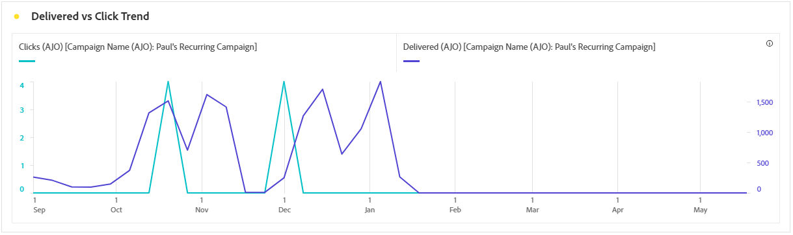

# Campagnerapport {#campaign-global-report-cja}

Het **rapport van de Campagne** handelt als uitvoerig dashboard, dat een gedetailleerde analyse van zeer belangrijke metriek verbonden aan uw campagne verstrekt. Het omvat gegevens zoals kliktellingen, geleverde berichten, profielaantallen, en genomen acties. Door een volledig overzicht te bieden van de effectiviteit en de betrokkenheid van uw campagne, zorgt het rapport voor een grondig inzicht in de algemene prestaties van uw campagne.

Campagnerapporten zijn rechtstreeks vanuit uw campagne toegankelijk via de knop **[!UICONTROL Reports]** .

Het **rapport van de Campagne** pagina zal met de volgende lusjes afhankelijk van het gekozen kanaal worden getoond:

* [Campaign](#campaign-global)
* [Experimentatie](#experimentation)
* [Email](#email-global)
* [Sms](#sms)
* [Pushmelding](#push-notification)
* [Direct mail](#direct-mail)
* [Web](#web)
* [Inhoudskaart](#content-card)

Meer leren op Customer Journey Analytics Workspace en hoe te om gegevens te filtreren en te analyseren, verwijs naar [ deze pagina ](https://experienceleague.adobe.com/en/docs/analytics-platform/using/cja-workspace/home).

## Campaign {#campaign-global}

### Campagne-KPI&#39;s {#campaign-kpis}

De KPI&#39;s (Key Performance Indicators) van **[!UICONTROL Campaign]** functioneren als een allesomvattend dashboard, dat een analyse levert van essentiële metriek die aan uw campagne is gekoppeld. Dit omvat details zoals het aantal kliks en het aantal geleverde berichten, die een uitvoerig inzicht in de doeltreffendheid van uw campagne en het niveau van betrokkenheid aanbieden.

KPIs zal variëren gebaseerd op de kanalen die in uw campagne worden gebruikt.

+++ Meer informatie over de metriek van KPI&#39;s voor campagnes

* **[!UICONTROL Click through rate]**: percentage gebruikers dat met het bericht interactie heeft gehad.

* **[!UICONTROL Clicks]**: Het aantal keer dat er op de inhoud in het bericht is geklikt.

* **[!UICONTROL Delivered]**: Aantal verzonden e-mailberichten in verhouding tot het totale aantal verzonden berichten.

* **[!UICONTROL Displays]**: Het aantal keren dat het bericht is geopend.

+++

### Overzicht van Campaign {#delivery-global}

De tabel **[!UICONTROL Campaign overview]** fungeert als een uitgebreid dashboard met een gedetailleerde uitsplitsing van de belangrijkste maatstaven voor uw campagne. Dit omvat essentiële informatie zoals het aantal profielen en de geleverde acties, die een grondig inzicht in de prestaties en de betrokkenheid van uw campagne verstrekken.

Merk op dat de metriek zal variëren gebaseerd op de kanalen die in uw campagne worden gebruikt.

+++ Meer informatie over de maatstaven van het overzicht van campagnes

* **[!UICONTROL People]**: Aantal gebruikersprofielen dat als doelprofielen voor uw berichten in aanmerking komt.

* **[!UICONTROL Click through rate]**: percentage gebruikers dat met het bericht interactie heeft gehad.

* **[!UICONTROL Clicks]**: Het aantal keer dat er op de inhoud in het bericht is geklikt.

* **[!UICONTROL Unique Clicks]**: Aantal profielen dat op de inhoud van het bericht heeft geklikt.

* **[!UICONTROL Delivered]**: Aantal verzonden e-mailberichten in verhouding tot het totale aantal verzonden berichten.

* **[!UICONTROL Bounces for outbound channels]**: Het totale aantal fouten dat tijdens het verzendproces is gecumuleerd en de automatische retourverwerking in verhouding tot het totale aantal verzonden berichten.

* **[!UICONTROL Outbound Errors]**: het totale aantal fouten dat is opgetreden tijdens het verzendproces waardoor het niet naar profielen kan worden verzonden.

* **[!UICONTROL Outbound Exclusions]**: aantal profielen dat door Adobe Journey Optimizer is uitgesloten.

* **[!UICONTROL Displays]**: Het aantal keren dat het bericht is geopend.

* **[!UICONTROL Unique displays]**: Het aantal keren dat het bericht is geopend, wordt er geen rekening gehouden met meerdere interacties van één profiel.

+++

### Resultaten van Campagnescheitrechter {#campaign-funnel}

In de grafiek van **[!UICONTROL Campaign funnel results]** wordt een gedetailleerde analyse gegeven van de betrokkenheid van uw profielen bij uw berichten. Deze grafiek biedt waardevolle inzichten in de interactie tussen verschillende profielen en uw inhoud.

+++ Meer informatie over de resultaten van Campagne-trechter

* **[!UICONTROL Delivered]**: Aantal verzonden e-mailberichten in verhouding tot het totale aantal verzonden berichten.

* **[!UICONTROL Clicks]**: Het aantal keer dat er op de inhoud in het bericht is geklikt.
+++

### Label van bijgehouden koppeling {#campaign-track}

De tabel **[!UICONTROL Tracked link label]** biedt essentiële inzichten in de betrokkenheid van uw bezoekers bij de URL&#39;s die in uw berichten zijn opgenomen en biedt waardevolle informatie over de koppelingen die de meeste interactie aantrekken.

+++ Meer informatie over metriek van tracklabels

* **[!UICONTROL Unique Clicks]**: Aantal profielen dat op de inhoud van het bericht heeft geklikt.

* **[!UICONTROL Clicks]**: Het aantal keer dat er op de inhoud in het bericht is geklikt.

+++

## Experimentatie {#experimentation}

Het tabblad **[!UICONTROL Experimentation]** biedt belangrijke inzichten in de prestaties van elke variant en identificeert de meest succesvolle variant.

Het kan enige tijd duren om de beste uitvoerder te definiëren. Als uw experiment niet succesvol is, zal het aan **Onovertuigend** worden geplaatst.

### ExperimentatiekPI&#39;s {#experimentation-kpis}

De KPI&#39;s (Key Performance Indicators) van **[!UICONTROL Experimentation]** functioneren als een allesomvattend dashboard, dat een analyse levert van essentiële metriek die aan uw experimentatie is gekoppeld.

+++ Meer informatie over KPI&#39;s-meetgegevens voor experimenten

* **[!UICONTROL Lift]**: maat voor de procentuele verbetering van de conversiesnelheid van een bepaalde behandeling ten opzichte van de basislijn.

* **[!UICONTROL Confidence]**: Bewijs dat een bepaalde behandeling gelijk is aan de basisbehandeling. [Meer informatie](../content-management/experiment-calculations.md#understand-confidence)

+++

### Variant volgens binnenkomende klikken {#variant-inbound}

De **[!UICONTROL Variant by Inbound clicks]** -widget geeft de prestaties van elke variant weer.
Voor diepte-duik in deze resultaten en hoe te om hen te interpreteren, verwijs naar [ deze pagina ](../content-management/get-started-experiment.md#interpret-results).

+++ Leer meer op Variant door Binnenkomende klikmetriek

* **[!UICONTROL People]**: Aantal gebruikersprofielen dat als doelprofielen voor uw berichten in aanmerking komt.

* **[!UICONTROL Inbound Clicks]**: Het totale aantal klikken over uitgaande kanalen.

* **[!UICONTROL Conversion rate]**: de totale waarde van de metrische waarde voor succes die eerder is geselecteerd bij het maken van uw experimenten, gedeeld door het aantal profielen.

* **[!UICONTROL Lift]**: maat voor de procentuele verbetering van de conversiesnelheid van een bepaalde behandeling ten opzichte van de basislijn.

* **[!UICONTROL Confidence]**: Bewijs dat een bepaalde behandeling gelijk is aan de basisbehandeling. [Meer informatie](../content-management/experiment-calculations.md#understand-confidence)

<!--
* **[!UICONTROL Confidence Upper bound]**:

* **[!UICONTROL Confidence Lower bound]**:
-->
+++

### Conversiesnelheid voor binnenkomende klikken {#conversion-rate}

De grafiek van **[!UICONTROL Confidence interval]** meet onzekerheid rond verbetering. Het geeft het procentuele verschil in prestaties weer tussen de basislijn en de best presterende behandeling. [Meer informatie](../content-management/experiment-calculations.md#confidence-intervals).

## Email {#email-global}

### Geleverde versus klik trend {#delivered-click}

In de grafiek van **[!UICONTROL Delivered vs Click trend]** wordt een gedetailleerde analyse gegeven van de betrokkenheid van uw profielen bij uw e-mails. Deze grafiek biedt waardevolle inzichten in de interactie tussen profielen en uw inhoud.

+++ Meer informatie over cijfers over trends bij levering en klik op trends

* **[!UICONTROL Delivered]**: Aantal verzonden e-mailberichten in verhouding tot het totale aantal verzonden e-mails.

* **[!UICONTROL Clicks]**: Het aantal keer dat er op de inhoud in uw e-mails is geklikt.

+++

### Leveringsstatus {#delivery-status}

De grafiek van **[!UICONTROL Delivery status]** biedt een uitgebreide weergave van gegevens met betrekking tot verzonden e-mailberichten in uw campagne en biedt inzicht in belangrijke metriek zoals geleverde gegevens en stuitingen. Dit maakt een gedetailleerde analyse van het verzendingsproces van e-mail mogelijk en biedt waardevolle informatie over de efficiëntie en prestaties van uw campagnes.

+++ Meer informatie over de afleveringsstatus

* **[!UICONTROL Delivered]**: Aantal verzonden e-mailberichten in verhouding tot het totale aantal verzonden e-mails.

* **[!UICONTROL Bounces for outbound channels]**:Totaal aantal fouten gecumuleerd tijdens het verzendproces en automatische retourverwerking in verhouding tot het totale aantal verzonden berichten.

* **[!UICONTROL Outbound errors]**: het totale aantal fouten dat is opgetreden tijdens het verzendingsproces waardoor het niet naar profielen kan worden verzonden.

* **[!UICONTROL Outbound exclusions]**: aantal profielen dat door Adobe Journey Optimizer is uitgesloten.

+++

### Verzendstatistieken {#sending-statistics-email}

De tabel **[!UICONTROL Sending Statistics]** bevat een uitgebreid overzicht van essentiële gegevens over e-mails in uw campagnes. Het bevat belangrijke metriek, zoals de interactie met uw e-mails en het aantal e-mails dat met succes is bezorgd. Het biedt waardevolle inzichten in de effectiviteit en het bereik van uw e-mails en campagnes.

+++ Meer informatie over het verzenden van statistieken

* **[!UICONTROL People]**: Aantal gebruikersprofielen dat als doelprofielen voor uw berichten in aanmerking komt.

* **[!UICONTROL Targeted]**: Het totale aantal e-mailberichten dat tijdens het verzendproces is verwerkt.

* **[!UICONTROL Sends]**: Het totale aantal verzendingen voor uw e-mail.

* **[!UICONTROL Delivered]**: Aantal verzonden e-mailberichten in verhouding tot het totale aantal verzonden berichten.

* **[!UICONTROL Bounces for outbound channels]**: het totaal aan fouten dat tijdens het verzendproces is gecumuleerd en de automatische retourverwerking in verhouding tot het totale aantal verzonden berichten.

* **[!UICONTROL Outbound Errors]**: het totale aantal fouten dat is opgetreden tijdens het verzendproces waardoor het niet naar profielen kan worden verzonden.

* **[!UICONTROL Outbound Exclusions]**: aantal profielen dat door Adobe Journey Optimizer is uitgesloten.

+++

### Trackingstatistieken {#tracking-statistics-email}

De tabel **[!UICONTROL Email - Tracking statistics]** bevat een gedetailleerd overzicht van de profielactiviteiten met betrekking tot e-mails die in uw campagne zijn opgenomen. Dit omvat cijfers over het openen, klikken en andere relevante betrokkenheidsindicatoren, die een uitgebreid overzicht bieden van hoe profielen met uw e-mailinhoud communiceren.

+++ Meer informatie over statistieken bijhouden

* **[!UICONTROL Click through rate (CTR)]**: percentage gebruikers dat interactie heeft gehad met het e-mailbericht.

* **[!UICONTROL Click through open rate (CTOR)]**: Het aantal keren dat de e-mail is geopend.

* **[!UICONTROL Clicks]**: Het aantal keer dat er op de inhoud in uw e-mails is geklikt.

* **[!UICONTROL Unique Clicks]**: Aantal profielen dat op de inhoud van een e-mail heeft geklikt.

* **[!UICONTROL Email Opens]**: Het aantal keren dat uw e-mails zijn geopend in een campagne.

* **[!UICONTROL Unique Email Opens]**: percentage geopende e-mailberichten.

* **[!UICONTROL Spam complaints]**: Het aantal keren dat een bericht is gedeclareerd als spam of junk.

* **[!UICONTROL Unsubscribes]**: Het aantal klikken op de koppeling voor het opzeggen van abonnementen.

+++

### E-maildomeinen {#email-domains}

De tabel van **[!UICONTROL Email Domains]** bevat een diepgaande uitsplitsing van e-mailberichten die zijn gecategoriseerd op domein. Hiermee krijgt u uitgebreide inzicht in de prestatiemetriek van uw e-mailcampagnes. Met deze uitgebreide analyse kunt u het gedrag van verschillende domeinen begrijpen als reactie op uw e-mailinhoud.

+++ Meer informatie over metriek van e-maildomeinen

* **[!UICONTROL Sends]**: Het totale aantal verzendingen voor uw e-mail.

* **[!UICONTROL Delivered]**: Aantal verzonden e-mailberichten in verhouding tot het totale aantal verzonden e-mails.

* **[!UICONTROL Email Opens]**: Het aantal keren dat uw e-mails zijn geopend in een campagne.

* **[!UICONTROL Clicks]**: Het aantal keer dat er op de inhoud in uw e-mails is geklikt.

* **[!UICONTROL Bounces for outbound channels]**: Het totale aantal fouten dat tijdens het verzendproces is gecumuleerd en de automatische retourverwerking in verhouding tot het totale aantal verzonden e-mails.

* **[!UICONTROL Outbound Errors]**: het totale aantal fouten dat is opgetreden tijdens het verzendproces waardoor het niet naar profielen kan worden verzonden.
+++

### Labels voor bijgehouden koppelingen {#track-link-label}

De tabel **[!UICONTROL Tracked link labels]** bevat een uitgebreid overzicht van de koppelingslabels in uw e-mails, waarin de labels worden gemarkeerd die het hoogste bezoekersverkeer genereren. Met deze functie kunt u de populairste koppelingen identificeren en er prioriteiten aan stellen.

+++ Meer informatie over metriek van tracklabels

* **[!UICONTROL Unique Clicks]**: Aantal profielen dat op de inhoud van een e-mail heeft geklikt.

* **[!UICONTROL Clicks]**: Het aantal keer dat er op de inhoud in uw e-mails is geklikt.

+++

### URL&#39;s van bijgehouden koppeling {#track-link-url}

De tabel **[!UICONTROL Tracked link URLs]** bevat een uitgebreid overzicht van de URL&#39;s in uw e-mail die het hoogste bezoekersverkeer aantrekken. Hierdoor kunt u de populairste koppelingen identificeren en er prioriteiten aan stellen, zodat u meer inzicht krijgt in de betrokkenheid bij profielen met specifieke inhoud in uw e-mails.

+++ Meer informatie over URL&#39;s met gekoppelde koppelingen

* **[!UICONTROL Unique Clicks]**: Aantal profielen dat op de inhoud van een e-mail heeft geklikt.

* **[!UICONTROL Clicks]**: Het aantal keer dat er op de inhoud in uw e-mails is geklikt.

* **[!UICONTROL Displays]**: Het aantal keren dat de e-mail is geopend.

* **[!UICONTROL Unique displays]**: Het aantal keren dat de e-mail is geopend, wordt geen rekening gehouden met meerdere interacties van één profiel.

+++

### E-mailonderwerpen {#email-subjects}

De tabel **[!UICONTROL Email subjects]** bevat een uitgebreid overzicht van e-mailonderwerpen die het hoogste bezoekersverkeer hebben aangetrokken. Deze bron biedt waardevolle inzichten in de dynamiek van de betrokkenheid van het publiek.

+++ Meer informatie over metrische gegevens over e-mailonderwerpen

* **[!UICONTROL People]**: Aantal gebruikersprofielen dat in aanmerking komt als doelprofielen voor uw e-mails.

+++

### Uitgesloten redenen {#excluded-reasons}

De tabel **[!UICONTROL Excluded reasons]** bevat een uitgebreide weergave van de verschillende factoren die ertoe hebben geleid dat gebruikersprofielen zijn uitgesloten van het doelpubliek, waardoor het bericht niet is ontvangen.

Verwijs naar [ deze pagina ](exclusion-list.md) voor de uitvoerige lijst van uitsluitingsredenen.

### Stuitingsredenen {#bounce-reasons-email}

In de tabel **[!UICONTROL Bounce Reasons]** worden de beschikbare gegevens met betrekking tot teruggestuurde berichten gecompileerd, zodat u gedetailleerde informatie krijgt over de specifieke redenen voor e-mailblokkeringen.

Voor meer informatie over grenzen, verwijs naar de [ lijst van de Onderdrukking ](../reports/suppression-list.md) pagina.

### Foutredenen {#error-reasons-email}

De tabel **[!UICONTROL Error Reasons]** biedt zichtbaarheid in de specifieke fouten die tijdens het verzendproces zijn opgetreden en biedt waardevolle informatie over de aard en het optreden van fouten.

## Sms {#sms}

### Geleverde versus klik trend {#delivered-click-sms}

In de grafiek van **[!UICONTROL Delivered vs Click trend]** wordt een gedetailleerde analyse gegeven van de betrokkenheid van uw profielen bij uw e-mails. Deze grafiek biedt waardevolle inzichten in de interactie tussen profielen en uw inhoud.

+++ Meer informatie over cijfers over trends bij levering en klik op trends

* **[!UICONTROL Delivered]**: Het aantal SMS-berichten dat is verzonden in verhouding tot het totale aantal SMS-berichten.

* **[!UICONTROL Clicks]**: Het aantal keer dat er op de inhoud is geklikt in uw SMS-berichten.

+++

### Leveringsstatus {#delivery-status-sms}

De tabel **[!UICONTROL Delivery status]** bevat een gedetailleerd overzicht van de profielactiviteiten met betrekking tot uw SMS-campagnes. Dit omvat metriek over geleverde, kliks, en andere relevante betrokkenheidsindicatoren, die een uitvoerig overzicht van aanbieden hoe de profielen met uw inhoud van SMS interactie aangaan.

+++ Meer informatie over de afleveringsstatus

* **[!UICONTROL Delivered]**: Het aantal SMS-berichten dat is verzonden in verhouding tot het totale aantal SMS-berichten.

* **[!UICONTROL Bounces for outbound channels]**: het totaal aan fouten dat tijdens het verzendproces is gecumuleerd en de automatische retourverwerking in verhouding tot het totale aantal verzonden SMS-berichten.

* **[!UICONTROL Outbound errors]**: het totale aantal fouten dat is opgetreden om te voorkomen dat deze naar profielen werd verzonden.

* **[!UICONTROL Outbound exclusions]**: aantal profielen dat door Adobe Journey Optimizer is uitgesloten.

+++

### Labels voor bijgehouden koppelingen {#track-link-label-sms}

De tabel **[!UICONTROL Tracked link labels]** bevat een uitgebreid overzicht van de koppelingslabels in uw SMS-berichten, waarin de labels worden gemarkeerd die het hoogste bezoekersverkeer genereren. Met deze functie kunt u de populairste koppelingen identificeren en er prioriteiten aan stellen.

+++ Meer informatie over metriek van tracklabels

* **[!UICONTROL Unique Clicks]**: Aantal profielen dat op een inhoud in uw SMS-bericht heeft geklikt.

* **[!UICONTROL Clicks]**: Het aantal keer dat er op de inhoud is geklikt in uw SMS-berichten.

+++

### URL&#39;s van bijgehouden koppeling {#track-link-url-sms}

De tabel **[!UICONTROL Tracked link URLs]** bevat een uitgebreid overzicht van de URL&#39;s in uw SMS-berichten die het hoogste bezoekersverkeer aantrekken. Hierdoor kunt u de populairste koppelingen identificeren en er prioriteiten aan stellen, zodat u meer inzicht krijgt in de betrokkenheid bij profielen met specifieke inhoud in uw SMS-berichten.

+++ Meer informatie over URL&#39;s met gekoppelde koppelingen

* **[!UICONTROL Unique Clicks]**: Aantal profielen dat op een inhoud in uw SMS-bericht heeft geklikt.

* **[!UICONTROL Clicks]**: Het aantal keer dat er op de inhoud is geklikt in uw SMS-berichten.

* **[!UICONTROL Displays]**: Het aantal keren dat het bericht is geopend.

* **[!UICONTROL Unique displays]**: Het aantal keren dat het bericht is geopend, wordt er geen rekening gehouden met meerdere interacties van één profiel.

+++

### Binnenkomend SMS-bericht {#sms-inbound}

De tabel **[!UICONTROL SMS inbound message]** bevat een uitgebreid overzicht van de SMS-berichten die het hoogste bezoekersverkeer hebben aangetrokken. Deze bron biedt waardevolle inzichten in de dynamiek van de betrokkenheid van het publiek.

+++ Meer informatie over cijfers voor inkomende SMS-berichten

* **[!UICONTROL People]**: Aantal gebruikersprofielen dat in aanmerking komt als doelprofielen voor uw SMS-berichten.

+++

### Het type SMS-bericht {#sms-message-type}

De tabel **[!UICONTROL SMS Message type]** bevat een uitgebreid overzicht van het type SMS-bericht dat het hoogste bezoekersverkeer heeft aangetrokken. Deze bron biedt waardevolle inzichten in de dynamiek van de betrokkenheid van het publiek.

+++ Meer informatie over de afmetingen voor SMS-berichten

* **[!UICONTROL People]**: Aantal gebruikersprofielen dat in aanmerking komt als doelprofielen voor uw SMS-berichten.

+++

### SMS-providers {#sms-providers}

De tabel **[!UICONTROL SMS providers]** bevat een uitgebreid overzicht van de SMS-providers die het hoogste bezoekersverkeer hebben aangetrokken. Deze bron biedt waardevolle inzichten in de dynamiek van de betrokkenheid van het publiek.

+++ Meer informatie over meetgegevens van SMS-providers

* **[!UICONTROL People]**: Aantal gebruikersprofielen dat in aanmerking komt als doelprofielen voor uw SMS-berichten.

+++

### Stuitingsredenen {#bounce-reasons-sms}

De tabel **[!UICONTROL Bounces Reasons]** biedt een uitgebreid overzicht van gegevens met betrekking tot verzonden SMS-berichten, waarmee u waardevolle inzichten kunt krijgen over de specifieke redenen achter sms-berichten.

### Foutredenen {#error-reasons-sms}

In de tabel **[!UICONTROL Error Reasons]** kunt u de specifieke fouten identificeren die zijn opgetreden tijdens het verzenden van uw SMS-berichten. Zo kunt u een grondige analyse van alle ondervonden problemen maken.

### Redenen uitsluiten {#excluded-reasons-sms}

In de tabel **[!UICONTROL Exclude Reasons]** worden visueel de verschillende factoren weergegeven die hebben geleid tot de uitsluiting van gebruikersprofielen van het doelpubliek, zodat gebruikers uw SMS-berichten niet kunnen ontvangen.

Verwijs naar [ deze pagina ](exclusion-list.md) voor de uitvoerige lijst van uitsluitingsredenen.

## Pushmelding {#push-notification}

### Verzendstatistieken {#sending-statistics-push}

De tabel **[!UICONTROL Sending Statistics]** bevat een uitgebreid overzicht van de belangrijkste gegevens over uw pushberichtcampagnes. Het bevat belangrijke metriek zoals de grootte van het beoogde publiek en het aantal pushberichten dat succesvol is afgeleverd. Het biedt waardevolle inzichten in de effectiviteit en het bereik van uw pushmelding.

+++ Meer informatie over het verzenden van statistieken

* **[!UICONTROL People]**: Aantal gebruikersprofielen dat in aanmerking komt als doelprofielen voor uw pushberichten.

* **[!UICONTROL Targeted]**: Het totale aantal pushmeldingen dat tijdens de analyse is verwerkt.

* **[!UICONTROL Sends]**: Het totale aantal verzendingen voor de pushmelding.

* **[!UICONTROL Delivered]**: Het aantal pushmeldingen dat is verzonden, in verhouding tot het totale aantal verzonden pushmeldingen.

* **[!UICONTROL Bounces for outbound channels]**: het totaal aan fouten dat tijdens het verzendproces is gecumuleerd en de automatische retourverwerking in verhouding tot het totale aantal pushmeldingen.

* **[!UICONTROL Outbound errors]**: het totale aantal fouten dat is opgetreden om te voorkomen dat deze naar profielen werd verzonden.

* **[!UICONTROL Outbound exclusions]**: aantal profielen dat door Adobe Journey Optimizer is uitgesloten.

+++

### Trackingstatistieken {#tracking-statistics-push}

De tabel van **[!UICONTROL Tracking statistics]** biedt een gedetailleerde momentopname van profielactiviteiten die aan uw pushmeldingen zijn gekoppeld, die essentiële inzichten in de doeltreffendheid van betrokkenheid en pushmeldingen biedt.

+++ Meer informatie over statistieken bijhouden

* **[!UICONTROL Click through rate (CTR)]**: percentage gebruikers dat heeft gereageerd op de pushberichten.

* **[!UICONTROL Click through open rate (CTOR)]**: Het aantal keren dat de pushmeldingen zijn geopend.

* **[!UICONTROL Clicks]**: Het aantal keer dat er op de inhoud is geklikt in uw pushberichten.

* **[!UICONTROL Unique Clicks]**: Aantal profielen dat op een inhoud in uw pushberichten heeft geklikt.

<!--
* **[!UICONTROL Push custom actions]**: 
-->
+++

### Labels voor bijgehouden koppelingen {#track-link-label-push}

De tabel **[!UICONTROL Tracked link labels]** bevat een uitgebreid overzicht van de koppelingslabels in uw pushberichten, waarin de labels worden gemarkeerd die het hoogste bezoekersverkeer genereren. Met deze functie kunt u de populairste koppelingen identificeren en er prioriteiten aan stellen.

+++ Meer informatie over metriek van tracklabels

* **[!UICONTROL Unique Clicks]**: Aantal profielen dat op een inhoud in uw pushberichten heeft geklikt.

* **[!UICONTROL Clicks]**: Het aantal keer dat er op de inhoud is geklikt in uw pushberichten.

+++

### URL&#39;s van bijgehouden koppeling {#track-link-url-push}

De tabel **[!UICONTROL Tracked link URLs]** bevat een uitgebreid overzicht van de URL&#39;s in uw pushberichten die het hoogste bezoekersverkeer aantrekken. Hierdoor kunt u de populairste koppelingen identificeren en er prioriteiten aan stellen, zodat u meer inzicht krijgt in de betrokkenheid bij profielen met specifieke inhoud in uw pushberichten.

+++ Meer informatie over URL&#39;s met gekoppelde koppelingen

* **[!UICONTROL Unique Clicks]**: Aantal profielen dat op een inhoud in uw pushberichten heeft geklikt.

* **[!UICONTROL Clicks]**: Het aantal keer dat er op de inhoud is geklikt in uw pushberichten.

+++

### Stuitingsredenen {#bounce-reasons-push}

De tabel van **[!UICONTROL Bounces Reasons]** biedt een uitgebreid overzicht van gegevens met betrekking tot gepushte pushberichten, waarmee u waardevolle inzichten krijgt over de specifieke redenen voor het wegvallen van pushberichten.

### Foutredenen {#error-reasons-push}

In de tabel **[!UICONTROL Error Reasons]** kunt u de specifieke fouten identificeren die zijn opgetreden tijdens het verzenden van uw pushberichten. Zo kunt u een grondige analyse van alle ondervonden problemen mogelijk maken.

### Uitgesloten redenen {#exclude-reasons-push}

In de tabel **[!UICONTROL Exclude Reasons]** worden visueel de verschillende factoren weergegeven die ertoe hebben geleid dat gebruikersprofielen zijn uitgesloten van het doelpubliek, zodat gebruikers uw pushberichten niet kunnen ontvangen.

Verwijs naar [ deze pagina ](exclusion-list.md) voor de uitvoerige lijst van uitsluitingsredenen.

## In-app {#in-app}

### Impressie en klik op trend {#impression-click-trend}

De grafiek van **[!UICONTROL Impression & Click trend]** bevat een gedetailleerde analyse van de betrokkenheid van uw profielen bij uw In-app-berichten. Deze grafiek biedt waardevolle inzichten in de interactie tussen profielen en uw inhoud.

+++ Meer informatie over depressie en klik op cijfers over trends

* **[!UICONTROL Clicks]**: Het aantal keren dat er op de inhoud is geklikt in uw In-app-berichten.

* **[!UICONTROL Displays]**: Het aantal keren dat het bericht is geopend.

+++

### Klikken {#clicks-inapp}

In de grafiek van **[!UICONTROL Clicks]** worden in-app klikgegevens weergegeven, die zowel het totale aantal klikken op inhoud als het aantal unieke profielen weergeven die op de inhoud hebben geklikt.

+++ Meer informatie over maatstaven klikken

* **[!UICONTROL Unique Clicks]**: Aantal profielen dat op een inhoud in uw In-app-berichten heeft geklikt

* **[!UICONTROL Clicks]**: Het aantal keren dat er op de inhoud is geklikt in uw In-app-berichten.

+++

### Weergave {#display-inapp}

De grafiek van **[!UICONTROL Displays]** helpt u zowel het algemene bereik van het bericht als het aantal unieke profielen begrijpen die met het verbinden.

+++ Meer informatie over weergavemeetgegevens

* **[!UICONTROL Displays]**: Het aantal keren dat het bericht is geopend.

* **[!UICONTROL Unique displays]**: Het aantal keren dat het bericht is geopend, wordt er geen rekening gehouden met meerdere interacties van één profiel.

+++

### Gegevens bijhouden {#tracking-data-inapp}

De tabel **[!UICONTROL Tracking data]** bevat een gedetailleerde momentopname van profielactiviteiten die aan uw In-app-berichten zijn gekoppeld. Deze tabel biedt essentiële inzichten in de betrokkenheid en de doeltreffendheid van in-app-berichten.

+++ Meer informatie over het bijhouden van gegevens

* **[!UICONTROL People]**: Aantal gebruikersprofielen dat in aanmerking komt als doelprofielen voor uw berichten in de app.

* **[!UICONTROL Click through rate (CTR)]**: percentage gebruikers dat interactie had met de berichten in de app.

* **[!UICONTROL Click through open rate (CTOR)]**: Het aantal keren dat de berichten in de app zijn geopend.

* **[!UICONTROL Clicks]**: Het aantal keren dat er op de inhoud is geklikt in uw In-app-berichten.

* **[!UICONTROL Unique Clicks]**: Aantal profielen dat op een inhoud in uw In-app berichten klikte.

* **[!UICONTROL Displays]**: Het aantal keren dat het bericht is geopend.

* **[!UICONTROL Unique displays]**: Het aantal keren dat het bericht is geopend, wordt er geen rekening gehouden met meerdere interacties van één profiel.

* **[!UICONTROL Sends]**: Het totale aantal verzendingen voor uw in-app-berichten.

<!--
* **[!UICONTROL Inbound triggered]**: 

* **[!UICONTROL Inbound dismisses]**: 
-->
+++

### Labels voor bijgehouden koppelingen {#track-link-label-inapp}

De tabel **[!UICONTROL Tracked link labels]** bevat een uitgebreid overzicht van de koppelingslabels in uw In-app-berichten, waarin de labels worden gemarkeerd die het hoogste bezoekersverkeer genereren. Met deze functie kunt u de populairste koppelingen identificeren en er prioriteiten aan stellen.

+++ Meer informatie over metriek van tracklabels

* **[!UICONTROL Unique Clicks]**: Aantal profielen dat op een inhoud in uw In-app berichten klikte.

* **[!UICONTROL Clicks]**: Het aantal keren dat er op de inhoud is geklikt in uw In-app-berichten.

* **[!UICONTROL Displays]**: Het aantal keren dat het bericht is geopend.

* **[!UICONTROL Unique displays]**: Het aantal keren dat het bericht is geopend, wordt er geen rekening gehouden met meerdere interacties van één profiel.

+++

### URL&#39;s van bijgehouden koppeling {#track-link-url-inapp}

De tabel **[!UICONTROL Tracked link URLs]** bevat een uitgebreid overzicht van de URL&#39;s in uw In-app-berichten die het hoogste bezoekersverkeer aantrekken. Hierdoor kunt u de populairste koppelingen identificeren en er prioriteiten aan stellen, zodat u meer inzicht krijgt in de betrokkenheid bij profielen met specifieke inhoud in uw In-app-berichten.

+++ Meer informatie over URL&#39;s met gekoppelde koppelingen

* **[!UICONTROL Unique Clicks]**: Aantal profielen dat op een inhoud in uw In-app berichten klikte.

* **[!UICONTROL Clicks]**: Het aantal keren dat er op de inhoud is geklikt in uw In-app-berichten.

+++

## Direct mail {#direct-mail}

### Verzendstatistieken {#sending-statistics-directmail}

De tabel **[!UICONTROL Sending Statistics]** bevat een uitgebreid overzicht van de belangrijkste gegevens over uw e-mailcampagnes. Het geeft belangrijke metriek zoals de grootte van het gerichte publiek en het aantal met succes geleverde directe post aan, die waardevolle inzichten in de doeltreffendheid en het bereik van uw direct-mailberichten aanbieden.

+++ Meer informatie over het verzenden van statistieken

* **[!UICONTROL People]**: Aantal gebruikersprofielen dat als doelprofielen voor uw berichten in aanmerking komt.

* **[!UICONTROL Targeted]**: Het totale aantal direct-mailberichten dat tijdens het verzendingsproces is verwerkt.

* **[!UICONTROL Sends]**: Het totale aantal verzendingen voor uw direct-mailberichten.

* **[!UICONTROL Delivered]**: Aantal verzonden direct-mailberichten in verhouding tot het totale aantal verzonden berichten.

* **[!UICONTROL Outbound Errors]**: het totale aantal fouten dat is opgetreden tijdens het verzendproces waardoor het niet naar profielen kan worden verzonden.

* **[!UICONTROL Outbound Exclusions]**: aantal profielen dat door Adobe Journey Optimizer is uitgesloten.

+++

### Leveringsstatus {#delivery-status-directmail}

De grafiek van **[!UICONTROL Delivery status]** verstrekt een uitvoerige mening van gegevens met betrekking tot verzonden direct-mailberichten in uw campagne, die inzicht in zeer belangrijke metriek zoals geleverde en fouten aanbieden. Dit maakt een gedetailleerde analyse mogelijk van het proces voor het verzenden van direct-mailberichten, waarbij waardevolle informatie wordt verschaft over de efficiëntie en prestaties van uw campagnes.

+++ Meer informatie over de afleveringsstatus

* **[!UICONTROL Delivered]**: Aantal verzonden direct-mailberichten in verhouding tot het totale aantal verzonden direct-mailberichten.

* **[!UICONTROL Outbound errors]**: Het totale aantal fouten dat is opgetreden tijdens het verzenden van uw e-mailberichten om te voorkomen dat deze naar profielen worden verzonden.

* **[!UICONTROL Ountbound exclusions]**: aantal profielen dat door Adobe Journey Optimizer is uitgesloten.

+++

### Foutredenen {#error-reasons-directmail}

In de tabel **[!UICONTROL Error Reasons]** kunt u de specifieke fouten identificeren die zijn opgetreden tijdens het verzenden van uw e-mailberichten. Zo kunt u een grondige analyse van alle ondervonden problemen maken.

### Uitgesloten redenen {#exclude-reasons-directmail}

In de tabel **[!UICONTROL Exclude Reasons]** worden visueel de verschillende factoren weergegeven die hebben geleid tot de uitsluiting van gebruikersprofielen van het doelpubliek, zodat deze geen direct-mailberichten kunnen ontvangen.

Verwijs naar [ deze pagina ](exclusion-list.md) voor de uitvoerige lijst van uitsluitingsredenen.

## Web {#web}

### Impressie en klik op trend {#impressions-web}

In de grafiek van **[!UICONTROL Impression & Click trend]** wordt een gedetailleerde analyse gegeven van de betrokkenheid van uw profielen bij uw webpagina&#39;s. Deze grafiek biedt waardevolle inzichten in de interactie tussen profielen en uw inhoud.

+++ Meer informatie over depressie en klik op cijfers over trends

* **[!UICONTROL Clicks]**: Het aantal keren dat op de webpagina&#39;s op de inhoud is geklikt.

* **[!UICONTROL Displays]**: Het aantal keren dat het bericht is geopend.

+++

### Klikken {#clicks-web}

De grafiek van **[!UICONTROL Clicks]** toont Web-pagina klikmetriek, die zowel het totale aantal inhoud klikt als het aantal unieke profielen toont die op de inhoud klikte.

+++ Meer informatie over maatstaven klikken

* **[!UICONTROL Unique Clicks]**: Aantal profielen dat op een inhoud in uw Web-pagina&#39;s klikte.

* **[!UICONTROL Clicks]**: Het aantal keren dat op de webpagina&#39;s op de inhoud is geklikt.

+++

### Weergaven {#displays-web}

De grafiek van **[!UICONTROL Displays]** helpt u zowel het algemene bereik van het bericht als het aantal unieke profielen begrijpen die met het verbinden.

+++ Meer informatie over weergavemeetgegevens

* **[!UICONTROL Displays]**: Het aantal keren dat het bericht is geopend.

* **[!UICONTROL Unique displays]**: Het aantal keren dat het bericht is geopend, wordt er geen rekening gehouden met meerdere interacties van één profiel.

+++

### Gegevens bijhouden {#track-data-web}

De tabel van **[!UICONTROL Tracking data]** biedt een gedetailleerde momentopname van profielactiviteiten die aan uw Web-pagina&#39;s zijn gekoppeld, die essentiële inzichten in betrokkenheid en doeltreffendheid van Web-pagina&#39;s verstrekken.

+++ Meer informatie over het bijhouden van gegevens

* **[!UICONTROL People]**: Aantal gebruikersprofielen dat als doelprofielen voor uw Web-pagina&#39;s kwalificeert.

* **[!UICONTROL Click through rate (CTR)]**: percentage gebruikers dat interactie heeft gehad met de webpagina&#39;s.

* **[!UICONTROL Clicks]**: Het aantal keren dat op de webpagina&#39;s op de inhoud is geklikt.

* **[!UICONTROL Unique Clicks]**: Aantal profielen dat op een inhoud in uw Web-pagina&#39;s klikte.

* **[!UICONTROL Displays]**: Het aantal keren dat de webpagina is geopend.

* **[!UICONTROL Unique displays]**: Het aantal keren dat de webpagina is geopend, wordt geen rekening gehouden met meerdere interacties van één profiel.

+++

### Labels voor bijgehouden koppelingen {#track-link-web}

De tabel **[!UICONTROL Tracked link labels]** bevat een uitgebreid overzicht van de koppelingslabels in uw webpagina&#39;s, waarin de labels worden gemarkeerd die het hoogste bezoekersverkeer genereren. Met deze functie kunt u de populairste koppelingen identificeren en er prioriteiten aan stellen.

+++ Meer informatie over metriek van tracklabels

* **[!UICONTROL Unique Clicks]**: Aantal profielen dat op een inhoud in uw Web-pagina&#39;s klikte.

* **[!UICONTROL Clicks]**: Het aantal keren dat op de webpagina&#39;s op de inhoud is geklikt.

* **[!UICONTROL Displays]**: Het aantal keren dat het bericht is geopend.

* **[!UICONTROL Unique displays]**: Het aantal keren dat het bericht is geopend, wordt er geen rekening gehouden met meerdere interacties van één profiel.

+++

### URL&#39;s van bijgehouden koppeling {#track-url-web}

De tabel **[!UICONTROL Tracked link URLs]** bevat een uitgebreid overzicht van de URL&#39;s in uw webpagina&#39;s die het hoogste bezoekersverkeer aantrekken. Hierdoor kunt u de populairste koppelingen identificeren en er prioriteiten aan stellen, zodat u meer inzicht krijgt in de betrokkenheid bij profielen met specifieke inhoud in uw webpagina&#39;s.

+++ Meer informatie over URL&#39;s met gekoppelde koppelingen

* **[!UICONTROL Unique Clicks]**: Aantal profielen dat op een inhoud in uw Web-pagina&#39;s klikte.

* **[!UICONTROL Clicks]**: Het aantal keren dat op de webpagina&#39;s op de inhoud is geklikt.

* **[!UICONTROL Displays]**: Het aantal keren dat het bericht is geopend.

* **[!UICONTROL Unique displays]**: Het aantal keren dat het bericht is geopend, wordt er geen rekening gehouden met meerdere interacties van één profiel.

+++

## Inhoudskaart {#content-card}

### Tendens weergeven en klikken {#display-click}

Met de **[!UICONTROL Display & click trend]** -grafieken kunt u zowel het algemene bereik van het bericht als het aantal unieke profielen dat ermee werkt, begrijpen.

+++ Meer informatie over weergave en klik op Metriek

* **[!UICONTROL Clicks]**: Het aantal keer dat er op de inhoudskaart op een inhoud is geklikt.

* **[!UICONTROL Displays]**: Het aantal keren dat het bericht is geopend.

* **[!UICONTROL Unique displays]**: Het aantal keren dat het bericht is geopend, wordt er geen rekening gehouden met meerdere interacties van één profiel.

+++

### Gegevens bijhouden {#tracking-data}

De tabel **[!UICONTROL Tracking data]** biedt een gedetailleerde momentopname van profielactiviteiten die zijn gekoppeld aan uw inhoudskaarten en biedt essentiële inzichten in de betrokkenheid en effectiviteit van de inhoudskaart.

+++ Meer informatie over het bijhouden van gegevens

* **[!UICONTROL People]**: Aantal gebruikersprofielen dat als doelprofielen voor uw inhoudskaarten wordt gekwalificeerd.

* **[!UICONTROL Click through rate (CTR)]**: percentage gebruikers dat interactie heeft gehad met de inhoudskaart.

* **[!UICONTROL Clicks]**: Het aantal keren dat op de inhoudskaart op de inhoud is geklikt.

* **[!UICONTROL Unique Clicks]**: Aantal profielen dat op de inhoud van de inhoudskaart heeft geklikt.

* **[!UICONTROL Displays]**: Het aantal keren dat het bericht is geopend.

* **[!UICONTROL Unique displays]**: Het aantal keren dat het bericht is geopend, wordt er geen rekening gehouden met meerdere interacties van één profiel.

+++

### Bijgehouden labels {#tracked-labels}

De tabel **[!UICONTROL Tracked labels]** bevat een uitgebreid overzicht van de koppelingslabels in uw inhoudskaarten, waarin de labels worden gemarkeerd die het hoogste bezoekersverkeer genereren. Met deze functie kunt u de populairste koppelingen identificeren en er prioriteiten aan stellen.

+++ Meer informatie over metrische gegevens van bijgehouden labels

* **[!UICONTROL Unique Clicks]**: Aantal profielen dat op een inhoud in uw inhoudskaarten heeft geklikt.

* **[!UICONTROL Clicks]**: Het aantal keer dat er op de inhoudskaarten is geklikt op de inhoud.

* **[!UICONTROL Displays]**: Het aantal keren dat het bericht is geopend.

* **[!UICONTROL Unique displays]**: Het aantal keren dat het bericht is geopend, wordt er geen rekening gehouden met meerdere interacties van één profiel.

+++

### URL&#39;s van bijgehouden koppeling {#tracked-link-url}

De tabel **[!UICONTROL Tracked link URLs]** biedt een uitgebreid overzicht van de URL&#39;s in de inhoudskaarten die het hoogste bezoekersverkeer aantrekken. Hierdoor kunt u de populairste koppelingen identificeren en er prioriteiten aan stellen, zodat u meer inzicht krijgt in de betrokkenheid bij profielen met specifieke inhoud in uw inhoudskaarten.

+++ Meer informatie over URL&#39;s met gekoppelde koppelingen

* **[!UICONTROL Unique Clicks]**: Aantal profielen dat op een inhoud in uw inhoudskaarten heeft geklikt.

* **[!UICONTROL Clicks]**: Het aantal keer dat er op de inhoudskaarten is geklikt op de inhoud.

+++
