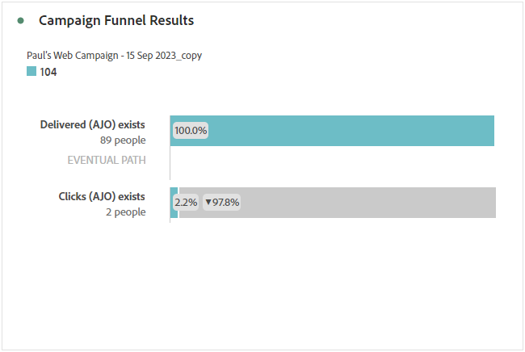

# Campagnerapport {#campaign-global-report-cja}

>[!BEGINSHADEBOX]

U kunt het campagnerapport openen door in uw campagne op de knop **[!UICONTROL Reports]** te klikken en vervolgens **[!UICONTROL View all time report]** te selecteren. [Meer informatie](report-gs-cja.md)

>[!ENDSHADEBOX]

## Campagne-KPI&#39;s {#campaign-kpis}

De KPI&#39;s (Key Performance Indicators) van **[!UICONTROL Campaign]** functioneren als een allesomvattend dashboard, dat een analyse levert van essentiële metriek die aan uw campagne is gekoppeld. Dit omvat details zoals het aantal kliks en het aantal geleverde berichten, die een uitvoerige insight in de doeltreffendheid en het niveau van betrokkenheid van uw campagne aanbieden.

KPIs zal variëren gebaseerd op de kanalen die in uw campagne worden gebruikt.

+++ Meer informatie over de metriek van KPI&#39;s voor campagnes

* **[!UICONTROL Click through rate]**: percentage gebruikers dat met het bericht interactie heeft gehad.

* **[!UICONTROL Clicks]**: Het aantal keer dat er op de inhoud in het bericht is geklikt.

* **[!UICONTROL Delivered]**: Aantal verzonden e-mailberichten in verhouding tot het totale aantal verzonden berichten.

* **[!UICONTROL Displays]**: Het aantal keren dat het bericht is geopend.

+++

>[!AVAILABILITY]
>Geordende campagnes ondersteunen alleen de SMS-, e-mail- en pushkanalen. Andere kanalen (In-app, Web, Direct mail, enz.) zijn niet beschikbaar in georkestreerde campagnes en verschijnen niet in rapportering.

### Overzicht van Campaign {#delivery-global}

De tabel **[!UICONTROL Campaign overview]** fungeert als een uitgebreid dashboard met een gedetailleerde uitsplitsing van de belangrijkste maatstaven voor uw campagne. Dit omvat essentiële informatie zoals het aantal profielen en de geleverde acties, die een grondig inzicht in de prestaties en de betrokkenheid van uw campagne verstrekken.

Merk op dat de metriek zal variëren gebaseerd op de kanalen die in uw campagne worden gebruikt.

+++ Meer informatie over de maatstaven van het overzicht van campagnes

* **[!UICONTROL People]**: Aantal gebruikersprofielen dat als doelprofielen voor uw berichten in aanmerking komt.

* **[!UICONTROL Click through rate]**: percentage gebruikers dat met het bericht interactie heeft gehad.

* **[!UICONTROL Clicks]**: Het aantal keer dat er op de inhoud in het bericht is geklikt.

* **[!UICONTROL Unique Clicks]**: Aantal profielen dat op de inhoud van het bericht heeft geklikt.

* **[!UICONTROL Delivered]**: Aantal verzonden e-mailberichten in verhouding tot het totale aantal verzonden berichten.

* **[!UICONTROL Bounces for outbound channels]**: Het totale aantal fouten dat tijdens het verzendproces is gecumuleerd en de automatische retourverwerking in verhouding tot het totale aantal verzonden berichten.

* **[!UICONTROL Outbound Errors]**: het totale aantal fouten dat is opgetreden tijdens het verzendproces waardoor het niet naar profielen kan worden verzonden.

* **[!UICONTROL Outbound Exclusions]**: aantal profielen dat door Adobe Journey Optimizer is uitgesloten. [&#x200B; Leer meer over hoe de uitsluitingen worden geteld &#x200B;](exclusion-list.md#exclusion-list).

* **[!UICONTROL Displays]**: Het aantal keren dat het bericht is geopend.

* **[!UICONTROL Unique displays]**: Het aantal keren dat het bericht is geopend, wordt er geen rekening gehouden met meerdere interacties van één profiel.

+++

### Funnel-resultaten voor campagne {#campaign-funnel}

In de grafiek van **[!UICONTROL Campaign funnel results]** wordt een gedetailleerde analyse gegeven van de betrokkenheid van uw profielen bij uw berichten. Deze grafiek biedt waardevolle inzichten in de interactie tussen verschillende profielen en uw inhoud.

+++ Meer informatie over de resultaten van Campagne funnel

* **[!UICONTROL Delivered]**: Aantal verzonden e-mailberichten in verhouding tot het totale aantal verzonden berichten.

* **[!UICONTROL Clicks]**: Het aantal keer dat er op de inhoud in het bericht is geklikt.
+++

### Label van bijgehouden koppeling {#campaign-track}

De tabel **[!UICONTROL Tracked link label]** biedt essentiële inzichten in de betrokkenheid van uw bezoekers bij de URL&#39;s die in uw berichten zijn opgenomen en biedt waardevolle informatie over de koppelingen die de meeste interactie aantrekken.

+++ Meer informatie over metriek van tracklabels

* **[!UICONTROL Unique Clicks]**: Aantal profielen dat op de inhoud van het bericht heeft geklikt.

* **[!UICONTROL Clicks]**: Het aantal keer dat er op de inhoud in het bericht is geklikt.

+++

## Overzicht van doelen {#targeting}

Als u **[!UICONTROL Targeting rules]** instelt voor uw inhoud, biedt de tabel van **[!UICONTROL Targeting overview]** een gedetailleerde weergave van de belangrijkste betrokkenheidsmetriek, waarmee u kunt zien hoe de doelprofielen voor elke regel reageren op uw inhoud.

➡️ [&#x200B; Leer meer bij het richten van regels &#x200B;](../campaigns/optimization-targeting.md)

+++ Meer informatie over gerichte overzichtsmetriek

* **[!UICONTROL People]**: Aantal gebruikersprofielen dat als doelprofielen voor uw gebeurtenissen wordt gekwalificeerd.

* **[!UICONTROL Unique Clicks]**: Aantal profielen dat op de inhoud van een e-mail heeft geklikt.

* **[!UICONTROL Unique click rate]**: percentage doelprofielen waarop ten minste één keer is geklikt.

+++
