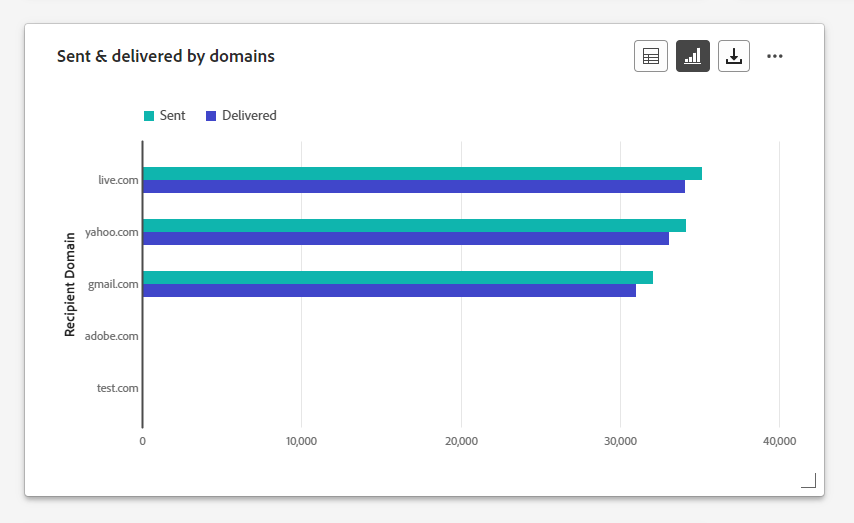
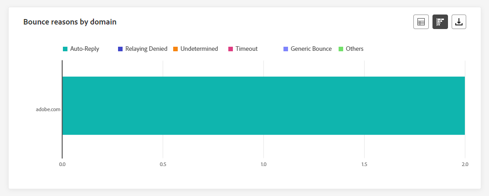
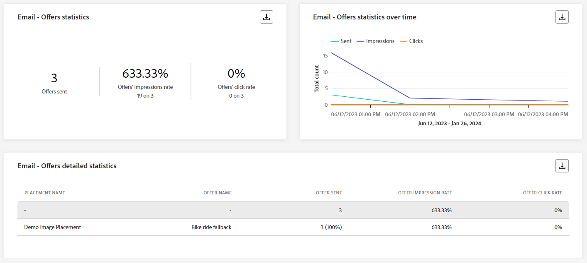
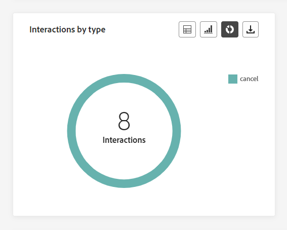

# Globaal verslag campagne voeren {#campaign-global-report}

>[!CONTEXTUALHELP]
>id="ajo_campaign_global_report"
>title="Globaal verslag campagne voeren"
>abstract="Met het algemene rapport Campagne kunt u het effect van uw campagnes over een bepaalde tijdsperiode meten. Uw rapport is verdeeld in verschillende widgets waarin het succes en de fouten van uw campagne worden beschreven. Elk rapportdashboard kan worden gewijzigd door widgets te vergroten of te verkleinen of te verwijderen."

>[!AVAILABILITY]
>
>De huidige ervaring met rapportage wordt met ingang van januari 2025 opgeheven. Na deze datum wordt de nieuwe ervaring met rapportage de norm. We raden u aan bekend te maken met de nieuwe functies en functies om een soepele overgang te garanderen. [ worden begonnen met Journey Optimizer nieuwe het Melden interface.](report-gs-cja.md)

Globale rapporten, toegankelijk van het **Al tijd** lusje, vertoningsgebeurtenissen die minstens twee uur geleden voorkwamen en gebeurtenissen over een geselecteerde tijdspanne behandelen. In vergelijking hiermee richten Live-rapporten zich op gebeurtenissen die zich in de afgelopen 24 uur hebben voorgedaan, met een minimale tijdsinterval van twee minuten vanaf het plaatsvinden van de gebeurtenis.

Via de knop **[!UICONTROL View report]** hebt u rechtstreeks vanuit uw campagne toegang tot het algemene rapport van de campagne.

De pagina Campagne **[!UICONTROL Global report]** wordt weergegeven met de volgende tabbladen:

* [Campaign](#campaign-global)
* [Email](#email-global)
* [In-app](#inapp-global)
* [Push](#push-global)
* [Sms](#sms-global)
* [Web](#web-tab)
* [Direct mail](#direct-mail-global)

De campagne **[!UICONTROL Global report]** is verdeeld in verschillende widgets waarin het succes van uw campagne en de fouten worden beschreven. Elke widget kan indien nodig worden vergroot of verkleind en verwijderd. Voor meer informatie over dit, verwijs naar deze [ sectie ](../reports/global-report.md#modify-dashboard).

Voor een gedetailleerde lijst van elke metrisch beschikbaar in Adobe Journey Optimizer, verwijs naar [ deze pagina ](global-report.md#list-of-components-global.md)

## Tabblad Campagne {#campaign-global}

>[!NOTE]
>
>Het deskundigenrapport is uitsluitend toegankelijk in verslagen van Customers Journey Analytics. [Meer informatie](campaign-global-report-cja-experimentation.md)

### Levering {#delivery-global}

>[!CONTEXTUALHELP]
>id="ajo_campaign_delivery_global"
>title="Statistieken van de campagne"
>abstract="De widget Statistieken van de campagne bevat de belangrijkste informatie met betrekking tot uw campagne, zoals de ingevoerde profielen en acties."

De KPI&#39;s van **[!UICONTROL Campaign's Statistics]** fungeren als een uitgebreid dashboard met een gedetailleerde uitsplitsing van de belangrijkste meetgegevens voor uw campagne. Dit omvat essentiële informatie zoals het aantal profielen en de geleverde acties, die een grondig inzicht in de prestaties en de betrokkenheid van uw campagne verstrekken.

+++ Meer informatie over statistische gegevens van campagne

* **[!UICONTROL Audience]**: aantal doelprofielen.

* **[!UICONTROL Actions delivered]**: Het totale aantal unieke tijden dat een handeling is uitgevoerd.

* **[!UICONTROL Actions failed in %]**: percentage unieke tijden dat een actie is mislukt in verhouding tot het totale aantal unieke tijden dat een actie is uitgevoerd.

+++

<!--
### Objectives report {#objectives-global}

The **[!UICONTROL Objectives]** tab allows you to better fine-tune your deliveries' reports by targeting one specific metric.

The **[!UICONTROL Objectives]** listed are linked to **[!UICONTROL Datasets]** that define a connection to a system in order to retrieve additional information. A list of built-in **[!UICONTROL Objectives]** is available but you can add your own by adding new **[!UICONTROL Dataset]**. For the detailed procedure, refer to this [section](../content-management/reporting-configuration.md).

After selecting the Objectives you want to target on, the two **[!UICONTROL Performance overview]** and **[!UICONTROL Campaign objective]** widgets will provide a detailed summary of your delivery performance. 

With the **[!UICONTROL Campaign objective]** widget, you can also choose to compare your main objective with another metric.

### Experimentation report {#experimentation-global}

>[!CONTEXTUALHELP]
>id="ajo_campaigns_content_experiment_click"
>title="Success metric"
>abstract="The total value of the Success metric, previously selected when creating your Experiments, divided by the number of profiles."

The **[!UICONTROL Experimentation]** tab provides key insights into the performance of each variant, and identifies the most successful one.

Note that defining the best performer might take some time, it will be represented by this icon .

+++Learn more on the different metrics and widgets available for the Experimentation report.

The **[!UICONTROL Experiment result]** widget details the performance of each variant. You can change your baseline by selecting one of the treatment from the **[!UICONTROL Baseline]** the drop-down. The best treatment will be represented with a star icon.

For a deep-dive in these results and how to interpret them, refer to [this page](../content-management/get-started-experiment.md#interpret-results).

The table presents the following metrics:

* **[!UICONTROL Lift over baseline]**: Measure of the percentage improvement in conversion rate of a given treatment over the baseline.

* **[!UICONTROL Confidence]**: Evidence that a given treatment is the same as the baseline treatment. [Learn more](../content-management/experiment-calculations.md#understand-confidence)

* **[!UICONTROL Unique outbound clicks]**: Total count of clicks across outbound channels.

* **[!UICONTROL Profiles]**: Number of profiles targeted for this treatment.

* **[!UICONTROL Unique outbound clicks/profiles]**: Total value of the Success metric, previously selected when creating your Experiments, divided by the number of profiles.

The **[!UICONTROL Confidence interval]** graph measures uncertainty around improvement. It details the percentage difference in performance between the baseline and the best performing treatment. [Learn more](../content-management/experiment-calculations.md#confidence-intervals). 

The last widget provides data related to the **[!UICONTROL Success metric]** you previously selected for your Treatments. You have the option to select a different targeted metric from the **[!UICONTROL Metric]** drop-down menu to track alternative data.
    
>[!CAUTION]
>
>When working with experimentation filtered metrics, please note that changing the Metric selection from the drop-down on the comparison page for experimentation will not retain the filter value. For example, switching from "Clicks" to "Unique clicks" will lead to the loss of the applied filter, rendering the comparison inaccurate or invalid.

+++
-->

## Tabblad E-mail {#email-global}

### E-mail - Statistieken verzenden {#sending-statistics-email}

>[!CONTEXTUALHELP]
>id="ajo_campaign_global_email_sending_statistics"
>title="E-mail - Statistieken verzenden"
>abstract="De tabel E-mail - Statistieken verzenden bevat een overzicht van de belangrijkste gegevens over uw e-mail, zoals Gericht of bezorgd."

De tabel **[!UICONTROL Email Sending Statistics]** bevat een uitgebreid overzicht van de belangrijkste gegevens over uw e-mailcampagnes. Het bevat belangrijke metriek, zoals de grootte van het beoogde publiek en het aantal e-mails dat succesvol is geleverd. Het biedt waardevolle inzichten in de effectiviteit en het bereik van uw e-mails.

+++ Meer informatie over statistieken over verzendstatistieken per e-mail

* **[!UICONTROL Targeted]**: Het totale aantal e-mailberichten dat tijdens het verzendproces is verwerkt.

* **[!UICONTROL Sent]**: Het totale aantal verzendingen voor uw e-mail.

* **[!UICONTROL Delivered]**: Aantal verzonden e-mailberichten in verhouding tot het totale aantal verzonden berichten.

* **[!UICONTROL Delivery Rate]**: percentage e-mailberichten is verzonden.

* **[!UICONTROL Bounces]**: het totaal aan fouten dat tijdens het verzendproces is gecumuleerd en de automatische retourverwerking in verhouding tot het totale aantal verzonden berichten.

* **[!UICONTROL Bounce Rate]**: percentage e-mailberichten dat is teruggestuurd in vergelijking met verzonden e-mails.

* **[!UICONTROL Errors]**: het totale aantal fouten dat is opgetreden tijdens het verzendproces waardoor het niet naar profielen kan worden verzonden.

* **[!UICONTROL Error Rate]**: percentage fouten dat is opgetreden tijdens het verzendproces waardoor het niet kan worden verzonden, vergeleken met verzonden e-mailberichten.

* **[!UICONTROL Retries]**: Aantal e-mails in de wachtrij voor nieuwe pogingen.

* **[!UICONTROL Excluded]**: aantal profielen dat door Adobe Journey Optimizer is uitgesloten.

+++

### E-mail - Trackingstatistieken {#tracking-statistics-email}

>[!CONTEXTUALHELP]
>id="ajo_campaign_global_email_tracking_statistics"
>title="E-mail - Trackingstatistieken"
>abstract="De tabel E-mail - Statistische gegevens bijhouden bevat gegevens over profielactiviteiten voor uw e-mail."

De tabel **[!UICONTROL Email - Tracking statistics]** bevat een gedetailleerd overzicht van de profielactiviteiten die betrekking hebben op uw e-mailcampagnes. Dit omvat cijfers over het openen, klikken en andere relevante betrokkenheidsindicatoren, die een uitgebreid overzicht bieden van hoe profielen met uw e-mailinhoud communiceren.

+++ Meer informatie over e-mail - statistieken bijhouden

* **[!UICONTROL Opens]**: Het aantal keren dat de e-mail is geopend.

* **[!UICONTROL Unique Opens]**: percentage geopende e-mailberichten.

* **[!UICONTROL Open Rate]**: Het totale aantal geopende e-mails in verhouding tot het aantal geleverde e-mails.

* **[!UICONTROL Clicks]**: Het aantal keer dat er op de inhoud in uw e-mails is geklikt.

* **[!UICONTROL Unique Clicks]**: Aantal profielen dat op de inhoud van een e-mail heeft geklikt.

* **[!UICONTROL Unique Click Rate]**: percentage gebruikers dat interactie heeft gehad met uw e-mails.

* **[!UICONTROL Unsubscriptions]**: Het aantal klikken op de koppeling voor het opzeggen van abonnementen.

* **[!UICONTROL Spam complaints]**: Het aantal keren dat een bericht is gedeclareerd als spam of junk.

+++

### E-mail - Prestaties verzenden {#sending-performance-email}

>[!CONTEXTUALHELP]
>id="ajo_campaign_global_email_sending_performance"
>title="E-mail - Prestaties verzenden"
>abstract="De grafiek van de e-mail - Verzendende prestaties biedt uitvoerige gegevens betreffende verzonden E-mail, die inzicht in zeer belangrijke metriek zoals geleverde en staren, toestaat voor een gedetailleerde analyse van het proces van de e-maillevering."

De grafiek van **[!UICONTROL Email - Sending Performance]** biedt een uitgebreide weergave van gegevens die betrekking hebben op verzonden e-mailberichten en biedt inzichten in belangrijke metriek, zoals geleverde gegevens en geluiden. Dit maakt een gedetailleerde analyse van het verzendingsproces van e-mail mogelijk en biedt waardevolle informatie over de efficiëntie en prestaties van uw e-mailcampagnes.

+++ Meer informatie over e-mail - Prestatiegegevens verzenden

* **[!UICONTROL Delivered]**: Aantal verzonden e-mailberichten in verhouding tot het totale aantal verzonden e-mails.

* **[!UICONTROL Bounces]**: het totaal aan fouten dat tijdens het verzendproces is gecumuleerd en de automatische retourverwerking in verhouding tot het totale aantal verzonden e-mails.

* **[!UICONTROL Retries]**: Aantal e-mails in de wachtrij voor nieuwe pogingen.

* **[!UICONTROL Errors]**: het totale aantal fouten dat is opgetreden tijdens het verzendproces waardoor het niet naar profielen kan worden verzonden.

+++

### E-mail - Oproepredenen en -rubrieken {#bounces-email}

>[!CONTEXTUALHELP]
>id="ajo_campaign_global_email_bounce_categories"
>title="E-mail - Bounce-categorieën"
>abstract="De categorieën E-mail - Stuiteren grafieken en tabel bieden gegevens over zowel tijdelijke als permanente fouten."

>[!CONTEXTUALHELP]
>id="ajo_campaign_global_email_bounce_reasons"
>title="E-mail - Bounges redenen"
>abstract="De grafieken en tabel met redenen voor e-mail - Bounces bevatten de beschikbare gegevens met betrekking tot teruggestuurde berichten."

De widgets **[!UICONTROL Email - Bounce Reasons]** en **[!UICONTROL Email - Bounce categories]** compileren de beschikbare gegevens met betrekking tot verzonden berichten, die gedetailleerde inzichten verstrekken in de specifieke redenen en categorieën achter e-mailgrenzen.

Voor meer informatie over grenzen, verwijs naar de [ lijst van de Onderdrukking ](../reports/suppression-list.md) pagina.

+++ Meer informatie over e-mail - cijfers voor rubrieken voor sprongen

* **[!UICONTROL Hard bounce]**: Het totale aantal permanente fouten, zoals een onjuist e-mailadres. Dit omvat een foutbericht waarin expliciet wordt aangegeven dat het adres ongeldig is, zoals Onbekende gebruiker.

* **[!UICONTROL Soft bounce]**: Het totale aantal tijdelijke fouten, zoals een volledig Postvak IN.

* **[!UICONTROL Ignored]**: Het totale aantal tijdelijke bestanden, zoals Buiten-kantoor, of een technische fout, bijvoorbeeld als het type afzender postmaster is.

+++

### E-mail - Foutredenen {#errors-email}

>[!CONTEXTUALHELP]
>id="ajo_campaign_global_email_error_reasons"
>title="E-mail - Foutredenen"
>abstract="Met de grafieken en de tabel met redenen voor e-mail - Fout kunt u de specifieke fouten identificeren die tijdens het verzendingsproces zijn opgetreden."

De **[!UICONTROL Error Reasons]** -grafieken en -tabel bieden zichtbaarheid in de specifieke fouten die tijdens het verzendingsproces zijn opgetreden en bieden waardevolle informatie over de aard en het optreden van fouten.

U kunt ervoor kiezen om te schakelen van een tabel, staafdiagram of donut.

### E-mail - Uitgesloten redenen {#excluded-email}

>[!CONTEXTUALHELP]
>id="ajo_campaign_global_email_excluded_reasons"
>title="E-mail - Uitgesloten redenen"
>abstract="In de grafieken en de tabel met uitgesloten redenen worden de verschillende factoren weergegeven die hebben geleid tot gebruikersprofielen die zijn uitgesloten van het doelpubliek en die het bericht niet ontvangen."

De grafieken en tabel van **[!UICONTROL Excluded reasons]** bevatten een uitgebreide weergave van de verschillende factoren die ertoe hebben geleid dat gebruikersprofielen zijn uitgesloten van het doelpubliek, waardoor het bericht niet is ontvangen.

Verwijs naar [ deze pagina ](exclusion-list.md) voor de uitvoerige lijst van uitsluitingsredenen.

### Verzonden en geleverd op domeinen {#sent-domains}

>[!CONTEXTUALHELP]
>id="ajo_campaign_global_email_sent_domains"
>title="Verzonden en geleverd op domeinen"
>abstract="De tabel Verzonden en geleverd door domeinen en de grafiek geven een uitsplitsing van e-mails per domein, waarin diepgaande inzichten in de algemene prestaties van uw e-mailcommunicatie worden getoond."

De tabel en grafiek van **[!UICONTROL Sent & delivered by domains]** bevatten een gedetailleerde uitsplitsing van e-mails op domeinniveau, met uitgebreide inzichten in de prestaties van uw e-mails.

+++ Meer informatie over Verzonden en geleverde waarden per domein

* **[!UICONTROL Sent]**: Het totale aantal verzendingen voor uw e-mail.

* **[!UICONTROL Delivered]**: Aantal verzonden e-mailberichten in verhouding tot het totale aantal verzonden e-mails.

+++

### Stuitingen en fouten per domein {#bounces-domains}

>[!CONTEXTUALHELP]
>id="ajo_campaign_global_email_bounces_domains"
>title="Stuitingen en fouten per domein"
>abstract="De grafiek en de lijst van Bounces &amp; van Fouten door Domains verstrekken een korrelige uitsplitsing op domeinniveau, die inzicht in specifieke fouten aanbieden die tijdens het e-mailverzendingsproces worden ontmoet."

De grafiek en de tabel van **[!UICONTROL Bounces & errors by domains]** bevatten een specificatie op domeinniveau van specifieke fouten die tijdens het verzendingsproces zijn aangetroffen. Hierin wordt een gedetailleerde analyse gegeven van de problemen die zich hebben voorgedaan.

+++ Meer informatie over grenzen en fouten per domeinmetriek

* **[!UICONTROL Bounces]**: het totaal aan fouten dat tijdens het verzendproces is gecumuleerd en de automatische retourverwerking in verhouding tot het totale aantal verzonden e-mails.

* **[!UICONTROL Errors]**: Het totale aantal fouten dat is opgetreden tijdens het verzendproces om te voorkomen dat uw e-mail naar profielen wordt verzonden.

+++

### Openen en klikken op domeinen {#opens-domains}

>[!CONTEXTUALHELP]
>id="ajo_campaign_global_email_open_domains"
>title="Openen en klikken op domeinen"
>abstract="De grafiek en tabel Openen en klikken op domeinen bieden een gedetailleerde uitsplitsing op domeinniveau en bieden een uitgebreide weergave van hoe uw publiek met uw e-mailberichten werkt."

In de grafiek en tabel van **[!UICONTROL Open & clicks by domains]** ziet u een uitsplitsing op domeinniveau van de betrokkenheid van uw profielen bij uw e-mail. Zo krijgt u waardevolle inzichten in de manier waarop verschillende domeinen met uw inhoud werken.

+++ Meer informatie over Openen en klikken op domeinmetriek

* **[!UICONTROL Opens]**: Het aantal keren dat de e-mail is geopend.

* **[!UICONTROL Clicks]**: Het aantal keer dat er op de inhoud in een e-mail is geklikt.

+++

### Bounce reason by domain {#bounce-reasons-domains}

>[!CONTEXTUALHELP]
>id="ajo_campaign_global_email_bounces_reasons_domains"
>title="Bounce reason by domain"
>abstract="De stuitredenen per domeingrafiek en tabel geven een indeling op domeinniveau met uitgebreide inzichten in zowel tijdelijke als permanente fouten. Deze gedetailleerde analyse geeft u waardevolle informatie over de specifieke redenen achter de berichten die worden aangekondigd."

De grafiek en de tabel van **[!UICONTROL Bounce reasons by domain]** bevatten een uitsplitsing op domeinniveau van gegevens die betrekking hebben op zowel tijdelijke als permanente fouten. Zo krijgt u gedetailleerde inzichten van de redenen die ten grondslag liggen aan aangekondigde berichten.

+++ Meer informatie over Bounce-redenen per domein

* **[!UICONTROL Opens]**: Het aantal keren dat de e-mail is geopend.

* **[!UICONTROL Clicks]**: Het aantal keer dat er op de inhoud in een e-mail is geklikt.

+++

### E-mail - bovenste URL {#top-url-email}

>[!CONTEXTUALHELP]
>id="ajo_campaign_global_email_top_url"
>title="E-mail - bovenste URL"
>abstract="De grafiek en tabel E-mail - URL bovenaan bieden een uitgebreid overzicht van de URL&#39;s in uw e-mail die het hoogste bezoekersverkeer ontvangen, zodat u de populairste koppelingen kunt identificeren."

De grafiek en tabel van **[!UICONTROL Email - Top Url]** bieden een uitgebreid overzicht van de URL&#39;s in uw e-mail die het hoogste bezoekersverkeer aantrekken. Hierdoor kunt u de populairste koppelingen identificeren en er prioriteiten aan stellen, zodat u meer inzicht krijgt in de betrokkenheid bij profielen met specifieke inhoud in uw e-mails.

### E-mail - Beste ontvangende domein {#top-recipient-email}

>[!CONTEXTUALHELP]
>id="ajo_campaign_global_email_best_recipient"
>title="E-mail - Beste ontvangende domein"
>abstract="De grafiek en tabel met het domein E-mail - Beste ontvangers bieden een gedetailleerde uitsplitsing van de domeinen die ontvangers het vaakst gebruiken om e-mail te openen, en bieden waardevolle inzichten in het gedrag van ontvangers."

>[!CAUTION]
>
> De **[!UICONTROL Email - Best recipient domain]** -widget heeft een nauwkeurigheid van 99,95%.

De grafiek en tabel van **[!UICONTROL Email - Best recipient domain]** bevatten een gedetailleerde uitsplitsing van de domeinen die profielen het vaakst gebruiken om uw e-mails te openen. Dit biedt waardevolle inzichten in profielgedrag, waardoor u beter inzicht krijgt in voorkeursplatforms.

+++ Meer informatie over e-mail - Beste maatgegevens voor ontvangende domein

* **[!UICONTROL Delivered]**: Aantal verzonden e-mailberichten in verhouding tot het totale aantal verzonden e-mails.

* **[!UICONTROL Delivery Rate]**: percentage e-mailberichten is verzonden.

* **[!UICONTROL Bounces + Errors Rate]**: percentage e-mailberichten dat is teruggestuurd in vergelijking met verzonden e-mails.

+++

### E-mail - Optimalisatie {#optimized-email}

>[!NOTE]
>
>De widgets **[!UICONTROL Optimized vs non optimized]** en **[!UICONTROL Send time optimization]** zijn alleen beschikbaar als de optie Verzenden-tijd optimaliseren is geactiveerd voor uw e-mail. Voor meer informatie over Send-Time Optimalisering, verwijs naar [ deze pagina ](../building-journeys/journeys-message.md#send-time-optimization).

In de widgets **[!UICONTROL Optimized vs non optimized]** en **[!UICONTROL Send time optimization]** wordt informatie gegeven over de belangrijkste informatie ten opzichte van uw bericht, ongeacht of deze zijn geoptimaliseerd of niet.

+++ Meer informatie over optimalisatiegegevens voor verzendtijd

* **[!UICONTROL Sent]**: Totaal aantal verzendingen.

* **[!UICONTROL Opens]**: Het aantal keren dat het bericht is geopend.

* **[!UICONTROL Clicks]**: Het aantal keer dat er op inhoud is geklikt in een e-mail.

* **[!UICONTROL Delivered]**: Het aantal berichten dat is verzonden in verhouding tot het totale aantal verzonden berichten.

* **[!UICONTROL Bounces]**: het totaal aan fouten dat tijdens het verzendproces is gecumuleerd en de automatische retourverwerking in verhouding tot het totale aantal verzonden berichten.

+++

### E-mail - voorstellen {#email-offers}

De widgets **[!UICONTROL Offers statistics]** , **[!UICONTROL Offers statistics over time]** en **[!UICONTROL Offers detailed statistic]** meten het succes van uw aanbieding en de invloed op uw doelgroep.

+++ Meer informatie over e-mail - Metriek van aanbiedingen

* **[!UICONTROL Offer sent]**: Het totale aantal verzendingen voor de aanbieding.

* **[!UICONTROL Offer impression]**: Het aantal keren dat het voorstel in uw e-mail is geopend.

* **[!UICONTROL Offer clicks]**: Het aantal keren dat er op een voorstel is geklikt in uw e-mails.

* **[!UICONTROL Placement name]**: naam van de plaatsing die u hebt gebruikt om uw voorstel weer te geven. Voor meer informatie over plaatsing, verwijs naar deze [ pagina ](../offers/offer-library/creating-placements.md).

* **[!UICONTROL Offer name]**: naam van de aanbieding die in de levering is toegevoegd. Voor meer informatie over plaatsing, verwijs naar deze [ pagina ](../offers/offer-library/creating-personalized-offers.md).

* **[!UICONTROL Offer sent]**: Het totale aantal verzendingen voor de aanbieding.

* **[!UICONTROL Offer impression rate]**: percentage geopende voorstellen in verhouding tot het aantal verzonden voorstellen.

+++

## Tabblad In-app {#inapp-global}

Vanuit uw campagne **[!UICONTROL Global report]** bevat het tabblad **[!UICONTROL In-app]** de belangrijkste informatie met betrekking tot de in-app-berichten die in uw campagne worden verzonden.

### Prestaties in de app {#in-app-performance}

>[!CONTEXTUALHELP]
>id="ajo_campaign_global_inapp_performance"
>title="Prestaties in de app"
>abstract="De prestatie-KPI&#39;s in de app bieden essentiële inzichten in de betrokkenheid van uw bezoekers bij In-app-berichten."

De KPI&#39;s van **[!UICONTROL In-app performance]** bieden essentiële inzichten in de betrokkenheid van uw bezoekers bij In-app-berichten en bieden essentiële gegevens om de effectiviteit en impact van uw In-app-campagnes te beoordelen.

+++ Meer informatie over prestatiemetriek in de app

* **[!UICONTROL Unique impressions]**: aantal unieke gebruikers aan wie het In-app-bericht is bezorgd.

* **[!UICONTROL Impressions]**: totaal aantal In-app-berichten dat aan alle gebruikers wordt geleverd.

* **[!UICONTROL Interactions]**: totaal aantal contracten met uw In-app-bericht. Dit omvat alle handelingen die de gebruikers hebben uitgevoerd, zoals klikken, ontslag of andere interactie.

+++

### Interacties per type {#interactions-type}

>[!CONTEXTUALHELP]
>id="ajo_campaign_global_inapp_interactions"
>title="Interacties per type"
>abstract="De interacties per type grafieken en de lijstdetails hoe de gebruikers met uw in-app bericht in wisselwerking stonden door om het even welke klik te volgen, te ontslaan, of interactie."

In de grafieken en tabel van **[!UICONTROL Interactions by type]** vindt u een gedetailleerd overzicht van de interactie tussen profielen en uw bericht in de app. Zo kunt u acties zoals klikken, ontslag of andere vormen van betrokkenheid volgen.

### Overzicht in de app {#in-app-summary}

>[!CONTEXTUALHELP]
>id="ajo_campaign_global_inapp_summary"
>title="Overzicht in de app"
>abstract="De overzichtsgrafiek in de app illustreert de voortgang van uw impressies en interacties in de app gedurende de opgegeven periode."

De grafiek van **[!UICONTROL In-app summary]** illustreert de vooruitgang van uw in-app beelden en interactie over de gespecificeerde periode, die een uitvoerig overzicht van uw in-app berichtprestaties verstrekken.

+++ Meer informatie over overzichtsgegevens in de app

* **[!UICONTROL Unique impressions]**: aantal unieke gebruikers aan wie het In-app-bericht is bezorgd.

* **[!UICONTROL Impressions]**: totaal aantal In-app-berichten dat aan alle gebruikers wordt geleverd.

* **[!UICONTROL Interactions]**: totaal aantal contracten met uw In-app-bericht. Dit omvat alle handelingen die de gebruikers hebben uitgevoerd, zoals klikken, ontslag of andere interactie.

+++

## Tabblad Pushmelding {#push-global}

Vanuit uw campagne **[!UICONTROL Global report]** bevat het tabblad **[!UICONTROL Push notification]** de belangrijkste informatie met betrekking tot de pushmeldingen die in uw campagne worden verzonden.

### Pushmelding - Statistieken verzenden {#push-sending-statistics}

>[!CONTEXTUALHELP]
>id="ajo_campaign_global_push_sending_statistics"
>title="Pushmelding - Statistieken verzenden"
>abstract="De lijst van het Verzenden van de Statistieken van het Bericht van de Duw vat essentiële gegevens over uw dupberichten zoals Gerichte of Geleide berichten samen."

De tabel **[!UICONTROL Push notification - Sending statistics]** bevat een beknopte samenvatting van de belangrijkste gegevens die betrekking hebben op uw pushberichten, waaronder belangrijke gegevens zoals het aantal gerichte berichten en het aantal succesvol afgeleverde berichten.

+++ Meer informatie over pushmeldingen - Statistische gegevens verzenden

* **[!UICONTROL Execution time]**: Begintijd voor elke uitvoering van uw terugkerende pushmelding. Als u slechts één of meerdere terugkerende pushmeldingen wilt aanroepen, selecteert u deze in de vervolgkeuzelijst **[!UICONTROL Execution time]** .

* **[!UICONTROL Targeted]**: Het totale aantal pushmeldingen dat tijdens de analyse is verwerkt.

* **[!UICONTROL Sent]**: Het totale aantal verzendingen voor de pushmelding.

* **[!UICONTROL Delivered]**: Het aantal pushmeldingen dat is verzonden, in verhouding tot het totale aantal verzonden pushmeldingen.

* **[!UICONTROL Delivery Rate]**: percentage pushberichten dat is verzonden.

* **[!UICONTROL Bounces]**: het totaal aan fouten dat tijdens het verzendproces is gecumuleerd en de automatische retourverwerking in verhouding tot het totale aantal pushmeldingen.

* **[!UICONTROL Bounce Rate]**: percentage pushmeldingen dat is teruggestuurd in vergelijking met verzonden pushberichten.

* **[!UICONTROL Errors]**: het totale aantal fouten dat is opgetreden om te voorkomen dat deze naar profielen werd verzonden.

* **[!UICONTROL Error Rate]**: percentage fouten dat is opgetreden tijdens het voorkomen van verzending, vergeleken met verzonden pushberichten.

* **[!UICONTROL Excluded]**: aantal profielen dat door Adobe Journey Optimizer is uitgesloten.

+++

### Pushmeldingen - Statistieken bijhouden {#push-tracking-statistics}

>[!CONTEXTUALHELP]
>id="ajo_campaign_global_push_tracking_statistics"
>title="Pushmeldingen - Statistieken bijhouden"
>abstract="De statistieken van het Spoor van de Duw verstrekken gegevens over profielactiviteit voor uw dupmelding."

De **[!UICONTROL Push notification- Tracking statistics]** -widget biedt een gedetailleerde momentopname van profielactiviteiten die aan uw pushberichten zijn gekoppeld, en biedt essentiële inzichten in de doeltreffendheid van betrokkenheid en pushberichten.

+++ Meer informatie over pushmeldingen - statistieken bijhouden

* **[!UICONTROL Execution time]**: Begintijd voor elke uitvoering van uw terugkerende pushmelding. Als u slechts één of meerdere terugkerende pushmeldingen wilt aanroepen, selecteert u deze in de vervolgkeuzelijst **[!UICONTROL Execution time]** .

* **[!UICONTROL Opens]**: Het aantal keren dat uw pushmelding is geopend.

* **[!UICONTROL Actions]**: Totaal aantal acties voor de geleverde pushmelding, bijvoorbeeld klikken op de knop of ontslag.

+++

### Pushmelding - Samenvatting verzenden {#push-summary}

>[!CONTEXTUALHELP]
>id="ajo_campaign_global_push_sending_summary"
>title="Pushmelding - Samenvatting verzenden"
>abstract="In de grafiek Samenvatting van pushberichten wordt aangegeven welke gegevens beschikbaar zijn voor verzonden pushberichten."

De grafiek van **[!UICONTROL Push notification - Sending summary]** biedt een dynamische vertegenwoordiging, die een analyse van uw activiteit van pushberichten toont. Deze grafische weergave biedt een uitgebreide uitsplitsing van verzonden pushberichten.

+++ Meer informatie over pushmeldingen - Samenvattingscijfers verzenden

* **[!UICONTROL Opens]**: Het aantal keren dat uw pushmelding is geopend.

* **[!UICONTROL Actions]**: Totaal aantal acties voor de geleverde pushmelding, bijvoorbeeld klikken op de knop of ontslag.

* **[!UICONTROL Bounces]**: Totaal aantal fouten gecumuleerd en automatische retourverwerking in verhouding tot het totale aantal verzonden pushberichten.

* **[!UICONTROL Delivered]**: Het aantal pushmeldingen dat is verzonden, in verhouding tot het totale aantal verzonden pushmeldingen.

* **[!UICONTROL Errors]**: het totale aantal fouten dat is opgetreden om te voorkomen dat deze naar profielen werd verzonden.

+++

### Pushmelding - Optimalisatie {#push-optimized}

>[!NOTE]
>
>De widgets **[!UICONTROL Optimized vs non optimized]** en **[!UICONTROL Send time optimization]** zijn alleen beschikbaar als de optie Send-Time Optimization is geactiveerd voor uw pushmelding. Voor meer informatie over Send-Time Optimalisering, verwijs naar [ deze pagina ](../building-journeys/journeys-message.md#send-time-optimization).

In de widgets **[!UICONTROL Optimized vs non optimized]** en **[!UICONTROL Send time optimization]** wordt informatie gegeven over de belangrijkste informatie ten opzichte van uw bericht, ongeacht of deze zijn geoptimaliseerd of niet.

+++ Meer informatie over pushmeldingen - Metrische gegevens voor tijdoptimalisatie verzenden

* **[!UICONTROL Delivered]**: Het aantal pushmeldingen dat is verzonden, in verhouding tot het totale aantal verzonden pushmeldingen.

* **[!UICONTROL Opens]**: Het aantal keren dat uw pushmelding is geopend.

* **[!UICONTROL Actions]**: Totaal aantal acties voor de geleverde pushmelding, bijvoorbeeld klikken op de knop of ontslag.

* **[!UICONTROL Bounces]**: het totaal aan fouten dat tijdens het verzendproces is gecumuleerd en de automatische retourverwerking in verhouding tot het totale aantal verzonden pushberichten.

+++

### Pushmelding - Foutredenen {#error-reasons-push}

>[!CONTEXTUALHELP]
>id="ajo_campaign_global_push_error_reasons"
>title="Pushmelding - Foutredenen"
>abstract="Met de grafieken en de tabel met oorzaken van fouten kunt u de specifieke fouten identificeren die tijdens het verzendingsproces zijn opgetreden."

De **[!UICONTROL Error Reasons]** -tabel en -grafieken bieden u de mogelijkheid om de specifieke fouten te identificeren die zijn opgetreden tijdens het verzenden van uw pushberichten. Zo krijgt u gedetailleerde informatie over eventuele problemen die onderweg zijn opgetreden.

### Pushmelding - Uitgesloten redenen {#excluded-push}

>[!CONTEXTUALHELP]
>id="ajo_campaign_global_push_excluded_reasons"
>title="Pushmelding - Uitgesloten redenen"
>abstract="In de grafieken en de tabel met uitgesloten redenen worden de verschillende factoren weergegeven die hebben geleid tot gebruikersprofielen die zijn uitgesloten van het doelpubliek en die het bericht niet ontvangen."

In de grafieken en tabel van **[!UICONTROL Excluded reasons]** ziet u de verschillende redenen waarom gebruikersprofielen, die zijn uitgesloten van de doelprofielen, uw pushberichten niet hebben ontvangen.

Verwijs naar [ deze pagina ](exclusion-list.md) voor de uitvoerige lijst van uitsluitingsredenen.

### Pushmelding - Onderverdeling per platform {#breakdown-platform-push}

>[!CONTEXTUALHELP]
>id="ajo_campaign_global_push_breakdown_platform"
>title="Pushmelding - Onderverdeling per platform"
>abstract="De pushmelding - Uitsplitsing naar platformgrafieken en tabel geeft een overzicht van het succes van uw pushberichten op basis van het besturingssysteem van het profiel."

De grafiek en tabel van **[!UICONTROL Push notification - Breakdown by platform]** bieden een gedetailleerde analyse van het succes van uw pushberichten en bieden inzichten op basis van het besturingssysteem van uw profiel. Deze ineenstorting verbetert uw inzicht in hoe goed uw pushberichten op verschillende platforms presteren.

+++ Meer informatie over pushmeldingen - Uitsplitsing op basis van afmetingen van het platform

* **[!UICONTROL Targeted]**: Het totale aantal pushmeldingen dat tijdens de analyse is verwerkt.

* **[!UICONTROL Delivered]**: Het aantal pushmeldingen dat is verzonden, in verhouding tot het totale aantal verzonden pushmeldingen.

* **[!UICONTROL Opens]**: Het aantal keren dat uw pushmelding is geopend.

* **[!UICONTROL Actions]**: Totaal aantal acties voor de geleverde pushmelding, bijvoorbeeld klikken op de knop of ontslag.

* **[!UICONTROL Bounces]**: Totaal aantal fouten gecumuleerd en automatische retourverwerking in verhouding tot het totale aantal verzonden pushberichten.

* **[!UICONTROL Errors]**: het totale aantal fouten dat is opgetreden om te voorkomen dat deze naar profielen werd verzonden.

* **[!UICONTROL Excluded]**: aantal profielen dat door Adobe Journey Optimizer is uitgesloten.

+++

## Tabblad SMS {#sms-global}

Vanuit uw campagne **[!UICONTROL Global report]** bevat het tabblad **[!UICONTROL SMS]** de belangrijkste informatie met betrekking tot de SMS-berichten die in uw campagne worden verzonden.

### SMS - Statistieken verzenden {#sms-sending-statistics}

>[!CONTEXTUALHELP]
>id="ajo_campaign_global_sms_sending_statistics"
>title="SMS - Statistieken verzenden"
>abstract="De sms - Verzendende lijst van Statistieken vat essentiële gegevens over uw SMS berichten zoals Gerichte of Geleide berichten samen."

De tabel **[!UICONTROL SMS - Sending statistics]** bevat een beknopte samenvatting van essentiële gegevens over uw SMS-berichten, die belangrijke gegevens bevat, zoals het aantal gerichte berichten en het aantal berichten dat met succes is verzonden.

+++ Meer informatie over SMS - Statistische gegevens verzenden

* **[!UICONTROL Execution time]**: Begintijd voor elke uitvoering van uw terugkerende SMS-bericht. Als u slechts één of meerdere terugkerende SMS-berichten wilt aanwijzen, selecteert u deze in de vervolgkeuzelijst **[!UICONTROL Execution time]** .

* **[!UICONTROL Targeted]**: Aantal gebruikersprofielen dat als doelprofielen wordt gekwalificeerd.

* **[!UICONTROL Excluded]**: Aantal gebruikersprofielen dat is uitgesloten van de doelprofielen en dat het bericht niet heeft ontvangen.

* **[!UICONTROL Sent]**: Het totale aantal verzendingen voor uw SMS-berichten.

* **[!UICONTROL Bounces]**: het totaal aan fouten dat tijdens het verzendproces is gecumuleerd en de automatische retourverwerking in verhouding tot het totale aantal verzonden SMS-berichten.

* **[!UICONTROL Errors]**: het totale aantal fouten dat is opgetreden om te voorkomen dat deze naar profielen werd verzonden.

+++

### SMS - Trackingstatistieken {#sms-tracking-statistics}

>[!CONTEXTUALHELP]
>id="ajo_campaign_sms_tracking_statistics"
>title="SMS - Trackingstatistieken"
>abstract="De widget statistieken voor sms - bijhouden biedt een uitgebreid overzicht van essentiële informatie over de interactie van uw bezoekers met uw URL."

De **[!UICONTROL SMS - Tracking statistics]** -widget biedt een gedetailleerd overzicht van belangrijke informatie over de betrokkenheid van uw bezoekers bij uw URL&#39;s en biedt inzichten in de effectiviteit van uw SMS-berichten.

+++ Meer informatie over SMS - statistieken bijhouden

* **[!UICONTROL Execution time]**: Begintijd voor elke uitvoering van uw terugkerende SMS. Als u slechts één of meerdere terugkerende SMS-berichten als doel wilt instellen, selecteert u deze in de vervolgkeuzelijst **[!UICONTROL Execution time]** .

* **[!UICONTROL Clicks]**: Het aantal keer dat er op de inhoud is geklikt in een SMS-bericht.

+++

### SMS - Prestaties op datum {#sms-perfomance-date}

>[!CONTEXTUALHELP]
>id="ajo_campaign_global_sms_performance"
>title="SMS - Prestaties op datum"
>abstract="De widget - SMS-prestaties op datum biedt belangrijke informatie over uw berichten via een grafische weergave."

De **[!UICONTROL SMS Performance by date]** -widget biedt een gedetailleerd overzicht van belangrijke informatie met betrekking tot uw berichten, weergegeven in een grafiek, die inzicht biedt in de prestatietrends gedurende specifieke tijdsperioden.

+++ Meer informatie over SMS - Prestaties op basis van datum

* **[!UICONTROL Sent]**: Het totale aantal verzendingen voor uw SMS-berichten.

* **[!UICONTROL Bounces]**: het totaal aan fouten dat tijdens het verzendproces is gecumuleerd en de automatische retourverwerking in verhouding tot het totale aantal verzonden SMS-berichten.

* **[!UICONTROL Errors]**: het totale aantal fouten dat is opgetreden om te voorkomen dat deze naar profielen werd verzonden.

+++

### SMS - Redenen voor fouten {#sms-error}

>[!CONTEXTUALHELP]
>id="ajo_campaign_global_sms_error_reasons"
>title="SMS - Redenen voor fouten"
>abstract="Met SMS - Foutgrafieken en -tabel kunt u de specifieke fouten identificeren die tijdens het verzendingsproces zijn opgetreden."

Met de grafieken en de tabel van **[!UICONTROL Error Reasons]** kunt u de specifieke fouten identificeren die zijn opgetreden tijdens het verzenden van uw SMS-berichten. Zo kunt u een grondige analyse maken van alle ondervonden problemen.

### SMS - Uitgesloten redenen {#sms-excluded-reasons}

>[!CONTEXTUALHELP]
>id="ajo_campaign_global_sms_excluded_reasons"
>title="SMS - Uitgesloten redenen"
>abstract="In de grafieken en de tabel met uitgesloten redenen worden de verschillende factoren weergegeven die hebben geleid tot gebruikersprofielen die zijn uitgesloten van het doelpubliek en die het bericht niet ontvangen."

In de grafieken en tabel van **[!UICONTROL Excludes Reasons]** worden visueel de verschillende factoren weergegeven die ertoe hebben geleid dat gebruikersprofielen zijn uitgesloten van het doelpubliek, zodat gebruikers uw SMS-berichten niet kunnen ontvangen.

Verwijs naar [ deze pagina ](exclusion-list.md) voor de uitvoerige lijst van uitsluitingsredenen.

### SMS - Bounges redenen {#sms-bounces-reasons}

>[!CONTEXTUALHELP]
>id="ajo_campaign_global_sms_bounces_reasons"
>title="SMS - Bounges redenen"
>abstract="De grafieken en de tabel met Bounces Reasons bevatten de beschikbare gegevens met betrekking tot berichten die worden teruggestuurd."

De **[!UICONTROL Bounces Reasons]** -grafieken en -tabel bieden een uitgebreid overzicht van gegevens met betrekking tot verzonden SMS-berichten, waarmee u waardevolle inzichten krijgt over de specifieke redenen achter sms-berichten.

### SMS - Klikken op koppelingen {#sms-clicks-links}

>[!CONTEXTUALHELP]
>id="ajo_campaign_global_sms_clicks_links"
>title="SMS - Klikken op koppelingen"
>abstract="SMS - De widget klikt op koppelingen biedt essentiële inzichten in de betrokkenheid van uw bezoekers bij de URL&#39;s in uw berichten."

De **[!UICONTROL SMS - Clicks by links]** -widget biedt essentiële inzichten in de betrokkenheid van uw bezoekers bij de URL&#39;s die in uw berichten zijn opgenomen en biedt waardevolle informatie over welke koppelingen de meeste interactie aantrekken.

## Tabblad Web {#web-tab}

Vanuit uw campagne **[!UICONTROL Global report]** geeft het tabblad **[!UICONTROL Web]** de belangrijkste informatie ten opzichte van uw webpagina&#39;s weer.

### Webprestaties {#web-performance}

>[!CONTEXTUALHELP]
>id="ajo_campaign_global_web_performance"
>title="Webprestaties"
>abstract="De KPI&#39;s voor webprestaties bieden uitgebreide informatie over de betrokkenheid van uw bezoekers bij uw webervaringen."

De KPI&#39;s van **[!UICONTROL Web performance]** bieden uitgebreide inzichten in de betrokkenheid van uw bezoekers bij uw webpagina&#39;s, die belangrijke metriek omvatten zoals Impressies en Interacties.

+++ Meer informatie over prestatietriek op het web

* **[!UICONTROL Unique impressions]**: aantal unieke gebruikers aan wie de webervaring is geleverd.

* **[!UICONTROL Impressions]**: totaal aantal webervaringen dat aan alle gebruikers wordt geleverd.

* **[!UICONTROL Interaction rate]**: percentage van de afspraken met uw webpagina. Dit omvat alle handelingen die de gebruikers hebben uitgevoerd, zoals klikken of andere interacties.

+++

### Weboverzicht {#web-summary}

>[!CONTEXTUALHELP]
>id="ajo_campaign_global_web_summary"
>title="Weboverzicht"
>abstract="De webinvattingsgrafiek illustreert de voortgang van uw webervaringen, inclusief indrukken, unieke indrukken en interacties, gedurende de opgegeven periode."

De grafiek van **[!UICONTROL Web summary]** toont de evolutie van uw Webervaringen (indrukkingen, unieke beelden en interactie) voor de betrokken periode.

+++ Meer informatie over overzichtsmetriek op internet

* **[!UICONTROL Unique impressions]**: aantal unieke gebruikers aan wie de webervaring is geleverd.

* **[!UICONTROL Impressions]**: totaal aantal webervaringen dat aan alle gebruikers wordt geleverd.

* **[!UICONTROL Interaction]**: totaal aantal afspraken met uw webpagina. Dit omvat alle handelingen die de gebruikers hebben uitgevoerd, zoals klikken of andere interacties.

+++

### Interacties per element {#web-interactions}

>[!CONTEXTUALHELP]
>id="ajo_campaign_global_web_interactions"
>title="Interacties per element"
>abstract="De tabel Interacties per element biedt belangrijke informatie over de betrokkenheid van uw bezoekers bij verschillende elementen op uw webpagina&#39;s."

De tabel van **[!UICONTROL Interactions by element]** bevat uitgebreide informatie over de betrokkenheid van uw bezoekers bij de verschillende elementen op uw webpagina&#39;s. Deze tabel biedt waardevolle inzichten in gebruikersinteracties en -voorkeuren.

+++ Meer informatie over interacties op basis van elementmeetgegevens

* **[!UICONTROL Interaction]**: totaal aantal afspraken met uw webpagina. Dit omvat alle handelingen die de gebruikers hebben uitgevoerd, zoals klikken of andere interacties.

* **[!UICONTROL Interaction rate]**: percentage van de afspraken met uw webpagina. Dit omvat alle handelingen die de gebruikers hebben uitgevoerd, zoals klikken of andere interacties.

+++

## Tabblad Direct mail {#direct-mail-global}

Vanuit uw campagne **[!UICONTROL Global report]** geeft het tabblad **[!UICONTROL Direct mail]** de belangrijkste informatie met betrekking tot uw Direct-mailberichten weer.

### Directe post - Verzendstatistieken {#direct-mail-sending-statistics}

>[!CONTEXTUALHELP]
>id="ajo_campaign_global_direct_sending_statistics"
>title="Directe post - Verzendstatistieken"
>abstract="De Direct mail die Statistieken verzendt vat essentiële gegevens over uw Directe Berichten zoals Gerichte of Geleverde berichten samen."

De tabel **[!UICONTROL Direct Mail - Sending statistics]** bevat een beknopte samenvatting van essentiële gegevens met betrekking tot uw e-mailberichten. Deze tabel bevat belangrijke gegevens, zoals het aantal gerichte berichten en het aantal berichten dat met succes is verzonden.

+++ Meer informatie over Direct Mail - Statistische gegevens verzenden

* **[!UICONTROL Execution time]**: Begintijd voor elke uitvoering van uw terugkerende Direct-mail. Als u slechts één of meerdere terugkerende Direct-mail als doel wilt instellen, selecteert u deze in de vervolgkeuzelijst **[!UICONTROL Execution time]** .

* **[!UICONTROL Targeted]**: Aantal gebruikersprofielen dat voldoet aan de doelprofielen voor uw e-mailberichten.

* **[!UICONTROL Sent]**: Het totale aantal verzendingen voor uw direct-mailberichten.

* **[!UICONTROL Errors]**: het totale aantal fouten dat is opgetreden tijdens het verzendproces waardoor het niet naar profielen kan worden verzonden.

* **[!UICONTROL Excluded]**: Aantal gebruikersprofielen dat is uitgesloten van de doelprofielen en dat uw e-mailberichten niet heeft ontvangen.

+++

### Directe post - de redenen van de Fout {#direct-mail-error}

>[!CONTEXTUALHELP]
>id="ajo_campaign_global_direct_error_reasons"
>title="Directe post - de redenen van de Fout"
>abstract="Met de grafieken en de tabel Directe e-mail - Foutredenen kunt u de specifieke fouten identificeren die tijdens het verzendingsproces zijn opgetreden."

Met de grafieken en tabel van **[!UICONTROL Direct Mail - Error reasons]** kunt u specifieke fouten identificeren die zijn opgetreden tijdens het verzenden van uw e-mailberichten, zodat u een gedetailleerde analyse kunt maken van eventuele problemen.

### Direct mail - Uitgesloten redenen {#direct-mail-excluded}

>[!CONTEXTUALHELP]
>id="ajo_campaign_global_direct_excluded_reasons"
>title="Direct mail - Uitgesloten redenen"
>abstract="De grafiek en de tabel met uitgesloten redenen voor Direct Mail illustreren de verschillende factoren die tot gebruikersprofielen hebben geleid, die van het beoogde publiek zijn uitgesloten en die het bericht niet ontvangen."

De grafieken en tabel van **[!UICONTROL Direct Mail - Excluded reasons]** illustreren visueel de verschillende factoren die ertoe hebben geleid dat gebruikersprofielen zijn uitgesloten van het beoogde publiek, zodat ze uw directe-mailberichten niet kunnen ontvangen.

Verwijs naar [ deze pagina ](exclusion-list.md) voor de uitvoerige lijst van uitsluitingsredenen.

## Aanvullende bronnen

* [Aan de slag met campagnes](../campaigns/get-started-with-campaigns.md)
* [Een campagne maken](../campaigns/create-campaign.md)
* [API-gestuurde campagnes maken](../campaigns/api-triggered-campaigns.md)
* [Een campagne wijzigen of stoppen](../campaigns/modify-stop-campaign.md)
* [Campagne live-rapport](campaign-live-report.md)
