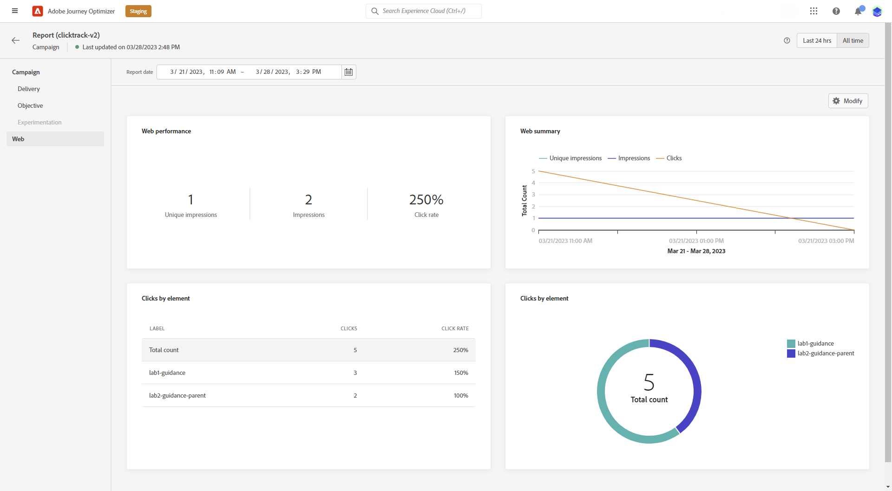

# Globaal verslag campagne voeren {#campaign-global-report}

>[!CONTEXTUALHELP]
>id="ajo_campaign_global_report"
>title="Globaal verslag campagne voeren"
>abstract="Met het algemene rapport Campagne kunt u het effect van uw campagnes over een bepaalde tijdsperiode meten. Uw rapport is verdeeld in verschillende widgets waarin het succes en de fouten van uw campagne worden beschreven. Elk rapportdashboard kan worden gewijzigd door widgets te vergroten of te verkleinen of te verwijderen."

Algemene rapporten, toegankelijk via de **Alle tijd** weergegeven, gebeurtenissen die ten minste twee uur geleden hebben plaatsgevonden en gebeurtenissen gedurende een geselecteerde tijdsperiode bedekken. In vergelijking hiermee richten Live-rapporten zich op gebeurtenissen die zich in de afgelopen 24 uur hebben voorgedaan, met een minimale tijdsinterval van twee minuten vanaf het plaatsvinden van de gebeurtenis.

Het algemene rapport van de campagne kan direct van uw Campagne met worden betreden **[!UICONTROL View report]** knop.

De campagne **[!UICONTROL Global report]** Deze pagina wordt weergegeven met de volgende tabbladen:

* [Campaign](#campaign-global)
* [Email](#email-global)
* [In-app](#inapp-global)
* [Push](#push-global)
* [Sms](#sms-global)
* [Web](#web-tab)
* [Direct mail](#direct-mail-global)

De campagne **[!UICONTROL Global report]** is verdeeld in verschillende widgets waarin het succes en de fouten van uw campagne worden beschreven. Elke widget kan indien nodig worden vergroot of verkleind en verwijderd. Raadpleeg voor meer informatie hierover [sectie](../reports/global-report.md#modify-dashboard).

Voor een gedetailleerde lijst van elke metrisch beschikbaar in Adobe Journey Optimizer, verwijs naar [deze pagina](global-report.md#list-of-components-global.md)

## Tabblad Campagne {#campaign-global}

### Levering {#delivery-global}

>[!CONTEXTUALHELP]
>id="ajo_campaign_delivery_global"
>title="Statistieken van de campagne"
>abstract="De widget Statistieken van de campagne bevat de belangrijkste informatie met betrekking tot uw campagne, zoals de ingevoerde profielen en acties."

De **[!UICONTROL Campaign's Statistics]** widget geeft de belangrijkste informatie met betrekking tot uw campagne:

* **[!UICONTROL Entered profiles]**: Aantal profielen dat de reis is gestart.

* **[!UICONTROL Actions delivered]**: Het totale aantal unieke tijden dat een actie in de reis is uitgevoerd.

* **[!UICONTROL Actions failed in %]**: Het totale aantal unieke tijden dat een actie tijdens de reis is mislukt in verhouding tot het totale aantal unieke tijden dat een actie is uitgevoerd.

<!--
### Objectives report {#objectives-global}

The **[!UICONTROL Objectives]** tab allows you to better fine-tune your deliveries' reports by targeting one specific metric.

The **[!UICONTROL Objectives]** listed are linked to **[!UICONTROL Datasets]** that define a connection to a system in order to retrieve additional information. A list of built-in **[!UICONTROL Objectives]** is available but you can add your own by adding new **[!UICONTROL Dataset]**. For the detailed procedure, refer to this [section](../campaigns/reporting-configuration.md).

After selecting the Objectives you want to target on, the two **[!UICONTROL Performance overview]** and **[!UICONTROL Campaign objective]** widgets will provide a detailed summary of your delivery performance. 

With the **[!UICONTROL Campaign objective]** widget, you can also choose to compare your main objective with another metric.
-->

### Experimentatierapport {#experimentation-global}

>[!CONTEXTUALHELP]
>id="ajo_campaigns_content_experiment_click"
>title="Metrisch met succes"
>abstract="De totale waarde van de metrische waarde van het Succes, eerder geselecteerd toen het creëren van uw Experimenten, gedeeld door het aantal profielen."

De **[!UICONTROL Experimentation]** tab geeft belangrijke inzichten in de prestaties van elke variant en geeft de meest succesvolle variant aan.

Het kan enige tijd duren om de beste uitvoerder te definiëren. Dit pictogram geeft dit weer. .

+++Leer meer over de verschillende metriek en widgets beschikbaar voor het rapport van de Experimentatie.

De **[!UICONTROL Experiment result]** widget geeft de prestaties van elke variant weer. U kunt uw basislijn wijzigen door een van de behandelingen te kiezen in het menu **[!UICONTROL Baseline]** de vervolgkeuzelijst. De beste behandeling wordt weergegeven met een sterpictogram.

De tabel bevat de volgende cijfers:

* **[!UICONTROL Lift over baseline]**: Meting van de procentuele verbetering van de conversiesnelheid van een bepaalde behandeling ten opzichte van de uitgangswaarde.

* **[!UICONTROL Confidence]**: Bewijs dat een bepaalde behandeling gelijk is aan de basisbehandeling. [Meer informatie](../campaigns/experiment-calculations.md#understand-confidence)

* **[!UICONTROL Unique outbound clicks]**: Totaal aantal klikken over uitgaande kanalen.

* **[!UICONTROL Profiles]**: Aantal profielen waarop deze behandeling is gericht.

* **[!UICONTROL Unique outbound clicks/profiles]**: De totale waarde van de metrische waarde voor succes die eerder is geselecteerd bij het maken van uw experimenten, gedeeld door het aantal profielen.

De **[!UICONTROL Confidence interval]** in grafiek wordt de onzekerheid over de verbetering gemeten . Het geeft het procentuele verschil in prestaties weer tussen de basislijn en de best presterende behandeling. [Meer informatie](../campaigns/experiment-calculations.md#confidence-intervals).

De laatste widget bevat gegevens die betrekking hebben op de **[!UICONTROL Success metric]** u eerder voor uw Behandelingen hebt geselecteerd. U kunt een andere doelmetrische waarde selecteren in het menu **[!UICONTROL Metric]** vervolgkeuzelijst voor het bijhouden van alternatieve gegevens.

>[!CAUTION]
>
>Wanneer u werkt met gefilterde meetgegevens voor experimenteren, moet u er rekening mee houden dat als u de optie Metrisch in het keuzemenu op de vergelijkingspagina voor experimenteren wijzigt, de filterwaarde niet behouden blijft. Als u bijvoorbeeld van &quot;Kliks&quot; overschakelt op &quot;Unieke klikken&quot;, gaat het toegepaste filter verloren, waardoor de vergelijking onjuist of ongeldig wordt.

+++

Raadpleeg voor een diepgaande analyse van deze resultaten en de manier waarop u deze kunt interpreteren de volgende bronnen: [deze pagina](../campaigns/get-started-experiment.md#interpret-results).

## Tabblad E-mail {#email-global}

>[!CONTEXTUALHELP]
>id="ajo_campaign_global_email_sending_statistics"
>title="E-mail - Statistieken verzenden"
>abstract="De tabel E-mail - Statistieken verzenden bevat een overzicht van de belangrijkste gegevens over uw e-mail, zoals Gericht of bezorgd."

>[!CONTEXTUALHELP]
>id="ajo_campaign_global_email_tracking_statistics"
>title="E-mail - Trackingstatistieken"
>abstract="De tabel E-mail - Statistische gegevens bijhouden bevat gegevens over profielactiviteiten voor uw e-mail."

>[!CONTEXTUALHELP]
>id="ajo_campaign_global_email_sending_performance"
>title="E-mail - Prestaties verzenden"
>abstract="De grafiek van de e-mail - die prestatiesgrafiek verzendt toont uitvoerige gegevens betreffende verzonden E-mail, die inzicht in zeer belangrijke metriek zoals leveringen en grenzen, toestaat voor een gedetailleerde analyse van het proces van de e-maillevering."

>[!CONTEXTUALHELP]
>id="ajo_campaign_global_email_bounce_categories"
>title="E-mail - Bounce-categorieën"
>abstract="De categorieën E-mail - Stuiteren grafieken en tabel bieden gegevens over zowel tijdelijke als permanente fouten."

>[!CONTEXTUALHELP]
>id="ajo_campaign_global_email_bounce_reasons"
>title="E-mail - Bounges redenen"
>abstract="De grafieken en tabel met redenen voor e-mail - Bounces bevatten de beschikbare gegevens met betrekking tot teruggestuurde berichten."

>[!CONTEXTUALHELP]
>id="ajo_campaign_global_email_error_reasons"
>title="E-mail - Foutredenen"
>abstract="Met de grafieken en de tabel met redenen voor e-mail - Fout kunt u de specifieke fouten identificeren die tijdens het verzendingsproces zijn opgetreden."

>[!CONTEXTUALHELP]
>id="ajo_campaign_global_email_excluded_reasons"
>title="E-mail - Uitgesloten redenen"
>abstract="In de grafieken en de tabel met uitgesloten redenen worden de verschillende factoren weergegeven die hebben geleid tot gebruikersprofielen die zijn uitgesloten van het doelpubliek en die het bericht niet ontvangen."

>[!CONTEXTUALHELP]
>id="ajo_campaign_global_email_top_url"
>title="E-mail - bovenste URL"
>abstract="De grafiek en tabel E-mail - URL bovenaan bieden een uitgebreid overzicht van de URL&#39;s in uw e-mail die het hoogste bezoekersverkeer ontvangen, zodat u de populairste koppelingen kunt identificeren."

>[!CONTEXTUALHELP]
>id="ajo_campaign_global_email_best_recipient"
>title="E-mail - Beste ontvangende domein"
>abstract="De grafiek en tabel met het domein E-mail - Beste ontvangers bieden een gedetailleerde uitsplitsing van de domeinen die ontvangers het vaakst gebruiken om e-mail te openen, en bieden waardevolle inzichten in het gedrag van ontvangers."

Van uw campagne **[!UICONTROL Global report]** de **[!UICONTROL Email]** bevat de belangrijkste gegevens met betrekking tot de e-mailleveringen die in uw campagne zijn verzonden.

+++ Meer informatie over de verschillende maatstaven en widgets die beschikbaar zijn voor het e-mailrapport.

De **[!UICONTROL Email Sending Statistics]** Grafiek geeft het succes van je e-mail weer:

* **[!UICONTROL Targeted]**: Het totale aantal berichten dat tijdens het verzendingsproces wordt verwerkt.

* **[!UICONTROL Sent]**: Totaal aantal verzendingen voor uw e-mail.

* **[!UICONTROL Delivered]**: Het aantal berichten dat is verzonden in verhouding tot het totale aantal verzonden berichten.

* **[!UICONTROL Delivery Rate]**: Percentage berichten dat succesvol is verzonden.

* **[!UICONTROL Bounces]**: Totaal aan fouten gecumuleerd tijdens het verzendingsproces en automatische retourverwerking in verhouding tot het totale aantal verzonden berichten.

* **[!UICONTROL Bounce Rate]**: Percentage van e-mails dat is teruggestuurd in vergelijking met verzonden e-mails.

* **[!UICONTROL Errors]**: Het totale aantal fouten dat is opgetreden tijdens het verzendproces waardoor het niet naar profielen kan worden verzonden.

* **[!UICONTROL Error Rate]**: Percentage fouten dat is opgetreden tijdens het verzendproces waardoor het niet kan worden verzonden, vergeleken met verzonden e-mailberichten.

* **[!UICONTROL Retries]**: Aantal e-mails in de wachtrij voor nieuwe pogingen.

* **[!UICONTROL Excluded]**: Aantal profielen dat door Adobe Journey Optimizer is uitgesloten.

De **[!UICONTROL Email - Tracking statistics]** widget bevat de beschikbare gegevens voor profielactiviteiten voor uw e-mail:

* **[!UICONTROL Opens]**: Aantal keer dat de e-mail is geopend.

* **[!UICONTROL Unique Opens]**: Percentage geopende e-mails.

* **[!UICONTROL Open Rate]**: Het totale aantal geopende e-mails in verhouding tot het aantal geleverde e-mails.

* **[!UICONTROL Clicks]**: Aantal keer dat er op inhoud is geklikt in een e-mail.

* **[!UICONTROL Unique Clicks]**:Aantal profielen dat op de inhoud van een e-mail heeft geklikt.

* **[!UICONTROL Unique Click Rate]**: Percentage gebruikers dat interactie heeft gehad met uw e-mail.

* **[!UICONTROL Unsubscriptions]**: Het aantal klikken op de koppeling voor het opzeggen van abonnementen.

* **[!UICONTROL Spam complaints]**: Het aantal keren dat een bericht is gedeclareerd als spam of junk.

De **[!UICONTROL Sending Performance]** De grafiek bevat de gegevens die beschikbaar zijn voor verzonden e-mailberichten, zoals:

* **[!UICONTROL Delivered]**: Het aantal berichten dat is verzonden in verhouding tot het totale aantal verzonden berichten.

* **[!UICONTROL Bounces]**: Totaal aan fouten gecumuleerd tijdens het verzendingsproces en automatische retourverwerking in verhouding tot het totale aantal verzonden berichten.

* **[!UICONTROL Retries]**: Aantal e-mails in de wachtrij voor nieuwe pogingen.

* **[!UICONTROL Errors]**: Het totale aantal fouten dat is opgetreden tijdens het verzendproces waardoor het niet naar profielen kan worden verzonden.

De **[!UICONTROL Bounce Reasons]** en **[!UICONTROL Bounce categories]** widgets bevatten de beschikbare gegevens met betrekking tot berichten die worden teruggestuurd, zoals:

* **[!UICONTROL Hard bounce]**: Het totale aantal permanente fouten, zoals een onjuist e-mailadres. Dit omvat een foutbericht waarin expliciet wordt aangegeven dat het adres ongeldig is, zoals Onbekende gebruiker.

* **[!UICONTROL Soft bounce]**: Het totale aantal tijdelijke fouten, zoals een volledig postvak.

* **[!UICONTROL Ignored]**: Het totale aantal tijdelijke berichten, zoals Buiten-kantoor, of een technische fout, bijvoorbeeld als het type afzender postmaster is.

Voor meer informatie over grenzen raadpleegt u de [Onderdrukkingslijst](../reports/suppression-list.md) pagina.

De **[!UICONTROL Error Reasons]** de grafiek en de lijst staan u toe om te zien welke fout tijdens het verzendende proces voorkwam.

De **[!UICONTROL Excluded reasons]** de grafiek en de lijst tonen de verschillende redenen die gebruikersprofielen, uitgesloten van de gerichte profielen, van het ontvangen van het bericht verhinderden.

De **[!UICONTROL Email - Top Url]** grafiek en lijstdetails die URLs van uw e-mail het meest bezochte zijn.

De **[!UICONTROL Email - Top recipient domain]** grafiek en lijstdetails die domeinen het meest door profielen worden gebruikt om e-mail te openen.

>[!NOTE]
>
>De **[!UICONTROL Optimized vs non optimized]** en **[!UICONTROL Send time optimization]**  widgets zijn alleen beschikbaar als de optie Send-Time Optimization is geactiveerd voor uw e-mail. Voor meer informatie over Send-Time Optimization, verwijs naar [deze pagina](../building-journeys/journeys-message.md#send-time-optimization).

De **[!UICONTROL Optimized vs non optimized]** de grafiek geeft de belangrijkste informatie met betrekking tot uw bericht of zij of niet worden geoptimaliseerd:

* **[!UICONTROL Sent]**: Totaal aantal verzendingen.

* **[!UICONTROL Opens]**: Het aantal keren dat het bericht is geopend.

* **[!UICONTROL Clicks]**: Aantal keer dat er op inhoud is geklikt in een e-mail.

De **[!UICONTROL Send time optimization]** geeft details over het succes van uw e-mail, afhankelijk van de verzendmethode: geoptimaliseerd of normaal.

* **[!UICONTROL Delivered]**: Het aantal berichten dat is verzonden in verhouding tot het totale aantal verzonden berichten.

* **[!UICONTROL Bounces]**: Totaal aan fouten gecumuleerd tijdens het verzendingsproces en automatische retourverwerking in verhouding tot het totale aantal verzonden berichten.
+++

## Tabblad In-app {#inapp-global}

>[!CONTEXTUALHELP]
>id="ajo_campaign_global_inapp_performance"
>title="Prestaties in de app"
>abstract="De prestatie-KPI&#39;s in de app bieden essentiële inzichten in de betrokkenheid van uw bezoekers bij In-app-berichten."

>[!CONTEXTUALHELP]
>id="ajo_campaign_global_inapp_interactions"
>title="Interacties per type"
>abstract="De interacties per type grafieken en de lijstdetails hoe de gebruikers met uw in-app bericht in wisselwerking stonden door om het even welke klik te volgen, te ontslaan, of interactie."

>[!CONTEXTUALHELP]
>id="ajo_campaign_global_inapp_summary"
>title="Overzicht in de app"
>abstract="De overzichtsgrafiek in de app illustreert de voortgang van uw impressies en interacties in de app gedurende de opgegeven periode."

Van uw campagne **[!UICONTROL Global report]** de **[!UICONTROL In-app]** bevat de belangrijkste informatie met betrekking tot de in-app-leveringen die in uw campagne zijn verzonden.

+++ Meer informatie over de verschillende maatstaven en widgets die beschikbaar zijn voor het rapport in de app.

De **[!UICONTROL In-app performance]** KPI&#39;s geven een gedetailleerde beschrijving van de belangrijkste informatie over de betrokkenheid van uw bezoekers bij uw In-app-berichten, zoals:

* **[!UICONTROL Unique impressions]**: aantal unieke gebruikers aan wie het In-app-bericht is bezorgd.

* **[!UICONTROL Impressions]**: totaal aantal in-app berichten dat aan alle gebruikers is bezorgd.

* **[!UICONTROL Interactions rate]**: percentage contracten met uw In-app-bericht. Dit omvat alle handelingen die de gebruikers hebben uitgevoerd, zoals klikken, ontslag of andere interactie.

De **[!UICONTROL Interactions by type]** grafieken en tabellen geven aan hoe gebruikers met uw bericht in de app hebben gewerkt door een klik, sluiting of interactie bij te houden.

De **[!UICONTROL In-app summary]** in de grafiek wordt de ontwikkeling van uw In-app-afbeeldingen en -interacties voor de desbetreffende periode weergegeven.
+++

## Tabblad Pushmelding {#push-global}

>[!CONTEXTUALHELP]
>id="ajo_campaign_global_push_sending_statistics"
>title="Pushmelding - Statistieken verzenden"
>abstract="De lijst van het Verzenden van de Statistieken van het Bericht van de Duw vat essentiële gegevens over uw dupberichten zoals Gerichte of Geleide berichten samen."

>[!CONTEXTUALHELP]
>id="ajo_campaign_global_push_tracking_statistics"
>title="Pushmeldingen - Statistieken bijhouden"
>abstract="De statistieken van het Spoor van de Duw verstrekken gegevens over profielactiviteit voor uw dupmelding."

>[!CONTEXTUALHELP]
>id="ajo_campaign_global_push_sending_summary"
>title="Pushmelding - Samenvatting verzenden"
>abstract="In de grafiek Samenvatting van pushberichten wordt aangegeven welke gegevens beschikbaar zijn voor verzonden pushberichten."

>[!CONTEXTUALHELP]
>id="ajo_campaign_global_push_excluded_reasons"
>title="Pushmelding - Uitgesloten redenen"
>abstract="In de grafieken en de tabel met uitgesloten redenen worden de verschillende factoren weergegeven die hebben geleid tot gebruikersprofielen die zijn uitgesloten van het doelpubliek en die het bericht niet ontvangen."

>[!CONTEXTUALHELP]
>id="ajo_campaign_global_push_error_reasons"
>title="Pushmelding - Foutredenen"
>abstract="Met de grafieken en de tabel met oorzaken van fouten kunt u de specifieke fouten identificeren die tijdens het verzendingsproces zijn opgetreden."

>[!CONTEXTUALHELP]
>id="ajo_campaign_global_push_breakdown_platform"
>title="Pushmelding - Onderverdeling per platform"
>abstract="De grafieken en tabel van de indeling naar platform geven een overzicht van het succes van uw pushberichten op basis van het besturingssysteem van het profiel."

Van uw campagne **[!UICONTROL Global report]** de **[!UICONTROL Push notification]** bevat de belangrijkste informatie met betrekking tot de pushberichten die in uw campagne worden verzonden.

De prestatie-KPI&#39;s in de app bevatten gedetailleerde informatie over de belangrijkste informatie over de betrokkenheid van uw bezoekers bij uw berichten in de app.

+++Leer meer op de verschillende metriek en widgets beschikbaar voor het Push- rapport.

De **[!UICONTROL Push notification - Sending statistics]** de tabel bevat de belangrijkste informatie met betrekking tot uw pushmeldingen

* **[!UICONTROL Targeted]**: Het totale aantal berichten dat tijdens de analyse wordt verwerkt.

* **[!UICONTROL Sent]**: Totaal aantal verzendingen voor de pushmelding.

* **[!UICONTROL Delivered]**: Het aantal berichten dat is verzonden in verhouding tot het totale aantal verzonden berichten.

* **[!UICONTROL Delivery Rate]**: Percentage berichten dat succesvol is verzonden.

* **[!UICONTROL Bounces]**: Totaal aan fouten gecumuleerd tijdens het verzendingsproces en automatische retourverwerking in verhouding tot het totale aantal verzonden berichten.

* **[!UICONTROL Bounce Rate]**: Percentage pushmeldingen dat is teruggestuurd in vergelijking met verzonden pushmeldingen.

* **[!UICONTROL Errors]**: Het totale aantal fouten dat is opgetreden waardoor deze niet naar profielen kon worden verzonden.

* **[!UICONTROL Error Rate]**: percentage fouten dat is opgetreden tijdens het voorkomen dat deze werden verzonden, vergeleken met verzonden pushberichten.

* **[!UICONTROL Excluded]**: Aantal profielen dat door Adobe Journey Optimizer is uitgesloten.

De **[!UICONTROL Push - Tracking statistics]** bevat de beschikbare gegevens voor profielactiviteit voor uw pushmelding:

* **[!UICONTROL Opens]**: Het aantal keren dat uw pushmelding is geopend.

* **[!UICONTROL Open Rate]**: Percentage geopende pushmeldingen.

* **[!UICONTROL Actions]**: Totaal aantal acties op de geleverde pushmelding, bijvoorbeeld klikken op de knop of ontslag.

* **[!UICONTROL Engagements]**: Het totale aantal keren dat wordt geopend en de acties voor deze pushmelding, bijvoorbeeld als het profiel de pushmelding heeft geopend of als op een knop is geklikt.

* **[!UICONTROL Engagement Rate]**: Percentage van de knoppen en handelingen voor deze pushmelding, bijvoorbeeld als het profiel de pushmelding heeft geopend of als op een knop is geklikt.

De **[!UICONTROL Push notification summary]** De grafiek bevat de gegevens die beschikbaar zijn voor verzonden pushberichten, zoals:

* **[!UICONTROL Opens]**: Het aantal keren dat uw pushmelding is geopend.

* **[!UICONTROL Actions]**: Totaal aantal acties op de geleverde pushmelding, bijvoorbeeld klikken op de knop of ontslag.

* **[!UICONTROL Bounces]**: Totaal aantal gecumuleerde fouten en automatische retourverwerking in verhouding tot het totale aantal verzonden berichten.

* **[!UICONTROL Delivered]**: Het aantal berichten dat is verzonden in verhouding tot het totale aantal verzonden berichten.

* **[!UICONTROL Errors]**: Het totale aantal fouten dat is opgetreden waardoor deze niet naar profielen kon worden verzonden.

>[!NOTE]
>
>De **[!UICONTROL Optimized vs non optimized]** en **[!UICONTROL Send time optimization]**  widgets zijn alleen beschikbaar als de optie Send-Time Optimization is geactiveerd voor uw pushmelding. Voor meer informatie over Send-Time Optimization, verwijs naar [deze pagina](../building-journeys/journeys-message.md#send-time-optimization).

De **[!UICONTROL Optimized vs non optimized]** de grafiek geeft de belangrijkste informatie met betrekking tot uw bericht of zij of niet worden geoptimaliseerd:

* **[!UICONTROL Delivered]**: Het aantal berichten dat is verzonden in verhouding tot het totale aantal verzonden berichten.

* **[!UICONTROL Opens]**: Het aantal keren dat uw pushmelding is geopend.

* **[!UICONTROL Actions]**: Totaal aantal acties op de geleverde pushmelding, bijvoorbeeld klikken op de knop of ontslag.

De **[!UICONTROL Send time optimization]** geeft details over het succes van uw pushmelding, afhankelijk van de verzendmethode: geoptimaliseerd of normaal.

* **[!UICONTROL Delivered]**: Het aantal berichten dat is verzonden in verhouding tot het totale aantal verzonden berichten.

* **[!UICONTROL Bounces]**: Totaal aan fouten gecumuleerd tijdens het verzendingsproces en automatische retourverwerking in verhouding tot het totale aantal verzonden berichten.

De **[!UICONTROL Error Reasons]** aan de hand van grafieken en tabellen kunt u zien welke fout is opgetreden.

De **[!UICONTROL Excluded reasons]** in grafieken en tabellen worden de verschillende redenen weergegeven waarom gebruikersprofielen, die zijn uitgesloten van de doelprofielen, het bericht niet hebben ontvangen.

De **[!UICONTROL Breakdown by platform]** in een grafiek en tabel ziet u hoe succesvol uw pushmelding is, afhankelijk van het besturingssysteem van uw profiel.
+++

## Tabblad SMS {#sms-global}

>[!CONTEXTUALHELP]
>id="ajo_campaign_global_sms_sending_statistics"
>title="SMS - Statistieken verzenden"
>abstract="De SMS die Statistieken verzendt vat essentiële gegevens over uw SMS- berichten zoals Gerichte of Geleide berichten samen."

>[!CONTEXTUALHELP]
>id="ajo_campaign_global_sms_error_reasons"
>title="SMS - Redenen voor fouten"
>abstract="Met SMS - Foutgrafieken en -tabel kunt u de specifieke fouten identificeren die tijdens het verzendingsproces zijn opgetreden."

>[!CONTEXTUALHELP]
>id="ajo_campaign_global_sms_performance"
>title="SMS - Prestaties op datum"
>abstract="De widget SMS-prestaties op datum biedt via een grafische weergave belangrijke informatie over uw berichten."

>[!CONTEXTUALHELP]
>id="ajo_campaign_global_sms_excluded_reasons"
>title="SMS - Uitgesloten redenen"
>abstract="In de grafieken en de tabel met uitgesloten redenen worden de verschillende factoren weergegeven die hebben geleid tot gebruikersprofielen die zijn uitgesloten van het doelpubliek en die het bericht niet ontvangen."

>[!CONTEXTUALHELP]
>id="ajo_campaign_global_sms_bounces_reasons"
>title="SMS - Bounges redenen"
>abstract="De grafieken en de tabel met Bounces Reasons bevatten de beschikbare gegevens met betrekking tot berichten die worden teruggestuurd."

>[!CONTEXTUALHELP]
>id="ajo_campaign_global_sms_clicks_links"
>title="SMS - Klikken op koppelingen"
>abstract="SMS - De widget klikt op koppelingen biedt essentiële inzichten in de betrokkenheid van uw bezoekers bij de URL&#39;s in uw berichten"

Van uw campagne **[!UICONTROL Global report]** de **[!UICONTROL SMS]** bevat de belangrijkste informatie met betrekking tot de SMS-leveringen die in uw campagne zijn verzonden.

+++Meer informatie over de verschillende maatstaven en widgets die beschikbaar zijn voor het SMS-rapport.

De **[!UICONTROL SMS - Sending statistics]** in de tabel wordt aangegeven hoe succesvol je SMS-bericht is:

* **[!UICONTROL Targeted]**: Aantal gebruikersprofielen dat als doelprofielen wordt gekwalificeerd.

* **[!UICONTROL Excluded]**: Aantal gebruikersprofielen dat is uitgesloten van de doelprofielen en dat het bericht niet heeft ontvangen.

* **[!UICONTROL Sent]**: Totaal aantal verzendingen voor uw SMS-bericht.

* **[!UICONTROL Bounces]**: Totaal aan fouten gecumuleerd tijdens het verzendingsproces en automatische retourverwerking in verhouding tot het totale aantal verzonden berichten.

* **[!UICONTROL Errors]**: Het totale aantal fouten dat is opgetreden waardoor deze niet naar profielen kon worden verzonden.

De **[!UICONTROL SMS Performance by date]** widget geeft de belangrijkste informatie met betrekking tot uw bericht met een grafiek:

* **[!UICONTROL Sent]**: Het totale aantal verzendingen voor uw SMS-berichten.

* **[!UICONTROL Bounces]**: Totaal aan fouten gecumuleerd tijdens het verzendingsproces en automatische retourverwerking in verhouding tot het totale aantal verzonden berichten.

* **[!UICONTROL Errors]**: Het totale aantal fouten dat is opgetreden waardoor deze niet naar profielen kon worden verzonden.

De **[!UICONTROL Exclude Reasons]** en **[!UICONTROL Bounces Reasons]** en **[!UICONTROL Error Reasons]** in grafieken en tabellen kunt u zien welke fout en uitsluitingen tijdens het verzendingsproces zijn opgetreden.

De **[!UICONTROL SMS - Clicks by links]** widgets geeft de belangrijkste informatie met betrekking tot de betrokkenheid van uw bezoekers bij uw URL&#39;s.

+++

## Tabblad Web {#web-tab}

>[!CONTEXTUALHELP]
>id="ajo_campaign_global_web_performance"
>title="Webprestaties"
>abstract="De KPI&#39;s voor webprestaties bieden uitgebreide informatie over de betrokkenheid van uw bezoekers bij uw webervaringen."

>[!CONTEXTUALHELP]
>id="ajo_campaign_global_web_summary"
>title="Weboverzicht"
>abstract="De webinvattingsgrafiek illustreert de voortgang van uw webervaringen, inclusief indrukken, unieke indrukken en interacties, gedurende de opgegeven periode."

>[!CONTEXTUALHELP]
>id="ajo_campaign_global_web_interactions"
>title="Interacties per element"
>abstract="De tabel Interacties per element biedt belangrijke informatie over de betrokkenheid van uw bezoekers bij verschillende elementen op uw webpagina&#39;s."

Van uw campagne **[!UICONTROL Global report]** de **[!UICONTROL Web]** van het lusje details de belangrijkste informatie met betrekking tot uw Web-pagina&#39;s.

+++Leer meer op de verschillende metriek en widgets beschikbaar voor het rapport van het Web.

De **[!UICONTROL Web performance]** KPI&#39;s geven een gedetailleerde beschrijving van de belangrijkste informatie over de betrokkenheid van uw bezoekers bij uw webervaringen, zoals:

* **[!UICONTROL Unique impressions]**: aantal unieke gebruikers aan wie de webervaring is geleverd.

* **[!UICONTROL Impressions]**: totaal aantal webervaringen dat aan alle gebruikers wordt geleverd.

* **[!UICONTROL Interaction rate]**: percentage van de afspraken met uw webpagina. Dit omvat alle handelingen die de gebruikers hebben uitgevoerd, zoals klikken of andere interacties.

De **[!UICONTROL Web summary]** in de grafiek wordt de evolutie van uw webervaringen (indrukken, unieke indrukken en interacties) voor de desbetreffende periode weergegeven.

De **[!UICONTROL Interactions by element]** de tabel bevat de belangrijkste informatie over de betrokkenheid van uw bezoekers bij de verschillende elementen op uw webpagina&#39;s.
+++

## Tabblad Direct mail {#direct-mail-global}

>[!CONTEXTUALHELP]
>id="ajo_campaign_global_direct_sending_statistics"
>title="Directe post - Verzendstatistieken"
>abstract="De Direct mail die Statistieken verzendt vat essentiële gegevens over uw Directe Berichten zoals Gerichte of Geleverde berichten samen."

>[!CONTEXTUALHELP]
>id="ajo_campaign_global_direct_error_reasons"
>title="Directe post - de redenen van de Fout"
>abstract="Met de grafieken en de tabel Directe e-mail - Foutredenen kunt u de specifieke fouten identificeren die tijdens het verzendingsproces zijn opgetreden."

>[!CONTEXTUALHELP]
>id="ajo_campaign_global_direct_excluded_reasons"
>title="Direct mail - Uitgesloten redenen"
>abstract="De grafiek en de tabel met uitgesloten redenen voor Direct Mail illustreren de verschillende factoren die tot gebruikersprofielen hebben geleid, die van het beoogde publiek zijn uitgesloten en die het bericht niet ontvangen."

Van uw campagne **[!UICONTROL Global report]** de **[!UICONTROL Direct mail]** bevat de belangrijkste informatie met betrekking tot uw Direct-mailleveringen.

+++ Meer informatie over de verschillende maatstaven en widgets die beschikbaar zijn voor het Direct-mailrapport.

De **[!UICONTROL Direct Mail - Sending statistics]** in de tabel wordt aangegeven hoe succesvol je e-mail is :

* **[!UICONTROL Targeted]**: Aantal gebruikersprofielen dat als doelprofielen voor deze direct-mail kwalificeert.

* **[!UICONTROL Sent]**: Het totale aantal verzendingen voor deze direct-mail.

* **[!UICONTROL Errors]**: Het totale aantal fouten dat is opgetreden tijdens het verzendproces waardoor het niet naar profielen kan worden verzonden.

* **[!UICONTROL Excluded]**: Aantal gebruikersprofielen dat niet is opgenomen in de doelprofielen en dat uw e-mail niet heeft ontvangen.

De **[!UICONTROL Direct Mail - Excluded reasons]** en **[!UICONTROL Direct Mail - Error reasons]** in grafieken en tabellen kunt u zien welke fout en uitsluitingen tijdens het verzendingsproces zijn opgetreden.
+++

## Aanvullende bronnen

* [Aan de slag met campagnes](../campaigns/get-started-with-campaigns.md)
* [Een campagne maken](../campaigns/create-campaign.md)
* [API-gestuurde campagnes maken](../campaigns/api-triggered-campaigns.md)
* [Een campagne wijzigen of stoppen](../campaigns/modify-stop-campaign.md)
* [Campagne live-rapport](campaign-live-report.md)
