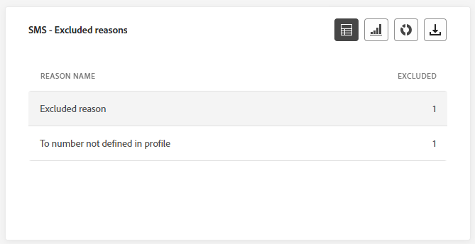

# Campagne live-rapport {#campaign-live-report}

U kunt het live campagnerapport rechtstreeks vanuit uw campagne openen via de **[!UICONTROL Live view]** knop.

De campagne **[!UICONTROL Live report]** Deze pagina wordt weergegeven met de volgende tabbladen:

* [Campaign](#campaign-live)
* [Email](#email-live)
* [Push](#push-live)
* [Sms](#sms-live)

De campagne **[!UICONTROL Live report]** is verdeeld in verschillende widgets waarin het succes en de fouten van uw campagne worden beschreven. Elke widget kan indien nodig worden vergroot of verkleind en verwijderd. Raadpleeg voor meer informatie hierover [sectie](../reports/live-report.md#modify-dashboard).

Voor een gedetailleerde lijst van elke metrisch beschikbaar in Adobe Journey Optimizer, verwijs naar [deze pagina](live-report.md#list-of-components-live).

## Tabblad Campagne {#campaign-global}

### Levering {#delivery-global}

De **[!UICONTROL Campaign Statistics]** widget geeft de belangrijkste informatie met betrekking tot uw campagne:

* **[!UICONTROL Entered profiles]**: Aantal profielen dat de reis is begonnen.

<!--
### Experimentation tab (#experimentation-live)

From your Campaign **[!UICONTROL Live report]**, the **[!UICONTROL Experimentation]** tab details the main information relative to how each variant is performing and if there is was winner during the test.
-->

## Tabblad E-mail {#email-live}

Van uw campagne **[!UICONTROL Live report]** de **[!UICONTROL Email]** bevat de belangrijkste informatie met betrekking tot de e-mailleveringen die in uw campagne zijn verzonden.

+++ Meer informatie over de verschillende maatstaven en widgets die beschikbaar zijn voor het e-mailrapport.

De **[!UICONTROL Email Sending Statistics]** widget geeft details over de belangrijkste informatie met betrekking tot uw bericht:

* **[!UICONTROL Delivered]**: Aantal verzonden berichten.

* **[!UICONTROL Bounces]**: Totaal aantal fouten gecumuleerd tijdens levering en automatische terugkeringsverwerking.

* **[!UICONTROL Errors]**: Het totale aantal fouten dat is opgetreden tijdens een levering waardoor deze niet naar profielen kan worden verzonden.

De **[!UICONTROL Sending metrics by Email]** tabel en **[!UICONTROL Email Summary]** grafiek geeft het succes van uw levering aan:

* **[!UICONTROL Sent]**: Het totale aantal verzendt voor de levering.

* **[!UICONTROL Delivered]**: Aantal verzonden berichten.

* **[!UICONTROL Bounces]**: Totaal aantal fouten gecumuleerd tijdens levering en automatische terugkeringsverwerking.

* **[!UICONTROL Errors]**: Het totale aantal fouten dat is opgetreden tijdens een levering waardoor deze niet naar profielen kan worden verzonden.

* **[!UICONTROL Opens]**: Aantal keren dat een bericht in een levering werd geopend.

* **[!UICONTROL Clicks]**: Het aantal keren dat op een inhoud is geklikt in een levering.

* **[!UICONTROL Unsubscribe]**: Aantal klikken op de verbinding van het unsubscription.

* **[!UICONTROL Spam complaints]**: Aantal keren dat een bericht als spam of junk werd verklaard.

De **[!UICONTROL Bounce Reasons]**, **[!UICONTROL Bounce categories]** en **[!UICONTROL Hard and bounce - by Email]** widgets bevatten de beschikbare gegevens met betrekking tot berichten die worden teruggestuurd, zoals:

* **[!UICONTROL Hard bounce]**: Het totale aantal permanente fouten, zoals een onjuist e-mailadres. Dit omvat een foutbericht waarin expliciet wordt aangegeven dat het adres ongeldig is, zoals Onbekende gebruiker.

* **[!UICONTROL Soft bounce]**: Het totale aantal tijdelijke fouten, zoals een volledig postvak.

* **[!UICONTROL Ignored]**: Het totale aantal tijdelijke gegevens, zoals Buiten-kantoor, of een technische fout, bijvoorbeeld als het type afzender postmaster is.

De **[!UICONTROL Error Reasons]** en **[!UICONTROL Exclude Reasons]** in grafieken en tabellen kunt u zien welke fout en uitsluitingen tijdens de levering zijn opgetreden.

De **[!UICONTROL Email - Top recipient domain]** grafiek en lijstdetails welke domeinen het meest door ontvangers worden gebruikt om e-mail te openen.
+++

## Tabblad Pushmelding {#push-live}

Van uw campagne **[!UICONTROL Live report]** de **[!UICONTROL Push notification]** bevat de belangrijkste informatie met betrekking tot de pushberichten die in uw campagne worden verzonden.

+++Leer meer op de verschillende metriek en widgets beschikbaar voor het Push- rapport.

**[!UICONTROL Push notification sending performance]**, **[!UICONTROL Push notification summary]** en **[!UICONTROL Sending metrics - by Push]** widgets geeft details over de belangrijkste informatie met betrekking tot uw bericht:

* **[!UICONTROL Sent]**: Het totale aantal verzendt voor de levering.

* **[!UICONTROL Delivered]**: Aantal verzonden berichten.

* **[!UICONTROL Bounces]**: Totaal aantal fouten gecumuleerd tijdens levering en automatische terugkeringsverwerking.

* **[!UICONTROL Errors]**: Het totale aantal fouten dat is opgetreden tijdens een levering waardoor deze niet naar profielen kan worden verzonden.

* **[!UICONTROL Opens]**: Aantal keren dat een bericht in een levering werd geopend.

* **[!UICONTROL Actions]**: Het totale aantal acties op de geleverde pushmelding, bijvoorbeeld klikken op de knop of ontslag.

* **[!UICONTROL Engagements]**: Het totale aantal keren dat wordt geopend en de acties voor deze pushmelding, bijvoorbeeld als het profiel de pushmelding heeft geopend of als op een knop is geklikt.

De **[!UICONTROL Error Reasons]** en **[!UICONTROL Exclude Reasons]** in grafieken en tabellen kunt u zien welke fout en uitsluitingen tijdens de levering zijn opgetreden.

De **[!UICONTROL Sending statistics - Failed]** met widget kunt u zien hoeveel fouten en golven er zijn opgetreden.

De **[!UICONTROL Tracking by platform]**, **[!UICONTROL Sending by platform]** en **[!UICONTROL Breakdown by platform]** in grafieken en tabellen wordt aangegeven hoe succesvol uw pushmelding is, afhankelijk van het besturingssysteem.
+++

## Tabblad SMS {#sms-live}

Van uw campagne **[!UICONTROL Live report]** de **[!UICONTROL SMS]** bevat de belangrijkste informatie met betrekking tot de SMS-leveringen die in uw campagne zijn verzonden.

+++Meer informatie over de verschillende maatstaven en widgets die beschikbaar zijn voor het SMS-rapport.

De **[!UICONTROL SMS - Sending statistics]** de tabel geeft het succes van uw levering aan :

* **[!UICONTROL Targeted]**: Aantal gebruikersprofielen dat als doelprofielen voor deze levering in aanmerking komt.

* **[!UICONTROL Excluded]**: Aantal gebruikersprofielen dat is uitgesloten van de doelprofielen en dat het bericht niet heeft ontvangen.

* **[!UICONTROL Sent]**: Het totale aantal verzendt voor de levering.

* **[!UICONTROL Delivered]**: Aantal verzonden berichten.

* **[!UICONTROL Bounces]**: Totaal aantal fouten gecumuleerd tijdens levering en automatische terugkeringsverwerking.

* **[!UICONTROL Errors]**: Het totale aantal fouten dat is opgetreden tijdens een levering waardoor deze niet naar profielen kan worden verzonden.

De **[!UICONTROL SMS Performance by date]** widget geeft de belangrijkste informatie met betrekking tot uw bericht met een grafiek:

* **[!UICONTROL Sent]**: Het totale aantal verzendt voor de levering.

* **[!UICONTROL Delivered]**: Aantal verzonden berichten.

* **[!UICONTROL Bounces]**: Totaal aantal fouten gecumuleerd tijdens levering en automatische terugkeringsverwerking.

* **[!UICONTROL Errors]**: Het totale aantal fouten dat is opgetreden tijdens een levering waardoor deze niet naar profielen kan worden verzonden.

De **[!UICONTROL Exclude Reasons]**, **[!UICONTROL Bounces Reasons]** en **[!UICONTROL Error Reasons]** in grafieken en tabellen kunt u zien welke fout en uitsluitingen tijdens de levering zijn opgetreden.
+++

## Aanvullende bronnen

* [Aan de slag met campagnes](../campaigns/get-started-with-campaigns.md)
* [Een campagne maken](../campaigns/create-campaign.md)
* [API-gestuurde campagnes maken](../campaigns/api-triggered-campaigns.md)
* [Een campagne wijzigen of stoppen](../campaigns/modify-stop-campaign.md)
* [Globaal verslag campagne voeren](campaign-global-report.md)
