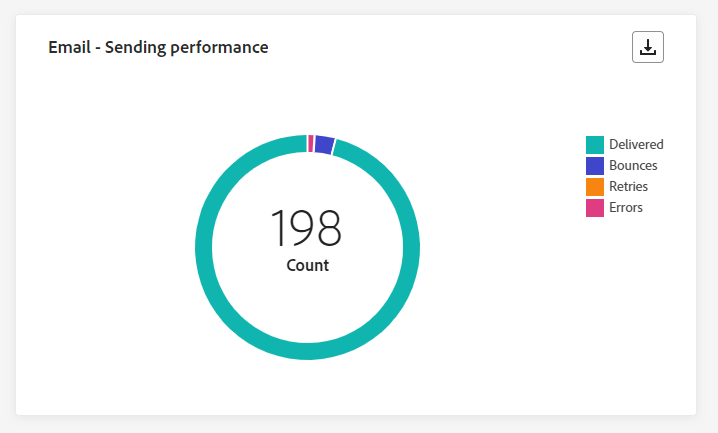
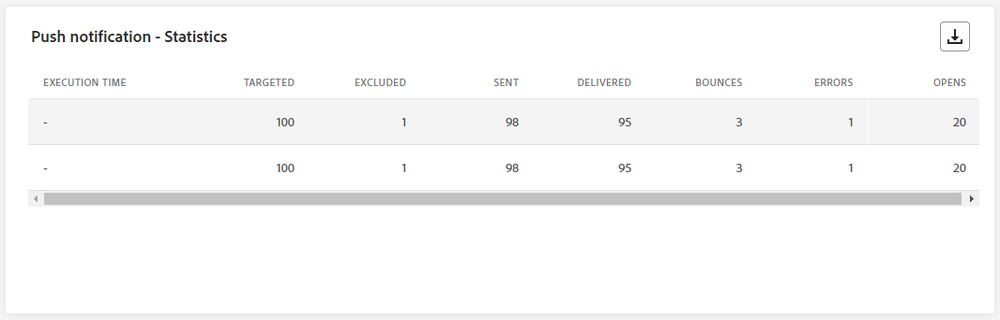

# Campagne live-rapport {#campaign-live-report}

>[!CONTEXTUALHELP]
>id="ajo_campaign_live_report"
>title="Campagne live-rapport"
>abstract="Met het live rapport Campagne kunt u de impact en prestaties van uw campagnes in real-time alleen in de afgelopen 24 uur meten en visualiseren. Uw rapport is verdeeld in verschillende widgets waarin het succes en de fouten van uw campagne worden beschreven. Elk rapportdashboard kan worden gewijzigd door widgets te vergroten of te verkleinen of te verwijderen."

Live rapporten, die toegankelijk zijn vanaf het tabblad Laatste 24 uur, geven gebeurtenissen weer die in de afgelopen 24 uur hebben plaatsgevonden, met een minimale tijdsinterval van twee minuten vanaf de gebeurtenis. Ter vergelijking, Customer Journey Analytics rapporteert zich op gebeurtenissen die minstens twee uur geleden hebben plaatsgevonden en gebeurtenissen gedurende een bepaalde tijdsperiode.

U hebt rechtstreeks vanuit uw campagne toegang tot het live-campagnerapport door op de knop **[!UICONTROL Reports]** te klikken en vervolgens **[!UICONTROL View last 24hrs report]** te selecteren.

De pagina Campagne **[!UICONTROL Live report]** wordt weergegeven met de volgende tabbladen:

* [Campaign](#campaign-live)
* [Email](#email-live)
* [In-app](#inapp-live)
* [Push](#push-live)
* [Sms](#sms-live)
* [Web](#web-tab)
* [Direct mail](#direct-mail-tab)

>[!AVAILABILITY]
>Geordende campagnes ondersteunen alleen de SMS-, e-mail- en pushkanalen. Andere kanalen (In-app, Web, Direct mail, enz.) zijn niet beschikbaar in georkestreerde campagnes en verschijnen niet in rapportering.

De campagne **[!UICONTROL Live report]** is verdeeld in verschillende widgets waarin het succes van uw campagne en de fouten worden beschreven. Elke widget kan indien nodig worden vergroot of verkleind en verwijderd. Voor meer informatie over dit, verwijs naar deze [&#x200B; sectie &#x200B;](../reports/live-report.md#modify-dashboard).

Voor een gedetailleerde lijst van elke metrisch beschikbaar in Adobe Journey Optimizer, verwijs naar [&#x200B; deze pagina &#x200B;](live-report.md#live-report).

## Tabblad Campagne {#campaign-live}

### Levering {#delivery-live}

De KPI&#39;s van **[!UICONTROL Campaign's Statistics]** fungeren als een uitgebreid dashboard met een gedetailleerde uitsplitsing van de belangrijkste meetgegevens van de laatste 24 uur die betrekking hebben op uw campagne. Dit omvat essentiële informatie zoals het aantal profielen en de geleverde acties, die een grondig inzicht in de prestaties en de betrokkenheid van uw campagne verstrekken.

+++ Meer informatie over de statistieken van Campagne

* **[!UICONTROL Audience]**: aantal doelprofielen.

* **[!UICONTROL Actions delivered]**: Het totale aantal unieke tijden dat een handeling is uitgevoerd.

* **[!UICONTROL Errors]**: het totale aantal fouten dat is opgetreden tijdens het verzendproces waardoor het niet naar profielen kan worden verzonden.

+++

<!--
### Experimentation tab (#experimentation-live)

From your Campaign **[!UICONTROL Live report]**, the **[!UICONTROL Experimentation]** tab details the main information relative to how each variant is performing and if there is was winner during the test.
-->

## Tabblad E-mail {#email-live}

Op het tabblad **[!UICONTROL Live report]** van uw campagne **[!UICONTROL Email]** vindt u de belangrijkste gegevens met betrekking tot de e-mail die u in uw campagne hebt verzonden.

### E-mail - Prestaties verzenden {#email-sending-performance}

>[!CONTEXTUALHELP]
>id="ajo_campaign_live_email_sending_statistics"
>title="E-mail - Statistieken verzenden"
>abstract="De grafiek E-mail - Verzendstatistieken vat essentiële gegevens over uw e-mail, zoals Gericht of Geleverd van de laatste 24 uur samen."

**[!UICONTROL Email - Sending Performance]** biedt een uitgebreid overzicht van gegevens over e-mails die in de afgelopen 24 uur zijn verzonden. Het biedt inzicht in essentiële metriek zoals geleverde en stommingen, die voor een gedetailleerd onderzoek van het e-mailverzendingsproces toestaan.

+++ Meer informatie over prestaties via e-mail verzenden

* **[!UICONTROL Delivered]**: aantal e-mailberichten verzonden.

* **[!UICONTROL Bounces]**: het totaal aan fouten dat tijdens het verzendproces is gecumuleerd en de automatische retourverwerking.

* **[!UICONTROL Retries]**: Aantal e-mails in de wachtrij voor nieuwe pogingen.

* **[!UICONTROL Errors]**: het totale aantal fouten dat is opgetreden tijdens het verzendproces waardoor het niet naar profielen kan worden verzonden.
+++

### E-mail - Statistieken

>[!CONTEXTUALHELP]
>id="ajo_campaign_live_email_statistics"
>title="E-mail - Statistieken"
>abstract="De tabel E-mail - Statistieken bevat gegevens over de profielactiviteiten voor uw e-mail van de laatste 24 uur."

De tabel **[!UICONTROL Sending metrics by Email]** bevat een uitgebreide samenvatting van de gegevens uit de afgelopen 24 uur. Het schetst essentiële metriek, met inbegrip van de grootte van het gerichte publiek en het aantal met succes geleverde e-mails. Dit biedt waardevolle inzichten in de doeltreffendheid en het bereik van uw e-mailcampagnes.

+++ Meer informatie over e-mail - statistieken

* **[!UICONTROL Execution time]**: Begintijd voor elke uitvoering van uw terugkerende e-mail. Als u slechts één of meerdere terugkerende e-mails wilt aanwijzen, selecteert u deze in de vervolgkeuzelijst **[!UICONTROL Execution time]** .

* **[!UICONTROL Targeted]**: Het totale aantal berichten dat tijdens het verzendingsproces is verwerkt.

* **[!UICONTROL Excluded]**: Aantal gebruikersprofielen dat is uitgesloten van de doelprofielen en dat het bericht niet heeft ontvangen.

* **[!UICONTROL Sent]**: Totaal aantal verzendingen.

* **[!UICONTROL Delivered]**: Aantal berichten verzonden.

* **[!UICONTROL Bounces]**: het totaal aan fouten dat tijdens het verzendproces is gecumuleerd en de automatische retourverwerking.

* **[!UICONTROL Errors]**: het totale aantal fouten dat is opgetreden tijdens het verzendproces waardoor het niet naar profielen kan worden verzonden.

* **[!UICONTROL Opens]**: Het aantal keren dat een bericht is geopend.

* **[!UICONTROL Clicks]**: Het aantal keren dat er op de inhoud is geklikt.

* **[!UICONTROL Unsubscribe]**: Het aantal klikken op de koppeling voor het opzeggen van abonnementen.

* **[!UICONTROL Spam complaints]**: Het aantal keren dat een bericht is gedeclareerd als spam of junk.

* **[!UICONTROL Retries]**: Aantal e-mails in de wachtrij voor nieuwe pogingen.
+++

### E-mail - rubrieken en redenen voor stuiteren {#bounce-categories}

>[!CONTEXTUALHELP]
>id="ajo_campaign_live_email_bounce_categories"
>title="E-mail - Bounce-categorieën"
>abstract="De categorieën E-mail - Stuiteren grafieken en tabel bevatten gegevens over zowel tijdelijke als permanente fouten van de laatste 24 uur."

>[!CONTEXTUALHELP]
>id="ajo_campaign_live_email_bounce_reasons"
>title="E-mail - Bounges redenen"
>abstract="De grafiek en tabel met redenen voor e-mail - Bounces bevatten de gegevens die beschikbaar zijn voor berichten die worden teruggestuurd vanaf de laatste 24 uur."

De widgets **[!UICONTROL Bounce reasons]** en **[!UICONTROL Bounce categories]** compileren de beschikbare gegevens van de laatste 24 uur met betrekking tot verzonden berichten, die gedetailleerde inzichten verstrekken in de specifieke redenen en categorieën achter e-mailgrenzen.

Voor meer informatie over grenzen, verwijs naar de [&#x200B; lijst van de Onderdrukking &#x200B;](../reports/suppression-list.md) pagina.

+++ Meer informatie over e-mail - Bounce-rubrieken en redencijfers

* **[!UICONTROL Hard bounce]**: Het totale aantal permanente fouten, zoals een onjuist e-mailadres. Dit omvat een foutbericht waarin expliciet wordt aangegeven dat het adres ongeldig is, zoals Onbekende gebruiker.

* **[!UICONTROL Soft bounce]**: Het totale aantal tijdelijke fouten, zoals een volledig Postvak IN.

* **[!UICONTROL Ignored]**: Het totale aantal tijdelijke bestanden, zoals Buiten-kantoor, of een technische fout, bijvoorbeeld als het type afzender postmaster is.

+++

### E-mail - Prestaties op datum {#email-performance-date}

>[!CONTEXTUALHELP]
>id="ajo_campaign_live_email_performance_bydate"
>title="E-mail - Prestaties op datum"
>abstract="De grafiek E-mail - Prestaties door datum toont uitvoerige gegevens van de laatste 24 uren betreffende verzonden e-mail, die inzicht in zeer belangrijke metriek zoals geleverde en staren, die voor een gedetailleerde analyse van het e-mailverzendingsproces toestaan."

De **[!UICONTROL Email - Performance by date]** -widget biedt een gedetailleerd overzicht van belangrijke informatie met betrekking tot uw berichten, in een grafiek weergegeven, die inzicht biedt in de prestatietrends in de afgelopen 24 uur.

+++ Meer informatie over e-mail - Prestaties op datum en redenen

* **[!UICONTROL Sent]**: Totaal aantal verzendingen.

* **[!UICONTROL Delivered]**: Aantal berichten verzonden.

* **[!UICONTROL Bounces]**: het totaal aan fouten dat tijdens het verzendproces is gecumuleerd en de automatische retourverwerking.

* **[!UICONTROL Errors]**: het totale aantal fouten dat is opgetreden tijdens het verzendproces waardoor het niet naar profielen kan worden verzonden.

* **[!UICONTROL Opens]**: Het aantal keren dat een bericht is geopend.

* **[!UICONTROL Clicks]**: Het aantal keren dat er op de inhoud is geklikt.

* **[!UICONTROL Unsubscriptions]**: Het aantal klikken op de koppeling voor het opzeggen van abonnementen.

* **[!UICONTROL Spam complaints]**: Het aantal keren dat een bericht is gedeclareerd als spam of junk.

+++

### Foutredenen {#email-error-reasons}

>[!CONTEXTUALHELP]
>id="ajo_campaign_live_email_error_reasons"
>title="E-mail - Foutredenen"
>abstract="Met de grafieken en de tabel met redenen voor e-mail - Fout kunt u de specifieke fouten identificeren die tijdens het verzendingsproces in de afgelopen 24 uur zijn opgetreden."

De **[!UICONTROL Error Reasons]** -grafieken en -tabellen verschaffen insight informatie over de specifieke fouten die zich tijdens het verzendingsproces in de afgelopen 24 uur hebben voorgedaan. Deze informatie is nuttig om de aard en de frequentie van fouten te begrijpen.

### Uitgesloten redenen {#email-exclude-reasons}

>[!CONTEXTUALHELP]
>id="ajo_campaign_live_email_excluded_reasons"
>title="E-mail - Uitgesloten redenen"
>abstract="De grafieken en tabel met uitgesloten redenen illustreren de verschillende factoren die hebben geleid tot gebruikersprofielen die zijn uitgesloten van het doelpubliek en die het bericht in de afgelopen 24 uur niet hebben ontvangen."

De grafieken en tabel van **[!UICONTROL Excluded Reasons]** bieden een uitgebreid perspectief op de verschillende factoren die hebben geleid tot de uitsluiting van gebruikersprofielen van het doelpubliek in de afgelopen 24 uur.

Verwijs naar [&#x200B; deze pagina &#x200B;](exclusion-list.md) voor de uitvoerige lijst van uitsluitingsredenen.

### E-mail - Beste ontvangende domein {#email-best-recipient}

>[!CONTEXTUALHELP]
>id="ajo_campaign_live_email_best_recipient"
>title="E-mail - Beste ontvangende domein"
>abstract="De grafiek en de tabel met het meest begunstigde domein (E-mail - Beste ontvanger) geven een gedetailleerde uitsplitsing van de domeinen die ontvangers het vaakst gebruiken om e-mail te openen. Deze tabel biedt waardevolle inzichten in het gedrag van ontvangers vanaf de laatste 24 uur."

De grafiek en tabel van **[!UICONTROL Email - Best recipient domain]** bevatten een uitgebreide indeling van de domeinen die het meest worden gebruikt door profielen om uw e-mailberichten in de afgelopen 24 uur te openen. Dit biedt waardevolle inzichten in profielgedrag, waardoor u beter inzicht krijgt in voorkeursplatforms.

### E-mailaanbiedingen {#email-offers}

>[!NOTE]
>
>De widgets en cijfers voor aanbiedingen zijn alleen beschikbaar als een beslissing in een e-mail is ingevoegd. Voor meer informatie over het Beheer van het Besluit, verwijs naar deze [&#x200B; pagina &#x200B;](../offers/get-started/starting-offer-decisioning.md).

De **[!UICONTROL Offers statistic]** - en **[!UICONTROL Offers statistics over time]** -widgets meten het succes van uw aanbieding en de invloed op uw doelgroep. Het detailleert de belangrijkste informatie met betrekking tot uw bericht met KPIs.

+++ Meer informatie over e-mail - Metriek van aanbiedingen

* **[!UICONTROL Offer sent]**: Het totale aantal verzendingen voor de aanbieding.

* **[!UICONTROL Offer impression]**: Het aantal keren dat het voorstel in uw e-mail is geopend.

* **[!UICONTROL Offer clicks]**: Het aantal keren dat er op een voorstel is geklikt in uw e-mails.

+++

## Tabblad In-app {#inapp-live}

Vanuit uw campagne **[!UICONTROL Live report]** bevat het tabblad **[!UICONTROL In-app]** de belangrijkste informatie met betrekking tot de in-app-berichten die in uw campagne worden verzonden.

### Prestaties in de app {#inapp-performance}

>[!CONTEXTUALHELP]
>id="ajo_campaign_live_inapp_performance"
>title="Prestaties in de app"
>abstract="De prestatie-KPI&#39;s in de app bieden essentiële inzichten in de betrokkenheid van uw bezoekers bij In-app-berichten in de afgelopen 24 uur."

De KPI&#39;s van **[!UICONTROL In-app performance]** bieden essentiële inzichten in de betrokkenheid van uw profielen bij In-app-berichten in de afgelopen 24 uur. Ze bieden essentiële meetgegevens om de effectiviteit en impact van uw In-app-campagnes te beoordelen.

+++ Meer informatie over prestatiemetriek in apps

* **[!UICONTROL Impressions]**: totaal aantal berichten in de app dat naar alle gebruikers is verzonden.

* **[!UICONTROL Interactions]**: totaal aantal contracten met uw In-app-bericht. Dit omvat alle handelingen die de gebruikers hebben uitgevoerd, zoals klikken, ontslag of andere interactie.

+++

### Overzicht in de app {#inapp-summary}

>[!CONTEXTUALHELP]
>id="ajo_campaign_live_inapp_summary"
>title="Overzicht in de app"
>abstract="De overzichtsgrafiek in de app illustreert de voortgang van uw impressies en interacties in de app in de afgelopen 24 uur."

De grafiek van **[!UICONTROL In-app summary]** illustreert de voortgang van uw in-app-indrukkingen en interacties in de afgelopen 24 uur en biedt een uitgebreid overzicht van de prestaties van uw In-app-berichten.

+++ Meer informatie over overzichtsgegevens in de app

* **[!UICONTROL Impressions]**: totaal aantal In-app-berichten dat aan alle gebruikers wordt geleverd.

* **[!UICONTROL Interactions]**: totaal aantal contracten met uw In-app-bericht. Dit omvat alle handelingen die de gebruikers hebben uitgevoerd, zoals klikken, ontslag of andere interactie.

+++

### Interacties per type {#inapp-interactions}

>[!CONTEXTUALHELP]
>id="ajo_campaign_live_inapp_interactions"
>title="Interacties per type"
>abstract="De interacties per type grafieken en de lijstdetails hoe de gebruikers met uw in-app bericht in wisselwerking stonden door om het even welke klik te volgen, te ontslaan, of interactie van de laatste 24 uren."

De grafieken en tabel van **[!UICONTROL Interactions by type]** bevatten een gedetailleerd overzicht van de interactie tussen profielen en uw bericht in de app in de afgelopen 24 uur, en van de manier waarop acties zoals klikken, ontslag of andere vormen van betrokkenheid zijn gevolgd.

## Tabblad Pushmelding {#push-live}

Vanuit uw campagne **[!UICONTROL Live report]** bevat het tabblad **[!UICONTROL Push notification]** de belangrijkste informatie met betrekking tot de pushmelding die in uw campagne wordt verzonden.

### Pushmelding - Prestaties verzenden {#push-sending-performance}

>[!CONTEXTUALHELP]
>id="ajo_campaign_live_push_sending_performance"
>title="Pushmelding - Prestaties verzenden"
>abstract="De grafiek van de Prestaties bij verzenden van pushberichten geeft een overzicht van de belangrijkste gegevens over uw pushmelding, zoals Fouten of Geleverde berichten van de afgelopen 24 uur."

De grafiek van **[!UICONTROL Push notification sending performance]** biedt een uitgebreid overzicht van gegevens met betrekking tot pushmeldingen die in de afgelopen 24 uur zijn verzonden. Het biedt inzicht in essentiële metriek zoals geleverde en stommelingen, waardoor het verzendingsproces van pushberichten grondig kan worden onderzocht.

+++ Meer informatie over pushmeldingen - Prestatiegegevens verzenden

* **[!UICONTROL Delivered]**: Aantal berichten verzonden.

* **[!UICONTROL Bounces]**: het totaal aan fouten dat tijdens het verzendproces is gecumuleerd en de automatische retourverwerking.

* **[!UICONTROL Errors]**: het totale aantal fouten dat is opgetreden tijdens het verzendproces waardoor het niet naar profielen kan worden verzonden.

+++

### Pushmeldingen - Statistieken {#push-statistics}

>[!CONTEXTUALHELP]
>id="ajo_campaign_live_push_statistics"
>title="Pushmeldingen - Statistieken"
>abstract="De lijst van de Statistieken van de Duw verstrekt gegevens over ontvankelijke activiteit voor uw dupmelding van de laatste 24 uren."

De tabel **[!UICONTROL Push notification - Statistics]** bevat een beknopte samenvatting van essentiële gegevens over uw pushberichten in de afgelopen 24 uur, inclusief belangrijke gegevens zoals het aantal gerichte berichten en het aantal succesvol afgeleverde berichten.

+++ Meer informatie over pushmeldingen - statistieken

* **[!UICONTROL Execution time]**: Begintijd voor elke uitvoering van uw terugkerende pushmelding. Als u slechts één of meerdere terugkerende pushmeldingen wilt aanroepen, selecteert u deze in de vervolgkeuzelijst **[!UICONTROL Execution time]** .

* **[!UICONTROL Targeted]**: Het totale aantal berichten dat tijdens het verzendingsproces is verwerkt.

* **[!UICONTROL Excluded]**: Aantal gebruikersprofielen dat is uitgesloten van de doelprofielen en dat het bericht niet heeft ontvangen.

* **[!UICONTROL Sent]**: Totaal aantal verzendingen.

* **[!UICONTROL Delivered]**: Aantal berichten verzonden.

* **[!UICONTROL Bounces]**: het totaal aan fouten dat tijdens het verzendproces is gecumuleerd en de automatische retourverwerking.

* **[!UICONTROL Errors]**: het totale aantal fouten dat is opgetreden tijdens het verzendproces waardoor het niet naar profielen kan worden verzonden.

* **[!UICONTROL Opens]**: Het aantal keren dat een bericht is geopend.

+++

### Pushmelding - Samenvatting verzenden {#push-sending-summary}

>[!CONTEXTUALHELP]
>id="ajo_campaign_live_push_sending_summary"
>title="Pushmelding - Samenvatting verzenden"
>abstract="In de grafiek Samenvatting van pushmeldingen worden de gegevens weergegeven die beschikbaar zijn voor verzonden pushberichten van de laatste 24 uur."

De grafiek van **[!UICONTROL Push notification - Statistics]** biedt een dynamische vertegenwoordiging, die een analyse van uw activiteit van pushberichten in de laatste 24 uren toont. Deze grafische weergave biedt een uitgebreide uitsplitsing van verzonden pushberichten.

+++ Meer informatie over pushmeldingen - Samenvattingscijfers verzenden

* **[!UICONTROL Opens]**: Het aantal keren dat uw pushmelding is geopend.

* **[!UICONTROL Actions]**: Totaal aantal acties voor de geleverde pushmelding, bijvoorbeeld klikken op de knop of ontslag.

* **[!UICONTROL Bounces]**: Totaal aantal fouten gecumuleerd en automatische retourverwerking in verhouding tot het totale aantal verzonden berichten.

* **[!UICONTROL Delivered]**: Het aantal berichten dat is verzonden in verhouding tot het totale aantal verzonden berichten.

* **[!UICONTROL Errors]**: het totale aantal fouten dat is opgetreden om te voorkomen dat deze naar profielen werd verzonden.

+++

### Pushmelding - Uitgesloten redenen {#push-excluded}

>[!CONTEXTUALHELP]
>id="ajo_campaign_live_push_excluded_reasons"
>title="Pushmelding - Uitgesloten redenen"
>abstract="De grafieken en tabel met uitgesloten redenen illustreren de verschillende factoren die hebben geleid tot gebruikersprofielen die zijn uitgesloten van het doelpubliek en die het bericht in de afgelopen 24 uur niet hebben ontvangen."

In de grafieken en tabel van **[!UICONTROL Excluded Reasons]** ziet u de verschillende redenen waarom gebruikersprofielen, die zijn uitgesloten van de doelprofielen, uw pushberichten niet hebben ontvangen in de laatste 24 uur.

Verwijs naar [&#x200B; deze pagina &#x200B;](exclusion-list.md) voor de uitvoerige lijst van uitsluitingsredenen.

### Pushmelding - Foutredenen {#push-error}

>[!CONTEXTUALHELP]
>id="ajo_campaign_live_push_error_reasons"
>title="Pushmelding - Foutredenen"
>abstract="Met de grafieken en de tabel met oorzaken van fouten kunt u de specifieke fouten identificeren die zich de laatste 24 uur tijdens het verzendproces hebben voorgedaan."

De tabel en grafieken van **[!UICONTROL Error Reasons]** bieden u de mogelijkheid om de specifieke fouten te identificeren die zijn opgetreden tijdens het verzenden van uw pushberichten binnen de laatste 24 uur en bieden gedetailleerde inzichten in eventuele problemen die onderweg zijn opgetreden.

### Pushmelding - Onderverdeling per platform {#push-breakdown-platform}

>[!CONTEXTUALHELP]
>id="ajo_campaign_live_push_breakdown_platform"
>title="Pushmelding - Onderverdeling per platform"
>abstract="De grafieken en tabel in de indeling Uitsplitsing naar platform geven een overzicht van het succes van uw pushberichten in de afgelopen 24 uur, afhankelijk van het besturingssysteem van de ontvanger."

De grafiek en tabel van **[!UICONTROL Push notification - Breakdown by platform]** bieden een gedetailleerde analyse van het succes van uw pushberichten in de afgelopen 24 uur en bieden inzichten op basis van het besturingssysteem van uw profiel. Deze ineenstorting verbetert uw inzicht in hoe goed uw pushberichten op verschillende platforms presteren.

+++ Meer informatie over pushmeldingen - Uitsplitsing op basis van afmetingen van het platform

* **[!UICONTROL Targeted]**: Het totale aantal berichten dat tijdens de analyse is verwerkt.

* **[!UICONTROL Delivered]**: Het aantal berichten dat is verzonden in verhouding tot het totale aantal verzonden berichten.

* **[!UICONTROL Opens]**: Het aantal keren dat uw pushmelding is geopend.

* **[!UICONTROL Actions]**: Totaal aantal acties voor de geleverde pushmelding, bijvoorbeeld klikken op de knop of ontslag.

* **[!UICONTROL Bounces]**: Totaal aantal fouten gecumuleerd en automatische retourverwerking in verhouding tot het totale aantal verzonden berichten.

* **[!UICONTROL Errors]**: het totale aantal fouten dat is opgetreden om te voorkomen dat deze naar profielen werd verzonden.

* **[!UICONTROL Excluded]**: aantal profielen dat door Adobe Journey Optimizer is uitgesloten.

+++

## Tabblad SMS {#sms-live}

Vanuit uw campagne **[!UICONTROL Live report]** bevat het tabblad **[!UICONTROL SMS]** de belangrijkste informatie met betrekking tot het SMS-bericht dat in uw campagne is verzonden.

### SMS - Statistieken {#sms-statistics}

>[!CONTEXTUALHELP]
>id="ajo_campaign_live_sms_statistics"
>title="SMS - Statistieken"
>abstract="De SMS die Statistieken verzendt vat essentiële gegevens over uw SMS berichten zoals Gerichte of Geleide berichten van de laatste 24 uren samen."

De tabel **[!UICONTROL SMS - Statistics]** bevat een beknopte samenvatting van essentiële gegevens over uw SMS-berichten in de afgelopen 24 uur, die belangrijke gegevens bevat zoals het aantal gerichte berichten en het aantal berichten dat met succes is verzonden.

+++ Meer informatie over SMS - Statistische gegevens

* **[!UICONTROL Execution time]**: Begintijd voor elke uitvoering van uw terugkerende SMS-bericht. Als u slechts één of meerdere terugkerende SMS-berichten wilt aanwijzen, selecteert u deze in de vervolgkeuzelijst **[!UICONTROL Execution time]** .

* **[!UICONTROL Targeted]**: Aantal gebruikersprofielen dat als doelprofielen wordt gekwalificeerd.

* **[!UICONTROL Excluded]**: Aantal gebruikersprofielen dat is uitgesloten van de doelprofielen en dat het bericht niet heeft ontvangen.

* **[!UICONTROL Sent]**: Totaal aantal verzendingen.

* **[!UICONTROL Bounces]**: het totaal aan fouten dat tijdens het verzendproces is gecumuleerd en de automatische retourverwerking.

* **[!UICONTROL Errors]**: het totale aantal fouten dat is opgetreden tijdens het verzendproces waardoor het niet naar profielen kan worden verzonden.

* **[!UICONTROL Clicks]**: Totaal aantal URL-bezoeken.

+++

### SMS - Prestaties op datum {#sms-perfomance-date}

>[!CONTEXTUALHELP]
>id="ajo_campaign_live_sms_performance"
>title="SMS - Prestaties op datum"
>abstract="De widget Prestaties per datum van SMS biedt via een grafische weergave belangrijke informatie van de laatste 24 uur over uw berichten."

De **[!UICONTROL SMS Performance by date]** -widget biedt een gedetailleerd overzicht van belangrijke informatie met betrekking tot uw berichten, in een grafiek weergegeven, die inzicht biedt in de prestatietrends in de afgelopen 24 uur.

+++ Meer informatie over SMS - Prestaties op basis van datum

* **[!UICONTROL Sent]**: Totaal aantal verzendingen.

* **[!UICONTROL Bounces]**: het totaal aan fouten dat tijdens het verzendproces is gecumuleerd en de automatische retourverwerking.

* **[!UICONTROL Errors]**: het totale aantal fouten dat is opgetreden tijdens het verzendproces waardoor het niet naar profielen kan worden verzonden.

+++

### SMS - Redenen voor fouten {#sms-error-reasons}

>[!CONTEXTUALHELP]
>id="ajo_campaign_live_sms_error_reasons"
>title="SMS - Redenen voor fouten"
>abstract="Met SMS - de grafieken en tabel met redenen voor fouten kunt u de specifieke fouten identificeren die zich de laatste 24 uur tijdens het verzendproces hebben voorgedaan."

Met de grafieken en de tabel van **[!UICONTROL Excluded Reasons]** kunt u de specifieke fouten identificeren die zijn opgetreden tijdens het verzenden van uw SMS-berichten binnen de laatste 24 uur. Zo kunt u een grondige analyse maken van alle problemen die zich hebben voorgedaan.

### SMS - Uitgesloten redenen {#sms-excluded-reasons}

>[!CONTEXTUALHELP]
>id="ajo_campaign_live_sms_excluded_reasons"
>title="SMS - Uitgesloten redenen"
>abstract="De grafieken en tabel met uitgesloten redenen illustreren de verschillende factoren die hebben geleid tot gebruikersprofielen die zijn uitgesloten van het doelpubliek en die het bericht in de afgelopen 24 uur niet hebben ontvangen."

In de grafieken en tabel van **[!UICONTROL Excluded Reasons]** worden visueel de verschillende factoren weergegeven die ertoe hebben geleid dat gebruikersprofielen zijn uitgesloten van het doelpubliek, zodat ze in de afgelopen 24 uur geen SMS-berichten meer kunnen ontvangen.

Verwijs naar [&#x200B; deze pagina &#x200B;](exclusion-list.md) voor de uitvoerige lijst van uitsluitingsredenen.

### SMS - Bounges redenen {#sms-bounces-reasons}

>[!CONTEXTUALHELP]
>id="ajo_campaign_live_sms_bounces_reasons"
>title="SMS - Bounges redenen"
>abstract="De grafieken en de tabel met Bounces Reasons bevatten de gegevens die beschikbaar zijn in de laatste 24 uur met betrekking tot berichten die worden teruggestuurd."

De grafieken en tabel van **[!UICONTROL Bounces Reasons]** bieden een uitgebreid overzicht van gegevens met betrekking tot verzonden SMS-berichten, waarmee u in de afgelopen 24 uur waardevolle inzichten kunt opmaken van de specifieke redenen achter sms-berichten.

## Tabblad Web {#web-tab}

Vanuit uw campagne **[!UICONTROL Live report]** geeft het tabblad **[!UICONTROL Web]** de belangrijkste informatie ten opzichte van uw webpagina&#39;s weer.

### Webprestaties {#web-performance}

>[!CONTEXTUALHELP]
>id="ajo_campaign_live_web_performance"
>title="Webprestaties"
>abstract="De Web Performance KPIs verstrekt uitvoerige informatie over de betrokkenheid van uw bezoekers met uw Webervaringen van de laatste 24 uren."

De KPI&#39;s van **[!UICONTROL Web performance]** bieden uitgebreide inzichten in de betrokkenheid van uw bezoekers bij uw webpagina&#39;s in de afgelopen 24 uur, die belangrijke meetgegevens omvatten zoals Impressies en Interacties.

+++ Meer informatie over webprestatiemetriek

* **[!UICONTROL Impressions]**: totaal aantal webervaringen dat aan alle gebruikers wordt geleverd.

* **[!UICONTROL Interactions]**: totaal aantal afspraken met uw webpagina. Dit omvat alle handelingen die de gebruikers hebben uitgevoerd, zoals klikken of andere interacties.

+++ 

### Weboverzicht {#web-summary}

>[!CONTEXTUALHELP]
>id="ajo_campaign_live_web_summary"
>title="Weboverzicht"
>abstract="De webinvattingsgrafiek illustreert de voortgang van uw webervaringen, inclusief indrukken, unieke indrukken en interacties, vanaf de laatste 24 uur."

De grafiek van **[!UICONTROL Web summary]** toont de evolutie van uw Web ervaart (indrukken, unieke indrukkingen en interactie) in de laatste 24 uren.

+++ Meer informatie over weboverzichtsmetriek

* **[!UICONTROL Impressions]**: totaal aantal webervaringen dat aan alle gebruikers wordt geleverd.

* **[!UICONTROL Interactions]**: totaal aantal afspraken met uw webpagina. Dit omvat alle handelingen die de gebruikers hebben uitgevoerd, zoals klikken of andere interacties.

+++ 

### Interacties per element {#web-interactions}

>[!CONTEXTUALHELP]
>id="ajo_campaign_live_web_interactions"
>title="Interacties per element"
>abstract="De tabel Interacties per element bevat belangrijke informatie over de betrokkenheid van uw bezoekers bij verschillende elementen op uw webpagina&#39;s in de afgelopen 24 uur."

De tabel van **[!UICONTROL Interactions by element]** bevat uitgebreide informatie over de betrokkenheid van uw bezoekers bij de verschillende elementen op uw webpagina&#39;s in de afgelopen 24 uur. Deze tabel biedt waardevolle inzichten in gebruikersinteracties en voorkeuren.

## Tabblad Direct mail {#direct-mail-tab}

Vanuit uw campagne **[!UICONTROL Live report]** geeft het tabblad **[!UICONTROL Direct mail]** de belangrijkste informatie met betrekking tot uw directe e-mail weer.

### Directe post - Verzendstatistieken {#direct-mail-sending}

>[!CONTEXTUALHELP]
>id="ajo_campaign_live_direct_sending_statistics"
>title="Directe post - Verzendstatistieken"
>abstract="De Direct mail die Lijst van de Statistieken verzendt vat essentiële gegevens van de laatste 24 uur over uw Directe Berichten zoals Gerichte of Geleverde berichten samen."

De tabel **[!UICONTROL Direct Mail - Sending statistics]** bevat een beknopte samenvatting van essentiële gegevens met betrekking tot uw e-mailberichten. Deze tabel bevat belangrijke gegevens, zoals het aantal gerichte berichten en het aantal berichten dat is bezorgd tijdens de laatste 24 uur.

+++ Meer informatie over Direct Mail - Statistische gegevens verzenden

* **[!UICONTROL Targeted]**: Aantal gebruikersprofielen dat als doelprofielen wordt gekwalificeerd.

* **[!UICONTROL Sent]**: Totaal aantal verzendingen.

* **[!UICONTROL Errors]**: het totale aantal fouten dat is opgetreden tijdens het verzendproces waardoor het niet naar profielen kan worden verzonden.

* **[!UICONTROL Excluded]**: Aantal gebruikersprofielen dat niet is opgenomen in de doelprofielen en dat uw Direct-mail niet heeft ontvangen.

+++

### Directe post - de redenen van de Fout {#direct-mail-error-reasons}

>[!CONTEXTUALHELP]
>id="ajo_campaign_live_direct_error_reasons"
>title="Directe post - de redenen van de Fout"
>abstract="Met de grafieken en de tabel Direct Mail - Error Redons kunt u de specifieke fouten identificeren die zich de afgelopen 24 uur hebben voorgedaan."

Met de grafieken en tabel van **[!UICONTROL Direct Mail - Error reasons]** kunt u specifieke fouten identificeren die zijn opgetreden tijdens het verzenden van uw e-mailberichten. Zo kunt u een gedetailleerde analyse uitvoeren van alle problemen die zich in de afgelopen 24 uur hebben voorgedaan.

### Direct mail - Uitgesloten redenen {#direct-mail-excluded-reasons}

>[!CONTEXTUALHELP]
>id="ajo_campaign_live_direct_excluded_reasons"
>title="Direct mail - Uitgesloten redenen"
>abstract="De grafiek en tabel met uitgesloten redenen voor Direct Mail illustreren de verschillende factoren die hebben geleid tot gebruikersprofielen die zijn uitgesloten van het doelpubliek en die het bericht in de afgelopen 24 uur niet hebben ontvangen."

De grafieken en tabel van **[!UICONTROL Direct Mail - Excluded reasons]** illustreren visueel de verschillende factoren die ertoe hebben geleid dat gebruikersprofielen zijn uitgesloten van het beoogde publiek, zodat ze in de afgelopen 24 uur geen directe-mailberichten meer kunnen ontvangen.

Verwijs naar [&#x200B; deze pagina &#x200B;](exclusion-list.md) voor de uitvoerige lijst van uitsluitingsredenen.

## Aanvullende bronnen

* [Aan de slag met campagnes](../campaigns/get-started-with-campaigns.md)
* [Een campagne maken](../campaigns/create-campaign.md)
* [API-gestuurde campagnes maken](../campaigns/api-triggered-campaigns.md)
* [Een campagne wijzigen of stoppen](../campaigns/manage-campaigns.md)
* [Campagnerapport](campaign-global-report-cja.md)
