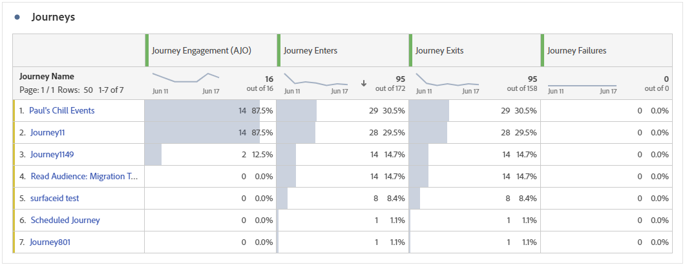
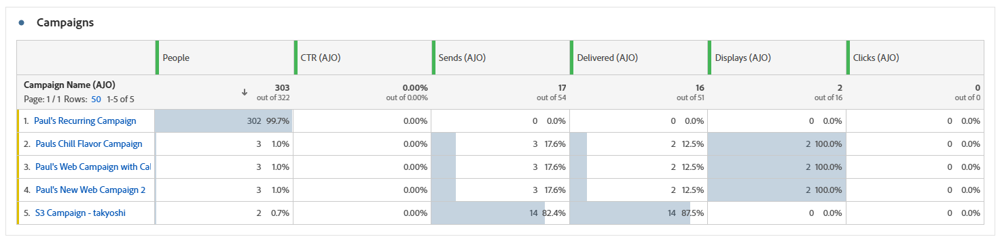
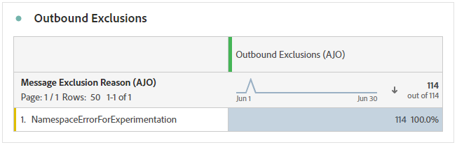

# Overzichtsrapport {#channel-report-cja}

Het overzichtsrapport biedt gebruikers een grondige samenvatting van verkeers en betrokkenheidsmetriek voor alle campagnes en reizen binnen uw milieu. Deze cijfers worden gecombineerd om uniforme waarden te presenteren voor acties die vanuit verschillende kanalen worden uitgevoerd en die verschillende campagnes en reizen omvatten.

U kunt tot het rapport van het Overzicht toegang hebben door aan het **menu van Rapporten** binnen de **sectie van het Beheer van de Reis** te navigeren.

De rapportpagina wordt getoond met de volgende lusjes:

* [Journeys](#journey)
* [Campagnes](#campaign)
* [Kanalen](#channel)

Meer over Customer Journey Analytics Workspace leren en hoe te om gegevens te filtreren en te analyseren, verwijs naar [ deze pagina ](https://experienceleague.adobe.com/en/docs/analytics-platform/using/cja-workspace/home).

## Hooglichten {#highlights}

De KPI&#39;s van **[!UICONTROL Highlights]** fungeren als een uitgebreid dashboard met een gedetailleerde uitsplitsing van de belangrijkste meetgegevens voor alle campagnes en reizen binnen uw omgeving, zodat u de prestaties snel kunt beoordelen en gebieden voor verbetering kunt identificeren.

+++ Meer informatie over maatstaven voor hooglichten

* **[!UICONTROL Journey engagement]**: Het totale aantal unieke personen dat berichten heeft ontvangen die door de reis zijn verzonden, die verschillende profielen vertegenwoordigen die een bepaald actiepunt in de reis hebben bereikt.

* **[!UICONTROL Journey Enters]**: Het totale aantal personen dat de gebeurtenis entry van de reis heeft bereikt.

* **[!UICONTROL Journey Failures]**: Het totale aantal individuele reizen dat niet succesvol is uitgevoerd.

* **[!UICONTROL Click through rate]**: percentage klikken in uw berichten.

* **[!UICONTROL Click-through open rate (CTOR)]**: Het aantal keren dat het bericht is geopend.

* **[!UICONTROL People]**: Aantal gebruikersprofielen dat als doelprofielen voor uw berichten in aanmerking komt.

* **[!UICONTROL Clicks]**: Het aantal keer dat er op de inhoud in de berichten is geklikt.

* **[!UICONTROL Spam complaints]**: Het aantal keren dat een bericht is gedeclareerd als spam of junk.

* **[!UICONTROL Unsubscribes]**: Het aantal klikken op de koppeling voor het opzeggen van abonnementen.

+++

## Reis {#journey}

De tabel **[!UICONTROL Journey]** fungeert als een uitgebreid dashboard dat een analyse biedt van de belangrijkste meetgegevens die betrekking hebben op uw reis. Het bevat details zoals het aantal ingevoerde profielen en gevallen van mislukte individuele reizen, die een grondig inzicht in de doeltreffendheid van uw reis en betrokkenheidsniveaus bieden.

Door op de naam van om het even welke reis te klikken die in deze lijst wordt vermeld, kunt u elke reis afzonderlijk onderzoeken, die directe toegang tot zijn uitvoerig rapport in een nieuw lusje krijgen.

+++ Meer informatie over reisgegevens

* **[!UICONTROL Journey Enters]**: Het totale aantal personen dat de gebeurtenis entry van de reis heeft bereikt.

* **[!UICONTROL Journey Exits]**: Het totale aantal personen dat de reis heeft verlaten.

* **[!UICONTROL Journey Failures]**: Het totale aantal individuele reizen dat niet succesvol is uitgevoerd.

+++

## Campagnes {#campaign}

De tabel van **[!UICONTROL Campaign]** werkt als een allesomvattend dashboard, dat een gedetailleerd overzicht van kritieke metriek voor uw campagne presenteert. Het bevat essentiële gegevens zoals het aantal profielen en het aantal verzendingen, waardoor u een uitgebreide insight krijgt voor de prestaties en de service van uw campagne.

Door op de naam van om het even welke campagne te klikken die in deze lijst wordt vermeld, kunt u elke campagne individueel onderzoeken, die directe toegang tot zijn uitvoerig rapport in een nieuw lusje krijgen.

+++ Meer informatie over campagnemetriek

* **[!UICONTROL People]**: Aantal gebruikersprofielen dat als doelprofielen voor uw berichten in aanmerking komt.

* **[!UICONTROL Click through rate (CTR)]**: percentage klikken in uw berichten.

* **[!UICONTROL Sends]**: Het totale aantal verzendingen voor elke campagne.

* **[!UICONTROL Delivered]**: Aantal berichten verzonden.

* **[!UICONTROL Displays]**: Het aantal keren dat het bericht is geopend.

* **[!UICONTROL Clicks]**: Het aantal keer dat er op de inhoud in de berichten is geklikt.

+++

## Kanalen {#channel}

### Kanalen

De tabel **[!UICONTROL Channels]** bevat een gedetailleerde uitsplitsing van de betrokkenheid van uw profielen bij uw berichten op kanaalniveau. Hierdoor kunt u dieper inzicht krijgen in de manier waarop verschillende kanalen werken.

+++ Meer informatie over de meetgegevens van kanalen

* **[!UICONTROL People]**: Aantal gebruikersprofielen dat als doelprofielen voor uw berichten in aanmerking komt.

* **[!UICONTROL Click through rate (CTR)]**: percentage klikken in uw berichten.

* **[!UICONTROL Delivered]**: Aantal berichten verzonden.

* **[!UICONTROL Displays]**: Het aantal keren dat het bericht is geopend.

* **[!UICONTROL Clicks]**: Het aantal keer dat er op de inhoud in de berichten is geklikt.

+++

### Uitgaande fouten

In de tabel **[!UICONTROL Outbound errors]** kunt u precies aangeven welke fouten tijdens het verzendproces zijn opgetreden. Zo krijgt u een duidelijk inzicht in de ondervonden problemen.

### Uitgaande uitsluitingen

De tabel **[!UICONTROL Outbound exclusions]** bevat een uitgebreide weergave van de verschillende factoren die ertoe hebben geleid dat gebruikersprofielen zijn uitgesloten van het doelpubliek, waardoor het bericht niet is ontvangen.
