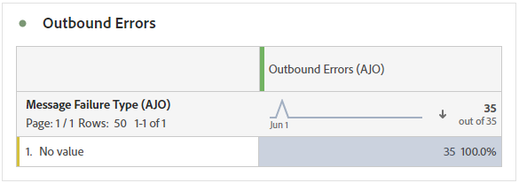

# Overzichtsrapport {#channel-report-cja}

Het overzichtsrapport biedt gebruikers een grondige samenvatting van verkeers en betrokkenheidsmetriek voor alle campagnes en reizen binnen uw milieu. Deze cijfers worden gecombineerd om uniforme waarden te presenteren voor acties die vanuit verschillende kanalen worden uitgevoerd en die verschillende campagnes en reizen omvatten.

U kunt tot het rapport van het Overzicht toegang hebben door aan **Rapporten** in het menu **Reisbeheer** sectie.

De rapportpagina wordt getoond met de volgende lusjes:

* [Journeys](#journey)
* [Campagnes](#campaign)
* [Kanalen](#channel)

Voor meer informatie over Customer Journey Analytics Workspace en over het filteren en analyseren van gegevens raadpleegt u [deze pagina](https://experienceleague.adobe.com/en/docs/analytics-platform/using/cja-workspace/home).

## Hooglichten {#highlights}

De **[!UICONTROL Highlights]** KPI&#39;s fungeren als een uitgebreid dashboard met een gedetailleerde uitsplitsing van de belangrijkste meetgegevens voor alle campagnes en reizen binnen uw omgeving, zodat u de prestaties snel kunt beoordelen en gebieden voor verbetering kunt identificeren.

+++ Meer informatie over maatstaven voor hooglichten

* **[!UICONTROL Journey engagement]**: Het totale aantal personen dat interactie had met de berichten die van de reis werden verzonden.

* **[!UICONTROL Journey Enters]**: Totaal aantal personen dat de inreisgebeurtenis van de reis heeft bereikt.

* **[!UICONTROL Journey Failures]**: Totaal aantal individuele reizen die niet succesvol zijn uitgevoerd.

* **[!UICONTROL Click through rate]**: Percentage klikken in uw berichten.

* **[!UICONTROL Click-through open rate (CTOR)]**: Het aantal keren dat het bericht is geopend.

* **[!UICONTROL People]**: Aantal gebruikersprofielen dat als doelprofielen voor uw berichten in aanmerking komt.

* **[!UICONTROL Clicks]**: Het aantal keer dat er op de inhoud in de berichten is geklikt.

* **[!UICONTROL Spam complaints]**: Het aantal keren dat een bericht is gedeclareerd als spam of junk.

* **[!UICONTROL Unsubscribes]**: Het aantal klikken op de koppeling voor het opzeggen van abonnementen.

+++

## Reis {#journey}

De **[!UICONTROL Journey]** tabel fungeert als een uitgebreid dashboard dat een analyse biedt van de belangrijkste meetgegevens die betrekking hebben op uw reis . Het bevat details zoals het aantal ingevoerde profielen en gevallen van mislukte individuele reizen, die een grondig inzicht in de doeltreffendheid van uw reis en betrokkenheidsniveaus bieden.

Door op de naam van om het even welke reis te klikken die in deze lijst wordt vermeld, kunt u elke reis afzonderlijk onderzoeken, die directe toegang tot zijn uitvoerig rapport in een nieuw lusje krijgen.

+++ Meer informatie over maatstaven voor reizen

* **[!UICONTROL Journey Enters]**: Totaal aantal personen dat de inreisgebeurtenis van de reis heeft bereikt.

* **[!UICONTROL Journey Exits]**: Totaal aantal personen dat de reis heeft verlaten.

* **[!UICONTROL Journey Failures]**: Totaal aantal individuele reizen die niet succesvol zijn uitgevoerd.

+++

## Campagnes {#campaign}

De **[!UICONTROL Campaign]** tabelfuncties als een allesomvattend dashboard, met een gedetailleerd overzicht van de belangrijkste meetgegevens voor uw campagne. Het bevat essentiële gegevens zoals het aantal profielen en verzendt, waardoor u een uitgebreid inzicht krijgt in de prestaties en de betrokkenheidsniveaus van uw campagne.

Door op de naam van om het even welke campagne te klikken die in deze lijst wordt vermeld, kunt u elke campagne individueel onderzoeken, die directe toegang tot zijn uitvoerig rapport in een nieuw lusje krijgen.

+++ Meer informatie over metingen voor campagnes

* **[!UICONTROL People]**: Aantal gebruikersprofielen dat als doelprofielen voor uw berichten in aanmerking komt.

* **[!UICONTROL Sends]**: Totaal aantal verzendingen voor elke campagne.

* **[!UICONTROL Displays]**: Het aantal keren dat het bericht is geopend.

* **[!UICONTROL Clicks]**: Het aantal keer dat er op de inhoud in de berichten is geklikt.

+++

## Kanalen {#channel}

### Kanalen

De **[!UICONTROL Channels]** de tabel bevat een gedetailleerde uitsplitsing van de betrokkenheid van uw profielen bij uw berichten op kanaalniveau. Hierdoor kunt u dieper inzicht krijgen in de manier waarop verschillende kanalen werken.

+++ Meer informatie over de meetgegevens van kanalen

* **[!UICONTROL People]**: Aantal gebruikersprofielen dat als doelprofielen voor uw berichten in aanmerking komt.

* **[!UICONTROL Click through rate]**: Percentage klikken in uw berichten.

* **[!UICONTROL Sends]**: Totaal aantal verzendingen voor elke campagne.

* **[!UICONTROL Displays]**: Het aantal keren dat het bericht is geopend.

* **[!UICONTROL Clicks]**: Het aantal keer dat er op de inhoud in de berichten is geklikt.

+++

### Uitgaande fouten

De **[!UICONTROL Outbound errors]** de lijst machtigt u om de nauwkeurige fouten te identificeren die tijdens het verzendende proces voorkwamen, die een duidelijk inzicht in om het even welke kwesties vergemakkelijken werden ontmoet.

### Uitgaande uitsluitingen

De **[!UICONTROL Outbound exclusions]** de tabel bevat een uitgebreid overzicht van de verschillende factoren die ertoe hebben geleid dat gebruikersprofielen van het beoogde publiek zijn uitgesloten , waardoor het bericht niet is ontvangen .
