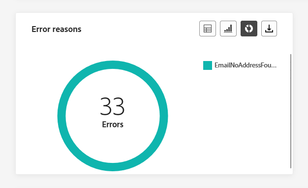
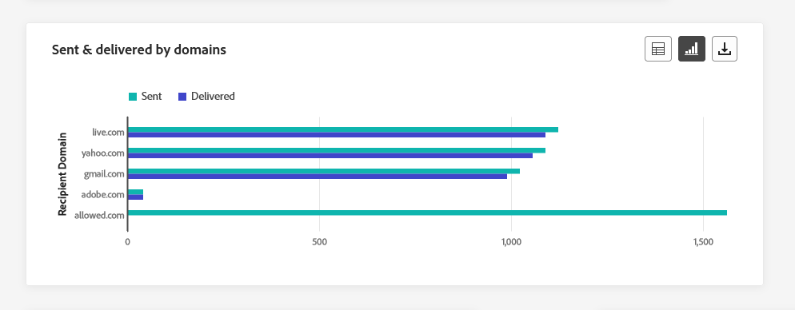
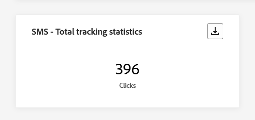
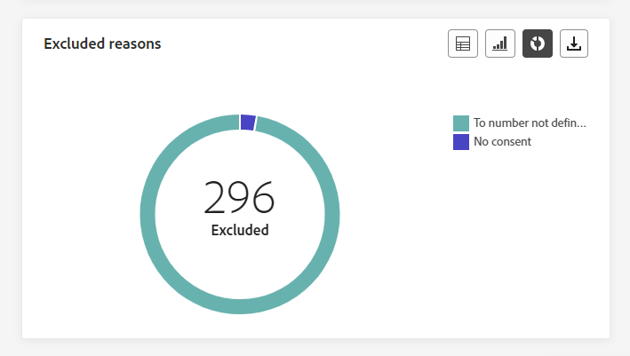

# Kanaalrapporten {#channel-report}

>[!CONTEXTUALHELP]
>id="ajo_channel_level_report"
>title="Rapport op kanaalniveau"
>abstract="De rapporten van het Kanaal bieden een uitvoerig overzicht van verkeer en betrokkenheidsmetriek over alle kanalen. Uw rapporten zijn verdeeld in verschillende widgets die uw campagne en het succes en de fouten van reizen gedetailleerd beschrijven. Elk rapportdashboard kan worden gewijzigd door widgets te vergroten of te verkleinen of te verwijderen."

>[!AVAILABILITY]
>
>De huidige ervaring met rapportage wordt met ingang van januari 2025 opgeheven. Na deze datum wordt de nieuwe ervaring met rapportage de norm. We raden u aan bekend te maken met de nieuwe functies en functies om een soepele overgang te garanderen. [ worden begonnen met Journey Optimizer nieuwe het Melden interface.](report-gs-cja.md)

>[!IMPORTANT]
>
> Om tot het **menu van het Rapport** toegang te hebben, moet u de **[!UICONTROL View Channel Reports]** toestemming hebben. [Meer informatie](channel-report-gs.md#before-starting-manage-reports-prereq)

De rapporten van het Kanaal verstrekken gebruikers een uitvoerig overzicht van verkeer en betrokkenheidsmetriek op kanaal-niveau. De meetwaarden worden samengevoegd om geconsolideerde waarden voor acties te presenteren die afkomstig zijn van het gekozen kanaal en die zich uitstrekken over verschillende campagnes en reizen.

U kunt tot de rapporten van het Kanaal toegang hebben door aan het **menu van Rapporten** binnen de **sectie van het Beheer van de Reis** te navigeren. Het is volledig aanpasbaar, kunt u uw gegevens filtreren afhankelijk van de datum van het Rapport of Actie. [Meer informatie](channel-report-gs.md)

De rapportpagina wordt getoond met de volgende lusjes:

* [Email](#email)
* [Pushmeldingen](#push)
* [Sms](#sms)
* [In-app](#inapp)
* [Web](#web)
* [Direct mail](#direct-mail)

➡️ [ ontdekt deze eigenschap in video ](#channel-report-video)

## Email {#email}

In het menu E-mail van uw Channel-rapporten vindt u de belangrijkste gegevens met betrekking tot de e-mails die in uw campagnes en reizen zijn verzonden. De cijfers worden hieronder beschreven.

### E-mail - Totaal verzendende statistieken {#email-total-sending}

>[!CONTEXTUALHELP]
>id="ajo_channel_email_sending_statistics"
>title="E-mail - Totaal verzendende statistieken"
>abstract="De e-mail - het totaal verzenden van statistieken KPIs vat essentiële gegevens over uw e-mail zoals Gerichte of Geleverde berichten samen."

De widget **[!UICONTROL Email Total Sending Statistics]** biedt een uitgebreid overzicht van uw e-mailprestaties, waarin belangrijke prestatie-indicatoren (KPI&#39;s) worden weergegeven waarmee essentiële gegevens over uw e-mailberichten worden samengevat.

+++ Meer informatie over statistieken over totale verzendstatistieken per e-mail

* **[!UICONTROL Targeted]**: Het totale aantal verwerkte e-mails.

* **[!UICONTROL Sent]**: Totaal aantal verzendingen.

* **[!UICONTROL Delivered]**: Aantal verzonden e-mailberichten in verhouding tot het totale aantal verzonden berichten.

* **[!UICONTROL Delivery Rate]**: percentage e-mailberichten is verzonden.

* **[!UICONTROL Bounces]**: Totaal aantal fouten gecumuleerd en automatische retourverwerking in verhouding tot het totale aantal verzonden berichten.

* **[!UICONTROL Bounce Rate]**: percentage e-mailberichten dat is teruggestuurd in vergelijking met verzonden e-mails.

* **[!UICONTROL Errors]**: het totale aantal fouten dat is opgetreden om te voorkomen dat deze naar profielen werd verzonden.

* **[!UICONTROL Error Rate]**: percentage fouten waardoor deze niet kon worden verzonden, vergeleken met verzonden e-mailberichten.

* **[!UICONTROL Excluded]**: aantal profielen dat door Adobe Journey Optimizer is uitgesloten.

* **[!UICONTROL Exclude rate]**: percentage profielen dat door Adobe Journey Optimizer is uitgesloten.

+++

### E-mail - Totaal aantal volgstatistieken {#email-total-tracking}

>[!CONTEXTUALHELP]
>id="ajo_channel_email_tracking_statistics"
>title="E-mail - Totaal aantal volgstatistieken"
>abstract="De KPI&#39;s voor statistieken over het bijhouden van gegevens via e-mail bieden gegevens over profielactiviteiten voor uw e-mails."

De **[!UICONTROL Email Total Tracking statistics]** -widget biedt een gedetailleerde momentopname van profielactiviteiten die aan uw e-mails zijn gekoppeld, en biedt essentiële inzichten in betrokkenheid en e-maileffectiviteit.

+++ Meer informatie over statistieken over het bijhouden van gegevens per e-mail

* **[!UICONTROL Opens]**: Het aantal keren dat het bericht is geopend.

* **[!UICONTROL Open Rate]**: Het totale aantal geopende e-mails in verhouding tot het aantal geleverde e-mails.

* **[!UICONTROL Clicks]**: Het aantal keren dat er op de inhoud is geklikt in een bericht.

* **[!UICONTROL Click rate]**: percentage gebruikers dat interactie heeft gehad met het e-mailbericht.

* **[!UICONTROL Spam complaints]**: Het aantal keren dat een bericht is gedeclareerd als spam of junk.

* **[!UICONTROL Spam complaint rate]**: percentage berichten dat is gedeclareerd als spam of junk in verhouding tot het aantal verzonden e-mails.

* **[!UICONTROL Unsubscribes]**: Het aantal klikken op de abonnementkoppeling.

* **[!UICONTROL Unsubscribe rate]**: percentage van abonnement ten opzichte van het aantal verzonden e-mails.

+++

### E-mail - Statistieken verzenden in de loop der tijd {#email-sending-statistics-overtime}

>[!CONTEXTUALHELP]
>id="ajo_channel_email_sending_statistics_overtime"
>title="E-mail - Statistieken verzenden in de loop der tijd"
>abstract="De e - mail - Verzendende statistieken in tijdgrafiek geven gegevens over verzonden e-mails weer, uitgesplitst op uur, dag, week, of maandbasis."

De grafiek van **[!UICONTROL Email - Sending Statistics over time]** biedt een dynamische vertegenwoordiging, die een analyse van uw e-mailactiviteit toont. Deze grafische weergave biedt een uitgebreide uitsplitsing van verzonden e-mailberichten, waarmee u trends en patronen kunt waarnemen op een schaal van uur, dag, week of maand.

+++ Meer informatie over e-mail - Statistieken verzenden over tijdsmetingen

* **[!UICONTROL Sent]**: Totaal aantal verzendingen.

* **[!UICONTROL Delivered]**: Aantal verzonden e-mailberichten in verhouding tot het totale aantal verzonden e-mails.

* **[!UICONTROL Bounces]**: Totaal aantal fouten gecumuleerd en automatische retourverwerking in verhouding tot het totale aantal verzonden e-mails.

* **[!UICONTROL Errors]**: het totale aantal fouten dat is opgetreden om te voorkomen dat deze naar profielen werd verzonden.

+++

### E-mail - Statistieken bijhouden in de loop der tijd {#email-tracking-statistics-overtime}

>[!CONTEXTUALHELP]
>id="ajo_channel_email_tracking_statistics_overtime"
>title="E-mail - Statistieken bijhouden in de loop der tijd"
>abstract="De E-mail - het Volgen statistieken over tijdsgrafiek verstrekt gegevens over profielactiviteit voor uw e-mail, die op een uur, dag, wekelijkse, of maandbasis wordt uitgesplitst."

De grafiek van **[!UICONTROL Email - Tracking statistics over time]** biedt een gedetailleerd overzicht van de profielactiviteiten met betrekking tot uw e-mails. Deze grafische weergave deelt de gegevens op uur-, dag-, week- of maandbasis op, en biedt waardevolle inzichten in hoe de betrokkenheid van de ontvanger zich ontwikkelt over verschillende tijdsintervallen.

+++ Meer informatie over e-mail - Statistieken bijhouden over tijdsmetingen

* **[!UICONTROL Opens]**: Het aantal keren dat het bericht is geopend.

* **[!UICONTROL Clicks]**: Het aantal keren dat er op de inhoud is geklikt in een bericht.

+++

### E-mail - rubrieken en redenen voor stuiteren {#bounce-categories}

>[!CONTEXTUALHELP]
>id="ajo_channel_email_bounce_categories"
>title="Stuitcategorieën"
>abstract="De categorieën Bounce en de tabel geven gegevens over zowel tijdelijke als permanente fouten."

>[!CONTEXTUALHELP]
>id="ajo_channel_email_bounce_reasons"
>title="Stuitingsredenen"
>abstract="De grafieken en de tabel met Bounces Reasons bevatten de beschikbare gegevens met betrekking tot berichten die worden teruggestuurd."

Met de widgets **[!UICONTROL Bounce categories]** en **[!UICONTROL Bounce reasons]** worden de gegevens ingekapseld die aan teruggestuurde berichten zijn gekoppeld. Deze widgets bieden een uitgebreid overzicht van de verschillende categorieën en de specifieke redenen voor de berichtgrenzen

Voor meer informatie over grenzen, verwijs naar de [ lijst van de Onderdrukking ](../reports/suppression-list.md) pagina.

+++ Meer informatie over de maatstaven van Bounce-rubrieken

* **[!UICONTROL Hard bounce]**: Het totale aantal permanente fouten, zoals een onjuist e-mailadres. Dit omvat een foutbericht waarin expliciet wordt aangegeven dat het adres ongeldig is, zoals Onbekende gebruiker.

* **[!UICONTROL Soft bounce]**: Het totale aantal tijdelijke fouten, zoals een volledig Postvak IN.

* **[!UICONTROL Ignored]**: Het totale aantal tijdelijke bestanden, zoals Buiten-kantoor, of een technische fout, bijvoorbeeld als het type afzender postmaster is.

+++

### Foutredenen {#error-reasons}

>[!CONTEXTUALHELP]
>id="ajo_channel_email_error_reasons"
>title="Foutredenen"
>abstract="Met de grafieken en de tabel met oorzaken van fouten kunt u de specifieke fouten identificeren die tijdens het verzendingsproces zijn opgetreden."

Met de grafieken en de tabel van **[!UICONTROL Error Reasons]** kunt u precies aangeven welke fouten tijdens het verzendingsproces zijn opgetreden. Zo krijgt u een duidelijk inzicht in de ondervonden problemen.

### Uitgesloten redenen {#excluded-reasons}

>[!CONTEXTUALHELP]
>id="ajo_channel_email_excluded_reasons"
>title="Uitgesloten redenen"
>abstract="In de grafieken en de tabel met uitgesloten redenen worden de verschillende factoren weergegeven die hebben geleid tot gebruikersprofielen die zijn uitgesloten van het doelpubliek en die het bericht niet ontvangen."

De grafieken en tabel van **[!UICONTROL Excluded reasons]** bevatten een uitgebreide weergave van de verschillende factoren die ertoe hebben geleid dat gebruikersprofielen zijn uitgesloten van het doelpubliek, waardoor het bericht niet is ontvangen.

Verwijs naar [ deze pagina ](exclusion-list.md) voor de uitvoerige lijst van uitsluitingsredenen.

### Verzonden en geleverd op domeinen {#sent-delivered-domains}

>[!CONTEXTUALHELP]
>id="ajo_channel_email_sending_delivered_domains"
>title="Verzonden en geleverd op domeinen"
>abstract="De grafiek en tabel die worden verzonden en geleverd door domeinen geven een indeling op domeinniveau weer van elke belangrijke e-mail die gegevens verzendt."

De tabel en grafiek van **[!UICONTROL Sent & delivered by domains]** bevatten een gedetailleerde uitsplitsing van e-mailleveringen op domeinniveau, zodat u uitgebreide inzichten kunt krijgen in de prestaties van uw e-mails.

+++ Meer informatie over Verzonden en geleverde waarden per domein

* **[!UICONTROL Sent]**: Het totale aantal verzendingen voor uw e-mail.

* **[!UICONTROL Delivered]**: Het aantal berichten dat is verzonden in verhouding tot het totale aantal verzonden berichten.

+++

### Stuitingen en fouten per domein {#bounces-errors-domains}

>[!CONTEXTUALHELP]
>id="ajo_channel_email_bounces_errors_domains"
>title="Stuitingen en fouten per domein"
>abstract="De Bounces &amp; de fouten door domeingrafiek en de lijst vertegenwoordigen domein-vlakke uitsplitsing van specifieke fouten die tijdens het verzendende proces voorkwamen."

De grafiek en de tabel van **[!UICONTROL Bounces & errors by domains]** bevatten een specificatie op domeinniveau van specifieke fouten die tijdens het verzendingsproces zijn aangetroffen. Hierin wordt een gedetailleerde analyse gegeven van de problemen die zich hebben voorgedaan.

+++ Meer informatie over grenzen en fouten per domeinmetriek

* **[!UICONTROL Bounces]**: het totaal aan fouten dat tijdens het verzendproces is gecumuleerd en de automatische retourverwerking in verhouding tot het totale aantal verzonden berichten.

* **[!UICONTROL Errors]**: het totale aantal fouten dat is opgetreden tijdens het verzendproces waardoor het niet naar profielen kan worden verzonden.

+++

### Openen en klikken op domeinen {#open-clicks-domains}

>[!CONTEXTUALHELP]
>id="ajo_channel_email_open_clicks_domains"
>title="Openen en klikken op domeinen"
>abstract="De grafiek en tabel voor Openen en klikken op domeinen geven een overzicht van de betrokkenheid van uw bezoekers bij uw e-mail op domeinniveau."

In de grafiek en tabel van **[!UICONTROL Open & clicks by domains]** ziet u een overzicht op domeinniveau van de betrokkenheid van uw bezoekers bij uw e-mail. Zo krijgt u waardevolle inzichten in de manier waarop verschillende domeinen met uw inhoud werken.

+++ Meer informatie over Openen en klikken op domeinmetriek

* **[!UICONTROL Opens]**: Het aantal keren dat de e-mail is geopend.

* **[!UICONTROL Clicks]**: Het aantal keer dat er op inhoud is geklikt in een e-mail.

+++

### Bounce reason by domain {#bounce-reasons-domains}

>[!CONTEXTUALHELP]
>id="ajo_channel_email_bounce_reasons_domains"
>title="Bounce reason by domain"
>abstract="De redenen van de Stuiting door domein door domeingrafiek en lijst vertegenwoordigen domein-vlakke uitsplitsing van gegevens over zowel tijdelijke als permanente fouten."

De grafiek en de tabel van **[!UICONTROL Bounce reasons by domain]** bevatten een uitsplitsing op domeinniveau van gegevens die betrekking hebben op zowel tijdelijke als permanente fouten. Zo krijgt u gedetailleerde inzichten van de redenen die ten grondslag liggen aan aangekondigde berichten.

Voor meer informatie over grenzen, verwijs naar de [ lijst van de Onderdrukking ](../reports/suppression-list.md) pagina.

## Pushmelding {#push}

Van uw rapporten van het Kanaal, details het **Push- bericht** menu de belangrijkste informatie met betrekking tot dupberichten die in uw Campagnes en Reizen worden verzonden. Metrisch worden hieronder beschreven.

### Pushberichten - Totaal verzendende statistieken {#push-total-sending}

>[!CONTEXTUALHELP]
>id="ajo_channel_push_sending_statistics"
>title="Pushberichten - Totaal verzendende statistieken"
>abstract="De pushberichten - het totaal verzenden van statistieken KPIs vatten essentiële gegevens over uw dupberichten zoals Gericht of Geleverd samen."

De KPI&#39;s van **[!UICONTROL Push notifications - Total sending statistics]** fungeren als een uitgebreide samenvatting waarin essentiële gegevens met betrekking tot uw pushberichten zijn opgenomen. Deze meetgegevens bevatten gedetailleerde inzichten in het doelpubliek en de werkelijke leveringsstatus, zodat u een goed doordachte weergave krijgt van de effectiviteit en het bereik van uw pushberichten.

+++ Meer informatie over pushberichten - statistische gegevens totaal verzenden

* **[!UICONTROL Targeted]**: Het totale aantal verwerkte pushberichten.

* **[!UICONTROL Sent]**: Totaal aantal verzonden pushberichten.

* **[!UICONTROL Delivered]**: Het aantal pushmeldingen dat is verzonden, in verhouding tot het totale aantal verzonden pushmeldingen.

* **[!UICONTROL Delivery Rate]**: percentage pushberichten dat is verzonden.

* **[!UICONTROL Bounces]**: Totaal aantal fouten gecumuleerd en automatische retourverwerking in verhouding tot het totale aantal verzonden berichten.

* **[!UICONTROL Bounce Rate]**: percentage pushmeldingen dat is teruggestuurd in vergelijking met verzonden pushberichten.

* **[!UICONTROL Errors]**: het totale aantal fouten dat is opgetreden om te voorkomen dat deze naar profielen werd verzonden.

* **[!UICONTROL Error Rate]**: percentage fouten dat ervoor zorgde dat deze niet konden worden verzonden, vergeleken met verzonden pushberichten.

* **[!UICONTROL Excluded]**: aantal profielen dat door Adobe Journey Optimizer is uitgesloten.

* **[!UICONTROL Exclude rate]**: percentage profielen dat door Adobe Journey Optimizer is uitgesloten.

+++

### Pushmelding - Totaal aantal volgstatistieken {#push-total-tracking}

>[!CONTEXTUALHELP]
>id="ajo_channel_push_tracking_statistics"
>title="Pushmelding - Totaal aantal volgstatistieken"
>abstract="Het pushbericht - De statistische gegevens voor het bijhouden van gegevens bevatten gegevens over de profielactiviteit voor uw pushberichten."

De **[!UICONTROL Push notification - Total tracking statistics]** -widget biedt een gedetailleerde momentopname van profielactiviteiten die aan uw pushberichten zijn gekoppeld, en biedt essentiële inzichten in de doeltreffendheid van betrokkenheid en pushberichten.

+++ Meer informatie over pushberichten - statistische gegevens over het bijhouden van gegevens

* **[!UICONTROL Opens]**: Het aantal keren dat een pushmelding is geopend.

* **[!UICONTROL Open Rate]**: percentage geopende pushberichten.

* **[!UICONTROL Actions]**: Totaal aantal acties voor de geleverde pushmelding, bijvoorbeeld klikken op de knop of ontslag.

* **[!UICONTROL Action rate]**: percentage acties op de geleverde pushmelding in vergelijking met verzonden pushberichten.

+++

### Pushmeldingen - Statistieken verzenden in de loop der tijd {#push-sending-overtime}

>[!CONTEXTUALHELP]
>id="ajo_channel_push_sending_statistics_overtime"
>title="Pushmeldingen - Statistieken verzenden in de loop der tijd"
>abstract="De grafiek van het Bericht van de Duw die statistieken over tijdsgrafiek verzendt geeft gegevens betreffende verzonden pushberichten, uitgesplitst op een uur, een dag, een wekelijkse, of maandbasis."

De grafiek van **[!UICONTROL Push notifications - Sending statistics over time]** biedt een dynamische vertegenwoordiging, die een analyse van uw activiteit van pushberichten toont. Deze grafische weergave biedt een uitgebreide uitsplitsing van verzonden pushberichten, waarmee u trends en patronen kunt waarnemen op een schaal van uur, dag, week of maand.

+++ Meer informatie over pushmeldingen - Statistieken over de tijd verzenden

* **[!UICONTROL Sent]**: Totaal aantal verzonden pushberichten.

* **[!UICONTROL Delivered]**: Het aantal pushmeldingen dat is verzonden, in verhouding tot het totale aantal verzonden pushmeldingen.

* **[!UICONTROL Bounces]**: Totaal aantal fouten gecumuleerd en automatische retourverwerking in verhouding tot het totale aantal verzonden berichten.

* **[!UICONTROL Errors]**: het totale aantal fouten dat is opgetreden om te voorkomen dat deze naar profielen werd verzonden.

+++

### Pushmeldingen - Statistieken bijhouden in de loop der tijd {#push-tracking-overtime}

>[!CONTEXTUALHELP]
>id="ajo_channel_push_tracking_statistics_overtime"
>title="Pushmeldingen - Statistieken bijhouden in de loop der tijd"
>abstract="De pushberichten - Het bijhouden van statistieken in de tijdgrafiek geeft gegevens over de profielactiviteit voor uw pushberichten, uitgesplitst op een uur-, dag-, week- of maandbasis."

De grafiek van **[!UICONTROL Push notifications - Tracking statistics over time]** biedt een gedetailleerd overzicht van de profielactiviteit met betrekking tot uw pushberichten. Deze grafische weergave deelt de gegevens op uur-, dag-, week- of maandbasis op, en biedt waardevolle inzichten in hoe de betrokkenheid van de ontvanger zich ontwikkelt over verschillende tijdsintervallen.

+++ Meer informatie over pushmeldingen - Statistieken bijhouden over tijdwaarden

* **[!UICONTROL Opens]**: Het aantal keren dat uw pushmelding is geopend.

* **[!UICONTROL Actions]**: Totaal aantal acties voor de geleverde pushmelding, bijvoorbeeld klikken op de knop of ontslag.

+++

### Pushmeldingen - Uitgesloten redenen {#push-excluded-reasons}

>[!CONTEXTUALHELP]
>id="ajo_channel_push_excluded_reasons"
>title="Uitgesloten redenen"
>abstract="In de grafieken en de tabel met uitgesloten redenen worden de verschillende factoren weergegeven die hebben geleid tot gebruikersprofielen die zijn uitgesloten van het doelpubliek en die het bericht niet ontvangen."

In de grafiek en tabel van **[!UICONTROL Excluded reasons]** ziet u de verschillende redenen waarom gebruikersprofielen, die zijn uitgesloten van de doelprofielen, uw pushberichten niet hebben ontvangen.

Verwijs naar [ deze pagina ](exclusion-list.md) voor de uitvoerige lijst van uitsluitingsredenen.

### Pushmeldingen - Foutredenen {#push-error-reasons}

>[!CONTEXTUALHELP]
>id="ajo_channel_push_error_reasons"
>title="Foutredenen"
>abstract="Met de grafieken en de tabel met oorzaken van fouten kunt u de specifieke fouten identificeren die tijdens het verzendingsproces zijn opgetreden."

De grafieken en tabel van **[!UICONTROL Error Reasons]** bieden u de mogelijkheid om de specifieke fouten te identificeren die zijn opgetreden tijdens het verzenden van uw pushberichten. Zo krijgt u gedetailleerde informatie over eventuele problemen die zich onderweg hebben voorgedaan.

### Pushmeldingen - Bijhouden per platform {#push-tracking-platform}

>[!CONTEXTUALHELP]
>id="ajo_channel_push_tracking_statistics_platform"
>title="Statistieken bijhouden per platform"
>abstract="De statistieken van het Volgen door platformgrafiek en lijst verstrekken gegevens over profielactiviteit voor uw dupberichten afhankelijk van het operationele systeem van uw profiel."

In de grafieken en tabellen van **[!UICONTROL Push notifications - Tracking by platform]** wordt de activiteit van de ontvangers voor uw pushmelding beschreven, afhankelijk van het besturingssysteem van uw profiel.

### Pushmeldingen - Verzenden per platform {#push-sending-platform}

>[!CONTEXTUALHELP]
>id="ajo_channel_push_sending_statistics_platform"
>title="Statistieken verzenden per platform"
>abstract="De verzendende statistieken per platformgrafiek en tabel bevatten gegevens over verzonden pushberichten."

De grafiek en tabellen van **[!UICONTROL Push notifications - Sending by platform]** bevatten een uitgebreide specificatie van het succes van uw pushberichten ten opzichte van de besturingssystemen van uw profielen. Deze grondige analyse biedt waardevolle inzichten in de doeltreffendheid van uw pushberichten op verschillende platforms.

## Sms {#sms}

Van uw **Kanaal** rapporten, detailleert het menu van SMS de belangrijkste informatie met betrekking tot SMS die in uw Campagnes en Reizen wordt verzonden. De cijfers worden hieronder beschreven.

### SMS - Totaal aantal verzendende statistieken {#sms-sending-statistics}

>[!CONTEXTUALHELP]
>id="ajo_channel_sms_sending_statistics"
>title="SMS - Totaal aantal verzendende statistieken"
>abstract="SMS - het totaal verzenden van statistieken KPIs vat essentiële gegevens over uw SMS berichten zoals Gericht of Geleverd samen."

De KPI&#39;s van **[!UICONTROL SMS - Total sending statistics]** fungeren als een uitgebreide samenvatting waarin essentiële gegevens met betrekking tot uw SMS zijn opgenomen. Deze metriek omvat gedetailleerde inzichten in het gerichte publiek en de daadwerkelijke leveringsstatus, die een goed-afgeronde mening van de doeltreffendheid en het bereik van uw berichten van SMS verstrekken.

+++ Meer informatie over pushberichten - statistische gegevens totaal verzenden

* **[!UICONTROL Targeted]**: Aantal gebruikersprofielen dat als doelprofielen voor het kanaal van SMS kwalificeert.

* **[!UICONTROL Sent]**: Totaal aantal verzonden SMS-berichten.

* **[!UICONTROL Delivered]**: Het aantal SMS-berichten dat is verzonden, in verhouding tot het totale aantal verzonden SMS-berichten.

* **[!UICONTROL Delivery Rate]**: percentage SMS-berichten dat is verzonden.

* **[!UICONTROL Bounces]**: Totaal aantal fouten gecumuleerd en automatische retourverwerking in verhouding tot het totale aantal verzonden SMS-berichten.

* **[!UICONTROL Bounce Rate]**: percentage SMS-berichten dat is teruggestuurd in vergelijking met verzonden SMS-berichten.

* **[!UICONTROL Errors]**: het totale aantal fouten dat is opgetreden om te voorkomen dat deze naar profielen werd verzonden.

* **[!UICONTROL Error Rate]**: percentage fouten dat ervoor zorgde dat het niet werd verzonden vergeleken met verzonden SMS-berichten.

* **[!UICONTROL Excluded]**: Aantal gebruikersprofielen dat is uitgesloten van de doelprofielen en dat het bericht niet heeft ontvangen.

* **[!UICONTROL Exclude rate]**: percentage profielen dat door Adobe Journey Optimizer is uitgesloten.

+++

### SMS - Totaal aantal volgstatistieken {#sms-tracking-statistics}

>[!CONTEXTUALHELP]
>id="ajo_channel_sms_tracking_statistics"
>title="SMS - Totaal aantal volgstatistieken"
>abstract="De statistieken voor het bijhouden van SMS - Totaal bieden gegevens over profielactiviteiten voor je SMS-berichten."

De **[!UICONTROL SMS - Total tracking statistics]** -widget geeft een gedetailleerd overzicht van de belangrijkste informatie over de betrokkenheid van uw bezoekers bij uw URL&#39;s en biedt inzicht in de effectiviteit van uw SMS-berichten:

* **[!UICONTROL Clicks]**: Het aantal keer dat er op de inhoud is geklikt in het SMS-bericht.

### SMS - Statistieken over een tijdsverloop verzenden {#sms-sending-statistics-overtime}

>[!CONTEXTUALHELP]
>id="ajo_channel_sms_sending_statistics_overtime"
>title="SMS - Statistieken over een tijdsverloop verzenden"
>abstract="De sms - Verzendstatistieken in tijdgrafiek geven gegevens weer betreffende verzonden sms - berichten, uitgesplitst op uur, dag, week, of maandbasis."

De grafiek van **[!UICONTROL SMS - Sending statistics over time]** biedt een uitvoerige mening van verzonden SMS berichten, die gegevens verstrekken die op een uur, dag, wekelijkse, of maandbasis worden uitgesplitst. Deze grafische vertegenwoordiging staat u toe om tendensen in uw het overseinenactiviteit van SMS over verschillende tijdintervallen te volgen en te analyseren.

+++ Meer informatie over SMS - Statistieken verzenden over tijdsmetingen

* **[!UICONTROL Sent]**: Totaal aantal verzonden SMS-berichten.

* **[!UICONTROL Bounces]**: Totaal aantal fouten gecumuleerd en automatische retourverwerking in verhouding tot het totale aantal verzonden SMS-berichten.

* **[!UICONTROL Errors]**: het totale aantal fouten dat is opgetreden om te voorkomen dat deze naar profielen werd verzonden.

+++

### SMS - Statistieken bijhouden in de loop der tijd {#sms-tracking-statistics-overtime}

>[!CONTEXTUALHELP]
>id="ajo_channel_sms_tracking_statistics_overtime"
>title="SMS - Statistieken bijhouden in de loop der tijd"
>abstract="De sms - het Volgen statistieken over tijdsgrafiek verstrekt gegevens over profielactiviteit voor uw sms- berichten, die op een uur, dag, wekelijkse, of maandbasis worden uitgesplitst."

De grafiek van **[!UICONTROL SMS - Tracking statistics over time]** verstrekt gegevens over profielactiviteit met betrekking tot uw SMS berichten, die een gedetailleerde uitsplitsing op een uur, dag, wekelijkse, of maandbasis aanbieden. Met deze grafische weergave kunt u patronen in de betrokkenheid van gebruikers analyseren en begrijpen in verschillende tijdsintervallen.

* **[!UICONTROL Clicks]**: Het aantal keer dat er op de inhoud is geklikt in het SMS-bericht.

### Uitgesloten redenen {#sms-excluded-reasons}

>[!CONTEXTUALHELP]
>id="ajo_channel_sms_excluded_reasons"
>title="Uitgesloten redenen"
>abstract="In de grafieken en de tabel met uitgesloten redenen worden de verschillende factoren weergegeven die hebben geleid tot gebruikersprofielen die zijn uitgesloten van het doelpubliek en die het bericht niet ontvangen."

In de grafieken en tabel van **[!UICONTROL Excludes Reasons]** worden visueel de verschillende factoren weergegeven die ertoe hebben geleid dat gebruikersprofielen zijn uitgesloten van het doelpubliek, zodat gebruikers uw SMS-berichten niet kunnen ontvangen.

Verwijs naar [ deze pagina ](exclusion-list.md) voor de uitvoerige lijst van uitsluitingsredenen.

### Stuitingsredenen {#sms-bounce-reasons}

>[!CONTEXTUALHELP]
>id="ajo_channel_sms_bounce_reasons"
>title="Stuitingsredenen"
>abstract="De grafieken en de tabel met Bounces Reasons bevatten de beschikbare gegevens met betrekking tot berichten die worden teruggestuurd."

De **[!UICONTROL Bounces Reasons]** -grafieken en -tabel bieden een uitgebreid overzicht van gegevens met betrekking tot verzonden SMS-berichten, waarmee u waardevolle inzichten krijgt over de specifieke redenen achter sms-berichten.

### Foutredenen {#sms-error-reasons}

>[!CONTEXTUALHELP]
>id="ajo_channel_sms_error_reasons"
>title="Foutredenen"
>abstract="Met de grafieken en de tabel met oorzaken van fouten kunt u de specifieke fouten identificeren die tijdens het verzendingsproces zijn opgetreden."

Met de grafieken en de tabel van **[!UICONTROL Error Reasons]** kunt u de specifieke fouten identificeren die zijn opgetreden tijdens het verzenden van uw SMS-berichten. Zo kunt u een grondige analyse maken van alle ondervonden problemen.

## Direct mail {#direct-mail}

Van uw **Kanaal** rapporten, **Direct mail** menudetails de belangrijkste informatie met betrekking tot de Directe die postberichten in uw **worden verzonden Campagnes** en **reizen**. De methodes worden hieronder gedetailleerd.

### Directe post - Totale verzendende statistieken {#direct-mail-total-sending}

>[!CONTEXTUALHELP]
>id="ajo_channel_direct_sending_statistics"
>title="Directe post - Totale verzendende statistieken"
>abstract="Direct post - het Totaal verzenden van statistieken KPIs vat essentiële gegevens over uw direct-mailberichten zoals Gericht of Geleverd samen."

De widget **[!UICONTROL Direct mail - Total sending statistics]** biedt een uitgebreid overzicht van de prestaties van uw e-mailberichten, waarin de belangrijkste prestatie-indicatoren (KPI&#39;s) worden weergegeven waarmee de essentiële gegevens over uw e-mailberichten worden samengevat.

+++ Meer informatie over Direct mail - cijfers over totale verzendstatistieken

* **[!UICONTROL Targeted]**: Aantal gebruikersprofielen dat voldoet aan de doelprofielen voor uw e-mailberichten via Direct.

* **[!UICONTROL Sent]**: Totaal aantal verzendingen.

* **[!UICONTROL Errors]**: het totale aantal fouten dat is opgetreden om te voorkomen dat deze naar profielen werd verzonden.

* **[!UICONTROL Error Rate]**: percentage fouten dat ervoor zorgde dat deze niet konden worden verzonden, vergeleken met verzonden pushberichten.

* **[!UICONTROL Excluded]**: Aantal gebruikersprofielen dat is uitgesloten van de doelprofielen en dat het bericht niet heeft ontvangen.

* **[!UICONTROL Exclude rate]**: percentage profielen dat door Adobe Journey Optimizer is uitgesloten.

+++

### Uitgesloten redenen {#direct-mail-excluded-reasons}

>[!CONTEXTUALHELP]
>id="ajo_channel_direct_excluded_reasons"
>title="Uitgesloten redenen"
>abstract="In de grafieken en de tabel met uitgesloten redenen worden de verschillende factoren weergegeven die hebben geleid tot gebruikersprofielen die zijn uitgesloten van het doelpubliek en die het bericht niet ontvangen."

De grafieken en tabel van **[!UICONTROL Direct Mail - Excluded reasons]** illustreren visueel de verschillende factoren die ertoe hebben geleid dat gebruikersprofielen zijn uitgesloten van het beoogde publiek, zodat ze uw directe-mailberichten niet kunnen ontvangen.

Verwijs naar [ deze pagina ](exclusion-list.md) voor de uitvoerige lijst van uitsluitingsredenen.

### Foutredenen {#direct-mail-error-reasons}

>[!CONTEXTUALHELP]
>id="ajo_channel_direct_error_reasons"
>title="Foutredenen"
>abstract="Met de grafieken en de tabel met oorzaken van fouten kunt u de specifieke fouten identificeren die tijdens het verzendingsproces zijn opgetreden."

**[!UICONTROL Direct Mail - Error reasons]** verstrekt de middelen om specifieke fouten te identificeren die tijdens het verzendende proces van uw direct-mailberichten voorkwamen, die voor een gedetailleerde analyse van om het even welke gevonden kwesties toestaan.

## In-app {#in-app}

Uit uw Channel-rapporten vindt u in het menu In-app de belangrijkste informatie over berichten in de app die in uw campagnes en reizen worden verzonden. De cijfers worden hieronder beschreven.

### Totale betrokkenheid in de app {#inapp-total-engagement}

>[!CONTEXTUALHELP]
>id="ajo_channel_inapp_engagement"
>title="In-app - totale betrokkenheid"
>abstract="De in-app - totale betrokkenheid-KPI&#39;s bieden uitgebreide informatie over de betrokkenheid van uw bezoekers bij uw in-app-berichten, waaronder metriek zoals Impressies en Interacties."

**[!UICONTROL In-app total engagement]** KPIs levert uitvoerige inzichten in uw bezoekersbetrokkenheid met uw in-app berichten, die zeer belangrijke metriek zoals **Inpressies** en **Interacties** omvatten.

+++ Meer informatie over de totale betrokkenheidswaarden in de app

* **[!UICONTROL Impressions]**: het totale aantal berichten in de app dat aan alle gebruikers wordt geleverd.

* **[!UICONTROL Interactions]**: het totale aantal contracten met uw bericht in de app. Dit omvat alle handelingen die de gebruikers hebben uitgevoerd, zoals klikken, ontslag of andere interactie.

+++

### Overuren van betrokkenheid binnen de app {#inapp-engagement-overtime}

>[!CONTEXTUALHELP]
>id="ajo_channel_inapp_engagement_overtime"
>title="In-app - Betrokkenheid bij overuren"
>abstract="In de overloopgrafiek in de app - De overloopgrafiek van de betrokkenheid houdt in-app beelden en interacties bij, die uurs, dagelijks, wekelijks, en maandonderbrekingen verstrekken."

De grafiek van **[!UICONTROL In-app engagement overtime]** toont de evolutie van uw in-app beelden en interacties voor de betrokken periode door om het even welke indruk, ontbinding, of interactie te volgen.

+++ Meer informatie over metrische gegevens over in-app betrokkenheid bij overwerk

* **[!UICONTROL Impressions]**: het totale aantal berichten in de app dat aan alle gebruikers wordt geleverd.

* **[!UICONTROL Interactions]**: het totale aantal contracten met uw bericht in de app. Dit omvat alle handelingen die de gebruikers hebben uitgevoerd, zoals klikken, ontslag of andere interactie.

+++

## Web {#web}

Van uw **rapporten van het Kanaal**, detailleert het menu van het Web de belangrijkste informatie met betrekking tot Web-pagina&#39;s inbegrepen in uw **Campagnes** en **Reizen**. De cijfers worden hieronder beschreven.

### Web - totale betrokkenheid {#web-engagement-total}

>[!CONTEXTUALHELP]
>id="ajo_channel_web_engagement"
>title="Web - totale betrokkenheid"
>abstract="De Web - Totale betrokkenheid KPIs verstrekken uitvoerige informatie over de betrokkenheid van uw bezoekers bij uw Web-pagina&#39;s, met inbegrip van metriek zoals Impressies en Interacties."

De KPI&#39;s van **[!UICONTROL Web total engagement]** bieden uitgebreide inzichten in de betrokkenheid van uw bezoekers bij uw webpagina&#39;s, die belangrijke metriek omvatten zoals Impressies en Interacties.

+++ Meer informatie over de totale betrokkenheid op het web

* **[!UICONTROL Impressions]**: Het totale aantal webervaringen dat aan alle gebruikers wordt geleverd.

* **[!UICONTROL Interactions]**: Het totale aantal contracten met uw webpagina. Dit omvat alle handelingen die de gebruikers hebben uitgevoerd, zoals klikken of andere interacties.

+++

### Web - Totale betrokkenheid overuren {#web-engagement-total-overtime}

>[!CONTEXTUALHELP]
>id="ajo_channel_web_engagement_overtime"
>title="Web - Totale betrokkenheid overuren"
>abstract="De Web - de grafiek van de Betrokkenheid overwerk volgt uw Web-pagina&#39;s indrukken en interactie, die uurs, dagelijks, wekelijks, en maanduitsplitsingen verstrekken."

De **[!UICONTROL Web engagement overtime]** grafiek controleert de **Impressies** en **Interacties** van uw Web-pagina&#39;s, die gedetailleerde uitsplitsingen op een uur, dag, week, en maandbasis aanbieden.

+++ Meer informatie over de metriek van overwerk bij webbetrokkenheid

* **[!UICONTROL Impressions]**: Het totale aantal webervaringen dat aan alle gebruikers wordt geleverd.

* **[!UICONTROL Interactions]**: Het totale aantal contracten met uw webpagina. Dit omvat alle handelingen die de gebruikers hebben uitgevoerd, zoals klikken of andere interacties.

+++

## Kanaalrapport (video) {#channel-report-video}

Leer hoe u rapporten op kanaalniveau in deze video kunt openen, navigeren en exporteren

>[!VIDEO](https://video.tv.adobe.com/v/3424537?quality=12)
