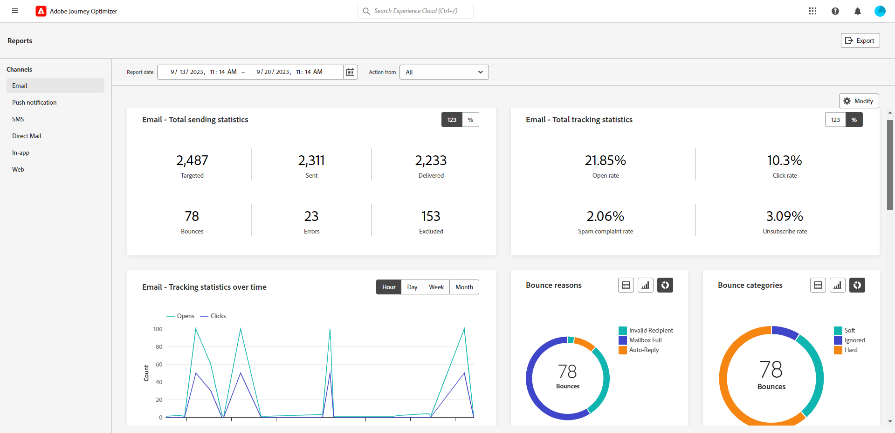

# Kanaalrapporten {#channel-report}

>[!CONTEXTUALHELP]
>id="ajo_channel_level_report"
>title="Rapport op kanaalniveau"
>abstract="De rapporten van het Kanaal bieden een uitvoerig overzicht van verkeer en betrokkenheidsmetriek over alle kanalen. Uw rapporten zijn verdeeld in verschillende widgets die uw campagne en het succes en de fouten van reizen gedetailleerd beschrijven. Elk rapportdashboard kan worden gewijzigd door widgets te vergroten of te verkleinen of te verwijderen."

>[!IMPORTANT]
>
> Als u toegang wilt krijgen tot **Rapport** menu, moet u de **[!UICONTROL View Channel Reports]** toestemming. [Meer informatie](channel-report-gs.md#before-starting-manage-reports-prereq)

De rapporten van het Kanaal verstrekken gebruikers een uitvoerig overzicht van verkeer en betrokkenheidsmetriek op kanaal-niveau. De meetwaarden worden samengevoegd om geconsolideerde waarden voor acties te presenteren die afkomstig zijn van het gekozen kanaal en die zich uitstrekken over verschillende campagnes en reizen.

U kunt tot de rapporten van het Kanaal toegang hebben door aan **Rapporten** in het menu **Reisbeheer** sectie. Het is volledig aanpasbaar, kunt u uw gegevens filtreren afhankelijk van de datum van het Rapport of Actie. [Meer informatie](channel-report-gs.md)

De rapportpagina wordt getoond met de volgende lusjes:

* [Email](#email)
* [Pushmeldingen](#push)
* [Sms](#sms)
* [In-app](#inapp)
* [Web](#web)
* [Direct mail](#direct-mail)

➡️ [Ontdek deze functie in video](#channel-report-video)

## Email {#email}

>[!CONTEXTUALHELP]
>id="ajo_channel_email_sending_statistics"
>title="E-mail - Totaal verzendende statistieken"
>abstract="De e-mail - Totaal verzendende statistieken KPIs vat essentiële gegevens over uw dupberichten zoals Gerichte of Geleverde berichten samen."

>[!CONTEXTUALHELP]
>id="ajo_channel_email_tracking_statistics"
>title="E-mail - Totaal aantal volgstatistieken"
>abstract="De KPI&#39;s voor statistieken over het bijhouden van gegevens via e-mail bieden gegevens over profielactiviteiten voor uw e-mails."

>[!CONTEXTUALHELP]
>id="ajo_channel_email_sending_statistics_overtime"
>title="E-mail - Statistieken verzenden in de loop der tijd"
>abstract="De e - mail - Verzendende statistieken in tijdgrafiek geven gegevens over verzonden e-mails weer, uitgesplitst op uur, dag, week, of maandbasis."

>[!CONTEXTUALHELP]
>id="ajo_channel_email_tracking_statistics_overtime"
>title="E-mail - Statistieken bijhouden in de loop der tijd"
>abstract="De E-mail - het Volgen statistieken over tijdsgrafiek verstrekt gegevens over profielactiviteit voor uw e-mail, die op een uur, dag, wekelijkse, of maandbasis wordt uitgesplitst."

>[!CONTEXTUALHELP]
>id="ajo_channel_email_bounce_categories"
>title="Stuitcategorieën"
>abstract="De categorieën Bounce en de tabel geven gegevens over zowel tijdelijke als permanente fouten."

>[!CONTEXTUALHELP]
>id="ajo_channel_email_bounce_reasons"
>title="Stuitingsredenen"
>abstract="De grafieken en de tabel met Bounces Reasons bevatten de beschikbare gegevens met betrekking tot berichten die worden teruggestuurd."

>[!CONTEXTUALHELP]
>id="ajo_channel_email_error_reasons"
>title="Foutredenen"
>abstract="Met de grafieken en de tabel met oorzaken van fouten kunt u de specifieke fouten identificeren die tijdens het verzendingsproces zijn opgetreden."

>[!CONTEXTUALHELP]
>id="ajo_channel_email_excluded_reasons"
>title="Uitgesloten redenen"
>abstract="In de grafieken en de tabel met uitgesloten redenen worden de verschillende factoren weergegeven die hebben geleid tot gebruikersprofielen die zijn uitgesloten van het doelpubliek en die het bericht niet ontvangen."

>[!CONTEXTUALHELP]
>id="ajo_channel_email_sending_delivered_domains"
>title="Verzonden en geleverd op domeinen"
>abstract="De grafiek en tabel die worden verzonden en geleverd door domeinen geven een indeling op domeinniveau weer van elke belangrijke e-mail die gegevens verzendt."

>[!CONTEXTUALHELP]
>id="ajo_channel_email_bounces_errors_domains"
>title="Stuitingen en fouten per domein"
>abstract="De Bounces &amp; de fouten door domeingrafiek en de lijst vertegenwoordigen domein-vlakke uitsplitsing van specifieke fouten die tijdens het verzendende proces voorkwamen."

>[!CONTEXTUALHELP]
>id="ajo_channel_email_open_clicks_domains"
>title="Openen en klikken op domeinen"
>abstract="De grafiek en tabel voor Openen en klikken op domeinen geven een overzicht van de betrokkenheid van uw bezoekers bij uw e-mail op domeinniveau."

>[!CONTEXTUALHELP]
>id="ajo_channel_email_bounce_reasons_domains"
>title="Bounce reason by domain"
>abstract="De redenen van de Stuiting door domein door domeingrafiek en lijst vertegenwoordigen domein-vlakke uitsplitsing van gegevens over zowel tijdelijke als permanente fouten."

In het menu E-mail van uw Channel-rapporten vindt u de belangrijkste gegevens met betrekking tot de e-mails die in uw campagnes en reizen zijn verzonden. De cijfers worden hieronder beschreven.

+++ Meer informatie over de verschillende maatstaven en widgets die beschikbaar zijn voor het e-mailrapport.

De **[!UICONTROL Email Total Sending Statistics]** Grafiek geeft het succes van je e-mails weer:

* **[!UICONTROL Targeted]**: Totaal aantal verwerkte e-mails.

* **[!UICONTROL Sent]**: Totaal aantal verzendingen.

* **[!UICONTROL Delivered]**: Aantal verzonden e-mailberichten in verhouding tot het totale aantal verzonden berichten.

* **[!UICONTROL Delivery Rate]**: Percentage verzonden e-mailberichten.

* **[!UICONTROL Bounces]**: Totaal aantal gecumuleerde fouten en automatische retourverwerking in verhouding tot het totale aantal verzonden berichten.

* **[!UICONTROL Bounce Rate]**: Percentage van e-mails dat is teruggestuurd in vergelijking met verzonden e-mails.

* **[!UICONTROL Errors]**: Het totale aantal fouten dat is opgetreden waardoor deze niet naar profielen kon worden verzonden.

* **[!UICONTROL Error Rate]**: Percentage fouten dat voorkwam waardoor het niet kon worden verzonden vergeleken met verzonden e-mails.

* **[!UICONTROL Excluded]**: Aantal profielen dat door Adobe Journey Optimizer is uitgesloten.

* **[!UICONTROL Exclude rate]**: Percentage profielen dat door Adobe Journey Optimizer is uitgesloten.

De **[!UICONTROL Email Total Tracking statistics]** widget bevat de beschikbare gegevens voor profielactiviteiten voor uw e-mails:

* **[!UICONTROL Opens]**: Het aantal keren dat het bericht is geopend.

* **[!UICONTROL Open Rate]**: Het totale aantal geopende e-mails in verhouding tot het aantal geleverde e-mails.

* **[!UICONTROL Clicks]**: Het aantal keren dat er op de inhoud is geklikt in een bericht.

* **[!UICONTROL Click rate]**: Percentage gebruikers dat interactie heeft gehad met de e-mail.

* **[!UICONTROL Spam complaints]**: Het aantal keren dat een bericht is gedeclareerd als spam of junk.

* **[!UICONTROL Spam complaint rate]**: Percentage berichten dat als spam of junk wordt gedeclareerd in verhouding tot het aantal verzonden e-mails.

* **[!UICONTROL Unsubscribes]**: Het aantal klikken op de abonnementkoppeling.

* **[!UICONTROL Unsubscribe rate]**: Percentage van abonnement vergeleken met het aantal verzonden e-mails.

De **[!UICONTROL Sending Statistics over time]** De grafiek bevat de gegevens die beschikbaar zijn voor verzonden e-mailberichten, zoals:

* **[!UICONTROL Sent]**: Totaal aantal verzendingen.

* **[!UICONTROL Delivered]**: Aantal verzonden e-mails in verhouding tot het totale aantal verzonden e-mails.

* **[!UICONTROL Bounces]**: Totaal aantal gecumuleerde fouten en automatische verwerking van de geretourneerde hoeveelheid ten opzichte van het totale aantal verzonden e-mails.

* **[!UICONTROL Errors]**: Het totale aantal fouten dat is opgetreden waardoor deze niet naar profielen kon worden verzonden.

De **[!UICONTROL Email tracking statistics overtime]** grafiek bevat de gegevens die beschikbaar zijn voor openen en klikken.

De **[!UICONTROL Bounce Reasons]** en **[!UICONTROL Bounce categories]** widgets bevatten de beschikbare gegevens met betrekking tot berichten die worden teruggestuurd, zoals:

* **[!UICONTROL Hard bounce]**: Het totale aantal permanente fouten, zoals een onjuist e-mailadres. Dit omvat een foutbericht waarin expliciet wordt aangegeven dat het adres ongeldig is, zoals Onbekende gebruiker.

* **[!UICONTROL Soft bounce]**: Het totale aantal tijdelijke fouten, zoals een volledig postvak.

* **[!UICONTROL Ignored]**: Het totale aantal tijdelijke berichten, zoals Buiten-kantoor, of een technische fout, bijvoorbeeld als het type afzender postmaster is.

Voor meer informatie over grenzen raadpleegt u de [Onderdrukkingslijst](../reports/suppression-list.md) pagina.

De **[!UICONTROL Error Reasons]** in de grafiek en de tabel kunt u zien welke fout is opgetreden.

De **[!UICONTROL Excluded reasons]** de grafiek en de lijst tonen de verschillende redenen die gebruikersprofielen, uitgesloten van de gerichte profielen, van het ontvangen van het bericht verhinderden.

De **[!UICONTROL Bounce Reasons by domain]**, **[!UICONTROL Sent & delivered by domains]**, **[!UICONTROL Opens & Clicks by domain]**  en **[!UICONTROL Bounce & errors by domain]** tabellen en grafieken geven een indeling op domeinniveau weer van elke belangrijke e-maillevering en het bijhouden van gegevens.
+++

## Pushmelding {#push}

>[!CONTEXTUALHELP]
>id="ajo_channel_push_sending_statistics"
>title="Pushberichten - Totaal verzendende statistieken"
>abstract="De pushberichten - het totaal verzenden van statistieken KPIs vatten essentiële gegevens over uw dupberichten zoals Gericht of Geleverd samen."

>[!CONTEXTUALHELP]
>id="ajo_channel_push_tracking_statistics"
>title="Pushmelding - Totaal aantal volgstatistieken"
>abstract="Het pushbericht - De statistische gegevens voor het bijhouden van gegevens bevatten gegevens over de profielactiviteit voor uw pushberichten."

>[!CONTEXTUALHELP]
>id="ajo_channel_push_sending_statistics_overtime"
>title="Pushmeldingen - Statistieken verzenden in de loop der tijd"
>abstract="De grafiek van het Bericht van de Duw die statistieken over tijdsgrafiek verzendt geeft gegevens betreffende verzonden pushberichten, uitgesplitst op een uur, een dag, een wekelijkse, of maandbasis."

>[!CONTEXTUALHELP]
>id="ajo_channel_push_tracking_statistics_overtime"
>title="Pushmeldingen - Statistieken bijhouden in de loop der tijd"
>abstract="De pushberichten - Het bijhouden van statistieken in de tijdgrafiek geeft gegevens over de profielactiviteit voor uw pushberichten, uitgesplitst op een uur-, dag-, week- of maandbasis."

>[!CONTEXTUALHELP]
>id="ajo_channel_push_excluded_reasons"
>title="Uitgesloten redenen"
>abstract="In de grafieken en de tabel met uitgesloten redenen worden de verschillende factoren weergegeven die hebben geleid tot gebruikersprofielen die zijn uitgesloten van het doelpubliek en die het bericht niet ontvangen."

>[!CONTEXTUALHELP]
>id="ajo_channel_push_error_reasons"
>title="Foutredenen"
>abstract="Met de grafieken en de tabel met oorzaken van fouten kunt u de specifieke fouten identificeren die tijdens het verzendingsproces zijn opgetreden."

>[!CONTEXTUALHELP]
>id="ajo_channel_push_tracking_statistics_platform"
>title="Statistieken bijhouden per platform"
>abstract="De statistieken van het Volgen door platformgrafiek en lijst verstrekken gegevens over profielactiviteit voor uw dupberichten afhankelijk van het operationele systeem van uw profiel."

>[!CONTEXTUALHELP]
>id="ajo_channel_push_sending_statistics_platform"
>title="Statistieken verzenden per platform"
>abstract="De verzendende statistieken per platformgrafiek en tabel bevatten gegevens over verzonden pushberichten."

Uit uw Kanaalrapporten, details het Push berichtmenu de belangrijkste informatie met betrekking tot dupberichten die in uw Campagnes en Reizen worden verzonden. Metrisch worden hieronder beschreven.

+++  Meer informatie over de verschillende maatstaven en widgets die beschikbaar zijn voor het pushrapport.

De **[!UICONTROL Push notifications - Total sending statistics]** de tabel bevat de belangrijkste informatie met betrekking tot uw pushberichten met grafiek en PKI&#39;s:

* **[!UICONTROL Targeted]**: Totaal aantal verwerkte pushberichten.

* **[!UICONTROL Sent]**: Totaal aantal verzonden pushmeldingen.

* **[!UICONTROL Delivered]**: Het aantal pushmeldingen dat is verzonden in verhouding tot het totale aantal verzonden pushmeldingen.

* **[!UICONTROL Delivery Rate]**: Percentage pushmeldingen verzonden.

* **[!UICONTROL Bounces]**: Totaal aantal gecumuleerde fouten en automatische retourverwerking in verhouding tot het totale aantal verzonden berichten.

* **[!UICONTROL Bounce Rate]**: Percentage pushmeldingen dat is teruggestuurd in vergelijking met verzonden pushmeldingen.

* **[!UICONTROL Errors]**: Het totale aantal fouten dat is opgetreden waardoor deze niet naar profielen kon worden verzonden.

* **[!UICONTROL Error Rate]**: percentage fouten dat ervoor zorgde dat deze niet konden worden verzonden, vergeleken met verzonden pushberichten.

* **[!UICONTROL Excluded]**: Aantal profielen dat door Adobe Journey Optimizer is uitgesloten.

* **[!UICONTROL Exclude rate]**: Percentage profielen dat door Adobe Journey Optimizer is uitgesloten.

De **[!UICONTROL Push notification - Total tracking statistics]** bevat de beschikbare gegevens voor profielactiviteit voor uw pushberichten:

* **[!UICONTROL Opens]**: Het aantal keren dat een pushmelding is geopend.

* **[!UICONTROL Open Rate]**: Percentage geopende pushmeldingen.

* **[!UICONTROL Actions]**: Totaal aantal acties op de geleverde pushmelding, bijvoorbeeld klikken op de knop of ontslag.

* **[!UICONTROL Action rate]**: Percentage acties op de geleverde pushmelding in vergelijking met verzonden pushberichten.

* **[!UICONTROL Engagement Rate]**: Percentage van de knoppen en handelingen voor deze pushmelding, bijvoorbeeld als het profiel de pushmelding heeft geopend of als op een knop is geklikt.

De **[!UICONTROL Push notifications - Sending statistics over time]** De grafiek bevat de gegevens die beschikbaar zijn voor verzonden pushberichten, zoals:

* **[!UICONTROL Sent]**: Totaal aantal verzonden pushmeldingen.

* **[!UICONTROL Delivered]**: Het aantal pushmeldingen dat is verzonden in verhouding tot het totale aantal verzonden pushmeldingen.

* **[!UICONTROL Bounces]**: Totaal aantal gecumuleerde fouten en automatische retourverwerking in verhouding tot het totale aantal verzonden berichten.

* **[!UICONTROL Errors]**: Het totale aantal fouten dat is opgetreden waardoor deze niet naar profielen kon worden verzonden.

De **[!UICONTROL Excluded reasons]** de grafiek en de lijst tonen de verschillende redenen die gebruikersprofielen, uitgesloten van de gerichte profielen, van het ontvangen van het bericht verhinderden.

De **[!UICONTROL Error Reasons]** in de grafiek en de tabel kunt u zien welke fout is opgetreden.

De **[!UICONTROL Tracking by platform]** en **[!UICONTROL Sending by platform]** grafieken en tabellen geven het succes van uw pushmelding weer, afhankelijk van het besturingssysteem van uw profiel.
+++

## Sms {#sms}

>[!CONTEXTUALHELP]
>id="ajo_channel_sms_sending_statistics"
>title="SMS - Totaal aantal verzendende statistieken"
>abstract="SMS - het totaal verzenden van statistieken KPIs vat essentiële gegevens over uw SMS berichten zoals Gericht of Geleverd samen."

>[!CONTEXTUALHELP]
>id="ajo_channel_sms_tracking_statistics"
>title="SMS - Totaal aantal volgstatistieken"
>abstract="De statistieken voor het bijhouden van SMS - Totaal bieden gegevens over profielactiviteiten voor je SMS-berichten."

>[!CONTEXTUALHELP]
>id="ajo_channel_sms_sending_statistics_overtime"
>title="SMS - Statistieken over een tijdsverloop verzenden"
>abstract="De sms - Verzendstatistieken in tijdgrafiek geven gegevens weer betreffende verzonden sms - berichten, uitgesplitst op uur, dag, week, of maandbasis."

>[!CONTEXTUALHELP]
>id="ajo_channel_sms_tracking_statistics_overtime"
>title="SMS - Statistieken bijhouden in de loop der tijd"
>abstract="De sms - het Volgen statistieken over tijdsgrafiek verstrekt gegevens over profielactiviteit voor uw sms- berichten, die op een uur, dag, wekelijkse, of maandbasis worden uitgesplitst."

>[!CONTEXTUALHELP]
>id="ajo_channel_sms_excluded_reasons"
>title="Uitgesloten redenen"
>abstract="In de grafieken en de tabel met uitgesloten redenen worden de verschillende factoren weergegeven die hebben geleid tot gebruikersprofielen die zijn uitgesloten van het doelpubliek en die het bericht niet ontvangen."

>[!CONTEXTUALHELP]
>id="ajo_channel_sms_bounce_reasons"
>title="Stuitingsredenen"
>abstract="De grafieken en de tabel met Bounces Reasons bevatten de beschikbare gegevens met betrekking tot berichten die worden teruggestuurd."

>[!CONTEXTUALHELP]
>id="ajo_channel_sms_error_reasons"
>title="Foutredenen"
>abstract="Met de grafieken en de tabel met oorzaken van fouten kunt u de specifieke fouten identificeren die tijdens het verzendingsproces zijn opgetreden."

Uit uw Kanaalrapporten, detailleert het menu van SMS de belangrijkste informatie met betrekking tot SMS die in uw Campagnes en Reizen wordt verzonden. De cijfers worden hieronder beschreven.

+++ Meer informatie over de verschillende meetgegevens en widgets die beschikbaar zijn voor het SMS-rapport.

De **[!UICONTROL SMS - Total sending statistics]** in de tabel wordt aangegeven hoe succesvol je SMS is:

* **[!UICONTROL Targeted]**: Aantal gebruikersprofielen dat als doelprofielen voor het kanaal van SMS kwalificeert.

* **[!UICONTROL Sent]**: Totaal aantal verzonden SMS-berichten.

* **[!UICONTROL Delivered]**: Aantal SMS-berichten dat is verzonden in verhouding tot het totale aantal verzonden SMS-berichten.

* **[!UICONTROL Delivery Rate]**: Percentage SMS-berichten verzonden.

* **[!UICONTROL Bounces]**: Totaal aantal gecumuleerde fouten en automatische retourverwerking in verhouding tot het totale aantal verzonden SMS-berichten.

* **[!UICONTROL Bounce Rate]**: Percentage van SMS-berichten dat wordt teruggestuurd in vergelijking met verzonden SMS-berichten.

* **[!UICONTROL Errors]**: Het totale aantal fouten dat is opgetreden waardoor deze niet naar profielen kon worden verzonden.

* **[!UICONTROL Error Rate]**: percentage fouten dat voorkwam voorkómen dat het werd verzonden vergeleken met verzonden SMS-berichten.

* **[!UICONTROL Excluded]**: Aantal gebruikersprofielen dat is uitgesloten van de doelprofielen en dat het bericht niet heeft ontvangen.

* **[!UICONTROL Exclude rate]**: Percentage profielen dat door Adobe Journey Optimizer is uitgesloten.

De **[!UICONTROL SMS - Total tracking statistics]** widget geeft een gedetailleerde beschrijving van de belangrijkste informatie met betrekking tot de betrokkenheid van uw bezoekers bij uw URL&#39;s:

* **[!UICONTROL Clicks]**: Het aantal keren dat er op de inhoud is geklikt in het SMS-bericht.

* **[!UICONTROL Click rate]**: Percentage gebruikers dat interactie heeft gehad met het SMS-bericht.

De **[!UICONTROL SMS - Sending statistics over time]** widget geeft de belangrijkste informatie met betrekking tot uw bericht met een grafiek:

* **[!UICONTROL Sent]**: Totaal aantal verzonden SMS-berichten.

* **[!UICONTROL Delivered]**: Aantal SMS-berichten dat is verzonden in verhouding tot het totale aantal verzonden SMS-berichten.

* **[!UICONTROL Bounces]**: Totaal aantal gecumuleerde fouten en automatische retourverwerking in verhouding tot het totale aantal verzonden SMS-berichten.

* **[!UICONTROL Errors]**: Het totale aantal fouten dat is opgetreden waardoor deze niet naar profielen kon worden verzonden.

De **[!UICONTROL Exclude Reasons]**, **[!UICONTROL Bounces Reasons]** en **[!UICONTROL Error Reasons]** in grafieken en tabellen kunt u zien welke fout en uitsluitingen zijn opgetreden.

+++

## Direct mail {#direct-mail}

>[!CONTEXTUALHELP]
>id="ajo_channel_direct_sending_statistics"
>title="Directe post - Totale verzendende statistieken"
>abstract="Direct post - het Totaal verzenden van statistieken KPIs vat essentiële gegevens over uw direct-mailberichten zoals Gericht of Geleverd samen."

>[!CONTEXTUALHELP]
>id="ajo_channel_direct_excluded_reasons"
>title="Uitgesloten redenen"
>abstract="In de grafieken en de tabel met uitgesloten redenen worden de verschillende factoren weergegeven die hebben geleid tot gebruikersprofielen die zijn uitgesloten van het doelpubliek en die het bericht niet ontvangen."

>[!CONTEXTUALHELP]
>id="ajo_channel_direct_error_reasons"
>title="Foutredenen"
>abstract="Met de grafieken en de tabel met oorzaken van fouten kunt u de specifieke fouten identificeren die tijdens het verzendingsproces zijn opgetreden."

Uit uw rapporten van het Kanaal, details het Directe e-mailmenu de belangrijkste informatie met betrekking tot de Directe die postberichten in uw Campagnes en Reizen worden verzonden. De methodes worden hieronder gedetailleerd.

+++ Meer informatie over de verschillende maatstaven en widgets die beschikbaar zijn voor het rapport Direct mail.

De **[!UICONTROL Direct mail - Total sending statistics]** de lijst specificeert het succes van uw berichten:

* **[!UICONTROL Targeted]**: Aantal gebruikersprofielen dat als doelprofielen voor uw direct-mailberichten wordt gekwalificeerd.

* **[!UICONTROL Sent]**: Totaal aantal verzendingen.

* **[!UICONTROL Errors]**: Het totale aantal fouten dat is opgetreden waardoor deze niet naar profielen kon worden verzonden.

* **[!UICONTROL Error Rate]**: percentage fouten dat ervoor zorgde dat deze niet konden worden verzonden, vergeleken met verzonden pushberichten.

* **[!UICONTROL Excluded]**: Aantal gebruikersprofielen dat is uitgesloten van de doelprofielen en dat het bericht niet heeft ontvangen.

* **[!UICONTROL Exclude rate]**: Percentage profielen dat door Adobe Journey Optimizer is uitgesloten.

De **[!UICONTROL Exclude Reasons]** en **[!UICONTROL Error Reasons]** in grafieken en tabellen kunt u zien welke fout en uitsluitingen zijn opgetreden.
+++

## In-app {#in-app}

>[!CONTEXTUALHELP]
>id="ajo_channel_inapp_engagement"
>title="In-app - totale betrokkenheid"
>abstract="De in-app - totale betrokkenheid-KPI&#39;s bieden uitgebreide informatie over de betrokkenheid van uw bezoekers bij uw in-app-berichten, waaronder metriek zoals Impressies en Interacties."

>[!CONTEXTUALHELP]
>id="ajo_channel_inapp_engagement_overtime"
>title="In-app - Betrokkenheid bij overuren"
>abstract="In de overloopgrafiek in de app - De overloopgrafiek van de betrokkenheid houdt in-app beelden en interacties bij, die uurs, dagelijks, wekelijks, en maandonderbrekingen verstrekken."

Uit uw Channel-rapporten vindt u in het menu In-app de belangrijkste informatie over berichten in de app die in uw campagnes en reizen worden verzonden. De cijfers worden hieronder beschreven.

+++  Meer informatie over de verschillende maatstaven en widgets die beschikbaar zijn voor het rapport in de app.

De **[!UICONTROL In-app total engagement]** KPI&#39;s geven een gedetailleerde beschrijving van de belangrijkste informatie over de betrokkenheid van uw bezoekers bij uw In-app-berichten, zoals:

* **[!UICONTROL Impressions]**: Het totale aantal in-app berichten dat aan alle gebruikers wordt geleverd.

* **[!UICONTROL Interactions]**: Totaal aantal contracten met uw In-app-bericht. Dit omvat alle handelingen die de gebruikers hebben uitgevoerd, zoals klikken, ontslag of andere interactie.

* **[!UICONTROL Dismisses]**: Het totale aantal berichten in de app dat profielen zijn verwijderd door op de knop Sluiten of Automatisch sluiten te klikken.

* **[!UICONTROL Dismiss rate]**: percentage in-app-berichten dat profielen zijn verwijderd.

De **[!UICONTROL In-app engagement overtime]** in de grafiek wordt de ontwikkeling van uw In-app-indrukkingen en -interacties voor de desbetreffende periode weergegeven door elke indruk, afwijzing of interactie te volgen.

+++

## Web {#web}

>[!CONTEXTUALHELP]
>id="ajo_channel_web_engagement"
>title="Web - totale betrokkenheid"
>abstract="De Web - Totale betrokkenheid KPIs verstrekken uitvoerige informatie over de betrokkenheid van uw bezoekers bij uw Web-pagina&#39;s, met inbegrip van metriek zoals Impressies en Interacties."

>[!CONTEXTUALHELP]
>id="ajo_channel_web_engagement_overtime"
>title="Web - Totale betrokkenheid overuren"
>abstract="De Web - de grafiek van de Betrokkenheid overwerk volgt uw Web-pagina&#39;s indrukken en interactie, die uurs, dagelijks, wekelijks, en maanduitsplitsingen verstrekken."

Van uw rapporten van het Kanaal, detailleert het menu van het Web de belangrijkste informatie met betrekking tot Web-pagina&#39;s inbegrepen in uw Campagnes en Reizen. De cijfers worden hieronder beschreven.

+++ Leer meer over de verschillende metriek en widgets beschikbaar voor het rapport van het Web.

De **[!UICONTROL Web total engagement]** KPI&#39;s geven een gedetailleerde beschrijving van de belangrijkste informatie over de betrokkenheid van uw bezoekers bij uw webervaringen, zoals:

* **[!UICONTROL Impressions]**: Het totale aantal webervaringen dat aan alle gebruikers wordt geleverd.

* **[!UICONTROL Interactions]**: Het totale aantal contracten met uw webpagina. Dit omvat alle handelingen die de gebruikers hebben uitgevoerd, zoals klikken of andere interacties.

* **[!UICONTROL Dismisses]**: Het totale aantal webpagina&#39;s dat profielen hebben genegeerd.

* **[!UICONTROL Dismiss rate]**: Percentage webpagina&#39;s dat profielen zijn genegeerd.

De **[!UICONTROL Web engagement overtime]** een grafiek geeft de belangrijkste informatie weer over de betrokkenheid van uw bezoekers bij uw webpagina&#39;s.

+++

## Kanaalrapport (video) {#channel-report-video}

Leer hoe u rapporten op kanaalniveau in deze video kunt openen, navigeren en exporteren

>[!VIDEO](https://video.tv.adobe.com/v/3424537?quality=12)
