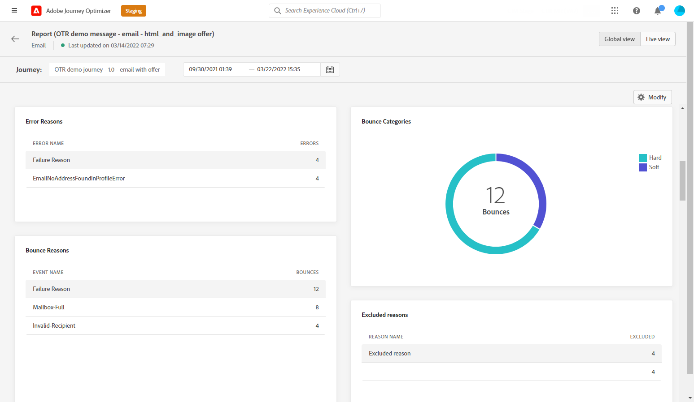

# E-mailglobaal rapport {#email-global-report}

De e-mail **[!UICONTROL Global report]** is alleen bedoeld voor een specifieke e-maillevering.

Van de **[!UICONTROL Executions]** tabblad van het dialoogvenster **[!UICONTROL Messages]** menu, selecteert u **[!UICONTROL Global view]** Selecteer vervolgens in het geavanceerde menu van de geselecteerde levering **[!UICONTROL Global report]**.

De e-mail **[!UICONTROL Global report]** is verdeeld in verschillende widgets waarin het succes en de fouten van uw levering worden beschreven. Elke widget kan indien nodig worden vergroot of verkleind en verwijderd. Zie voor meer informatie hierover [sectie](global-report.md#modify-dashboard).

**[!UICONTROL Email performance]** detailleert de belangrijkste informatie met betrekking tot uw bericht met KPIs:

* **[!UICONTROL Sent]**: Het totale aantal verzendt voor de levering.

* **[!UICONTROL Delivery Rate]**: Percentage berichten verzonden.

* **[!UICONTROL Bounce Rate]**: Percentage van e-mails dat is teruggestuurd in vergelijking met verzonden e-mails.

* **[!UICONTROL Error Rate]**: Percentage fouten die optraden tijdens een levering waardoor deze niet kon worden verzonden, vergeleken met verzonden e-mailberichten.

* **[!UICONTROL Open Rate]**: Percentage geopende berichten.

* **[!UICONTROL Click Rate]**: Percentage van klikken in een levering.

* **[!UICONTROL Spam Complaint Rate]**: Percentage e-mails dat door ontvangers als spam werd gemarkeerd in vergelijking met de geleverde berichten. Voor meer informatie over klachten raadpleegt u de [Handleiding voor best practices voor levering](https://experienceleague.adobe.com/docs/deliverability-learn/deliverability-best-practice-guide/metrics-for-deliverability/complaints.html#metrics-for-deliverability){target=&quot;_blank&quot;}.

* **[!UICONTROL Unsubscribe Rate]**: Percentage van unieke afboekingen in verhouding tot het aantal geleverde berichten. Deze indicator baseert zich niet op het aantal kliks op de unsubscription verbinding maar is gebaseerd op het aantal unsubscriptions die door ontvangers in werking worden gesteld. Meer informatie over abonnementen vindt u in deze [page](../messages/consent.md).

De **[!UICONTROL Email - Tracking statistics]** bevat de beschikbare gegevens voor ontvankelijke activiteit voor uw levering:

* **[!UICONTROL Opens]**: Aantal keren dat de levering is geopend in een levering.

* **[!UICONTROL Unique Opens]**: Percentage geopende leveringen.

* **[!UICONTROL Open Rate]**: Het totale aantal geopende e-mails in verhouding tot het aantal geleverde e-mails.

* **[!UICONTROL Clicks]**: Aantal keer dat er op een inhoud in een e-mail is geklikt.

* **[!UICONTROL Unique Clicks]**:Aantal ontvangers die op een inhoud in een e-mail hebben geklikt.

* **[!UICONTROL Click through rate]**: Percentage gebruikers dat met de reis interactie heeft gehad.

De **[!UICONTROL Sending Statistics]** grafiek geeft het succes van uw levering aan:

* **[!UICONTROL Delivered]**: Het aantal berichten dat is verzonden in verhouding tot het totale aantal verzonden berichten.

* **[!UICONTROL Bounces]**: Totaal van fouten die tijdens levering en automatische terugkeerverwerking met betrekking tot het totale aantal verzonden berichten worden gecumuleerd.

* **[!UICONTROL Errors]**: Het totale aantal fouten dat is opgetreden tijdens een levering waardoor deze niet naar profielen kan worden verzonden.

De **[!UICONTROL Bounce Reasons]** en **[!UICONTROL Bounce categories]** widgets bevatten de beschikbare gegevens met betrekking tot berichten die worden teruggestuurd, zoals:

* **[!UICONTROL Hard bounce]**: Het totale aantal permanente fouten, zoals een onjuist e-mailadres. Dit omvat een foutbericht waarin expliciet wordt aangegeven dat het adres ongeldig is, zoals Onbekende gebruiker.

* **[!UICONTROL Soft bounce]**: Het totale aantal tijdelijke fouten, zoals een volledig postvak.

* **[!UICONTROL Ignored]**: Het totale aantal tijdelijke berichten, zoals buiten het kantoor, of een technische fout, bijvoorbeeld als het type afzender postmaster is.

Voor meer informatie over grenzen raadpleegt u de [Onderdrukkingslijst](../messages/suppression-list.md) pagina.

De **[!UICONTROL Error Reasons]** de grafiek en de lijst laten u zien welke fout tijdens uw levering voorkwam.

De **[!UICONTROL Email - Top recipient domain]** grafiek en lijstdetails welke domeinen het meest door ontvangers worden gebruikt om e-mail te openen.

De **[!UICONTROL Email - Top Url]** grafiek en lijstdetails die URLs van uw levering het meest bezocht zijn.

De **[!UICONTROL Open vs Click]** identificeert de interactie van uw ontvangers met de levering:

* **[!UICONTROL Unique Clicks]**:Aantal ontvangers die op een inhoud in een e-mail hebben geklikt.

* **[!UICONTROL Unique Opens]**: Aantal ontvangers dat de levering heeft geopend.

<!--

>[!NOTE]
>
>The Offers widgets and metrics are only available if a decision was inserted in an email. For more information on Decision Management, refer to this [page](../offers/get-started/starting-offer-decisioning.md).

The **[!UICONTROL Offers statistic]** and **[!UICONTROL Offers statistics]** over time widgets measure your offer's success and impact on your targeted audience. It detail the main information relative to your message with KPIs:

* **[!UICONTROL Offer sent]**: Total number of sends for the offer.

* **[!UICONTROL Offer impression]**: Number of times the offer was opened in a delivery.

* **[!UICONTROL Offer clicks]**: Number of times an offer was clicked on in a delivery.

The **[!UICONTROL Offers detailed statistic]** table contains the available data for recipient activity with your offer:

* **[!UICONTROL Placement name]**: Name of your placement used to display your offer. For more information on placement, refer to this [page](../offers/offer-library/creating-placements.md).

* **[!UICONTROL Offer name]**: Name of the offer added in the delivery. For more information on placement, refer to this [page](../offers/offer-library/creating-personalized-offers.md).

* **[!UICONTROL Offer sent]**: Total number of sends for the offer.

* **[!UICONTROL Offer impression rate]**: Percentage of opened offers compared to the number of sent offers.

* **[!UICONTROL Offer click rate]**: Percentage of users who interacted with the offer.
-->
>[!NOTE]
>
>De profielen met **[!UICONTROL Suppressed]** of **[!UICONTROL Not allowed]** status worden uitgesloten tijdens het verzenden van berichten. Daarom moet **Reisrapporten** geeft aan dat deze profielen door de reis zijn gegaan ([Segment lezen](../building-journeys/read-segment.md) en [Bericht](../building-journeys/journeys-message.md) de **E-mailrapporten** worden niet opgenomen in de **[!UICONTROL Sent]** Metrische gegevens worden uitgefilterd voordat e-mail wordt verzonden.
>
>Meer informatie over de [Onderdrukkingslijst](../messages/suppression-list.md) en [Lijst van gewenste personen](../messages/allow-list.md). Als u de reden voor alle uitsluitingsgevallen wilt achterhalen, kunt u de opdracht [Adobe Experience Platform Query Service](https://experienceleague.adobe.com/docs/experience-platform/query/api/getting-started.html){target=&quot;_blank&quot;}.
