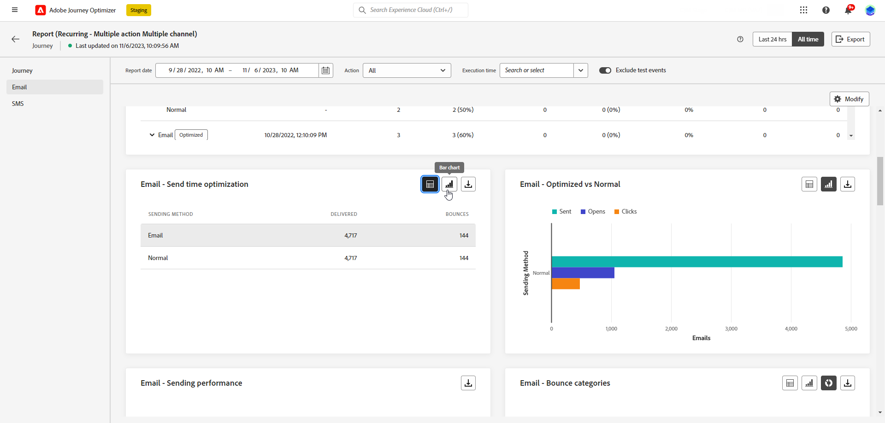
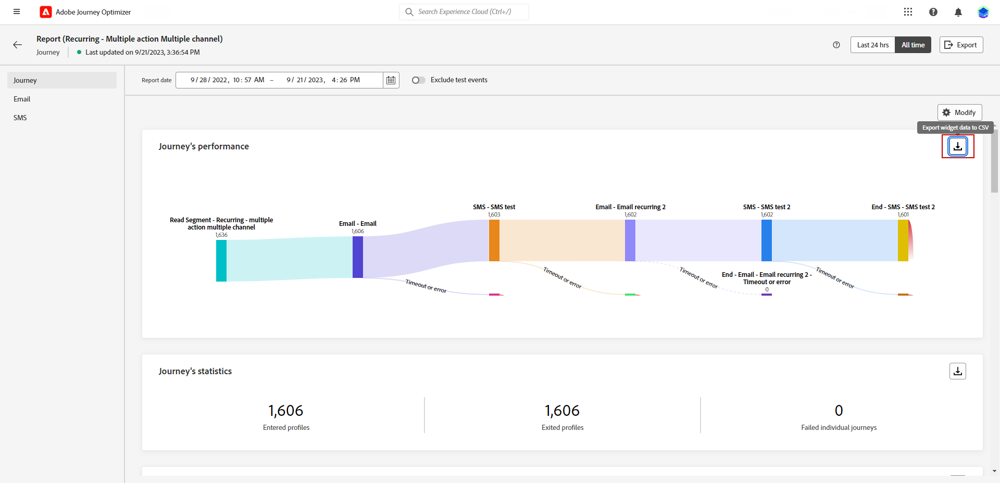

# Aan de slag met Global Report {#global-report}

>[!NOTE]
>
> Als aangepaste query&#39;s via API&#39;s worden gemaakt wanneer u de Query-service gebruikt, verwacht u enige vertraging voor uw rapporten.

Gebruik de **[!UICONTROL Global report]** om de impact van uw reizen en leveringen over een bepaalde periode te meten.

* Als u een reis of leveringen in het kader van een reis wilt richten, vanaf **[!UICONTROL Journeys]** en klik op de knop **[!UICONTROL View report]** knop. Je kunt dan de wereldwijde rapporten Journey, Email, SMS en Push vinden.

  

* Als u een campagne wilt richten, van **[!UICONTROL Campaigns]** , opent u uw campagne en klikt u op **[!UICONTROL Reports]** knop.

  

* Als u van wilt schakelen **[!UICONTROL Live report]** aan de **[!UICONTROL Global report]** voor uw levering klikt u op **[!UICONTROL All time]** met de tabschakeloptie.

  

Voor een gedetailleerde lijst van elke metrisch beschikbaar in Adobe Journey Optimizer, verwijs naar [deze pagina](#list-of-components-global)

## Het dashboard aanpassen {#modify-dashboard}

Elk rapportdashboard kan worden gewijzigd door de tijdsperiode te wijzigen en widgets te vergroten of te verkleinen of te verwijderen. Het wijzigen van de widgets heeft alleen invloed op het dashboard van de huidige gebruiker. Andere gebruikers zien hun eigen dashboards of de dashboards die standaard zijn ingesteld.

1. Van uw Globale rapport, selecteer een tijd van het Begin en van het Eind om specifieke gegevens te richten.

   

1. Kies of u testgebeurtenissen wilt uitsluiten van uw rapporten met de schakelbalk. Raadpleeg voor meer informatie over testgebeurtenissen [deze pagina](../building-journeys/testing-the-journey.md).

   Let erop dat de **[!UICONTROL Exclude test events]** Deze optie is alleen beschikbaar voor Journey-rapporten.

   

1. Klikken **[!UICONTROL Modify]** om het dashboard aan te passen.

   

1. Pas de widgetgrootte aan door de rechterbenedenhoek te slepen.

   

1. Klikken **[!UICONTROL Remove]** om een widget te verwijderen die u niet nodig hebt.

   

1. Als u tevreden bent met de weergavevolgorde en de grootte van de widgets, klikt u op **[!UICONTROL Save]**.

1. Als u de manier wilt aanpassen waarop uw gegevens worden weergegeven, kunt u schakelen tussen verschillende visualisatieopties, zoals grafieken, tabellen en donutgrafieken.

   

Uw dashboard wordt nu opgeslagen. Uw verschillende wijzigingen worden opnieuw toegepast voor een later gebruik van uw live rapporten. Gebruik indien nodig de **[!UICONTROL Reset]** gebruiken om de standaardvolgorde van widgets en widgets te herstellen.

## Uw rapporten exporteren {#export-reports}

U kunt uw verschillende rapporten eenvoudig exporteren naar de indelingen PDF of CSV, zodat u deze kunt delen of afdrukken. De stappen voor het exporteren van rapporten worden in de onderstaande tabbladen beschreven.

➡️ [Ontdek deze functie in video](#video-csv)

>[!BEGINTABS]

>[!TAB Uw rapport exporteren als een CSV-bestand]

1. Klik in uw rapport op **[!UICONTROL Export]** en selecteert u **[!UICONTROL CSV file]** om een CSV-bestand op algemeen rapportniveau te genereren.

   

1. U kunt er ook voor kiezen om gegevens uit een specifieke widget te exporteren. Klikken **[!UICONTROL Export widget data to CSV]** naast de geselecteerde widget.

   

1. Het bestand wordt automatisch gedownload en kan zich in uw lokale bestanden bevinden.

   Als u het bestand op rapportniveau hebt gegenereerd, bevat het gedetailleerde informatie voor elke widget, inclusief de titel en gegevens.

   Als u het bestand op widgetniveau hebt gegenereerd, bevat dit specifiek gegevens voor de geselecteerde widget.

>[!TAB Uw rapport exporteren als een PDF-bestand]

1. Klik in uw rapport op **[!UICONTROL Export]** en selecteert u **[!UICONTROL PDF file]**.

   

1. Configureer het document in het venster Afdrukken naar wens. Welke opties beschikbaar zijn, is afhankelijk van de browser.

1. Kies of u het rapport wilt afdrukken of opslaan als PDF.

1. Zoek de map waarin u het bestand wilt opslaan, geef het bestand een andere naam als dat nodig is en klik op Opslaan.

Uw rapport is nu beschikbaar voor weergave of delen in een PDF-bestand.

>[!ENDTABS]

### Rapporten exporteren (video) {#video-csv}

Leer hoe u een CSV-rapport voor een rapport en voor één widget downloadt in de volgende Hoe kan ik-video.

>[!VIDEO](https://video.tv.adobe.com/v/3424603?quality=12)

