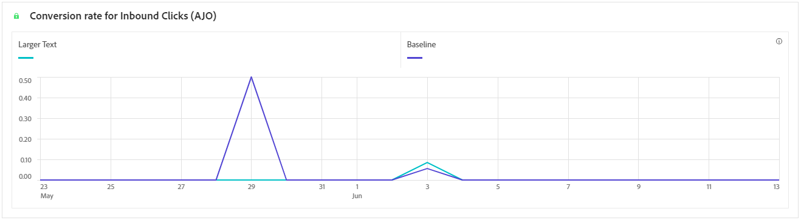

# Evaluatietraject {#campaign-global-report-cja-experimentation}

Uw rapport van de Reizen geeft u een volledig overzicht van hoe uw experiment, samen met de belangrijkste metriek uitvoert u zijn effect moet begrijpen.

In Journey Optimizer is het experimenteren met reizen opgesplitst in twee soorten:

* [Inhoud experimenteren](../content-management/content-experiment.md)

  Merk op dat de lijsten en KPIs die voor uw Inhoudsexperiment worden gedetailleerd het zelfde zijn als die voor een experiment van de Weg. Verwijs naar de [&#x200B; documentatie hieronder &#x200B;](#experimentation) als u opstelling een experiment van de Inhoud hebt.

* [Padexperimenten](../building-journeys/optimize.md)

## Padexperiment {#experimentation}

### ExperimentatiekPI&#39;s {#experimentation-kpis}

De **samenvatting van de Experimentatie** verstrekt zeer belangrijke inzichten in de prestaties van uw experiment, en identificeert meest succesvolle. Het kan enige tijd duren om de beste uitvoerder te definiëren. Als uw experiment niet succesvol is, zal het aan **Onovertuigend** worden geplaatst.

De **Belangrijke Indicatoren van Prestaties van de Experimentatie Zeer belangrijke (KPIs)** functie als volledig-omvattend dashboard, leverend een analyse van essentiële metriek verbonden aan uw experimentatie.

+++ Meer informatie over KPI&#39;s-meetgegevens voor experimenten

* **[!UICONTROL Lift]**: maat voor de procentuele verbetering van de conversiesnelheid van een bepaalde behandeling ten opzichte van de basislijn.

* **[!UICONTROL Confidence]**: Bewijs dat een bepaalde behandeling gelijk is aan de basisbehandeling. [Meer informatie](../content-management/experiment-calculations.md#adobes-statistical-methodology-any-time-valid-confidence-sequences)

+++

### Meting van variant naar succes {#variant-inbound}

De **Variant door succesmetriek** lijst toont hoe elke variant gebaseerd op succes metrisch wanneer vestiging het experiment uitvoert.
Voor diepte-duik in deze resultaten en hoe te om hen te interpreteren, verwijs naar [&#x200B; deze pagina &#x200B;](../content-management/get-started-experiment.md#interpret-results).

+++ Meer informatie over Variant op metrische waarde

* **[!UICONTROL People]**: Aantal gebruikersprofielen dat als doelprofielen voor uw berichten in aanmerking komt.

* **[!UICONTROL Inbound Clicks]**: de totale waarde van de metrische waarde voor succes die eerder is geselecteerd bij het maken van uw experimenten.

* **[!UICONTROL Conversion rate]**: de totale waarde van de metrische waarde voor succes die eerder is geselecteerd bij het maken van uw experimenten, gedeeld door het aantal profielen.

* **[!UICONTROL Lift]**: maat voor de procentuele verbetering van de conversiesnelheid van een bepaalde behandeling ten opzichte van de basislijn.

* **[!UICONTROL Confidence Lower bound]**: laagste geschatte waarde van het verschil in conversiesnelheid tussen de behandeling en de basislijn, binnen het gekozen betrouwbaarheidsinterval.

* **[!UICONTROL Confidence]**: Bewijs dat een bepaalde behandeling gelijk is aan de basisbehandeling. [Meer informatie](../content-management/experiment-calculations.md#adobes-statistical-methodology-any-time-valid-confidence-sequences)

* **[!UICONTROL Confidence Upper bound]**: Hoogste geschatte waarde van het verschil in conversiesnelheid tussen de behandeling en de basislijn, binnen het gekozen betrouwbaarheidsinterval.

+++

### Conversiesnelheid voor metrisch resultaat {#conversion-rate}

De grafiek van **[!UICONTROL Confidence interval]** toont de waaier van mogelijke verbetering, die de basislijn met de best-presterende behandeling voor gekozen succesmetrisch vergelijkt. [Meer informatie](../content-management/experiment-calculations.md#adobes-statistical-methodology-any-time-valid-confidence-sequences).
