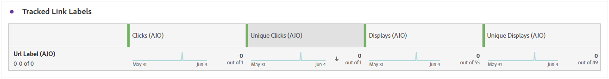

# Webreisrapport {#journey-global-report}

>[!INFO]
>
>Uw reisrapport kan informatie over meerdere reizen tegelijk weergeven, aangezien gebruikers bij meer dan één reis tegelijk betrokken kunnen zijn. Dientengevolge, kunnen de binnenkomende mededelingen (in-app, Web en op code-Gebaseerd) in veelvoudige reizen verschijnen als zij voor een gebruiker die aan gelijktijdige actieve reizen deelneemt werden teweeggebracht, wat in overlappende gegevens kan resulteren.

>[!BEGINSHADEBOX]

U kunt tot uw de reisrapport van het Web toegang hebben door de **[!UICONTROL View report]** knoop binnen uw reis te klikken. [Meer informatie](report-gs-cja.md)

>[!ENDSHADEBOX]

## Impressie en klik op trend {#impressions-web}

In de grafiek van **[!UICONTROL Impression & Click trend]** wordt een gedetailleerde analyse gegeven van de betrokkenheid van uw profielen bij uw webpagina&#39;s. Deze grafiek biedt waardevolle inzichten in de interactie tussen profielen en uw inhoud.

+++ Meer informatie over depressie en klik op cijfers over trends

* **[!UICONTROL Clicks]**: Het aantal keren dat op de webpagina&#39;s op de inhoud is geklikt.

* **[!UICONTROL Displays]**: Het aantal keren dat het bericht is geopend.

+++

## Klikken {#clicks-web}

De grafiek van **[!UICONTROL Clicks]** toont Web-pagina klikmetriek, die zowel het totale aantal inhoud klikt als het aantal unieke profielen toont die op de inhoud klikte.

+++ Meer informatie over maatstaven klikken

* **[!UICONTROL Unique Clicks]**: Aantal profielen dat op een inhoud in uw Web-pagina&#39;s klikte.

* **[!UICONTROL Clicks]**: Het aantal keren dat op de webpagina&#39;s op de inhoud is geklikt.

+++

## Weergaven {#displays-web}

De grafiek van **[!UICONTROL Displays]** helpt u zowel het algemene bereik van de op code-gebaseerde ervaring begrijpen werd geopend als het aantal unieke profielen die met het in dienst nemen.

+++ Meer informatie over weergavemeetgegevens

* **[!UICONTROL Displays]**: Het aantal keren dat de op code gebaseerde ervaring is geopend.

* **[!UICONTROL Unique displays]**: Het aantal keren dat de op code gebaseerde ervaring is geopend, wordt geen rekening gehouden met meerdere interacties van één profiel.

+++

## Gegevens bijhouden {#track-data-web}

De tabel van **[!UICONTROL Tracking data]** biedt een gedetailleerde momentopname van profielactiviteiten die aan uw Web-pagina&#39;s zijn gekoppeld, die essentiële inzichten in betrokkenheid en doeltreffendheid van Web-pagina&#39;s verstrekken.

+++ Meer informatie over het bijhouden van gegevens

* **[!UICONTROL People]**: Aantal gebruikersprofielen dat als doelprofielen voor uw Web-pagina&#39;s kwalificeert.

* **[!UICONTROL Click through rate (CTR)]**: percentage gebruikers dat interactie heeft gehad met de webpagina&#39;s.

* **[!UICONTROL Clicks]**: Het aantal keren dat op de webpagina&#39;s op de inhoud is geklikt.

* **[!UICONTROL Unique Clicks]**: Aantal profielen dat op een inhoud in uw Web-pagina&#39;s klikte.

* **[!UICONTROL Displays]**: Het aantal keren dat de webpagina is geopend.

* **[!UICONTROL Unique displays]**: Het aantal keren dat de webpagina is geopend, wordt geen rekening gehouden met meerdere interacties van één profiel.

+++

## Labels voor bijgehouden koppelingen {#track-link-web}

De tabel **[!UICONTROL Tracked link labels]** bevat een uitgebreid overzicht van de koppelingslabels in uw webpagina&#39;s, waarin de labels worden gemarkeerd die het hoogste bezoekersverkeer genereren. Met deze functie kunt u de populairste koppelingen identificeren en er prioriteiten aan stellen.

+++ Meer informatie over metriek van tracklabels

* **[!UICONTROL Unique Clicks]**: Aantal profielen dat op een inhoud in uw Web-pagina&#39;s klikte.

* **[!UICONTROL Clicks]**: Het aantal keren dat op de webpagina&#39;s op de inhoud is geklikt.

* **[!UICONTROL Displays]**: Het aantal keren dat het bericht is geopend.

* **[!UICONTROL Unique displays]**: Het aantal keren dat het bericht is geopend, wordt er geen rekening gehouden met meerdere interacties van één profiel.

+++

## URL&#39;s van bijgehouden koppeling {#track-url-web}

De tabel **[!UICONTROL Tracked link URLs]** bevat een uitgebreid overzicht van de URL&#39;s in uw webpagina&#39;s die het hoogste bezoekersverkeer aantrekken. Hierdoor kunt u de populairste koppelingen identificeren en er prioriteiten aan stellen, zodat u meer inzicht krijgt in de betrokkenheid bij profielen met specifieke inhoud in uw webpagina&#39;s.

+++ Meer informatie over URL&#39;s met gekoppelde koppelingen

* **[!UICONTROL Unique Clicks]**: Aantal profielen dat op een inhoud in uw Web-pagina&#39;s klikte.

* **[!UICONTROL Clicks]**: Het aantal keren dat op de webpagina&#39;s op de inhoud is geklikt.

* **[!UICONTROL Displays]**: Het aantal keren dat het bericht is geopend.

* **[!UICONTROL Unique displays]**: Het aantal keren dat het bericht is geopend, wordt er geen rekening gehouden met meerdere interacties van één profiel.

+++
