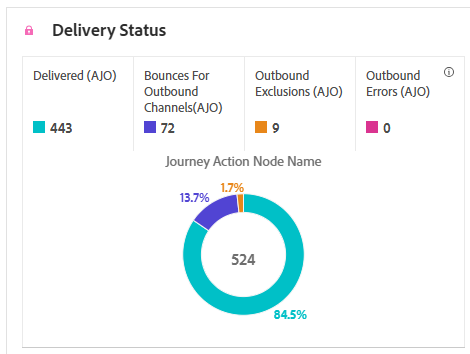

# Reisrapport {#journey-global-report}

De **Reisrapport** functioneert als een allesomvattend dashboard, dat een analyse van essentiële metriek levert verbonden aan uw reis. Dit omvat details zoals het aantal ingegane profielen en gevallen van mislukte individuele reizen, die een uitvoerig inzicht in de doeltreffendheid van uw reis en niveau van betrokkenheid aanbieden.

**Reisrapport** kunt u rechtstreeks vanaf uw reis openen met de **[!UICONTROL View report]** knop.

De **[!UICONTROL Journey report]** De pagina wordt weergegeven met de volgende tabbladen, afhankelijk van de berichtactiviteiten tijdens uw reis:

* [Reis](#journey-global)
* [Email](#email-global)
* [Push](#push-global)
* [Sms](#sms-global)
* [In-app](#in-app-global)
* [Web](#web-cja)
* [Direct mail](#direct-mail-cja)

Voor meer informatie over de werkruimte van de Customer Journey Analytics en over het filteren en analyseren van gegevens raadpleegt u [deze pagina](https://experienceleague.adobe.com/en/docs/analytics-platform/using/cja-workspace/home).

## Reisoverzicht {#journey-global}

De **[!UICONTROL Journey]** het rapport geeft u een duidelijk beeld van de belangrijkste het volgen gegevens over uw reis.

### PKI&#39;s voor reizen {#journey-perfomance}

De **[!UICONTROL Journey]** De zeer belangrijke Indicatoren van Prestaties (KPIs) functioneren als allesomvattend dashboard, dat een analyse van essentiële metriek in verband met uw reis levert. Dit omvat details zoals het aantal binnengekomen profielen en gevallen van mislukte individuele reizen, die een uitvoerig inzicht in de doeltreffendheid van uw reis en niveau van betrokkenheid aanbieden.

+++ Meer informatie over de maatstaven van PKI&#39;s voor reizen

* **[!UICONTROL Journey engagement]**: Totaal aantal personen dat interactie had met de berichten die van de reis werden verzonden

* **[!UICONTROL Journey enters]**: Totaal aantal personen dat de inreisgebeurtenis van de reis heeft bereikt.

* **[!UICONTROL Journey exits]**: Totaal aantal personen dat de reis heeft verlaten.

* **[!UICONTROL Journey failures]**: Totaal aantal individuele reizen die niet succesvol zijn uitgevoerd.

+++

### Reisstatistieken {#journey-stats}

De **[!UICONTROL Journey Statistics]** de tabel bevat een gedetailleerde samenvatting van de belangrijkste gegevens over uw reizen . Het omvat belangrijke metriek zoals het aantal mislukkingen en succesvolle ingangen, die waardevolle inzichten in de prestaties en het bereik van uw e-mail en reizen verstrekken.

+++ Meer informatie over statistieken voor reisstatistieken

* **[!UICONTROL Journey engagement]**: Het totale aantal personen dat interactie had met de berichten die van de reis werden verzonden.

* **[!UICONTROL Journey enters]**: Totaal aantal personen dat de inreisgebeurtenis van de reis heeft bereikt.

* **[!UICONTROL Journey exits]**: Totaal aantal personen dat de reis heeft verlaten.

* **[!UICONTROL Journey failures]**: Totaal aantal individuele reizen die niet succesvol zijn uitgevoerd.

* **[!UICONTROL Unique Journey enters]**: Het totale aantal personen dat de inreisgebeurtenis van de reis heeft bereikt, de meervoudige interacties van één profiel worden niet in aanmerking genomen.

* **[!UICONTROL Unique Journey exits]**: Het totale aantal personen dat de reis heeft verlaten, de meervoudige interacties van één profiel worden niet in aanmerking genomen.

* **[!UICONTROL Unique Journey failures]**: Het totale aantal individuele reizen dat niet succesvol werd uitgevoerd, er wordt geen rekening gehouden met meerdere interacties van één profiel.

+++

## Reiscanvas {#journey-canvas}

De **[!UICONTROL Journey Canvas]** met widget kunt u visueel het traject van uw doelprofielen volgen terwijl u door de reis navigeert.

Verbeter uw canvasaanpassing met de volgende opties:

* Voeg het gewenste type activiteit, zoals berichten of voorwaarden, toe of verwijder uit **[!UICONTROL Node type]** vervolgkeuzelijst.
* Pas de **[!UICONTROL Percentage value]** om de stroomverdeling over verschillende reiswegen te bepalen.
* Pas uw **[!UICONTROL Arrow settings]** om labels en voorwaarden op te nemen, of te kiezen voor een schoon beeldscherm.
* De optie **[!UICONTROL Show fallout]** gebruiken om profielen te visualiseren die uw reis rechtstreeks op het canvas hebben verlaten.

## Prestaties van handelingen {#action-performance}

### Prestaties in de loop der tijd {#action-overtime}

De **[!UICONTROL Performance Over time]** in grafiek kunt u het aantal profielen identificeren en analyseren dat voldoet aan de criteria om als doelprofielen voor uw acties te worden beschouwd. Deze visualisatie biedt waardevolle inzichten in de effectiviteit van uw strategieën en helpt u gegevensgestuurde beslissingen te nemen om uw prestaties te optimaliseren.

### Overzicht van handelingen {#action-overview}

De **[!UICONTROL Action overview]** table fungeert als een uitgebreid dashboard dat een analyse biedt van de belangrijkste meetgegevens die betrekking hebben op de acties op uw reis. Dit omvat cruciale details zoals het aantal interacties en de doorklikfrequentie

+++ Meer informatie over overzichtsmetriek voor handelingen

* **[!UICONTROL People]**: Aantal gebruikersprofielen dat als doelprofielen voor uw acties wordt gekwalificeerd.

* **[!UICONTROL Click trough rate]**: Percentage gebruikers dat interactie heeft gehad met de handeling.

* **[!UICONTROL Clicks]**: Het aantal keren dat er op de inhoud is geklikt in de handelingen.

* **[!UICONTROL Delivered]**: Aantal verzonden acties in verhouding tot het totale aantal verzonden acties.

+++

## Prestaties van gebeurtenissen {#events-performance}

### Prestaties in de loop der tijd {#event-overtime}

De **[!UICONTROL Performance over time]** in grafiek kunt u het aantal profielen identificeren en analyseren dat als doelprofielen voor uw gebeurtenissen wordt gekwalificeerd. Dit krachtige hulpmiddel helpt u tendensen en patronen in tijd volgen, die waardevolle inzichten verstrekken om uw gebeurtenisstrategieën te optimaliseren.

### Overzicht van gebeurtenissen {#event-overview}

De **[!UICONTROL Event overview]** in de tabel wordt aangegeven hoeveel profielen in de loop der tijd voldoen aan de criteria voor gebeurtenissen. Met dit gereedschap kunt u patronen in kwalificatiesnelheden identificeren om uw gebeurtenisstrategie te verfijnen.

+++ Meer informatie over statistieken voor reisstatistieken

* **[!UICONTROL People]**: Aantal gebruikersprofielen dat als doelprofielen voor uw gebeurtenissen wordt gekwalificeerd.

+++

## E-mailgegevens {#email-global}

Uit uw reisrapport **[!UICONTROL Email]** bevat de belangrijkste gegevens met betrekking tot de e-mails die tijdens uw reis worden verzonden.

### Geleverde versus klik trend {#delivered-click}

De **[!UICONTROL Delivered vs Click trend]** Grafiek geeft een gedetailleerde analyse van de betrokkenheid van uw profielen bij uw e-mails en biedt waardevolle inzichten in de interactie tussen verschillende domeinen en uw inhoud.

+++ Meer informatie over cijfers over trends bij levering en klik op trends

* **[!UICONTROL Delivered]**: Aantal verzonden e-mails in verhouding tot het totale aantal verzonden e-mails.

* **[!UICONTROL Clicks]**: Het aantal keren dat er op de inhoud in uw e-mails is geklikt.

+++

### Leveringsstatus {#delivery-status}

De **[!UICONTROL Delivery status]** in een grafiek kun je zien hoe je e-mails in één oogopslag functioneren. Houd belangrijke metriek bij, zoals leveringen en golven, zodat u snel inzicht hebt in de efficiëntie van uw e-mailreis.

+++ Meer informatie over de afleveringsstatus

* **[!UICONTROL Delivered]**: Aantal verzonden e-mails in verhouding tot het totale aantal verzonden e-mails.

* **[!UICONTROL Bounces for outbound channels]**: Totaal aan fouten gecumuleerd tijdens het verzendingsproces en automatische retourverwerking in verhouding tot het totale aantal verzonden berichten.

* **[!UICONTROL Outbound errors]**: Het totale aantal fouten dat is opgetreden tijdens een verzendingsproces dat verhindert dat het naar profielen wordt verzonden.

* **[!UICONTROL Excluded]**: Aantal profielen dat door Adobe Journey Optimizer is uitgesloten.

+++

### Verzendstatistieken {#email-sending-statistics}

De **[!UICONTROL Sending Statistics]** de tabel geeft een duidelijk overzicht van de manier waarop uw e-mails tijdens uw reis worden uitgevoerd. Het volgt belangrijke metriek zoals leveringstarieven en interactie, die u waardevolle inzichten geven om uw e-mailstrategie voor betere bereik en betrokkenheid te optimaliseren.

+++ Meer informatie over het verzenden van statistieken

* **[!UICONTROL People]**: Aantal gebruikersprofielen dat als doelprofielen voor uw berichten in aanmerking komt.

* **[!UICONTROL Targeted]**: Het totale aantal e-mailberichten dat tijdens het verzendproces is verwerkt.

* **[!UICONTROL Sends]**: Totaal aantal verzendingen voor uw e-mail.

* **[!UICONTROL Delivered]**: Aantal verzonden e-mailberichten in verhouding tot het totale aantal verzonden berichten.

* **[!UICONTROL Bounces]**: Totaal aan fouten gecumuleerd tijdens het verzendingsproces en automatische retourverwerking in verhouding tot het totale aantal verzonden berichten.

* **[!UICONTROL Outbound Errors]**: Het totale aantal fouten dat is opgetreden tijdens het verzendproces waardoor het niet naar profielen kan worden verzonden.

* **[!UICONTROL Outbound Exclusions]**: Aantal profielen dat door Adobe Journey Optimizer is uitgesloten.

+++

### E-mail - Trackingstatistieken {#email-tracking}

De **[!UICONTROL Email - Tracking statistics]** de tabel bevat een gedetailleerd overzicht van de profielactiviteiten met betrekking tot e-mails die in uw reis zijn opgenomen. Dit omvat cijfers over het openen, klikken en andere relevante betrokkenheidsindicatoren, die een uitgebreid overzicht bieden van hoe profielen met uw e-mailinhoud communiceren.

+++ Meer informatie over statistieken bijhouden

* **[!UICONTROL Click through rate (CTR)]**: Percentage gebruikers dat interactie heeft gehad met de e-mail.

* **[!UICONTROL Click-through open rate (CTOR)]**: Aantal keer dat de e-mail is geopend.

* **[!UICONTROL Clicks]**: Het aantal keren dat er op de inhoud in uw e-mails is geklikt.

* **[!UICONTROL Unique Clicks]**: Aantal profielen dat op de inhoud van een e-mail heeft geklikt.

* **[!UICONTROL Email Opens]**: Het aantal keren dat je e-mails zijn geopend tijdens een reis.

* **[!UICONTROL Unique Email Opens]**: Percentage geopende e-mails.

* **[!UICONTROL Spam complaints]**: Het aantal keren dat een bericht is gedeclareerd als spam of junk.

* **[!UICONTROL Unsubscribes]**: Het aantal klikken op de koppeling voor het opzeggen van abonnementen.

+++

### E-maildomeinen {#email-domains}

De **[!UICONTROL Email Domains]** de tabel bevat een diepgaande uitsplitsing van e-mails die zijn gecategoriseerd per domein. Hiermee krijgt u uitgebreide inzicht in de prestaties van uw e-mailreizen. Met deze uitgebreide analyse kunt u het gedrag van verschillende domeinen begrijpen als reactie op uw e-mailinhoud.

+++ Meer informatie over metriek van e-maildomeinen

* **[!UICONTROL Sends]**: Totaal aantal verzendingen voor uw e-mail.

* **[!UICONTROL Delivered]**: Aantal verzonden e-mails in verhouding tot het totale aantal verzonden e-mails.

* **[!UICONTROL Email Opens]**: Het aantal keren dat je e-mails zijn geopend tijdens een reis.

* **[!UICONTROL Clicks]**: Het aantal keren dat er op de inhoud in uw e-mails is geklikt.

* **[!UICONTROL Bounces for outbound channels]**: Het totale aantal fouten dat tijdens het verzendproces is gecumuleerd en de automatische retourverwerking in verhouding tot het totale aantal verzonden e-mails.

* **[!UICONTROL Outbound Errors]**: Het totale aantal fouten dat is opgetreden tijdens het verzendproces waardoor het niet naar profielen kan worden verzonden.
+++

### Labels voor bijgehouden koppelingen {#track-link-label}

De **[!UICONTROL Tracked link labels]** de tabel bevat een uitgebreid overzicht van de koppelingslabels in uw e-mails waarin de labels worden gemarkeerd die het hoogste bezoekersverkeer genereren. Met deze functie kunt u de populairste koppelingen identificeren en er prioriteiten aan stellen.

+++ Meer informatie over metriek van tracklabels

* **[!UICONTROL Unique Clicks]**: Aantal profielen dat op de inhoud van een e-mail heeft geklikt.

* **[!UICONTROL Clicks]**: Het aantal keren dat er op de inhoud in uw e-mails is geklikt.

+++

### URL&#39;s van bijgehouden koppeling {#track-link-url}

De **[!UICONTROL Tracked link URLs]** een tabel met een uitgebreid overzicht van de URL&#39;s in uw e-mail die het hoogste bezoekersverkeer aantrekken. Hierdoor kunt u de populairste koppelingen identificeren en er prioriteiten aan stellen, zodat u meer inzicht krijgt in de betrokkenheid bij profielen met specifieke inhoud in uw e-mails.

+++ Meer informatie over URL&#39;s met gekoppelde koppelingen

* **[!UICONTROL Unique Clicks]**: Aantal profielen dat op de inhoud van een e-mail heeft geklikt.

* **[!UICONTROL Clicks]**: Het aantal keren dat er op de inhoud in uw e-mails is geklikt.

* **[!UICONTROL Displays]**: Het aantal keren dat het bericht is geopend.

* **[!UICONTROL Unique displays]**: Het aantal keren dat het bericht is geopend, wordt geen rekening gehouden met meerdere interacties van één profiel.

+++

### E-mailonderwerpen {#email-subject}

De **[!UICONTROL Email subjects]**  de tabel bevat een uitgebreid overzicht van de e - mailonderwerpen die het grootste bezoekersverkeer hebben aangetrokken . Deze bron biedt waardevolle inzichten in de dynamiek van de betrokkenheid van het publiek.

+++ Meer informatie over metrische gegevens over e-mailonderwerpen

* **[!UICONTROL People]**: Aantal gebruikersprofielen dat in aanmerking komt als doelprofielen voor uw e-mailberichten.

+++

### Stuitingsredenen {#email-bounce-reasons}

De **[!UICONTROL Bounce Reasons]** de tabel bevat een overzicht van de beschikbare gegevens over teruggestuurde berichten , met gedetailleerde inzichten van de specifieke redenen voor e - mailberichten .

Voor meer informatie over grenzen raadpleegt u de [Onderdrukkingslijst](../reports/suppression-list.md) pagina.

### Uitgesloten redenen {#email-excluded}

De **[!UICONTROL Excluded reasons]** in de tabel wordt een uitgebreid overzicht gegeven van de verschillende factoren die ertoe hebben geleid dat gebruikersprofielen van het doelpubliek zijn uitgesloten , waardoor het bericht niet is ontvangen .

Zie [deze pagina](exclusion-list.md) voor de volledige lijst van uitsluitingsredenen.

### Foutredenen {#email-errors}

De **[!UICONTROL Error Reasons]** de lijst biedt zicht in de specifieke fouten die tijdens het verzendende proces voorkwamen, die waardevolle informatie over de aard en het voorkomen van fouten verstrekken.

## Tabblad Pushmelding {#push-global}

Uit uw reisrapport **[!UICONTROL Push notification]** bevat de belangrijkste informatie met betrekking tot de pushmeldingen die tijdens uw reis worden verzonden.

## Pushmelding {#push-notification}

### Verzendstatistieken {#sending-statistics-push}

De **[!UICONTROL Sending Statistics]** met de tabel kunt u begrijpen hoe uw pushmeldingen werken. Het omvat belangrijke metriek zoals leverings tarief en publieksgrootte, die u waardevolle inzichten in de doeltreffendheid en het bereik van uw reizen geven.

+++ Meer informatie over het verzenden van statistieken

* **[!UICONTROL People]**: Aantal gebruikersprofielen dat in aanmerking komt als doelprofielen voor uw SMS-berichten.

* **[!UICONTROL Targeted]**: Het totale aantal pushmeldingen dat tijdens de analyse is verwerkt.

* **[!UICONTROL Sends]**: Totaal aantal verzendingen voor de pushmelding.

* **[!UICONTROL Delivered]**: Het aantal pushmeldingen dat is verzonden in verhouding tot het totale aantal verzonden pushmeldingen.

* **[!UICONTROL Bounces for outbound channels]**: Totaal aantal fouten gecumuleerd tijdens het verzendproces en automatische retourverwerking in verhouding tot het totale aantal pushmeldingen.

* **[!UICONTROL Outbound errors]**: Het totale aantal fouten dat is opgetreden waardoor deze niet naar profielen kon worden verzonden.

* **[!UICONTROL Outbound exclusions]**: Aantal profielen dat door Adobe Journey Optimizer is uitgesloten.

+++

### Trackingstatistieken {#tracking-statistics-push}

De **[!UICONTROL Tracking statistics]** de tabel biedt een gedetailleerde momentopname van de profielactiviteiten die aan uw pushmeldingen zijn gekoppeld, en biedt essentiële inzichten in de doeltreffendheid van betrokkenheid en pushmeldingen.

+++ Meer informatie over statistieken bijhouden

* **[!UICONTROL Click through rate (CTR)]**: Percentage gebruikers dat interactie heeft gehad met de pushmelding.

* **[!UICONTROL Clickthrough open rate (CTOR)]**: Het aantal keren dat de pushmelding is geopend.

* **[!UICONTROL Clicks]**: Het aantal keren dat er op de inhoud is geklikt in uw pushmelding.

* **[!UICONTROL Unique Clicks]**: Aantal profielen dat op een inhoud in uw pushmelding heeft geklikt.

<!--
* **[!UICONTROL Push custom actions]**: 
-->
+++

### Labels voor bijgehouden koppelingen {#track-link-label-push}

De **[!UICONTROL Tracked link labels]** tabel bevat een uitgebreid overzicht van de koppelingslabels in uw pushberichten, waarin de labels worden gemarkeerd die het hoogste bezoekersverkeer genereren. Met deze functie kunt u de populairste koppelingen identificeren en er prioriteiten aan stellen.

+++ Meer informatie over metriek van tracklabels

* **[!UICONTROL Unique Clicks]**: Aantal profielen dat op de inhoud van uw pushberichten heeft geklikt.

* **[!UICONTROL Clicks]**: Het aantal keren dat er op de inhoud is geklikt in uw pushberichten.

+++

### URL&#39;s van bijgehouden koppeling {#track-link-url-push}

De **[!UICONTROL Tracked link URLs]** een tabel met een uitgebreid overzicht van de URL&#39;s in uw pushberichten die het hoogste bezoekersverkeer aantrekken. Hierdoor kunt u de populairste koppelingen identificeren en er prioriteiten aan stellen, zodat u meer inzicht krijgt in de betrokkenheid bij profielen met specifieke inhoud in uw pushberichten.

+++ Meer informatie over URL&#39;s met gekoppelde koppelingen

* **[!UICONTROL Unique Clicks]**: Aantal profielen dat op de inhoud van uw pushberichten heeft geklikt.

* **[!UICONTROL Clicks]**: Het aantal keren dat er op de inhoud is geklikt in uw pushberichten.

+++

### Stuitingsredenen {#bounce-reasons-push}

De **[!UICONTROL Bounces Reasons]** de tabel biedt een uitgebreid overzicht van gegevens over teruggestuurde pushmeldingen , waarmee u waardevolle inzichten kunt verkrijgen over de specifieke redenen voor de verschuivingen van pushmeldingen .

### Foutredenen {#error-reasons-push}

De **[!UICONTROL Error Reasons]** in de tabel kunt u de specifieke fouten identificeren die zijn opgetreden tijdens het verzendproces van uw pushberichten. Zo kunt u een grondige analyse van alle ondervonden problemen mogelijk maken.

### Uitgesloten redenen {#exclude-reasons-push}

De **[!UICONTROL Exclude Reasons]** in de tabel worden visueel de verschillende factoren weergegeven die hebben geleid tot de uitsluiting van gebruikersprofielen van het doelpubliek en voorkomen dat gebruikers uw pushberichten kunnen ontvangen .

Zie [deze pagina](exclusion-list.md) voor de volledige lijst van uitsluitingsredenen.

## Sms {#sms}

### Geleverde versus klik trend {#delivered-click-sms}

De **[!UICONTROL Delivered vs Click trend]** een gedetailleerde analyse van de betrokkenheid van uw profielen bij uw SMS-berichten. Deze grafiek biedt waardevolle inzichten in de interactie tussen verschillende domeinen en uw inhoud.

+++ Meer informatie over cijfers over trends bij levering en klik op trends

* **[!UICONTROL Delivered]**: Aantal SMS-berichten dat is verzonden in verhouding tot het totale aantal SMS-berichten.

* **[!UICONTROL Clicks]**: Het aantal keer dat er op een inhoud is geklikt in uw SMS-berichten.

+++

### Leveringsstatus {#delivery-status-sms}

De **[!UICONTROL Delivery status]** tabel bevat een gedetailleerd overzicht van de profielactiviteiten met betrekking tot uw SMS-berichten. Dit omvat metriek over geleverde, kliks, en andere relevante betrokkenheidsindicatoren, die een uitvoerig overzicht van aanbieden hoe de profielen met uw inhoud van SMS interactie aangaan.

+++ Meer informatie over de afleveringsstatus

* **[!UICONTROL Delivered]**: Aantal SMS-berichten dat is verzonden in verhouding tot het totale aantal SMS-berichten.

* **[!UICONTROL Bounces for outbound channels]**: Totaal aantal fouten gecumuleerd tijdens het verzendingsproces en automatische retourverwerking in verhouding tot het totale aantal verzonden SMS-berichten.

* **[!UICONTROL Outbound errors]**: Het totale aantal fouten dat is opgetreden waardoor deze niet naar profielen kon worden verzonden.

* **[!UICONTROL Outbound exclusions]**: Aantal profielen dat door Adobe Journey Optimizer is uitgesloten.

+++

### Labels voor bijgehouden koppelingen {#track-link-label-sms}

De **[!UICONTROL Tracked link labels]** de lijst biedt een uitvoerig overzicht van de verbindingsetiketten binnen uw berichten van SMS, die die benadrukken die het hoogste bezoekersverkeer produceren. Met deze functie kunt u de populairste koppelingen identificeren en er prioriteiten aan stellen.

+++ Meer informatie over metriek van tracklabels

* **[!UICONTROL Unique Clicks]**: Aantal profielen dat op een inhoud in uw SMS-bericht heeft geklikt.

* **[!UICONTROL Clicks]**: Het aantal keer dat er op een inhoud is geklikt in uw SMS-berichten.

+++

### URL&#39;s van bijgehouden koppeling {#track-link-url-sms}

De **[!UICONTROL Tracked link URLs]** de lijst verstrekt een uitvoerig overzicht van URLs binnen uw berichten van SMS die het hoogste bezoekersverkeer aantrekken. Hierdoor kunt u de populairste koppelingen identificeren en er prioriteiten aan stellen, zodat u meer inzicht krijgt in de betrokkenheid bij profielen met specifieke inhoud in uw SMS-berichten.

+++ Meer informatie over URL&#39;s met gekoppelde koppelingen

* **[!UICONTROL Unique Clicks]**: Aantal profielen dat op een inhoud in uw SMS-bericht heeft geklikt.

* **[!UICONTROL Clicks]**: Het aantal keer dat er op een inhoud is geklikt in uw SMS-berichten.

* **[!UICONTROL Displays]**: Het aantal keren dat het bericht is geopend.

* **[!UICONTROL Unique displays]**: Het aantal keren dat het bericht is geopend, wordt geen rekening gehouden met meerdere interacties van één profiel.

+++

### Binnenkomend SMS-bericht {#sms-inbound}

De **[!UICONTROL SMS inbound message]** de tabel biedt een grondig overzicht van de SMS-berichten die het hoogste bezoekersverkeer hebben aangetrokken. Deze bron biedt waardevolle inzichten in de dynamiek van de betrokkenheid van het publiek.

+++ Meer informatie over cijfers voor inkomende SMS-berichten

* **[!UICONTROL People]**: Aantal gebruikersprofielen dat in aanmerking komt als doelprofielen voor uw SMS-berichten.

+++

### Het type SMS-bericht {#sms-message-type}

De **[!UICONTROL SMS Message type]** de lijst geeft een grondig overzicht van welk type van SMS- bericht het hoogste bezoekersverkeer heeft getrokken. Deze bron biedt waardevolle inzichten in de dynamiek van de betrokkenheid van het publiek.

+++ Meer informatie over de afmetingen voor SMS-berichten

* **[!UICONTROL People]**: Aantal gebruikersprofielen dat in aanmerking komt als doelprofielen voor uw SMS-berichten.

+++

### SMS-providers {#sms-providers}

De **[!UICONTROL SMS providers]** de tabel bevat een uitgebreid overzicht van de aanbieders van SMS - diensten die het grootste bezoekersverkeer hebben aangetrokken . Deze bron biedt waardevolle inzichten in de dynamiek van de betrokkenheid van het publiek.

+++ Meer informatie over meetgegevens van SMS-providers

* **[!UICONTROL People]**: Aantal gebruikersprofielen dat in aanmerking komt als doelprofielen voor uw SMS-berichten.

+++

### Stuitingsredenen {#bounce-reasons-sms}

De **[!UICONTROL Bounces Reasons]** de tabel biedt een uitgebreid overzicht van gegevens met betrekking tot verzonnen sms-berichten, en biedt waardevolle inzichten in de specifieke redenen achter sms-berichten.

### Foutredenen {#error-reasons-sms}

De **[!UICONTROL Error Reasons]** de lijst staat u toe om de specifieke fouten te identificeren die tijdens het verzenden van uw SMS berichten voorkwamen, die een grondige analyse van om het even welke kwesties vergemakkelijken die worden ontmoet.

### Redenen uitsluiten {#excluded-reasons-sms}

De **[!UICONTROL Exclude Reasons]** de lijst toont visueel de diverse factoren die tot de uitsluiting van gebruikersprofielen van het gerichte publiek leidden, die hen verhinderen uw berichten van SMS te ontvangen.

Zie [deze pagina](exclusion-list.md) voor de volledige lijst van uitsluitingsredenen.

## In-app

### Impressie en klik op trend {#impression-click-trend}

De **[!UICONTROL Impression & Click trend]** Een grafiek geeft een gedetailleerde analyse van de betrokkenheid van uw profielen bij uw In-app-berichten. Deze biedt waardevolle inzichten in de interactie tussen profielen en uw inhoud.

+++ Meer informatie over depressie en klik op cijfers over trends

* **[!UICONTROL Clicks]**: Het aantal keren dat er op de inhoud is geklikt in uw In-app-berichten.

* **[!UICONTROL Displays]**: Het aantal keren dat het bericht is geopend.

+++

### Klikken {#clicks-inapp}

De **[!UICONTROL Clicks]** In de grafiek worden in-app klikgegevens weergegeven, die zowel het totale aantal klikken op inhoud als het aantal unieke profielen weergeven die op de inhoud hebben geklikt.

+++ Meer informatie over maatstaven klikken

* **[!UICONTROL Unique Clicks]**: Aantal profielen dat op de inhoud van uw In-app-berichten heeft geklikt

* **[!UICONTROL Clicks]**: Het aantal keren dat er op de inhoud is geklikt in uw In-app-berichten.

+++

### Weergave {#display-inapp}

De **[!UICONTROL Displays]** de grafiek helpt u zowel het algemene bereik van het bericht als het aantal unieke profielen begrijpen die met het verbinden.

+++ Meer informatie over weergavemeetgegevens

* **[!UICONTROL Displays]**: Het aantal keren dat het bericht is geopend.

* **[!UICONTROL Unique displays]**: Het aantal keren dat het bericht is geopend, wordt geen rekening gehouden met meerdere interacties van één profiel.

+++

### Gegevens bijhouden {#tracking-data-inapp}

De **[!UICONTROL Tracking data]** De tabel biedt een gedetailleerde momentopname van profielactiviteiten die zijn gekoppeld aan uw In-app-berichten en biedt essentiële inzichten in de betrokkenheid en de doeltreffendheid van In-app-berichten.

+++ Meer informatie over het bijhouden van gegevens

* **[!UICONTROL People]**: Aantal gebruikersprofielen dat als doelprofielen voor uw In-app-berichten kan worden beschouwd.

* **[!UICONTROL Click through rate (CTR)]**: Percentage gebruikers dat interactie heeft gehad met de berichten in de app.

* **[!UICONTROL Click through open rate (CTOR)]**: Het aantal keren dat de berichten in de app zijn geopend.

* **[!UICONTROL Clicks]**: Het aantal keren dat er op de inhoud is geklikt in uw In-app-berichten.

* **[!UICONTROL Unique Clicks]**: Aantal profielen dat op de inhoud in uw In-app-berichten heeft geklikt.

* **[!UICONTROL Displays]**: Het aantal keren dat het bericht is geopend.

* **[!UICONTROL Unique displays]**: Het aantal keren dat het bericht is geopend, wordt geen rekening gehouden met meerdere interacties van één profiel.

* **[!UICONTROL Sends]**: Totaal aantal verzendingen voor uw In-app-berichten.

<!--
* **[!UICONTROL Inbound triggered]**: 

* **[!UICONTROL Inbound dismisses]**: 
-->
+++

### Labels voor bijgehouden koppelingen {#track-link-label-inapp}

De **[!UICONTROL Tracked link labels]** De tabel bevat een uitgebreid overzicht van de koppelingslabels in uw In-app-berichten, waarin de labels worden gemarkeerd die het hoogste bezoekersverkeer genereren. Met deze functie kunt u de populairste koppelingen identificeren en er prioriteiten aan stellen.

+++ Meer informatie over metriek van tracklabels

* **[!UICONTROL Unique Clicks]**: Aantal profielen dat op de inhoud in uw In-app-berichten heeft geklikt.

* **[!UICONTROL Clicks]**: Het aantal keren dat er op de inhoud is geklikt in uw In-app-berichten.

* **[!UICONTROL Displays]**: Het aantal keren dat het bericht is geopend.

* **[!UICONTROL Unique displays]**: Het aantal keren dat het bericht is geopend, wordt geen rekening gehouden met meerdere interacties van één profiel.

+++

### URL&#39;s van bijgehouden koppeling {#track-link-url-inapp}

De **[!UICONTROL Tracked link URLs]** een tabel met een uitgebreid overzicht van de URL&#39;s in uw In-app-berichten die het hoogste bezoekersverkeer aantrekken. Hierdoor kunt u de populairste koppelingen identificeren en er prioriteiten aan stellen, zodat u meer inzicht krijgt in de betrokkenheid bij profielen met specifieke inhoud in uw In-app-berichten.

+++ Meer informatie over URL&#39;s met gekoppelde koppelingen

* **[!UICONTROL Unique Clicks]**: Aantal profielen dat op de inhoud van uw In-app-berichten heeft geklikt

* **[!UICONTROL Clicks]**: Het aantal keren dat er op de inhoud is geklikt in uw In-app-berichten.

+++

## Web {#web-cja}

### Impressie en klik op trend {#impressions-web}

De **[!UICONTROL Impression & Click trend]** Grafiek presenteert een gedetailleerde analyse van de betrokkenheid van uw profielen bij uw webpagina&#39;s en biedt waardevolle inzichten in de interactie tussen profielen en uw inhoud.

+++ Meer informatie over depressie en klik op cijfers over trends

* **[!UICONTROL Clicks]**: Het aantal keren dat op de webpagina&#39;s op de inhoud is geklikt.

* **[!UICONTROL Displays]**: Het aantal keren dat het bericht is geopend.

+++

### Klikken {#clicks-web}

De **[!UICONTROL Clicks]** in de grafiek worden de maatstaven voor klikken op de webpagina weergegeven, die zowel het totale aantal klikken op inhoud als het aantal unieke profielen aangeeft dat op de inhoud heeft geklikt.

+++ Meer informatie over maatstaven klikken

* **[!UICONTROL Unique Clicks]**: Aantal profielen dat op een inhoud in uw Web-pagina&#39;s klikte.

* **[!UICONTROL Clicks]**: Het aantal keren dat op de webpagina&#39;s op de inhoud is geklikt.

+++

### Weergaven {#displays-web}

De **[!UICONTROL Displays]** de grafiek helpt u zowel het algemene bereik van het bericht als het aantal unieke profielen begrijpen die met het verbinden.

+++ Meer informatie over weergavemeetgegevens

* **[!UICONTROL Displays]**: Het aantal keren dat het bericht is geopend.

* **[!UICONTROL Unique displays]**: Het aantal keren dat het bericht is geopend, wordt geen rekening gehouden met meerdere interacties van één profiel.

+++

### Gegevens bijhouden {#track-data-web}

De **[!UICONTROL Tracking data]** de lijst biedt een gedetailleerde momentopname van profielactiviteit verbonden aan uw Web-pagina&#39;s, die essentiële inzichten in betrokkenheid en Web-pagina&#39;s doeltreffendheid verstrekken.

+++ Meer informatie over het bijhouden van gegevens

* **[!UICONTROL People]**: Aantal gebruikersprofielen dat als doelprofielen voor uw Web-pagina&#39;s kwalificeert.

* **[!UICONTROL Click through rate (CTR)]**: Percentage gebruikers dat interactie heeft gehad met de webpagina&#39;s.

* **[!UICONTROL Clicks]**: Het aantal keren dat op de webpagina&#39;s op de inhoud is geklikt.

* **[!UICONTROL Unique Clicks]**: Aantal profielen dat op een inhoud in uw Web-pagina&#39;s klikte.

* **[!UICONTROL Displays]**: Aantal keren dat de webpagina is geopend.

* **[!UICONTROL Unique displays]**: Het aantal keren dat de webpagina is geopend, wordt er geen rekening gehouden met meerdere interacties van één profiel.

+++

### Labels voor bijgehouden koppelingen {#track-link-web}

De **[!UICONTROL Tracked link labels]** de lijst biedt een uitvoerig overzicht van de verbindingsetiketten binnen uw Web-pagina&#39;s, die die benadrukken die het hoogste bezoekersverkeer produceren. Met deze functie kunt u de populairste koppelingen identificeren en er prioriteiten aan stellen.

+++ Meer informatie over metriek van tracklabels

* **[!UICONTROL Unique Clicks]**: Aantal profielen dat op een inhoud in uw Web-pagina&#39;s klikte.

* **[!UICONTROL Clicks]**: Het aantal keren dat op de webpagina&#39;s op de inhoud is geklikt.

* **[!UICONTROL Displays]**: Het aantal keren dat het bericht is geopend.

* **[!UICONTROL Unique displays]**: Het aantal keren dat het bericht is geopend, wordt geen rekening gehouden met meerdere interacties van één profiel.

+++

### URL&#39;s van bijgehouden koppeling {#track-url-web}

De **[!UICONTROL Tracked link URLs]** de lijst verstrekt een uitvoerig overzicht van URLs binnen uw Web-pagina&#39;s die het hoogste bezoekersverkeer aantrekken. Hierdoor kunt u de populairste koppelingen identificeren en er prioriteiten aan stellen, zodat u meer inzicht krijgt in de betrokkenheid bij profielen met specifieke inhoud in uw webpagina&#39;s.

+++ Meer informatie over URL&#39;s met gekoppelde koppelingen

* **[!UICONTROL Unique Clicks]**: Aantal profielen dat op een inhoud in uw Web-pagina&#39;s klikte.

* **[!UICONTROL Clicks]**: Het aantal keren dat op de webpagina&#39;s op de inhoud is geklikt.

* **[!UICONTROL Displays]**: Het aantal keren dat het bericht is geopend.

* **[!UICONTROL Unique displays]**: Het aantal keren dat het bericht is geopend, wordt geen rekening gehouden met meerdere interacties van één profiel.

+++

## Direct mail {#direct-mail-cja}

### Verzendstatistieken {#sending-statistics-directmail}

De **[!UICONTROL Sending Statistics]** de lijst geeft u een inzicht in de prestaties van uw directe posttransporten. Bekijk belangrijke metriek zoals het aantal beoogde ontvangers en met succes geleverde stukken, die u helpen het bereik en de doeltreffendheid van uw berichten meten.

+++ Meer informatie over het verzenden van statistieken

* **[!UICONTROL People]**: Aantal gebruikersprofielen dat als doelprofielen voor uw berichten in aanmerking komt.

* **[!UICONTROL Targeted]**: Het totale aantal direct-mailberichten dat tijdens het verzendingsproces is verwerkt.

* **[!UICONTROL Sends]**: Het totale aantal verstuurt voor uw direct-mailberichten.

* **[!UICONTROL Delivered]**: Aantal verzonden direct-mailberichten dat is opgegeven, in verhouding tot het totale aantal verzonden berichten.

* **[!UICONTROL Outbound Errors]**: Het totale aantal fouten dat is opgetreden tijdens het verzendproces waardoor het niet naar profielen kan worden verzonden.

* **[!UICONTROL Outbound Exclusions]**: Aantal profielen dat door Adobe Journey Optimizer is uitgesloten.

+++

### Leveringsstatus {#delivery-status-directmail}

De **[!UICONTROL Delivery status]** de grafiek verstrekt een uitvoerige mening van gegevens met betrekking tot verzonden direct-mailberichten in uw reis, die inzicht in zeer belangrijke metriek zoals geleverde en fouten aanbieden. Dit maakt een gedetailleerde analyse mogelijk van het proces voor het verzenden van e-mailberichten, waarbij waardevolle informatie wordt verschaft over de efficiëntie en de prestaties van uw reizen.

+++ Meer informatie over de afleveringsstatus

* **[!UICONTROL Delivered]**: Aantal verzonden direct-mailberichten in verhouding tot het totale aantal verzonden direct-mailberichten.

* **[!UICONTROL Outbound errors]**: Het totale aantal fouten dat is opgetreden tijdens een verzendingsproces dat verhindert dat uw direct-mailberichten naar profielen worden verzonden.

* **[!UICONTROL Outbound exclusions]**: Aantal profielen dat door Adobe Journey Optimizer is uitgesloten.

+++

### Foutredenen {#error-reasons-directmail}

De **[!UICONTROL Error Reasons]** de lijst staat u toe om de specifieke fouten te identificeren die tijdens het verzenden van uw direct-mailberichten voorkwamen, die een grondige analyse van om het even welke kwesties vergemakkelijken die worden ontmoet.

### Uitgesloten redenen {#exclude-reasons-directmail}

De **[!UICONTROL Exclude Reasons]** in de tabel worden visueel de verschillende factoren weergegeven die hebben geleid tot de uitsluiting van gebruikersprofielen van het doelpubliek , zodat deze geen direct-mailberichten meer kunnen ontvangen .

Zie [deze pagina](exclusion-list.md) voor de volledige lijst van uitsluitingsredenen.
