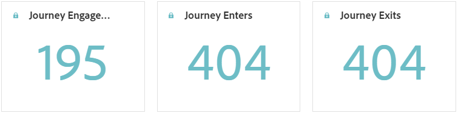
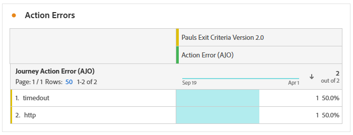

# Reisrapport {#journey-global-report}

Het **rapport van de Reis** functies als een volledig-omringend dashboard, leverend een analyse van essentiële metriek verbonden aan uw reis. Dit omvat details zoals het aantal ingevoerde profielen en gevallen van mislukte individuele reizen, die een uitvoerige insight in de doeltreffendheid en het niveau van betrokkenheid van uw reis aanbieden.

**het rapport van de Reis** kan direct van uw reis met de **[!UICONTROL View report]** knoop worden betreden.

Meer over Customer Journey Analytics Workspace leren en hoe te om gegevens te filtreren en te analyseren, verwijs naar [&#x200B; deze pagina &#x200B;](https://experienceleague.adobe.com/nl/docs/analytics-platform/using/cja-workspace/home).

## Reisoverzicht {#journey-global}

Het **[!UICONTROL Journey]** -rapport geeft u een duidelijk beeld van de belangrijkste trackinggegevens van uw reis.

### PKI&#39;s voor reizen {#journey-perfomance}

De **[!UICONTROL Journey]** Belangrijkste Indicatoren van Prestaties (KPIs) functioneren als een allesomvattend dashboard, dat een analyse van essentiële metriek verbonden aan uw reis levert. Dit omvat details zoals het aantal binnengekomen profielen en gevallen van mislukte individuele reizen, die een uitvoerige insight in de doeltreffendheid en het niveau van betrokkenheid van uw reis aanbieden.

+++ Meer informatie over de cijfers van de KPI&#39;s voor reizen

* **[!UICONTROL Journey engagement]**: Het totale aantal unieke personen dat berichten heeft ontvangen die door de reis zijn verzonden, die verschillende profielen vertegenwoordigen die een bepaald actiepunt in de reis hebben bereikt.

* **[!UICONTROL Journey enters]**: Het totale aantal personen dat de gebeurtenis entry van de reis heeft bereikt.

* **[!UICONTROL Journey exits]**: Het totale aantal personen dat de reis heeft verlaten.

+++

### Reisstatistieken {#journey-stats}

De tabel **[!UICONTROL Journey Statistics]** bevat een gedetailleerde samenvatting van de belangrijkste gegevens over uw reizen. Het omvat belangrijke metriek zoals het aantal mislukkingen en succesvolle ingangen, die waardevolle inzichten in de prestaties en het bereik van uw e-mail en reizen verstrekken.

+++ Meer informatie over statistieken voor reisstatistieken

* **[!UICONTROL Journey exclusion]**: Het totale aantal personen dat van de reis werd uitgesloten vanwege vooraf gedefinieerde criteria of suppressieregels.

* **[!UICONTROL Journey engagement]**: Het totale aantal unieke personen dat berichten heeft ontvangen die door de reis zijn verzonden, die verschillende profielen vertegenwoordigen die een bepaald actiepunt in de reis hebben bereikt.

* **[!UICONTROL Journey enters]**: Het totale aantal personen dat de gebeurtenis entry van de reis heeft bereikt.

* **[!UICONTROL Journey exits]**: Het totale aantal personen dat de reis heeft verlaten.

* **[!UICONTROL Journey failures]**: Het totale aantal individuele reizen dat niet succesvol is uitgevoerd.

* **[!UICONTROL Unique Journey enters]**: Het totale aantal personen dat de gebeurtenis entry van de reis heeft bereikt, de meervoudige interacties van één profiel worden niet in aanmerking genomen.

* **[!UICONTROL Unique Journey exits]**: Het totale aantal personen dat de reis heeft verlaten, de meervoudige interacties van één profiel worden niet in aanmerking genomen.

* **[!UICONTROL Unique Journey failures]**: Het totale aantal afzonderlijke reizen dat niet succesvol is uitgevoerd, er wordt geen rekening gehouden met meerdere interacties van één profiel.

+++

## Journaal uitsluiten {#journey-exclusion}

De tabel **[!UICONTROL Journey exclusion]** bevat een uitgebreide weergave van de verschillende factoren die tot de uitsluiting van gebruikersprofielen hebben geleid.

## Handelingsfout {#action-error}

De **[!UICONTROL Action errors]** -widget geeft een overzicht van de verschillende fouten die zijn opgetreden tijdens de uitvoering van de reis.

## Reiscanvas {#journey-canvas}

Met de widget **[!UICONTROL Journey Canvas]** kunt u visueel het traject volgen van uw doelprofielen terwijl u door de reis navigeert. [&#x200B; leer meer in de documentatie van Customer Journey Analytics &#x200B;](https://experienceleague.adobe.com/nl/docs/analytics-platform/using/cja-workspace/visualizations/journey-canvas/journey-canvas)

Verbeter uw canvasaanpassing met de volgende opties:

* Voeg het gewenste type activiteit, zoals berichten of voorwaarden, toe of verwijder uit het vervolgkeuzemenu **[!UICONTROL Node type]** .
* Pas **[!UICONTROL Percentage value]** aan om de stroomdistributie onder verschillende reiswegen te bepalen.
* Pas **[!UICONTROL Arrow settings]** aan om labels, voorwaarden of een schone weergave op te nemen.
* Schakel de optie **[!UICONTROL Show fallout]** in om profielen te visualiseren waarmee u de reis rechtstreeks op het canvas hebt verlaten.

De volgende regels zijn van toepassing bij het gebruik van **[!UICONTROL Node Type]** Filteren:

* Wanneer het creëren van een segment op een knoop, zal het nog knopen van vroegere stadia van de reis omvatten, zelfs als die knopen door het **[!UICONTROL Node type]** filter zijn uitgesloten.

* U kunt geen segmenten maken die uit een pijl worden gevormd als knooppunten in eerdere stadia van de rit via het filter **[!UICONTROL Node type]** zijn uitgesloten. In dit geval wordt de functie voor klikken met de rechtermuisknop op die pijlen uitgeschakeld.

## Prestaties van handelingen {#action-performance}

### Prestaties in de loop der tijd {#action-overtime}

In de grafiek van **[!UICONTROL Performance Over time]** kunt u het aantal profielen identificeren en analyseren dat voldoet aan de criteria om als doelprofielen voor uw acties te worden beschouwd. Deze visualisatie biedt waardevolle inzichten in de effectiviteit van uw strategieën en helpt u gegevensgestuurde beslissingen te nemen om uw prestaties te optimaliseren.

### Overzicht van handelingen {#action-overview}

De tabel **[!UICONTROL Action overview]** fungeert als een uitgebreid dashboard, dat een analyse biedt van de belangrijkste metriek die betrekking heeft op de acties op uw reis. Dit omvat cruciale details zoals het aantal interacties en de doorklikfrequentie

+++ Meer informatie over de maatstaven van het overzicht van handelingen

* **[!UICONTROL Node enters]**: Het totale aantal personen dat een bepaald knooppunt tijdens de reis is binnengekomen.

* **[!UICONTROL Journey failure]**: Het totale aantal individuele reizen dat niet succesvol is uitgevoerd.

* **[!UICONTROL Click through rate]**: percentage gebruikers dat interactie had met de handeling.

* **[!UICONTROL Clicks]**: Het aantal keren dat er op de inhoud is geklikt in de handelingen.

* **[!UICONTROL Delivered]**: Aantal verzonden acties in verhouding tot het totale aantal verzonden acties.

+++

## Prestaties van gebeurtenissen {#events-performance}

### Prestaties in de loop der tijd {#event-overtime}

In de grafiek van **[!UICONTROL Performance over time]** kunt u het aantal profielen identificeren en analyseren dat als doelprofielen voor uw gebeurtenissen wordt gekwalificeerd. Dit krachtige hulpmiddel helpt u tendensen en patronen in tijd volgen, die waardevolle inzichten verstrekken om uw gebeurtenisstrategieën te optimaliseren.

### Overzicht van gebeurtenissen {#event-overview}

In de tabel **[!UICONTROL Event overview]** ziet u hoeveel profielen in de loop der tijd voldoen aan de criteria voor gebeurtenissen. Met dit gereedschap kunt u patronen in kwalificatiesnelheden identificeren om uw gebeurtenisstrategie te verfijnen.

+++ Meer informatie over statistieken voor reisstatistieken

* **[!UICONTROL People]**: Aantal gebruikersprofielen dat als doelprofielen voor uw gebeurtenissen wordt gekwalificeerd.

+++

## Overzicht van doelen {#targeting}

Als u **[!UICONTROL Targeting rules]** instelt voor uw inhoud, biedt de tabel van **[!UICONTROL Targeting overview]** een gedetailleerde weergave van de belangrijkste betrokkenheidsmetriek, waarmee u kunt zien hoe de doelprofielen voor elke regel reageren op uw inhoud.

➡️ [&#x200B; Leer meer bij het richten van regels &#x200B;](../content-management/optimization-targeting.md)

+++ Meer informatie over gerichte overzichtsmetriek

* **[!UICONTROL People]**: Aantal gebruikersprofielen dat als doelprofielen voor uw gebeurtenissen wordt gekwalificeerd.

* **[!UICONTROL Unique Clicks]**: Aantal profielen dat op de inhoud van een e-mail heeft geklikt.

* **[!UICONTROL Unique click rate]**: percentage doelprofielen waarop ten minste één keer is geklikt.

+++
