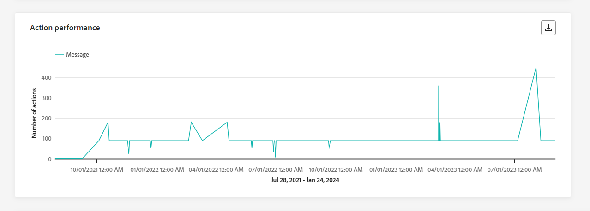
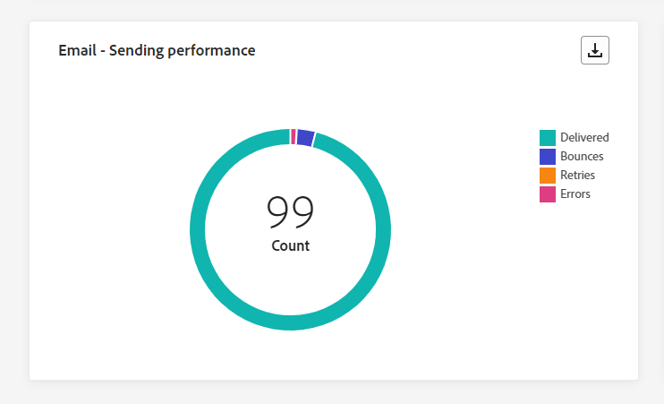
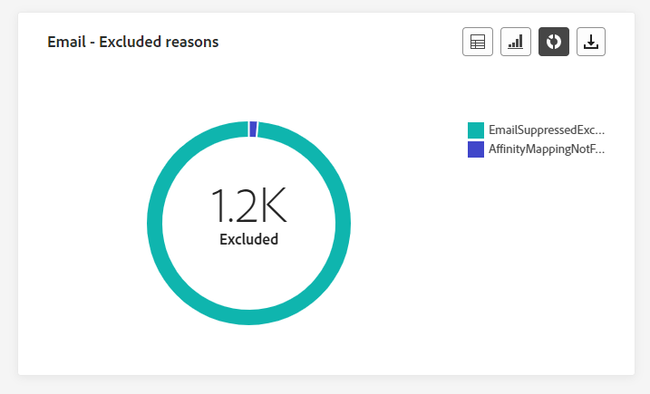

# Journaal algemeen rapport {#journey-global-report}

>[!CONTEXTUALHELP]
>id="ajo_journey_global_report"
>title="Journaal algemeen rapport"
>abstract="Met het algemene rapport Journey kunt u de impact van uw reizen over een bepaalde tijdsperiode meten. Uw rapport is verdeeld in verschillende widgets die het succes en de fouten van uw reis gedetailleerd beschrijven. Elk rapportdashboard kan worden gewijzigd door widgets te vergroten of te verkleinen of te verwijderen."

Globale rapporten, toegankelijk vanaf het tabblad Alle tijd, geven gebeurtenissen weer die zich ten minste twee uur geleden hebben voorgedaan en bestrijken gebeurtenissen gedurende een geselecteerde tijdsperiode. In vergelijking hiermee richten Live-rapporten zich op gebeurtenissen die zich in de afgelopen 24 uur hebben voorgedaan, met een minimale tijdsinterval van twee minuten vanaf het plaatsvinden van de gebeurtenis.

Het algemene rapport van de reis kan direct van uw reis met het **[!UICONTROL View report]** knop.

De reis **[!UICONTROL Global report]** Deze pagina wordt weergegeven met de volgende tabbladen:

* [Reis](#journey-global)
* [Email](#email-global)
* [Push](#push-global)
* [Sms](#sms-global)
* [In-app](#in-app-global)

De reis **[!UICONTROL Global report]** is verdeeld in verschillende widgets waarin het succes en de fouten van uw reis worden beschreven. Elke widget kan indien nodig worden vergroot of verkleind en verwijderd. Raadpleeg voor meer informatie hierover [sectie](global-report.md#modify-dashboard).

Voor een gedetailleerde lijst van elke metrisch beschikbaar in Adobe Journey Optimizer, verwijs naar [deze pagina](global-report.md#list-of-components-global).

## Tabblad Reis {#journey-global}

Vanaf uw reis **[!UICONTROL Global report]** de **[!UICONTROL Journey]** geeft u een duidelijk overzicht van de belangrijkste volgende gegevens over uw reis.

### Reisprestaties {#journey-perfomance}

>[!CONTEXTUALHELP]
>id="ajo_journey_performance"
>title="Reisprestaties"
>abstract="XX"

De **[!UICONTROL Journey Performance]** met widget kunt u visueel het traject van uw doelprofielen volgen terwijl u door de reis navigeert.

### Reisstatistieken {#journey-statistics}

>[!CONTEXTUALHELP]
>id="ajo_journey_statistics"
>title="Reisstatistieken"
>abstract="XX"

De **[!UICONTROL Journey Statistics]** De zeer belangrijke Indicatoren van Prestaties (KPIs) functioneren als allesomvattend dashboard, dat een analyse van essentiële metriek in verband met uw reis levert. Dit omvat details zoals het aantal binnengekomen profielen en gevallen van mislukte individuele reizen, die een uitvoerig inzicht in de doeltreffendheid van uw reis en niveau van betrokkenheid aanbieden.

+++ Meer informatie over statistieken voor reisstatistieken

* **[!UICONTROL Entered profiles]**: Totaal aantal personen dat de inreisgebeurtenis van de reis heeft bereikt.

* **[!UICONTROL Exited profiles]**: Totaal aantal personen dat de reis heeft verlaten.

* **[!UICONTROL Failed individual journey]**: Totaal aantal individuele reizen die niet succesvol zijn uitgevoerd.

+++

### Prestaties van handelingen {#action-performance}

>[!CONTEXTUALHELP]
>id="ajo_journey_action_performance"
>title="Prestaties van handelingen"
>abstract="XX"

De **[!UICONTROL Action Performance]** widget staat voor de meest succesvolle acties die zijn uitgevoerd toen uw **[!UICONTROL Actions]** werden geactiveerd.

### Bovenste acties {#top-actions}

>[!CONTEXTUALHELP]
>id="ajo_journey_top_actions"
>title="Bovenste acties"
>abstract="XX"

De **[!UICONTROL Top Actions]** tabel bevat essentiële gegevens over uw **[!UICONTROL Actions]**. Het biedt beknopte inzichten in de frequentie en de prestaties van elke actie.

+++ Meer informatie over maatstaven voor acties bovenaan

* **[!UICONTROL Actions successfully executed]**: Totaal aantal **[!UICONTROL Actions]** succesvol uitgevoerd voor een reis.

* **[!UICONTROL Error in action]**: Totaal aantal fouten voor **[!UICONTROL Actions]**.

+++

### Foutredenen voor handelingen {#action-error}

>[!CONTEXTUALHELP]
>id="ajo_journey_actions_error_reasons"
>title="Foutredenen voor handelingen"
>abstract="XX"

De **[!UICONTROL Action Error Reasons]**  tabel en grafiek geven een uitgebreid overzicht van de fouten die zijn opgetreden tijdens de uitvoering van uw **[!UICONTROL Actions]**.

### Gebeurtenissen naar oorsprong {#events-origin}

>[!CONTEXTUALHELP]
>id="ajo_journey_events_origin"
>title="Gebeurtenissen naar oorsprong"
>abstract="XX"

De **[!UICONTROL Events by origin]** tabel en grafieken bieden een gedetailleerd perspectief op de succesvolle ontvangst van uw **[!UICONTROL Events]**. Aan de hand van deze visuele weergaven kunt u precies zien welke van uw **[!UICONTROL Events]** zijn daadwerkelijk ontvangen, zodat u waardevolle inzichten kunt krijgen in de prestaties en de impact van individuele gebeurtenissen op uw reis.

### Gebeurtenissen ontvangen per gebeurtenis {#events-received}

>[!CONTEXTUALHELP]
>id="ajo_journey_events_received"
>title="Gebeurtenissen ontvangen per gebeurtenis"
>abstract="XX"

De **[!UICONTROL Events received by event]** in een grafiek kunt u bepalen en analyseren welke specifieke **[!UICONTROL Event]** binnen uw reis werd effectief uitgevoerd, die waardevolle inzichten in de prestaties en succespercentages van individuele gebeurtenissen verstrekken.

### Frequente gebeurtenissen {#top-events}

>[!CONTEXTUALHELP]
>id="ajo_journey_top_events"
>title="Frequente gebeurtenissen"
>abstract="XX"

De **[!UICONTROL Top events]** tabel bevat essentiële gegevens over uw **[!UICONTROL Events]**. Het biedt beknopte inzichten in de frequentie en prestaties van elk **[!UICONTROL Event]**.

### Toestemmingsbeleid {#consent-policies}

>[!CONTEXTUALHELP]
>id="ajo_journey_consent_policies"
>title="Toestemmingsbeleid"
>abstract="XX"

De **[!UICONTROL Consent policies]** in tabel en grafiek ziet u het aantal profielen dat is uitgesloten van elk beleid in uw aangepaste acties. Dit geeft een duidelijk inzicht in de gevolgen van elk toestemmingsbeleid voor profieluitsluitingen.

Voor meer informatie over aangepaste handelingen raadpleegt u [de gedetailleerde documentatie](../action/about-custom-action-configuration.md).

Houd er rekening mee dat u de dashboards opnieuw moet instellen als deze widgets alleen in uw journalistiek worden weergegeven. Klik hiervoor op **[!UICONTROL Modify]** dan **[!UICONTROL Reset]** boven aan uw rapport.

## Tabblad E-mail {#email-global}

Vanaf uw reis **[!UICONTROL Global report]** de **[!UICONTROL Email]** bevat de belangrijkste gegevens met betrekking tot de e-mails die tijdens uw reis worden verzonden.

### E-mail - Statistieken verzenden {#email-sending-statistics}

>[!CONTEXTUALHELP]
>id="ajo_journey_email_sending_statistics"
>title="E-mail - Statistieken verzenden"
>abstract="XX"

De **[!UICONTROL Email Sending Statistics]** de tabel bevat een uitgebreide samenvatting van de belangrijkste gegevens over e-mails tijdens uw reis . Het bevat belangrijke metriek zoals de grootte van het beoogde publiek en het aantal e-mails dat succesvol is afgeleverd. Het biedt waardevolle inzichten in de effectiviteit en het bereik van uw e-mails en reizen.

+++ Meer informatie over statistieken over verzendstatistieken per e-mail

* **[!UICONTROL Execution time]**: Begintijd van elke uitvoering van de reis in geval van terugkerende reizen. Als u slechts één of meerdere herhalingen als doel wilt instellen, selecteert u deze in het menu **[!UICONTROL Execution time]** vervolgkeuzelijst.

* **[!UICONTROL Targeted]**: Het aantal profielen dat is bedoeld voor acties zoals het verzenden van e-mail of sms.

* **[!UICONTROL Sent]**: Het totale aantal e-mails dat voor de reis is verzonden.

* **[!UICONTROL Delivered]**: Aantal verzonden e-mails in verhouding tot het totale aantal verzonden e-mails.

* **[!UICONTROL Delivery Rate]**: Percentage verzonden e-mailberichten.

* **[!UICONTROL Bounces]**: Totaal aantal fouten gecumuleerd tijdens het verzendproces en automatische retourverwerking in verhouding tot het totale aantal verzonden e-mails.

* **[!UICONTROL Bounce Rate]**: Percentage van e-mails dat is teruggestuurd in vergelijking met verzonden e-mails.

* **[!UICONTROL Errors]**: Het totale aantal fouten dat is opgetreden tijdens het verzendproces waardoor het niet naar profielen kan worden verzonden.

* **[!UICONTROL Error Rate]**: Percentage fouten dat is opgetreden tijdens het verzendproces waardoor het niet kan worden verzonden, vergeleken met verzonden e-mailberichten.

* **[!UICONTROL Retries]**: Aantal e-mails in de wachtrij voor nieuwe pogingen.

* **[!UICONTROL Excluded]**: Aantal profielen dat door Adobe Journey Optimizer is uitgesloten.

+++

### E-mail - Trackingstatistieken {#email-tracking}

>[!CONTEXTUALHELP]
>id="ajo_journey_email_tracking_statistics"
>title="E-mail - Trackingstatistieken"
>abstract="XX"

De **[!UICONTROL Email - Tracking statistics]** de tabel bevat een gedetailleerd overzicht van de profielactiviteiten met betrekking tot e-mails die in uw reis zijn opgenomen. Dit omvat cijfers over het openen, klikken en andere relevante betrokkenheidsindicatoren, die een uitgebreid overzicht bieden van hoe profielen met uw e-mailinhoud communiceren.

+++ Meer informatie over e-mail - statistieken over bijhouden

* **[!UICONTROL Execution time]**: Begintijd van elke uitvoering van uw terugkerende e-mail tijdens uw reis. Als u slechts één of meerdere terugkerende e-mails wilt aanwijzen, selecteert u deze in het menu **[!UICONTROL Execution time]** vervolgkeuzelijst.

* **[!UICONTROL Opens]**: Het aantal keren dat je e-mails zijn geopend tijdens een reis.

* **[!UICONTROL Unique Opens]**: Percentage geopende e-mails.

* **[!UICONTROL Unique Open Rate]**: Het totale aantal geopende e-mails in verhouding tot het aantal geleverde e-mails.

* **[!UICONTROL Clicks]**: Het aantal keren dat er op de inhoud in uw e-mails is geklikt.

* **[!UICONTROL Unique Clicks]**:Aantal ontvangers die op een inhoud in uw e-mails hebben geklikt.

* **[!UICONTROL Click through rate]**: Percentage gebruikers die met de reis communiceerden.

* **[!UICONTROL Unsubscriptions]**: Het aantal klikken op de koppeling voor het opzeggen van abonnementen.

* **[!UICONTROL Spam complaints]**: Het aantal keren dat je e-mails zijn gedeclareerd als spam of junk.

+++

### E-mail - Prestaties verzenden {#email-performance}

>[!CONTEXTUALHELP]
>id="ajo_journey_email_sending_performance"
>title="E-mail - Prestaties verzenden"
>abstract="XX"

De **[!UICONTROL Email - Sending performance]** in grafiek vindt u een uitgebreide weergave van gegevens over verzonden e-mails op uw reis. Deze weergave biedt inzicht in belangrijke meetgegevens, zoals geleverde gegevens en stuitingen. Dit maakt een gedetailleerde analyse van het verzendingsproces van e-mail mogelijk en biedt waardevolle informatie over de efficiëntie en prestaties van uw reizen.

+++ Meer informatie over e-mail - Prestatiegegevens verzenden

* **[!UICONTROL Delivered]**: Aantal verzonden e-mails in verhouding tot het totale aantal verzonden e-mails.

* **[!UICONTROL Bounces]**: Totaal aan fouten gecumuleerd tijdens het verzendingsproces en automatische retourverwerking in verhouding tot het totale aantal verzonden berichten.

* **[!UICONTROL Retries]**: Aantal e-mails in de wachtrij voor nieuwe pogingen.

* **[!UICONTROL Errors]**: Het totale aantal fouten dat is opgetreden tijdens een verzendingsproces dat verhindert dat het naar profielen wordt verzonden.

+++

### E-mail - rubrieken en redenen voor stuiteren {#email-bounce-categories}

>[!CONTEXTUALHELP]
>id="ajo_journey_email_bounces"
>title="E-mail - rubrieken en redenen voor stuiteren"
>abstract="XX"

De **[!UICONTROL Bounce Reasons]** en **[!UICONTROL Bounce categories]** widgets compileren de beschikbare gegevens met betrekking tot teruggestuurde berichten , zodat ze gedetailleerde informatie kunnen krijgen over de specifieke redenen en categorieën achter e - mailberichten .

Voor meer informatie over grenzen raadpleegt u de [Onderdrukkingslijst](../reports/suppression-list.md) pagina.

+++ Meer informatie over e-mail - cijfers voor rubrieken voor sprongen

* **[!UICONTROL Hard bounce]**: Het totale aantal permanente fouten, zoals een onjuist e-mailadres. Dit omvat een foutbericht waarin expliciet wordt aangegeven dat het adres ongeldig is, zoals Onbekende gebruiker.

* **[!UICONTROL Soft bounce]**: Het totale aantal tijdelijke fouten, zoals een volledig postvak.

* **[!UICONTROL Ignored]**: Het totale aantal tijdelijke berichten, zoals Buiten-kantoor, of een technische fout, bijvoorbeeld als het type afzender postmaster is.

+++

### E-mail - Foutredenen {#email-errors}

>[!CONTEXTUALHELP]
>id="ajo_journey_email_error_reasons"
>title="E-mail - Foutredenen"
>abstract="XX"

De **[!UICONTROL Error Reasons]** grafieken en tabellen bieden zichtbaarheid in de specifieke fouten die tijdens het verzendingsproces zijn opgetreden, zodat u waardevolle informatie kunt krijgen over de aard en het optreden van fouten.

### E-mail - Uitgesloten redenen {#email-excluded}

>[!CONTEXTUALHELP]
>id="ajo_journey_email_excluded_reasons"
>title="E-mail - Uitgesloten redenen"
>abstract="XX"

De **[!UICONTROL Excluded reasons]** in grafieken en tabellen wordt een uitgebreid overzicht gegeven van de verschillende factoren die ertoe hebben geleid dat gebruikersprofielen van het beoogde publiek zijn uitgesloten, waardoor het bericht niet is ontvangen.

Zie [deze pagina](exclusion-list.md) voor de volledige lijst van uitsluitingsredenen.

### Verzonden en geleverd op domeinen {#sent-domains}

>[!CONTEXTUALHELP]
>id="ajo_journey_email_sent_delivered_domains"
>title="Verzonden en geleverd op domeinen"
>abstract="XX"

De  **[!UICONTROL Sent & delivered by domains]** tabel en grafiek geven een gedetailleerde uitsplitsing van e-mails op domeinniveau, zodat u uitgebreide inzichten kunt krijgen in de prestaties van uw e-mails.

+++ Meer informatie over Verzonden en geleverde waarden per domein

* **[!UICONTROL Sent]**: Het totale aantal verzendingen voor je e-mails.

* **[!UICONTROL Delivered]**: Aantal verzonden e-mails in verhouding tot het totale aantal verzonden e-mails.

+++

### Openen en klikken op domeinen {#open-domains}

>[!CONTEXTUALHELP]
>id="ajo_journey_email_open_clicks_domains"
>title="Openen en klikken op domeinen"
>abstract="XX"

De  **[!UICONTROL Open & clicks by domains]** in grafiek en tabel wordt een overzicht gegeven van de betrokkenheid van uw profielen op domeinniveau bij uw e-mail. Zo krijgt u waardevolle inzichten over de interactie tussen de verschillende domeinen en uw inhoud.

+++ Meer informatie over Openen en klikken op domeinmetriek

* **[!UICONTROL Opens]**: Aantal keer dat de e-mail is geopend.

* **[!UICONTROL Clicks]**: Aantal keer dat er op inhoud is geklikt in een e-mail.

+++

### Stuitingen en fouten per domein {#bounces-domains}

>[!CONTEXTUALHELP]
>id="ajo_journey_email_bounces_errors_domains"
>title="Stuitingen en fouten per domein"
>abstract="XX"

De  **[!UICONTROL Bounces & errors by domains]** de grafiek en de lijst verstrekken een domein-vlakke uitsplitsing van specifieke fouten die tijdens het verzendende proces worden ontmoet, die een gedetailleerde analyse van kwesties verstrekken die voorkwamen.

+++ Meer informatie over grenzen en fouten per domeinmetriek

* **[!UICONTROL Bounces]**: Totaal aantal fouten gecumuleerd tijdens het verzendproces en automatische retourverwerking in verhouding tot het totale aantal verzonden e-mails.

* **[!UICONTROL Errors]**: Het totale aantal fouten dat is opgetreden tijdens het verzendproces waardoor het niet naar profielen kan worden verzonden.

+++

### Bounce reason by domain {#bounce-reasons-domains}

>[!CONTEXTUALHELP]
>id="ajo_journey_email_bounces_reasons_domains"
>title="Bounces redenen per domein"
>abstract="XX"

De  **[!UICONTROL Bounce reasons by domain]** grafiek en tabel bieden een uitsplitsing op domeinniveau van gegevens met betrekking tot zowel tijdelijke als permanente fouten, die gedetailleerde inzichten verschaffen in de redenen achter aangekondigde berichten.

### E-mail - bovenste URL {#email-top}

>[!CONTEXTUALHELP]
>id="ajo_journey_email_top_url"
>title="E-mail - bovenste URL"
>abstract="XX"

De **[!UICONTROL Email - Top Url]** de grafiek en de lijst verstrekken een uitvoerig overzicht van URLs binnen uw e-mail die het hoogste bezoekersverkeer aantrekken. Hierdoor kunt u de populairste koppelingen identificeren en er prioriteiten aan stellen, zodat u meer inzicht krijgt in de betrokkenheid bij profielen met specifieke inhoud in uw e-mails.

### E-mail - Optimalisatie {#email-sto}

>[!CONTEXTUALHELP]
>id="ajo_journey_email_optimization"
>title="E-mail - Optimalisatie"
>abstract="XX"

>[!NOTE]
>
>De **[!UICONTROL Send time optimization]** en **[!UICONTROL Optimized vs non optimized]** widgets zijn alleen beschikbaar als de optie Send-Time Optimization is geactiveerd voor uw levering. Voor meer informatie over Send-Time Optimization, verwijs naar [deze pagina](../building-journeys/journeys-message.md#send-time-optimization).

De **[!UICONTROL Send time optimization]** en **[!UICONTROL Optimized vs non optimized]** widgets geven een gedetailleerd overzicht van het succes van uw e-mailberichten, afhankelijk van de verzendmethode: geoptimaliseerd of normaal.

+++ Meer informatie over optimalisatie van de verzendtijd en geoptimaliseerde versus niet-geoptimaliseerde meetgegevens

* **[!UICONTROL Delivered]**: Het aantal berichten dat is verzonden in verhouding tot het totale aantal verzonden berichten.
* **[!UICONTROL Bounces]**: Totaal aan fouten gecumuleerd tijdens het verzendingsproces en automatische retourverwerking in verhouding tot het totale aantal verzonden berichten.

* **[!UICONTROL Sent]**: Het totale aantal e-mails dat voor de reis is verzonden.

* **[!UICONTROL Opens]**: Het aantal keren dat je e-mails geopend zijn tijdens de reis.

* **[!UICONTROL Clicks]**: Het aantal keer dat er op de inhoud in uw e-mails is geklikt.

+++

### E-mail - voorstellen {#email-offers}

>[!CONTEXTUALHELP]
>id="ajo_journey_email_offers"
>title="E-mail - voorstellen"
>abstract="XX"

>[!NOTE]
>
>De widgets en cijfers voor aanbiedingen zijn alleen beschikbaar als een beslissing in een e-mail is ingevoegd. Raadpleeg voor meer informatie over het beheer van de beslissingen het volgende [page](../offers/get-started/starting-offer-decisioning.md).

De **[!UICONTROL Offers statistic]** en **[!UICONTROL Offers detailed statistic]** in de loop der tijd meten de widgets het succes van uw aanbieding en de impact op uw doelgroep. Het detailleert de belangrijkste informatie met betrekking tot uw bericht met KPIs.

+++ Meer informatie over e-mail - Metriek van aanbiedingen

* **[!UICONTROL Offer sent]**: Totaal aantal verzendingen voor de aanbieding.

* **[!UICONTROL Offer impression]**: Het aantal keren dat het voorstel in je e-mails is geopend.

* **[!UICONTROL Offer clicks]**: Het aantal keren dat er op een voorstel is geklikt in je e-mailberichten.

* **[!UICONTROL Placement name]**: Naam van uw plaatsing die wordt gebruikt om uw voorstel weer te geven. Raadpleeg deze voor meer informatie over plaatsing [page](../offers/offer-library/creating-placements.md).

* **[!UICONTROL Offer name]**: Naam van het voorstel dat in je e-mails is toegevoegd. Raadpleeg deze voor meer informatie over plaatsing [page](../offers/offer-library/creating-personalized-offers.md).

* **[!UICONTROL Offer sent]**: Totaal aantal verzendingen voor de aanbieding.

* **[!UICONTROL Offer impression rate]**: Percentage geopende aanbiedingen in verhouding tot het aantal verzonden aanbiedingen.

* **[!UICONTROL Offer click rate]**: Percentage gebruikers dat interactie heeft gehad met het aanbod.

+++

## Tabblad Pushmelding {#push-global}

Vanaf uw reis **[!UICONTROL Global report]** de **[!UICONTROL Push notification]** bevat de belangrijkste informatie met betrekking tot de pushmeldingen die tijdens uw reis worden verzonden.

### Pushmelding - Statistieken verzenden {#push-sending-stat}

>[!CONTEXTUALHELP]
>id="ajo_journey_push_sending_statistics"
>title="Pushmelding - Statistieken verzenden"
>abstract="XX"

De **[!UICONTROL Push notification - Sending statistics]** de tabel bevat een beknopt overzicht van de essentiële gegevens over uw pushberichten, inclusief de belangrijkste meetgegevens zoals het aantal gerichte berichten en het aantal succesvol afgeleverde berichten.

+++ Meer informatie over pushmeldingen - Statistische gegevens verzenden

* **[!UICONTROL Execution time]**: Begintijd van elke uitvoering van de reis in geval van terugkerende reizen. Als u slechts één of meerdere herhalingen als doel wilt instellen, selecteert u deze in het menu **[!UICONTROL Execution time]** vervolgkeuzelijst.

* **[!UICONTROL Targeted]**: Het aantal profielen dat is bedoeld voor acties zoals het verzenden van e-mail of sms.

* **[!UICONTROL Sent]**: Totaal aantal verzonden pushmeldingen.

* **[!UICONTROL Delivered]**: Het aantal pushmeldingen dat is verzonden in verhouding tot het totale aantal verzonden pushmeldingen.

* **[!UICONTROL Delivery Rate]**: Percentage pushmeldingen verzonden.

* **[!UICONTROL Bounces]**: Totaal aantal fouten gecumuleerd tijdens het verzendproces en automatische retourverwerking in verhouding tot het totale aantal verzonden pushmeldingen.

* **[!UICONTROL Bounce Rate]**: Percentage pushmeldingen dat is teruggestuurd in vergelijking met verzonden pushmeldingen.

* **[!UICONTROL Errors]**: Het totale aantal fouten dat is opgetreden tijdens het verzendproces waardoor het niet naar profielen kan worden verzonden.

* **[!UICONTROL Error Rate]**: Percentage fouten die optraden tijdens het verzendproces waardoor het niet kon worden verzonden, vergeleken met verzonden pushberichten.

* **[!UICONTROL Excluded]**: Aantal profielen dat door Adobe Journey Optimizer is uitgesloten.

+++

### Pushmeldingen - Statistieken bijhouden {#push-tracking-stat}

>[!CONTEXTUALHELP]
>id="ajo_journey_push_tracking_statistics"
>title="Pushmeldingen - Statistieken bijhouden"
>abstract="XX"

De **[!UICONTROL Push - Tracking statistics]** widget biedt een gedetailleerde momentopname van profielactiviteiten die aan uw pushmeldingen zijn gekoppeld, en biedt essentiële inzichten in de doeltreffendheid van betrokkenheid en pushmeldingen.

+++ Meer informatie over pushmeldingen - statistieken bijhouden

* **[!UICONTROL Execution time]**: Begintijd van elke uitvoering van de reis in geval van terugkerende reizen. Als u slechts één of meerdere herhalingen als doel wilt instellen, selecteert u deze in het menu **[!UICONTROL Execution time]** vervolgkeuzelijst.

* **[!UICONTROL Opens]**: Het aantal keren dat uw pushberichten tijdens de reis zijn geopend.

* **[!UICONTROL Actions]**: Totaal aantal acties op de geleverde pushmelding, bijvoorbeeld klikken op de knop of ontslag.

+++

### Pushmelding - Samenvatting verzenden {#push-summary}

>[!CONTEXTUALHELP]
>id="ajo_journey_push_sending_summary"
>title="Pushmelding - Samenvatting verzenden"
>abstract="XX"

De **[!UICONTROL Push notification - Sending summary]** de grafiek biedt een dynamische vertegenwoordiging aan, die een analyse van uw activiteit van pushberichten toont. Deze grafische weergave biedt een uitgebreide uitsplitsing van verzonden pushberichten.

+++ Meer informatie over pushmeldingen - Samenvattingscijfers verzenden

* **[!UICONTROL Opens]**: Het aantal keren dat uw pushberichten tijdens de reis zijn geopend.

* **[!UICONTROL Actions]**: Totaal aantal acties op de geleverde pushmelding, bijvoorbeeld klikken op de knop of ontslag.

* **[!UICONTROL Bounces]**: Totaal aantal fouten gecumuleerd tijdens het verzendproces en automatische retourverwerking in verhouding tot het totale aantal verzonden pushmeldingen.

* **[!UICONTROL Delivered]**: Het aantal pushmeldingen dat is verzonden in verhouding tot het totale aantal verzonden pushmeldingen.

* **[!UICONTROL Errors]**: Het totale aantal fouten dat is opgetreden tijdens het verzendproces waardoor het niet naar profielen kan worden verzonden.

+++

### Pushmelding - Foutredenen {#push-error-reasons}

>[!CONTEXTUALHELP]
>id="ajo_journey_push_error_reasons"
>title="Pushmelding - Foutredenen"
>abstract="XX"

De **[!UICONTROL Error Reasons]** tabel en grafieken bieden u de mogelijkheid om de specifieke fouten te identificeren die zijn opgetreden tijdens het verzenden van uw pushberichten. Zo krijgt u gedetailleerde informatie over eventuele problemen die zich onderweg hebben voorgedaan.

### Pushmelding - Uitgesloten redenen {#push-excluded}

>[!CONTEXTUALHELP]
>id="ajo_journey_push_excluded_reasons"
>title="Pushmelding - Uitgesloten redenen"
>abstract="XX"

De **[!UICONTROL Excluded reasons]** in grafieken en tabellen worden de verschillende redenen weergegeven waarom gebruikersprofielen, die zijn uitgesloten van de doelprofielen, uw pushberichten niet hebben ontvangen.

Zie [deze pagina](exclusion-list.md) voor de volledige lijst van uitsluitingsredenen.

### Pushmelding - Onderverdeling per platform {#push-breakdown}

>[!CONTEXTUALHELP]
>id="ajo_journey_push_breakdown_platform"
>title="Push-melding - Uitsplitsing per platform"
>abstract="XX"

De **[!UICONTROL Breakdown by platform]** de grafiek en de lijst verstrekken een gedetailleerde analyse van het succes van uw pushberichten, die inzichten aanbieden die op het werkende systeem van uw profiel worden gebaseerd. Deze ineenstorting verbetert uw inzicht in hoe goed uw pushberichten op verschillende platforms presteren.

### Pushmelding - Optimalisatie {#push-sto}

>[!NOTE]
>
>De **[!UICONTROL Optimized vs non optimized]** en **[!UICONTROL Send time optimization]**  widgets zijn alleen beschikbaar als de optie Send-Time Optimization is geactiveerd voor uw levering. Voor meer informatie over Send-Time Optimization, verwijs naar [deze pagina](../building-journeys/journeys-message.md#send-time-optimization).

De **[!UICONTROL Optimized vs non optimized]** en **[!UICONTROL Send time optimization]**  widgets bevatten gedetailleerde informatie over de belangrijkste informatie ten opzichte van uw bericht, ongeacht of deze zijn geoptimaliseerd of niet.

+++ Meer informatie over pushmeldingen - Optimalisatiegegevens

* **[!UICONTROL Delivered]**: Het aantal berichten dat is verzonden in verhouding tot het totale aantal verzonden berichten.

* **[!UICONTROL Opens]**: Het aantal keren dat uw pushberichten tijdens de reis zijn geopend.

* **[!UICONTROL Actions]**: Totaal aantal acties op de geleverde pushmelding, bijvoorbeeld klikken op de knop of ontslag.

* **[!UICONTROL Delivered]**: Het aantal berichten dat is verzonden in verhouding tot het totale aantal verzonden berichten.

* **[!UICONTROL Bounces]**: Totaal aan fouten gecumuleerd tijdens het verzendingsproces en automatische retourverwerking in verhouding tot het totale aantal verzonden berichten.

+++

## Tabblad SMS {#sms-global}

### SMS - Statistieken verzenden {#sms-sending-stat}

>[!CONTEXTUALHELP]
>id="ajo_journey_sms_sending_statistics"
>title="SMS - Statistieken verzenden"
>abstract="XX"

De **[!UICONTROL SMS - Sending statistics]** de lijst verstrekt een beknopte samenvatting van essentiële gegevens met betrekking tot uw berichten van SMS, die zeer belangrijke metriek zoals het aantal gerichte berichten en het aantal met succes geleverde berichten omvatten.

+++ Meer informatie over SMS - Statistische gegevens verzenden

* **[!UICONTROL Execution time]**: Begintijd van elke uitvoering van de reis in geval van terugkerende reizen. Als u slechts één of meerdere herhalingen als doel wilt instellen, selecteert u deze in het menu **[!UICONTROL Execution time]** vervolgkeuzelijst.

* **[!UICONTROL Targeted]**: Aantal gebruikersprofielen dat in aanmerking komt als doelprofielen voor uw SMS-berichten.

* **[!UICONTROL Excluded]**: Aantal gebruikersprofielen dat is uitgesloten van de beoogde profielen en dat uw SMS-berichten niet heeft ontvangen.

* **[!UICONTROL Sent]**: Totaal aantal SMS-berichten dat voor de reis is verzonden.

* **[!UICONTROL Bounces]**: Totaal aantal fouten gecumuleerd tijdens het verzendingsproces en automatische retourverwerking in verhouding tot het totale aantal verzonden SMS-berichten.

* **[!UICONTROL Errors]**: Het totale aantal fouten dat is opgetreden tijdens het verzendproces waardoor het niet naar profielen kan worden verzonden.

+++

### SMS - Trackingstatistieken {#sms-tracking-stat}

>[!CONTEXTUALHELP]
>id="ajo_journey_sms_tracking_statistics"
>title="SMS - Trackingstatistieken"
>abstract="XX"

De **[!UICONTROL SMS - Tracking statistics]** widget geeft een gedetailleerd overzicht van belangrijke informatie over de betrokkenheid van uw bezoekers bij uw URL&#39;s en biedt inzichten in de effectiviteit van uw SMS-berichten.

* **[!UICONTROL Execution time]**: Begintijd voor elke uitvoering van uw terugkerende SMS. Als u slechts één of meerdere terugkerende SMS-berichten wilt gebruiken, selecteert u deze in het menu **[!UICONTROL Execution time]** vervolgkeuzelijst.

* **[!UICONTROL Clicks]**: Het aantal keer dat er op de inhoud in uw SMS-berichten is geklikt.

### SMS - Prestaties op datum {#sms-performance-date}

>[!CONTEXTUALHELP]
>id="ajo_journey_sms_perfomance_date"
>title="SMS - Prestaties op datum"
>abstract="XX"

De **[!UICONTROL SMS - Performance by date]** widget biedt een gedetailleerd overzicht van belangrijke informatie met betrekking tot uw berichten , die door een grafiek wordt voorgesteld , die inzicht geeft in de prestatietrends over specifieke tijdsperiodes.

+++ Meer informatie over SMS - Prestaties op basis van datum

* **[!UICONTROL Sent]**: Totaal aantal voor de reis verzonden SMS-berichten

* **[!UICONTROL Bounces]**: Totaal aantal fouten gecumuleerd tijdens het verzendingsproces en automatische retourverwerking in verhouding tot het totale aantal verzonden SMS-berichten.

* **[!UICONTROL Errors]**: Het totale aantal fouten dat is opgetreden tijdens het verzendproces waardoor het niet naar profielen kan worden verzonden.

+++

### SMS - Bounges redenen {#sms-bounce}

>[!CONTEXTUALHELP]
>id="ajo_journey_sms_bounces_reasons"
>title="SMS - Bounges redenen"
>abstract="XX"

De **[!UICONTROL Bounces Reasons]** grafieken en tabellen bieden een uitgebreid overzicht van de gegevens met betrekking tot verzonden SMS-berichten en bieden waardevolle inzichten in de specifieke redenen achter sms-berichten.

### SMS - Redenen voor fouten {#sms-error}

>[!CONTEXTUALHELP]
>id="ajo_journey_sms_error_reasons"
>title="SMS - Redenen voor fouten"
>abstract="XX"

De **[!UICONTROL Error Reasons]** Met grafieken en tabellen kunt u de specifieke fouten identificeren die zijn opgetreden tijdens het verzenden van uw SMS-berichten. Zo kunt u een grondige analyse van alle ondervonden problemen maken.

### SMS - Uitgesloten redenen {#sms-excluded}

>[!CONTEXTUALHELP]
>id="ajo_journey_sms_excluded_reasons"
>title="SMS - Uitgesloten redenen"
>abstract="XX"

De **[!UICONTROL Excluded Reasons]** in grafieken en tabellen worden visueel de verschillende factoren weergegeven die hebben geleid tot de uitsluiting van gebruikersprofielen van het beoogde publiek, zodat gebruikers uw SMS-berichten niet kunnen ontvangen.

Zie [deze pagina](exclusion-list.md) voor de volledige lijst van uitsluitingsredenen.

### SMS - Klikken op koppelingen {#sms-clicks}

>[!CONTEXTUALHELP]
>id="ajo_journey_sms_clicks"
>title="SMS - Klikken op koppelingen"
>abstract="XX"

De **[!UICONTROL SMS - Clicks by links]** widget biedt essentiële inzichten in de betrokkenheid van uw bezoekers bij de URL&#39;s die in uw berichten zijn opgenomen en biedt waardevolle informatie over welke koppelingen de meeste interactie aantrekken.

## Tabblad In-app {#in-app-global}

Van je reis **[!UICONTROL Global report]** de **[!UICONTROL In-app]** bevat de belangrijkste informatie met betrekking tot de berichten in de app die tijdens uw reizen worden verzonden.

### Prestaties in de app {#inapp-performance}

>[!CONTEXTUALHELP]
>id="ajo_journey_inapp_performance"
>title="Prestaties in de app"
>abstract="XX"

De **[!UICONTROL In-app performance]**  KPI&#39;s bieden essentiële inzichten in de betrokkenheid van uw profielen bij In-app-berichten. Zo bieden ze essentiële meetgegevens om de effectiviteit en impact van de in-app-berichten die op uw reis worden aangeboden, te beoordelen.

+++ Meer informatie over In-app - Prestaties op basis van datum

* **[!UICONTROL Unique impressions]**: aantal unieke gebruikers aan wie het In-app-bericht is weergegeven.

* **[!UICONTROL Impressions]**: totaal aantal in-app-berichten dat aan alle gebruikers wordt weergegeven.

  >[!NOTE]
  >
  >Om ervoor te zorgen dat een indruk wordt geteld, moet de gebruiker aan twee criteria voldoen:
  >* Kwalificatie binnen de In-app ervaring, die door de specifieke In-app activiteit tijdens hun reis wordt bereikt.
  >* Voldoen aan de voorwaarden die zijn opgegeven in de triggerregels.
  > 
  >Als gevolg van het tweede criterium kunnen er aanzienlijke verschillen zijn tussen het aantal doelprofielen en het aantal unieke indrukkingen.

* **[!UICONTROL Interaction]**: aantal contracten met uw In-app-bericht. Dit omvat alle handelingen die de gebruikers hebben uitgevoerd, zoals klikken, ontslag of andere interactie.
+++

### Overzicht in de app {#inapp-summary}

>[!CONTEXTUALHELP]
>id="ajo_journey_inapp_summary"
>title="Overzicht in de app"
>abstract="XX"

De **[!UICONTROL In-app summary]** De grafiek illustreert de voortgang van uw in-app-afdrukken en interacties gedurende de opgegeven periode en geeft een uitgebreid overzicht van de prestaties van uw In-app-berichten.

### Interacties per type {#interactions-type}

>[!CONTEXTUALHELP]
>id="ajo_journey_inapp_interactions"
>title="Interacties per type"
>abstract="XX"

De **[!UICONTROL Interactions by type]** grafieken en tabellen geven een gedetailleerd overzicht van de interactie tussen profielen en uw bericht in de app, en bevatten informatie over het volgen van acties zoals klikken, ontslag of andere vormen van betrokkenheid.
