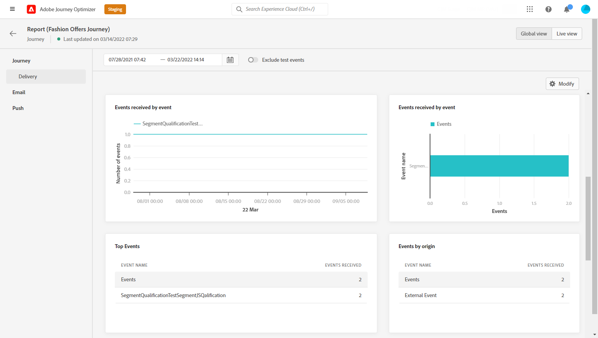
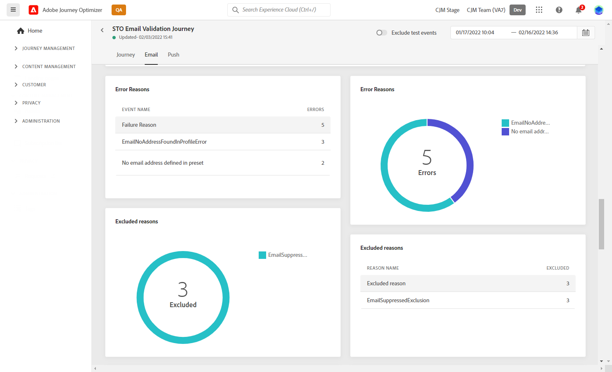
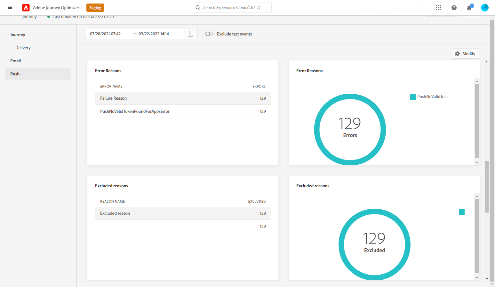

# Journey Global-rapport {#journey-global-report}

Het algemene rapport van de reis kan direct van uw reis met worden betreden **[!UICONTROL Global report]** knop.

De reis **[!UICONTROL Global report]** Deze pagina wordt weergegeven met de volgende tabbladen:

* [Reis](#journey-global)
* [Email](#email-global)
* [Push](#push-global)
* [Sms](#sms-global)

De reis **[!UICONTROL Global report]** is verdeeld in verschillende widgets waarin het succes en de fouten van uw reis worden beschreven. Elke widget kan indien nodig worden vergroot of verkleind en verwijderd. Raadpleeg voor meer informatie hierover [sectie](global-report.md#modify-dashboard).

## Tabblad Reis {#journey-global}

Vanaf uw reis **[!UICONTROL Global report]** de **[!UICONTROL Journey]** geeft u een duidelijk overzicht van de belangrijkste volgende gegevens over uw reis.

De **[!UICONTROL Journey Performance]** Met widget kunt u het pad van uw doelprofielen stap voor stap bekijken.

De **[!UICONTROL Journey Statistics]** widget geeft de volgende KPI&#39;s weer:

* **[!UICONTROL Entered profiles]**: Het totale aantal personen dat de inreisgebeurtenis van de reis heeft bereikt.

* **[!UICONTROL Exited profiles]**: Het totale aantal personen dat de reis heeft verlaten.

* **[!UICONTROL Failed individual journey]**: Het totale aantal individuele reizen dat niet succesvol is uitgevoerd.

De **[!UICONTROL Events received by event]**, **[!UICONTROL Events by origin]** en **[!UICONTROL Top events]** met widgets kunt u zien welke van uw **[!UICONTROL Events]** is uitgevoerd via grafieken en tabellen.

**[!UICONTROL Action Performance]**, **[!UICONTROL Action Error Reasons]** en **[!UICONTROL Top Actions]** widgets vertegenwoordigen de meest succesvolle actie en fouten die zijn opgetreden bij het **[!UICONTROL Actions]** werden geactiveerd.

De **[!UICONTROL Top Actions]** tabel bevat de gegevens die beschikbaar zijn voor **[!UICONTROL Actions]**, zoals:

* **[!UICONTROL Actions successfully executed]**: Totaal aantal **[!UICONTROL Actions]** succesvol uitgevoerd voor een reis.

* **[!UICONTROL Error in action]**: Totaal aantal fouten dat is opgetreden voor **[!UICONTROL Actions]**.

De **[!UICONTROL Consent policies]** in tabel en grafiek wordt het aantal profielen weergegeven dat is uitgesloten van elk beleid in uw aangepaste acties.
Voor meer informatie over aangepaste handelingen raadpleegt u [de gedetailleerde documentatie](../action/about-custom-action-configuration.md).

Houd er rekening mee dat u de dashboards opnieuw moet instellen als deze widgets alleen in uw journalistiek worden weergegeven. Klik hiervoor op **[!UICONTROL Modify]** dan **[!UICONTROL Reset]** boven aan uw rapport.

## Tabblad E-mail {#email-global}

Vanaf uw reis **[!UICONTROL Global report]** de **[!UICONTROL Email]** bevat de belangrijkste informatie met betrekking tot de e-mailleveringen die tijdens uw reis worden verzonden.

De **[!UICONTROL Email Sending Statistics]** grafiek geeft het succes van uw levering aan:

* **[!UICONTROL Targeted]**: Het aantal profielen dat de Journey Orchestration van Adobe voor om het even welke actie zoals verzendt e-mail of SMS richt.

* **[!UICONTROL Sent]**: Het totale aantal verzendt voor de levering.

* **[!UICONTROL Delivered]**: Het aantal berichten dat is verzonden in verhouding tot het totale aantal verzonden berichten.

* **[!UICONTROL Delivery Rate]**: Percentage berichten verzonden.

* **[!UICONTROL Bounces]**: Totaal van fouten die tijdens levering en automatische terugkeerverwerking met betrekking tot het totale aantal verzonden berichten worden gecumuleerd.

* **[!UICONTROL Bounce Rate]**: Percentage van e-mails dat is teruggestuurd in vergelijking met verzonden e-mails.

* **[!UICONTROL Errors]**: Het totale aantal fouten dat is opgetreden tijdens een levering waardoor deze niet naar profielen kan worden verzonden.

* **[!UICONTROL Error Rate]**: Percentage fouten die optraden tijdens een levering waardoor deze niet kon worden verzonden, vergeleken met verzonden e-mailberichten.

De **[!UICONTROL Email - Tracking statistics]** bevat de beschikbare gegevens voor ontvankelijke activiteit voor uw levering:

* **[!UICONTROL Opens]**: Aantal keren dat de levering is geopend in een levering.

* **[!UICONTROL Unique Opens]**: Percentage geopende leveringen.

* **[!UICONTROL Unique Open Rate]**: Het totale aantal geopende e-mails in verhouding tot het aantal geleverde e-mails.

* **[!UICONTROL Clicks]**: Aantal keer dat er op een inhoud in een e-mail is geklikt.

* **[!UICONTROL Unique Clicks]**:Aantal ontvangers die op een inhoud in een e-mail hebben geklikt.

* **[!UICONTROL Click through rate]**: Percentage gebruikers dat met de reis interactie heeft gehad.

* **[!UICONTROL Unsubscribe]**: Aantal klikken op de verbinding van het unsubscription.

* **[!UICONTROL Spam complaints]**: Aantal keren dat een bericht als spam of junk werd verklaard.

De **[!UICONTROL Sending Statistics]** De grafiek bevat de gegevens die beschikbaar zijn voor verzonden e-mailberichten, zoals:

* **[!UICONTROL Delivered]**: Het aantal berichten dat is verzonden in verhouding tot het totale aantal verzonden berichten.

* **[!UICONTROL Bounces]**: Totaal van fouten die tijdens levering en automatische terugkeerverwerking met betrekking tot het totale aantal verzonden berichten worden gecumuleerd.

* **[!UICONTROL Errors]**: Het totale aantal fouten dat is opgetreden tijdens een levering waardoor deze niet naar profielen kan worden verzonden.

De **[!UICONTROL Bounce Reasons]** en **[!UICONTROL Bounce categories]** widgets bevatten de beschikbare gegevens met betrekking tot berichten die worden teruggestuurd, zoals:

* **[!UICONTROL Hard bounce]**: Het totale aantal permanente fouten, zoals een onjuist e-mailadres. Dit omvat een foutbericht waarin expliciet wordt aangegeven dat het adres ongeldig is, zoals Onbekende gebruiker.

* **[!UICONTROL Soft bounce]**: Het totale aantal tijdelijke fouten, zoals een volledig postvak.

* **[!UICONTROL Ignored]**: Het totale aantal tijdelijke gegevens, zoals Buiten-kantoor, of een technische fout, bijvoorbeeld als het type afzender postmaster is.

Voor meer informatie over grenzen raadpleegt u de [Onderdrukkingslijst](../reports/suppression-list.md) pagina.

De **[!UICONTROL Error Reasons]** de grafiek en de lijst laten u zien welke fout tijdens uw levering voorkwam.

De **[!UICONTROL Excluded reasons]** de grafiek en de lijst tonen de verschillende redenen die gebruikersprofielen, uitgesloten van de gerichte profielen, van het ontvangen van het bericht verhinderden.

De **[!UICONTROL Email - Top Url]** grafiek en lijstdetails die URLs van uw levering het meest bezocht zijn.

De **[!UICONTROL Email - Top recipient domain]** grafiek en lijstdetails welke domeinen het meest door ontvangers worden gebruikt om e-mail te openen.

>[!NOTE]
>
>De **[!UICONTROL Optimized vs non optimized]** en **[!UICONTROL Send time optimization]**  widgets zijn alleen beschikbaar als de optie Send-Time Optimization is geactiveerd voor uw levering. Voor meer informatie over Send-Time Optimization, verwijs naar [deze pagina](../messages/send-time-optimization.md).

De **[!UICONTROL Optimized vs non optimized]** de grafiek geeft de belangrijkste informatie met betrekking tot uw bericht of zij of niet worden geoptimaliseerd:

* **[!UICONTROL Sent]**: Het totale aantal verzendt voor de levering.
* **[!UICONTROL Opens]**: Aantal keren dat de levering is geopend in een levering.
* **[!UICONTROL Clicks]**: Aantal keer dat er op een inhoud in een e-mail is geklikt.

De **[!UICONTROL Send time optimization]** Geeft details over het succes van uw levering afhankelijk van de verzendende methode: geoptimaliseerd of normaal.

* **[!UICONTROL Delivered]**: Het aantal berichten dat is verzonden in verhouding tot het totale aantal verzonden berichten.
* **[!UICONTROL Bounces]**: Totaal van fouten die tijdens levering en automatische terugkeerverwerking met betrekking tot het totale aantal verzonden berichten worden gecumuleerd.

>[!NOTE]
>
>De widgets en cijfers voor aanbiedingen zijn alleen beschikbaar als een beslissing in een e-mail is ingevoegd. Raadpleeg voor meer informatie over het beheer van de besluiten [page](../offers/get-started/starting-offer-decisioning.md).

De **[!UICONTROL Offers statistic]** en **[!UICONTROL Offers statistics]** in de loop der tijd meten de widgets het succes van uw aanbieding en de impact op uw doelgroep. Het detailleert de belangrijkste informatie met betrekking tot uw bericht met KPIs:

* **[!UICONTROL Offer sent]**: Het totale aantal verzendingen voor de aanbieding.

* **[!UICONTROL Offer impression]**: Aantal keren dat het voorstel is geopend in een levering.

* **[!UICONTROL Offer clicks]**: Aantal keren dat op een voorstel is geklikt in een levering.

De **[!UICONTROL Offers detailed statistic]** de tabel bevat de beschikbare gegevens voor de activiteit van de ontvanger met uw voorstel:

* **[!UICONTROL Placement name]**: Naam van de plaatsing die u hebt gebruikt om uw voorstel weer te geven. Raadpleeg deze voor meer informatie over plaatsing [page](../offers/offer-library/creating-placements.md).

* **[!UICONTROL Offer name]**: Naam van de aanbieding die in de levering is toegevoegd. Raadpleeg deze voor meer informatie over plaatsing [page](../offers/offer-library/creating-personalized-offers.md).

* **[!UICONTROL Offer sent]**: Het totale aantal verzendingen voor de aanbieding.

* **[!UICONTROL Offer impression rate]**: Percentage geopende aanbiedingen in verhouding tot het aantal verzonden aanbiedingen.

* **[!UICONTROL Offer click rate]**: Percentage gebruikers dat interactie had met het aanbod.

## Tabblad Push {#push-global}

Vanaf uw reis **[!UICONTROL Global report]** de **[!UICONTROL Push]** bevat de belangrijkste informatie met betrekking tot de pushberichten die tijdens uw reis worden verzonden.

De **[!UICONTROL Push notification - Sending statistics]** de tabel bevat de belangrijkste informatie met betrekking tot uw pushberichten met grafiek en PKI&#39;s:

* **[!UICONTROL Targeted]**: Het aantal profielen dat de Journey Orchestration van Adobe voor om het even welke actie zoals verzendt e-mail of SMS richt.

* **[!UICONTROL Sent]**: Het totale aantal verzendt voor de levering.

* **[!UICONTROL Delivered]**: Het aantal berichten dat is verzonden in verhouding tot het totale aantal verzonden berichten.

* **[!UICONTROL Delivery Rate]**: Percentage berichten verzonden.

* **[!UICONTROL Bounces]**: Totaal van fouten die tijdens levering en automatische terugkeerverwerking met betrekking tot het totale aantal verzonden berichten worden gecumuleerd.

* **[!UICONTROL Bounce Rate]**: Percentage pushmeldingen dat is teruggestuurd in vergelijking met verzonden pushberichten.

* **[!UICONTROL Errors]**: Het totale aantal fouten dat is opgetreden tijdens een levering waardoor deze niet naar profielen kan worden verzonden.

* **[!UICONTROL Error Rate]**: Percentage fouten die optraden tijdens een levering waardoor deze niet kon worden verzonden, vergeleken met verzonden pushberichten.

De **[!UICONTROL Push - Tracking statistics]** bevat de beschikbare gegevens voor ontvankelijke activiteit voor uw levering:

* **[!UICONTROL Opens]**: Aantal keren dat een bericht in een levering werd geopend.

* **[!UICONTROL Open Rate]**: Percentage geopende pushmeldingen.

* **[!UICONTROL Actions]**: Het totale aantal acties op de geleverde pushmelding, bijvoorbeeld klikken op de knop of ontslag.

* **[!UICONTROL Engagements]**: Het totale aantal keren dat wordt geopend en de acties voor deze pushmelding, bijvoorbeeld als het profiel de pushmelding heeft geopend of als op een knop is geklikt.

* **[!UICONTROL Engagement Rate]**: Percentage van het aantal keren dat wordt geopend en handelingen voor deze pushmelding, bijvoorbeeld als het profiel de pushmelding heeft geopend of als op een knop is geklikt.

De **[!UICONTROL Push notification summary]** De grafiek bevat de gegevens die beschikbaar zijn voor verzonden pushberichten, zoals:

* **[!UICONTROL Opens]**: Aantal keren dat een bericht in een levering werd geopend.

* **[!UICONTROL Actions]**: Het totale aantal acties op de geleverde pushmelding, bijvoorbeeld klikken op de knop of ontslag.

* **[!UICONTROL Bounces]**: Totaal van fouten die tijdens levering en automatische terugkeerverwerking met betrekking tot het totale aantal verzonden berichten worden gecumuleerd.

* **[!UICONTROL Delivered]**: Het aantal berichten dat is verzonden in verhouding tot het totale aantal verzonden berichten.

* **[!UICONTROL Errors]**: Het totale aantal fouten dat is opgetreden tijdens een levering waardoor deze niet naar profielen kan worden verzonden.

>[!NOTE]
>
>De **[!UICONTROL Optimized vs non optimized]** en **[!UICONTROL Send time optimization]**  widgets zijn alleen beschikbaar als de optie Send-Time Optimization is geactiveerd voor uw levering. Voor meer informatie over Send-Time Optimization, verwijs naar [deze pagina](../messages/send-time-optimization.md).

De **[!UICONTROL Optimized vs non optimized]** de grafiek geeft de belangrijkste informatie met betrekking tot uw bericht of zij of niet worden geoptimaliseerd:

* **[!UICONTROL Delivered]**: Het aantal berichten dat is verzonden in verhouding tot het totale aantal verzonden berichten.
* **[!UICONTROL Opens]**: Aantal keren dat de levering is geopend in een levering.
* **[!UICONTROL Actions]**: Het totale aantal acties op de geleverde pushmelding, bijvoorbeeld klikken op de knop of ontslag.

De **[!UICONTROL Send time optimization]** Geeft details over het succes van uw levering afhankelijk van de verzendende methode: geoptimaliseerd of normaal.

* **[!UICONTROL Delivered]**: Het aantal berichten dat is verzonden in verhouding tot het totale aantal verzonden berichten.
* **[!UICONTROL Bounces]**: Totaal van fouten die tijdens levering en automatische terugkeerverwerking met betrekking tot het totale aantal verzonden berichten worden gecumuleerd.

De **[!UICONTROL Error Reasons]** de grafiek en de lijst laten u zien welke fout tijdens uw levering voorkwam.

De **[!UICONTROL Excluded reasons]** de grafiek en de lijst tonen de verschillende redenen die gebruikersprofielen, uitgesloten van de gerichte profielen, van het ontvangen van het bericht verhinderden.

De **[!UICONTROL Tracking by platform]**, **[!UICONTROL Sending by platform]** en **[!UICONTROL Breakdown by platform]** grafieken en tabellen geven het succes van uw pushmelding weer, afhankelijk van het besturingssysteem van de ontvanger.

Het SMS **[!UICONTROL Global report]** is verdeeld in verschillende widgets waarin het succes en de fouten van uw levering worden beschreven. Elke widget kan indien nodig worden vergroot of verkleind en verwijderd. Zie voor meer informatie hierover [sectie](global-report.md#modify-dashboard).

## Tabblad SMS {#sms-global}

De **[!UICONTROL SMS - Sending statistics]** de tabel geeft het succes van uw levering aan :

* **[!UICONTROL Targeted]**: Aantal gebruikersprofielen dat als doelprofielen voor deze levering in aanmerking komt.

* **[!UICONTROL Excluded]**: Aantal gebruikersprofielen dat is uitgesloten van de doelprofielen en dat het bericht niet heeft ontvangen.

* **[!UICONTROL Sent]**: Het totale aantal verzendt voor de levering.

* **[!UICONTROL Delivered]**: Het aantal berichten dat is verzonden in verhouding tot het totale aantal verzonden berichten.

* **[!UICONTROL Bounces]**: Totaal van fouten die tijdens levering en automatische terugkeerverwerking met betrekking tot het totale aantal verzonden berichten worden gecumuleerd.

* **[!UICONTROL Errors]**: Het totale aantal fouten dat is opgetreden tijdens een levering waardoor deze niet naar profielen kan worden verzonden.

De **[!UICONTROL SMS summary]** widget geeft de belangrijkste informatie met betrekking tot uw bericht met een grafiek:

* **[!UICONTROL Sent]**: Het totale aantal verzendt voor de levering.

* **[!UICONTROL Delivered]**: Het aantal berichten dat is verzonden in verhouding tot het totale aantal verzonden berichten.

* **[!UICONTROL Bounces]**: Totaal van fouten die tijdens levering en automatische terugkeerverwerking met betrekking tot het totale aantal verzonden berichten worden gecumuleerd.

* **[!UICONTROL Errors]**: Het totale aantal fouten dat is opgetreden tijdens een levering waardoor deze niet naar profielen kan worden verzonden.

De **[!UICONTROL Exclude Reasons]** in grafieken en tabellen kunt u zien welke fout en uitsluitingen tijdens de levering zijn opgetreden.
