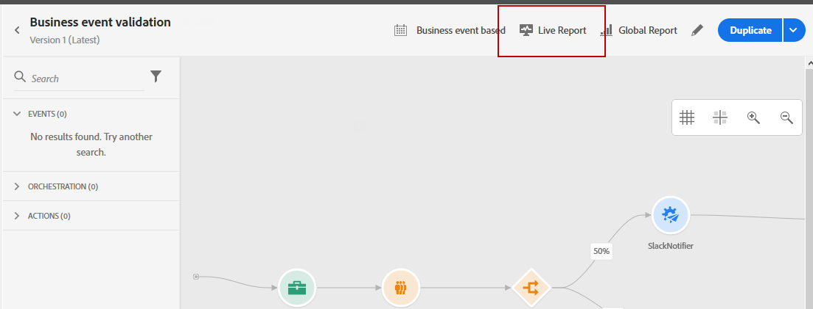
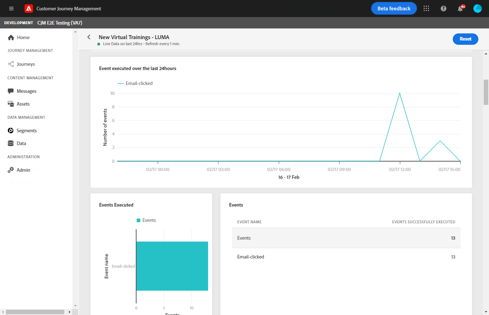
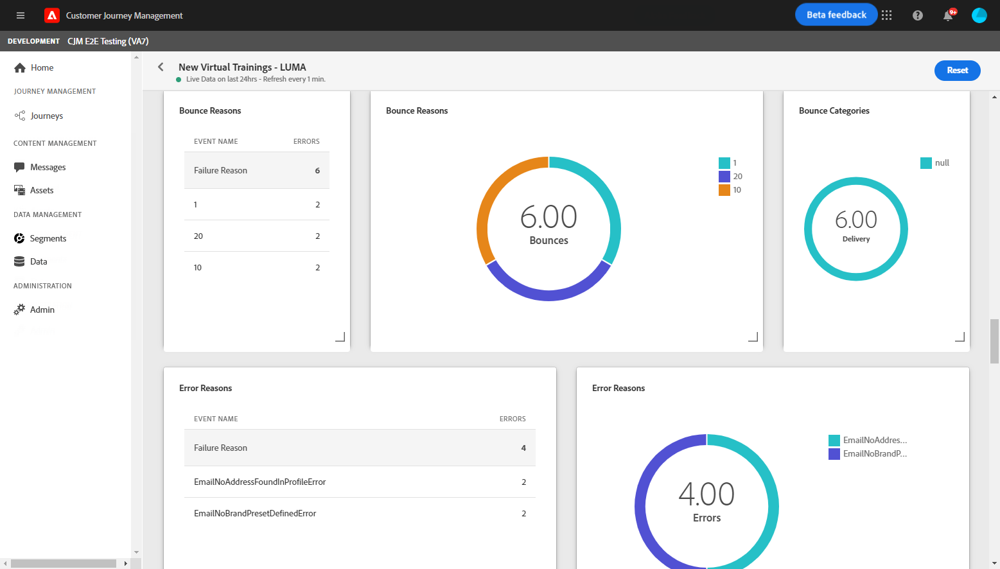

# Reis live rapport {#journey-live-report}

Live-rapport over reizen is rechtstreeks vanaf uw reis toegankelijk met de knop **[!UICONTROL Live report]**.

De pagina **[!UICONTROL Live report]** wordt weergegeven met de volgende tabbladen:

* [Reis](#journey-live)
* [Email](#email-live)
* [Push](#push-live)

De reis **[!UICONTROL Live report]** is verdeeld in verschillende widgets die het succes en de fouten van uw reis in detail beschrijven. Elke widget kan indien nodig worden vergroot of verkleind en verwijderd. Raadpleeg voor meer informatie hierover deze [sectie](live-report.md#modify-dashboard).

## Tabblad Reis {#journey-live}

Vanaf uw reis **[!UICONTROL Live report]**, geeft het **[!UICONTROL Journey]** lusje u een duidelijke mening van de belangrijkste het volgen gegevens over uw reis.

**[!UICONTROL Journey`s performance]** Hiermee kunt u het pad van uw doelprofielen stap voor stap bekijken.

Met de widget **[!UICONTROL Journey`s statistics]** worden de volgende KPI&#39;s weergegeven:

* **[!UICONTROL Entered profiles]**: Het totale aantal personen dat de inreisgebeurtenis van de reis heeft bereikt.

* **[!UICONTROL Exited profiles]**: Het totale aantal personen dat de reis heeft verlaten.

* **[!UICONTROL Failed individual journey]**: Het totale aantal individuele reizen dat niet succesvol is uitgevoerd.

Met de widgets **[!UICONTROL Event executed over the last 24 hours]**, **[!UICONTROL Events executed]** en **[!UICONTROL Events]** kunt u zien welke gebeurtenissen met succes zijn uitgevoerd via een overzichtsnummer, grafiek en tabel.

**[!UICONTROL Action executed over the last 24 hours]** en  **[!UICONTROL Actions executed and errors]** widgets vertegenwoordigen de meest succesvolle actie en fouten die optraden toen uw acties werden geactiveerd. De grafiek, de lijst en de samenvattingsaantallen van de Actie bevatten de gegevens beschikbaar voor acties, zoals:

* **[!UICONTROL Actions successfully executed]**: Het totale aantal acties dat met succes voor een reis wordt uitgevoerd.

* **[!UICONTROL Error in action]**: Het totale aantal fouten dat is opgetreden voor handelingen.

## Het tabblad E-mail {#email-live}

Vanaf uw reis **[!UICONTROL Live report]**, details het **[!UICONTROL Email]** lusje de belangrijkste informatie met betrekking tot de e-mailleveringen die in uw reis worden verzonden.

Voor een gedetailleerd rapport over een specifieke e-maillevering, verwijs naar [E-mail levend rapport](email-live-report.md) sectie.

De widgets **[!UICONTROL Sending Statistics]** en **[!UICONTROL Sending metrics by Email]** geven aan hoe succesvol uw levering is:

* **[!UICONTROL Delivered]**: Het aantal berichten dat is verzonden in verhouding tot het totale aantal verzonden berichten.

* **[!UICONTROL Bounces]**: Totaal van fouten die tijdens levering en automatische terugkeerverwerking met betrekking tot het totale aantal verzonden berichten worden gecumuleerd.

* **[!UICONTROL Errors]**: Het totale aantal fouten dat is opgetreden tijdens een levering waardoor deze niet naar profielen kan worden verzonden.

<!--Hard and bounce - by Email-->

In de grafiek **[!UICONTROL Email summary]** worden de belangrijkste gegevens met betrekking tot uw bericht weergegeven:

* **[!UICONTROL Sent]**: Het totale aantal verzendt voor de levering.

* **[!UICONTROL Delivered]**: Het aantal berichten dat is verzonden in verhouding tot het totale aantal verzonden berichten.

* **[!UICONTROL Bounces]**: Totaal van fouten die tijdens levering en automatische terugkeerverwerking met betrekking tot het totale aantal verzonden berichten worden gecumuleerd.

* **[!UICONTROL Errors]**: Het totale aantal fouten dat is opgetreden tijdens een levering waardoor deze niet naar profielen kan worden verzonden.

* **[!UICONTROL Opens]**: Aantal keren dat een bericht in een levering werd geopend.

* **[!UICONTROL Clicks]**: Het aantal keren dat op een inhoud is geklikt in een levering.

De widgets **[!UICONTROL Bounce Reasons]** en **[!UICONTROL Bounce categories]** bevatten de beschikbare gegevens met betrekking tot berichten die worden teruggestuurd, zoals:

* **[!UICONTROL Hard bounce]**: Het totale aantal permanente fouten, zoals een onjuist e-mailadres. Dit omvat een foutbericht waarin expliciet wordt aangegeven dat het adres ongeldig is, zoals Onbekende gebruiker.

* **[!UICONTROL Soft bounce]**: Het totale aantal tijdelijke fouten, zoals een volledig postvak.

* **[!UICONTROL Ignored]**: Het totale aantal tijdelijke gegevens, zoals Buiten-kantoor, of een technische fout, bijvoorbeeld als het type afzender postmaster is.

Met de grafiek en tabel **[!UICONTROL Error Reasons]** kunt u zien welke fout is opgetreden tijdens de levering.

## Tabblad {#push-live}

Vanaf uw reis **[!UICONTROL Live report]**, details het **[!UICONTROL Push]** lusje de belangrijkste informatie met betrekking tot de duploleveringen die in uw reis worden verzonden.

Raadpleeg de sectie [Live pushmelding](push-live-report.md) voor een gedetailleerd rapport over een specifieke pushaanbieding.

**[!UICONTROL Push notification sending performance]** en  **[!UICONTROL Push notification summary]** de  **[!UICONTROL Sending metrics - by Push]** widgets geven de belangrijkste informatie met betrekking tot uw bericht:

* **[!UICONTROL Sent]**: Het totale aantal verzendt voor de levering.

* **[!UICONTROL Delivered]**: Het aantal berichten dat is verzonden in verhouding tot het totale aantal verzonden berichten.

* **[!UICONTROL Bounces]**: Totaal van fouten die tijdens levering en automatische terugkeerverwerking met betrekking tot het totale aantal verzonden berichten worden gecumuleerd.

* **[!UICONTROL Errors]**: Het totale aantal fouten dat is opgetreden tijdens een levering waardoor deze niet naar profielen kan worden verzonden.

* **[!UICONTROL Opens]**: Aantal keren dat een bericht in een levering werd geopend.

* **[!UICONTROL Actions]**: Het totale aantal acties op de geleverde pushmelding, bijvoorbeeld klikken op de knop of ontslag.

* **[!UICONTROL Engagements]**: Het totale aantal keren dat wordt geopend en de acties voor deze pushmelding, bijvoorbeeld als het profiel de pushmelding heeft geopend of als op een knop is geklikt.

Met de grafiek en tabel **[!UICONTROL Error Reasons]** kunt u zien welke fout is opgetreden tijdens de levering.

De **[!UICONTROL Tracking by platform]**-, **[!UICONTROL Sending by platform]**- en **[!UICONTROL Breakdown by platform]**-grafieken en -tabellen geven het succes van uw pushmelding weer, afhankelijk van het besturingssysteem.

Met de widget **[!UICONTROL Sending statistics - Failed]** kunt u zien hoeveel fouten en stuitingen zich hebben voorgedaan.
