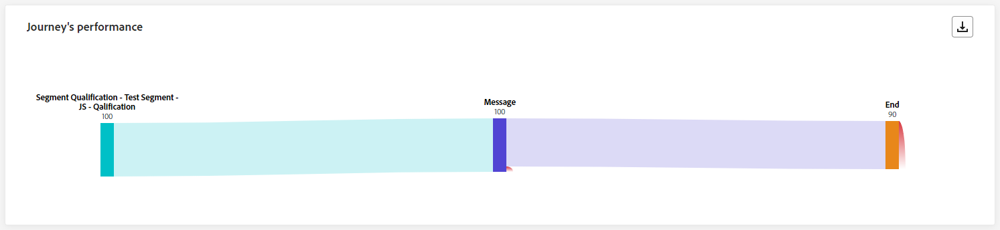
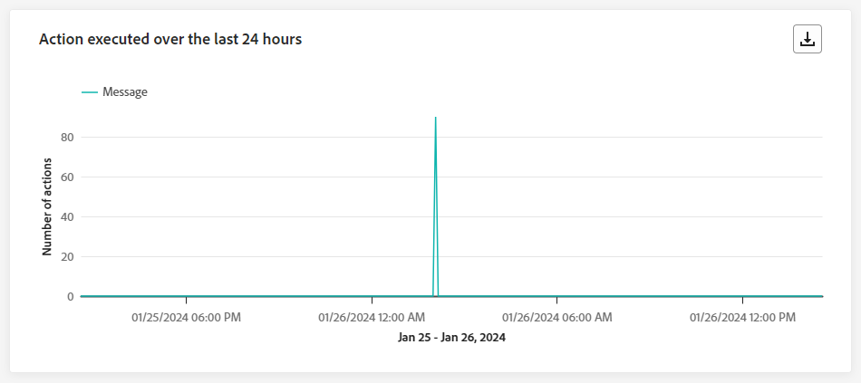
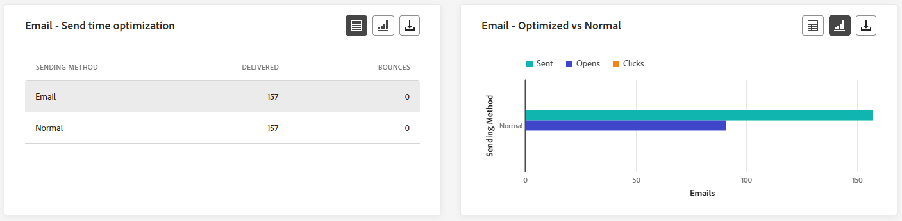

# Journaal live {#journey-live-report}

>[!CONTEXTUALHELP]
>id="ajo_journey_live_report"
>title="Journaal live"
>abstract="Met het Live Journey-rapport kunt u de impact en prestaties van uw reizen in real-time alleen in de afgelopen 24 uur meten en visualiseren. Uw rapport is verdeeld in verschillende widgets die het succes en de fouten van uw reis gedetailleerd beschrijven. Elk rapportdashboard kan worden gewijzigd door widgets te vergroten of te verkleinen of te verwijderen."

Live rapporten, die toegankelijk zijn vanaf het tabblad Laatste 24 uur, geven gebeurtenissen weer die in de afgelopen 24 uur hebben plaatsgevonden, met een minimale tijdsinterval van twee minuten vanaf de gebeurtenis. Ter vergelijking, Customer Journey Analytics rapporteert zich op gebeurtenissen die minstens twee uur geleden hebben plaatsgevonden en gebeurtenissen gedurende een bepaalde tijdsperiode.

Open het rapport Live Journey via het menu [!UICONTROL Journeys] door het menu [!UICONTROL More actions] van uw reis te openen en [!UICONTROL View last 24hrs report] te selecteren.

De pagina &quot;trip **[!UICONTROL Live report]**&quot; wordt weergegeven met de volgende tabbladen:

* [Reis](#journey-live)
* [Email](#email-live)
* [Push](#push-live)
* [Sms](#sms-live)
* [In-app](#in-app-live)

De reis **[!UICONTROL Live report]** is verdeeld in verschillende widgets die het succes en de fouten van uw reis gedetailleerd beschrijven. Elke widget kan indien nodig worden vergroot of verkleind en verwijderd. Voor meer informatie over dit, verwijs naar deze [&#x200B; sectie &#x200B;](live-report.md#modify-dashboard).

Voor een gedetailleerde lijst van elke metrisch beschikbaar in Adobe Journey Optimizer, verwijs naar [&#x200B; deze pagina &#x200B;](live-report.md#live-report).

## Tabblad Reis {#journey-live}

Vanaf uw reis **[!UICONTROL Live report]** geeft het tabblad **[!UICONTROL Journey]** u een duidelijke weergave van de belangrijkste gegevens over uw reis.

### Reisprestaties {#journey-performance}

>[!CONTEXTUALHELP]
>id="ajo_journey_performance_live"
>title="Reisprestaties"
>abstract="Met de widget voor reisprestaties kunt u visueel het pad volgen van uw doelprofielen terwijl deze uw reis in de afgelopen 24 uur doorlopen."

Met **[!UICONTROL Journey Performance]** kunt u het pad van uw doelprofielen stap voor stap bekijken.

Let op: het aantal profielen voor een knooppunt wordt alleen bijgewerkt nadat het profiel het knooppunt heeft voltooid, niet wanneer het knooppunt wordt ingevoerd. Bijvoorbeeld, wacht een profiel op a **&#x200B;**&#x200B;knoop slechts wanneer de gespecificeerde datum wordt bereikt en het profiel de knoop heeft verlaten.

### Reisstatistieken {#journey-statistics}

>[!CONTEXTUALHELP]
>id="ajo_journey_statistics_live"
>title="Reisstatistieken"
>abstract="De belangrijkste indicatoren van de Prestaties van de Statistieken van de Reis (KPIs) dienen als uitvoerig dashboard, dat een diepgaande analyse van essentiële metriek van de laatste 24 uren met betrekking tot uw reis verstrekt."

De **[!UICONTROL Journey Statistics]** Belangrijkste Indicatoren van Prestaties (KPIs) functioneren als volledig omringend dashboard, dat een analyse van essentiële metriek verstrekt verbonden aan uw reis in de afgelopen 24 uren. Dit omvat details zoals het aantal ingevoerde profielen en gevallen van mislukte individuele reizen, die een uitvoerige insight in de doeltreffendheid en het niveau van betrokkenheid van uw reis aanbieden.

+++ Meer informatie over statistische gegevens van Journey

* **[!UICONTROL Entered profiles]**: Het totale aantal personen dat de gebeurtenis entry van de reis heeft bereikt.

* **[!UICONTROL Exited profiles]**: Het totale aantal personen dat de reis heeft verlaten.

* **[!UICONTROL Failed individual journeys]**: Het totale aantal individuele reizen dat niet succesvol is uitgevoerd.
+++

### Actie uitgevoerd in de afgelopen 24 uur {#action-executed}

>[!CONTEXTUALHELP]
>id="ajo_journey_actions_executed_live"
>title="Actie uitgevoerd in de afgelopen 24 uur"
>abstract="De actie die in de afgelopen 24 uur wordt uitgevoerd widget verstrekt een momentopname van recente prestaties, die de doeltreffendheid van uw uitgevoerde acties binnen de afgelopen 24 uren toont."

De **[!UICONTROL Action executed over the last 24 hours]** -widget vertegenwoordigt de meest succesvolle actie die is uitgevoerd toen uw handelingen werden geactiveerd.

+++ Meer informatie over de acties die de afgelopen 24 uur zijn uitgevoerd

* **[!UICONTROL Actions executed]**: Het totale aantal acties dat met succes voor een reis wordt uitgevoerd.

* **[!UICONTROL Error in actions]**: het totale aantal fouten dat is opgetreden voor handelingen.

+++

### Handelingen en fouten {#actions-errors}

>[!CONTEXTUALHELP]
>id="ajo_journey_actions_executed__errors_live"
>title="Handelingen en fouten"
>abstract="In de widget Handelingen en Fouten worden de meest geslaagde handelingen en eventuele fouten weergegeven die zijn opgetreden tijdens het activeren van handelingen in de afgelopen 24 uur. Deze widget biedt een uitgebreid overzicht van zowel geslaagde als ondervonden fouten, en biedt waardevolle inzichten in de recente prestaties van uw acties."

De **[!UICONTROL Actions executed and errors]** -widget vertegenwoordigt de meest succesvolle actie en fouten die zijn opgetreden toen uw acties in de afgelopen 24 uur werden geactiveerd.

+++ Meer informatie over uitgevoerde handelingen en foutenmetriek

* **[!UICONTROL Actions executed]**: Het totale aantal acties dat met succes voor een reis wordt uitgevoerd.

* **[!UICONTROL Error in actions]**: het totale aantal fouten dat is opgetreden voor handelingen.

+++

### Foutredenen voor handelingen {#actions-error-reasons}

>[!CONTEXTUALHELP]
>id="ajo_journey_actions_errors_live"
>title="Foutredenen voor handelingen"
>abstract="De tabel met oorzaken van fouten in Handelingen en de grafiek geven een uitgebreid overzicht van de fouten die zijn aangetroffen tijdens de uitvoering van de handelingen. Zo krijgt u een uitgebreid overzicht van de problemen die zich mogelijk in de afgelopen 24 uur hebben voorgedaan."

De tabel en grafiek van **[!UICONTROL Action error reasons]** bieden een uitgebreid overzicht van de fouten die zijn opgetreden tijdens het uitvoeren van de handelingen in de afgelopen 24 uur.

### Fouttype per actie {#error-type-actions}

>[!CONTEXTUALHELP]
>id="ajo_journey_actions_error_type_live"
>title="Fouttype per actie"
>abstract="Het type van Fout door actietabel en de grafiek verstrekken een grondig overzicht van fouten die tijdens elke uitvoering van uw acties binnen de laatste 24 uren voorkwamen."

De tabel en grafiek van **[!UICONTROL Error type by actions]** bieden een uitgebreid overzicht van de fouten die zijn opgetreden bij elke uitvoering van uw acties in de afgelopen 24 uur.

### Gebeurtenis uitgevoerd in de afgelopen 24 uur {#event-executed-24hours}

>[!CONTEXTUALHELP]
>id="ajo_journey_event_24hours_live"
>title="Gebeurtenis uitgevoerd in de afgelopen 24 uur"
>abstract="Met de gebeurtenis die in de afgelopen 24 uur is uitgevoerd, kunt u bepalen welke gebeurtenissen in de afgelopen 24 uur zijn uitgevoerd. "

Met de widget **[!UICONTROL Event executed over the last 24 hours]** kunt u bepalen welke gebeurtenissen in de afgelopen 24 uur zijn uitgevoerd.

### Gebeurtenissen {#events}

>[!CONTEXTUALHELP]
>id="ajo_journey_events_live"
>title="Gebeurtenissen"
>abstract="De widget Gebeurtenissen geeft een uitgebreide weergave van welke gebeurtenissen zijn uitgevoerd en biedt een overzichtsnummer, grafiek en tabel voor gedetailleerde inzichten van de afgelopen 24 uur."

Met de widget **[!UICONTROL Events]** kunt u zien welke van uw gebeurtenissen is uitgevoerd via een overzichtsnummer, een grafiek en een tabel.

### Gebeurtenissen naar oorsprong {#events-origin}

>[!CONTEXTUALHELP]
>id="ajo_journey_events_origin_live"
>title="Gebeurtenissen naar oorsprong"
>abstract="In de tabel Events by Origin en in de grafieken ziet u hoe uw gebeurtenissen in de afgelopen 24 uur zijn ontvangen. Met deze visuele voorstellingen kunt u nauwkeurig bepalen welke gebeurtenissen daadwerkelijk zijn ontvangen. Zo hebt u waardevolle inzichten in de prestaties en de impact van elke gebeurtenis op uw reis."

De **[!UICONTROL Events by origin]** -tabel en -grafieken bieden een gedetailleerd perspectief op de succesvolle ontvangst van uw gebeurtenissen in de afgelopen 24 uur. Via deze visuele voorstellingen kunt u precies zien welke van uw gebeurtenissen effectief zijn ontvangen en kunt u waardevolle inzichten bieden in de prestaties en de impact van individuele gebeurtenissen op uw reis.

## Tabblad E-mail {#email-live}

Vanaf uw reis **[!UICONTROL Live report]** geeft het tabblad **[!UICONTROL Email]** de belangrijkste informatie weer met betrekking tot de e-mails die tijdens uw reis worden verzonden.

### E-mail - Prestaties verzenden {#email-sending-performance}

>[!CONTEXTUALHELP]
>id="ajo_journey_email_sending_performance_live"
>title="E-mail - Prestaties verzenden"
>abstract="De grafiek E-mail - Verzendstatistieken vat essentiële gegevens over uw e-mail, zoals Gericht of Geleverd van de laatste 24 uur samen."

De grafiek van **[!UICONTROL Email - Sending performance]** biedt een uitgebreide weergave van gegevens die betrekking hebben op verzonden e-mails tijdens uw reis en biedt inzicht in belangrijke metriek, zoals geleverde gegevens en stuitingen die zich in de afgelopen 24 uur hebben voorgedaan. Dit maakt een gedetailleerde analyse van het verzendingsproces van e-mail mogelijk en biedt waardevolle informatie over de efficiëntie en prestaties van uw reizen.

+++ Meer informatie over e-mail - Prestatiegegevens verzenden

* **[!UICONTROL Delivered]**: aantal e-mailberichten verzonden.

* **[!UICONTROL Bounces]**: het totaal aan fouten dat tijdens het verzendproces is gecumuleerd en de automatische retourverwerking.

* **[!UICONTROL Errors]**: het totale aantal fouten dat is opgetreden tijdens het verzendproces waardoor het niet naar profielen kan worden verzonden.

* **[!UICONTROL Retries]**: Aantal e-mails in de wachtrij voor nieuwe pogingen.

+++

### E-mail - Statistieken {#email-stat}

>[!CONTEXTUALHELP]
>id="ajo_journey_email_statistics_live"
>title="E-mail - Statistieken"
>abstract="De tabel E-mail - Statistieken bevat gegevens over de profielactiviteiten voor uw e-mail van de laatste 24 uur."

De tabel **[!UICONTROL Email - Statistics]** bevat een uitgebreid overzicht van de belangrijkste gegevens over e-mails tijdens uw reizen in de afgelopen 24 uur. Het bevat belangrijke metriek zoals de grootte van het beoogde publiek en het aantal e-mails dat succesvol is afgeleverd. Het biedt waardevolle inzichten in de effectiviteit en het bereik van uw e-mails en reizen.

+++ Meer informatie over cijfers voor statistieken over verzendstatistieken per e-mail

* **[!UICONTROL Targeted]**: Aantal profielen dat in aanmerking kwam voor het publiek voordat uitsluitingen, onderdrukkingen of toestemmingsverwijderingen werden toegepast. Bij ritten waarbij terugkeer is ingeschakeld, kan een profiel meerdere keren worden aangewezen.

* **[!UICONTROL Excluded]**: aantal profielen dat door Adobe Journey Optimizer is uitgesloten.

* **[!UICONTROL Sent]**: Het totale aantal verzonden e-mails.

* **[!UICONTROL Delivered]**: Aantal verzonden e-mailberichten in verhouding tot het totale aantal verzonden berichten.

* **[!UICONTROL Bounces]**: het totaal aan fouten dat tijdens het verzendproces is gecumuleerd en de automatische retourverwerking in verhouding tot het totale aantal verzonden berichten.

* **[!UICONTROL Errors]**: het totale aantal fouten dat is opgetreden tijdens het verzendproces waardoor het niet naar profielen kan worden verzonden.

* **[!UICONTROL Opens]**: Het aantal keren dat je e-mails zijn geopend.

* **[!UICONTROL Clicks]**: Het aantal keer dat er op de inhoud in uw e-mails is geklikt.

* **[!UICONTROL Unsubscribe]**: Het aantal klikken op de koppeling voor het opzeggen van abonnementen.

* **[!UICONTROL Spam complaints]**: Het aantal keren dat een bericht is gedeclareerd als spam of junk.

* **[!UICONTROL Retries]**: Aantal e-mails in de wachtrij voor nieuwe pogingen.

+++

### E-mail - Prestaties op datum {#email-perf-date}

>[!CONTEXTUALHELP]
>id="ajo_journey_email_performance_bydate_live"
>title="E-mail - Prestaties op datum"
>abstract="De grafiek E-mail - Prestaties door datum toont uitvoerige gegevens van de laatste 24 uren betreffende verzonden e-mail, die inzicht in zeer belangrijke metriek zoals geleverde en staren, die voor een gedetailleerde analyse van het e-mailverzendingsproces toestaan."

De widget **[!UICONTROL Email - Performance by date]** biedt een gedetailleerd overzicht van belangrijke informatie over uw e-mails, in een grafiek weergegeven, die inzicht biedt in de prestatietrends in de afgelopen 24 uur.

+++ Meer informatie over e-mail - Prestaties per datum

* **[!UICONTROL Sent]**: Het totale aantal verzonden e-mails.

* **[!UICONTROL Delivered]**: aantal e-mailberichten verzonden.

* **[!UICONTROL Bounces]**: het totaal aan fouten dat tijdens het verzendproces is gecumuleerd en de automatische retourverwerking.

* **[!UICONTROL Errors]**: het totale aantal fouten dat is opgetreden tijdens het verzendproces waardoor het niet naar profielen kan worden verzonden.

* **[!UICONTROL Opens]**: Het aantal keren dat je e-mails zijn geopend.

* **[!UICONTROL Clicks]**: Het aantal keer dat er op de inhoud in uw e-mails is geklikt.

* **[!UICONTROL Unsubscribe]**: Het aantal klikken op de koppeling voor het opzeggen van abonnementen.

* **[!UICONTROL Spam complaints]**: Het aantal keren dat een bericht is gedeclareerd als spam of junk.

+++

### E-mail - rubrieken en redenen voor stuiteren {#email-bounce-categories}

>[!CONTEXTUALHELP]
>id="ajo_journey_email_bounces_live"
>title="E-mail - rubrieken en redenen voor stuiteren"
>abstract="XX"

De widgets **[!UICONTROL Bounce Reasons]** en **[!UICONTROL Bounce categories]** compileren de beschikbare gegevens met betrekking tot verzonden berichten, die gedetailleerde inzichten verstrekken in de specifieke redenen en categorieën achter e-mailschommelingen in de afgelopen 24 uur.

Voor meer informatie over grenzen, verwijs naar de [&#x200B; lijst van de Onderdrukking &#x200B;](../reports/suppression-list.md) pagina.

+++ Meer informatie over e-mail - Bounce-rubrieken en redencijfers

* **[!UICONTROL Hard bounce]**: Het totale aantal permanente fouten, zoals een onjuist e-mailadres. Dit omvat een foutbericht waarin expliciet wordt aangegeven dat het adres ongeldig is, zoals Onbekende gebruiker.

* **[!UICONTROL Soft bounce]**: Het totale aantal tijdelijke fouten, zoals een volledig Postvak IN.

* **[!UICONTROL Ignored]**: Het totale aantal tijdelijke bestanden, zoals Buiten-kantoor, of een technische fout, bijvoorbeeld als het type afzender postmaster is.

+++

### E-mail - Foutredenen {#email-error-reasons}

>[!CONTEXTUALHELP]
>id="ajo_journey_email_errors_live"
>title="E-mail - Foutredenen"
>abstract="Met de grafieken en de tabel met redenen voor e-mail - Fout kunt u de specifieke fouten identificeren die tijdens het verzendingsproces in de afgelopen 24 uur zijn opgetreden."

De grafieken en tabel van **[!UICONTROL Error Reasons]** bieden zichtbaarheid in de specifieke fouten die tijdens het verzendingsproces van de afgelopen 24 uur zijn opgetreden. Ze bieden waardevolle informatie over de aard en het optreden van fouten.

### E-mail - Uitgesloten redenen {#email-excluded}

>[!CONTEXTUALHELP]
>id="ajo_journey_email_excluded_live"
>title="E-mail - Uitgesloten redenen"
>abstract="De grafieken en tabel met uitgesloten redenen illustreren de verschillende factoren die hebben geleid tot gebruikersprofielen die zijn uitgesloten van het doelpubliek en die het bericht in de afgelopen 24 uur niet hebben ontvangen."

De grafieken en tabel van **[!UICONTROL Excluded Reasons]** bevatten een uitgebreide weergave van de verschillende factoren die ertoe hebben geleid dat gebruikersprofielen zijn uitgesloten van het doelpubliek, waardoor het bericht in de afgelopen 24 uur niet is ontvangen.

Verwijs naar [&#x200B; deze pagina &#x200B;](exclusion-list.md) voor de uitvoerige lijst van uitsluitingsredenen.

### E-mail - Beste ontvangende domein {#email-best-recipient}

>[!CONTEXTUALHELP]
>id="ajo_journey_email_best_recipient_live"
>title="E-mail - Beste ontvangende domein"
>abstract="De grafiek en de tabel met het meest begunstigde domein (E-mail - Beste ontvanger) geven een gedetailleerde uitsplitsing van de domeinen die ontvangers het vaakst gebruiken om e-mail te openen. Deze tabel biedt waardevolle inzichten in het gedrag van ontvangers vanaf de laatste 24 uur."

De grafiek en tabel van **[!UICONTROL Email - Best recipient domain]** bevatten een gedetailleerde uitsplitsing van de domeinen die in profielen het vaakst worden gebruikt om uw e-mails in de afgelopen 24 uur te openen. Dit biedt waardevolle inzichten in profielgedrag, waardoor u beter inzicht krijgt in voorkeursplatforms.

### E-mailaanbiedingen {#email-offers}

>[!CONTEXTUALHELP]
>id="ajo_journey_email_offers_live"
>title="E-mail - voorstellen"
>abstract="De statistische en gedetailleerde statistische widgets van de Aanbiedingen verstrekken uitvoerige inzichten in de prestaties van uw aanbiedingen in de afgelopen 24 uren, die een gedetailleerde analyse van hun effect in tijd aanbieden en gedetailleerde statistieken voor een meer diepgaand begrip presenteren."

>[!NOTE]
>
>De widgets en cijfers voor aanbiedingen zijn alleen beschikbaar als een beslissing in een e-mail is ingevoegd. Voor meer informatie over het Beheer van het Besluit, verwijs naar deze [&#x200B; pagina &#x200B;](../offers/get-started/starting-offer-decisioning.md).

De **[!UICONTROL Offers statistic]** - en **[!UICONTROL Offers statistics over time]** -widgets meten het succes van uw aanbieding en de invloed op uw doelgroep. Het detailleert de belangrijkste informatie met betrekking tot uw bericht met KPIs.

+++ Meer informatie over e-mail - Metriek van aanbiedingen

* **[!UICONTROL Offer sent]**: Het totale aantal verzendingen voor de aanbieding.

* **[!UICONTROL Offer impression]**: Het aantal keren dat het voorstel in uw e-mail is geopend.

* **[!UICONTROL Offer clicks]**: Het aantal keren dat er op een voorstel is geklikt in uw e-mails.

+++

### E-mail - Optimalisatie {#email-sto}

>[!CONTEXTUALHELP]
>id="ajo_journey_email_optimization_live"
>title="E-mail - Optimalisatie"
>abstract="De optimalisatie van de verzendtijd en de geoptimaliseerde versus niet-geoptimaliseerde widgets bieden gedetailleerde informatie over uw berichten van de afgelopen 24 uur, waarbij wordt aangegeven of deze zijn geoptimaliseerd of niet."

>[!NOTE]
>
>De widgets **[!UICONTROL Send time optimization]** en **[!UICONTROL Optimized vs non optimized]** zijn alleen beschikbaar als de optie Send-Time Optimization is geactiveerd voor de levering. Voor meer informatie over Send-Time Optimalisering, verwijs naar [&#x200B; deze pagina &#x200B;](../building-journeys/send-time-optimization.md).

De widgets **[!UICONTROL Send time optimization]** en **[!UICONTROL Optimized vs non optimized]** geven een gedetailleerd overzicht van het succes van uw e-mails, afhankelijk van de verzendmethode: geoptimaliseerd of normaal.

+++ Meer informatie over optimalisatie van verzendtijd en geoptimaliseerde versus niet-geoptimaliseerde meetgegevens

* **[!UICONTROL Delivered]**: Het aantal berichten dat is verzonden in verhouding tot het totale aantal verzonden berichten.
* **[!UICONTROL Bounces]**: het totaal aan fouten dat tijdens het verzendproces is gecumuleerd en de automatische retourverwerking in verhouding tot het totale aantal verzonden berichten.

* **[!UICONTROL Sent]**: Het totale aantal e-mails dat is verzonden voor de reis.

* **[!UICONTROL Opens]**: Het aantal keren dat uw e-mails zijn geopend tijdens de reis.

* **[!UICONTROL Clicks]**: Het aantal keer dat er op de inhoud in uw e-mails is geklikt.

+++

## Tabblad Pushmelding {#push-live}

Vanaf uw reis **[!UICONTROL Live report]** geeft het tabblad **[!UICONTROL Push notification]** de belangrijkste informatie weer met betrekking tot de pushmelding die tijdens uw reis wordt verzonden.

### Pushmelding - Prestaties verzenden {#push-sending-performance}

>[!CONTEXTUALHELP]
>id="ajo_journey_push_sending_performance_live"
>title="Pushmelding - Prestaties verzenden"
>abstract="De grafiek van de Prestaties bij verzenden van pushberichten geeft een overzicht van de belangrijkste gegevens over uw pushmelding, zoals Fouten of Geleverde berichten van de afgelopen 24 uur."

De grafiek van **[!UICONTROL Push notification sending performance]** biedt een uitgebreid overzicht van gegevens met betrekking tot pushmeldingen die in de afgelopen 24 uur zijn verzonden. Het biedt inzicht in essentiële metriek zoals geleverde en stommelingen, waardoor het verzendingsproces van pushberichten grondig kan worden onderzocht.

+++ Meer informatie over pushmeldingen - Prestatiegegevens verzenden

* **[!UICONTROL Delivered]**: Aantal berichten verzonden.

* **[!UICONTROL Bounces]**: het totaal aan fouten dat tijdens het verzendproces is gecumuleerd en de automatische retourverwerking.

* **[!UICONTROL Errors]**: het totale aantal fouten dat is opgetreden tijdens het verzendproces waardoor het niet naar profielen kan worden verzonden.

+++

### Pushmeldingen - Statistieken {#push-statistics}

>[!CONTEXTUALHELP]
>id="ajo_journey_push_statistics_live"
>title="Pushmeldingen - Statistieken"
>abstract="De lijst van de Statistieken van de Duw verstrekt gegevens over ontvankelijke activiteit voor uw dupmelding van de laatste 24 uren."

De tabel van **[!UICONTROL Push notification - Statistics]** bevat een beknopt overzicht van de belangrijkste gegevens met betrekking tot uw pushberichten, waaronder belangrijke meetgegevens zoals het aantal gerichte berichten en het aantal berichten dat succesvol is bezorgd in de afgelopen 24 uur.

+++ Meer informatie over pushmeldingen - statistieken

* **[!UICONTROL Targeted]**: Het aantal profielen waarvoor een actie wordt uitgevoerd, zoals het verzenden van e-mail of sms.

* **[!UICONTROL Excluded]**: aantal profielen dat door Adobe Journey Optimizer is uitgesloten.

* **[!UICONTROL Sent]**: Het totale aantal verzonden pushberichten.

* **[!UICONTROL Delivered]**: Aantal pushmeldingen verzonden.

* **[!UICONTROL Bounces]**: het totaal aan fouten dat tijdens het verzendproces is gecumuleerd en de automatische retourverwerking.

* **[!UICONTROL Errors]**: het totale aantal fouten dat is opgetreden tijdens het verzendproces waardoor het niet naar profielen kan worden verzonden.

* **[!UICONTROL Opens]**: Het aantal keren dat uw pushmelding is geopend.
+++

### Pushmelding - Onderverdeling per platform {#push-breakdown}

>[!CONTEXTUALHELP]
>id="ajo_journey_push_breakdown_live"
>title="Pushmelding - Onderverdeling per platform"
>abstract="De grafieken en tabel in de indeling Uitsplitsing naar platform geven een overzicht van het succes van uw pushberichten in de afgelopen 24 uur, afhankelijk van het besturingssysteem van de ontvanger."

De grafiek en tabel van **[!UICONTROL Push notification - Breakdown by platform]** bieden een gedetailleerde analyse van het succes van uw pushberichten en bieden inzichten op basis van het besturingssysteem van uw profiel. Deze ineenstorting verbetert uw inzicht in hoe goed uw pushberichten op verschillende platforms presteren.

### Pushmelding - Samenvatting verzenden {#push-sending-summary}

>[!CONTEXTUALHELP]
>id="ajo_journey_push_sending_summary_live"
>title="Pushmelding - Samenvatting verzenden"
>abstract="In de grafiek Samenvatting van pushmeldingen worden de gegevens weergegeven die beschikbaar zijn voor verzonden pushberichten van de laatste 24 uur."

De grafiek van **[!UICONTROL Push notification summary]** biedt een dynamische vertegenwoordiging, die een analyse van uw activiteit van pushberichten binnen de laatste 24 uren toont. Deze grafische weergave biedt een uitgebreide uitsplitsing van verzonden pushberichten.

+++ Meer informatie over pushmeldingen - Samenvattingscijfers verzenden

* **[!UICONTROL Sent]**: Het totale aantal verzonden pushberichten.

* **[!UICONTROL Delivered]**: Aantal pushmeldingen verzonden.

* **[!UICONTROL Bounces]**: het totaal aan fouten dat tijdens het verzendproces is gecumuleerd en de automatische retourverwerking.

* **[!UICONTROL Errors]**: het totale aantal fouten dat is opgetreden tijdens het verzendproces waardoor het niet naar profielen kan worden verzonden.

* **[!UICONTROL Opens]**: Het aantal keren dat uw pushberichten zijn geopend.

* **[!UICONTROL Clicks]**: Het aantal keer dat er op de inhoud is geklikt in uw pushberichten.

+++

### Pushmelding - Foutredenen {#push-error}

>[!CONTEXTUALHELP]
>id="ajo_journey_push_error_reasons_live"
>title="Pushmelding - Foutredenen"
>abstract="Met de grafieken en de tabel met oorzaken van fouten kunt u de specifieke fouten identificeren die zich de laatste 24 uur tijdens het verzendproces hebben voorgedaan."

De **[!UICONTROL Error Reasons]** -tabel en -grafieken bieden u de mogelijkheid om de specifieke fouten te identificeren die zijn opgetreden tijdens het verzenden van uw pushberichten en bieden gedetailleerde inzichten in problemen die zich de afgelopen 24 uur hebben voorgedaan.

### Pushmelding - Uitgesloten redenen {#push-excluded}

>[!CONTEXTUALHELP]
>id="ajo_journey_push_excluded_reasons_live"
>title="Pushmelding - Uitgesloten redenen"
>abstract="De grafieken en tabel met uitgesloten redenen illustreren de verschillende factoren die hebben geleid tot gebruikersprofielen die zijn uitgesloten van het doelpubliek en die het bericht in de afgelopen 24 uur niet hebben ontvangen."

In de grafieken en tabel van **[!UICONTROL Excluded Reasons]** ziet u de verschillende redenen waarom gebruikersprofielen, die zijn uitgesloten van de doelprofielen, uw pushberichten niet binnen 24 uur konden ontvangen.

Verwijs naar [&#x200B; deze pagina &#x200B;](exclusion-list.md) voor de uitvoerige lijst van uitsluitingsredenen.

## Tabblad SMS {#sms-live}

### SMS - Statistieken {#sms-statistics}

>[!CONTEXTUALHELP]
>id="ajo_journey_sms_statistics_live"
>title="SMS - Statistieken"
>abstract="De SMS die Statistieken verzendt vat essentiële gegevens over uw SMS berichten zoals Gerichte of Geleide berichten van de laatste 24 uren samen."

De tabel **[!UICONTROL SMS - Statistics]** bevat een beknopte samenvatting van essentiële gegevens met betrekking tot uw SMS-berichten, die belangrijke metriek omvat, zoals het aantal gerichte berichten en het aantal berichten dat succesvol is bezorgd vanaf de laatste 24 uur.

+++ Meer informatie over SMS - Statistische gegevens

* **[!UICONTROL Targeted]**: Aantal gebruikersprofielen dat als doelprofielen wordt gekwalificeerd.

* **[!UICONTROL Excluded]**: Aantal gebruikersprofielen dat is uitgesloten van de doelprofielen en dat het bericht niet heeft ontvangen.

* **[!UICONTROL Sent]**: Het totale aantal verzonden SMS-berichten.

* **[!UICONTROL Clicks]**: Het aantal keer dat er op de inhoud is geklikt in uw SMS-berichten.

* **[!UICONTROL Bounces]**: het totaal aan fouten dat tijdens het verzendproces is gecumuleerd, het verzendproces en de automatische retourverwerking.

* **[!UICONTROL Errors]**: het totale aantal fouten dat is opgetreden tijdens het verzendproces waardoor het niet naar profielen kan worden verzonden.

+++

### SMS - Prestaties op datum {#sms-performance}

>[!CONTEXTUALHELP]
>id="ajo_journey_sms_performance_live"
>title="SMS - Prestaties op datum"
>abstract="De widget Prestaties per datum van SMS biedt via een grafische weergave belangrijke informatie van de laatste 24 uur over uw berichten."

De **[!UICONTROL SMS - Performance by date]** -widget biedt een gedetailleerd overzicht van belangrijke informatie met betrekking tot uw berichten, in een grafiek weergegeven, die inzicht biedt in de prestatietrends in de afgelopen 24 uur.

+++ Meer informatie over SMS - Prestaties op basis van datum

* **[!UICONTROL Sent]**: Het totale aantal verzonden SMS-berichten.

* **[!UICONTROL Bounces]**: het totaal aan fouten dat tijdens het verzendproces is gecumuleerd en de automatische retourverwerking.

* **[!UICONTROL Errors]**: het totale aantal fouten dat is opgetreden tijdens het verzendproces waardoor het niet naar profielen kan worden verzonden.

+++

### SMS - Bounges redenen {#sms-bounces}

>[!CONTEXTUALHELP]
>id="ajo_journey_sms_bounces_live"
>title="SMS - Bounges redenen"
>abstract="De grafieken en de tabel met Bounces Reasons bevatten de gegevens die beschikbaar zijn in de laatste 24 uur met betrekking tot berichten die worden teruggestuurd."

De grafieken en tabel van **[!UICONTROL SMS - Bounces reasons]** bieden een uitgebreid overzicht van gegevens met betrekking tot verzonden SMS-berichten, waarmee u in de afgelopen 24 uur waardevolle inzichten kunt opmaken van de specifieke redenen achter sms-berichten.

### SMS - Redenen voor fouten {#sms-error}

>[!CONTEXTUALHELP]
>id="ajo_journey_sms_error_live"
>title="SMS - Redenen voor fouten"
>abstract="Met SMS - de grafieken en tabel met redenen voor fouten kunt u de specifieke fouten identificeren die zich de laatste 24 uur tijdens het verzendproces hebben voorgedaan."

Met de grafieken en tabel van **[!UICONTROL SMS - Error Reasons]** kunt u de specifieke fouten identificeren die zijn opgetreden tijdens het verzenden van uw SMS-berichten. Zo kunt u een grondige analyse maken van alle problemen die zich in de afgelopen 24 uur hebben voorgedaan.

### SMS - Uitgesloten redenen {#sms-excluded}

>[!CONTEXTUALHELP]
>id="ajo_journey_sms_excluded_live"
>title="SMS - Uitgesloten redenen"
>abstract="De grafieken en tabel met uitgesloten redenen illustreren de verschillende factoren die hebben geleid tot gebruikersprofielen die zijn uitgesloten van het doelpubliek en die het bericht in de afgelopen 24 uur niet hebben ontvangen."

In de grafieken en tabel van **[!UICONTROL SMS - Excluded Reasons]** worden visueel de verschillende factoren weergegeven die ertoe hebben geleid dat gebruikersprofielen zijn uitgesloten van het doelpubliek, zodat gebruikers uw SMS-berichten niet kunnen ontvangen.

Verwijs naar [&#x200B; deze pagina &#x200B;](exclusion-list.md) voor de uitvoerige lijst van uitsluitingsredenen.

<!--
### SMS - Clicks by links {#sms-clicks}

The **[!UICONTROL SMS - Clicks by links]** widget offers essential insights into your visitors' engagement with the URLs included in your messages, providing valuable information about which links attract the most interaction within the last 24 hours.
-->

## Tabblad In-app {#in-app-live}

### Prestaties in de app {#inapp-performance}

>[!CONTEXTUALHELP]
>id="ajo_journey_inapp_performance_live"
>title="Prestaties in de app"
>abstract="De prestatie-KPI&#39;s in de app bieden essentiële inzichten in de betrokkenheid van uw bezoekers bij In-app-berichten in de afgelopen 24 uur.&#39;"

De KPI&#39;s van **[!UICONTROL In-app performance]** bieden essentiële inzichten in de betrokkenheid van uw profielen bij In-app-berichten in de afgelopen 24 uur. Deze bieden essentiële gegevens om de effectiviteit en impact van de In-app-berichten die tijdens uw reis worden geleverd, te beoordelen.

+++ Meer informatie over in-app - Prestatiewaarden

* **[!UICONTROL Impressions]**: totaal aantal In-app-berichten dat aan alle gebruikers wordt geleverd.

  >[!NOTE]
  >
  >Om ervoor te zorgen dat een indruk wordt geteld, moet de gebruiker aan twee criteria voldoen:
  >* Kwalificatie binnen de In-app ervaring, die door de specifieke In-app activiteit tijdens hun reis wordt bereikt.
  >* Voldoen aan de voorwaarden die zijn opgegeven in de triggerregels.
  > 
  >Als gevolg van het tweede criterium kunnen er aanzienlijke verschillen zijn tussen het aantal doelprofielen en het aantal unieke indrukkingen.

* **[!UICONTROL Interactions]**: totaal aantal contracten met uw In-app-bericht. Dit omvat alle handelingen die de gebruikers hebben uitgevoerd, zoals klikken, ontslag of andere interactie.

+++

### Overzicht in de app {#inapp-summary}

>[!CONTEXTUALHELP]
>id="ajo_journey_inapp_summary_live"
>title="Overzicht in de app"
>abstract="De overzichtsgrafiek in de app illustreert de voortgang van uw impressies en interacties in de app in de afgelopen 24 uur."

De grafiek van **[!UICONTROL In-app summary]** illustreert de voortgang van uw in-app-indrukkingen en interacties in de afgelopen 24 uur en geeft een uitgebreid overzicht van de prestaties van uw In-app-berichten.

+++ Meer informatie over overzichtsgegevens in de app

* **[!UICONTROL Impressions]**: totaal aantal In-app-berichten dat aan alle gebruikers wordt geleverd.

  >[!NOTE]
  >
  >Om ervoor te zorgen dat een indruk wordt geteld, moet de gebruiker aan twee criteria voldoen:
  >* Kwalificatie binnen de In-app ervaring, die door de specifieke In-app activiteit tijdens hun reis wordt bereikt.
  >* Voldoen aan de voorwaarden die zijn opgegeven in de triggerregels.
  > 
  >Als gevolg van het tweede criterium kunnen er aanzienlijke verschillen zijn tussen het aantal doelprofielen en het aantal unieke indrukkingen.

* **[!UICONTROL Interactions]**: totaal aantal contracten met uw In-app-bericht. Dit omvat alle handelingen die de gebruikers hebben uitgevoerd, zoals klikken, ontslag of andere interactie.

+++

### Interacties per type {#interactions-type}

>[!CONTEXTUALHELP]
>id="ajo_journey_inapp_interactions_live"
>title="Interacties per type"
>abstract="De interacties per type grafieken en de lijstdetails hoe de gebruikers met uw in-app bericht in wisselwerking stonden door om het even welke klik te volgen, te ontslaan, of interactie van de laatste 24 uren."

In de **[!UICONTROL Interactions by type]** -grafieken en -tabellen wordt aangegeven hoe gebruikers met uw In-app-bericht hebben gewerkt door muisklikken, verwijderen of interactie bij te houden.
