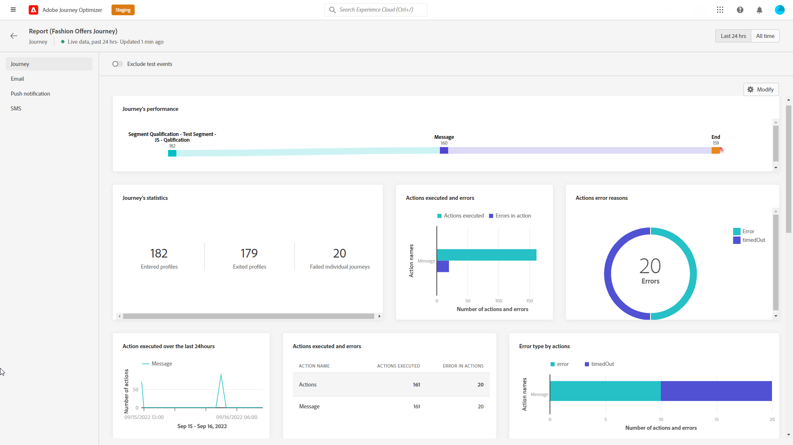

# Journaal live {#journey-live-report}

>[!CONTEXTUALHELP]
>id="ajo_journey_live_report"
>title="Journaal live"
>abstract="Met het Live Journey-rapport kunt u de impact en prestaties van uw reizen in real-time alleen in de afgelopen 24 uur meten en visualiseren. Uw rapport is verdeeld in verschillende widgets die het succes en de fouten van uw reis gedetailleerd beschrijven. Elk rapportdashboard kan worden gewijzigd door widgets te vergroten of te verkleinen of te verwijderen."

Reis live rapport kan direct vanaf je reis worden geopend met de **[!UICONTROL View report]** knop.

De reis **[!UICONTROL Live report]** Deze pagina wordt weergegeven met de volgende tabbladen:

* [Reis](#journey-live)
* [Email](#email-live)
* [Push](#push-live)
* [Sms](#sms-live)

De reis **[!UICONTROL Live report]** is verdeeld in verschillende widgets waarin het succes en de fouten van uw reis worden beschreven. Elke widget kan indien nodig worden vergroot of verkleind en verwijderd. Raadpleeg voor meer informatie hierover [sectie](live-report.md#modify-dashboard).

Voor een gedetailleerde lijst van elke metrisch beschikbaar in Adobe Journey Optimizer, verwijs naar [deze pagina](live-report.md#list-of-components-live).

## Tabblad Reis {#journey-live}

Vanaf uw reis **[!UICONTROL Live report]** de **[!UICONTROL Journey]** geeft u een duidelijk overzicht van de belangrijkste volgende gegevens over uw reis.

+++Leer meer op de verschillende metriek en widgets beschikbaar voor het rapport van de Reis.

**[!UICONTROL Journey Performance]** Hiermee kunt u het pad van uw doelprofielen stap voor stap bekijken.

De **[!UICONTROL Journey Statistics]** widget geeft de volgende KPI&#39;s weer:

* **[!UICONTROL Entered profiles]**: Het totale aantal personen dat de inreisgebeurtenis van de reis heeft bereikt.

* **[!UICONTROL Exited profiles]**: Het totale aantal personen dat de reis heeft verlaten.

* **[!UICONTROL Failed individual journeys]**: Het totale aantal individuele reizen dat niet succesvol is uitgevoerd.

De **[!UICONTROL Event executed over the last 24 hours]** en **[!UICONTROL Events]** Met widgets kunt u zien welke van uw gebeurtenissen met succes zijn uitgevoerd via een overzichtsnummer, grafiek en tabel.

De **[!UICONTROL Action executed over the last 24 hours]** en **[!UICONTROL Actions executed and errors]** widgets zijn de meest succesvolle actie en fouten die zijn opgetreden toen uw acties werden geactiveerd. De grafiek, de lijst en de samenvattingsaantallen van de Actie bevatten de gegevens beschikbaar voor acties, zoals:

* **[!UICONTROL Actions executed]**: Het totale aantal acties dat met succes voor een reis wordt uitgevoerd.

* **[!UICONTROL Error in actions]**: Het totale aantal fouten dat is opgetreden voor handelingen.
+++

## Tabblad E-mail {#email-live}

Vanaf uw reis **[!UICONTROL Live report]** de **[!UICONTROL Email]** bevat de belangrijkste informatie met betrekking tot de e-mailleveringen die tijdens uw reis worden verzonden.

+++ Meer informatie over de verschillende maatstaven en widgets die beschikbaar zijn voor het e-mailrapport.

De **[!UICONTROL Email Sending Statistics]** widget geeft details over de belangrijkste informatie met betrekking tot uw bericht:

* **[!UICONTROL Delivered]**: Aantal verzonden berichten.

* **[!UICONTROL Bounces]**: Totaal aantal fouten gecumuleerd tijdens levering en automatische terugkeringsverwerking.

* **[!UICONTROL Errors]**: Het totale aantal fouten dat is opgetreden tijdens een levering waardoor deze niet naar profielen kan worden verzonden.

De **[!UICONTROL Sending metrics by Email]** tabel en **[!UICONTROL Email Summary]** grafiek geeft het succes van uw levering aan:

* **[!UICONTROL Sent]**: Het totale aantal verzendt voor de levering.

* **[!UICONTROL Delivered]**: Aantal verzonden berichten.

* **[!UICONTROL Bounces]**: Totaal aantal fouten gecumuleerd tijdens levering en automatische terugkeringsverwerking.

* **[!UICONTROL Errors]**: Het totale aantal fouten dat is opgetreden tijdens een levering waardoor deze niet naar profielen kan worden verzonden.

* **[!UICONTROL Opens]**: Aantal keren dat een bericht in een levering werd geopend.

* **[!UICONTROL Clicks]**: Het aantal keren dat op een inhoud is geklikt in een levering.

* **[!UICONTROL Unsubscribe]**: Aantal klikken op de verbinding van het unsubscription.

* **[!UICONTROL Spam complaints]**: Aantal keren dat een bericht als spam of junk werd verklaard.

De **[!UICONTROL Bounce Reasons]**, **[!UICONTROL Bounce categories]** en **[!UICONTROL Hard and bounce - by Email]** widgets bevatten de beschikbare gegevens met betrekking tot berichten die worden teruggestuurd, zoals:

* **[!UICONTROL Hard bounce]**: Het totale aantal permanente fouten, zoals een onjuist e-mailadres. Dit omvat een foutbericht waarin expliciet wordt aangegeven dat het adres ongeldig is, zoals Onbekende gebruiker.

* **[!UICONTROL Soft bounce]**: Het totale aantal tijdelijke fouten, zoals een volledig postvak.

* **[!UICONTROL Ignored]**: Het totale aantal tijdelijke gegevens, zoals Buiten-kantoor, of een technische fout, bijvoorbeeld als het type afzender postmaster is.

De **[!UICONTROL Error Reasons]** en **[!UICONTROL Exclude Reasons]** in grafieken en tabellen kunt u zien welke fout en uitsluitingen tijdens de levering zijn opgetreden.

De **[!UICONTROL Email - Top recipient domain]** grafiek en lijstdetails welke domeinen het meest door ontvangers worden gebruikt om e-mail te openen.

>[!NOTE]
>
>De widgets en cijfers voor aanbiedingen zijn alleen beschikbaar als een beslissing in een e-mail is ingevoegd. Raadpleeg voor meer informatie over het beheer van de besluiten [page](../offers/get-started/starting-offer-decisioning.md).

De **[!UICONTROL Offers statistic]** en **[!UICONTROL Offers statistics]** in de loop der tijd meten de widgets het succes van uw aanbieding en de impact op uw doelgroep. Het detailleert de belangrijkste informatie met betrekking tot uw bericht met KPIs:

* **[!UICONTROL Offer sent]**: Het totale aantal verzendingen voor de aanbieding.

* **[!UICONTROL Offer impression]**: Aantal keren dat het voorstel is geopend in een levering.

* **[!UICONTROL Offer clicks]**: Aantal keren dat op een voorstel is geklikt in een levering.
+++

## Tabblad Pushmelding {#push-live}

Vanaf uw reis **[!UICONTROL Live report]** de **[!UICONTROL Push notification]** bevat de belangrijkste informatie met betrekking tot de pushberichten die tijdens uw reis worden verzonden.

+++Leer meer op de verschillende metriek en widgets beschikbaar voor het Push- rapport.

**[!UICONTROL Push notification sending performance]**, **[!UICONTROL Push notification summary]** en **[!UICONTROL Sending metrics - by Push]** widgets geeft details over de belangrijkste informatie met betrekking tot uw bericht:

* **[!UICONTROL Sent]**: Het totale aantal verzendt voor de levering.

* **[!UICONTROL Delivered]**: Aantal verzonden berichten.

* **[!UICONTROL Bounces]**: Totaal aantal fouten gecumuleerd tijdens levering en automatische terugkeringsverwerking.

* **[!UICONTROL Errors]**: Het totale aantal fouten dat is opgetreden tijdens een levering waardoor deze niet naar profielen kan worden verzonden.

* **[!UICONTROL Opens]**: Aantal keren dat een bericht in een levering werd geopend.

* **[!UICONTROL Actions]**: Het totale aantal acties op de geleverde pushmelding, bijvoorbeeld klikken op de knop of ontslag.

* **[!UICONTROL Engagements]**: Het totale aantal keren dat wordt geopend en de acties voor deze pushmelding, bijvoorbeeld als het profiel de pushmelding heeft geopend of als op een knop is geklikt.

De **[!UICONTROL Error Reasons]** en **[!UICONTROL Exclude Reasons]** in grafieken en tabellen kunt u zien welke fout en uitsluitingen tijdens de levering zijn opgetreden.

De **[!UICONTROL Sending statistics - Failed]** met widget kunt u zien hoeveel fouten en golven er zijn opgetreden.

De **[!UICONTROL Tracking by platform]**, **[!UICONTROL Sending by platform]** en **[!UICONTROL Breakdown by platform]** in grafieken en tabellen wordt aangegeven hoe succesvol uw pushmelding is, afhankelijk van het besturingssysteem.
+++

## Tabblad SMS {#sms-live}

+++Meer informatie over de verschillende maatstaven en widgets die beschikbaar zijn voor het SMS-rapport.

De **[!UICONTROL SMS - Sending statistics]** de tabel geeft het succes van uw levering aan :

* **[!UICONTROL Targeted]**: Aantal gebruikersprofielen dat als doelprofielen voor deze levering in aanmerking komt.

* **[!UICONTROL Excluded]**: Aantal gebruikersprofielen dat is uitgesloten van de doelprofielen en dat het bericht niet heeft ontvangen.

* **[!UICONTROL Sent]**: Het totale aantal verzendt voor de levering.

* **[!UICONTROL Delivered]**: Aantal verzonden berichten.

* **[!UICONTROL Opens]**: Aantal keren dat een bericht in een levering werd geopend.

* **[!UICONTROL Clicks]**: Het aantal keren dat op een inhoud is geklikt in een levering.

* **[!UICONTROL Bounces]**: Totaal aantal fouten gecumuleerd tijdens levering en automatische terugkeringsverwerking.

* **[!UICONTROL Errors]**: Het totale aantal fouten dat is opgetreden tijdens een levering waardoor deze niet naar profielen kan worden verzonden.

De **[!UICONTROL SMS Summary]** grafiek geeft het succes van uw levering aan:

* **[!UICONTROL Delivered]**: Aantal verzonden berichten.

* **[!UICONTROL Bounces]**: Totaal aantal fouten gecumuleerd tijdens levering en automatische terugkeringsverwerking.

* **[!UICONTROL Errors]**: Het totale aantal fouten dat is opgetreden tijdens een levering waardoor deze niet naar profielen kan worden verzonden.

De **[!UICONTROL Exclude Reasons]** in grafieken en tabellen kunt u zien welke fout en uitsluitingen tijdens de levering zijn opgetreden.
+++
