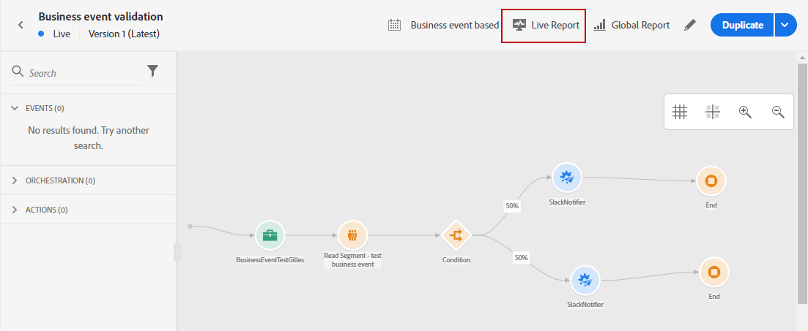
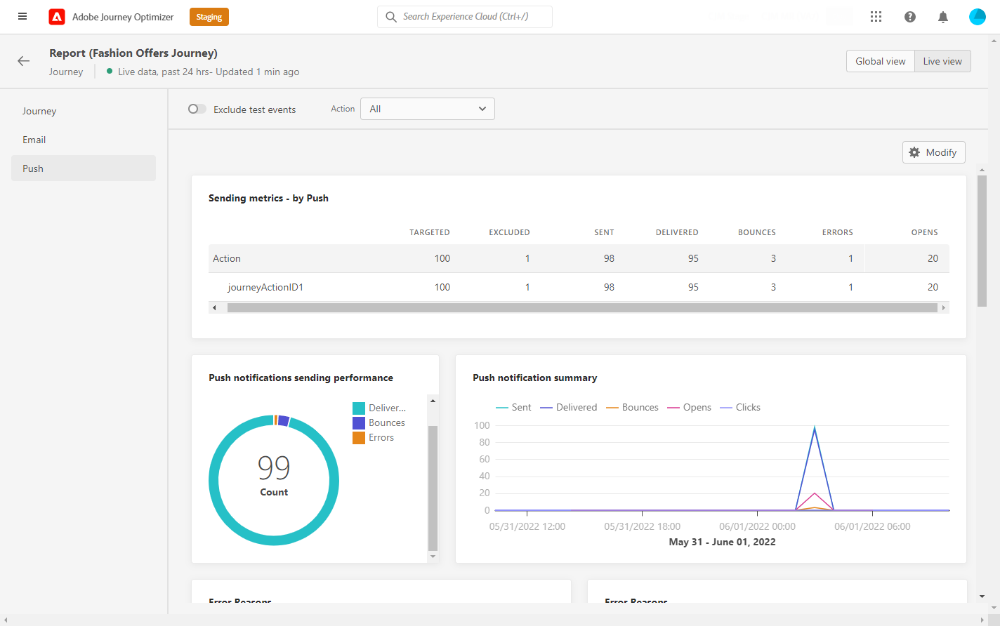

# Journaal live {#journey-live-report}

Reis live rapport kan direct vanaf je reis worden geopend met de **[!UICONTROL Live report]** knop.

De reis **[!UICONTROL Live report]** Deze pagina wordt weergegeven met de volgende tabbladen:

* [Reis](#journey-live)
* [Email](#email-live)
* [Push](#push-live)

De reis **[!UICONTROL Live report]** is verdeeld in verschillende widgets waarin het succes en de fouten van uw reis worden beschreven. Elke widget kan indien nodig worden vergroot of verkleind en verwijderd. Raadpleeg voor meer informatie hierover [sectie](live-report.md#modify-dashboard).

## Tabblad Reis {#journey-live}

Vanaf uw reis **[!UICONTROL Live report]** de **[!UICONTROL Journey]** geeft u een duidelijk overzicht van de belangrijkste volgende gegevens over uw reis.

**[!UICONTROL Journey Performance]** Hiermee kunt u het pad van uw doelprofielen stap voor stap bekijken.

De **[!UICONTROL Journey Statistics]** widget geeft de volgende KPI&#39;s weer:

* **[!UICONTROL Entered profiles]**: Het totale aantal personen dat de inreisgebeurtenis van de reis heeft bereikt.

* **[!UICONTROL Exited profiles]**: Het totale aantal personen dat de reis heeft verlaten.

* **[!UICONTROL Failed individual journeys]**: Het totale aantal individuele reizen dat niet succesvol is uitgevoerd.

De **[!UICONTROL Event executed over the last 24 hours]** en **[!UICONTROL Events]** Met widgets kunt u zien welke van uw gebeurtenissen met succes zijn uitgevoerd via een overzichtsnummer, grafiek en tabel.

De **[!UICONTROL Action executed over the last 24 hours]** en **[!UICONTROL Actions executed and errors]** widgets zijn de meest succesvolle actie en fouten die zijn opgetreden toen uw acties werden geactiveerd. De grafiek, de lijst en de samenvattingsaantallen van de Actie bevatten de gegevens beschikbaar voor acties, zoals:

* **[!UICONTROL Actions executed]**: Het totale aantal acties dat met succes voor een reis wordt uitgevoerd.

* **[!UICONTROL Error in actions]**: Het totale aantal fouten dat is opgetreden voor handelingen.

<!--

>[!NOTE]
>
>The Offers widgets and metrics are only available if a decision was inserted in an email. For more information on Decision Management, refer to this [page](../offers/get-started/starting-offer-decisioning.md).

The **[!UICONTROL Offers statistic]** and **[!UICONTROL Offers statistics]** over time widgets measure your offer's success and impact on your targeted audience. It detail the main information relative to your message with KPIs:

* **[!UICONTROL Offer sent]**: Total number of sends for the offer.

* **[!UICONTROL Offer impression]**: Number of times the offer was opened in a delivery.

* **[!UICONTROL Offer clicks]**: Number of times an offer was clicked on in a delivery.
-->

## Tabblad E-mail {#email-live}

Vanaf uw reis **[!UICONTROL Live report]** de **[!UICONTROL Email]** bevat de belangrijkste informatie met betrekking tot de e-mailleveringen die tijdens uw reis worden verzonden.

Voor een gedetailleerd rapport over een specifieke e-maillevering raadpleegt u de [Live-melding via e-mail](email-live-report.md) sectie.

De **[!UICONTROL Email Sending Statistics]** widget geeft details over de belangrijkste informatie met betrekking tot uw bericht:

* **[!UICONTROL Delivered]**: Het aantal berichten dat is verzonden in verhouding tot het totale aantal verzonden berichten.

* **[!UICONTROL Bounces]**: Totaal van fouten die tijdens levering en automatische terugkeerverwerking met betrekking tot het totale aantal verzonden berichten worden gecumuleerd.

* **[!UICONTROL Errors]**: Het totale aantal fouten dat is opgetreden tijdens een levering waardoor deze niet naar profielen kan worden verzonden.

De **[!UICONTROL Sending metrics by Email]** tabel en **[!UICONTROL Email Summary]** grafiek geeft het succes van uw levering aan:

* **[!UICONTROL Sent]**: Het totale aantal verzendt voor de levering.

* **[!UICONTROL Delivered]**: Het aantal berichten dat is verzonden in verhouding tot het totale aantal verzonden berichten.

* **[!UICONTROL Bounces]**: Totaal van fouten die tijdens levering en automatische terugkeerverwerking met betrekking tot het totale aantal verzonden berichten worden gecumuleerd.

* **[!UICONTROL Errors]**: Het totale aantal fouten dat is opgetreden tijdens een levering waardoor deze niet naar profielen kan worden verzonden.

* **[!UICONTROL Opens]**: Aantal keren dat een bericht in een levering werd geopend.

* **[!UICONTROL Clicks]**: Het aantal keren dat op een inhoud is geklikt in een levering.

* **[!UICONTROL Unsubscribe]**: Aantal klikken op de verbinding van het unsubscription.

* **[!UICONTROL Spam complaints]**: Aantal keren dat een bericht als spam of junk werd verklaard.

De **[!UICONTROL Bounce Reasons]**, **[!UICONTROL Bounce categories]** en **[!UICONTROL Hard and bounce - by Email]** widgets bevatten de beschikbare gegevens met betrekking tot berichten die worden teruggestuurd, zoals:

* **[!UICONTROL Hard bounce]**: Het totale aantal permanente fouten, zoals een onjuist e-mailadres. Dit omvat een foutbericht waarin expliciet wordt aangegeven dat het adres ongeldig is, zoals Onbekende gebruiker.

* **[!UICONTROL Soft bounce]**: Het totale aantal tijdelijke fouten, zoals een volledig postvak.

* **[!UICONTROL Ignored]**: Het totale aantal tijdelijke gegevens, zoals Buiten-kantoor, of een technische fout, bijvoorbeeld als het type afzender postmaster is.

De **[!UICONTROL Error Reasons]** de grafiek en de lijst laten u zien welke fout tijdens uw levering voorkwam.

## Tabblad Push {#push-live}

Vanaf uw reis **[!UICONTROL Live report]** de **[!UICONTROL Push]** bevat de belangrijkste informatie met betrekking tot de pushberichten die tijdens uw reis worden verzonden.

Voor een gedetailleerd rapport over een specifieke pushservice raadpleegt u de [Live-rapport afdrukken](push-live-report.md) sectie.

**[!UICONTROL Push notification sending performance]**, **[!UICONTROL Push notification summary]** en **[!UICONTROL Sending metrics - by Push]** widgets geeft details over de belangrijkste informatie met betrekking tot uw bericht:

* **[!UICONTROL Sent]**: Het totale aantal verzendt voor de levering.

* **[!UICONTROL Delivered]**: Het aantal berichten dat is verzonden in verhouding tot het totale aantal verzonden berichten.

* **[!UICONTROL Bounces]**: Totaal van fouten die tijdens levering en automatische terugkeerverwerking met betrekking tot het totale aantal verzonden berichten worden gecumuleerd.

* **[!UICONTROL Errors]**: Het totale aantal fouten dat is opgetreden tijdens een levering waardoor deze niet naar profielen kan worden verzonden.

* **[!UICONTROL Opens]**: Aantal keren dat een bericht in een levering werd geopend.

* **[!UICONTROL Actions]**: Het totale aantal acties op de geleverde pushmelding, bijvoorbeeld klikken op de knop of ontslag.

* **[!UICONTROL Engagements]**: Het totale aantal keren dat wordt geopend en de acties voor deze pushmelding, bijvoorbeeld als het profiel de pushmelding heeft geopend of als op een knop is geklikt.

De **[!UICONTROL Error Reasons]** de grafiek en de lijst laten u zien welke fout tijdens uw levering voorkwam.

De **[!UICONTROL Tracking by platform]**, **[!UICONTROL Sending by platform]** en **[!UICONTROL Breakdown by platform]** in grafieken en tabellen wordt aangegeven hoe succesvol uw pushmelding is, afhankelijk van het besturingssysteem.

De **[!UICONTROL Sending statistics - Failed]** Met de widget kunt u zien hoeveel fout en stuit er zijn opgetreden.
