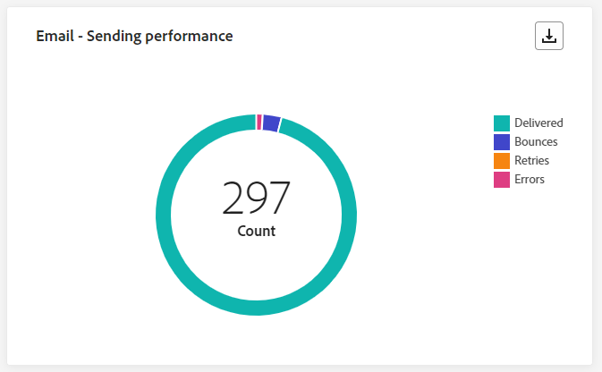
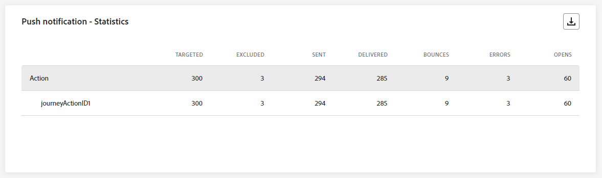

# Journaal live {#journey-live-report}

>[!CONTEXTUALHELP]
>id="ajo_journey_live_report"
>title="Journaal live"
>abstract="Met het Live Journey-rapport kunt u de impact en prestaties van uw reizen in real-time alleen in de afgelopen 24 uur meten en visualiseren. Uw rapport is verdeeld in verschillende widgets die het succes en de fouten van uw reis gedetailleerd beschrijven. Elk rapportdashboard kan worden gewijzigd door widgets te vergroten of te verkleinen of te verwijderen."

Live rapporten, die toegankelijk zijn vanaf het tabblad Laatste 24 uur, geven gebeurtenissen weer die in de afgelopen 24 uur hebben plaatsgevonden, met een minimale tijdsinterval van twee minuten vanaf de gebeurtenis. Globale rapporten richten zich daarentegen op gebeurtenissen die zich minstens twee uur geleden hebben voorgedaan en bestrijken gebeurtenissen gedurende een geselecteerde tijdsperiode.

Reis live rapport kan direct vanaf je reis worden geopend met de **[!UICONTROL View report]** knop.

De reis **[!UICONTROL Live report]** Deze pagina wordt weergegeven met de volgende tabbladen:

* [Reis](#journey-live)
* [Email](#email-live)
* [Push](#push-live)
* [Sms](#sms-live)
* [In-app](#in-app-live)

De reis **[!UICONTROL Live report]** is verdeeld in verschillende widgets waarin het succes en de fouten van uw reis worden beschreven. Elke widget kan indien nodig worden vergroot of verkleind en verwijderd. Raadpleeg voor meer informatie hierover [sectie](live-report.md#modify-dashboard).

Voor een gedetailleerde lijst van elke metrisch beschikbaar in Adobe Journey Optimizer, verwijs naar [deze pagina](live-report.md#list-of-components-live).

## Tabblad Reis {#journey-live}

Vanaf uw reis **[!UICONTROL Live report]** de **[!UICONTROL Journey]** geeft u een duidelijk overzicht van de belangrijkste volgende gegevens over uw reis.

### Reisprestaties {#journey-performance}

>[!CONTEXTUALHELP]
>id="ajo_journey_performance_live"
>title="Reisprestaties"
>abstract="XX"

**[!UICONTROL Journey Performance]** Hiermee kunt u het pad van uw doelprofielen stap voor stap bekijken.

### Reisstatistieken {#journey-statistics}

>[!CONTEXTUALHELP]
>id="ajo_journey_statistics_live"
>title="Reisstatistieken"
>abstract="XX"

De **[!UICONTROL Journey Statistics]** De zeer belangrijke Indicatoren van Prestaties (KPIs) functioneren als allesomvattend dashboard, leverend een analyse van essentiële metriek verbonden aan uw reis in de afgelopen 24 uren. Dit omvat details zoals het aantal ingegane profielen en gevallen van mislukte individuele reizen, die een uitvoerig inzicht in de doeltreffendheid van uw reis en niveau van betrokkenheid aanbieden.

+++ Meer informatie over statistische gegevens van Journey

* **[!UICONTROL Entered profiles]**: Totaal aantal personen dat de inreisgebeurtenis van de reis heeft bereikt.

* **[!UICONTROL Exited profiles]**: Totaal aantal personen dat de reis heeft verlaten.

* **[!UICONTROL Failed individual journeys]**: Totaal aantal individuele reizen die niet succesvol zijn uitgevoerd.
+++

### Actie uitgevoerd in de afgelopen 24 uur {#action-executed}

>[!CONTEXTUALHELP]
>id="ajo_journey_actions_executed_live"
>title="Actie uitgevoerd in de afgelopen 24 uur"
>abstract="XX"

De **[!UICONTROL Action executed over the last 24 hours]** widget geeft de meest succesvolle actie aan die is uitgevoerd toen uw acties werden geactiveerd.

+++ Meer informatie over acties die in de afgelopen 24 uur zijn uitgevoerd

* **[!UICONTROL Actions executed]**: Totaal aantal acties uitgevoerd voor een reis.

* **[!UICONTROL Error in actions]**: Totaal aantal fouten dat is opgetreden voor handelingen.

+++

### Handelingen en fouten {#actions-errors}

>[!CONTEXTUALHELP]
>id="ajo_journey_actions_executed__errors_live"
>title="Handelingen en fouten"
>abstract="XX"

De **[!UICONTROL Actions executed and errors]** widget vertegenwoordigt de meest succesvolle actie en fouten die voorkwamen toen uw acties werden teweeggebracht.

+++ Meer informatie over uitgevoerde handelingen en foutenmetriek

* **[!UICONTROL Actions executed]**: Totaal aantal acties uitgevoerd voor een reis.

* **[!UICONTROL Error in actions]**: Totaal aantal fouten dat is opgetreden voor handelingen.

+++

### Foutredenen voor handelingen {#actions-error-reasons}

>[!CONTEXTUALHELP]
>id="ajo_journey_actions_errors_live"
>title="Foutredenen voor handelingen"
>abstract="XX"

De **[!UICONTROL Action error reasons]** tabel en grafiek geven een uitgebreid overzicht van de fouten die zijn opgetreden tijdens het uitvoeren van uw acties in de afgelopen 24 uur.

### Fouttype per actie {#error-type-actions}

>[!CONTEXTUALHELP]
>id="ajo_journey_actions_error_type_live"
>title="Fouttype per actie"
>abstract="XX"

De **[!UICONTROL Error type by actions]** tabel en grafiek geven een uitgebreid overzicht van de fouten die zijn opgetreden bij elke uitvoering van uw acties in de afgelopen 24 uur.

### Gebeurtenis uitgevoerd in de afgelopen 24 uur {#event-executed-24hours}

>[!CONTEXTUALHELP]
>id="ajo_journey_event_24hours_live"
>title="Gebeurtenis uitgevoerd in de afgelopen 24 uur"
>abstract="XX"

De **[!UICONTROL Event executed over the last 24 hours]** Met widget kunt u bepalen welke gebeurtenissen in de afgelopen 24 uur zijn uitgevoerd.

### Gebeurtenissen {#events}

>[!CONTEXTUALHELP]
>id="ajo_journey_events_live"
>title="Gebeurtenissen"
>abstract="XX"

De **[!UICONTROL Events]** Met de widget kunt u zien welke van uw gebeurtenissen is uitgevoerd via een overzichtsnummer, een grafiek en een tabel.

### Gebeurtenissen naar oorsprong {#events-origin}

>[!CONTEXTUALHELP]
>id="ajo_journey_events_origin_live"
>title="Gebeurtenissen naar oorsprong"
>abstract="XX"

De **[!UICONTROL Events by origin]** tabel en grafieken bieden een gedetailleerd overzicht van de succesvolle ontvangst van uw gebeurtenissen in de afgelopen 24 uur. Via deze visuele voorstellingen kunt u precies zien welke van uw gebeurtenissen effectief zijn ontvangen en kunt u waardevolle inzichten bieden in de prestaties en de impact van individuele gebeurtenissen op uw reis.

## Tabblad E-mail {#email-live}

Vanaf uw reis **[!UICONTROL Live report]** de **[!UICONTROL Email]** bevat de belangrijkste gegevens met betrekking tot de e-mails die tijdens uw reis worden verzonden.

### E-mail - Prestaties verzenden {#email-sending-performance}

>[!CONTEXTUALHELP]
>id="ajo_journey_email_sending_performance_live"
>title="E-mail - Prestaties verzenden"
>abstract="XX"

De **[!UICONTROL Email - Sending performance]** grafiek biedt een uitgebreid overzicht van gegevens over verzonden e-mails tijdens uw reis en biedt inzichten in belangrijke meetgegevens zoals geleverde gegevens en stuitingen die in de afgelopen 24 uur hebben plaatsgevonden. Dit maakt een gedetailleerde analyse van het verzendingsproces van e-mail mogelijk en biedt waardevolle informatie over de efficiëntie en prestaties van uw reizen.

+++ Meer informatie over e-mail - Prestatiegegevens verzenden

* **[!UICONTROL Delivered]**: Aantal verzonden e-mailberichten.

* **[!UICONTROL Bounces]**: Totaal aan fouten gecumuleerd tijdens het verzendproces en automatische terugzendverwerking.

* **[!UICONTROL Errors]**: Het totale aantal fouten dat is opgetreden tijdens het verzendproces waardoor het niet naar profielen kan worden verzonden.

* **[!UICONTROL Retries]**: Aantal e-mails in de wachtrij voor nieuwe pogingen.

+++

### E-mail - Statistieken {#email-stat}

>[!CONTEXTUALHELP]
>id="ajo_journey_email_statistics_live"
>title="E-mail - Statistieken"
>abstract="XX"

De **[!UICONTROL Email - Statistics]** de tabel bevat een uitgebreide samenvatting van de belangrijkste gegevens over e-mails die u de afgelopen 24 uur hebt afgelegd . Het bevat belangrijke metriek zoals de grootte van het beoogde publiek en het aantal e-mails dat succesvol is afgeleverd. Het biedt waardevolle inzichten in de effectiviteit en het bereik van uw e-mails en reizen.

+++ Meer informatie over statistieken over verzendstatistieken per e-mail

* **[!UICONTROL Targeted]**: Het totale aantal berichten dat tijdens het verzendingsproces wordt verwerkt.

* **[!UICONTROL Excluded]**: Aantal profielen dat door Adobe Journey Optimizer is uitgesloten.

* **[!UICONTROL Sent]**: Totaal aantal verzonden e-mailberichten.

* **[!UICONTROL Delivered]**: Aantal verzonden e-mailberichten in verhouding tot het totale aantal verzonden berichten.

* **[!UICONTROL Bounces]**: Totaal aan fouten gecumuleerd tijdens het verzendingsproces en automatische retourverwerking in verhouding tot het totale aantal verzonden berichten.

* **[!UICONTROL Errors]**: Het totale aantal fouten dat is opgetreden tijdens het verzendproces waardoor het niet naar profielen kan worden verzonden.

* **[!UICONTROL Opens]**: Het aantal keren dat je e-mails zijn geopend.

* **[!UICONTROL Clicks]**: Het aantal keer dat er op de inhoud in uw e-mails is geklikt.

* **[!UICONTROL Unsubscribe]**: Het aantal klikken op de koppeling voor het opzeggen van abonnementen.

* **[!UICONTROL Spam complaints]**: Het aantal keren dat een bericht is gedeclareerd als spam of junk.

* **[!UICONTROL Retries]**: Aantal e-mails in de wachtrij voor nieuwe pogingen.

+++

### E-mail - Prestaties op datum {#email-perf-date}

>[!CONTEXTUALHELP]
>id="ajo_journey_email_performance_bydate_live"
>title="E-mail - Prestaties op datum"
>abstract="XX"

De **[!UICONTROL Email - Performance by date]** widget biedt een gedetailleerd overzicht van belangrijke informatie over uw e - mails , in een grafiek , die inzicht biedt in de prestatietrends in de afgelopen 24 uur .

+++ Meer informatie over e-mail - Prestaties op basis van datum

* **[!UICONTROL Sent]**: Totaal aantal verzonden e-mailberichten.

* **[!UICONTROL Delivered]**: Aantal verzonden e-mailberichten.

* **[!UICONTROL Bounces]**: Totaal aan fouten gecumuleerd tijdens het verzendproces en automatische terugzendverwerking.

* **[!UICONTROL Errors]**: Het totale aantal fouten dat is opgetreden tijdens het verzendproces waardoor het niet naar profielen kan worden verzonden.

* **[!UICONTROL Opens]**: Het aantal keren dat je e-mails zijn geopend.

* **[!UICONTROL Clicks]**: Het aantal keren dat er op de inhoud in uw e-mails is geklikt.

* **[!UICONTROL Unsubscribe]**: Het aantal klikken op de koppeling voor het opzeggen van abonnementen.

* **[!UICONTROL Spam complaints]**: Het aantal keren dat een bericht is gedeclareerd als spam of junk.

+++

### E-mail - rubrieken en redenen voor stuiteren {#email-bounce-categories}

>[!CONTEXTUALHELP]
>id="ajo_journey_email_bounces_live"
>title="E-mail - rubrieken en redenen voor stuiteren"
>abstract="XX"

De **[!UICONTROL Bounce Reasons]** en **[!UICONTROL Bounce categories]** widgets compileren de beschikbare gegevens met betrekking tot teruggestuurde berichten , zodat ze gedetailleerde informatie kunnen verschaffen over de specifieke redenen en categorieën achter e - mailberichten in de afgelopen 24 uur .

Voor meer informatie over grenzen raadpleegt u de [Onderdrukkingslijst](../reports/suppression-list.md) pagina.

+++ Meer informatie over e-mail - Stuitrubrieken en motiveringen

* **[!UICONTROL Hard bounce]**: Het totale aantal permanente fouten, zoals een onjuist e-mailadres. Dit omvat een foutbericht waarin expliciet wordt aangegeven dat het adres ongeldig is, zoals Onbekende gebruiker.

* **[!UICONTROL Soft bounce]**: Het totale aantal tijdelijke fouten, zoals een volledig postvak.

* **[!UICONTROL Ignored]**: Het totale aantal tijdelijke berichten, zoals Buiten-kantoor, of een technische fout, bijvoorbeeld als het type afzender postmaster is.

+++

### E-mail - Foutredenen {#email-error-reasons}

>[!CONTEXTUALHELP]
>id="ajo_journey_email_errors_live"
>title="E-mail - Foutredenen"
>abstract="XX"

De **[!UICONTROL Error Reasons]** grafieken en tabellen geven inzicht in de specifieke fouten die zich tijdens het verzendingsproces van de afgelopen 24 uur hebben voorgedaan en bieden waardevolle informatie over de aard en het optreden van fouten.

### E-mail - Uitgesloten redenen {#email-excluded}

>[!CONTEXTUALHELP]
>id="ajo_journey_email_excluded_live"
>title="E-mail - Uitgesloten redenen"
>abstract="XX"

De **[!UICONTROL Excluded Reasons]** in grafieken en tabellen wordt een uitgebreid overzicht gegeven van de verschillende factoren die ertoe hebben geleid dat gebruikersprofielen zijn uitgesloten van het doelpubliek, waardoor het bericht in de afgelopen 24 uur niet is ontvangen.

Zie [deze pagina](exclusion-list.md) voor de volledige lijst van uitsluitingsredenen.

### E-mail - Beste ontvangende domein {#email-best-recipient}

>[!CONTEXTUALHELP]
>id="ajo_journey_email_best_recipient_live"
>title="E-mail - Beste ontvangende domein"
>abstract="XX"

De **[!UICONTROL Email - Best recipient domain]** de grafiek en de lijst verstrekken een gedetailleerde uitsplitsing van de domeinen die profielen het vaakst gebruiken om uw e-mail binnen de laatste 24 uren te openen. Dit biedt waardevolle inzichten in profielgedrag, waardoor u beter inzicht krijgt in voorkeursplatforms.

### E-mailaanbiedingen {#email-offers}

>[!CONTEXTUALHELP]
>id="ajo_journey_email_offers_live"
>title="E-mail - voorstellen"
>abstract="XX"

>[!NOTE]
>
>De widgets en cijfers voor aanbiedingen zijn alleen beschikbaar als een beslissing in een e-mail is ingevoegd. Raadpleeg voor meer informatie over het beheer van de beslissingen het volgende [page](../offers/get-started/starting-offer-decisioning.md).

De **[!UICONTROL Offers statistic]** en **[!UICONTROL Offers statistics over time]** widgets meten het succes en de invloed van uw aanbieding op uw doelgroep. Het detailleert de belangrijkste informatie met betrekking tot uw bericht met KPIs.

+++ Meer informatie over e-mail - Metriek van aanbiedingen

* **[!UICONTROL Offer sent]**: Totaal aantal verzendingen voor de aanbieding.

* **[!UICONTROL Offer impression]**: Het aantal keren dat het voorstel in je e-mails is geopend.

* **[!UICONTROL Offer clicks]**: Het aantal keren dat er op een voorstel is geklikt in je e-mailberichten.

+++

### E-mail - Optimalisatie {#email-sto}

>[!CONTEXTUALHELP]
>id="ajo_journey_email_optimization_live"
>title="E-mail - Optimalisatie"
>abstract="XX"

>[!NOTE]
>
>De **[!UICONTROL Send time optimization]** en **[!UICONTROL Optimized vs non optimized]** widgets zijn alleen beschikbaar als de optie Send-Time Optimization is geactiveerd voor uw levering. Voor meer informatie over Send-Time Optimization, verwijs naar [deze pagina](../building-journeys/journeys-message.md#send-time-optimization).

De **[!UICONTROL Send time optimization]** en **[!UICONTROL Optimized vs non optimized]** widgets geven een gedetailleerd overzicht van het succes van uw e-mailberichten, afhankelijk van de verzendmethode: geoptimaliseerd of normaal.

+++ Meer informatie over optimalisatie van de verzendtijd en geoptimaliseerde versus niet-geoptimaliseerde meetgegevens

* **[!UICONTROL Delivered]**: Het aantal berichten dat is verzonden in verhouding tot het totale aantal verzonden berichten.
* **[!UICONTROL Bounces]**: Totaal aan fouten gecumuleerd tijdens het verzendingsproces en automatische retourverwerking in verhouding tot het totale aantal verzonden berichten.

* **[!UICONTROL Sent]**: Het totale aantal e-mails dat voor de reis is verzonden.

* **[!UICONTROL Opens]**: Het aantal keren dat je e-mails geopend zijn tijdens de reis.

* **[!UICONTROL Clicks]**: Het aantal keer dat er op de inhoud in uw e-mails is geklikt.

+++

## Tabblad Pushmelding {#push-live}

Vanaf uw reis **[!UICONTROL Live report]** de **[!UICONTROL Push notification]** bevat de belangrijkste informatie met betrekking tot de pushmelding die tijdens de reis wordt verzonden.

### Pushmelding - Prestaties verzenden {#push-sending-performance}

>[!CONTEXTUALHELP]
>id="ajo_journey_push_sending_performance_live"
>title="Pushmelding - Prestaties verzenden"
>abstract="De grafiek van de Prestaties bij verzenden van pushberichten geeft een overzicht van de belangrijkste gegevens over uw pushmelding, zoals Fouten of Geleverde berichten van de afgelopen 24 uur."

De **[!UICONTROL Push notification sending performance]** grafiek biedt een grondig overzicht van gegevens met betrekking tot pushmeldingen die in de afgelopen 24 uur zijn verzonden. Het biedt inzicht in essentiële metriek zoals geleverde en stommelingen, waardoor het verzendingsproces van pushberichten grondig kan worden onderzocht.

+++ Meer informatie over pushmeldingen - Prestatiegegevens verzenden

* **[!UICONTROL Delivered]**: Aantal verzonden berichten.

* **[!UICONTROL Bounces]**: Totaal aan fouten gecumuleerd tijdens het verzendproces en automatische terugzendverwerking.

* **[!UICONTROL Errors]**: Het totale aantal fouten dat is opgetreden tijdens het verzendproces waardoor het niet naar profielen kan worden verzonden.

+++

### Pushmeldingen - Statistieken {#push-statistics}

>[!CONTEXTUALHELP]
>id="ajo_journey_push_statistics_live"
>title="Pushmeldingen - Statistieken"
>abstract="XX"

**[!UICONTROL Push notification - Statistics]** de tabel bevat een beknopt overzicht van de belangrijkste gegevens over uw pushberichten, waaronder belangrijke meetgegevens zoals het aantal gerichte berichten en het aantal succesvol afgeleverde berichten in de afgelopen 24 uur.

+++ Meer informatie over pushmeldingen - statistieken

* **[!UICONTROL Targeted]**: Het aantal profielen dat is bedoeld voor acties zoals het verzenden van e-mail of sms.

* **[!UICONTROL Excluded]**: Aantal profielen dat door Adobe Journey Optimizer is uitgesloten.

* **[!UICONTROL Sent]**: Totaal aantal verzonden pushmeldingen.

* **[!UICONTROL Delivered]**: Aantal verzonden pushberichten.

* **[!UICONTROL Bounces]**: Totaal aan fouten gecumuleerd tijdens het verzendproces en automatische terugzendverwerking.

* **[!UICONTROL Errors]**: Het totale aantal fouten dat is opgetreden tijdens het verzendproces waardoor het niet naar profielen kan worden verzonden.

* **[!UICONTROL Opens]**: Het aantal keren dat uw pushmelding is geopend.
+++

### Pushmelding - Onderverdeling per platform {#push-breakdown}

>[!CONTEXTUALHELP]
>id="ajo_journey_push_breakdown_live"
>title="Pushmelding - Onderverdeling per platform"
>abstract="XX"

De **[!UICONTROL Push notification - Breakdown by platform]** de grafiek en de lijst verstrekken een gedetailleerde analyse van het succes van uw pushberichten, die inzichten aanbieden die op het werkende systeem van uw profiel worden gebaseerd. Deze ineenstorting verbetert uw inzicht in hoe goed uw pushberichten op verschillende platforms presteren.

### Pushmelding - Samenvatting verzenden {#push-sending-summary}

>[!CONTEXTUALHELP]
>id="ajo_journey_push_sending_summary_live"
>title="Pushmelding - Samenvatting verzenden"
>abstract="XX"

De **[!UICONTROL Push notification summary]** grafiek biedt een dynamische vertegenwoordiging, die een analyse van uw activiteit van dupberichten binnen de laatste 24 uren toont. Deze grafische weergave biedt een uitgebreide uitsplitsing van verzonden pushberichten.

+++ Meer informatie over pushmeldingen - Samenvattingscijfers verzenden

* **[!UICONTROL Sent]**: Totaal aantal verzonden pushmeldingen.

* **[!UICONTROL Delivered]**: Aantal verzonden pushberichten.

* **[!UICONTROL Bounces]**: Totaal aan fouten gecumuleerd tijdens het verzendproces en automatische terugzendverwerking.

* **[!UICONTROL Errors]**: Het totale aantal fouten dat is opgetreden tijdens het verzendproces waardoor het niet naar profielen kan worden verzonden.

* **[!UICONTROL Opens]**: Het aantal keren dat uw pushberichten zijn geopend.

* **[!UICONTROL Clicks]**: Het aantal keren dat er op de inhoud is geklikt in uw pushberichten.

+++

### Pushmelding - Foutredenen {#push-error}

>[!CONTEXTUALHELP]
>id="ajo_journey_push_error_reasons_live"
>title="Pushmelding - Foutredenen"
>abstract="XX"

De **[!UICONTROL Error Reasons]** tabel en grafieken bieden u de mogelijkheid om de specifieke fouten te identificeren die zijn opgetreden tijdens het verzenden van uw pushberichten. Zo krijgt u gedetailleerde informatie over problemen die zich de afgelopen 24 uur hebben voorgedaan.

### Pushmelding - Uitgesloten redenen {#push-excluded}

>[!CONTEXTUALHELP]
>id="ajo_journey_push_excluded_reasons_live"
>title="Pushmelding - Uitgesloten redenen"
>abstract="XX"

De **[!UICONTROL Excluded Reasons]** in grafieken en tabellen worden de verschillende redenen weergegeven waarom gebruikersprofielen, die zijn uitgesloten van de doelprofielen, uw pushberichten niet binnen de laatste 24 uur hebben ontvangen.

Zie [deze pagina](exclusion-list.md) voor de volledige lijst van uitsluitingsredenen.

## Tabblad SMS {#sms-live}

### SMS - Statistieken {#sms-statistics}

>[!CONTEXTUALHELP]
>id="ajo_journey_sms_statistics_live"
>title="SMS - Statistieken"
>abstract="XX"

De **[!UICONTROL SMS - Statistics]** de lijst verstrekt een beknopt overzicht van essentiële gegevens met betrekking tot uw berichten van SMS, die zeer belangrijke metriek omvatten zoals het aantal gerichte berichten en het aantal met succes geleverde berichten van de laatste 24 uren.

+++ Meer informatie over SMS - Statistische gegevens

* **[!UICONTROL Targeted]**: Aantal gebruikersprofielen dat als doelprofielen wordt gekwalificeerd.

* **[!UICONTROL Excluded]**: Aantal gebruikersprofielen dat is uitgesloten van de doelprofielen en dat het bericht niet heeft ontvangen.

* **[!UICONTROL Sent]**: Totaal aantal verzonden SMS-berichten.

* **[!UICONTROL Opens]**: Het aantal keren dat je SMS-berichten zijn geopend.

* **[!UICONTROL Clicks]**: Het aantal keer dat er op een inhoud is geklikt in uw SMS-berichten.

* **[!UICONTROL Bounces]**: Totaal aan fouten gecumuleerd tijdens het verzendingsproces, het verzendingsproces en automatische terugkeringsverwerking.

* **[!UICONTROL Errors]**: Het totale aantal fouten dat is opgetreden tijdens het verzendproces waardoor het niet naar profielen kan worden verzonden.

+++

### SMS - Prestaties op datum {#sms-performance}

>[!CONTEXTUALHELP]
>id="ajo_journey_sms_performance_live"
>title="SMS - Prestaties op datum"
>abstract="XX"

De **[!UICONTROL SMS - Performance by date]** widget geeft een gedetailleerd overzicht van de belangrijkste informatie over uw berichten , in een grafiek weergegeven , die inzicht verschaft in de prestatietrends in de afgelopen 24 uur .

+++ Meer informatie over SMS - Prestaties op basis van datum

* **[!UICONTROL Sent]**: Totaal aantal verzonden SMS-berichten.

* **[!UICONTROL Bounces]**: Totaal aan fouten gecumuleerd tijdens het verzendproces en automatische terugzendverwerking.

* **[!UICONTROL Errors]**: Het totale aantal fouten dat is opgetreden tijdens het verzendproces waardoor het niet naar profielen kan worden verzonden.

+++

### SMS - Bounges redenen {#sms-bounces}

>[!CONTEXTUALHELP]
>id="ajo_journey_sms_bounces_live"
>title="SMS - Bounges redenen"
>abstract="XX"

De **[!UICONTROL SMS - Bounces reasons]** grafieken en tabellen bieden een uitgebreid overzicht van de gegevens met betrekking tot verzonden SMS-berichten en bieden waardevolle inzichten in de specifieke redenen achter instanties van sms-berichten in de afgelopen 24 uur.

### SMS - Redenen voor fouten {#sms-error}

>[!CONTEXTUALHELP]
>id="ajo_journey_sms_error_live"
>title="SMS - Redenen voor fouten"
>abstract="XX"

De **[!UICONTROL SMS - Error Reasons]** Met grafieken en tabellen kunt u de specifieke fouten identificeren die zijn opgetreden tijdens het verzenden van uw SMS-berichten. Zo kunt u een grondige analyse maken van alle problemen die zich in de afgelopen 24 uur hebben voorgedaan.

### SMS - Uitgesloten redenen {#sms-excluded}

>[!CONTEXTUALHELP]
>id="ajo_journey_sms_excluded_live"
>title="SMS - Uitgesloten redenen"
>abstract="XX"

De **[!UICONTROL SMS - Excluded Reasons]** in grafieken en tabellen worden visueel de verschillende factoren weergegeven die hebben geleid tot de uitsluiting van gebruikersprofielen van het beoogde publiek, zodat gebruikers uw SMS-berichten niet kunnen ontvangen.

Zie [deze pagina](exclusion-list.md) voor de volledige lijst van uitsluitingsredenen.

<!--
### SMS - Clicks by links {#sms-clicks}

The **[!UICONTROL SMS - Clicks by links]** widget offers essential insights into your visitors' engagement with the URLs included in your messages, providing valuable information about which links attract the most interaction within the last 24 hours.
-->

## Tabblad In-app {#in-app-live}

### Prestaties in de app {#inapp-performance}

>[!CONTEXTUALHELP]
>id="ajo_journey_inapp_performance_live"
>title="Prestaties in de app"
>abstract="XX"

De **[!UICONTROL In-app performance]** KPI&#39;s bieden essentiële inzichten in de betrokkenheid van uw profielen bij In-app-berichten in de afgelopen 24 uur. Zo bieden ze essentiële meetgegevens om de effectiviteit en impact van de in-app-berichten op uw reis te beoordelen.

+++ Meer informatie over in-app - Prestatiewaarden

* **[!UICONTROL Impressions]**: totaal aantal in-app berichten dat aan alle gebruikers is bezorgd.

  >[!NOTE]
  >
  >Om ervoor te zorgen dat een indruk wordt geteld, moet de gebruiker aan twee criteria voldoen:
  >* Kwalificatie binnen de In-app ervaring, die door de specifieke In-app activiteit tijdens hun reis wordt bereikt.
  >* Voldoen aan de voorwaarden die zijn opgegeven in de triggerregels.
  > 
  >Als gevolg van het tweede criterium kunnen er aanzienlijke verschillen zijn tussen het aantal doelprofielen en het aantal unieke indrukkingen.

* **[!UICONTROL Interactions]**: totaal aantal contracten met uw In-app-bericht. Dit omvat alle handelingen die de gebruikers hebben uitgevoerd, zoals klikken, ontslag of andere interactie.

+++

### Overzicht in de app {#inapp-summary}

>[!CONTEXTUALHELP]
>id="ajo_journey_inapp_summary_live"
>title="Overzicht in de app"
>abstract="XX"

De **[!UICONTROL In-app summary]** De grafiek illustreert de voortgang van uw in-app-afdrukken en interacties in de afgelopen 24 uur en geeft een uitgebreid overzicht van de prestaties van uw In-app-berichten.

+++ Meer informatie over overzichtsgegevens in de app

* **[!UICONTROL Impressions]**: totaal aantal in-app berichten dat aan alle gebruikers is bezorgd.

  >[!NOTE]
  >
  >Om ervoor te zorgen dat een indruk wordt geteld, moet de gebruiker aan twee criteria voldoen:
  >* Kwalificatie binnen de In-app ervaring, die door de specifieke In-app activiteit tijdens hun reis wordt bereikt.
  >* Voldoen aan de voorwaarden die zijn opgegeven in de triggerregels.
  > 
  >Als gevolg van het tweede criterium kunnen er aanzienlijke verschillen zijn tussen het aantal doelprofielen en het aantal unieke indrukkingen.

* **[!UICONTROL Interactions]**: totaal aantal contracten met uw In-app-bericht. Dit omvat alle handelingen die de gebruikers hebben uitgevoerd, zoals klikken, ontslag of andere interactie.

+++

### Interacties per type {#interactions-type}

>[!CONTEXTUALHELP]
>id="ajo_journey_inapp_interactions_live"
>title="Interacties per type"
>abstract="XX"

De **[!UICONTROL Interactions by type]** grafieken en tabellen geven aan hoe gebruikers met uw In-app-bericht hebben gewerkt door een klik, sluiting of interactie bij te houden.
