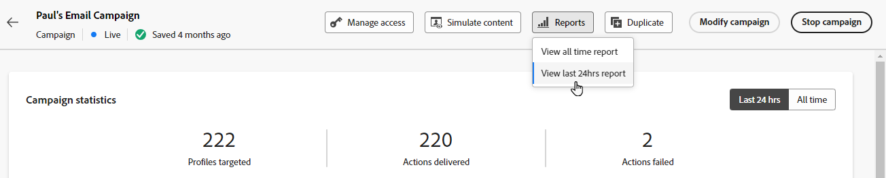

# Aan de slag met Live-rapport {#live-report}

Met de **[!UICONTROL Live report]** kunt u de impact en prestaties van uw reizen en uw berichten in een ingebouwd dashboard in real-time meten en visualiseren. Gegevens zijn beschikbaar in de **[!UICONTROL Live report]** zodra uw levering is verzonden of uw reis wordt uitgevoerd via het tabblad **[!UICONTROL Last 24hrs]** .

* Als u een reis in de context van een reis wilt richten, van het **[!UICONTROL Journeys]** menu, toegang uw reis **[!UICONTROL More actions]** menu en klik de **[!UICONTROL View last 24hrs report]** knoop.

  

* Als u een campagne als doel wilt instellen, opent u uw campagne vanuit het menu **[!UICONTROL Campaigns]** en klikt u op de knop **[!UICONTROL Reports]** then **[!UICONTROL View last 24hrs report]** .

  

Voor een gedetailleerde lijst van elke metrisch beschikbaar in Adobe Journey Optimizer, verwijs naar [&#x200B; deze pagina &#x200B;](#list-of-components-live).

## Het dashboard aanpassen {#modify-dashboard}

Elk rapportdashboard kan worden gewijzigd door widgets te vergroten of te verkleinen of te verwijderen. Het wijzigen van de widgets heeft alleen invloed op het dashboard van de huidige gebruiker. Andere gebruikers zien hun eigen dashboards of de dashboards die standaard zijn ingesteld.

1. Kies in de vervolgkeuzelijst **[!UICONTROL Actions]** of u wilt rapporteren over een bepaalde handeling van uw reizen.

1. Kies of u testgebeurtenissen wilt uitsluiten van uw rapporten met de schakelbalk. Voor meer informatie over testgebeurtenissen, verwijs naar [&#x200B; deze pagina &#x200B;](../building-journeys/testing-the-journey.md).

   De optie **[!UICONTROL Exclude test events]** is alleen beschikbaar voor Journey-rapporten.

   

1. Als u widgets wilt vergroten of verkleinen of verwijderen, klikt u op **[!UICONTROL Modify]** .

   

1. Pas de widgetgrootte aan door de rechterbenedenhoek te slepen.

   

1. Klik op **[!UICONTROL Remove]** om een widget te verwijderen die u niet nodig hebt.

   

1. Als u tevreden bent met de weergavevolgorde en de grootte van de widgets, klikt u op **[!UICONTROL Save]** .

1. Als u de manier wilt aanpassen waarop uw gegevens worden weergegeven, kunt u schakelen tussen verschillende visualisatieopties, zoals grafieken, tabellen en donutgrafieken.

   

Uw dashboard wordt nu opgeslagen. Uw verschillende wijzigingen worden opnieuw toegepast voor een later gebruik van uw live rapporten. Gebruik indien nodig de optie **[!UICONTROL Reset]** om de standaardvolgorde van widgets en widgets te herstellen.

## Uw rapporten exporteren {#export-reports}

U kunt uw verschillende rapporten eenvoudig exporteren naar PDF- of CSV-indelingen, zodat u deze kunt delen of afdrukken.

>[!BEGINTABS]

>[!TAB  Uitvoer uw rapport als dossier van PDF ]

1. Klik in uw rapport op **[!UICONTROL Export]** en selecteer **[!UICONTROL PDF file]** .

   

1. Configureer het document in het venster Afdrukken naar wens. Welke opties beschikbaar zijn, is afhankelijk van de browser.

1. Kies of je het rapport wilt afdrukken of opslaan als PDF.

1. Zoek de map waarin u het bestand wilt opslaan, geef het bestand een andere naam als dat nodig is en klik op Opslaan.

Uw rapport is nu beschikbaar voor weergave of delen in een PDF-bestand.

>[!TAB  Uitvoer uw rapport als Csv- dossier ]

1. Klik in uw rapport op **[!UICONTROL Export]** en selecteer **[!UICONTROL CSV file]** om een CSV-bestand op algemeen rapportniveau te genereren.

   

1. U kunt er ook voor kiezen om gegevens uit een specifieke widget te exporteren. Klik op **[!UICONTROL Download CSV file]** naast de geselecteerde widget.

   

1. Het bestand wordt automatisch gedownload en kan zich in uw lokale bestanden bevinden.

   Als u het bestand op rapportniveau hebt gegenereerd, bevat het gedetailleerde informatie voor elke widget, inclusief de titel en gegevens.

   Als u het bestand op widgetniveau hebt gegenereerd, bevat dit specifiek gegevens voor de geselecteerde widget.

>[!ENDTABS]
