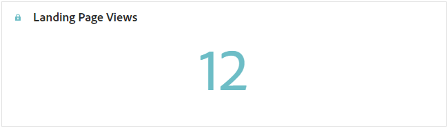
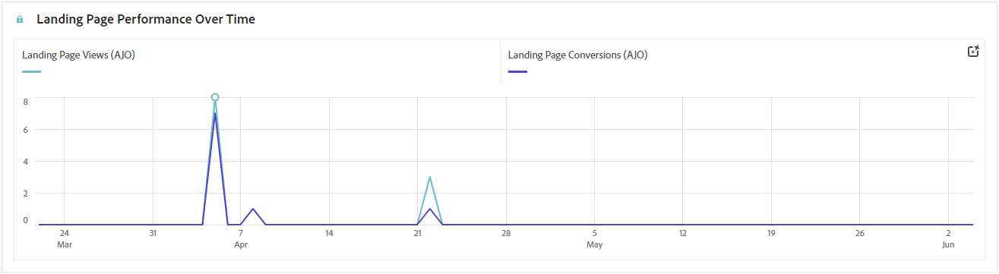
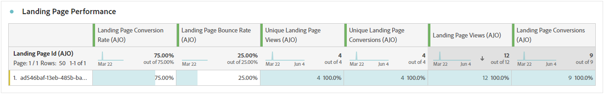

# Rapport van bestemmingspagina {#lp-report-global-cja}

Het **LandingPagina** rapport biedt waardevolle inzichten in gebruikersgedrag, betrokkenheidspatronen, omzettingspercentages, en andere zeer belangrijke metriek aan, die u machtigen om geïnformeerde besluiten te nemen en uw het landen paginaprestaties effectief te optimaliseren.

Als u rapporten wilt openen, selecteert u **[!UICONTROL Report]** in het menu Geavanceerd van de geselecteerde bestemmingspagina.

Meer over de werkruimte van Customer Journey Analytics leren en hoe te om gegevens te filtreren en te analyseren, verwijs naar [&#x200B; deze pagina &#x200B;](https://experienceleague.adobe.com/nl/docs/analytics-platform/using/cja-workspace/home).

## Conversiesnelheid landingspagina {#lp-conversion}

Met de KPI van **[!UICONTROL Landing page Conversion rate]** kunt u de effectiviteit van de bestemmingspagina beoordelen op basis van het aantal bezoeken en interacties.

* **[!UICONTROL Landing page Conversion rate]**: Aantal personen dat interactie had met de landingspagina, bv. geabonneerd op een formulier, in verhouding tot het totale aantal bezoeken.

## Stuitsnelheid landingspagina {#lp-bounce-rate}

De PKI van **[!UICONTROL Landing page Bounce rate]** verstrekt informatie over profielen die uw landende pagina bekeken zonder interactie of klikkend op om het even welke elementen.

* **[!UICONTROL Landing page Bounce rate]**: Aantal personen dat niet heeft gecommuniceerd met de landingspagina en de actie van het inschrijven niet heeft voltooid, in verhouding tot het totale aantal bezoeken.

## Weergaven van bestemmingspagina {#lp-views}

Met de KPI van **[!UICONTROL Landing page Views]** kunt u het effect van de landingspagina zien.

* **[!UICONTROL Landing page Views]**: Het totale aantal bezoeken aan de landingspagina dat afkomstig is van reizen en externe bronnen, inclusief meerdere bezoeken van één profiel.

## Weergaven unieke bestemmingspagina {#lp-unique-views}

Met de KPI van **[!UICONTROL Unique Landing page Views]** kunt u het effect van de landingspagina meten door meerdere weergaven van hetzelfde profiel uit te sluiten.

* **[!UICONTROL Unique Landing page Views]**: Het aantal personen dat uw landingspagina heeft bezocht en het aantal bezoeken van één profiel worden niet meegerekend.

## Prestaties van bestemmingspagina&#39;s in de loop van de tijd {#lp-performance-overtime}

De grafiek van **[!UICONTROL Landing page performance over time]** meet het succes van uw landingspagina&#39;s en de invloed op uw doelgroep.

* **[!UICONTROL Landing page Views]**: Het totale aantal bezoeken aan de landingspagina dat afkomstig is van reizen en externe bronnen, inclusief meerdere bezoeken van één profiel.

* **[!UICONTROL Landing page Conversion]**: Aantal personen dat interactie had met de landingspagina, bv. geabonneerd op een formulier, in verhouding tot het totale aantal bezoeken.

## Prestaties van bestemmingspagina {#lp-performance}

De tabel **[!UICONTROL Landing page performance]** fungeert als een uitgebreid dashboard met een gedetailleerde uitsplitsing van de belangrijkste metriek voor de landingspagina.

* **[!UICONTROL Landing page Conversion rate]**: Aantal personen dat interactie had met de landingspagina, bv. geabonneerd op een formulier, in verhouding tot het totale aantal bezoeken.

* **[!UICONTROL Landing page Bounce rate]**: Aantal personen dat niet heeft gecommuniceerd met de landingspagina en de actie van het inschrijven niet heeft voltooid, in verhouding tot het totale aantal bezoeken.

* **[!UICONTROL Unique Landing page Views]**: Het aantal personen dat uw landingspagina heeft bezocht en het aantal bezoeken van één profiel worden niet meegerekend.

* **[!UICONTROL Unique Landing page Conversion]**: Er wordt geen rekening gehouden met het aantal personen dat interactie heeft gehad met de landingspagina en met meerdere interacties van één profiel.

* **[!UICONTROL Landing page Views]**: Het totale aantal bezoeken aan de landingspagina dat afkomstig is van reizen en externe bronnen, inclusief meerdere bezoeken van één profiel.

* **[!UICONTROL Landing page Conversion]**: Aantal personen dat interactie heeft gehad met de landingspagina, bijvoorbeeld geabonneerd op een formulier.

## Journeys {#lp-journeys}

De tabel **[!UICONTROL Journey]** biedt een uitgebreid overzicht met de frequentie van bezoeken aan de landingspagina in de context van de reis van een gebruiker. Deze inzichtelijke weergave biedt waardevolle gegevens over gebruikersinteracties, waarmee u kunt begrijpen hoe bezoekers door uw site navigeren en met uw inhoud werken.

* **[!UICONTROL Landing page Views]**: Het totale aantal bezoeken aan de landingspagina dat afkomstig is van reizen en externe bronnen, inclusief meerdere bezoeken van één profiel.

* **[!UICONTROL Landing page Conversion]**: Aantal personen dat interactie heeft gehad met de landingspagina, bijvoorbeeld geabonneerd op een formulier.

## Campagnes {#lp-campaigns}

De tabel van **[!UICONTROL Campaigns]** biedt inzicht in het aantal bezoeken dat naar uw landingspagina is gericht als gevolg van specifieke campagnes en biedt een uitgebreid overzicht van de doeltreffendheid van de campagne en de betrokkenheid bij uw landingspagina-inhoud.

* **[!UICONTROL Landing page Views]**: Het totale aantal bezoeken aan de landingspagina dat afkomstig is van reizen en externe bronnen, inclusief meerdere bezoeken van één profiel.

* **[!UICONTROL Landing page Conversion]**: Aantal personen dat interactie heeft gehad met de landingspagina, bijvoorbeeld geabonneerd op een formulier.

## Kanaal {#lp-channels}

In de tabel **[!UICONTROL Channel]** wordt het aantal bezoeken aan de bestemmingspagina weergegeven dat per kanaal is gecategoriseerd.

* **[!UICONTROL Landing page Views]**: Het totale aantal bezoeken aan de landingspagina dat afkomstig is van reizen en externe bronnen, inclusief meerdere bezoeken van één profiel.

* **[!UICONTROL Landing page Conversion]**: Aantal personen dat interactie heeft gehad met de landingspagina, bijvoorbeeld geabonneerd op een formulier.

## Bovenste geklikte koppelingen {#lp-top-clicked}

De tabel **[!UICONTROL Top Clicked Links]** biedt inzicht in de manier waarop bezoekers met de levering communiceren en geeft aan welke koppelingen de meeste betrokkenheid en aandacht van uw publiek krijgen.

* **[!UICONTROL Landing page Clicks]**: Het aantal keren dat op de bestemmingspagina op de inhoud is geklikt.
