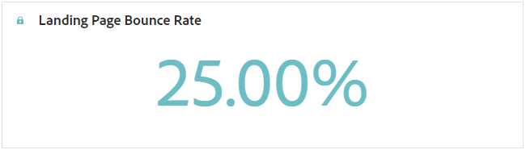

# Rapport van bestemmingspagina {#lp-report-global-cja}

De **Openingspagina** -rapport biedt waardevolle inzichten in gebruikersgedrag, betrokkenheidspatronen, conversiesnelheden en andere belangrijke gegevens, zodat u geïnformeerde beslissingen kunt nemen en de prestaties van uw bestemmingspagina effectief kunt optimaliseren.

Als u uw rapporten wilt openen, selecteert u **[!UICONTROL Report]** in het geavanceerde menu van de geselecteerde bestemmingspagina.

Voor meer informatie over de werkruimte van de Customer Journey Analytics en over het filteren en analyseren van gegevens raadpleegt u [deze pagina](https://experienceleague.adobe.com/en/docs/analytics-platform/using/cja-workspace/home).

## Conversiesnelheid landingspagina {#lp-conversion}

De **[!UICONTROL Landing page Conversion rate]** Met KPI kunt u de effectiviteit van uw landingspagina beoordelen op basis van het aantal bezoeken en interacties.

* **[!UICONTROL Landing page Conversion rate]**: Aantal personen dat met de landingspagina heeft gecommuniceerd, bv. op een formulier geabonneerd, in verhouding tot het totale aantal bezoeken.

## Stuitsnelheid landingspagina {#lp-bounce-rate}

De **[!UICONTROL Landing page Bounce rate]** KPI biedt informatie over profielen die de landingspagina hebben weergegeven zonder interactie of klik op elementen.

* **[!UICONTROL Landing page Bounce rate]**: Aantal personen dat niet heeft gecommuniceerd met de aanlandingspagina en de actie van het inschrijven niet heeft voltooid, in verhouding tot het totale aantal bezoeken.

## Weergaven van bestemmingspagina {#lp-views}

De **[!UICONTROL Landing page Views]** Met KPI kunt u de impact van uw landingspagina zien.

* **[!UICONTROL Landing page Views]**: Het totale aantal bezoeken aan uw landingspagina dat afkomstig is van reizen en externe bronnen, inclusief meerdere bezoeken van één profiel.

## Weergaven unieke bestemmingspagina {#lp-unique-views}

De **[!UICONTROL Unique Landing page Views]** Met KPI kunt u de impact van de landingspagina meten door meerdere weergaven van hetzelfde profiel uit te sluiten.

* **[!UICONTROL Unique Landing page Views]**: Het aantal personen dat uw landingspagina heeft bezocht en het aantal bezoeken van één profiel worden niet meegerekend.

## Prestaties van bestemmingspagina&#39;s in de loop van de tijd {#lp-performance-overtime}

De **[!UICONTROL Landing page performance over time]** in de grafiek wordt het succes van uw landingspagina&#39;s en de impact op uw doelgroep gemeten.

* **[!UICONTROL Landing page Views]**: Het totale aantal bezoeken aan uw landingspagina dat afkomstig is van reizen en externe bronnen, inclusief meerdere bezoeken van één profiel.

* **[!UICONTROL Landing page Conversion rate]**: Aantal personen dat met de landingspagina heeft gecommuniceerd, bv. op een formulier geabonneerd, in verhouding tot het totale aantal bezoeken.

## Prestaties van bestemmingspagina {#lp-performance}

De **[!UICONTROL Landing page performance]** de tabel fungeert als een uitgebreid dashboard met een gedetailleerde uitsplitsing van de belangrijkste meetgegevens voor uw landingspagina.

* **[!UICONTROL Landing page Conversion rate]**: Aantal personen dat met de landingspagina heeft gecommuniceerd, bv. op een formulier geabonneerd, in verhouding tot het totale aantal bezoeken.

* **[!UICONTROL Landing page Bounce rate]**: Aantal personen dat niet heeft gecommuniceerd met de aanlandingspagina en de actie van het inschrijven niet heeft voltooid, in verhouding tot het totale aantal bezoeken.

* **[!UICONTROL Unique Landing page Views]**: Het aantal personen dat uw landingspagina heeft bezocht en het aantal bezoeken van één profiel worden niet meegerekend.

* **[!UICONTROL Unique Landing page Conversion rate]**: Het aantal personen dat interactie heeft gehad met de landingspagina, de meervoudige interacties van één profiel worden niet in aanmerking genomen.

* **[!UICONTROL Landing page Views]**: Het totale aantal bezoeken aan uw landingspagina dat afkomstig is van reizen en externe bronnen, inclusief meerdere bezoeken van één profiel.

* **[!UICONTROL Landing page Conversion]**: Aantal personen dat interactie heeft gehad met de landingspagina, bijvoorbeeld geabonneerd op een formulier.

## Journeys {#lp-journeys}

De **[!UICONTROL Journey]** de tabel biedt een uitgebreid overzicht van de frequentie van bezoeken aan uw landingspagina in het kader van de reis van een gebruiker. Deze inzichtelijke weergave biedt waardevolle gegevens over gebruikersinteracties, waarmee u kunt begrijpen hoe bezoekers door uw site navigeren en met uw inhoud werken.

* **[!UICONTROL Landing page Views]**: Het totale aantal bezoeken aan uw landingspagina dat afkomstig is van reizen en externe bronnen, inclusief meerdere bezoeken van één profiel.

* **[!UICONTROL Landing page Conversion]**: Aantal personen dat interactie heeft gehad met de landingspagina, bijvoorbeeld geabonneerd op een formulier.

## Campagnes {#lp-campaigns}

De **[!UICONTROL Campaigns]** de tabel biedt inzicht in het aantal bezoeken dat naar uw landingspagina is gericht als gevolg van specifieke campagnes en biedt een uitgebreid overzicht van de doeltreffendheid van de campagne en de betrokkenheid bij uw landingspagina-inhoud.

* **[!UICONTROL Landing page Views]**: Het totale aantal bezoeken aan uw landingspagina dat afkomstig is van reizen en externe bronnen, inclusief meerdere bezoeken van één profiel.

* **[!UICONTROL Landing page Conversion]**: Aantal personen dat interactie heeft gehad met de landingspagina, bijvoorbeeld geabonneerd op een formulier.

## Kanaal {#lp-channels}

De **[!UICONTROL Channel]** in de tabel wordt het aantal bezoeken aan de landingspagina weergegeven dat per kanaal is gecategoriseerd.

* **[!UICONTROL Landing page Views]**: Het totale aantal bezoeken aan uw landingspagina dat afkomstig is van reizen en externe bronnen, inclusief meerdere bezoeken van één profiel.

* **[!UICONTROL Landing page Conversion]**: Aantal personen dat interactie heeft gehad met de landingspagina, bijvoorbeeld geabonneerd op een formulier.

## Bovenste geklikte koppelingen {#lp-top-clicked}

De **[!UICONTROL Top Clicked Links]** de tabel biedt inzicht in de manier waarop bezoekers met de levering omgaan en geeft aan welke koppelingen de meeste betrokkenheid en aandacht van uw publiek krijgen .

* **[!UICONTROL Landing page Clicks]**: Het aantal keren dat op een inhoud is geklikt op de bestemmingspagina.

