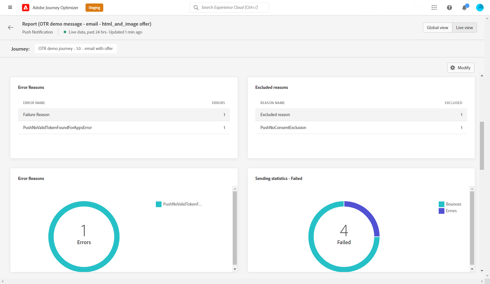

# Live-rapport afdrukken {#push-live-report}

De drukknop **[!UICONTROL Live report]** slechts één specifieke push-service.

Van de **[!UICONTROL Executions]** tabblad van het dialoogvenster **[!UICONTROL Messages]** menu, selecteert u **[!UICONTROL Live view]** Selecteer vervolgens in het geavanceerde menu van de geselecteerde levering **[!UICONTROL Live report]**.

De drukknop **[!UICONTROL Live report]** is verdeeld in verschillende widgets waarin het succes en de fouten van uw levering worden beschreven. Elke widget kan indien nodig worden vergroot of verkleind en verwijderd. Zie voor meer informatie hierover [sectie](live-report.md#modify-dashboard).

**[!UICONTROL Push notification performance]** en **[!UICONTROL Push notification summary]** widgets geven details over de belangrijkste informatie ten opzichte van uw bericht met grafiek en KPIs:

* **[!UICONTROL Sent]**: Het totale aantal verzendt voor de levering.

* **[!UICONTROL Delivered]**: Aantal verzonden berichten.

* **[!UICONTROL Bounces]**: Totaal aantal fouten gecumuleerd tijdens levering en automatische terugkeringsverwerking.

* **[!UICONTROL Errors]**: Het totale aantal fouten dat is opgetreden tijdens een levering waardoor deze niet naar profielen kan worden verzonden.

* **[!UICONTROL Opens]**: Aantal keren dat een bericht in een levering werd geopend.

* **[!UICONTROL Actions]**: Het totale aantal acties op de geleverde pushmelding, bijvoorbeeld klikken op de knop of ontslag.

* **[!UICONTROL Engagements]**: Het totale aantal keren dat wordt geopend en de acties voor deze pushmelding, bijvoorbeeld als het profiel de pushmelding heeft geopend of als op een knop is geklikt.

De **[!UICONTROL Sending metrics - by push]** de tabel geeft het succes van uw levering aan :

* **[!UICONTROL Targeted]**: Aantal gebruikersprofielen dat als doelprofielen voor deze levering in aanmerking komt.

* **[!UICONTROL Excluded]**: Aantal gebruikersprofielen dat is uitgesloten van de doelprofielen en dat het bericht niet heeft ontvangen.

* **[!UICONTROL Sent]**: Het totale aantal verzendt voor de levering.

* **[!UICONTROL Delivered]**: Aantal verzonden berichten.

* **[!UICONTROL Bounces]**: Totaal aantal fouten gecumuleerd tijdens levering en automatische terugkeringsverwerking.

* **[!UICONTROL Errors]**: Het totale aantal fouten dat is opgetreden tijdens een levering waardoor deze niet naar profielen kan worden verzonden.

* **[!UICONTROL Opens]**: Aantal keren dat een bericht in een levering werd geopend.

De **[!UICONTROL Error Reasons]** en **[!UICONTROL Exclude Reasons]** in grafieken en tabellen kunt u zien welke fout en uitsluitingen tijdens de levering zijn opgetreden.

De **[!UICONTROL Sending statistics - Failed]** met widget kunt u zien hoeveel fouten en golven er zijn opgetreden.

De **[!UICONTROL Tracking by platform]**, **[!UICONTROL Sending by platform]** en **[!UICONTROL Breakdown by platform]** in grafieken en tabellen wordt aangegeven hoe succesvol uw pushmelding is, afhankelijk van het besturingssysteem.

