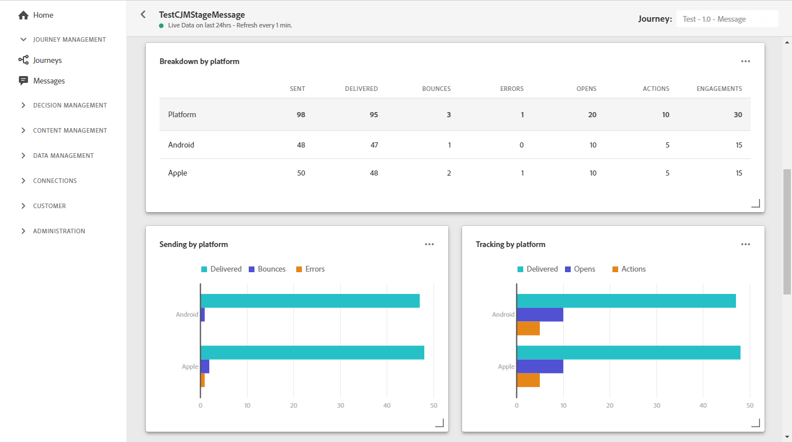

# Live-rapport afdrukken {#push-live-report}

De push **[!UICONTROL Live report]** is slechts gericht op één specifieke pushlevering.

Selecteer **[!UICONTROL Live view]** op het tabblad **[!UICONTROL Executions]** van het menu **[!UICONTROL Messages]** en selecteer **[!UICONTROL Live report]** in het geavanceerde menu van de geselecteerde levering.

De push **[!UICONTROL Live report]** is verdeeld in verschillende widgets waarin het succes en de fouten van uw levering worden beschreven. Elke widget kan indien nodig worden vergroot of verkleind en verwijderd. Voor meer informatie hierover raadpleegt u deze [sectie](live-report.md#modify-dashboard).

**[!UICONTROL Push notification performance]** en  **[!UICONTROL Push notification summary]** widgets geeft de belangrijkste informatie met betrekking tot uw bericht met grafiek en KPIs:

* **[!UICONTROL Sent]**: Het totale aantal verzendt voor de levering.

* **[!UICONTROL Delivered]**: Het aantal berichten dat is verzonden in verhouding tot het totale aantal verzonden berichten.

* **[!UICONTROL Bounces]**: Totaal van fouten die tijdens levering en automatische terugkeerverwerking met betrekking tot het totale aantal verzonden berichten worden gecumuleerd.

* **[!UICONTROL Errors]**: Het totale aantal fouten dat is opgetreden tijdens een levering waardoor deze niet naar profielen kan worden verzonden.

* **[!UICONTROL Opens]**: Aantal keren dat een bericht in een levering werd geopend.

* **[!UICONTROL Actions]**: Het totale aantal acties op de geleverde pushmelding, bijvoorbeeld klikken op de knop of ontslag.

* **[!UICONTROL Engagements]**: Het totale aantal keren dat wordt geopend en de acties voor deze pushmelding, bijvoorbeeld als het profiel de pushmelding heeft geopend of als op een knop is geklikt.

In de tabel **[!UICONTROL Sending metrics - by push]** wordt het succes van de levering beschreven:

* **[!UICONTROL Targeted]**: Aantal gebruikersprofielen dat als doelprofielen voor deze levering in aanmerking komt.

* **[!UICONTROL Excluded]**: Aantal gebruikersprofielen dat is uitgesloten van de doelprofielen en dat het bericht niet heeft ontvangen.

* **[!UICONTROL Sent]**: Het totale aantal verzendt voor de levering.

* **[!UICONTROL Delivered]**: Het aantal berichten dat is verzonden in verhouding tot het totale aantal verzonden berichten.

* **[!UICONTROL Bounces]**: Totaal van fouten die tijdens levering en automatische terugkeerverwerking met betrekking tot het totale aantal verzonden berichten worden gecumuleerd.

* **[!UICONTROL Errors]**: Het totale aantal fouten dat is opgetreden tijdens een levering waardoor deze niet naar profielen kan worden verzonden.

* **[!UICONTROL Opens]**: Aantal keren dat een bericht in een levering werd geopend.

De **[!UICONTROL Tracking by platform]**-, **[!UICONTROL Sending by platform]**- en **[!UICONTROL Breakdown by platform]**-grafieken en -tabellen geven het succes van uw pushmelding weer, afhankelijk van het besturingssysteem.

Met de widget **[!UICONTROL Sending statistics - Failed]** kunt u zien hoeveel fouten en stuitingen zich hebben voorgedaan.

Met de grafiek en tabel **[!UICONTROL Error Reasons]** kunt u zien welke fout is opgetreden tijdens de levering.
