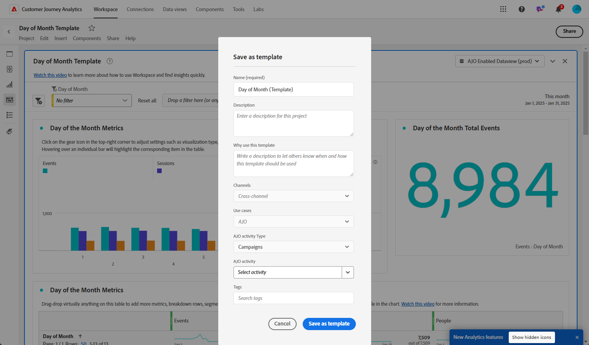

# Uw rapporten beheren {#channel-cja-manage}

## Analyseren in Customer Journey Analytics {#analyze}

>[!AVAILABILITY]
>
> **analyseert in CJA** functionaliteit is exclusief beschikbaar aan gebruikers met a [!DNL Customer Journey Analytics] vergunning.

Verbeter uw gegevensanalysefunctie met uw **[!DNL Customer Journey Analytics]** -licentie door gebruik te maken van de **[!UICONTROL Analyze in CJA]** -functie die in alle rapporten beschikbaar is.

Met deze krachtige optie wordt u naadloos omgeleid naar uw **[!DNL Customer Journey Analytics]** -omgeving, zodat u uw rapporten uitgebreid kunt personaliseren. U kunt uw widgets verrijken met speciale Customer Journey Analytics-meetgegevens, zodat u uw inzichten op een geheel nieuw niveau kunt brengen.

[&#x200B; leer meer over de interface van Customer Journey Analytics.](https://experienceleague.adobe.com/nl/docs/analytics-platform/using/cja-overview/cja-getting-started)

## De rapportperiode definiëren {#report-period}

Wanneer het toegang tot van tot een rapport, kunt u een filter van de tijdperiode toepassen, dat bij de hoogste juiste hoek van het rapport wordt gevestigd.

De filterperiode voor een campagne of reis wordt standaard ingesteld op de begin- en einddatum. Als er geen einddatum is, wordt het filter standaard ingesteld op de huidige datum.

Als u het filter wilt wijzigen, selecteert u een aangepaste begindatum en -duur of kiest u een van de vooraf ingestelde opties, zoals vorige week of twee maanden geleden.

Het rapport wordt automatisch bijgewerkt wanneer het filter wordt toegepast of gewijzigd.

## Uw rapporten exporteren {#export-reports}

U kunt uw verschillende rapporten eenvoudig exporteren naar PDF- of CSV-indelingen, zodat u deze kunt delen of afdrukken. De stappen voor het exporteren van rapporten worden in de onderstaande tabbladen beschreven.

>[!BEGINTABS]

>[!TAB  Uitvoer uw rapport als Csv- dossier ]

1. Klik in uw rapport op **[!UICONTROL Share]** en selecteer **[!UICONTROL Download CSV]** om een CSV-bestand op algemeen rapportniveau te genereren.

   

1. Het bestand wordt automatisch gedownload en kan zich in uw lokale bestanden bevinden.

   Als u het bestand op rapportniveau hebt gegenereerd, bevat het gedetailleerde informatie voor elke widget, inclusief de titel en gegevens.

>[!TAB  Uitvoer uw rapport als dossier van PDF ]

1. Klik in uw rapport op **[!UICONTROL Share]** en selecteer **[!UICONTROL Downalod PDF]** .

   

1. Klik op **[!UICONTROL Download]** nadat het downloaden is aangevraagd.

   

1. Het bestand wordt automatisch geopend in uw browser.

Uw rapport is nu beschikbaar voor weergave, downloaden of delen in een PDF-bestand.

>[!ENDTABS]

## Uitvoer plannen {#schedule-export}

De **uitvoer van het Programma** laat u de levering van tot 10 rapporten met wekelijkse, maandelijkse of jaarlijkse intervallen automatiseren. U kunt uw geplande rapporten ook eenvoudig beheren met opties om uw geplande exportbewerkingen bij te werken, te bewerken, te annuleren of te verwijderen.

1. Klik in uw rapport op **[!UICONTROL Share]** en selecteer **[!UICONTROL Schedule export]** .

   

1. Kies uw **[!UICONTROL File type]** tussen CSV en PDF.

1. Indien nodig kunt u een **[!UICONTROL Description]** toevoegen aan de exportbewerking.

1. Voer de naam in van de ontvangers die deze automatische levering zullen ontvangen.

   

1. Kies de **[!UICONTROL Frequency]** .

1. Verstrek op basis van de geselecteerde frequentie de relevante planningsdetails, zoals:

   * Begin- en einddatum

   * Interval (bv. elke paar weken)

   * Specifieke dag van de week

   * Week binnen de maand

   * Dag binnen de maand

   * Maand van het jaar

1. Klik op **[!UICONTROL Send on schedule]**.

1. Als u eerder gemaakte geplande export wilt bewerken, klikt u op **[!UICONTROL Share]** en selecteert u **[!UICONTROL Manage schedules]** .

   

1. Kies in de lijst met geplande exportbewerkingen de exportcode die u wilt bijwerken en breng de gewenste wijzigingen aan.

1. Als u een gepland rapport wilt verwijderen, selecteert u een rapport in de lijst met beheerde programma&#39;s en klikt u op **[!UICONTROL Delete]** .

   

## Een eenvoudige metrische methode maken {#create-simple-metric}

U kunt aangepaste berekende metriek rechtstreeks in uw rapporten maken. U kunt meer op maat gesneden inzichten produceren en beter uw gegevens analyseren door twee bestaande metriek op manieren te combineren die uw specifieke rapporteringsbehoeften aanpassen.

1. Begin door tot het rapport toegang te hebben waar u nieuwe metrisch wilt toevoegen.

1. Selecteer in de tabel in uw rapport de gewenste maateenheden door de toetsen `Shift` of `CTRL/CMD` ingedrukt te houden terwijl u erop klikt. Klik vervolgens met de rechtermuisknop en selecteer **[!UICONTROL Create metric from selection]** .

   Als u meer dan twee metriek selecteert, slechts zullen eerste twee in metrische bouwer worden gebruikt.

   

1. Typ in het veld Berekende metrische constructor een naam voor de nieuwe metrische waarde door in het veld **[!UICONTROL Title]** te typen. U kunt ook een **[!UICONTROL Description]** toevoegen.

   >[!NOTE]
   >
   >Als u Customer Journey Analytics hebt, kunt u uw metriek verder aanpassen met extra opties. [Meer informatie](https://experienceleague.adobe.com/nl/docs/analytics-platform/using/cja-components/cja-calcmetrics/cm-workflow/cm-build-metrics#areas-of-the-calculated-metrics-builder)

1. Kies de juiste **[!UICONTROL Decimal Places]** en selecteer een **[!UICONTROL Format]** (Decimaal, Tijd, Percentage of Valuta) op basis van de manier waarop u de metrische waarde wilt weergeven.

1. Selecteer de operator, zoals optellen, aftrekken, vermenigvuldigen of delen, die bepaalt hoe de metrische waarde wordt berekend.

   

1. U kunt de componenten desgewenst opnieuw rangschikken.

1. Als u tevreden bent met de instellingen, klikt u op **[!UICONTROL Apply]** om de nieuwe metrische gegevens te voltooien.

1. Uw nieuwe metrisch zal naast de originele metriek in uw rapport verschijnen.

   

Uw nieuwe metrisch zal worden omvat wanneer u het rapport als PDF of CSV uitvoert. Deze wordt echter uit het rapport verwijderd wanneer u het rapport afsluit.

## Gegevens verkennen met de Insight builder {#exploratory}

Met het gereedschap Insight Builder kunt u eenvoudig tabellen en visualisaties maken op basis van de geselecteerde **[!UICONTROL Dimensions]** en **[!UICONTROL Metrics]** . Met dit gereedschap stroomlijnt u de gegevensverkenning, zodat u de gegevens eenvoudig kunt aanpassen en analyseren. Leer meer in [&#x200B; deze documentatie &#x200B;](https://experienceleague.adobe.com/nl/docs/analytics/analyze/analysis-workspace/panels/quickinsight).

1. Begin door tot het rapport toegang te hebben waar u de bouwer van Insight wilt gebruiken.

1. Selecteer het Insight builder-menu in het menu left-rail.

   

1. Bouw een vraag door **[!UICONTROL Dimension]** en **[!UICONTROL Metric]** te kiezen gebruikend de drop-down menu&#39;s. U kunt ook een **[!UICONTROL Segment]** selecteren, indien nodig.

   

1. Definieer het datumbereik voor de analyse om de periode op te geven waarop u wilt scherpstellen. Standaard wordt het datumbereik ingesteld op het bereik dat wordt gebruikt in het rapportvenster.

1. Gebruik de opties **[!UICONTROL Add breakdown]** of **[!UICONTROL Add metric]** om extra afmetingen op te nemen, zodat u gedetailleerdere gegevens kunt uitsplitsen.

   U kunt maximaal drie **[!UICONTROL Dimensions]** , **[!UICONTROL Metrics]** en **[!UICONTROL Segments]** toevoegen.

U kunt uw gegevens nu analyseren met de aangepaste gereedschappen voor tabel en visualisatie.

<!--## Create a down-funnel metric {#down-funnel}

1. Create a new journey or open an existing one. [Learn more about journey creation](../building-journeys/journey-gs.md)

1. On the canvas editor, select the option to "add a metric".

c. In the metric selector, choose whichever conversion metric seems appropriate and publish your journey

d. Open the report for the journey that you added the metric to and ensure that the metric has been added to the table alongside all the other pre-configured metrics.
-->

## Een publiek maken van de rapportgegevens {#create-audience}

>[!IMPORTANT]
>
>Elke organisatie is beperkt tot het publiceren van 25 soorten publiek. Bovendien kunnen gebruikers maximaal 5 soorten publiek per uur en 20 personen per dag publiceren.
>&#x200B;> Eenmalig publiek heeft een levensduur van 48 uur. Als er binnen die termijn 25 soorten publiek worden gepubliceerd, kunnen extra soorten publiek daarom pas worden gepubliceerd nadat de periode van 48 uur is verstreken.

U kunt nu specifieke gegevens in de tabel selecteren en rechtstreeks een publiek maken op basis van deze selecties, zodat het proces voor het maken van een publiek wordt gestroomlijnd en vereenvoudigd.

1. Begin door aan de rapportlijst te navigeren die de gegevens bevat u in een publiek wilt omzetten.

1. Klik met de rechtermuisknop op de gewenste cel en selecteer **[!UICONTROL Create audience]** .

   U kunt ook het maken van een publiek starten vanuit de **[!UICONTROL Journey canvas]** -widget door een knooppunt te selecteren en er met de rechtermuisknop op te klikken.

1. Voer in het venster **[!UICONTROL Create audience]** een **[!UICONTROL Name]** in en stel een **[!UICONTROL One-time date range]** in voor het publiek dat u wilt publiceren.

   >[!NOTE]
   >
   >Als u Customer Journey Analytics hebt, kunt u uw metriek verder aanpassen met extra opties. [Meer informatie](https://experienceleague.adobe.com/nl/docs/analytics-platform/using/cja-components/audiences/publish)

   

1. Klik op de knop **[!UICONTROL Create]** om het publiek te maken. Dit proces kan enige tijd duren.

U kunt nu doorgaan en het nieuwe publiek gebruiken met een reis of campagne.

## Sjablonen beheren {#cja-template}

>[!AVAILABILITY]
>
> De **functionaliteit van het Malplaatje** wordt geleidelijk ingevoerd in fasen, met volledige Algemene Beschikbaarheid die tegen eind Januari wordt gepland, en exclusief beschikbaar aan gebruikers met a [!DNL Customer Journey Analytics] vergunning.

Je hebt nu de mogelijkheid om je Journey Optimizer-rapporten te verbeteren met behulp van Customer Journey Analytics-sjablonen. [&#x200B; Leer meer over het malplaatje van Customer Journey Analytics &#x200B;](https://experienceleague.adobe.com/nl/docs/analytics-platform/using/cja-workspace/templates/use-templates#use-reports)

Wanneer u rapporten opent, kunt u kiezen uit twee sjabloontypen in het vervolgkeuzemenu **[!UICONTROL Select a template]** :

* Door Adobe verschafte standaardsjabloon
* Door de klant gegenereerde sjablonen

Als er geen sjabloon is gemaakt, wordt het vervolgkeuzemenu **[!UICONTROL Select a template]** niet weergegeven in de rapportinterface.

Voer de volgende stappen uit om een sjabloon te maken:

1. Navigeer in [!DNL Customer Journey Analytics] naar het menu **[!UICONTROL Workspace]** en selecteer **[!UICONTROL Adobe templates]** . [&#x200B; leer meer over de beschikbare malplaatjes &#x200B;](https://experienceleague.adobe.com/nl/docs/analytics-platform/using/cja-workspace/templates/use-templates#available-templates)

1. Blader door de beschikbare vooraf gebouwde sjablonen en klik op **[!UICONTROL Use template]** om deze te selecteren.

   

1. Pas uw rapport aan uw behoeften aan. Verwijs naar [&#x200B; documentatie van Customer Journey Analytics &#x200B;](https://experienceleague.adobe.com/nl/docs/analytics-platform/using/cja-workspace/home).

1. Zodra uw aangepaste sjabloon is voltooid, opent u het menu **[!UICONTROL Project]** en selecteert u **[!UICONTROL Save as template]** .

   

1. Geef de benodigde gegevens voor de template op. Verwijs naar [&#x200B; documentatie van Customer Journey Analytics &#x200B;](https://experienceleague.adobe.com/nl/docs/analytics-platform/using/cja-workspace/templates/create-templates#edit-or-delete-a-template) voor de gedetailleerde informatie.

   >[!IMPORTANT]
   >
   > Zorg ervoor om **Journey Optimizer** onder **[!UICONTROL Use cases]** te kiezen en het overeenkomstige **de activiteitstype van Journey Optimizer** en **activiteit** te specificeren. Zo wordt je rapport weergegeven in Journey Optimizer.

   

1. Open in [!DNL Journey Optimizer] uw rapport en kies de eerder gemaakte sjabloon in het vervolgkeuzemenu **[!UICONTROL Select a template]** .

   

Als u rechtstreeks een sjabloon wilt maken op basis van uw rapport Reis optimizer, opent u gewoon uw campagne- of reisrapport en selecteert u **[!UICONTROL Analyze in CJA]** en past u de standaardsjabloon aan door de hierboven beschreven stappen te volgen.
