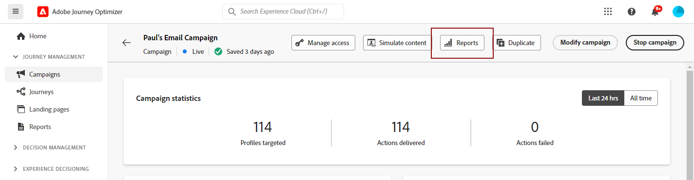

# Ga aan de slag met de nieuwe rapportinterface {#channel-report-gs-cja}

>[!NOTE]
>
> Als u wilt terugkeren naar de traditionele rapportage van Journey Optimizer, schakelt u gewoon de **[!UICONTROL Use new Experience]** -optie.

Journey Optimizer-rapportering wordt geleverd met een verbeterde interoperabiliteit met de mogelijkheden van de Customer Journey Analytics, standaardisering van de rapportage op beide platforms en verbetering van de consistentie en betrouwbaarheid van de gegevens. Deze naadloze integratie tussen Journey Optimizer en Customer Journey Analytics biedt een duidelijker beeld van prestatiesmetriek, toelatend gebruikers om geïnformeerde besluiten te nemen.

* Als u een reis of leveringen in het kader van een reis wilt richten, vanaf **[!UICONTROL Journeys]** en klik op de knop **[!UICONTROL View report]** knop.

  In de lijst met bestaande reizen kunt u ook **[!UICONTROL Report]** in het geavanceerde menu van de geselecteerde reis. [Meer informatie over het rapport Journey](journey-global-report-cja.md)

  

* Als u een campagne wilt richten, van **[!UICONTROL Campaigns]** , opent u uw campagne en klikt u op **[!UICONTROL Reports]** knop.

  In de lijst met bestaande campagnes kunt u ook **[!UICONTROL Report]** in het geavanceerde menu van de geselecteerde campagne. [Meer informatie over het campagnerapport](campaign-global-report-cja.md)

  

* Als u metriek voor alle campagnes en reizen binnen uw milieu wilt richten, toegang tot **Overzicht** rapport door naar de **[!UICONTROL Reports]** in het menu **[!UICONTROL Journey Management]** sectie. [Meer informatie over het overzichtsrapport](channel-report-cja.md)

  

## Vereisten {#prerequisites}

* Als u **niet** eigen Customer Journey Analytics, of als u er eigenaar van bent, maar wel **niet** toegang hebben tot elk productprofiel van een Customer Journey Analytics. De machtigingen worden beheerd in Journey Optimizer. In dit geval hebt u alleen de opdracht **[!UICONTROL View channel reports]** machtiging of verwante rollen. [Meer informatie over Journey Optimizer-machtigingen](../administration/permissions.md)
* Als u Customer Journey Analytics bezit en toegang tot een het productprofiel van de Customer Journey Analytics hebt, dan zijn de standaardtoestemmingen van de Customer Journey Analytics van toepassing. De beheerder van de Customer Journey Analytics is verantwoordelijk voor het handhaven van juiste gebruikerstoegang. [Meer informatie over machtigingen voor Customers Journey Analytics](https://experienceleague.adobe.com/en/docs/analytics-platform/using/technotes/access-control)
* Uw gegevensmeningen van de Customer Journey Analytics moeten met het volgende plaatsen worden gevormd: **Instellen als standaardgegevensweergave in Adobe Journey Optimizer**. [Meer informatie over gegevensweergaven](https://experienceleague.adobe.com/en/docs/analytics-platform/using/cja-dataviews/create-dataview)
* Als u toegang wilt tot het dashboard voor Customers Journey Analytics in Journey Optimizer, schakelt u het **[!UICONTROL Use new Experience]** knevel in uw rapport.

  

## Hoe kan ik-video{#video}

In de onderstaande video ziet u hoe u de **Toepassingsconfiguratie beheren** machtiging om het menu met toepassingsoppervlakken te openen.

>[!VIDEO](https://video.tv.adobe.com/v/3430413)