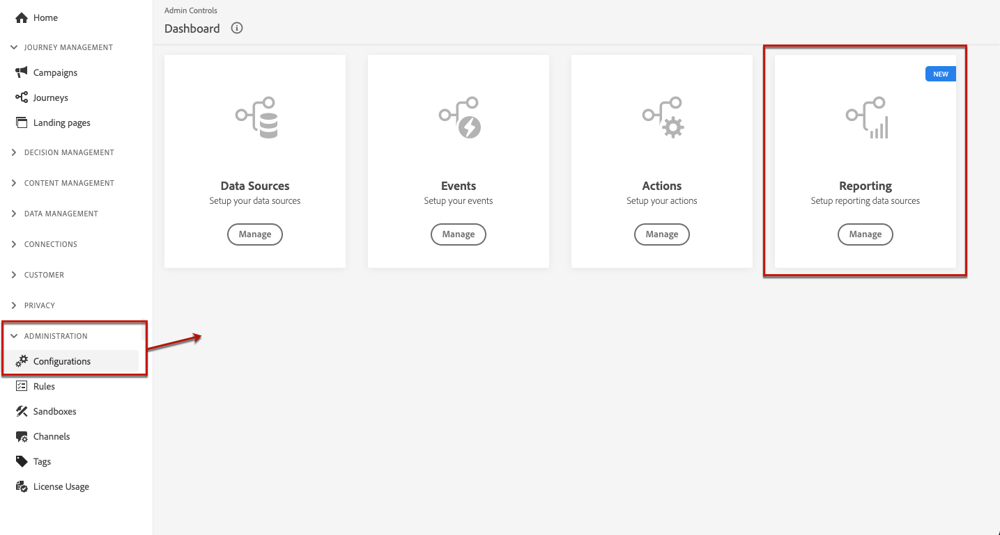
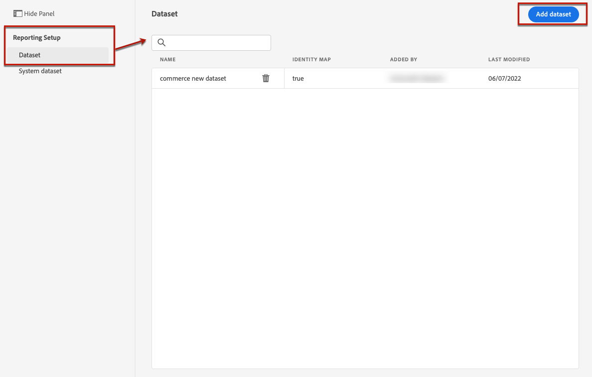
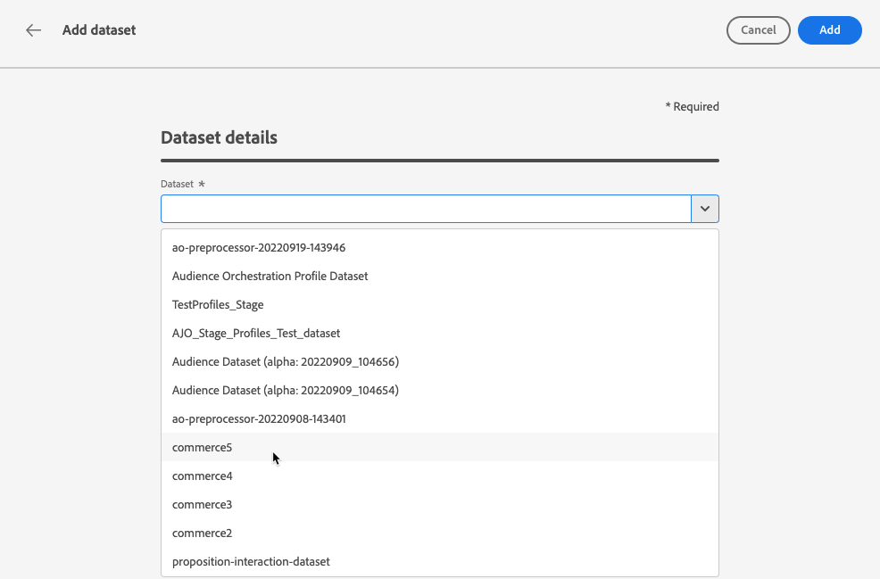

# Voorwaarden voor rapportage en experimenten {#reporting-configuration}

>[!CONTEXTUALHELP]
>id="ajo_admin_reporting_config"
>title="Gegevenssets instellen voor rapportage"
>abstract="De rapporteringsconfiguratie staat u toe om extra metriek terug te winnen die in uw campagnerapporten zal worden gebruikt. Het moet door een technische gebruiker worden uitgevoerd."

>[!CONTEXTUALHELP]
>id="ajo_admin_reporting_dataset"
>title="Een gegevensset selecteren"
>abstract="U kunt slechts een gebeurtenis-type dataset selecteren, die minstens één van de gesteunde gebiedsgroepen moet bevatten: de Details van de Toepassing, de Details van Commerce, de Details van het Web."

>[!NOTE]
>
>De rapportconfiguratie moet door een technische gebruiker worden uitgevoerd.

De rapporterende gegevensbronconfiguratie staat u toe om een verbinding aan een systeem te bepalen om extra informatie terug te winnen die in uw rapporten zal worden gebruikt.

Voor deze configuratie, moet u één of meerdere datasets toevoegen die de extra elementen bevatten die u voor uw rapporten wilt gebruiken. Om dit te doen, volg de stappen [&#x200B; hieronder &#x200B;](#add-datasets).

Merk op dat voor Web, op code-gebaseerd en in-app kanalen, u moet ervoor zorgen de [&#x200B; dataset &#x200B;](../data/get-started-datasets.md) wordt gevormd voor gegevensinzameling ook toegevoegd aan deze rapporteringsconfiguratie. Anders worden web- en In-app-gegevens niet weergegeven in de rapporten over het experimenteren met inhoud.

## Vereisten

Alvorens een dataset aan de rapporteringsconfiguratie toe te voegen, moet u die dataset tot stand brengen. Leer hoe in de [&#x200B; documentatie van Adobe Experience Platform &#x200B;](https://experienceleague.adobe.com/docs/experience-platform/catalog/datasets/user-guide.html?lang=nl-NL#create){target="_blank"}.

* U kunt alleen gebeurtenistypen toevoegen.

* Deze datasets moeten de `Experience Event - Proposition Interactions` [&#x200B; gebiedsgroep &#x200B;](https://experienceleague.adobe.com/docs/experience-platform/xdm/tutorials/create-schema-ui.html?lang=nl-NL#field-group){target="_blank"} omvatten.

* Deze datasets kunnen één van de volgende [&#x200B; gebiedsgroepen &#x200B;](https://experienceleague.adobe.com/docs/experience-platform/xdm/tutorials/create-schema-ui.html?lang=nl-NL#field-group){target="_blank"} ook bevatten: `Application Details`, `Commerce Details`, `Web Details`.

  >[!NOTE]
  >
  >Andere veldgroepen kunnen ook worden opgenomen, maar momenteel worden alleen de bovenstaande veldgroepen ondersteund in Journey Optimizer-rapportage.

  Als u bijvoorbeeld wilt weten wat het effect is van een e-mailcampagne op handelsgegevens zoals aankopen of bestellingen, moet u een dataset voor ervaringsgebeurtenissen maken met de veldgroep `Commerce Details` .

  Op dezelfde manier, als u over mobiele interactie wilt rapporteren, moet u een dataset van de ervaringsgebeurtenis met de `Application Details` gebiedsgroep tot stand brengen.

  <!--The metrics corresponding to each field group are listed [here](#objective-list).-->

* U kunt deze gebiedsgroepen aan één of verscheidene schema&#39;s toevoegen die in één of verscheidene datasets zullen worden gebruikt.

>[!NOTE]
>
>Leer meer over schema&#39;s XDM en gebiedsgroepen in de [&#x200B; XDM het overzichtsdocumentatie van het Systeem &#x200B;](https://experienceleague.adobe.com/docs/experience-platform/xdm/home.html?lang=nl){target="_blank"}.

<!--
## Objectives corresponding to each field group {#objective-list}

The table below shows which metrics will be added to the **[!UICONTROL Objectives]** tab of your campaign reports for each field group.

| Field group | Objectives |
|--- |--- |
| Commerce Details | Price Total Payment Amount (Unique) Checkouts (Unique) Product List Adds (Unique) Product List Opens (Unique) Product List Removal (Unique) Product List Views (Unique) Product Views (Unique) Purchases (Unique) Save For Laters Product Price Total Product Quantity |
| Application Details | (Unique) App Launches First App Launches (Unique) App Installs (Unique) App Upgrades |
| Web Details | (Unique) Page Views |
-->

## Gegevenssets toevoegen {#add-datasets}

>[!NOTE]
>
>Nieuwe gegevenssets zijn alleen beschikbaar in Customer Journey Analytics-rapporten.

1. Selecteer **[!UICONTROL Administration]** in het menu **[!UICONTROL Configurations]** . Klik in de sectie **[!UICONTROL Reporting]** op **[!UICONTROL Manage]** .

   

   De lijst met gegevenssets die al zijn toegevoegd, wordt weergegeven.

1. Klik op het tabblad **[!UICONTROL Dataset]** op **[!UICONTROL Add dataset]**.

   

   >[!NOTE]
   >
   >Als u het tabblad **[!UICONTROL System dataset]** selecteert, worden alleen gegevenssets weergegeven die door het systeem zijn gemaakt. U kunt geen andere datasets toevoegen.

1. Van de **[!UICONTROL Dataset]** drop-down lijst, selecteer de dataset die u voor uw rapporten wilt gebruiken.

   >[!CAUTION]
   >
   >U kunt slechts een gebeurtenis-type dataset selecteren, die minstens één van de gesteunde [&#x200B; gebiedsgroepen &#x200B;](https://experienceleague.adobe.com/docs/experience-platform/xdm/tutorials/create-schema-ui.html?lang=nl-NL#field-group){target="_blank"} moet bevatten: **de Details van de Toepassing**, **Details van Commerce**, **Details van het Web**. Als u een dataset selecteert die die criteria niet aanpast, zult u uw veranderingen niet kunnen bewaren.

   

   Leer meer over datasets in de [&#x200B; documentatie van Adobe Experience Platform &#x200B;](https://experienceleague.adobe.com/docs/experience-platform/catalog/datasets/overview.html?lang=nl-NL){target="_blank"}.

1. Selecteer in de vervolgkeuzelijst **[!UICONTROL Profile ID]** het kenmerk Gegevenssetveld dat wordt gebruikt om elk profiel in uw rapporten te identificeren.

   

   >[!NOTE]
   >
   >Alleen beschikbare id&#39;s voor rapportage worden weergegeven.

1. De optie **[!UICONTROL Use Primary ID namespace]** is standaard ingeschakeld. Als de geselecteerde **[!UICONTROL Profile ID]** **[!UICONTROL Identity Map]** is, kunt u deze optie uitschakelen en een andere naamruimte kiezen in de vervolgkeuzelijst die wordt weergegeven.

   

   Leer meer over namespaces in de [&#x200B; documentatie van Adobe Experience Platform &#x200B;](https://experienceleague.adobe.com/docs/experience-platform/identity/namespaces.html?lang=nl){target="_blank"}.

1. Sparen uw veranderingen om de geselecteerde dataset aan de rapportconfiguratielijst toe te voegen.

   >[!CAUTION]
   >
   >Als u een dataset selecteerde die geen gebeurtenis-type is, zult u niet kunnen te werk gaan.

<!--
When building your campaign reports, you can now see the metrics corresponding to the field groups used in the datasets you added. Go to the **[!UICONTROL Objectives]** tab and select the metrics of your choice to better fine-tune your reports. [Learn more](content-experiment.md#objectives-global)

>[!NOTE]
>
>If you add several datasets, all data from all datasets will be available for reporting.

## How-to video {#video}

Understand how to configure Experience Platform reporting data sources.

>[!VIDEO]()
-->
