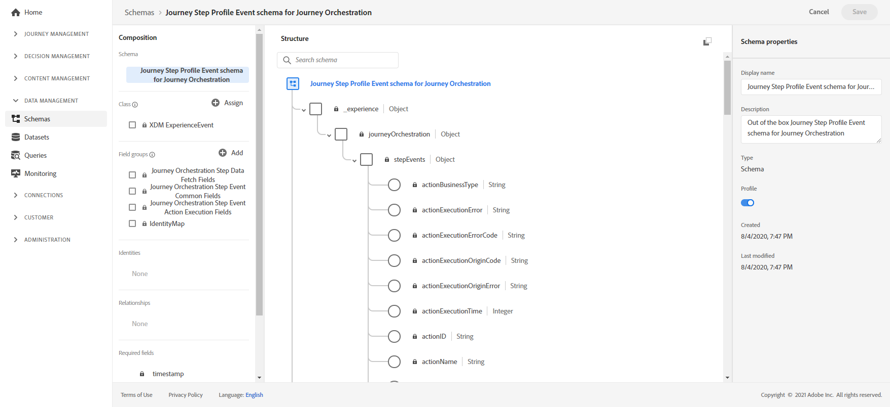

# Reisrapporten maken{#design-jo-reports}

Naast [real-time rapporten](live-report.md) en ingebouwde [global reporting mogelijkheden](global-report.md), kan [!DNL Journey Optimizer] automatisch gegevens over de reisprestaties naar Adobe Experience Platform verzenden, zodat deze met andere gegevens voor analysedoeleinden kunnen worden gecombineerd.

>[!NOTE]
>
>Deze eigenschap wordt niet geactiveerd door gebrek op alle onlangs opgezette instanties. De activering vindt plaats op verzoek.

U hebt bijvoorbeeld een reis ingesteld die meerdere e-mails verzendt. Met deze functie kunt u [!DNL Journey Optimizer]-gegevens combineren met gegevens over gebeurtenissen in de downstream, zoals hoeveel conversies er hebben plaatsgevonden, hoeveel betrokkenheid er op de website heeft plaatsgevonden of hoeveel transacties er in de winkel hebben plaatsgevonden. De informatie over de reis kan worden gecombineerd met gegevens over Adobe Experience Platform, hetzij van andere digitale eigenschappen, hetzij van offline eigenschappen, voor een uitgebreider beeld van de prestaties.

[!DNL Journey Optimizer] leidt automatisch tot de noodzakelijke schema&#39;s en stromen in datasets aan Adobe Experience Platform voor elke stap een individu in een reis neemt. Een step-gebeurtenis komt overeen met een individuele gebeurtenis die zich tijdens een rit van het ene knooppunt naar het andere verplaatst. Bijvoorbeeld, in een reis die een gebeurtenis, een voorwaarde en een actie heeft, worden de drie stapgebeurtenissen verzonden naar Adobe Experience Platform.

De lijst met XDM-velden die worden doorgegeven, is uitgebreid. Sommige bevatten door het systeem gegenereerde codes en andere hebben door mensen leesbare vriendelijke namen. Voorbeelden zijn het etiket van de reisactiviteit of de stapstatus: hoe vaak een time-out of een fout is opgetreden.

>[!CAUTION]
>
>Datasets kunnen niet worden ingeschakeld voor realtime profielservice. Controleer of de schakeloptie **[!UICONTROL Profile]** is uitgeschakeld.

De reizen verzenden gegevens aangezien het voorkomt, op een het stromen manier. U kunt deze gegevens vragen met de Query-service. U kunt verbinding maken met Customer Journey Analytics of andere BI-gereedschappen om gegevens met betrekking tot deze stappen weer te geven.

De volgende schema&#39;s worden gemaakt:

* Gebeurtenissenschema voor trede-stapprofiel voor [!DNL Journey Orchestration] - Ervaar gebeurtenissen voor stappen die in een reis samen met een identiteitskaartje zijn uitgevoerd en die moeten worden gebruikt voor toewijzing aan een individuele deelnemer aan de reis.
* Gebeurtenisschema voor stap van de reis voor [!DNL Journey Orchestration] - gebeurtenis van de stap van de reis die aan een Meta-gegevens van de Reis wordt gebonden.
* Reisschema met reisvelden voor [!DNL Journey Orchestration] - Reismetagegevens om reizen te beschrijven.

De volgende datasets worden overgegaan:

* Gebeurtenisschema voor stapsgewijze reis voor [!DNL Journey Orchestration]
* Gebeurtenissen reisstap
* Journeys

De lijsten van XDM gebieden die tot Adobe Experience Platform worden overgegaan zijn hier gedetailleerd:

* [journeySteps-gebeurtenissen - gemeenschappelijke velden](../reports/sharing-common-fields.md)
* [journeyStep-gebeurtenissen - velden voor het uitvoeren van acties](../reports/sharing-execution-fields.md)
* [journeyStep-gebeurtenissen - velden voor het ophalen van data](../reports/sharing-fetch-fields.md)
* [journeyStep-gebeurtenissen - identiteitsvelden](../reports/sharing-identity-fields.md)
* [journeyvelden](../reports/sharing-journey-fields.md)

Bekijk deze [zelfstudie video](https://experienceleague.adobe.com/docs/journey-orchestration-learn/tutorials/reporting-step-events-to-adobe-experience-platform.html) voor meer informatie over stapgebeurtenissen die aan Adobe Experience Platform worden gerapporteerd.
