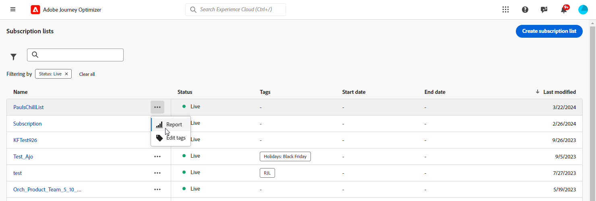
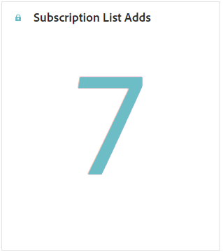

# Abonnementsrapport {#subscription-report-global-cja}

Het **rapport van het Abonnement** biedt essentiële inzichten in de abonnementen van profielen en abonnementen verbonden aan bijzondere lijsten aan, die u helpen de doeltreffendheid van verschillende abonnementscampagnes en initiatieven in het drijven van overeenkomst en omzettingen begrijpen.

Als u rapporten wilt openen, klikt u op het pictogram **[!UICONTROL Report]** van de lijst met abonnementen die u hebt geselecteerd in het menu Geavanceerd.

Meer over de werkruimte van Customer Journey Analytics leren en hoe te om gegevens te filtreren en te analyseren, verwijs naar [&#x200B; deze pagina &#x200B;](https://experienceleague.adobe.com/nl/docs/analytics-platform/using/cja-workspace/home).

## Toegevoegde lijst met abonnementen

De PKI van **[!UICONTROL Subscription list adds]** verstrekt een uitvoerig overzicht van het totale aantal abonnementen die tijdens de gespecificeerde periode worden verworven. Deze metrische meting benadrukt de groei en de verwerving van nieuwe abonnees, die waardevolle inzichten in de doeltreffendheid van uw abonnementscampagnes of initiatieven aanbieden.

## Lijst met abonnementen wordt verwijderd

De PKI van **[!UICONTROL Subscription list removes]** verstrekt een onderverdeling van het totale aantal ophoudingen die tijdens de gespecificeerde periode voorkwamen. Deze metrisch biedt waardevolle inzichten in abonneeafstand aan.

## Toename van abonnementen in de loop der tijd

De grafiek **[!UICONTROL Subscription growth over time]** geeft visueel de voortgang van abonnementen gedurende de opgegeven periode weer, zodat u duidelijk kunt zien hoe uw abonneebasis zich heeft ontwikkeld.

* **[!UICONTROL Subscription list adds]**: het totale aantal abonnementen voor de betrokken periode.

* **[!UICONTROL Subscription list removes]**: het totale aantal opnemingen voor de betrokken periode.

* **[!UICONTROL Subscription list growth]**: de snelheid waarmee de abonneelijst gedurende een bepaalde periode groeit.

## Abonnementenlijsten

De tabel **[!UICONTROL Subscription lists]** biedt essentiële inzichten in de abonnementen en afkortingen van uw profielen die aan bepaalde abonnementenlijsten zijn gekoppeld. Deze informatie helpt u de doeltreffendheid van verschillende abonnementenlijsten in het drijven overeenkomst en omzettingen begrijpen.

* **[!UICONTROL Subscription list adds]**: het totale aantal abonnementen voor de betrokken periode.

* **[!UICONTROL Subscription list removes]**: het totale aantal opnemingen voor de betrokken periode.

## Journeys

De tabel van **[!UICONTROL Journey]** biedt een uitgebreide weergave, waarin complexe details van de abonnementen van uw bezoekers worden weergegeven als onderdeel van hun gebruikersreis.

* **[!UICONTROL Subscription list adds]**: het totale aantal abonnementen voor de betrokken periode.

* **[!UICONTROL Subscription list removes]**: het totale aantal opnemingen voor de betrokken periode.

## Campagnes

De tabel **[!UICONTROL Campaigns]** biedt waardevolle inzichten in de abonnementen en abonnementen van uw profielen die worden geactiveerd door specifieke campagnes. In deze uitgebreide weergave kunt u de doeltreffendheid van uw campagnes meten en de betrokkenheid met de inhoud van uw bestemmingspagina effectief volgen.

* **[!UICONTROL Subscription list adds]**: het totale aantal abonnementen voor de betrokken periode.

* **[!UICONTROL Subscription list removes]**: het totale aantal opnemingen voor de betrokken periode.

## Kanaal

In de tabel **[!UICONTROL Channel]** wordt het aantal abonnementen en abonnementen voor profielen weergegeven dat door elk kanaal wordt gecategoriseerd.

* **[!UICONTROL Subscription list adds]**: het totale aantal abonnementen voor de betrokken periode.

* **[!UICONTROL Subscription list removes]**: het totale aantal opnemingen voor de betrokken periode.
