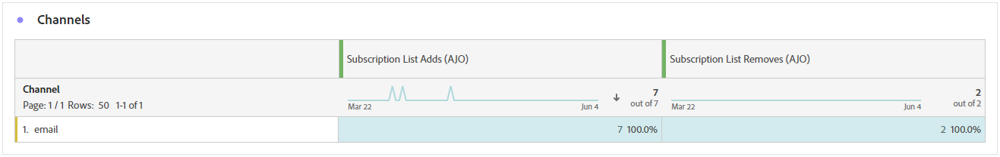

# Abonnementsrapport {#subscription-report-global-cja}

De **Abonnementsrapport** biedt essentiële inzichten in de abonnementen en abonnementen van profielen die bij bepaalde lijsten horen, zodat u de doeltreffendheid van verschillende abonnementscampagnes en -initiatieven voor het aansturen van betrokkenheid en conversies begrijpt.

Klik op de knop **[!UICONTROL Report]** pictogram van uw geselecteerde abonnementenlijst van het geavanceerde menu.

Voor meer informatie over de werkruimte van de Customer Journey Analytics en over het filteren en analyseren van gegevens raadpleegt u [deze pagina](https://experienceleague.adobe.com/en/docs/analytics-platform/using/cja-workspace/home).

## Toegevoegde lijst met abonnementen

De **[!UICONTROL Subscription list adds]** KPI biedt een uitgebreid overzicht van het totale aantal abonnementen dat gedurende de opgegeven periode is verworven. Deze metrische meting benadrukt de groei en de verwerving van nieuwe abonnees, die waardevolle inzichten in de doeltreffendheid van uw abonnementscampagnes of initiatieven aanbieden.

## Lijst met abonnementen wordt verwijderd

De **[!UICONTROL Subscription list removes]** De KPI geeft een uitsplitsing van het totale aantal afboekingen tijdens de opgegeven periode. Deze metrisch biedt waardevolle inzichten in abonneeafstand aan.

## Toename van abonnementen in de loop der tijd

De **[!UICONTROL Subscription growth over time]** de grafiek toont visueel de vooruitgang van abonnementen over de gespecificeerde periode, die een duidelijk inzicht verstrekt in hoe uw abonneebasis zich heeft ontwikkeld.

* **[!UICONTROL Subscription list adds]** Totaal aantal abonnementen voor de betrokken periode.

* **[!UICONTROL Subscription list removes]** Totaal aantal afschrijvingen voor de betrokken periode.

* **[!UICONTROL Subscription list growth]**: Het tarief waaraan de abonneelijst over een specifieke periode groeit.

## Abonnementenlijsten

De **[!UICONTROL Subscription lists]** de lijst verstrekt essentiële inzichten in de abonnementen van uw profielen en de abonnementen die met bepaalde abonnementenlijsten worden geassocieerd. Deze informatie helpt u de doeltreffendheid van verschillende abonnementenlijsten in het drijven overeenkomst en omzettingen begrijpen.

* **[!UICONTROL Subscription list adds]** Totaal aantal abonnementen voor de betrokken periode.

* **[!UICONTROL Subscription list removes]** Totaal aantal afschrijvingen voor de betrokken periode.

## Journeys

De **[!UICONTROL Journey]** de tabel biedt een uitgebreid overzicht , waarin complexe details van de abonnementen van uw bezoekers worden gepresenteerd als onderdeel van hun gebruikersreis .

* **[!UICONTROL Subscription list adds]** Totaal aantal abonnementen voor de betrokken periode.

* **[!UICONTROL Subscription list removes]** Totaal aantal afschrijvingen voor de betrokken periode.

## Campagnes

De **[!UICONTROL Campaigns]** tabel biedt waardevolle inzichten in de abonnementen en abonnementen van uw profielen die door specifieke campagnes worden geactiveerd. In deze uitgebreide weergave kunt u de doeltreffendheid van uw campagnes meten en de betrokkenheid met de inhoud van uw bestemmingspagina effectief volgen.

* **[!UICONTROL Subscription list adds]** Totaal aantal abonnementen voor de betrokken periode.

* **[!UICONTROL Subscription list removes]** Totaal aantal afschrijvingen voor de betrokken periode.

## Kanaal

De **[!UICONTROL Channel]** de lijst toont het aantal profielen abonnementen en unsubscriptions die door elk kanaal worden gecategoriseerd.

* **[!UICONTROL Subscription list adds]** Totaal aantal abonnementen voor de betrokken periode.

* **[!UICONTROL Subscription list removes]** Totaal aantal afschrijvingen voor de betrokken periode.
