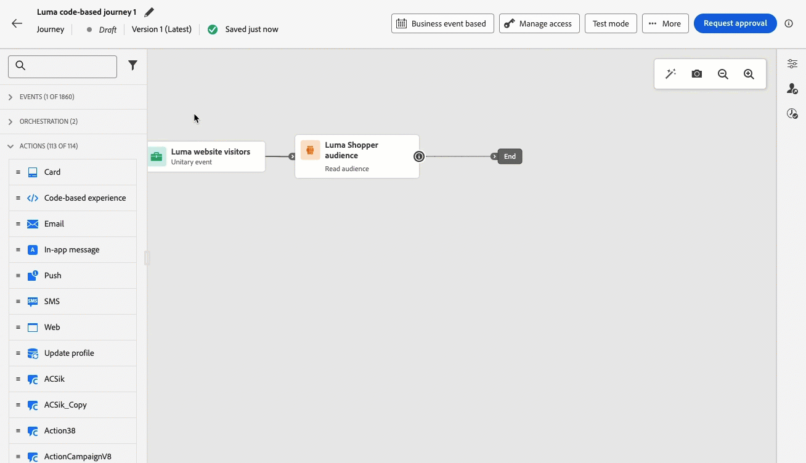

# Vroege aanvullende informatie {#e-release-notes}

[!DNL Adobe Journey Optimizer] biedt voortdurend nieuwe functies, verbeteringen aan bestaande functies en foutoplossingen. Alle veranderingen worden geconsolideerd aan het eind van elke maand in de [ versienota&#39;s ](release-notes.md).

**de vroege versienota&#39;s hieronder zijn onderworpen aan verandering zonder voorafgaande kennisgeving tot de datum van de versiebeschikbaarheid**. De verbindingen, de schermen en de bijgewerkte documentatie worden gepubliceerd in de [ versienota&#39;s ](release-notes.md), bij de versiedatum.

## Opmerkingen bij de vervroegde release oktober 2024 {#e-2024}

**de datum van de Versie**: Oktober 29-30, 2024

### Nieuwe functies {#e-features}

Deze release biedt de nieuwe mogelijkheden die hieronder worden beschreven.

<table>
<thead>
<tr>
<th><strong>E-mailinhoud vergrendelen</strong> </th>
</tr>
</thead>
<tbody>
<tr>
<td>

Met Journey Optimizer kunt u nu inhoud in e-mailsjablonen vergrendelen door de volledige sjabloon of specifieke structuren en onderdelen te vergrendelen. Hierdoor kunt u onbedoelde bewerkingen of verwijderingen voorkomen, waardoor u meer controle hebt over de aanpassing van de sjabloon en de efficiëntie en betrouwbaarheid van uw e-mailcampagnes verbetert.

<!--p>For more information, refer to the <a href="../content-management/gs-generative.md">detailed documentation</a>.

</td>
</tr>
</tbody>
</table>

<table>
<thead>
<tr>
<th><strong>Goedkeuringen tijdens reizen en campagnes (algemene beschikbaarheid)</strong> </th>
</tr>
</thead>
<tbody>
<tr>
<td>

Met het goedkeuringsbeleid kunt u nu een goedkeuringsproces in Journey Optimizer instellen dat marketingteams in staat stelt ervoor te zorgen dat campagnes en reizen worden gecontroleerd en ondertekend door de relevante belanghebbenden voordat ze live gaan.

Eerder beschikbaar voor een reeks organisaties (LA), is het goedkeuringsbeleid nu beschikbaar aan alle gebruikers (GA).

Raadpleeg de <a href="../test-approve/gs-approval.md">gedetailleerde documentatie</a> voor meer informatie.

</td>
</tr>
</tbody>
</table>

<table>
<thead>
<tr>
<th><strong>Aanpassing e-mailconfiguratie (algemene beschikbaarheid)</strong> </th>
</tr>
</thead>
<tbody>
<tr>
<td>

U kunt dynamische subdomeinen en gepersonaliseerde kopbalparameters nu bepalen wanneer het creëren van configuraties van het e-mailkanaal, voor verhoogde flexibiliteit en controle over uw e-mailmontages.

Eerder beschikbaar voor een reeks organisaties (LA), is de aanpassing van de e-mailconfiguratie nu beschikbaar aan alle gebruikers (GA).

Raadpleeg de <a href="../email/surface-personalization.md">gedetailleerde documentatie</a> voor meer informatie.

</td>
</tr>
</tbody>
</table>

<table>
<thead>
<tr>
<th><strong>Niet-visuele bewerkingsmodus voor de webontwerper</strong> </th>
</tr>
</thead>
<tbody>
<tr>
<td>

Als alternatief voor de Journey Optimizer-webontwerper kunt u nu wijzigingen aan uw website toevoegen met een niet-visuele editor. U kunt de wijzigingen handmatig invoeren zonder de pagina's in de visuele editor te openen.
Deze niet-visuele bewerkingsmodus is handig als u geen browserextensies kunt installeren, zoals de Adobe Experience Cloud Visual Helper, die nodig is om uw pagina's in de webontwerper te laden.

<!--p>For more information, refer to the <a href="../email/surface-personalization.md">detailed documentation</a>.</p-->
</td>
</tr>
</tbody>
</table>

<table>
<thead>
<tr>
<th><strong>Experimentatie op het gebied van reizen (algemene beschikbaarheid)</strong> </th>
</tr>
</thead>
<tbody>
<tr>
<td>

Adobe Journey Optimizer is al beschikbaar in campagnes en ondersteunt nu experimenten op reizen. Experimenten zijn gerandomiseerde onderzoeken, die in de context van online tests betekenen dat u sommige willekeurig geselecteerde gebruikers aan een bepaalde variatie van een bericht blootstelt, en een andere willekeurig geselecteerde reeks gebruikers aan één of andere andere variatie of behandeling. Na blootstelling, kunt u de resultaatmetriek meten u in geinteresseerd bent, zoals opent van e-mail, abonnementen, of aankopen.

Eerder beschikbaar voor een reeks organisaties (LA) zijn experimenten op reizen nu beschikbaar voor alle gebruikers (GA).

</td>
</tr>
</tbody>
</table>

<table>
<thead>
<tr>
<th><strong>Bedrijfsvoorschriften (algemene beschikbaarheid)</strong> </th>
</tr>
</thead>
<tbody>
<tr>
<td>

U kunt korrelige frequentiecappende regels nu tot stand brengen, en hen toepassen op verschillende types van marketing mededelingen door regelreeksen. Met deze nieuwe functie kunt u bepalen hoe vaak uw publiek een bericht ontvangt door kanaalregels in te stellen die automatisch overgevraagde profielen uitsluiten van berichten en acties.

Eerder beschikbaar voor een reeks organisaties (LA), zijn de regelreeksen nu beschikbaar aan alle gebruikers (GA).

<!--p>For more information, refer to the <a href="../configuration/business-rules.md">detailed documentation</a>.</p-->
</td>
</tr>
</tbody>
</table>

<table>
<thead>
<tr>
<th><strong>Meertalige berichten tijdens reizen en campagnes (algemene beschikbaarheid)</strong> </th>
</tr>
</thead>
<tbody>
<tr>
<td>

U kunt nu moeiteloos inhoud in meerdere talen maken in één campagne of reis. Met deze functie kunt u schakelen tussen talen wanneer u uw campagne of reis bewerkt, het hele bewerkingsproces stroomlijnt en uw mogelijkheden voor efficiënt beheer van meertalige inhoud verbetert.

Eerder beschikbaar voor een reeks organisaties (LA), zijn de meertalige berichten nu beschikbaar aan alle gebruikers (GA).

<!--p>For more information, refer to the <a href="../configuration/business-rules.md">detailed documentation</a>.</p-->
</td>
</tr>
</tbody>
</table>

<table>
<thead>
<tr>
<th><strong>Integratie van Movable Ink en Adobe Journey Optimizer</strong> </th>
</tr>
</thead>
<tbody>
<tr>
<td>

U kunt nu Movable Ink Da Vinci en Adobe Journey Optimizer integreren. Met deze nieuwe integratie kunt u: 

<ul><li>Gebruik krachtige mogelijkheden in het Da Vinci-product van Movable Ink om e-mailvariaties voor batchcampagnes samen te stellen en aan te passen</li>
<li>Snellere workflows voor praktijkgebruikers voor Journey Optimizer-klanten die Da Vinci gebruiken voor ontwerpen en AJO voor optimalisatie en levering</li>
<li>Optimaliseer Da Vinci modellen met Adobe gegevens.</li></ul>

<!--p>For more information, refer to the <a href="../code-based/get-started-code-based.md">detailed documentation</a>.</p-->
</tr>
</tbody>
</table>

<table>
<thead>
<tr>
<th><strong>Bijgewerkte rapportage-ervaring (algemene beschikbaarheid)</strong> </th>
</tr>
</thead>
<tbody>
<tr>
<td>

Beschikbaar vanaf 16 oktober 2024

De Journey Optimizer-rapportage is nu algemeen beschikbaar (GA) en wordt geleverd met een verbeterde interoperabiliteit met de mogelijkheden van de Customer Journey Analytics, standaardisering van de rapportage op beide platforms en verbetering van de consistentie en betrouwbaarheid van de gegevens. Deze naadloze integratie tussen Journey Optimizer en Customer Journey Analytics biedt een duidelijker beeld van prestatiesmetriek, toelatend gebruikers om geïnformeerde besluiten te nemen.

Met algemene beschikbaarheid, worden vier nieuwe eigenschappen geïntroduceerd: de capaciteit om eenvoudige metriek tot stand te brengen, te creëren en publiek te publiceren, ad-hocvragen te stellen gebruikend de Bouwer van het Inzicht, en planningsrapporten om automatisch aan zeer belangrijke ontvangers worden gemaild.

Raadpleeg de <a href="../reports/report-cja-manage.md">gedetailleerde documentatie</a> voor meer informatie.

Belangrijk:De huidige ervaring met rapportage wordt met ingang van januari 2025 opgeheven. Na deze datum wordt de nieuwe ervaring met rapportage de norm. We raden u aan bekend te maken met de nieuwe functies en functies om een soepele overgang te garanderen. <a href="../reports/report-gs-cja.md"> Leer hoe te om met Journey Optimizer te worden begonnen de nieuwe Rapporterende interface </a>

</tr>
</tbody>
</table>

<table>
<thead>
<tr>
<th><strong>Ervaringen op basis van code bij reizen</strong> </th>
</tr>
</thead>
<tbody>
<tr>
<td>

Beschikbaar sinds 1 okt. 2024

Met het op code-gebaseerde ervaringskanaal, staat Adobe Journey Optimizer u toe om geavanceerde verpersoonlijking en het testen voor om het even welk van uw binnenkomende eigenschappen te doen, toelatend naadloze levering van op maat gemaakte ervaringen over diverse aanraakpunten zoals Web apps, mobiele apps, Desktop apps, videoconsoles, TV aangesloten apparaten, slimme TVs, kiosks, ATMs, IoT apparaten, en meer. Het op code-gebaseerde ervaringskanaal is nu beschikbaar in het reiscanvas.

Raadpleeg de <a href="../code-based/create-code-based.md">gedetailleerde documentatie</a> voor meer informatie.

</tr>
</tbody>
</table>

<table>
<thead>
<tr>
<th><strong>Webervaringen tijdens reizen</strong> </th>
</tr>
</thead>
<tbody>
<tr>
<td>

Beschikbaar sinds 1 okt. 2024

Met het kanaal van het Web, staat Adobe Journey Optimizer u toe om de Webervaring te personaliseren u aan uw klanten door binnenkomende Webreizen levert. Het webkanaal is nu beschikbaar op het reiscanvas.

Raadpleeg de <a href="../web/create-web.md">gedetailleerde documentatie</a> voor meer informatie.

</tr>
</tbody>
</table>

### Verbeteringen {#e-improvements}

Deze release bevat de verbeteringen die hieronder worden vermeld.

**Sms-kanaal**

De verbeteringen van SMS zijn geïntroduceerd om uw berichtmogelijkheden te verbeteren:

* U kunt unieke trefwoorden voor uw SMS-campagnes en -reizen definiëren en beheren, zodat u meer gepersonaliseerde en efficiënte communicatie mogelijk maakt.
* U kunt een standaard SMS-bericht maken en leveren wanneer een trefwoord niet wordt herkend.

**Frequentie en prioritair beheer**

* **het maximum van de Frequentie door campagne of reis** - u kunt frequentieregels nu tot stand brengen om op uw reizen van toepassing te zijn, toestaand u om het aantal reizen per dag, week, of maand te beperken, evenals het aantal gezamenlijke reizen te controleren die gelijktijdig lopen gelijktijdig.

* **Prioriteitsscore** - u kunt een prioritaire score aan een campagne of een reis nu toewijzen, die zich van 0 tot 100 uitstrekken. Een hoger getal geeft een hogere prioriteit aan. Wanneer twee campagnes of reizen de zelfde kanaalconfiguratie gebruiken, zal Journey Optimizer één met de hoogste prioritaire score selecteren. Als de campagnes dezelfde score hebben, wordt de campagne gekozen die het laatst is gewijzigd. Prioriteitsscore is beschikbaar voor alle inkomende kanalen in campagnes en voor het kanaal in de app tijdens reizen.

* **conflicten van de Mening** - een nieuwe **knoop van de Conflicten van de Mening** in reizen en campagnes staat u nu toe om te controleren wanneer er een mogelijkheid van overlapping met andere reizen of campagnes zoals de begindatum, het gerichte publiek, of de geselecteerde kanaalconfiguratie is.

**het beheer van het Besluit**

* **Controles** - het **logboek van de Verandering** lusje dat u toestaat om alle veranderingen te zien die aan een aanbieding of een besluit zijn aangebracht is verwijderd. De veranderingen met betrekking tot aanbiedingen en besluiten kunnen nu in het **Audits** menu worden gezien.

**Configuratie**

* **de configuratieverpersoonlijking van het Kanaal** - wanneer het gebruiken van een gepersonaliseerde configuratie in een campagne of een reis, kunt u uw e-mailinhoud nu voorproef om potentiële fouten met de dynamische montages te controleren u bepaalde.

**Reizen**

* **experiment van de Weg in reizen** - met het experiment van de wegweg, kunt u zeer belangrijke metriek voor uw reiswegen nu bepalen en volgen, toestaand u om het effect van uw activiteiten te meten en duidelijkere inzichten in uw prestaties te verstrekken.

* **Max aantal Levende reizen** - Journey Optimizer heeft nu een graslaag van 500 levende reizen op productiesanddozen, in plaats van 100. Het aantal rechtstreekse reizen is zichtbaar in het canvas van de reis. <!-- DOCAC-10977-->

* **tijd-aan-levende guardrail** - Beginnend November 1, 2024, zal een tijd-aan-levende (TTL) guardrail op systeem-geproduceerde datasets van Journey Optimizer als volgt worden afgedwongen:

   * 90 dagen voor gegevens in profielopslag
   * 13 maanden voor data in data Lake

  Bovendien, op dat ogenblik, zal het stromen segmentatie niet meer het gebruik van verzenden en terugkoppelen gebeurtenissen van het volgen en terugkoppelen datasets steunen. We raden u aan deze gebeurtenissen een tijdje niet te gebruiken voor het streamen van segmentatie en nu zullen we ze volledig uitschakelen.

   * Deze wijziging beperkt alleen het gebruik van send/open-gebeurtenissen in streamingsegmentatie; click-gebeurtenissen kunnen nog steeds worden gebruikt in een streamingsegment. Bovendien kunnen open/verzend-gebeurtenissen nog steeds worden gebruikt in een batchsegment.
   * Trackinggegevens worden nog steeds verzameld. Deze wijziging heeft geen invloed op reeksspatiëring. U kunt nog steeds bijhouden naar wie een e-mail is verzonden en wie op een e-mail heeft geklikt.
   * Reactievoorvallen in de Reizen worden niet beïnvloed door deze wijziging.

* **Parameters in douaneacties** (de datum van Beschikbaarheid: Okt 3, 2024) - ONGELDIGE en facultatieve parameters worden nu gesteund in douaneacties. [Meer informatie](../action/about-custom-action-configuration.md#define-the-message-parameters)

**het bestuur van Gegevens &amp; het beleid van de Toestemming** - de datum van Beschikbaarheid: 7 okt, 2024

* **de handhaving van het beleid van het beheer van 0} Gegevens {vindt nu over alle kanalen in Journey Optimizer plaats.** Voor klanten die beleid in Adobe Experience Platform hebben gecreeerd, worden deze toegepast op marketing acties als deel van de opstelling van kanaalconfiguraties. Als u inhoud maakt met een configuratie, controleert het systeem alle personalisatievelden op overtredingen van het gegevensbeheer. Als er een overtreding wordt gevonden, is het niet mogelijk een reis of campagne te publiceren. [Meer informatie](../action/action-privacy.md)

* **het toestemmingsbeleid van de Douane** is nu op alle kanalen van Journey Optimizer van toepassing. Bij handhaving voordat een bericht wordt verzonden of een binnenkomende ervaring wordt opgeleverd, controleert het systeem of de gebruiker toestemming heeft gegeven om verpersoonlijkingsvelden te gebruiken in de inhoud die hij of zij zal ontvangen. Als er geen toestemming wordt gegeven, wordt de ervaring niet weergegeven. [Meer informatie](../action/consent.md)

  >[!NOTE]
  >
  >Het toestemmingsbeleid is momenteel slechts beschikbaar voor organisaties die het Adobe **het Schild van de Gezondheidszorg** of **Privacy en het 3} toe:voegen-op dienstenaanbod van het Schild van de Veiligheid hebben gekocht.**

**Soorten publiek** - Beschikbaarheidsdatum: 8 okt, 2024

* Wanneer het richten van een Csv- dossierpubliek, kunt u attributen van het dossier in de verpersoonlijkingsredacteur en in reizen en campagneregelbouwer nu gebruiken. [Meer informatie](../audience/about-audiences.md)

* Het gebruik van soorten publiek en kenmerken van aangepaste upload (CSV-bestand) is nu beschikbaar voor gebruik met het Healthcare Shield of Privacy and Security Shield.

