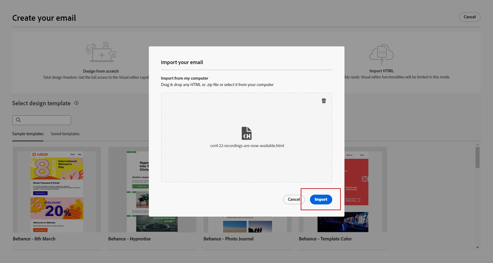

# Vroege aanvullende informatie {#e-release-notes}

[!DNL Adobe Journey Optimizer] biedt voortdurend nieuwe functies, verbeteringen aan bestaande functies en oplossingen voor problemen. Alle wijzigingen worden geconsolideerd op de laatste week van elke maand in de [releaseopmerkingen](release-notes.md).

Opmerkingen bij de eerste release hieronder kunnen zonder voorafgaande kennisgeving worden gewijzigd tot de beschikbaarheidsdatum van de release. De verbindingen, de schermen en de bijgewerkte documentatie worden gepubliceerd in [releaseopmerkingen](release-notes.md), op de datum van vrijgave.

## Opmerkingen bij de vervroegde release juli 2023 {#july-rn-2023}

**Releasedatum**: 26-27 juli

### Nieuwe functies{#july-2023-features}

Deze release biedt de nieuwe mogelijkheden die hieronder worden vermeld.

<table>
<thead>
<tr>
<th><strong>Samenstelling publiek</strong> </th>
</tr>
</thead>
<tbody>
<tr>
<td>

U kunt nu compositieworkflows maken om bestaande Adobe Experience Platform-soorten publiek te combineren tot een visueel canvas en verschillende activiteiten (splitsen, verrijken...) gebruiken om nieuwe soorten publiek te maken. Nieuw gecreëerd publiek wordt samen met het bestaande publiek weer in Adobe Experience Platform opgeslagen en kan in Journey Optimizer-campagnes worden gebruikt om klanten te bereiken.

Raadpleeg de <a href="../audience/get-started-audience-orchestration.md">gedetailleerde documentatie</a> voor meer informatie.

De samenstelling van het publiek is volledig geïntegreerd met het nieuwe Adobe Experience Platform-menu "Soorten publiek", dat als een gecentraliseerd portaal voor het publiek fungeert. U kunt nu een bladerpagina gebruiken die een nieuw dashboard met segmenttendensen en overlappingen omvat om nieuwe inzichten te vinden en organisatorische hulpmiddelen te onderzoeken voor het folderen en het etiketteren. Binnen deze ervaring zijn beheerbesturingselementen ingebouwd voor gestandaardiseerde publiekslabels en mogelijkheden voor levenscyclusbeheer van het publiek om activeringsworkflows te beheren. Met deze nieuwe beheerervaring kunt u het publiek nu gemakkelijk en veilig beheren vanaf één locatie. Raadpleeg voor meer informatie <a href="https://experienceleague.adobe.com/docs/experience-platform/segmentation/ui/overview.html" target="_blank">Adobe Experience Platform-documentatie</a>.

</td>
</tr>
</tbody>
</table>

<!--table>
<thead>
<tr>
<th><strong>Direct mail channel</strong> </th>
</tr>
</thead>
<tbody>
<tr>
<td>

You can now add direct mail messages in your campaigns. Direct mail is an offline channel that allows you to personalize and generate the files required by direct mail providers to send mail to your customers.

When you prepare a direct mail delivery, Journey Optimizer generates a file including all the targeted profiles and the chosen contact information (postal address for example). You will then be able to send this file to your direct mail provider who will take care of the actual sending.

For more information, refer to the <a href="../direct-mail/create-direct-mail.md">detailed documentation</a>.

</tr>
</tbody>
</table-->

<table>
<thead>
<tr>
<th><strong>Uw HTML-inhoud converteren voor de e-mailontwerper</strong> </th>
</tr>
</thead>
<tbody>
<tr>
<td>

U kunt nu alle HTML-inhoud importeren en converteren in de e-maileditor van Journey Optimizer. Inhoudsblokken worden automatisch geïdentificeerd en zijn beschikbaar in de e-mailontwerper: gebruik zijn krachtige ontwerpmogelijkheden om de inhoud bij te werken en aan te passen!

<!--p>For more information, refer to the <a href="../audience/get-started-audience-orchestration.md">detailed documentation</a>.</p-->
</td>
</tr>
</tbody>
</table>

<table>
<thead>
<tr>
<th><strong>Tags gebruiken in Journey Optimizer</strong> </th>
</tr>
</thead>
<tbody>
<tr>
<td>

Naast campagnes en reizen kunt u nu Adobe Experience Platform Unified Tags toewijzen aan uw bestemmingspagina's, inhoudssjablonen, fragmenten en abonnementenlijsten. Op deze manier kunt u ze gemakkelijk classificeren en kunt u zoeken en navigeren in alle lijsten verbeteren. 

Raadpleeg de <a href="../start/search-filter-categorize.md#tags">gedetailleerde documentatie</a> voor meer informatie.

</td>
</tr>
</tbody>
</table>

<table>
<thead>
<tr>
<th><strong>Inhoudssjablonen, API's</strong> </th>
</tr>
</thead>
<tbody>
<tr>
<td>

U kunt nu Adobe Journey Optimizer-inhoudssjablonen maken en beheren met behulp van speciale API's, zodat u uw bestaande inhoudssysteem naadloos kunt integreren.

<!--
For more information, refer to the <a href="../start/search-filter-categorize.md#tags">detailed documentation</a>.
-->
</td>
</tr>
</tbody>
</table>

### Verbeteringen {#july-2023-improvements}

Deze release bevat de verbeteringen die hieronder worden vermeld.

<!--
**Journeys**

* You can now leverage API call responses in custom actions and orchestrate your journey based on these responses.-->
* Er is een nieuw type systeemwaarschuwing geïntroduceerd. U kunt nu een melding krijgen wanneer een aangepaste handeling mislukt.
—>

**Campagnes**

* Contextuele gebeurtenissen met betrekking tot campagnes zijn nu beschikbaar voor gebruik in het menu Contextafhankelijke kenmerken van de verpersoonlijkingseditor.

**Doelgroepen**

Er zijn verbeteringen aangebracht in de publiekekiezer tijdens reizen of campagnes, met toevoeging van nieuwe kolommen waarin de oorsprong en de actualiseringsfrequentie van het publiek worden weergegeven.

Met de release van de portal Publiek compositie hebben Adobe Experience Platform en Adobe Journey Optimizer het gebruik van &quot;publiek&quot; en &quot;segment&quot; binnen het systeem en de documentatie bijgewerkt.

* Publiek: Een reeks personen, accounts, huishoudens of andere entiteiten die gemeenschappelijke kenmerken en gedragingen delen.
* Segmentdefinitie: in Adobe Experience Platform worden de regels gebruikt om sleutelkenmerken of gedrag van een doelgroep te beschrijven. Deze term werd voorheen &quot;segment&quot; genoemd.

Dientengevolge, binnen Adobe Journey Optimizer en Adobe Experience Platform UI, zult u &quot;Segmenten&quot;vervangen door &quot;Publiek&quot;zien om deze nieuwe weg van publieksverwezenlijking en beheer te weerspiegelen.

**API&#39;s**

Verificatie van Adobe Journey Optimizer API&#39;s - De JWT-methode voor het genereren van toegangstokens is vervangen. Alle nieuwe integraties moeten worden gecreeerd gebruikend de server-aan-Server authentificatiemethode OAuth. Adobe raadt u ook aan uw bestaande integratie te migreren naar de methode OAuth. [Meer informatie](https://developer.adobe.com/journey-optimizer-apis/references/authentication/)

**Andere wijzigingen**

Journey Optimizer-gegevenssets die naar Cloud Storage-doelen worden geëxporteerd, zijn nu beschikbaar voor alle klanten als een openbare bètaversie. Met deze functie kunt u een live verbinding maken met opslaglocaties in de cloud om de inhoud van uw gegevenssets te exporteren. [Meer informatie](../data/export-datasets.md)

