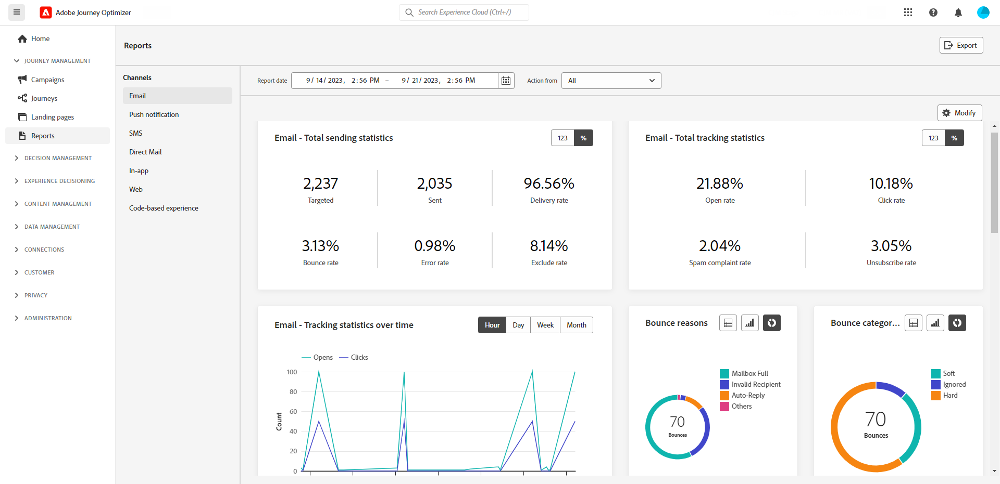

# Vroege aanvullende informatie {#e-release-notes}

[!DNL Adobe Journey Optimizer] biedt voortdurend nieuwe functies, verbeteringen aan bestaande functies en oplossingen voor problemen. Alle wijzigingen worden geconsolideerd op de laatste week van elke maand in de [releaseopmerkingen](release-notes.md).

Opmerkingen bij de eerste release hieronder kunnen zonder voorafgaande kennisgeving worden gewijzigd tot de beschikbaarheidsdatum van de release. De verbindingen, de schermen en de bijgewerkte documentatie worden gepubliceerd in [releaseopmerkingen](release-notes.md), op de datum van vrijgave.

## Opmerkingen bij de vervroegde release september 2023 {#sept-rn-2023}

**Releasedatum**: september 2023

### Nieuwe functies{#sept-2023-features}

Deze release biedt de nieuwe mogelijkheden die hieronder worden vermeld.

<table>
<thead>
<tr>
<th><strong>Geconsolideerde Kanaalrapporten</strong> </th>
</tr>
</thead>
<tbody>
<tr>
<td>

De functie Kanaalrapport biedt analisten en marketers een uitgebreid overzicht van verkeers- en betrokkenheidsgegevens op kanaalniveau. Voor toegang tot het menu 'Rapport' hebt u de machtiging **Kanaalrapporten weergeven** nodig.

Raadpleeg de <a href="../in-app/get-started-in-app.md">gedetailleerde documentatie</a> voor meer informatie.</p-->
</tr>
</tbody>
</table>

<table>
<thead>
<tr>
<th><strong>Gegevensset Export Generation (GA)</strong> </th>
</tr>
</thead>
<tbody>
<tr>
<td>

Journey Optimizer-gegevenssets die naar Cloud Storage-doelen worden geëxporteerd, zijn nu algemeen beschikbaar. Met deze functie kunt u een live verbinding maken met opslaglocaties in de cloud om de inhoud van uw gegevenssets te exporteren.

<!--p>For more information, refer to the <a href="../audience/get-started-audience-orchestration.md">detailed documentation</a>.</p-->
</td>
</tr>
</tbody>
</table>

### Verbeteringen {#sept-2023-improvements}

Deze release bevat de verbeteringen die hieronder worden vermeld.

**Doelgroepen**

* U kunt nu doelgroepen kiezen die vanuit een CSV-bestand naar reizen en campagnes zijn geüpload.
* Er zijn verbeteringen aangebracht in de publiekekiezer tijdens reizen of campagnes, met toevoeging van nieuwe kolommen waarin de oorsprong en de actualiseringsfrequentie van het publiek worden weergegeven.
* U kunt nu doelgroepen kiezen die het resultaat zijn van compositieworkflows naar reizen.

**Personalisatie**

* Naast visuele fragmenten is het nu mogelijk om expressiefragmenten te maken, op te slaan en opnieuw te gebruiken vanuit de Journey Optimizer-interface via de Expressieeditor. Expressiefragmenten vervangen de eerder opgeslagen expressies.
* U kunt nu Adobe Experience Platform berekende kenmerken gebruiken voor personalisatie in Journey Optimizer. Berekende kenmerken zijn geaggregeerde waarden die worden berekend op basis van de gegevenssets voor gebeurtenissen met profiel die in Adobe Experience Platform worden ingevoerd.

**Waarschuwing**

Er is een nieuw type systeemwaarschuwing geïntroduceerd. U kunt nu op de hoogte worden gesteld wanneer een leessegment mislukt.

**Webkanaal**

* U kunt nu selecteren op welke specifieke weergaven u de wijzigingen van uw webpagina wilt toepassen. Een weergave kan worden gedefinieerd als een hele site of een groep visuele elementen op een site, zoals de startpagina, de hele productsite of het voorkeurenframe voor levering op alle afrekenpagina&#39;s.
* Wanneer u een pagina bewerkt met de webontwerper, kunt u nu rechtstreeks vanuit het deelvenster Wijzigingen nieuwe wijzigingen aan uw inhoud toevoegen, zonder dat u een component hoeft te selecteren en te bewerken vanuit de ontwerpinterface.
* Wanneer u websubdomeinen instelt, kunt u nu ook uw eigen subdomein toevoegen, naast het gebruik van een subdomein dat al is gedelegeerd aan de Adobe.

**Journeys**

* Er is een nieuw type systeemwaarschuwing geïntroduceerd. U kunt nu een melding krijgen wanneer een aangepaste handeling mislukt.
* Wanneer u een reis dupliceert, kunt u nu de naam van de reiskopie definiëren.

**E-mailkanaal**

Met een nieuwe optie in de configuratie van het e-mailoppervlak kunt u ervoor kiezen om transactieberichten naar profielen te verzenden, zelfs als hun e-mailadres voorkomt in de lijst met Adobe Journey Optimizer-onderdrukking.

**Beslissingsbeheer**

Er zijn verbeteringen aangebracht in de publiekekiezer tijdens reizen of campagnes, met toevoeging van nieuwe kolommen waarin de oorsprong en de actualiseringsfrequentie van het publiek worden weergegeven.