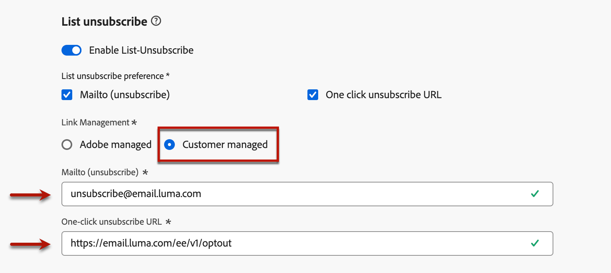

# Vroege aanvullende informatie {#e-release-notes}

[!DNL Adobe Journey Optimizer] biedt voortdurend nieuwe functies, verbeteringen aan bestaande functies en foutoplossingen. Alle veranderingen worden geconsolideerd aan het eind van elke maand in de [ versienota&#39;s ](release-notes.md).

**de vroege versienota&#39;s hieronder zijn onderworpen aan verandering zonder voorafgaande kennisgeving tot de datum van de versiebeschikbaarheid**. De verbindingen, de schermen en de bijgewerkte documentatie worden gepubliceerd in de [ versienota&#39;s ](release-notes.md), bij de versiedatum.

## Opmerkingen bij de vervroegde release van februari &#39;25 {#25-02-rn}

### Nieuwe functies {#25-02-features}

De nieuwe mogelijkheden die met deze release worden geleverd, worden hieronder beschreven.

<table>
<thead>
<tr>
<th><strong>Bedrijfsregels maken en beheren</strong> </th>
</tr>
</thead>
<tbody>
<tr>
<td>

U kunt nu bedrijfsregels maken met behulp van regelsets. Regelsets zijn groepen regels die u helpen verzonden berichten binnen campagnes en reisacties te beperken over kanalen, en om de invoer van profielen in reizen te controleren.

<ul><li>Creeer kanaalregelreeksen om het aantal berichten te beperken die over één of veelvoudige kanalen worden verzonden. Pas ze toe op campagnes of reisacties om de regels af te dwingen die zijn gedefinieerd in de regelset. De de regelreeks van het kanaal staat u toe om het begrenzen regels toe te passen die op communicatie types worden gebaseerd. Stel bijvoorbeeld een regel in die is ingesteld op het beperken van 'promotionele berichten' en een andere regel voor 'nieuwsbrieven'. Pas de toepasselijke regel toe die in uw campagne of reisactie is ingesteld, afhankelijk van het type communicatie dat u verzendt.</li>
<li> Reisregelsets maken om profielinvoer in reizen te regelen. Beperk hoe vaak een profiel een reis binnen een bepaalde periode kan ingaan of het aantal reizen een profiel kan gelijktijdig worden ingeschreven. Pas deze toe op het niveau van de reis om te zorgen voor een goed beheer van de toegang.</li>

Eerder beschikbaar voor een reeks organisaties (LA), zijn de bedrijfsregels nu beschikbaar aan alle gebruikers (GA).

<!--p>For more information, refer to the <a href="../configuration/business-rules.md">detailed documentation</a>.</p-->
</td>
</tr>
</tbody>
</table>

<table>
<thead>
<tr>
<th><strong>Landingspagina's genereren met de AI Assistant</strong> </th>
</tr>
</thead>
<tbody>
<tr>
<td>

U kunt nu boeiende inhoud voor uw openingspagina's, met inbegrip van volledige paginaontwerpen, gepersonaliseerde tekst, en aangepaste visuele hulpmiddelen, met de hulp van de AI medewerker ambachtelijk maken.

<!--p>For more information on AI Assistant, refer to the <a href="../email/generative-lp.md">detailed documentation</a>.</p-->
</td>
</tr>
</tbody>
</table>

<table>
<thead>
<tr>
<th><strong>Merkrichtlijnen (bèta)</strong> </th>
</tr>
</thead>
<tbody>
<tr>
<td>

U kunt nu uw eigen merkenrichtlijnen instellen om de visuele en verbale identiteit van uw merk te definiëren. Merk op dat de eigenschap van Merken als privé bèta wordt vrijgegeven en aan alle klanten in toekomstige versies geleidelijk beschikbaar zal zijn.

<!--p>For more information, refer to the <a href="../content-management/brands.md">detailed documentation</a>.</p-->
</td>
</tr>
</tbody>
</table>

<table>
<thead>
<tr>
<th><strong>Flexibele evaluatie van het publiek (Beperkte Beschikbaarheid)</strong> </th>
</tr>
</thead>
<tbody>
<tr>
<td>

Dankzij de flexibele publieksevaluatie kunt u een segmentatietaak uitvoeren op aanvraag voor een geselecteerd publiek, zodat u altijd over de meest actuele publieksgegevens beschikt voordat u deze doelt op Journey Optimizer-reizen en -campagnes.

Raadpleeg de <a href="../audience/about-audiences.md#flexible">gedetailleerde documentatie</a> voor meer informatie.

 De flexibele publieksevaluatie is slechts beschikbaar voor een reeks organisaties (Beperkte Beschikbaarheid). Neem contact op met uw Adobe-vertegenwoordiger voor toegang.

Beschikbaarheidsdatum: 28 januari 2025

</tr>
</tbody>
</table>

<table>
<thead>
<tr>
<th><strong>Customer Journey Analytics-sjablonen</strong> </th>
</tr>
</thead>
<tbody>
<tr>
<td>

Je hebt nu de mogelijkheid om je Journey Optimizer-rapporten te verbeteren met behulp van Customer Journey Analytics-sjablonen. Met deze nieuwe functie kunt u uw rapportageproces stroomlijnen met vooraf ontworpen sjablonen die zijn afgestemd op uw analysebehoeften.

Raadpleeg de <a href="../reports/report-cja-manage.md#cja-template">gedetailleerde documentatie</a> voor meer informatie.

Beschikbaarheidsdatum: vanaf 15 januari 2025

</tr>
</tbody>
</table>

### Verbeteringen {#25-02-improvements}

De verbeteringen hieronder komen met de update van februari.

* **Reizen** - u kunt uw douaneacties nu testen door API vraag van de beleidssectie te verzenden. Deze nieuwe mogelijkheid helpt u bij het oplossen van problemen met uw aangepaste handelingen voordat u deze tijdens een reis hebt gebruikt.

* **Tijd-aan-levende Dataset (TTL)** - Beginnend deze maand, zal een tijd-aan-levende (TTL) guardrail aan systeem-geproduceerde datasets van Journey Optimizer in nieuwe zandbakken en nieuwe organismen als volgt worden uitgerold:

   * 90 dagen voor gegevens in de profielopslag
   * 13 maanden voor gegevens in het data Lake

  Deze wijziging wordt in een volgende fase doorgevoerd in bestaande sandboxen voor klanten.

  Leer meer over deze update in [ dit specifieke FAQ ](../data/datasets-ttl.md#frequently-asked-questions).

<!--* **Playbooks** - You can now create and publish your own Use Case Playbooks in Journey Optimizer.-->

* **Directe post** - een nieuw servertype, Gegevens landende streek, wordt nu gesteund voor dossier dat in de directe configuratie van het postkanaal verplettert.

**SMS** - u kunt SMS berichtlevering van multi-regionale eindpunten nu beheren door levering, terugkoppelen, binnenkomend, en callback URLs te overschrijven. Ter ondersteuning hiervan is een nieuwe veld Overschrijf-URL toegevoegd aan de configuratie van API-referenties. Deze wijziging is alleen beschikbaar bij de Sinch-provider. [Meer informatie](../sms/sms-configuration-sinch.md)

**Personalization**

<!--
* The personalization editor has been enhanced with new capabilities such as Auto-complete, Search, and filtering options. You can also show or hide deprecated attributes.-->

* Beschikbaarheidsdatum: 29 januari 2025 - Nieuwe datum-/tijdhulpfuncties zijn beschikbaar voor gebruik in de verpersoonlijkingseditor. [Meer informatie](../personalization/functions/dates.md)

**E-mailconfiguratie** - de datum van de Beschikbaarheid: 12 Feb, 2025

* Als u toestemming buiten Adobe beheert, kunt u nu een aangepast e-mailadres voor opzeggen en een aangepaste, één-klik-URL voor opzeggen instellen als onderdeel van de configuratie-instellingen voor e-mailkanalen. [ las meer ](../email/list-unsubscribe.md#custom-managed)

  {width="80%"}

**Beslissing** - de datum van de Beschikbaarheid: Jan 28, 2025

* Het besluit steunt nu de gegevenstypes van Objecten wanneer het uitgeven van het schema van de puntcatalogus. [Meer informatie](../experience-decisioning/catalogs.md)

