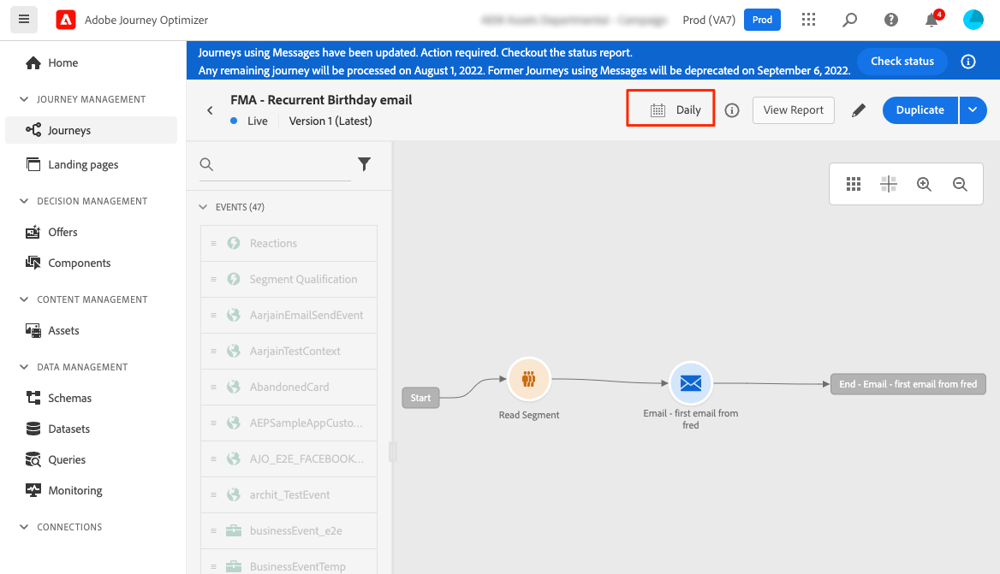
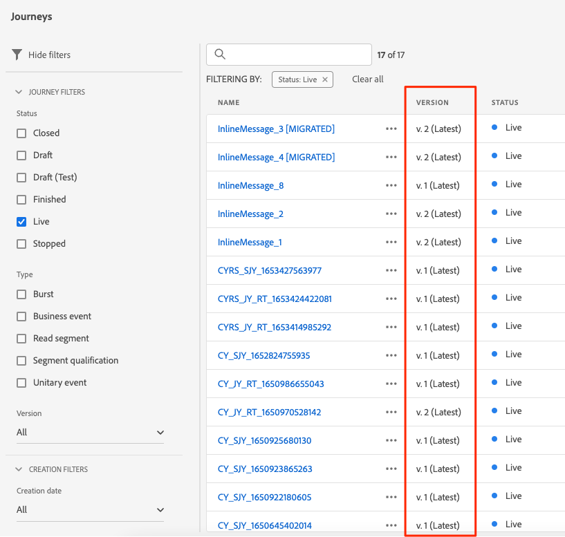
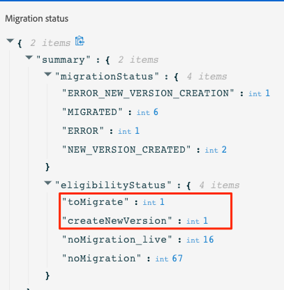

# Inline ontwerpmigratiestappen{#migration-steps}

Het nieuwe proces voor het ontwerpen van inhoud in Adobe Journey Optimizer wordt in dit [page](../rn/inline-messages.md). Voor u wordt een automatische omzetting van reizen uitgevoerd. Toch hebben we uw hulp nodig met een paar stappen.

>[!VIDEO](https://video.tv.adobe.com/v/344699)

Hier volgen de belangrijkste fasen en stappen:

**[Voor de migratie](../rn/inline-messages-steps.md#migration-step-1)**

1. Stop alle live en gesloten reizen op niet-productiesandboxen. [Meer informatie](../rn/inline-messages-steps.md#migration-step-1-1)
1. Stop op de productiesandbox alle live ad-hocreizen zonder dat er nog een profiel aanwezig is. [Meer informatie](../rn/inline-messages-steps.md#migration-step-1-2)

**[Na de eerste herhaling](../rn/inline-messages-steps.md#migration-step-2)**

1. Controleer of er fouten zijn opgetreden tijdens uw gemigreerde live reizen. [Meer informatie](../rn/inline-messages-steps.md#migration-step-2-1)
1. Alle nieuwe versies weergeven die door de migratie zijn gemaakt. [Meer informatie](../rn/inline-messages-steps.md#migration-step-2-2)
1. Test en publiceer ze een voor een. [Meer informatie](../rn/inline-messages-steps.md#migration-step-2-3)
1. Alle live versies weergeven. [Meer informatie](../rn/inline-messages-steps.md#migration-step-2-4)
1. Controleren op fouten in gemigreerde conceptversies. [Meer informatie](../rn/inline-messages-steps.md#migration-step-2-5)

**[Na de tweede herhaling](../rn/inline-messages-steps.md#migration-step-3)**

1. Controleer beide migratiefasen. [Meer informatie](../rn/inline-messages-steps.md#migration-step-3-1)
1. Eerdere versies stoppen. [Meer informatie](../rn/inline-messages-steps.md#migration-step-3-2)

**[Voor de derde en laatste herhaling](../rn/inline-messages-steps.md#migration-step-4)**

Controleer of alles is gemigreerd voordat u de toepassing verlaat.

  

## Voor de migratie (25 juli){#migration-step-1}

### 1. Alle live en gesloten reizen stoppen{#migration-step-1-1}

Aan **niet-productie sandboxen**, alle rechtstreekse en gesloten reizen te stoppen. Hierdoor kan het geautomatiseerde migratieproces alle reizen vanuit deze sandboxen migreren zonder dat u enige actie onderneemt. Na de migratie kunt u opgehouden reisversies dupliceren en gebruiken.

### 2. Alle live ad-hocreizen zonder profiel stoppen{#migration-step-1-2}

Op de **productiesandbox**, moet u alle live ad-hocreizen die geen profielen meer bevatten, stoppen.

+++Hoe kan ik deze reizen vinden?

Navigeer naar de **Reizen** en filtert u de lijst &quot;Status = Live&quot; en &quot;Type = Leessegment&quot;. U kunt ook chronologisch reizen bestellen van de vroegste naar de laatste datum van Gepubliceerd.

Open ze van boven naar beneden.

* Controleer of de reis een bericht heeft.
* Controleer of het geen terugkerende ritten zijn. Dit zijn geen ad-hocacties. Je wilt ze waarschijnlijk live houden. Dit is bijvoorbeeld een terugkerende reis (geen ad-hoc):

   

* Als u wachttijden of gebeurtenisluisteraars in die reizen hebt gebruikt, kunnen de profielen nog binnen zijn. Bekijk de datum van de reisuitvoering en voeg om het even welke uren/dagen toe die u in uw wacht of gebeurtenisluisteraars hebt bepaald om de daadwerkelijke datum af te trekken wanneer geen profielen binnen worden verlaten. Als die datum in het verleden ligt, kunt u de reis stoppen. Anders wordt deze reis 30 dagen na de datum van uitvoering van de reis automatisch naar de status &quot;Voltooid&quot; verplaatst.

+++

**Belangrijke opmerkingen**

* Vermijd het afsluiten van reizen vóór de migratiedatum (25 juli). Als we weten dat het migratiescript geen live of gesloten reizen zal migreren, zal de beperking van het aantal gesloten reizen in de productiesandbox het aantal handmatige handelingen dat na de migratie nodig is, beperken.

* Als u live reizen hebt die niet de meest recente versie zijn, wat betekent dat u een andere reisversie hebt gemaakt in concept, deze publiceert of verwijdert.

* Als u berichten hebt die niet in reizen worden gebruikt en die u wilt houden, sparen hen als malplaatjes. Zie dit [page](../design/email-templates.md#save-as-template). Let op: u kunt ze nog steeds gebruiken tot de afgekeurde versie.

## Na de migratie eerste iteratie (25 juli){#migration-step-2}

De migratie wordt in twee fasen gerangschikt: de geautomatiseerde fase (&#39;s nachts, tussen 25 juli en 26 juli) en de handmatige fase (vanaf 26 juli) die actiepunten vereist.

Voor de geautomatiseerde fase, verwijs naar dit [page](../rn/inline-messages.md#process). Voor de handmatige fase zijn hier de handelingen die moeten worden uitgevoerd op de **productiesandbox**:

<!--
_On non-production sandboxes:_

**1. Check the migration status report for any error**

Click the **Check status** button in the top banner and check that there has been no error during the automatic migration and that there is nothing left to migrate. 

Look for the "ERROR" status. 

* If there is no error, you are good to go.
* If there are errors, look for the error by searching "errorMessage". The following error is expected as migration of multi-channel messages is not supported: "Migration of multi-channel messages is not supported". You will have to rebuild this journey.

    

_On the production sandbox:_

-->

### 1. Controleren op fouten op uw gemigreerde live reizen{#migration-step-2-1}

Controleer in het statusrapport of er fouten zijn opgetreden bij automatisch gemigreerde live reizen ([Meer informatie](../rn/inline-messages.md#status). Klik op de knop **Status controleren** in de bovenste banner.

Zoek naar &quot;ERROR_NEW_VERSION_CREATION&quot;:

* Als er geen fout is, betekent dit dat alle versies van live reizen die migratie vereisen, zijn verwerkt en dat er automatisch een nieuwe versie van gemigreerd concept is gemaakt.

* Als er een fout optreedt, kunt u zoeken naar &#39;&#39;errorMessage&#39;&#39; en het foutbericht controleren in de logboeken. Multikanaalberichten worden niet gemigreerd. Je moet een andere reis maken.

   

* Neem voor andere fouten contact op met uw CSM of een Adobe-medewerker voor hulp.

### 2. Alle nieuwe versies weergeven die door de migratie zijn gemaakt{#migration-step-2-2}

Ze zijn gemarkeerd als [GEMIGRAEERD] in het reislabel en de aanmaakdatum worden bijgewerkt.

### 3. Deze een voor een testen en publiceren{#migration-step-2-3}

Zorg ervoor dat de reis nog steeds in productie is. Als de [voorbereiding voor migratie](../rn/inline-messages-steps.md#migration-step-1) niet correct is uitgevoerd, kunt u een nieuwe versie maken voor een eenmalige reis die niet meer nodig is.

Test uw conceptversie van de reis die nu inline kanaalacties bevat.

Publiceer uw nieuwe reisversie. De vorige live versie gaat vervolgens over naar de status Gesloten.

### 4. Alle actieve versies weergeven{#migration-step-2-4}

Ze moeten allemaal als laatste worden gemarkeerd. als dat niet het geval is , zoekt u de nieuwere versie , test u deze en publiceert u deze .

### 5. Controleren op fouten in gemigreerde conceptversies {#migration-step-2-5}

Klik op de knop **Status controleren** in de bovenste banner ([Meer informatie](../rn/inline-messages.md#status) en controleert u of er tijdens de automatische migratie geen fouten zijn opgetreden en of er niets meer over is om te migreren. Houd er rekening mee dat elke foutreis (met berichten) na 5 september wordt vervangen (op alle sandboxen).

Zoek de status &quot;ERROR&quot;.

* Als er geen fout is, bent u goed te gaan.

* Als er fouten zijn, zoek de fout door &quot;errorMessage&quot; te zoeken. De volgende fout wordt verwacht omdat de migratie van multikanaalsberichten niet wordt ondersteund: &quot;Migratie van multikanaalsberichten wordt niet ondersteund.&quot; Je moet deze reis opnieuw opbouwen.

## Na de tweede iteratie (1 augustus){#migration-step-3}

De tweede iteratie vindt plaats bij nacht tussen 1 augustus en 2 augustus.

<!--
_On non-production sandboxes:_

**1. Check at the status report**

Click the **Check status** button in the top banner and check that all journeys have been migrated and there's nothing left to migrate. If there is an error or something left to migrate, please reach out to your CSM or Adobe representative for guidance.

-->

Als alle vorige stappen op tijd zijn uitgevoerd, zijn al uw reizen gemigreerd, behalve de gesloten en de reizen met fouten. Hier volgen de volgende stappen op de knop **productiesandbox**:

### 1. Beide migratiefasen controleren{#migration-step-3-1}

Als er geen fouten zijn, moet u geen reizen hebben in &quot;geschiktheidsstatus&quot;, onder &quot;naarMigrate&quot; en &quot;createNewVersion&quot;. In het volgende voorbeeld zijn er één &quot;ERROR&quot;en één &quot;ERROR_NEW_VERSION_CREATION&quot;.

### 2. Vorige versies stoppen{#migration-step-3-2}

Als u geen nieuwere reisversies hebt gepubliceerd (zie deze [sectie](../rn/inline-messages-steps.md#migration-step-2-3)) in de tijd die vóór iteratie 2 (1 augustus) moet worden gebruikt, publiceert u vervolgens de nieuwere versie.

>[!NOTE]
>
>Stop de vorige versie of u verliest het en zijn bijbehorende rapportering.

## Voor de derde en laatste herhaling (5 september){#migration-step-4}

Tussen 1 augustus en 5 september moet u controleren of alles is gemigreerd en dat er geen reizen meer zijn die nog steeds berichten gebruiken, anders worden ze op 5 september afgekeurd.
