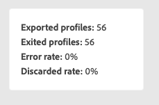

# Welkom bij de verbeterde Reisweg Designer {#new-canvas}

Journey Optimizer biedt nu het model van de a **vereenvoudigde reis** aan die gebruikerservaring en interne processen probeert te verbeteren. Vanaf april kunt u profiteren van de volgende functies:

* A **opnieuw ontworpen wegcanvas** gemaakt voor een gemoderniseerde ervaring UI
* A **levende rapporterend** UI direct beschikbaar in het wegcanvas

>[!NOTE]
>
>Houd er rekening mee dat de rollout voor deze functie progressief zal zijn. De wijzigingen worden misschien niet meteen weergegeven.

## Updates van het reismodel

Het nieuwe reismodel zal naast bestaande leven, betekenend dat er reizen gebruikend **twee verschillende modellen** zullen zijn:

* Het oudere model
* Het nieuwe model

Alle reizen in het oude model blijven erin. U kunt deze nog steeds bewerken, testen of publiceren. Elke nieuwe versie die is gemaakt op basis van een reis op het oude model, blijft erin staan. Er zijn **geen functionele veranderingen** rond die reizen.

Zoals u in het hieronder schermschot ziet, zijn de knopen rond-vormig, die oude UI voor reizen op het erfenismodel is.

Nochtans, wanneer u **een nieuwe reis** creeert of **bestaande** dupliceert, zal het op het nieuwe model zijn. De reizen op het erfenismodel zullen nog worden gesteund tot een meerderheid van klanten aan nieuwe worden overgezet.

Er is één beperking aan het nieuwe reismodel; het zal **niet activiteiten van het erfenismodel aan nieuwe kunnen kopiëren en plakken en vice versa**. Als u dit wilt doen, adviseren wij u om uw erfenisreis te dupliceren om het op het nieuwe model over te schakelen, en dan uw activiteiten te kopiëren.

In de onderstaande schermafbeelding ziet u de opnieuw ontworpen interface voor het reiscanvas (alleen beschikbaar bij het nieuwe model):

**om het even welke nieuwe eigenschap die aan de reisontwerper (met inbegrip van levende rapportering) wordt toegevoegd zal slechts voor reizen op het nieuwe model van dit punt vooruit beschikbaar zijn.**

## Verbeterd ontwerp van reiscanvas

Met het nieuwe reismodel, introduceren wij een nieuw-en-verbeterde **interface van het wegcanvas**, die naadloos binnen de oplossingen van Adobe Experience Cloud &amp; app ecosysteem past, makend voor een intuïtieve en efficiënte gebruikerservaring. Elke reis in het nieuwe model zal op dat nieuwe ontwerp zijn.

De activiteiten zullen nu worden vertegenwoordigd door vierkante dozen met de volgende mogelijkheden:

* De eerste regel die het activiteitstype vertegenwoordigt dat vaak wordt overschreven door meer contextuele informatie (bij Lezen publiek bevat deze de naam van het geselecteerde publiek) of door een aangepast label als u er een definieert.
* De tweede regel vertegenwoordigt altijd het type activiteit.

Deze nieuwe UI verbetert de leesbaarheid van het wegcanvas door **duidelijkere activiteitenetiketten en types** te verstrekken.

Het staat het productteam ook toe om meer informatie op het canvas met minder kliks toe te voegen. Een voorbeeld van &quot;meer informatie&quot; zou de opname van live rapportering in het reiscanvas zijn, waar u profielen kunt zien die uw activiteiten betreden en verlaten vanwege fouten.

## Live rapportering op het canvas van de reis

Naast de verbeterde lay-out van het wegcanvas, wordt een nieuwe eigenschap geïntroduceerd om gebruikers toe te staan om metriek in real time van **de laatste 24 uren** te bekijken, riep levende rapportering, direct binnen het wegcanvas.

Voor elke activiteit binnen elke levende reis die het nieuwe model gebruikt, hebt u toegang tot:

* Het aantal profielen dat deze activiteit betreedt.
* Het aantal profielen dat deze activiteit verlaat vanwege een fout.

<!--`
With every live journey on the new model, you will be able to see two types of "last 24 hours" reporting information:

* On a **new insert**, you will see:
    * The number of profiles that have been exported for audience-triggered journeys. You will see the number of profiles available in the last export job alongside the time when that export has been made.
    * The number of profiles who exited the journey
    * The percentage of errors
    
* **On each activity**, you will see the number of profiles who entered that activity and the number who exited because of an error:
    
-->
<!--
Please note that you may see differences between the number of exported profiles and the number of profiles flowing through the journey. The exported profiles count only provides information about the last export job being made while the number of profiles entering an activity only contains profiles who did it in the last 24 hours. This can especially be visible on recurring daily journeys as there could be a data overlap between two days.
-->
