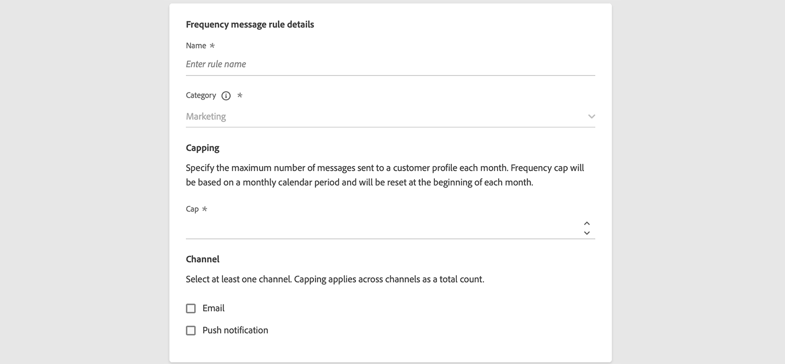

# Aanvullende informatie 2022 {#release-notes-2022}

Deze pagina bevat alle functies en verbeteringen voor [!DNL Journey Optimizer] vrijgegeven in 2022.

## Release van juni 2022 {#june-2022-release}

### Nieuwe functies

<table>
<thead>
<tr>
<th><strong>SMS verzenden naar uw gebruikers (beperkte beschikbaarheid)</strong> </th>
</tr>
</thead>
<tbody>
<tr>
<td>

U kunt nu SMS in Journey Optimizer maken, personaliseren en verzenden via integratie met <b>Sinch</b> of <b>Twilio</b>.

Het SMS-kanaal is momenteel alleen beschikbaar voor een aantal organisaties (Beperkte beschikbaarheid). Neem voor meer informatie contact op met uw Adobe-vertegenwoordiger.

Leer hoe u in dit venster een SMS maakt en verzendt <a href="../messages/create-sms.md">gedetailleerde documentatie</a>.

</td>
</tr>
</tbody>
</table>

<table>
<thead>
<tr>
<th><strong>Snellere afbeeldingen zoeken dankzij Adobe Stock-integratie</strong> </th>
</tr>
</thead>
<tbody>
<tr>
<td>

Met de integratie-insteekmodule Adobe Stock en Adobe Journey Optimizer Email Designer kunnen klanten eenvoudig door afbeeldingen navigeren, licenties aanschaffen en afbeeldingen opslaan voor gebruik in berichtontwerpen.   De nieuwe <b>Vergelijkbare stockfoto's zoeken</b> kunt u ook Stock-foto's zoeken die overeenkomen met de inhoud, kleur en compositie van de afbeeldingen. 

Raadpleeg de <a href="../design/stock.md">gedetailleerde documentatie</a> voor meer informatie.

</td>
</tr>
</tbody>
</table>

<table>
<thead>
<tr>
<th><strong>BCC via e-mail gebruiken op al uw e-mails</strong> </th>
</tr>
</thead>
<tbody>
<tr>
<td>

U kunt nu de e-mailfunctie BCC (blinde koolstofkopie) gebruiken om e-mails op te slaan die door Adobe Journey Optimizer zijn verzonden. Schakel deze optie in uw e-mailvoorinstellingen in, zodat elke verzonden e-mail blind wordt gekopieerd naar uw BCC-adres.

Raadpleeg de <a href="../configuration/bcc-email.md">gedetailleerde documentatie</a> voor meer informatie.

</td>
</tr>
</tbody>
</table>

<!--<table>
<thead>
<tr>
<th><strong>Automatically use the best performing offer in your decisions</strong> </th>
</tr>
</thead>
<tbody>
<tr>
<td>

You can now use personalized optimization model systems in Decision Management. This new type of model allows you to optimize and personalize offers based on segments and offer performance.

The use of personalized optimization AI models is currently restricted to selected users, and will be deployed to all environments in a future release.

For more information, refer to the <a href="../offers/ranking/personalized-optimization-model.md">detailed documentation</a>.

</td>
</tr>
</tbody>
</table>-->

<table>
<thead>
<tr>
<th><strong>Objecten kopiëren tussen sandboxen</strong> </th>
</tr>
</thead>
<tbody>
<tr>
<td>

U kunt de ervaringen nu opnieuw maken van een Journey Optimizer-sandbox naar een andere sandbox, bijvoorbeeld van een niet-productiesandbox naar een productiesandbox. Deze nieuwe mogelijkheid kopieert een volledige Reis, inclusief alle objecten waarvan de Reis afhankelijk is om correct te worden uitgevoerd, van de ene omgeving naar de andere. Naast de Reizen, kunt u andere componenten, zoals Aanbiedingen, Berichten, Schema's, Datasets, Gegevensbronnen, Gebeurtenissen, en Acties ook kopiëren.

Raadpleeg de <a href="../building-journeys/copy-to-sandbox.md">gedetailleerde documentatie</a> voor meer informatie.
</td>
</tr>
</tbody>
</table>

<!--table>
<thead>
<tr>
<th><strong>Dynamic Expression Builder</strong> </th>
</tr>
</thead>
<tbody>
<tr>
<td>

You can now create conditional content blocks across different authoring services to personalize your content. In addition to the Personalization Expression Library, the Expression Editor provides a new Conditional Rule Builder to help you design and save your content blocks.

For more information, refer to the <a href="../building-journeys/read-segment.md#configuring-segment-trigger-activity">detailed documentation</a>.
</td>
</tr>
</tbody>
</table-->

### Verbeteringen

**Beslissingsbeheer**

* **Ondersteuning voor HTML- en JSON-bestanden** - U kunt nu externe HTML- en JSON-bestanden van de Adobe Experience Cloud Asset-bibliotheek naar de inhoud van de aanbiedingsweergave slepen. [Meer informatie](../offers/offer-library/add-representations.md#html-json)

**E-mail**

* **Opslaan als sjabloon** - U kunt nu e-mailinhoud opslaan als een sjabloon en deze opnieuw gebruiken wanneer u andere berichten maakt. [Meer informatie](../design/email-templates.md)

**Beheer**

* **Voorvertoning van URL-parameters bijhouden** - Als u een berichtvoorinstelling configureert en URL-trackingparameters definieert, wordt nu een dynamische voorvertoning van de resulterende URL weergegeven. [Meer informatie](../configuration/email-settings.md#url-tracking)

* **Vooraf ingestelde berichtversie** - Wanneer u nu een berichtvoorinstelling bijwerkt, kan de verwerkingstijd maximaal 3 uur in beslag nemen. [Meer informatie](../configuration/channel-surfaces.md#edit-channel-surface)

* **IP-pooleditie** - Wanneer het bijwerken van een IP pool, kan de verwerkingstijd slechts tot 3 uren vergen. [Meer informatie](../configuration/ip-pools.md#edit-ip-pool)

## Release van mei 2022 {#may-2022-release}

### Nieuwe functies

<table>
<thead>
<tr>
<th><strong>Regels voor berichtfrequentie</strong> </th>
</tr>
</thead>
<tbody>
<tr>
<td>

U kunt nu bedrijfsregels voor meerdere kanalen instellen die overgevraagde profielen automatisch uitsluiten van berichten en handelingen.

Raadpleeg de <a href="../configuration/frequency-rules.md">gedetailleerde documentatie</a> voor meer informatie.

</td>
</tr>
</tbody>
</table>

<table>
<thead>
<tr>
<th><strong>Beslissingsbeheer - Automatisch optimalisatiemodel met AI-classificatie</strong> </th>
</tr>
</thead>
<tbody>
<tr>
<td>

U kunt nu getrainde modelsystemen gebruiken in Beslissingsbeheer. Deze nieuwe capaciteitranches kunnen worden weergegeven voor een bepaald profiel.

Raadpleeg de <a href="../offers/offer-activities/configure-offer-selection.md#use-ranking-strategy">gedetailleerde documentatie</a> voor meer informatie.

</td>
</tr>
</tbody>
</table>

<!--table>
<thead>
<tr>
<th><strong>Attribute-based Access Control (ABAC)</strong> </th>
</tr>
</thead>
<tbody>
<tr>
<td>

Permission management in Journey Optimizer has been extended to data access. You can now manage data access for specific teams or groups of users (i.e. internal, external, 3rd parties) ​and manage access to specific types of data (i.e. Sensitive Personal Data/SPD).

This capability is available for a limited set of customers.

For more information, refer to the <a href="../landing-pages/create-lp.md">detailed documentation</a>.

</td>
</tr>
</tbody>
</table-->

<table>
<thead>
<tr>
<th><strong>Journey Optimizer Audit Logs</strong> </th>
</tr>
</thead>
<tbody>
<tr>
<td>

U kunt nu de acties controleren die gebruikers op Adobe Journey Optimizer-bronnen uitvoeren.

Raadpleeg de <a href="../privacy/audit-logs.md">gedetailleerde documentatie</a> voor meer informatie.

</td>
</tr>
</tbody>
</table>

### Verbeteringen

**Personalisatie**

* **Nieuwe hulpfunctie voor verborgen tekens** - de `mask` Met de hulpfunctie kunt u een deel van een tekenreeks vervangen door &quot;X&quot;-tekens. [Meer informatie](../personalization/functions/string.md#mask)

**Landingspagina’s**

* **Pagina&#39;s zonder formulier landen** - U kunt nu een bestemmingspagina maken en publiceren die geen formulier bevat en geen actie van bezoekers vereist.
* **Sjablonen voor bestemmingspagina** - U kunt een landingspagina nu opslaan als een sjabloon en deze opnieuw gebruiken bij het maken van andere bestemmingspagina&#39;s. [Meer informatie](../landing-pages/lp-templates.md)
* **Terug naar de primaire pagina** - U kunt nu een koppeling naar de primaire pagina toevoegen vanuit elke subpagina binnen dezelfde bestemmingspagina.
* **Aangepaste JavaScript-ondersteuning** - U kunt nu aangepaste JavaScript toevoegen aan uw bestemmingspagina-inhoud om geavanceerde stijlen uit te voeren of aangepaste gedragingen toe te voegen aan uw bestemmingspagina&#39;s.	[Meer informatie](../landing-pages/lp-custom-js.md)

**Journeys**

* **Segment lezen** - Eenmalig Leessegment-reizen gaan nu 30 dagen na de uitvoering van de reis over naar de voltooide status. Voor geplande Gelezen segmenten, is het 30 dagen na de uitvoering van het laatste voorkomen. [Meer informatie](../building-journeys/read-segment.md)
* **Expression-editor** - de [limiet](../building-journeys/functions/functionlimit.md) Er is een functie toegevoegd waarmee u het aantal items in een lijst kunt beperken. De [sorteren](../building-journeys/functions/functionsort.md) Met deze functie kunt u nu een lijstobject sorteren. De ondersteuning van listObject is ook toegevoegd aan de [ontkenning](../building-journeys/functions/functiondistinct.md) en [differentWithNull](../building-journeys/functions/functiondistinctwithnull.md) functies.

**Beheer**

* **Update voor gebruiksdashboard voor licenties** - Het gebruiksdashboard voor licenties is beschikbaar in het dialoogvenster [!DNL Adobe Journey Optimizer] de gebruikersinterface weerspiegelt nu de juiste waarde voor de **Gelicentieerd** Gemiddelde profielrijkheid. Deze metrische weergave wordt verlaagd, wat betekent dat de licentielimiet nu correct wordt gerapporteerd. [Meer informatie](../segment/license-usage.md)

## Release van april 2022 {#april-2022-release}

### Verbeteringen

**Landingspagina’s**

* **Nieuwe optie voor selectievakjes opt-in/opt-out** - U kunt nu één selectievakje voor aanmelding/opt-out invoegen op abonnementsbestemmingspagina&#39;s. Gebruikers moeten het selectievakje voor toestemming (opt-in) inschakelen en het selectievakje uitschakelen om hun toestemming (opt-out) te verwijderen. [Meer informatie](../landing-pages/design-lp.md#define-lp-specific-content)

* **Vooraf opgevulde landingspaginavelden** - Het is nu mogelijk om gebruikers de mogelijkheid te geven om de landingspagina-velden vooraf te vullen met profielinformatie. [Meer informatie](../landing-pages/create-lp.md#configure-primary-page)

**Beslissingsbeheer**

* **API voor besluitvorming op Edge** - De Edge-API voor besluitvorming kan persoonlijke aanbiedingen die in de Offer decisioning worden beheerd, leveren en renderen. U kunt uw aanbiedingen en andere verwante objecten maken met de gebruikersinterface (UI) of API&#39;s van de Offer decisioning. [Meer informatie](../offers/api-reference/offer-delivery-api/edge-decisioning-api.md)

**Beheer**

* **PTR-verzendduur** - De effectieve duur van PTR-bewerkingen is nu een paar uur. [Meer informatie](../configuration/ptr-records.md#processing)

**E-mailontwerp**

* **20 nieuwe e-mailsjablonen** zijn nu beschikbaar om uw e-mailinhoud te ontwerpen in Journey Optimizer.

**Gebruikersinterface**

* **Contextafhankelijke Help in de gebruikersinterface van Journey Optimizer** - Er zijn contextafhankelijke Help-koppelingen toegevoegd aan meerdere pagina&#39;s in Journey Optimizer. Klik, indien beschikbaar, op het pictogram &quot;i&quot; om een snelle beschrijving van de huidige functionaliteit en artikelen die betrekking hebben op toegang, weer te geven.

**Integratie met Adobe Campaign Standard**

Als Adobe Campaign Standard-klant kunt u nu e-mails, pushberichten en SMS verzenden via Journey Optimizer. Gebruik de nieuwe ingebouwde acties om de mogelijkheden van het Overseinen van de Campaign Standard Transactie in Journey Optimizer te gebruiken.  [Meer informatie](../action/acs-action.md)

<!--
### Fixes

* Fixed an issue which caused tracking reports not to be available as the `JourneyActionId` was not properly populated. PLATIR-19854, CJM-26006
* Fixed an error on business events which could block the journey publication. CJM-25931
* Fixed an issue which could prevent images in Email Designer templates from being displayed. PLATIR-18176, CJM-25008
-->

## Release van maart 2022 {#march-2022-release}

### Verbeteringen

**Reizen**

* Als u wilt voorkomen dat het schema van het uniforme profiel onnodige velden bevat, is het schema voor de gebeurtenis Reisstap niet meer standaard ingeschakeld voor profielen. Indien nodig, kunt u het activeren. [Meer informatie](../reports/sharing-overview.md)
* Journey Optimizer stuurt nu nieuwe stapgebeurtenissen met betrekking tot exporttaken naar Adobe Experience Platform. Voorbeelden van query&#39;s zijn toegevoegd aan documentatie. [Meer informatie](../reports/query-examples.md)

**Beslissingsbeheer**

* U kunt nu opgeven of het aanbieden van een maximum wordt toegepast op alle gebruikers of op één specifiek profiel, en op alle plaatsen of per plaatsing. [Meer informatie](../offers/offer-library/add-constraints.md#capping)
* Met de Batch-beslissings-API kunnen organisaties de functionaliteit offer decisioning gebruiken voor alle profielen in een bepaald segment in één aanroep. De aanbiedingsinhoud voor elke profielen in het segment wordt geplaatst in een AEP dataset waar het voor de werkschema&#39;s van de douanepartij beschikbaar is. [Meer informatie](../offers/api-reference/offer-delivery-api/batch-decisioning-api.md)

**Beheer**

* U kunt nu de koppeling voor het afmelden van abonnementen in- of uitschakelen in de e-mailheader op het niveau van de berichtvoorinstelling en een aangepaste URL voor het afmelden van abonnementen instellen op berichtniveau. [Meer informatie](../configuration/channel-surfaces.md#list-unsubscribe)
* De lijst van gewenste personen kan nu worden in- en uitgeschakeld via de [!DNL Journey Optimizer] interface over productie- en niet-productie-sandboxen. [Meer informatie](../configuration/allow-list.md#enable-allow-list)

**Personalisatie**

* U kunt nu meer dan 40 personalisatie-expressies opslaan in de bibliotheek. [Meer informatie](../personalization/personalization-library.md)

## Release van februari 2022 {#feb-2022-release}

### Nieuwe functies

<table>
<thead>
<tr>
<th><strong>Landingspagina's abonnement</strong> </th>
</tr>
</thead>
<tbody>
<tr>
<td>

U kunt nu bestemmingspagina's in Journey Optimizer maken en ontwerpen en uw gebruikers naar onlineformulieren sturen waar zij zich kunnen aanmelden of weigeren uw communicatie te ontvangen, of u kunt zich abonneren op een specifieke service zoals een nieuwsbrief.

Raadpleeg voor meer informatie de <a href="../landing-pages/create-lp.md">gedetailleerde documentatie</a> en aanverwante <a href="../landing-pages/lp-use-cases.md">voorbeeldgebruik</a>.

</td>
</tr>
</tbody>
</table>

<table>
<thead>
<tr>
<th><strong>Nieuwe bibliotheek voor persoonlijke expressie</strong> </th>
</tr>
</thead>
<tbody>
<tr>
<td>

Journey Optimizer beschikt nu over een bibliotheek waarmee u toegang kunt krijgen tot vooraf gedefinieerde personalisatie-expressies. Deze expressies worden geconfigureerd door Admin-gebruikers.

Raadpleeg de <a href="../personalization/personalization-library.md">gedetailleerde documentatie</a> voor meer informatie.

</td>
</tr>
</tbody>
</table>

<!--table>
<thead>
<tr>
<th><strong>API Developer Site and Suppression API</strong> </th>
</tr>
</thead>
<tbody>
<tr>
<td>

Journey Optimizer provide RESTful APIs that allow you to programmatically perform key operations in your applications.
Developer SDK for Journey Optimizer is now available with the Suppression API (beta).

With this API, you can control your outgoing messages using suppression and allow lists.
The suppression list helps you with honoring the ISPs’ feedback to preserve sending IP reputation. The allow list helps you ensure that you send only to those email addresses which are in the allowed list, and typically to ensure that you don't send mails to customers from your development sandbox.

See <a href="https://developer.adobe.com/journey-optimizer-apis/">Adobe Journey Optimizer APIs</a>.

</td>
</tr>
</tbody>
</table-->

<table>
<thead>
<tr>
<th><strong>Geef informatie door om uw berichten bij te houden met parameters voor het bijhouden van UTM</strong> </th>
</tr>
</thead>
<tbody>
<tr>
<td>

In Journey Optimizer-berichtinhoud kunt u nu UTM-parameters aan uw koppelingen toevoegen: zij kunnen extra gegevens over die verbinding verstrekken, en u helpen identificeren waar en waarom een persoon op uw verbinding klikte.

Raadpleeg de <a href="../configuration/channel-surfaces.md#configure-email-settings">gedetailleerde documentatie</a> voor meer informatie.</p-->
</td>
</tr>
</tbody>
</table>

### Verbeteringen

**Reizen**

* Om de prestaties te optimaliseren, zullen alle reizen in testwijze die niet voor een week zijn teweeggebracht nu op de status van het Ontwerp terugschakelen. [Meer informatie](../building-journeys/testing-the-journey.md#important_notes)
* De integratie tussen Journey Optimizer en Adobe Campaign Classic is geoptimaliseerd om de prestaties te verbeteren. De het maximum standaardconfiguratie is veranderd in 4000 vraag/5 minuten.	[Meer informatie](../action/acc-action.md#important-notes)

**Rapportage**

* De leveringen kunnen nu worden gefilterd op basis van hun status:
   * In de lijst Berichtenuitvoering kunt u nu proefdrukken uitsluiten van de lijst met leveringen.
   * In uw Live/Global-rapporten kunt u testgebeurtenissen uitsluiten.

* U kunt nu rapporten openen over de gegevens voor Tijdoptimalisatie verzenden: het aantal personen dat onmiddellijk berichten was en het aantal personen dat met optimalisatie van 1 uur, optimalisatie van 2 uur, enz. werd gecommuniceerd.

<!--* Offer Decisioning reports are now available in Journey Optimizer. You can access the following metrics: Offers sent - Offers' impression rate - Offers' click rate - Breakdown report on Offers' sent.-->

**Beslissingsbeheer**

* De classificaties en de AI-classificatie worden nu gegroepeerd in één enkel tabblad.

## Release van januari 2022 {#january-2022-release}

### Nieuwe functies

<table>
<thead>
<tr>
<th><strong>Reizen - Optimaliseer uw IP helling met de GLB voorwaarden van het Profiel</strong> </th>
</tr>
</thead>
<tbody>
<tr>
<td>

Wanneer u een <strong>Voorwaarde</strong> tijdens een rit kunt u nu een profieluiteinde definiëren. Met dit nieuwe voorwaardetype kunt u een maximumaantal profielen instellen voor een reispad. Wanneer deze limiet is bereikt, hebben de invoerprofielen een ander pad. Dit staat u toe om het volume van uw leveringen (IP oprijplaat) te verhogen. U kunt bijvoorbeeld de levering in een domein opsplitsen door de uitvoering te splitsen: verzend 1000 berichten op dag 1, 2000 op dag 2, enz.

Raadpleeg voor meer informatie de <a href="../building-journeys/condition-activity.md#profile_cap">gedetailleerde documentatie</a> en aanverwante <a href="../building-journeys/ramp-up-deliveries-uc.md">voorbeeldgebruik</a>.

</td>
</tr>
</tbody>
</table>

<table>
<thead>
<tr>
<th><strong>Reizen - Verbetering van het leessegment</strong> </th>
</tr>
</thead>
<tbody>
<tr>
<td>

De <strong>Incrementeel lezen</strong> is toegevoegd aan terugkerende <strong>Segment lezen</strong> activiteiten. Met deze optie kunt u zich alleen richten op de personen die het segment hebben betreden sinds de laatste uitvoering van de reis. De eerste uitvoering richt altijd alle segmentleden.

Raadpleeg de <a href="../building-journeys/read-segment.md#configuring-segment-trigger-activity">gedetailleerde documentatie</a> voor meer informatie.
</td>
</tr>
</tbody>
</table>

### Verbeteringen

**Reizen**

* Journey Optimizer step-gebeurtenissen kunnen nu worden gekoppeld aan andere datasets in [Adobe Customer Journey Analytics](https://experienceleague.adobe.com/docs/analytics-platform/using/cja-overview/cja-overview.html). De **profileID** in het ingebouwde schema voor de gebeurtenis van de Stap van de Reis, wordt nu gedefinieerd als identiteitsgebied. [Meer informatie](../reports/sharing-overview.md#integration-cja)

**offer decisioning**

* Wanneer u een aanbod, een fallback-aanbieding, een verzameling van aanbiedingen of een besluit van een aanbieding bijwerkt waarnaar direct of indirect wordt verwezen in een gepubliceerd bericht, worden de updates nu automatisch weerspiegeld in het bijbehorende bericht, zonder dat u het bericht opnieuw hoeft te publiceren. [Meer informatie](../offers/offers-e2e.md#insert-decision-in-email)

* Wanneer het simuleren welke aanbiedingen voor een bepaald testprofiel zullen worden geleverd, kunt u de standaardsimulatie montages nu wijzigen, en de code bekijken die aan uw simulaties beantwoordt die voor het oplossen van problemendoel kunnen worden gebruikt. [Meer informatie](../offers/offer-activities/simulation.md#define-simulation-settings)

**Beheer**

* Beheerders kunnen nu PTR-records bewerken met een CNAME-setsubdomein. [Meer informatie](../configuration/ptr-records.md#edit-ptr-subdomains-cname)

**Personalisatie**

* **Toevoegen aan Favorieten** - Om de efficiëntie van het werken met personalisatie te verbeteren, hebben we het concept &#39;sparen-favorieten&#39; geïntroduceerd. Door verschillende kenmerken toe te voegen aan het menu Favorieten hebt u snel toegang tot de meest gebruikte items. [Meer informatie](../personalization/personalize.md#fav)
