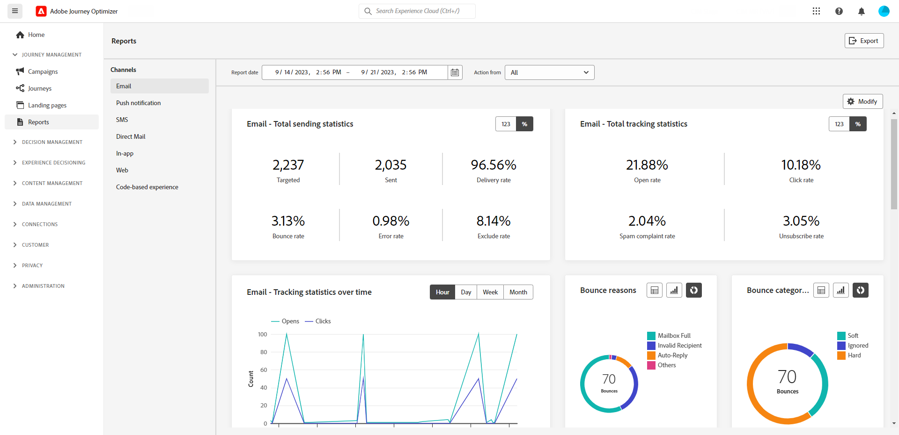
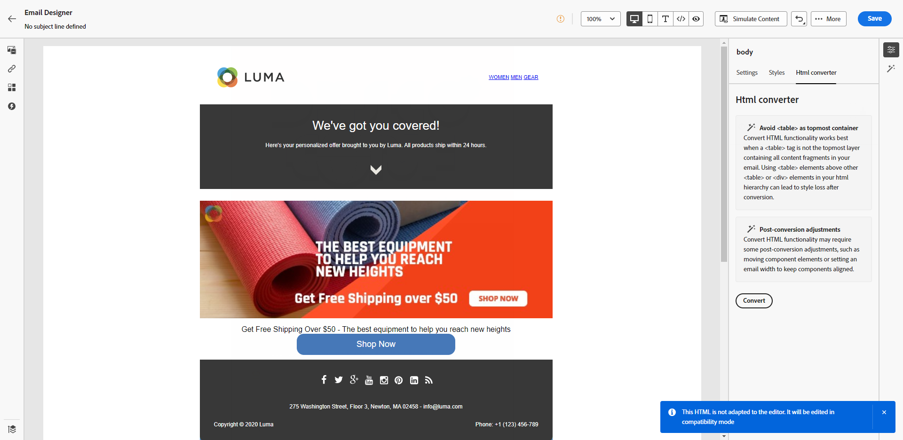

# Aanvullende informatie 2023 {#release-notes-2023}

Deze pagina bevat een overzicht van alle functies en verbeteringen die [!DNL Journey Optimizer] in 2023 heeft uitgebracht.

## Release oktober 1923 {#oct-rn-2023}

### Nieuwe functies{#oct-2023-features}

Deze release biedt de nieuwe mogelijkheden die hieronder worden vermeld.

<table>
<thead>
<tr>
<th><strong>Sandbox-tools</strong> </th>
</tr>
</thead>
<tbody>
<tr>
<td>

Met gereedschappen voor sandboxen kunt u objecten kopiëren naar meerdere sandboxen door gebruik te maken van exporteren en importeren van pakketten. Een pakket kan uit één object of uit meerdere objecten bestaan. Alle objecten die in een pakket zijn opgenomen, moeten afkomstig zijn uit dezelfde sandbox.

<!--img src="../data/assets/dataset-export-setup.png"-->

Raadpleeg de <a href="../building-journeys/copy-to-sandbox.md">gedetailleerde documentatie</a> voor meer informatie.

</td>
</tr>
</tbody>
</table>

<table>
<thead>
<tr>
<th><strong>MMS (Multimedia Message Service) in SMS</strong> </th>
</tr>
</thead>
<tbody>
<tr>
<td>

Met het Kanaal van SMS, kunt u uw mededeling nu verbeteren door de MMS-berichten (Multimedia Message Service) te verzenden, toelatend het delen van beelden, GIFs, of video's met uw klanten. Deze functie is momenteel alleen beschikbaar voor Sinch.

Raadpleeg de <a href="../sms/create-sms.md#mms-content">gedetailleerde documentatie</a> voor meer informatie.

</tr>
</tbody>
</table>

### Verbeteringen {#oct-2023-improvements}

Deze release bevat de verbeteringen die hieronder worden vermeld.

**Doelgroepen**

* U kunt nu doelgroepen kiezen die vanuit een CSV-bestand naar reizen en campagnes zijn geüpload. [Meer informatie](../audience/about-audiences.md#about-segments)
* U kunt nu doelgroepen kiezen die zijn gemaakt door de publiekscompositie en de verrijkingskenmerken van de doelgroep in de stappen. [Meer informatie](../building-journeys/read-audience.md)

>[!AVAILABILITY]
>
>Deze mogelijkheden zijn momenteel beschikbaar als bètaversie.

<!--
**Spam scoring for emails**

* When simulating an email content, a new option enables you to check how your content performs against inboxes spam filtering. This feature is currently proposed to a set of customers only (Limited Availability), and available for the Email channel.-->

**Campagnes**

<!--* You can now stop a live one-time campaign, make modifications and resume it again. This improvement is available in Beta.-->
* Wanneer er een fout optreedt in een van uw campagnes, verschijnt er nu een waarschuwingspictogram in de lijst met campagnes naast de status van de campagne. [Meer informatie](../campaigns/manage-campaigns.md#statuses)

**Reizen**

* De maximale tijdsduur die u in een wachttijd kunt definiëren, is nu 29 dagen in plaats van 30. Deze verbetering is ingevoerd om te voorkomen dat wachttijden langer duren dan de 30 dagen durende reisduur. Dit geldt voor:

   * het **Hoeveelheid van Tijd** gebied in [ wacht activiteit ](../building-journeys/wait-activity.md)
   * de **Ingang wacht periode** in [ reiseigenschappen ](../building-journeys/journey-properties.md#entrance)
   * **wacht op** gebied in de onderbrekingsdefinitie van [ gebeurtenisactiviteiten ](../building-journeys/general-events.md#events-specific-time).

<!--
**Consent in channel configuration**

* You can now select a marketing action at the channel configuration level. When used in a surface, all consent policies associated with that marketing action are leveraged in order to respect the preferences of your customers.-->

**het beheer van het Besluit**

* Verschillende etiketten met betrekking tot het aanbieden van plafonnering in de besluitvormingsinterface zijn bijgewerkt. [Meer informatie](../offers/offer-library/add-constraints.md#capping)

## Release september 1923 {#sept-rn-2023}

### Nieuwe functies{#sept-2023-features}

Deze release biedt de nieuwe mogelijkheden die hieronder worden vermeld.

<table>
<thead>
<tr>
<th><strong>Berekende kenmerken</strong> </th>
</tr>
</thead>
<tbody>
<tr>
<td>

Met berekende kenmerken kunt u gebeurtenisgegevens eenvoudig samenvatten in profielkenmerken via een intuïtieve gebruikersinterface voor verbeterde op gedrag gebaseerde segmentatie, personalisatie en activering. Met deze functie kunt u berekende kenmerken op een zelfservermanier maken, deze beheren en ze in segmentatie gebruiken, in realtime klantprofielbestemmingen of Journey Optimizer.  
Bovendien vereenvoudigt de berekende attributen segmentatie en reisworkflows om u te helpen relevante ervaringen naadloos te leveren. Leer meer in de <a href="../audience/computed-attributes.md"> gedetailleerde documentatie </a>.

</tr>
</tbody>
</table>

<table>
<thead>
<tr>
<th><strong>Geconsolideerde Kanaalrapporten</strong> </th>
</tr>
</thead>
<tbody>
<tr>
<td>

De functie Kanaalrapport biedt analisten en marketers een uitgebreid overzicht van verkeers- en betrokkenheidsgegevens op kanaalniveau.

Om tot het <b> menu van het Rapport </b> toegang te hebben, moet u de <b> toestemming hebben van de Rapporten van het Kanaal van de Mening </b>.

Raadpleeg de <a href="../reports/channel-report-cja.md">gedetailleerde documentatie</a> voor meer informatie.

</tr>
</tbody>
</table>

<table>
<thead>
<tr>
<th><strong>Dataset-exportdoelen (GA)</strong> </th>
</tr>
</thead>
<tbody>
<tr>
<td>

Journey Optimizer-gegevenssets die naar Cloud Storage-doelen worden geëxporteerd, zijn nu over het algemeen beschikbaar. Met deze functie kunt u een live verbinding maken met opslaglocaties in de cloud om de inhoud van uw gegevenssets te exporteren.

Raadpleeg de <a href="../data/export-datasets.md">gedetailleerde documentatie</a> voor meer informatie.

</td>
</tr>
</tbody>
</table>

<table>
<thead>
<tr>
<th><strong>Opslag van gebruikersgegevens voor mobiele toepassingen per sandbox</strong> </th>
</tr>
</thead>
<tbody>
<tr>
<td>

Met deze nieuwe functie kunt u pushgegevens eenvoudig beheren en koppelen aan een specifieke sandbox in App Surfaces.

Raadpleeg de <a href="../in-app/inapp-configuration.md#channel-prerequisites">gedetailleerde documentatie</a> voor meer informatie.

</tr>
</tbody>
</table>

### Verbeteringen {#sept-2023-improvements}

Deze release bevat de verbeteringen die hieronder worden vermeld.

**Beheer van het Besluit**

* Nieuwe API&#39;s voor het maken en beheren van besluitvormingsbeheerobjecten zijn nu beschikbaar. Deze API&#39;s bieden betere prestaties en een verbeterde gebruikerservaring. De oudere API&#39;s worden ondersteund tot 27-03-2024. [Meer informatie](../offers/api-reference/getting-started.md)

**Personalization**

* Naast visuele fragmenten is het nu mogelijk om expressiefragmenten te maken, op te slaan en opnieuw te gebruiken vanuit de Journey Optimizer-interface via de Expressieeditor. Expressiefragmenten vervangen de eerder opgeslagen expressies. [Meer informatie](../personalization/use-expression-fragments.md)

**Alerting**

* Er is een nieuw type systeemwaarschuwing geïntroduceerd. U kunt nu op de hoogte worden gebracht wanneer de activiteit van het a **Gelezen publiek** ontbreekt. [Meer informatie](../reports/alerts.md).

**het kanaal van het Web**

* Toepassingen van één pagina (SPAs) kunnen nu in de Web visuele redacteur worden ontworpen, die u toestaat om te selecteren welke specifieke meningen u uw Web-pagina wijzigingen wilt toepassen op. Een weergave kan worden gedefinieerd als een hele site of een groep visuele elementen op een site, zoals de startpagina, de hele productsite of het voorkeurenframe voor levering op alle afrekenpagina&#39;s. Eenmalige ontwikkelaarsopstelling is nodig om de meningen in de implementatie van SDK van het Web van Adobe Experience Platform te bepalen; dit laat marketers toe om het Webcampagnes van Adobe Journey Optimizer op SPAs tot stand te brengen en in werking te stellen. [Meer informatie](../web/web-spa.md)

* Wanneer u een pagina bewerkt met de webontwerper, kunt u nu rechtstreeks vanuit het deelvenster Wijzigingen nieuwe wijzigingen aan uw inhoud toevoegen, zonder dat u een component hoeft te selecteren en te bewerken vanuit de ontwerpinterface. [Meer informatie](../web/manage-web-modifications.md#add-modifications)

* Wanneer u websubdomeinen instelt, kunt u nu ook uw eigen subdomein toevoegen, naast het gebruik van een subdomein dat al is gedelegeerd aan Adobe. [Meer informatie](../web/web-delegated-subdomains.md#web-configure-new-subdomain)

**Reizen**

* Wanneer u een reis dupliceert, kunt u nu de naam van de reiskopie definiëren. [Meer informatie](../building-journeys/journey-gs.md#duplicate-a-journey)

* Ondersteuning voor aangepaste acties is nu GA. Met deze mogelijkheid kunt u API-oproepreacties gebruiken in aangepaste acties en uw reis ordenen op basis van deze reacties. Bovendien is a [ nieuwe het begrenzen guardrail ](../start/guardrails.md#custom-actions-g) toegevoegd om douaneactievraag automatisch te beperken. [Meer informatie](../action/action-response.md)
<!--
* The maximum duration that you can define in the Wait activity is now 29 days instead of 30.
-->

**E-mailkanaal**

* Met een nieuwe optie in de configuratie van het e-mailoppervlak kunt u ervoor kiezen om transactieberichten naar profielen te verzenden, zelfs als hun e-mailadres voorkomt in de onderdrukkingslijst van Adobe [!DNL Journey Optimizer] . [Meer informatie](../email/email-settings.md#send-to-suppressed-email-addresses)

**Sms-kanaal**

* Twee nieuwe gebieden, **Opt-binnen bericht** en **het bericht van de Hulp**, zijn toegevoegd aan het API configuratiescherm, toestaand gebruikers om reacties voor binnenkomende sleutelwoorden aan te passen. Merk op dat dit slechts voor de leverancier van SMS van Sinch beschikbaar is. [Meer informatie](../sms/sms-configuration.md)

* De opt-out van SMS wordt niet meer beheerd op kanaalniveau. Het is nu numeriek-specifiek, wat betekent dat als sommige profielen van een bepaald aantal of korte code opteren, u hen nog berichten van andere aantallen kunt verzenden u kunt gebruiken om SMS berichten te verzenden. Een nieuwe optie laat u toe om het **Opt-uit aantal** te selecteren u voor een bepaald oppervlak wilt gebruiken. [Meer informatie](../sms/sms-configuration.md)

**Directe postkanaal**

* U kunt nu bestanden versleutelen die zijn bedoeld voor uw direct-mailproviders wanneer deze worden overgebracht naar een server. Om dit te doen, is een nieuw gebied beschikbaar in het dossier dat configuratiescherm verplettert, toestaand u om uw encryptiesleutel te kopiëren-kleven. [Meer informatie](../direct-mail/direct-mail-configuration.md)

**Meldend**

* U kunt nu Journey Optimizer-rapporten exporteren als CSV-bestand. Leer meer in de [ gedetailleerde documentatie ](../reports/report-gs-cja.md).

**Assets**

* Met een nieuwe optie voor Assets kunt u de gegevensopslagruimte voor uw Assets in Journey Optimizer kiezen. U kunt kiezen voor een gegevensopslagruimte voor Elementen of een Assets as a Cloud Service-opslagplaats, op voorwaarde dat u eigenaar bent van deze oplossing. [Meer informatie](../integrations/assets.md)

<!--**Decision management**

Enhancements have been made to the audience picker in journeys or campaigns, with the addition of new columns displaying the origin and update frequency of audiences.    -->

## Release van augustus 1923 {#aug-rn-2023}

### Nieuwe functies{#aug-2023-features}

Deze release biedt de nieuwe mogelijkheden die hieronder worden vermeld.

<table>
<thead>
<tr>
<th><strong>In-app berichten verzenden tijdens uw reizen</strong> </th>
</tr>
</thead>
<tbody>
<tr>
<td>

U kunt nu persoonlijke In-app-berichten naar uw app-gebruikers verzenden voor een reis. Met Journey Optimizer kunt u meldingen ontwerpen en de lay-out, weergave, tekst en knoppen van berichten aanpassen voor een naadloze ervaring.

Raadpleeg de <a href="../in-app/create-in-app.md">gedetailleerde documentatie</a> voor meer informatie.

</tr>
</tbody>
</table>

<table>
<thead>
<tr>
<th><strong>E-mails met lijsten met zaden valideren</strong> </th>
</tr>
</thead>
<tbody>
<tr>
<td>

U kunt nu zaadlijsten maken en beheren in Journey Optimizer. Een zaadlijst bestaat uit interne adressen die aan uw daadwerkelijke publiek kunnen worden toegevoegd en het nauwkeurige zelfde bericht zoals de gerichte profielen bij de tijd van de leveringsuitvoering ontvangen. Gebruik deze mogelijkheid om de verzonden communicatie te controleren en ervoor te zorgen dat alle weergave-indelingen, URL's, afbeeldingen en koppelingen correct zijn.

Raadpleeg de <a href="../configuration/seed-lists.md">gedetailleerde documentatie</a> voor meer informatie.

</td>
</tr>
</tbody>
</table>

<!--table>
<thead>
<tr>
<th><strong>Generate text and images with the Content assistant</strong> </th>
</tr>
</thead>
<tbody>
<tr>
<td>

Once you have created and personalized your message, take your content to the next level with the Content assistant. You can now use the Content assistant to optimize your message's impact by experimenting with different main titles, and images. Each variant is managed as a unique Treatment, to measure and compare which title effectively generates more clicks.

This capability is currently available as a private beta.

For more information, refer to the <a href="../start/search-filter-categorize.md#tags">detailed documentation</a>.

</td>
</tr>
</tbody>
</table-->

### Verbeteringen {#aug-2023-improvements}

Deze release bevat de verbeteringen die hieronder worden vermeld.

<!--
**APIs**

A new API to create and manage Content Fragments is now available. [Learn more](https://developer.adobe.com/journey-optimizer-apis/references/content-templates/#tag/Content-fragment-API){target="_blank"}.-->

<!--**Email channel**

A new option is available in the email surface settings to include email addresses suppressed due to spam complaint in your transactional messages audiences. Even if they marked marketing messages as spam, these profiles can then receive transactional messages, such as password reset or account statements. This option is disabled by default.-->

**Reizen**

* U kunt nu API vraagreacties in douaneacties gebruiken en uw reis structureren die op deze reacties wordt gebaseerd. Deze functie is momenteel beschikbaar als een bètaversie. [Meer informatie](../action/action-response.md).
* Er is een nieuw type systeemwaarschuwing geïntroduceerd. U kunt nu een melding krijgen wanneer een aangepaste handeling mislukt. [Meer informatie](../reports/alerts.md).
  <!--* When duplicating a journey, you can now define the name of the journey copy.-->

**Direct mail**

* Azure kan nu als servertype in het dossier worden geselecteerd dat configuratie verplettert. [Meer informatie](../direct-mail/direct-mail-configuration.md#file-routing-configuration)
* Ampersand is nu beschikbaar als veld voor kolomscheidingen in de instellingen voor het oppervlak voor directe e-mail. [Meer informatie](../direct-mail/direct-mail-configuration.md#direct-mail-surface)

## Release van juli 1923 {#july-rn-2023}

### Nieuwe functies{#july-2023-features}

<table>
<thead>
<tr>
<th><strong>Samenstelling publiek</strong> </th>
</tr>
</thead>
<tbody>
<tr>
<td>

U kunt nu compositieworkflows maken om bestaande Adobe Experience Platform-soorten publiek te combineren tot een visueel canvas en verschillende activiteiten (splitsen, verrijken...) gebruiken om nieuwe soorten publiek te maken. Nieuw gecreëerd publiek wordt samen met het bestaande publiek weer in Adobe Experience Platform opgeslagen en kan in Journey Optimizer-campagnes worden gebruikt om klanten te bereiken.

Raadpleeg de <a href="../audience/get-started-audience-orchestration.md">gedetailleerde documentatie</a> voor meer informatie.

De samenstelling van het publiek is volledig geïntegreerd met het nieuwe Adobe Experience Platform-menu "Soorten publiek", dat als een gecentraliseerd portaal voor het publiek fungeert. U kunt nu een bladerpagina gebruiken die een nieuw dashboard met segmenttendensen en overlappingen omvat om nieuwe inzichten te vinden en organisatorische hulpmiddelen voor het folderen en het etiketteren te onderzoeken. Binnen deze ervaring zijn beheerbesturingselementen ingebouwd voor gestandaardiseerde publiekslabels en mogelijkheden voor levenscyclusbeheer van het publiek om activeringsworkflows te beheren. Met deze nieuwe beheerervaring kunt u het publiek nu gemakkelijk en veilig beheren vanaf één locatie. Voor meer informatie, verwijs naar <a href="https://experienceleague.adobe.com/docs/experience-platform/segmentation/ui/overview.html" target="_blank"> documentatie van Adobe Experience Platform </a>.

</td>
</tr>
</tbody>
</table>

<table>
<thead>
<tr>
<th><strong>Direct mailkanaal</strong> </th>
</tr>
</thead>
<tbody>
<tr>
<td>

U kunt nu direct-mailberichten toevoegen aan uw campagnes. Directe post is een off-line kanaal dat u toestaat om de dossiers te personaliseren en te produceren die door directe postleveranciers worden vereist om post naar uw klanten te verzenden.

Wanneer u een directe postbestelling voorbereidt, genereert Journey Optimizer een bestand met alle doelprofielen en de gekozen contactgegevens (bijvoorbeeld postadres). U kunt dit bestand dan naar uw direct-mailprovider sturen, die voor de werkelijke verzending zorgt.

Direct mail channel is momenteel niet beschikbaar voor organisaties die de invoegtoepassing Adobe Healthcare Shield hebben aangeschaft.

Raadpleeg de <a href="../direct-mail/get-started-direct-mail.md">gedetailleerde documentatie</a> voor meer informatie.

</tr>
</tbody>
</table>

<table>
<thead>
<tr>
<th><strong>HTML-inhoud converteren voor de e-mail-Designer</strong> </th>
</tr>
</thead>
<tbody>
<tr>
<td>

U kunt nu HTML-inhoud importeren en converteren in de e-maileditor van Journey Optimizer. Inhoudsblokken worden automatisch geïdentificeerd en zijn beschikbaar in de e-mail Designer: gebruik de krachtige ontwerpmogelijkheden om de inhoud bij te werken en aan uw persoonlijke wensen aan te passen!

Raadpleeg de <a href="../email/existing-content.md">gedetailleerde documentatie</a> voor meer informatie.

</td>
</tr>
</tbody>
</table>

<table>
<thead>
<tr>
<th><strong>Tags gebruiken in Journey Optimizer</strong> </th>
</tr>
</thead>
<tbody>
<tr>
<td>

Naast campagnes en reizen kunt u nu Adobe Experience Platform Unified Tags toewijzen aan uw bestemmingspagina's, inhoudssjablonen, fragmenten en abonnementenlijsten. Op deze manier kunt u ze gemakkelijk classificeren en kunt u zoeken en navigeren in alle lijsten verbeteren. 

Raadpleeg de <a href="../start/search-filter-categorize.md#tags">gedetailleerde documentatie</a> voor meer informatie.

</td>
</tr>
</tbody>
</table>

<table>
<thead>
<tr>
<th><strong>Inhoudssjablonen, API's</strong> </th>
</tr>
</thead>
<tbody>
<tr>
<td>

U kunt nu Adobe Journey Optimizer-inhoudssjablonen maken en beheren met behulp van speciale API's, zodat u uw bestaande inhoudssysteem naadloos kunt integreren.

Raadpleeg de <a href="https://developer.adobe.com/journey-optimizer-apis/references/content/">gedetailleerde documentatie</a> voor meer informatie.

</td>
</tr>
</tbody>
</table>

### Verbeteringen {#july-2023-improvements}

Deze release bevat de verbeteringen die hieronder worden vermeld.

**Campagnes**

Contextuele gebeurtenissen met betrekking tot campagnes zijn nu beschikbaar voor gebruik in het menu Contextafhankelijke kenmerken van de verpersoonlijkingseditor.

**Doelgroepen**

Er zijn verbeteringen aangebracht in de publiekekiezer tijdens reizen of campagnes, met toevoeging van nieuwe kolommen waarin de oorsprong en de actualiseringsfrequentie van het publiek worden weergegeven. Met de release van het portal voor publiekscompositie hebben Adobe Experience Platform en Adobe Journey Optimizer het gebruik van &quot;publiek&quot; en &quot;segment&quot; binnen het systeem en de documentatie bijgewerkt.

* Publiek: Een reeks personen, accounts, huishoudens of andere entiteiten die gemeenschappelijke kenmerken en gedragingen delen.
* Segmentdefinitie: in Adobe Experience Platform worden de regels gebruikt om sleutelkenmerken of gedrag van een doelgroep te beschrijven. Deze term werd voorheen &quot;segment&quot; genoemd.

Als gevolg hiervan worden in Adobe Journey Optimizer en de gebruikersinterface van Adobe Experience Platform &quot;Segmenten&quot; vervangen door &quot;Soorten publiek&quot; om deze nieuwe weg van publieksvorming en -beheer weer te geven.

**APIs**

De JWT-methode voor het genereren van toegangstokens voor Adobe Journey Optimizer API-verificatie is afgekeurd. Alle nieuwe integraties moeten worden gecreeerd gebruikend de server-aan-Server authentificatiemethode OAuth. Adobe raadt u ook aan uw bestaande integratie te migreren naar de OAuth-methode. [Meer informatie](https://developer.adobe.com/journey-optimizer-apis/references/authentication/){target="_blank"}.

**Overige wijzigingen**

Journey Optimizer-gegevenssets die naar Cloud Storage-doelen worden geëxporteerd, zijn nu beschikbaar voor alle klanten als een openbare bètaversie. Met deze functie kunt u een live verbinding maken met opslaglocaties in de cloud om de inhoud van uw gegevenssets te exporteren. [Meer informatie](../data/export-datasets.md)

## Release van juni 1923 {#june-rn-2023}

<table>
<thead>
<tr>
<th><strong>API-getriggerde campagnes voor het op de markt brengen van gebruiksgevallen</strong> </th>
</tr>
</thead>
<tbody>
<tr>
<td>

U kunt nu API's gebruiken om marketingcampagnes in Adobe Journey Optimizer te starten vanaf een extern systeem.

Tot deze versie, beantwoordde API-teweeggebrachte campagnecapaciteit diverse operationele en transactionele overseinenbehoeften zoals wachtwoordterugstellen of teken OTP, maar kon niet worden gebruikt om marketing campagnes tot stand te brengen. Beschikbare kanalen voor API-getriggerde campagnes zijn: E-mail, SMS en Push berichten.

Raadpleeg de <a href="../campaigns/api-triggered-campaigns.md">gedetailleerde documentatie</a> voor meer informatie.
</td>
</tr>
</tbody>
</table>

<!--
### Improvements {#june-2023-improvements}

**Audiences**

Enhancements have been made to the audience picker in journeys or campaigns, with the addition of new columns displaying the origin and update frequency of audiences.

**Journeys**

You can now leverage API call responses in custom actions and orchestrate your journey based on these responses.
-->

<!--
## June 2023 early release notes {#june-rn-2023}

Information below is subject to change without prior notice until the release availability date. Updated documentation will be published at the release date, and direct links will be added on this page.

**Audiences**

Enhancements have been made to the audience picker in journeys or campaigns, with the addition of new columns displaying the origin and update frequency of audiences.    

**Journeys**

* You can now leverage API call responses in custom actions and orchestrate your journey based on these responses.     

* A new type of system alert has been introduced. You can now get notified when a custom action fails.
-->

## Release mei &#39;23 {#may-rn-2023}

### Nieuwe functies{#may-2023-features}

<table>
<thead>
<tr>
<th><strong>Inhoud experimenteren in campagnes</strong> </th>
</tr>
</thead>
<tbody>
<tr>
<td>

Adobe Journey Optimizer steunt nu experimenten in campagnes. Experimenten zijn gerandomiseerde onderzoeken, die in de context van online tests betekenen dat u sommige willekeurig geselecteerde gebruikers aan een bepaalde variatie van een bericht blootstelt, en een andere willekeurig geselecteerde reeks gebruikers aan één of andere andere variatie of behandeling. Na blootstelling, kunt u de resultaatmetriek meten u in geinteresseerd bent, zoals opent van e-mail, abonnementen, of aankopen.

Raadpleeg de <a href="../content-management/content-experiment.md">gedetailleerde documentatie</a> voor meer informatie.

</td>
</tr>
</tbody>
</table>

<!--
<table>
<thead>
<tr>
<th><strong>Objective reporting and performance measurement in campaigns</strong> </th>
</tr>
</thead>
<tbody>
<tr>
<td>

You can now measure the performance of your campaigns across inbound and outbound through dedicated reports. Adobe Journey Optimizer reports can retrieve additional metrics to use in the Objectives tab of your campaign reports.

For more information, refer to the <a href="../reports/campaign-global-report-cja.md">detailed documentation</a>.

</td>
</tr>
</tbody>
</table>
-->

<table>
<thead>
<tr>
<th><strong>Fragmenten maken en gebruiken in uw e-mailinhoud</strong> </th>
</tr>
</thead>
<tbody>
<tr>
<td>

U kunt nu fragmenten ontwerpen, gebruiken en beheren om uw e-mails en inhoudssjablonen snel samen te stellen. Een fragment is een vooraf gebouwde herbruikbare component waarnaar in meerdere e-mails van Journey Optimizer-campagnes en -reizen kan worden verwezen voor een verbeterd en versneld ontwerpproces.

Raadpleeg de <a href="../content-management/fragments.md">gedetailleerde documentatie</a> voor meer informatie.

</td>
</tr>
</tbody>
</table>

<table>
<thead>
<tr>
<th><strong>Tags gebruiken in uw campagnes (Beta)</strong> </th>
</tr>
</thead>
<tbody>
<tr>
<td>

U kunt nu Adobe Experience Platform Unified Tags toewijzen aan uw campagnes. Op deze manier kunt u ze gemakkelijk classificeren en de zoekopdracht in de lijst met campagnes verbeteren. Merk op dat de Verenigde markeringseigenschap momenteel in bèta is.

Raadpleeg de <a href="../start/search-filter-categorize.md#tags">gedetailleerde documentatie</a> voor meer informatie.

</td>
</tr>
</tbody>
</table>

<table>
<thead>
<tr>
<th><strong>Persoonlijk beoordelingsmodel voor optimalisatie voor AI (algemene beschikbaarheid)</strong> </th>
</tr>
</thead>
<tbody>
<tr>
<td>

De gepersonaliseerde Optimalisering AI rangschikkingsmodellen zijn nu algemeen beschikbaar in Beslissingsbeheer. Met dit nieuwe type model kunt u aanbiedingen optimaliseren en aanpassen op basis van publiek en prestaties.

Raadpleeg de <a href="../offers/ranking/personalized-optimization-model.md">gedetailleerde documentatie</a> voor meer informatie.

</td>
</tr>
</tbody>
</table>

### Verbeteringen {#may-2023-improvements}

**Doelgroepen**

* Ter voorbereiding op de algemene beschikbaarheid van de Poortfunctie Publiek werkt Adobe Experience Platform het gebruik van &quot;publiek&quot; en &quot;segment&quot; binnen het systeem en de documentatie bij.

   * Publiek: Een reeks personen, accounts, huishoudens of andere entiteiten die gemeenschappelijke kenmerken en gedragingen delen.
   * Segmentdefinitie: in Adobe Experience Platform worden de regels gebruikt om sleutelkenmerken of gedrag van een doelgroep te beschrijven. Deze term werd voorheen &quot;segment&quot; genoemd.

  Dientengevolge, binnen Adobe Journey Optimizer en Adobe Experience Platform UI, zult u &quot;Segmenten&quot;vervangen door &quot;Publiek&quot;zien om deze nieuwe weg van publieksverwezenlijking en beheer te weerspiegelen.

  De vertalingen van de term &quot;publiek&quot; voor een groep profielen die bedoeld zijn om een bericht te ontvangen, zijn voor sommige talen geharmoniseerd voor alle Digital Experience-producten:

   * Duits: Zielgruppe
   * Braziliaans Portugees: público-alvo
   * Spaans: público destinatario

<!--* Enhancements have been made to the audience picker in journeys or campaigns, with the addition of new columns displaying the origin and update frequency of audiences.-->

**Sms-kanaal**

* Infobip is toegevoegd als leverancier wanneer het vormen van uw het kanaalconfiguraties van SMS. [Meer informatie](../sms/sms-configuration.md)
* Twillio - De API credentieopstelling omvat nu de capaciteit om de dienst SID van het Overseinen voor naadloze integratie met uw rekening van Twilio toe te voegen. [Meer informatie](../sms/sms-configuration.md)

**In-app kanaal**

* Toegevoegde nieuwe berichttriggerregels voor Adobe Places Service. [Meer informatie](../in-app/inapp-configuration.md)
* Nieuwe Adobe Experience Platform Assurance-mogelijkheden toegevoegd om apparaatgebeurtenissen vast te leggen die moeten worden toegevoegd als triggerregels.

<!--
**Journeys**

* You can now leverage API call responses in custom actions and orchestrate your journey based on these responses.
-->

**Campagnes**

* Het is nu mogelijk een campagne te dupliceren vanuit het inventarisscherm met behulp van het actiemenu voor ovaal. [Meer informatie](../campaigns/manage-campaigns.md#duplicate)
* U kunt nu ontwerpwijzigingen in een live campagne verwijderen.
* De stappen voor het activeren van een campagne zijn nu gestroomlijnd. [Meer informatie](../campaigns/manage-campaigns.md)

**Beheer van het Besluit**

* U kunt nu de frequentietoewijzing bewerken als de aanbieding de **[!UICONTROL Draft]** -status heeft en nog nooit eerder is gepubliceerd met de functie voor frequentietoewijzing ingeschakeld. [Meer informatie](../offers/offer-library/add-constraints.md#frequency-capping)

**Personalization**

* U kunt elementverwijzingen nu rechtstreeks vanuit de Personalization Editor selecteren en invoegen wanneer u in HTML-inhoud werkt.

### Oplossingen{#may-2023-fixes}

* In-app Berichten - Probleem verholpen waarbij het plannen van de campagne conflicteerde met de instellingen voor berichtfrequentie.

## Release van april 1923 {#apr-rn-2023}

<!--Information below is subject to change without prior notice until the release availability date. Updated documentation will be published at the release date, and direct links will be added on this page.

**Release date**: April 27, 2023-->

### Nieuwe functies{#apr-2023-features}

<table>
<thead>
<tr>
<th><strong>Webkanaal (algemene beschikbaarheid)</strong> </th>
</tr>
</thead>
<tbody>
<tr>
<td>

Adobe Journey Optimizer breidt zijn mogelijkheden over de kanalen uit door steun voor Webkanaal toe te voegen. U kunt nu net als elk ander kanaal een webeleving ontwerpen, wijzigen en voorvertonen via een slimme en intuïtieve visuele interface om uw ervaring voor eindgebruikers aan te passen. Op dit moment kunt u in Journey Optimizer alleen webervaringen maken in campagnes.

Raadpleeg de <a href="../web/get-started-web.md">gedetailleerde documentatie</a> voor meer informatie.

</tr>
</tbody>
</table>

<table>
<thead>
<tr>
<th><strong>Snelstartworkflow voor mobiele toegang (Beta)</strong> </th>
</tr>
</thead>
<tbody>
<tr>
<td>

De nieuwe workflow voor snel starten op het instapmodel voor mobiele apparaten is nu beschikbaar. Met deze nieuwe productfunctie kunt u de Mobile SDK snel configureren om gegevens van mobiele gebeurtenissen te verzamelen en te valideren en om mobiele pushberichten te verzenden met Adobe Journey Optimizer. Dit vermogen is toegankelijk via de homepage van de Inzameling van Gegevens als openbare bèta.

Raadpleeg de <a href="../push/mobile-onboarding-wf.md">gedetailleerde documentatie</a> voor meer informatie.

</td>
</tr>
</tbody>
</table>

<table>
<thead>
<tr>
<th><strong>Nieuw journaal (Beta)</strong> </th>
</tr>
</thead>
<tbody>
<tr>
<td>

 Het dashboard Journey is nu gesplitst in twee tabbladen:

<ul><li>Gebruik het <strong> Overzicht </strong> lusje om tot een nieuw dashboard toegang te hebben dat zeer belangrijke metriek met betrekking tot uw reizen toont.</li>
<li>Gebruik <strong> doorbladert </strong> lusje om tot de lijst van alle reizen toegang te hebben.</li></ul>

Deze mogelijkheid is toegankelijk voor alle reizen als een openbare bètaversie.

Raadpleeg de <a href="../building-journeys/journey-gs.md#journey-access">gedetailleerde documentatie</a> voor meer informatie.

</td>
</tr>
</tbody>
</table>

### Verbeteringen {#april-2023-improvements}

**Reizen**

* Het reiscanvas geeft nu de activiteit-id weer op berichtactiviteiten en eindtags. Dit verbetert rapportage en heroriëntering.
* De indeling van het configuratievenster, dat wordt weergegeven in handelingen, gegevensbronnen, gebeurtenissen en reizen, is verbeterd.
* Nieuwe insight voor het aantal knooppunten op het canvas met beveiligingen om mee te groeien: maak reizen eenvoudig leesbaar, maak een kwaliteitscontrole en los problemen met een maximumaantal knooppunten per reis op 50. [Meer informatie](../start/guardrails.md#journeys-guardrails-journeys)
* Wanneer het toevoegen van een [ E-mail ](../email/create-email.md), [ SMS ](../sms/create-sms.md) of [ duw ](../push/create-push.md) actie in een reis, wordt de oppervlakte nu voorgevuld, door gebrek, met de laatste gebruikte oppervlakte voor dat kanaal, in de huidige reis.
* U kunt nu statische of dynamische queryparameters definiëren in uw aangepaste handelingen. [Meer informatie](../action/about-custom-action-configuration.md#url-configuration)

**Meldend**

* U kunt nu Journey Optimizer-rapporten exporteren als PDF. [Meer informatie](../reports/report-gs-cja.md)

**Inhoud Designer**

* De Adobe Journey Optimizer Content Designer is bijgewerkt en de toegang tot ontwerpstijlen en -componenten is nu eenvoudiger. Deze nieuwe versie biedt een verbeterde gebruikerservaring en wordt geleverd met verbeterde prestaties, gedeeltelijke compatibiliteit met donkere modi en ondersteuning voor nieuwe toegankelijkheidsstandaarden.

## Release van maart 1923 {#mar-2023}

### Nieuwe functies{#mar-2023-features}

<table>
<thead>
<tr>
<th><strong>Kanaal in de app (algemene beschikbaarheid)</strong> </th>
</tr>
</thead>
<tbody>
<tr>
<td>

U kunt nu binnen een campagne persoonlijke In-app-berichten naar gebruikers van de app sturen. Met Journey Optimizer kunt u meldingen ontwerpen en de lay-out, weergave, tekst en knoppen van berichten aanpassen voor een naadloze ervaring.

Raadpleeg de <a href="../../rp_landing_pages/in-app-landing-page.md">gedetailleerde documentatie</a> voor meer informatie.

</tr>
</tbody>
</table>

<table>
<thead>
<tr>
<th><strong>SMS-klik bijhouden</strong> </th>
</tr>
</thead>
<tbody>
<tr>
<td>

Met SMS klikt het volgen, kunt u de prestaties van uw verkorte URLs controleren, identificeren wie op hen klikte, en deze gegevens gebruiken om die klanten met verdere campagnes opnieuw te richten.

Raadpleeg de <a href="../sms/create-sms.md#sms-content">gedetailleerde documentatie</a> voor meer informatie.

</td>
</tr>
</tbody>
</table>

<table>
<thead>
<tr>
<th><strong>Tags gebruiken in uw reizen (Beta)</strong> </th>
</tr>
</thead>
<tbody>
<tr>
<td>

Als Journey Optimizer-expert kunt u uw zakelijke objecten nu organiseren met tags. Met tags kunt u objecten snel en eenvoudig classificeren om zoekopdrachten te verbeteren. Deze functie is momenteel beschikbaar in bèta en alleen voor reizen.

Raadpleeg de <a href="../start/search-filter-categorize.md#tags">gedetailleerde documentatie</a> voor meer informatie.

</td>
</tr>
</tbody>
</table>

### Verbeteringen {#mar-2023-improvements}

**Reizen**

* Nieuwe **het Throtteren API** staat u toe om een grens op het aantal gebeurtenissen te plaatsen die per seconde worden verzonden, verhinderend overweldigende verkeerspikes op uw externe systemen of API. Wanneer de ingestelde limiet is bereikt, worden alle volgende API-aanroepen zo snel mogelijk in de wachtrij geplaatst en verwerkt in de volgorde waarin ze zijn ontvangen. Houd er rekening mee dat deze functie slechts ondersteuning biedt voor één configuratie met vertraagde verwerking van al uw sandboxen. [Meer informatie](../configuration/external-systems.md)
* Het canvas Journey is verbeterd voor een eenvoudigere en verbeterde gebruikerservaring. Aan het einde van elk pad op het canvas zijn de lege plaatsaanduidingen verwijderd. U kunt nu gewoon uw activiteiten toevoegen door deze aan het einde van een pad te slepen.
* In het wegcanvas, is het etiket van de **Eind** markering niet meer automatisch plaats met de naam van de vorige activiteit. Gebruikers kunnen desgewenst handmatig een aangepast label toevoegen.
* De standaardonderbreking en foutenduur in reiseigenschappen zijn veranderd van 5 aan 30 seconden. [Meer informatie](../configuration/external-systems.md#timeout)
* De standaardsnelheid voor het wijzigen van het aantal berichten voor het publiek is gewijzigd van 20.000 in 5.000 berichten per seconde. [Meer informatie](../building-journeys/read-audience.md#configuring-segment-trigger-activity)
* Er is een hulplijn toegevoegd aan de testmodus om alleen te luisteren naar gebeurtenissen die via de interface worden verzonden. Er wordt geen rekening gehouden met gebeurtenissen die via een extern gereedschap worden verzonden. [Meer informatie](../building-journeys/testing-the-journey.md)

<!-- 
* When adding an Email, SMS or Push action in a journey, the surface is now pre-filled, by default, with the last used surface for that channel.
* A new type of system alert has been introduced. You can now get notified when a custom action fails. [Learn more](../reports/alerts.md)
* Timeout and error management has been improved in journeys. Timeout and error paths are now always added on the canvas. A new toolbar button is available to show/hide these paths. [Learn more](../building-journeys/journey-gs.md#timeout_and_error)
* The Journey dashboard is now split in two tabs:
    * Use the **Overview** tab to access a new dashboard which displays key metrics related to your journeys.
    * Use the **Browse** tab to access list of all journeys.
-->

**het beheer van het Besluit**

* Om mogelijke verwarring met de recente versie van tags in Adobe Experience Platform te voorkomen, zijn de namen van Beslissingsbeheertags gewijzigd in &quot;Verzamelingsaanduidingen&quot;.

  Hoewel de term &quot;tag&quot; niet meer wordt gebruikt in de gebruikersinterface van het besluitvormingsbeheer, wordt deze nog steeds gebruikt in back-endservices zoals API&#39;s en datasets.

* U kunt de teller van de aanbieding nu op een dagelijkse, wekelijkse of maandelijkse basis terugstellen. [Meer informatie](../offers/offer-library/add-constraints.md#capping)

* U kunt ook kiezen naar welke Adobe Experience Platform-gebeurtenis moet worden gekeken voor de limiet voor het bepalen van aanbiedingen. [Meer informatie](../offers/offer-library/add-constraints.md#capping)

* Er zijn aanvullende parameters toegevoegd aan het scherm Plaatsingsontwerp. Hiermee kunt u bepalen of een aanbieding op meerdere plaatsen kan worden gedupliceerd en kunt u opgeven of de inhoud en metagegevens van de aanbieding moeten worden opgenomen in de API-reactie. [Meer informatie](../offers/offer-library/creating-placements.md)

**Personalization**

* U kunt nu standaardterugvaltekst voor op tekenreeks gebaseerde profielkenmerken opnemen in de Expressieeditor. Deze waarden worden weergegeven als de geselecteerde kenmerken geen resultaat opleveren. [Meer informatie](../personalization/personalization-build-expressions.md#add)

**Meldend**

* De functionaliteit van de widget voor rapportage is verbeterd en het is nu mogelijk om aan te passen hoe gebruikers hun gegevens bekijken. Met deze verbetering kunnen gebruikers nu kiezen tussen meerdere visualisatieopties, zoals grafiek, tabel en donutgrafieken.

  Als u toegang wilt hebben tot de meest recente widgets, moet u de verschillende rapportdashboards opnieuw instellen. Voor meer informatie over dashboardaanpassing, verwijs naar de [ gedetailleerde documentatie ](../reports/report-gs-cja.md).

## Release van februari &#39;23 {#feb-2023}

### Nieuwe functies{#feb-2023-features}

<table>
<thead>
<tr>
<th><strong>Kanaal in de app (Beta)</strong> </th>
</tr>
</thead>
<tbody>
<tr>
<td>

U kunt nu binnen een campagne persoonlijke In-app-berichten naar gebruikers van de app sturen. Met Journey Optimizer kunt u meldingen ontwerpen en de lay-out, weergave, tekst en knoppen van berichten aanpassen voor een naadloze ervaring.

<strong> Voorzichtigheid </strong> - Deze eigenschap is momenteel in bètaversie en slechts beschikbaar aan bètaklanten. Neem contact op met de klantenservice van Adobe om deel te nemen aan het bètaprogramma.

Raadpleeg de <a href="../../rp_landing_pages/in-app-landing-page.md">gedetailleerde documentatie</a> voor meer informatie.

</td>
</tr>
</tbody>
</table>

<table>
<thead>
<tr>
<th><strong>Journey Optimizer-gegevenssets exporteren naar Cloud Storage-doelen (Beta)</strong> </th>
</tr>
</thead>
<tbody>
<tr>
<td>

U kunt nu een live verbinding maken met opslaglocaties in de cloud om de inhoud van uw gegevenssets te exporteren. Beschikbare bestemmingen zijn: Amazon S3 Cloud Storage, Azure Blob, Azure Data Lake Gen 2, Data Landing Zone, Google Cloud Storage, SFTP.

<strong> Voorzichtigheid </strong> - Deze eigenschap is momenteel in bèta en beschikbaar aan alle gebruikers van Adobe Journey Optimizer. Werk samen met uw Adobe-medewerker om toegang te krijgen tot Doelen als u nog geen toegang hebt.

Raadpleeg de <a href="../data/export-datasets.md">gedetailleerde documentatie</a> voor meer informatie.

</td>
</tr>
</tbody>
</table>

<!--

<table>
<thead>
<tr>
<th><strong>Performance Measurement in campaigns</strong> </th>
</tr>
</thead>
<tbody>
<tr>
<td>

You can now measure the performance of your campaigns across inbound and outbound through dedicated reports. Adobe Journey Optimizer reports can retrieve additional metrics to use in the <strong>Objective</strong> tab of your campaign reports. 

For more information, refer to the <a href="../privacy/data-hygiene.md">detailed documentation</a>.

</td>
</tr>
</tbody>
</table>

+++ Learn more about Performance Measurement

The **[!UICONTROL Objective]** tab of your Campaign report allows you to better fine-tune your deliveries' reports by targeting one specific metric. With this feature, you can effectively track and analyze your campaign's performance and make informed decisions to improve your results.

The **[!UICONTROL Objectives]** listed are linked to **[!UICONTROL Datasets]** that define a connection to a system in order to retrieve additional information. A list of pre-configured **[!UICONTROL Objectives]** is available, but you can also customize your report by adding new **[!UICONTROL Datasets]** and defining your own objectives. 

By selecting the desired Objectives, the **[!UICONTROL Performance overview]** and **[!UICONTROL Campaign objective]** widgets provide a comprehensive and insightful summary of your delivery performance, allowing you to closely monitor and evaluate the success of your campaign.

With the **[!UICONTROL Campaign objective]** widget, you can also choose to compare your primary objective against another performance metric.

Note that each widget can be resized and deleted as needed.
+++

<table>
<thead>
<tr>
<th><strong>Use Tags in your Journeys</strong> </th>
</tr>
</thead>
<tbody>
<tr>
<td>

As a Journey Optimizer practitioner, you can now organize your business objects using tags. Tags are a quick and easy way of classifying objects to improve search. Tags are currently only available for Journeys.

</td>
</tr>
</tbody>
</table>

-->

### Verbeteringen {#feb-2023-improvements}

**Reizen**

* Het **Reentrance wacht periode** gebied is toegevoegd aan de reiseigenschappen. In dit veld kunt u de tijd definiëren die u moet wachten voordat u een profiel toestaat om de reis opnieuw te betreden tijdens een enkele reis (te beginnen met een evenement of een publiekskwalificatie). Hierdoor wordt voorkomen dat ritten meerdere keren ten onrechte worden geactiveerd voor dezelfde gebeurtenis. Het veld wordt standaard ingesteld op 5 minuten. [Meer informatie](../building-journeys/journey-properties.md#entrance)

* De verbeteringen zijn aangebracht voor **begin en einddata van de reis**. Als u geen begindatum hebt opgegeven, wordt deze nu automatisch toegevoegd op het moment van publicatie. Voor **gelezen publiek** reizen, kunt u een einddatum nu toevoegen. Hiermee kunnen profielen automatisch worden afgesloten wanneer de datum wordt bereikt. [Meer informatie](../building-journeys/journey-gs.md#dates)

<!--

* The Journey canvas has been enhanced for a simpler and improved user experience. At the end of each path in the canvas, the empty placeholders have been removed. You can now simply add your activities by dragging them anywhere between nodes. [Learn more](../building-journeys/using-the-journey-designer.md)

* Timeout and error management has been improved in journeys. Timeout and error paths are now always added on the canvas. A new toolbar button is available to show/hide these paths. [Learn more](../building-journeys/journey-gs.md#timeout_and_error)

* A new type of system alert has been introduced. You can now get notified when a custom action fails. [Learn more](../reports/alerts.md)

* The Journey dashboard is now split in two tabs:
    * Use the **Overview** tab to access a new dashboard which displays key metrics related to your journeys.
    * Use the **Browse** tab to access list of all journeys.
-->

**Beheer**

* **Lijst van gewenste personen** - u kunt de lijst van gewenste personen nu downloaden als .csv- dossier. [Meer informatie](../configuration/allow-list.md#download-allowed-list)

* **E-mailoppervlakte** - een extra controle is toegevoegd aan de montages van de e-mailoppervlakte: als het MX- verslag voor subdomain in het **Reageren aan (e-mail) adres** of in het **BCC e-mailadres** wordt gebruikt niet behoorlijk gevormd, kan de e-mailoppervlakte niet meer worden gecreeerd. U moet het gevormd hebben of een andere gebruiken. [Meer informatie](../email/email-settings.md#send-to-suppressed-email-addresses)

* **E-mail oppervlakte** - in de **URL volgende parameters** sectie van de montages van de e-mailoppervlakte, is de grens voor elk **gebied van de Waarde** bijgewerkt van 255 karakters aan 5 KB voor verenigbaarheid met het volgen van Adobe Analytics. [Meer informatie](../email/email-settings.md#url-tracking)

**het beheer van het Besluit**

* **Plaatsen** - de Extra parameters zijn toegevoegd in het scherm van de plaatsingsverwezenlijking. Hiermee kunt u bepalen of een aanbieding op meerdere plaatsen kan worden gedupliceerd en kunt u opgeven of de inhoud en metagegevens van de aanbieding moeten worden opgenomen in de API-reactie. [Meer informatie](../offers/offer-library/creating-placements.md)

* **verpersoonlijking URL** - wanneer het toevoegen van URLs als inhoud aan de vertegenwoordiging van uw aanbiedingen, kunt u deze URLs nu verpersoonlijken gebruikend de Redacteur van de Uitdrukking. [Meer informatie](../offers/offer-library/add-representations.md)

## Release januari 1923 {#jan-2023-release}

### Nieuwe functies{#jan-2023-features}

<table>
<thead>
<tr>
<th><strong>Gegevenshygiëne</strong> </th>
</tr>
</thead>
<tbody>
<tr>
<td>

Adobe Experience Platform biedt een reeks mogelijkheden voor gegevenshygiëne waarmee u uw opgeslagen gegevens kunt beheren via programmatische verwijderingen van consumentengegevens en gegevenssets. Deze mogelijkheid is nu beschikbaar voor Adobe Journey Optimizer. 

U kunt uw gegevensopslag beheren om ervoor te zorgen dat de informatie wordt gebruikt zoals verwacht, wordt bijgewerkt wanneer onjuiste gegevens het bevestigen vereisen, en wordt geschrapt wanneer het organisatorische beleid het noodzakelijk acht.

<strong> Voorzichtigheid </strong> - de mogelijkheden van de Hygiëne van Gegevens zijn momenteel slechts beschikbaar voor organisaties die het <strong> Schild van de Gezondheidszorg </strong> en <strong> Privacy en het 5} toe:voegen-op dienstenaanbod van het Schild van de Veiligheid hebben gekocht.</strong>

Raadpleeg de <a href="../privacy/data-hygiene.md">gedetailleerde documentatie</a> voor meer informatie.
</td>
</tr>
</tbody>
</table>

<table>
<thead>
<tr>
<th><strong>E-mailinhoudssjablonen</strong> </th>
</tr>
</thead>
<tbody>
<tr>
<td>

U kunt nu zelfstandige inhoudssjablonen maken die u kunt gebruiken voor reizen en campagnes voor snel hergebruik.
 

Leer hoe te om, inhoudsmalplaatjes in <a href="https://experienceleague.adobe.com/docs/journey-optimizer-learn/tutorials/email-channel/content-templates.html"> tot stand te brengen uit te geven en te gebruiken deze video </a>. Raadpleeg de <a href="../content-management/content-templates.md">gedetailleerde documentatie</a> voor meer informatie.

</td>
</tr>
</tbody>
</table>

### Verbeteringen {#jan-2023-improvements}

**Reizen**

* Wanneer het toevoegen van een **kwalificatie van het Publiek** of **leest publiek** in een reis, wordt namespace nu pre-gevuld, door gebrek, met laatste gebruikte namespace. Verwijs naar de [ kwalificatie van het Publiek ](../building-journeys/audience-qualification-events.md#about-segment-qualification) en [ gelezen publiek ](../building-journeys/read-audience.md#configuring-segment-trigger-activity) secties.

* Op het reiscanvas is er een nieuwe knop beschikbaar op de werkbalk waarmee u een schermafbeelding van uw reis kunt downloaden.

**Email Designer**

* U kunt de e-mailinhoud van het **Uitvoer HTML** menu nu uitvoeren. Geëxporteerde bestanden zijn beschikbaar in een ZIP-bestand (archiefbestand).

**Beheer**

* Een nieuwe onderafdeling verstrekt aanbevelingen bij de bouw van het **Antwoord aan (e-mail)** adres en het verzekeren van behoorlijk antwoordbeheer. [Meer informatie](../email/email-settings.md#send-to-suppressed-email-addresses)

* Wanneer het creëren van of het uitgeven van **IP pools**, worden de bijbehorende PTR verslagen nu getoond in de IP lijst en wanneer het bedekken van over de geselecteerde IP adressen. [Meer informatie](../configuration/ip-pools.md#create-ip-pool)

* Nadat een IP pool in een kanaalconfiguratie is geselecteerd, is PTR- verslaginformatie nu zichtbaar wanneer het bedekken over de IP adressen. [Meer informatie](../email/email-settings.md#ip-pools)

* Het gebruikersinterface voor het uitgeven van [ PTR verslagen ](../configuration/ptr-records.md#edit-ptr-record) en [ uitvoeringsgebieden ](../configuration/primary-email-addresses.md) is bijgewerkt.

* De gebruikersinterface voor het maken en bewerken van subdomeinen is verbeterd. [Meer informatie](../configuration/delegate-subdomain.md)

* De suppressielijst **Recente uploads** scherm is bijgewerkt. [Meer informatie](../configuration/manage-suppression-list.md#recent-uploads)

**Campagnes**

* Er wordt nu automatisch een voorbeeld van een cURL-aanvraag gegenereerd die uitvoering van door de API geïnitieerde campagnes toestaat, en beschikbaar gesteld in het campagnescherm. [Meer informatie](../campaigns/api-triggered-campaigns.md)

**Personalization**

* Er zijn nieuwe hulpfuncties beschikbaar: formatCurrency, charCodeAt, stringToDate, toString, formatNumber en toHexString. Bovendien accepteert de functie toDateTimeOnly nu tekenreekstypen, datumvelden, lange en int-veldtypen. [Meer informatie](../personalization/functions/functions.md)
