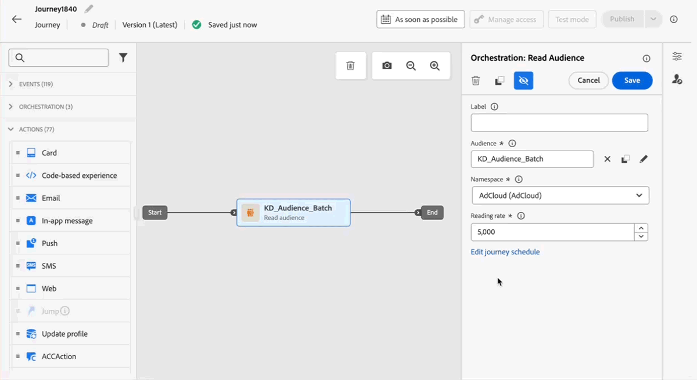
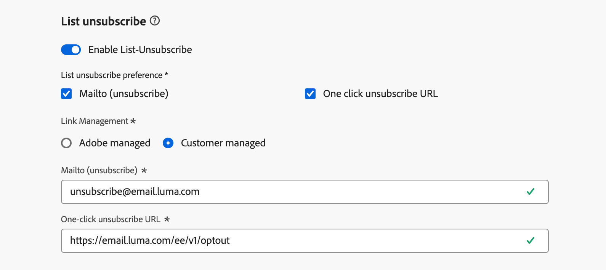

# Aanvullende informatie 2025 {#release-notes-2025}

Deze pagina bevat een overzicht van alle functies en verbeteringen die [!DNL Journey Optimizer] in 2025 heeft uitgebracht.

## Opmerkingen bij de release van september 1925 {#25-9-rn}

**de datum van de Versie**: 23-24 september, 2025

### Nieuwe functies {#sept-25-9-features}

<table>
<thead>
<tr>
<th><strong>Journey Optimizer Experimentation Accelerator</strong> </th>
</tr>
</thead>
<tbody>
<tr>
<td>

Journey Optimizer Experimentation Accelerator is een AI-eerste product dat ontworpen is om je experimenten naar een hoger niveau te tillen. Het is ontworpen voor Adobe Journey Optimizer- en Adobe Target-gebruikers en verenigt het beheer van experimenten, biedt inzicht en mogelijkheden op basis van AI en introduceert een nieuwe experimentator.

U kunt uitkijken naar:

<ul>
<li><strong> Verenigde Experimentele Inventaris:</strong> bekijk, filter, en beheer snel alle experimenten van Adobe Journey Optimizer en Adobe Target in één centrale werkruimte.</li>
<li><strong> AI de Experimentele Inzichten &amp; Kansen:</strong> ga voorbij statistische overzichten met GenAI-Gedreven inzichten en aanbevelingen. Elk experiment bevat nu actiemogelijkheden, compleet met ondersteuning voor rationale, zodat teams betrouwbaarder kunnen beslissen wat ze moeten testen.</li>
<li><strong> Multi-Armed Bandit (MAB) Steun in Journey Optimizer:</strong> maximaliseer effect terwijl het verminderen van verspild verkeer met multi-Armed experimenten van de Bandit. In plaats van het publiek gelijkmatig te verdelen, wijst MAB automatisch meer bezoekers toe aan de best-presterende variaties in echt - tijd zodat kunt u betere ervaringen aan meer klanten leveren terwijl nog het leren van wat werkt.</li></ul>

Voor meer informatie, verwijs naar de <a href="https://experienceleague.adobe.com/en/docs/experimentation-accelerator/using/overview"> gedetailleerde documentatie </a>

Beschikbaarheidsdatum: 3 oktober 2025

</td>
</tr>
</tbody>
</table>

<table>
<thead>
<tr>
<th><strong>Journey Agent is hier!</strong> </th>
</tr>
</thead>
<tbody>
<tr>
<td>

Aangedreven door <a href="https://experienceleague.adobe.com/nl/docs/experience-cloud-ai/experience-cloud-ai/agents/agent-orchestrator" target="_blank"> Adobe Experience Platform Agent Orchestrator </a>, is Journey Agent beschikbaar in Journey Optimizer. Het laat u toe om reizen door een natuurlijke taalinterface te analyseren. De agent zal publiek of programmaconflicten en profieldrop-offs in een reis ontdekken om u te helpen stappen nemen om hen op te lossen. Binnenkort kunt u reizen maken met ongeduldige ondersteuning.

Voor meer informatie, verwijs naar de <a href="https://experienceleague.adobe.com/en/docs/experience-cloud-ai/experience-cloud-ai/agents/ajo-agent-analyze" target="_blank"> gedetailleerde documentatie </a>

Beschikbaarheidsdatum: 24 september 2025

</td>
</tr>
</tbody>
</table>

<table>
<thead>
<tr>
<th><strong>Donkere modus in de Designer-e-mail</strong> </th>
</tr>
</thead>
<tbody>
<tr>
<td>

De Journey Optimizer Email Designer biedt nu de mogelijkheid om over te schakelen naar de weergave in de donkere modus, waar u bovendien specifieke aangepaste instellingen kunt definiëren die alleen worden weergegeven voor ontvangers die hun e-mails in de donkere modus lezen.

Let op het volgende:

<ul>
<li>De uiteindelijke rendering in de donkere modus kan variëren en is afhankelijk van de e-mailclient van de ontvanger.</li>
<li>Niet alle e-mailclients ondersteunen de aangepaste donkere modus. Bovendien passen sommige e-mailclients alleen hun eigen standaard donkere modus toe op alle ontvangen e-mails. In beide gevallen kunnen de aangepaste instellingen die u in de e-mailtoepassing hebt gedefinieerd, niet worden weergegeven.</li>
</ul>

Voor meer informatie, verwijs naar de <a href="../email/dark-mode.md"> gedetailleerde documentatie </a>

 
Beschikbaarheidsdatum: 16 september 2025

</td>
</tr>
</tbody>
</table>

<table>
<thead>
<tr>
<th><strong>Reispad optimaliseren</strong> </th>
</tr>
</thead>
<tbody>
<tr>
<td>

Gebruik de nieuwe Optimize knoop om specifieke doelgroepen te richten of A/B tests in werking te stellen om de beste weg te bepalen om aan uw zaken-centric KPIs te voldoen.

Dit hulpmiddel staat u toe om te testen en te variëren, en mededelingen, het rangschikken, en timing aan te passen om uw klanten het best te bereiken.

Deze mogelijkheid is beschikbaar in Beperkte Beschikbaarheid. Neem contact op met uw Adobe-vertegenwoordiger voor toegang.

Voor meer informatie, verwijs naar de <a href="../building-journeys/optimize.md"> gedetailleerde documentatie </a>

Beschikbaarheidsdatum: 4 september 2025

</td>
</tr>
</tbody>
</table>

<table>
<thead>
<tr>
<th><strong>Aangepaste delegatiemethode voor subdomeinen</strong> </th>
</tr>
</thead>
<tbody>
<tr>
<td>

Naast de volledige delegatie en de methode CNAME, is een nieuwe subdomain configuratiemethode nu beschikbaar: de de delegatiemethode van de Douane, die u toelaat om volledig het controleren en het handhaven van alle aspecten van DNS te bezitten die voor het leveren, het teruggeven en het volgen van berichten worden vereist.

Deze mogelijkheid is beschikbaar in Beperkte Beschikbaarheid. Neem contact op met uw Adobe-vertegenwoordiger voor toegang.

Voor meer informatie, verwijs naar de <a href="../configuration/delegate-custom-subdomain.md"> gedetailleerde documentatie </a>

Beschikbaarheidsdatum: 4 september 2025

</td>
</tr>
</tbody>
</table>

<table>
<thead>
<tr>
<th><strong>Adobe Experience Platform-gegevens gebruiken voor personalisatie en besluitvorming</strong> </th>
</tr>
</thead>
<tbody>
<tr>
<td>

Eerder in de openbare bètaversie is deze mogelijkheid nu beschikbaar voor alle omgevingen. Met deze release zijn de volgende verbeteringen aangebracht:

<ul><li>Steun voor datasetraadpleging personalisatie in binnenkomende kanalen.</li>
<li>De hulpfunctie "datasetLookup" kan nu worden gebruikt binnen expressiefragmenten. Momenteel is deze mogelijkheid beschikbaar voor een beperkt aantal klanten. Neem contact op met uw Adobe-vertegenwoordiger voor toegang.</li>
<li>Een optie in de interface van het gegevenssetbeheer staat u nu toe om op verslag-gebaseerde datasets voor raadplegingsverpersoonlijking toe te laten, zonder het moeten een API vraag uitvoeren.</li>
<li>Verbeterde controle om de status van de gegevensopname te volgen en te weten wanneer de datasets klaar voor raadpleging zijn.</li>
<li>Bijgewerkte gebruiksrichtlijnen en -instructies voor optimale prestaties en betrouwbaarheid.</li>
<li>Adobe Experience Platform-gegevenssets kunnen nu worden gebruikt in regels voor het maken van begrenzingen.</li></ul>

Voor meer informatie, verwijs naar de <a href="../data/lookup-aep-data.md"> gedetailleerde documentatie </a>

Beschikbaarheidsdatum: 1 september 2025

</td>
</tr>
</tbody>
</table>

### Verbeteringen {#sept-25-9-improvements}

* **steun Webhaak voor API teweeggebrachte campagnes**\
  API-campagnes ondersteunen nu webhaken. Configureer een URL van een webhaak om statusupdates in real time te ontvangen voor elk bericht, waardoor de zichtbaarheid wordt verbeterd en een naadloze bewaking en automatisering mogelijk wordt. [Meer informatie](../configuration/feedback-webhooks.md)

  Beschikbaarheidsdatum: 29 september 2025

* **mTLS Steun voor het Kanaal van SMS**
Wanneer u een aangepaste SMS-provider instelt, hebt u nu de mogelijkheid om wederzijdse TLS-verificatie (mTLS) in te schakelen. Hiervoor moeten zowel de client als de server elkaars identiteit bevestigen voordat een veilige verbinding tot stand wordt gebracht. [ las meer ](../sms/sms-configuration-custom.md) - de datum van de Beschikbaarheid: 23 september, 2025

* **Op model-gebaseerde Schema&#39;s**\
  Modelgebaseerde schema&#39;s kunnen nu worden gebruikt om uw relationele modelleringsbehoeften in geordende campagnes te ondersteunen. [ las meer ](../orchestrated/gs-schemas.md) - de datum van de Beschikbaarheid: Sept 23.2025

* **de opzoeksteun van de Dataset in reizen**\
  Een nieuwe activiteit in reizen, **de raadpleging van de Dataset**, staat u toe om gegevens van de het recorddatasets van Adobe Experience Platform dynamisch terug te winnen tijdens runtime. Door gebruik te maken van deze mogelijkheid hebt u toegang tot gegevens die mogelijk niet in het profiel of de lading van de gebeurtenis zijn opgeslagen, zodat uw klanteninteractie zowel relevant als tijdig is. [ las meer ](../building-journeys/dataset-lookup.md) - de datum van de Beschikbaarheid: Sept 23.2025

  Deze activiteit is slechts beschikbaar voor een reeks organisaties (Beperkte Beschikbaarheid). Neem contact op met uw Adobe-vertegenwoordiger voor toegang.

* **Redirect Steun in de Acties van de Douane van de Reis**\
  Omleidingen (302) worden nu ondersteund in Aangepaste handelingen voor reizen. - Beschikbaarheidsdatum: september 2025

* **de configuratiecontrolealarm van het Kanaal** - u kunt nu intekenen om systeemalarm, of door e-mail of in het het kennisgevingscentrum van Journey Optimizer te ontvangen, voor het geval dat een fout van de e-mailkanaalconfiguratie gebruikend het type van de douanesubdomeindelegatie gebeurt. [ las meer ](../reports/alerts.md#alert-channel-config-failure) - de datum van de Beschikbaarheid: 23 september, 2025

* **één-klik unsubscribe verzoeken** - wij hebben verbeteringen geïntroduceerd die de behandeling van one-click verder versterken unsubscribe verzoeken die onder Beheerde Adobe worden gevormd, die betrouwbare en verenigbare verwerking verzekeren. - Beschikbaarheidsdatum: september 2025

* **Geneste JSON lichaamsparams nu gesteund in douaneauthentificatie**\
  Wanneer u aangepaste verificatie voor een aangepaste handeling configureert, worden geneste JSON-objecten (bijvoorbeeld subobjecten binnen `bodyParams` ) nu ondersteund. [ las meer ](../datasource/external-data-sources.md#custom-authentication-mode) - de datum van de Beschikbaarheid: Sept 18, 2025

* **de frequentie van het terugstellen van de Uur het afschilderen** - u kunt het afschilderen op een uurbasis voor de reeksen van de kanaalregel nu toepassen. Voorheen beschikbaar in Beperkte Beschikbaarheid, is deze eigenschap nu beschikbaar aan alle milieu&#39;s en staat u toe om 1 uur (eerder 3 uren) te kiezen. [ las meer ](../conflict-prioritization/channel-capping.md) - de datum van de Beschikbaarheid: Sept 17.2025

* **Simulerend inhoudsvariaties voor alle binnenkomende kanalen**\
  Eerder alleen beschikbaar voor de communicatiekanalen E-mail, SMS en Push, geldt het simuleren van variaties in inhoud nu ook voor alle inkomende kanalen. [ las meer ](../test-approve/simulate-sample-input.md) - de datum van de Beschikbaarheid: Sept 17.2025

* **Uitdrukking voor Beslissende het begrenzen van regels** - u kunt uw eigen uitdrukkingen nu bouwen om de drempel van een afschilderingsregel voor een besluitvormingspunt te bepalen. [ las meer ](../experience-decisioning/items.md#capping) - de datum van de Beschikbaarheid: Sept 16, 2025

* **Dynamische domeinsteun** - Journey Optimizer steunt nu volledige/basisURL verpersoonlijking voor vooraf bepaalde die domeinen door Adobe worden goedgekeurd. [ las meer ](../personalization/personalization-build-expressions.md#where) - de datum van de Beschikbaarheid: Sept 12, 2025

  Deze mogelijkheid is beschikbaar in Beperkte Beschikbaarheid voor een reeks klanten.

* **Webhooks** - Deze versie introduceert de volgende verhogingen voor Webhooks wanneer het vormen van een leverancier van douaneSMS:

   * U kunt nu het doel van uw website definiëren, Inkomend of Feedback, afhankelijk van het type gegevens dat u wilt vastleggen. [ las meer ](../sms/sms-configuration-custom.md#webhook) - de datum van de Beschikbaarheid: 23 september, 2025

   * De interface voor het vormen van sleutelwoorden is verbeterd voor gemakkelijkere opstelling. [ las meer ](../sms/sms-configuration-custom.md#webhook) - de datum van de Beschikbaarheid: 23 september, 2025

* **SMS**

   * Wanneer vestiging een leverancier van douaneSMS, kunt u a **Standaard** gebruikt sleutelwoord nu bepalen wanneer een inkomend SMS een niet erkend sleutelwoord bevat. U kunt **sleutelwoorden van de Douane van 0} {voor specifieke acties ook tot stand brengen.** [ las meer ](../sms/sms-configuration-custom.md) - de datum van de Beschikbaarheid: 23 september, 2025

   * U kunt tot ongedefinieerde binnenkomende sleutelwoordenreacties nu toegang hebben die via een SMS-bericht worden verzonden, met inbegrip van typos, woorden of zinnen die niet expliciet in de configuratie zijn gedefinieerd. Zij worden opgeslagen in de **dataset van de Gebeurtenis van de Ervaring van 0} AJO E-mail Tracking, onder** InboundMessage **voor 13 maanden.** Alleen beschikbaar bij Sinch, Infobip en de aangepaste SMS-provider. - Beschikbaarheidsdatum: 23 september 2025

## Opmerkingen bij de release van augustus &#39;25 {#25-8-rn}

**de datum van de Versie**: 19 augustus, 2025

### Nieuwe functies {#Aug-25-8-features}

De nieuwe mogelijkheden die met deze release worden geleverd, worden hieronder beschreven.

<table>
<thead>
<tr>
<th><strong>Reizen onderbreken en hervatten</strong> </th>
</tr>
</thead>
<tbody>
<tr>
<td>

U kunt nu uw reizen pauzeren en hervatten. Deze mogelijkheid geeft reisartsen meer controle en flexibiliteit door het tijdelijk stilleggen van de actieve reizen toe te staan zonder de ervaring van de klant te verstoren. Wanneer gepauzeerd, worden geen mededelingen verzonden, en de profielen blijven in een geschorste staat tot de reis wordt hervat.

U kunt slechts één reis pauzeren en hervatten, of bulkpauze uitvoeren en verrichtingen aan een groep reizen hervatten.

Bovendien kunt u algemene filters toepassen op gepauzeerde reizen om profielen uit te sluiten op basis van hun kenmerken.

Eerder vrijgegeven in Beperkte Beschikbaarheid, is deze capaciteit nu beschikbaar aan alle milieu's (Algemene Beschikbaarheid).

Voor meer informatie, verwijs naar de <a href="../building-journeys/journey-pause.md"> gedetailleerde documentatie </a>

</td>
</tr>
</tbody>
</table>

<table>
<thead>
<tr>
<th><strong>Kalenderweergave</strong> </th>
</tr>
</thead>
<tbody>
<tr>
<td>

In de lijsten met reizen en campagnes is nu een kalenderweergave beschikbaar. Hiermee kunt u alle reizen en campagnes in de respectieve lijsten visualiseren.

Eerder beschikbaar in Beperkte Beschikbaarheid, is deze eigenschap nu beschikbaar aan alle milieu's. Met deze algemene beschikbaarheidsrelease omvat deze functie:

<ul>
<li>Ontwerpverbeteringen voor de navigatie in datums</li>
<li>de mogelijkheid om ontwerpcampagnes te bekijken als u een begin- en einddatum hebt ingesteld,</li>
<li>Een nieuwe instelling voor het verbergen en weergeven van kalenderitems die lange tijd worden uitgevoerd.</li>
</ul>

Voor meer informatie, verwijs naar de <a href="../building-journeys/journey-ui.md#calendar"> gedetailleerde documentatie </a>

</td>
</tr>
</tbody>
</table>

<!--table>
<thead>
<tr>
<th><strong>Use Adobe Experience Platform data for personalization</strong> </th>
</tr>
</thead>
<tbody>
<tr>
<td>

Leverage data from [!DNL Adobe Experience Platform] in the personalization editor to personalize your content and decision attributes. In particular, this allows you to extend the definition of your attributes to additional data in datasets for bulk updates that change periodically without having to manually update the attributes one at a time.

With this release, the following enhancements have been introduced:

<ul>
<li>Support of inbound channels,</li>
<li>The "datasetLookup" helper function can now be used within expression and visual fragments to personalize content using data from Adobe Experience Platform datasets,</li>
<li>An option in the dataset now allows you to enable datasets for lookup personalization, without having to perform an API call.</li>
</ul>

This capability is available in Limited Availability. Contact your Adobe representative to gain access.

For more information, refer to the <a href="../personalization/aep-data-perso.md">detailed documentation</a>

</td>
</tr>
</tbody>
</table-->

<!--table>
<thead>
<tr>
<th><strong>Use Decisioning in email channel</strong> </th>
</tr>
</thead>
<tbody>
<tr>
<td>

You can now add Decision policies into email journeys and campaigns. Decision policies are containers for your offers that leverage the Decisioning engine to dynamically return the best content to deliver for each audience member.

Previously released in Limited Availability, this capability is now available to all environments (General Availability).

<For more information, refer to the <a href="../FILE.md">detailed documentation</a>

</td>
</tr>
</tbody>
</table-->

<table>
<thead>
<tr>
<th><strong>Actie tijdens reizen</strong> </th>
</tr>
</thead>
<tbody>
<tr>
<td>

Journey Optimizer steunt een nieuwe generische activiteit van de Actie die u toelaat om zowel enige acties als multi-actie binnenkomende actiegroepen te vormen, die voor gestroomlijnde actieconfiguratie binnen het reiscanvas toestaan. Met deze nieuwe functie kunt u met name:

<ul>
<li>Een vereenvoudigde native actieconfiguratie binnen het reiscanvas.</li>
<li>De capaciteit om multi-actie binnenkomende actiegroepen te creëren.</li>
<li>De mogelijkheid om optimalisatie toe te voegen aan ingebouwde kanaalacties.</li>
<li>De mogelijkheid om experimenten en meertalige opties toe te voegen aan elke actie.</li>
</ul>

Deze mogelijkheid is beschikbaar in Beperkte Beschikbaarheid. Neem contact op met uw Adobe-vertegenwoordiger voor toegang.

Voor meer informatie, verwijs naar de <a href="../building-journeys/journey-action.md"> gedetailleerde documentatie </a>

</td>
</tr>
</tbody>
</table>

<table>
<thead>
<tr>
<th><strong>PDF-bijlagen bij e-mailberichten</strong> </th>
</tr>
</thead>
<tbody>
<tr>
<td>

U kunt nu een statisch PDF-bestand toevoegen aan een e-mailbericht dat met Journey Optimizer is verzonden.

<ul>
<li>U kunt maximaal zes berichten verzenden met een PDF-bijlage per profiel per jaar.</li>
<li>De maximaal toegestane bestandsgrootte voor elke bijlage is 5 MB.</li>
<li>Voor elke extra grootte of elk extra volume kunt u een invoegtoepassing voor een bijlagepakket aanschaffen. Neem voor meer informatie contact op met uw Adobe-vertegenwoordiger.</li>
</ul>

Deze mogelijkheid is beschikbaar in Beperkte Beschikbaarheid. Neem contact op met uw Adobe-vertegenwoordiger voor toegang.

Voor meer informatie, verwijs naar de <a href="../email/pdf-attachments.md"> gedetailleerde documentatie </a>

</td>
</tr>
</tbody>
</table>

<!--
<table>
<thead>
<tr>
<th><strong>Landing page custom forms</strong> </th>
</tr>
</thead>
<tbody>
<tr>
<td>

With [!DNL Journey Optimizer], you can now capture profile attributes though your landing pages.

Create, design and manage custom forms tailored to your needs based on a specific dataset. You can then leverage these forms in landing pages to add the profile attributes of your choice into the dataset defined for each form.

This capability is currently in beta version and only available to beta customers. To join the beta program, contact your Adobe representative.

For more information, refer to the <a href="../FILE.md">detailed documentation</a>

</td>
</tr>
</tbody>
</table>
-->

<table>
<thead>
<tr>
<th><strong>Optimalisatie in campagnes</strong> </th>
</tr>
</thead>
<tbody>
<tr>
<td>

Journey Optimizer stelt u nu in staat met de gereedschappen gepersonaliseerde en geoptimaliseerde inhoud aan uw publiek te leveren, zodat u contentexperimenten kunt uitvoeren, doelgerichte regelgeving kunt maken en geavanceerde combinaties van beide kunt gebruiken om de doeltreffendheid van uw campagnes en reizen te maximaliseren.

Met Optimalisatie kunt u:

<ul>
<li>Test veelvoudige inhoudsvariaties om het meest efficiënte overseinen te identificeren.</li>
<li>Aangepaste inhoud leveren op basis van gebruikerskenmerken en contextuele gegevens.</li>
<li>Combineer gerichte toepassingen en experimenten voor geavanceerde strategieën.</li>
<li>Filter gebruikers uit die niet voldoen aan variantcriteria.</li>
<li>Zorg voor terugvalmechanismen om de betrokkenheid van de gebruiker te behouden.</li>
</ul>

Zodra de reis of de campagne live is, worden profielen beoordeeld aan de hand van de vastgestelde criteria en op basis van passende criteria, worden zij geleverd met de juiste ervaring of inhoud.

Alleen al op 8 augustus is deze capaciteit tijdens campagnes beschikbaar op reizen die beginnen op 22 augustus.

Voor meer informatie, verwijs naar de <a href="../campaigns/campaigns-message-optimization.md"> gedetailleerde documentatie </a>

</td>
</tr>
</tbody>
</table>

### Verbeteringen {#Aug-25-8-improv}

De verbeteringen die bij deze release worden geleverd, worden hieronder weergegeven.

* **Beheer**

   * **de configuratiecontrole van het Kanaal alarm** - u kunt nu intekenen om systeemalarm, of door e-mail of in het het kennisgevingscentrum van Journey Optimizer te ontvangen, voor het geval <!--a channel configuration failure happens or if --> een DNS verslag mist. [Meer informatie](../reports/alerts.md#alert-dns-record-missing)

* **AI Medewerker**

   * **Inhoudsgeneratie in veelvoudige talen** - de Inhoud kan nu in Frans, Spaans, Duits, Italiaans, Japans, Zweeds, Nederlands, en Noors worden geproduceerd. [Meer informatie](../content-management/generative-uc.md#languages)

     Beschikbaarheidsdatum: 25 augustus

* **Campagnes**

   * **controle van het Tarief in uitgaande campagnes** - u kunt tariefcontrole voor uitgaande campagnes (E-mail, SMS, Push berichten) nu toelaten, toestaand u om overbelasting op stroomafwaartse systemen, zoals het landen van pagina&#39;s of de platforms van de klantenzorg te verhinderen. [Meer informatie](../campaigns/campaign-schedule.md#rate-control)

   * **campagne die van de Actie** plant - de campagne dagelijks, wekelijkse, en maandelijkse planners zijn bijgewerkt om meer gedetailleerde controle over terugkomende programma&#39;s te verstrekken:

      * **Wekelijkse herhaling**: U kunt nu verkiezen om de campagne elke week of elke twee weken te herhalen, en de dag(en) van de week te selecteren waarop het zou moeten lopen.

      * **Maandelijkse herhaling**: U kunt nu verkiezen om de campagne elke maand of om de andere maand te herhalen, en de dag van de maand te selecteren waarop het zou moeten lopen.

      * **Dagelijkse, wekelijkse, of maandelijkse programma&#39;s**: U kunt specificeren als het terugkomende programma op een specifieke datum of na een bepaald aantal voorkomen zou moeten ophouden.

   * **Geplande transactionele actiecampagnes** - Geplande transactionele actiecampagnes zijn nu beschikbaar voor het verzenden van partij, op publiek-gebaseerde transactionele mededelingen via E-mail, SMS, en de kanalen van de Duw.

* **Kanaal - de kaarten van de Inhoud**

   * **de lay-outmalplaatjes van de kaart van de Inhoud** - Het kanaal van de kaart van de Inhoud verstrekt nu OTB berichtlay-outs die uw auteurservaring zullen stroomlijnen. Deze release bevat sjablonen voor de lay-out Kleine afbeelding, Grote afbeelding en Alleen afbeelding. [Meer informatie](../content-card/design-content-card.md)

* **Kanaal - duw**

   * **de vervaldatum van het pushbericht** - u kunt nu een vervaldatum voor elk Push- bericht specificeren, dat tijd-gevoelige berichten (zoals de Zwarte Verkoop van Vrijdag) verhindert na een bepaalde datum worden verzonden, zo vermijdt leverend slechte ervaring aan uw klanten.

* **Kanaal - SMS**

   * **Fuzzy Opt-out** - wanneer toegelaten, ontdekt de **Fuzzy Opt-out** optie binnenkomende berichten die dicht op bepaalde opt-out sleutelwoorden (b.v., &quot;CANCIL&quot;) lijken en verzendt automatisch een bevestigingsantwoord om de unsubscribe intent van de gebruiker te verifiëren. Als de gebruiker via de gedefinieerde prompt bevestigt, wordt het abonnement opgezegd. [Meer informatie](../sms/sms-configuration-sinch.md)

     >[!NOTE]
     >
     >**Fuzzy Opt-out** is slechts beschikbaar met Sinch en Infobip.

   * **verifieer de Verbinding van SMS** - U kunt uw geloofsbrieven van SMS API binnen Adobe Journey Optimizer nu gemakkelijk testen en verifiëren door een steekproefbericht naar een aangewezen apparaat te verzenden. [Meer informatie](../sms/sms-configuration-sinch.md)

* **Configuratie**

   * **de kenmerkensteun van de Douane met één-Klik unsubscribe URL** - met Journey Optimizer, als u toestemming buiten Adobe beheert, kunt u een extern douaneeindpunt plaatsen door uw eigen te bepalen unsubscribe verbinding in de e-mailconfiguratie. Wanneer uw ontvangers op de koppeling voor afmelden klikken, voegt Journey Optimizer enkele standaardprofielspecifieke parameters toe aan de gebeurtenis voor het bijwerken van de toestemming.

     Als u uw koppeling voor het opzeggen van uw abonnement met één klik verder wilt aanpassen, kunt u nu aangepaste kenmerken definiëren die ook aan de gebeurtenis voor toestemming worden toegevoegd. [Meer informatie](../email/list-unsubscribe.md#custom-attributes)

* **Datasets**

   * **Ervaring die Bewaarplaats van Objecten bepaalt - de Gepersonaliseerde Punten van de Aanbieding** - de ingebouwde de uitvoerdataset vangt nu alle aanbiedingsattributen en levenscyclusstatus, toelatend volledige verpersoonlijking en rapportering. [Meer informatie](../data/export-datasets.md)

   * Introduceerde versiecontrole via het veld `etag` om de consistentie te verbeteren en wijzigingen bij te houden om items betrouwbaarder aan te bieden.

* **Beslissing**

   * **de fragmenten van de Band aan besluitvormingspunten** - Journey Optimizer verstrekt nu de capaciteit om fragmenten aan besluitvormingspunten vast te maken die in code-gebaseerde ervaringscampagnes door besluitvormingsbeleid kunnen worden leveraged. Deze mogelijkheid is beschikbaar in Beperkte Beschikbaarheid voor een reeks klanten. [Meer informatie](../experience-decisioning/create-decision.md#fragments)

* **Reizen**

   * **de bulkverrichtingen van de Reis** - van de lijst van uw reizen, kunt u veelvoudige punten nu selecteren. Als deze optie is geselecteerd, kunt u maximaal tien reizen per keer pauzeren of hervatten.

   * **Redirect (302) Steun in de Acties van de Douane** - de acties van de Douane kunnen HTTP 302 nu behandelen herleidt op een per-verzoekbasis. Hierdoor kunnen reizen worden geïntegreerd met API&#39;s die aanvragen doorsturen naar gelokaliseerde of regiospecifieke URL&#39;s. Omleidingen worden automatisch gevolgd, zodat de juiste inhoud zonder extra configuratie wordt geleverd.

   * **Veelvoudige binnenkomende acties in reizen** - om uw reisorchestratie te vereenvoudigen, kunt u verscheidene binnenkomende acties in één enkele reis nu bepalen. Deze functie was eerder beschikbaar in campagnes en stelt u in staat om meerdere op code gebaseerde ervaringen, In-app-berichten, Content Cards of webhandelingen tegelijk naar verschillende locaties te verzenden, waarbij elke actie een specifieke inhoud bevat. [Meer informatie](../building-journeys/journey-action.md#multi-action)

## Campagneorganisatie

**de datum van de Beschikbaarheid**: 4 augustus, 2025

Journey Optimizer omvat nu **Organiseren van de Campagne**, een nieuw vermogen doelgericht-gebouwd voor merk-in werking gestelde, partijcampagnes. Deze release introduceert een campagneorchestration canvas en verbeterde gegevensmodellering, die samenwerken om marketers gepersonaliseerde cross-channel campagnes te laten plannen, richten en leveren.

>[!IMPORTANT]
>
>Om tot Campagneorganisatie toegang te hebben, moet uw vergunning of de **Journey Optimizer - Campagnes &amp; Reizen** of **Journey Optimizer - het pakket van Campagnes** omvatten. Neem contact op met uw Adobe-vertegenwoordiger om uw licentie te bevestigen en indien nodig bij te werken.

Het omvat [ Relationele Schema&#39;s &amp; Datasets ](#oc-relational) en [ het Canvas van de Campagne ](#oc-canvas). Samen ontsluiten deze twee innovaties een nieuwe norm voor het organiseren van batchcampagnes in Journey Optimizer. De belangrijkste mogelijkheden worden hieronder vermeld.

### Belangrijkste mogelijkheden {#oc-capabilities}

* **multi-step werkschema&#39;s**

  Maak geavanceerde multi-kanaals batchcampagnes met de nieuwe, speciaal gebouwde campagnecorchestratiekanvas.

* **Op bestelling publiek**

  Segmentpubliek op aanvraag voor onmiddellijke activering.

* **Meerentiteitssegmentatie**

  Bouw publiek gebruikend bedrijfscontext (niet-personendimensies) zoals product, opslag, vernieuwingen, reserveringen, en meer.

* **pre-send zicht**

  Het publiek en de campagnes vóór het starten en tijdens het uitvoeren van campagnes evalueren, verfijnen en optimaliseren

### Campagnecanvas {#oc-canvas}

Een gloednieuwe visuele orchestration interface speciaal gebouwd voor batchcampagnes. Met dit canvas kunt u:

* Visuele planning van multi-step, multi-channel campagnestromen

* Ondersteuning voor publiek op aanvraag die is opgebouwd op basis van relationele query&#39;s

* Geavanceerde publiekssplitsing, wachttijden en voorwaardelijke logica

* Nauwkeurige pre-send tellingen na het toepassen van bedrijfsregels en filters

### Relationele schema&#39;s en gegevenssets {#oc-relational}

Adobe Journey Optimizer ondersteunt nu relationele entiteiten (bijvoorbeeld producten, winkels, boekingen, contracten) die zijn gekoppeld aan profielen van personen. Dit maakt segmentatie en personalisatie over multidimensionale gegevensstructuren mogelijk, waardoor gebruiksgevallen zoals:

* Eén bericht per boeking, abonnement of contract

* Segmentatie op basis van gerelateerde entiteitskenmerken (bijvoorbeeld productcategorie of locatie van winkel)

* Verbeterde adresseerbaarheid (verzend bijvoorbeeld alle bekende contacten die verbonden zijn met een entiteit)

### Waarom het belangrijk is

Deze release geeft marketeers volledige controle over merkgebaseerde batchmarketing op basis van het publiek, waarbij flexibele gegevensmodellering wordt gecombineerd met een doelgerichte orkest-ervaring. Het is speciaal ontworpen voor batchcampagneorchestratie vanuit realtime reizen en biedt geavanceerde personalisatie en schaalbaarheid.

### Meer informatie

Leer meer in de [ documentatie van het Organiseren van de Campagne ](../orchestrated/gs-orchestrated-campaigns.md).

## Opmerkingen bij de release van juli 1925 {#25-7-rn}

**de datum van de Versie**: 29 juli, 2025

### Nieuwe functies {#features-25-7}

De nieuwe mogelijkheden die met deze release worden geleverd, worden hieronder beschreven.

#### Functies

<table>
<thead>
<tr>
<th><strong>Merken</strong> </th>
</tr>
</thead>
<tbody>
<tr>
<td>

U kunt nu uw eigen merken maken en aanpassen om uw visuele en verbale identiteit in verschillende communicatie duidelijk te definiëren. Met de merkuitlijningsscore kunt u in real-time feedback ontvangen over hoe goed uw inhoud de toon, stijl en richtlijnen van uw merk weerspiegelt, zodat u bij elke boodschap die u verzendt, consistent onder het merk kunt blijven.

Eerder in Beta is deze mogelijkheid nu beschikbaar voor alle omgevingen (algemene beschikbaarheid).

Raadpleeg de <a href="../content-management/brands.md">gedetailleerde documentatie</a> voor meer informatie.

</td>
</tr>
</tbody>
</table>

<table>
<thead>
<tr>
<th><strong>Beslissing in e-mailkanaal gebruiken</strong> </th>
</tr>
</thead>
<tbody>
<tr>
<td>

U kunt nu beleidsregels voor beslissingen toevoegen aan e-mailreizen en -campagnes. Beslissingsbeleid is containers voor uw aanbiedingen die de beslissingsengine gebruiken om dynamisch de beste inhoud te retourneren die voor elk publiekslid kan worden geleverd.

Deze mogelijkheid is beschikbaar in Beperkte Beschikbaarheid. Neem contact op met uw Adobe-vertegenwoordiger voor toegang.

Voor meer informatie, verwijs naar de <a href="../experience-decisioning/create-decision.md"> gedetailleerde documentatie </a>

</td>
</tr>
</tbody>
</table>

<table>
<thead>
<tr>
<th><strong>LINE-kanaal</strong> </th>
</tr>
</thead>
<tbody>
<tr>
<td>

Adobe Journey Optimizer heeft zijn kanaalmogelijkheden uitgebreid om steun voor het kanaal van de LIJN te omvatten. Dankzij deze verbetering kunt u LINE-ervaringen maken, bewerken en voorvertonen, zodat u meer persoonlijke en boeiende interacties kunt maken. Met LINE, kunt u met meer klanten verbinden, relevante inhoud verzenden, en uw overeenkomst verbeteren.

Eerder beschikbaar slechts verzoek, is het kanaal van de LIJN nu beschikbaar aan alle gebruikers (Algemene Beschikbaarheid).

Raadpleeg de <a href="../../rp_landing_pages/line-landing-page.md">gedetailleerde documentatie</a> voor meer informatie.
</td>
</tr>
</tbody>
</table>

<table>
<thead>
<tr>
<th><strong>Reizen op reis</strong> </th>
</tr>
</thead>
<tbody>
<tr>
<td>

Reis Dry run is een speciale publicatiemodus in Adobe Journey Optimizer die reisartsen in staat stelt een reis te testen met behulp van echte productiegegevens zonder contact op te nemen met echte klanten of profielinformatie bij te werken. Deze functie helpt reisartsen vertrouwen te winnen in hun reisontwerp en doelgroep voordat ze het live publiceren.

Eerder vrijgegeven in Beperkte Beschikbaarheid, is deze capaciteit nu beschikbaar aan alle milieu's (Algemene Beschikbaarheid).

Voor meer informatie, verwijs naar de <a href="../building-journeys/journey-dry-run.md"> gedetailleerde documentatie </a>

</td>
</tr>
</tbody>
</table>

<table>
<thead>
<tr>
<th><strong>Aanvullende ID voor reizen</strong> </th>
</tr>
</thead>
<tbody>
<tr>
<td>

U kunt nu ritten activeren met een profiel-id en een andere id, zoals een bestellings-id, een abonnement-id of een recept-id, zodat hetzelfde profiel zich meerdere keren tegelijk in dezelfde reis kan bevinden. Dit laat scenario's zoals het beheren van veelvoudige orden of abonnementen parallel toe, met elke instantie die zijn eigen weg door de reis volgt.

Eerder vrijgegeven in Beperkte Beschikbaarheid, is het gebruik van extra IDs in reizen nu beschikbaar aan alle milieu's. Met deze algemene beschikbaarheidsrelease bevat deze functie nu ondersteuning voor reizen van lezers.

Voor meer informatie, verwijs naar de <a href="../building-journeys/supplemental-identifier.md"> gedetailleerde documentatie </a>

</td>
</tr>
</tbody>
</table>

### Waarschuwingen in producten

U kunt nu aan **e-mail en in-product alarm** voor de productreleases van Journey Optimizer intekenen.

Abonneren:

* Navigeer aan **Voorkeur van Adobe Experience Cloud**
* Onder **Meldingen**, vind **Nieuwe versies van Journey Optimizer**
* In-app- en e-mailmeldingen inschakelen

{width="70%" align="left"}

### Verandering van de reisomstandigheden {#ee-change@}

Vanaf 8 juli wordt in nieuwe klantenorganisaties het maken van expressies met behulp van ervaringsgebeurtenissen niet langer ondersteund in de expressie-editor die wordt gebruikt in reisomstandigheden. Dientengevolge, kan de ervaringsgebeurtenissen in de [ gegevensbron van Experience Platform ](../datasource/adobe-experience-platform-data-source.md) niet voor het creëren van uitdrukkingen worden gebruikt. De alternatieve benaderingen en beste praktijken voor het creëren van uitdrukkingen/logica met ervaringsgebeurtenissen worden van verwijzingen voorzien [ hier ](../building-journeys/exp-event-lookup.md).

Er is geen wijziging in de manier waarop gegevens over de reiscontext worden benaderd tijdens eenheidstreizen. In de redacteurs van de uitdrukking en van de verpersoonlijking, kunnen de gebruikers tot gegevens blijven toegang hebben die met de aanvankelijke reisgebeurtenis worden overgegaan.

Leer meer [ in dit FAQ ](../building-journeys/exp-event-lookup.md#faq-ee).

### Verbeteringen {#25-7-improv}

De verbeteringen die bij deze release worden geleverd, worden hieronder weergegeven.

* **Campagnes**

   * **Veelvoudige binnenkomende acties in campagnes** - om uw campagneorchestratie te vereenvoudigen, kunt u verscheidene binnenkomende acties in één enkele campagne nu bepalen. Met deze functie kunt u meerdere op code gebaseerde ervaringen, In-app-berichten, Content Cards of webhandelingen tegelijk op verschillende locaties aanbieden, waarbij elke actie een specifieke inhoud bevat.
     [Meer informatie](../campaigns/campaign-action.md#multi-action)

   * **de inventarisreorganisatie van de Campagne** - Gepland en API-teweeggebrachte campagnes zijn nu verdeeld in afzonderlijke lusjes in de campagneinventaris voor gemakkelijkere navigatie en beheer.

[Meer informatie](../campaigns/manage-campaigns.md)

* **het Beheer van Gegevens**
   * **de update van de systeemdatasets van het Beheer van het Besluit** - de geschrapte Gepersonaliseerde en aanbiedingen van de Fallback worden nu duidelijk zoals gearchiveerd in de &quot;beslissing_object_repository_personalized_aanbiedingen&quot;en &quot;Decision_object_repository_fallback_aanbiedingen&quot;datasets. De bestaande records in de dataset worden niet gewijzigd.

[Meer informatie](../offers/export-catalog/access-dataset.md)

* **Reizen**
   * **de Tooling van Sandbox van de Reis Verbeteringen** - wanneer het kopiëren van reizen over veelvoudige zandbakken gebruikend de pakketuitvoer en de invoermogelijkheden, zijn de volgende mogelijkheden nu ook beschikbaar:
      * Een bestaande gebeurtenis op het doel selecteren
      * Het kopiëren over een evenement onafhankelijk van een reis
      * Het ontdekken van gebiedsgroep/gegevensbronverhoudingen, die met hen verbinden bij de bestemming als zij bestaan, creërend hen als zij niet.

[Meer informatie](../configuration/copy-objects-to-sandbox.md)

* **Kanaal - in-app**
   * **In-app Zeer belangrijke/paren van de Waarde** - met In-app berichten, kunt u Sleutel en paren van de Waarde bepalen om douanevariabelen in de berichtlading te omvatten. Deze zeer belangrijk-waardeparen laten u toe om extra gegevens over te gaan die op uw specifieke configuratie en gebruiksgeval worden gebaseerd. [Meer informatie](../in-app/design-in-app.md)

* **Kanaal - de Kaart van de Inhoud**

   * **regel-Gebaseerde Verdiskwalificatie van de Campagne** - toen het uitgeven van extra leveringsregels, is de vorige optie van de Regels van de Levering vervangen met drie verschillende regeltypes aan betere controle berichttiming en zicht:
      * Bericht weergeven als: voorwaarden die bepalen wanneer de inhoudskaart wordt weergegeven.
      * Bericht sluiten als: Voorwaarden die de inhoudskaart tijdelijk verbergen. De weergave kan worden hersteld als opnieuw aan de voorwaarden voor de show wordt voldaan.
      * Schakel het bericht uit als: Voorwaarden die voorkomen dat de inhoudskaart opnieuw wordt weergegeven.

[Meer informatie](../content-card/design-content-card.md)

* **Beslissing**
   * **het tooling APIs van de Migratie** - het team van Journey Optimizer werkt momenteel aan migratie tooling APIs om besluitvormingsbeheersentiteiten aan Beslissing te migreren. Met deze gereedschappen kunt u naadloze migratie mogelijk maken tussen sandboxen met de mogelijkheden voor afhankelijkheidsresolutie en terugdraaien. Neem indien nodig contact op met uw Adobe-vertegenwoordiger.

* **Personalization**
   * Er is een nieuwe hulpfunctie, SHA256, toegevoegd aan de personalisatie-editor. Deze functie wordt gebruikt om de sha256 hash van een tekenreeks te berekenen en te retourneren.

[Meer informatie](../personalization/functions/string.md#sha256)

## Opmerkingen bij de release van juni &#39;25 {#25-6-rn}

**de datum van de Versie**: 18 Juni, 2025

### Nieuwe functies {#25-06-features}

De nieuwe mogelijkheden die met deze release worden geleverd, worden hieronder beschreven.

<table>
<thead>
<tr>
<th><strong>Adobe Experience Platform datasets in decisions (bèta)</strong> </th>
</tr>
</thead>
<tbody>
<tr>
<td>

Adobe Experience Platform-gegevenssets die voorheen beschikbaar waren voor personalisatie, kunnen nu worden gebruikt voor beslissingen. Dit staat u toe om de definitie van uw beslissingsattributen tot extra gegevens in datasets voor bulkupdates uit te breiden die periodiek veranderen zonder het moeten manueel de attributen één voor één bijwerken. Bijvoorbeeld beschikbaarheid, wachttijden, enz.

Deze mogelijkheid is momenteel beschikbaar voor alle klanten als een openbare bètaversie. Neem contact op met uw accountvertegenwoordiger als u toegang wilt.

Raadpleeg de <a href="../experience-decisioning/aep-data-exd.md">gedetailleerde documentatie</a> voor meer informatie.

Beschikbaarheidsdatum: 20 juni 2025

</td>
</tr>
</tbody>
</table>

<table>
<thead>
<tr>
<th><strong>RCS-berichten</strong> </th>
</tr>
</thead>
<tbody>
<tr>
<td>

U kunt, Rich Communication Services (RCS) berichten nu vormen aanpassen en leveren door een externe provider te integreren met de oplossing van de aangepaste SMS-provider.

Raadpleeg de <a href="../sms/sms-configuration-custom.md">gedetailleerde documentatie</a> voor meer informatie.

</td>
</tr>
</tbody>
</table>

<table>
<thead>
<tr>
<th><strong>Formuliervelden in ervaringsinhoud op basis van code</strong> </th>
</tr>
</thead>
<tbody>
<tr>
<td>

U kunt nu specifieke bewerkbare velden definiëren in JSON- of HTML-inhoudssjablonen, waarmee niet-technische gebruikers inhoud eenvoudig kunnen bewerken in een formulierweergave in de op code gebaseerde ervaring in het maken van kanalen zonder dat ze code hoeven te bewerken.  meer dan dat, wanneer het bepalen van de code-gebaseerde malplaatjes van de ervaringsinhoud kunt u besluitvormingsbeleid in het malplaatje nu opnemen, die herbruikbaarheid en gebruiksgemak verhogen.

Raadpleeg de <a href="../code-based/code-based-form-fields.md">gedetailleerde documentatie</a> voor meer informatie.

</td>
</tr>
</tbody>
</table>

<!--
<table>
<thead>
<tr>
<th><strong>Custom delegation method for subdomains</strong> </th>
</tr>
</thead>
<tbody>
<tr>
<td>

In addition to the full delegation and the CNAME method, a new subdomain configuration method is now available: the Custom delegation method, which enables you to fully own controlling and maintaining all aspects of DNS that are required for delivering, rendering and tracking messages.

</td>
</tr>
</tbody>
</table>
-->

<table>
<thead>
<tr>
<th><strong>Activiteiten in verband met inhoudsbeslissingen tijdens reizen</strong> </th>
</tr>
</thead>
<tbody>
<tr>
<td>

U kunt nu persoonlijke aanbiedingen opnemen in uw reizen door middel van een speciale actie voor het nemen van beslissingen over inhoud in het reiscanvas en deze gebruiken in reisactiviteiten, waaronder voorwaarden en aangepaste acties.

Deze mogelijkheid is alleen beschikbaar voor een aantal organisaties (Beperkte beschikbaarheid) en wordt globaal geïmplementeerd in een toekomstige release.

Raadpleeg de <a href="../building-journeys/content-decision.md">gedetailleerde documentatie</a> voor meer informatie.

</td>
</tr>
</tbody>
</table>

<table>
<thead>
<tr>
<th><strong>Reizen op reis</strong> </th>
</tr>
</thead>
<tbody>
<tr>
<td>

Reis Dry run is een speciale publicatiemodus in Adobe Journey Optimizer die reisartsen in staat stelt een reis te testen met behulp van echte productiegegevens zonder contact op te nemen met echte klanten of profielinformatie bij te werken. Deze functie helpt reisartsen vertrouwen te winnen in hun reisontwerp en doelgroep voordat ze het live publiceren.

Deze mogelijkheid is alleen beschikbaar voor een aantal organisaties (Beperkte beschikbaarheid) en wordt globaal geïmplementeerd in een toekomstige release.

Raadpleeg de <a href="../building-journeys/journey-dry-run.md">gedetailleerde documentatie</a> voor meer informatie.

</td>
</tr>
</tbody>
</table>

<table>
<thead>
<tr>
<th><strong>Reizen onderbreken en hervatten</strong> </th>
</tr>
</thead>
<tbody>
<tr>
<td>

U kunt nu uw reizen pauzeren en hervatten. Deze mogelijkheid geeft reisartsen meer controle en flexibiliteit door het tijdelijk stilleggen van de actieve reizen toe te staan zonder de ervaring van de klant te verstoren. Wanneer gepauzeerd, worden geen mededelingen verzonden, en de profielen blijven in een geschorste staat tot de reis wordt hervat.

U kunt slechts één reis pauzeren en hervatten, of bulkpauze uitvoeren en verrichtingen aan een groep reizen hervatten.

Bovendien kunt u algemene filters toepassen op gepauzeerde reizen om profielen uit te sluiten op basis van hun kenmerken.

Deze mogelijkheid is alleen beschikbaar voor een aantal organisaties (Beperkte beschikbaarheid) en wordt globaal geïmplementeerd in een toekomstige release.

Raadpleeg de <a href="../building-journeys/journey-pause.md">gedetailleerde documentatie</a> voor meer informatie.

</td>
</tr>
</tbody>
</table>

<table>
<thead>
<tr>
<th><strong>Schaal de winnaar van uw proefversie</strong> </th>
</tr>
</thead>
<tbody>
<tr>
<td>

Met Schaal de winnaar van de proefversie kunt u de winnende variatie van een experiment automatisch of handmatig voor alle gebruikers uitrollen. Deze functie zorgt ervoor dat u, zodra een topuitvoerder is geïdentificeerd, het bereik en de effectiviteit ervan kunt maximaliseren zonder voortdurend handmatig toezicht.

Raadpleeg de <a href="../content-management/content-experiment.md">gedetailleerde documentatie</a> voor meer informatie.

Beschikbaarheidsdatum: 2 juni 2025
</td>
</tr>
</tbody>
</table>

<table>
<thead>
<tr>
<th><strong>Conflict en prioriteit</strong> </th>
</tr>
</thead>
<tbody>
<tr>
<td>

In Journey Optimizer is het beheren van het volume en de timing van campagnes en reizen van essentieel belang om te voorkomen dat klanten met te veel interacties worden overspoeld. Journey Optimizer biedt nu diverse hulpmiddelen voor conflictbeheer en prioritering - voorheen alleen beschikbaar voor organisaties met beperkte toegang (LA) - die nu algemeen beschikbaar zijn (GA).

Eerder uitgebracht in Beperkte Beschikbaarheid, is deze capaciteit nu beschikbaar aan alle milieu's. Met deze algemene release zijn de volgende verbeteringen aangebracht:

<ul>
<li>Uitgebreide ondersteuning: de tools voor conflictbeheer ondersteunen nu niet alleen publiekstrajecten, maar ook eenheidsreizen en kwalificatiereizen voor het publiek.</li>
<li>Verbeterd het Oplossen van problemen: Twee nieuwe gebieden van de stapgebeurtenis zijn nu beschikbaar in de Dienst van de Vraag, toelatend u om te analyseren waarom een profiel van een reis of een campagne werd verworpen.</li>
<li>Verbeterde rapportage: in rapporten wordt nu aangegeven welke specifieke regel een profiel van een reis of campagne heeft uitgesloten, waardoor meer transparantie en activeerbare inzichten worden geboden.</li></ul>

Raadpleeg de <a href="../conflict-prioritization/gs-conflict-prioritization.md">gedetailleerde documentatie</a> voor meer informatie.

Beschikbaarheidsdatum: 3 juni 2025

</td>
</tr>
</tbody>
</table>

### Verbeteringen {#25-06-improv}

De verbeteringen die bij deze release worden geleverd, worden hieronder weergegeven.

* **de regelreeksen van het Kanaal**

   * **venster van de Duur van de Douane** voor het in kaart brengen - een nieuw **Elk** gebied is nu beschikbaar in het scherm van de de reeksen van de kanaalregel, toestaand u om de regels van de frequentie het in kaart brengen over veelvoudige dagen, weken, of maanden, afhankelijk van de gespecificeerde duur toe te passen.

   * **de frequentie van het terugstellen van de Uur het afschilderen** - u kunt het afschilderen op een uurbasis voor de reeksen van de kanaalregel nu toepassen. Deze mogelijkheid is alleen beschikbaar voor een aantal organisaties (beperkte beschikbaarheid). Neem contact op met de klantenservice om de functie in te schakelen.

   * **Dagelijkse duur** - eerder beschikbaar in Beperkte Beschikbaarheid, &quot;Dagelijkse&quot;frequentietoewijzing in de reeksen van de kanaalregel is nu beschikbaar aan alle klanten.

  Raadpleeg de [gedetailleerde documentatie](../conflict-prioritization/channel-capping.md) voor meer informatie.

* **op code-gebaseerde ervaringen**

   * Het toevoegen van een besluitvormingsbeleid is nu beschikbaar in code-gebaseerde malplaatjes van de ervaringsinhoud, waar het aan hefboomwerking aanbiedingen in editable vormgebieden kan worden gebruikt. [Meer informatie](../code-based/code-based-form-fields.md)

   * Van het op code-gebaseerde de ervaringstraject of scherm van de campagneuitgave, kunt u direct een besluitvormingsbeleid toevoegen, zonder de verpersoonlijkingsredacteur te openen. [Meer informatie](../code-based/create-code-based.md#edit-code)

* **de Steun van CSS van de Douane in E-mail Designer**

  Met Journey Optimizer kunt u nu aangepaste CSS rechtstreeks in de e-mailtoepassing toevoegen aan uw e-mailinhoud. [Meer informatie](../email/custom-css.md)

* **Nieuwe van labels voorzien navigatie voor campagnes**

  Een nieuw navigatiepatroon maakt snellere toegang tot het ontwerpen van inhoud mogelijk en ondersteunt verdere uitbreiding van instellingen in alle campagnes. [Meer informatie](../campaigns/create-campaign.md)

* **Beslissing**

   * **Sandbox exemplaar &amp; Beslissing** (beschikbaarheidsdatum: 3 Juni, 2025) - De beslissende voorwerpen kunnen nu tussen zandbakken worden gekopieerd, die het testen en plaatsingswerkschema&#39;s stroomlijnen. [Meer informatie](../configuration/copy-objects-to-sandbox.md#decisioning)

   * **de kenmerksteun van het Punt van het Besluit voor besluitvormingsregels** (beschikbaarheidsdatum: 4 juni, 2025) * U kunt de attributen van het besluitvormingspunt nu hefboomwerking besluiten om besluitvormingsregels tot stand te brengen. [Meer informatie](../experience-decisioning/rules.md#create)

* **Interactieve update van API van de Uitvoering van het Bericht** - de datum van de Beschikbaarheid: 6 juni, 2025

  De Interactieve API van de Uitvoering van het Bericht staat u nu toe om het programma van aanstaande campagneuitvoering te schrappen. [Meer informatie](https://developer.adobe.com/journey-optimizer-apis/references/messaging/){target="_blank"}

## Release-aantekeningen mei &#39;25 {#25-5-rn}

<!--**Release date**: May 20-21, 2025-->

### Nieuwe functies {#25-05-features}

De nieuwe mogelijkheden die met deze release worden geleverd, worden hieronder beschreven.

<table>
<thead>
<tr>
<th><strong>Kalenderweergave voor campagne- en reisvoorraad</strong> </th>
</tr>
</thead>
<tbody>
<tr>
<td>

In de lijsten met reizen en campagnes is nu een kalenderweergave beschikbaar. Hiermee kunt u alle reizen en campagnes in de respectieve lijsten visualiseren.

Deze wijziging is momenteel alleen beschikbaar voor een aantal organisaties (beperkte beschikbaarheid). Om toegang te verzoeken, gebruik <a href="https://forms.cloud.microsoft/r/FC49afuJVi" target="_blank"> deze vorm </a>.

Voor meer informatie, verwijs naar deze secties: <a href="../building-journeys/journey-ui.md"> doorblader en filter uw reizen </a>, <a href="../campaigns/manage-campaigns.md"> campagnes van de Toegang </a>.

Beschikbaarheidsdatum: 28 mei 2025

</td>
</tr>
</tbody>
</table>

<table>
<thead>
<tr>
<th><strong>Integratie van Adobe Experience Manager Content-fragmenten</strong> </th>
</tr>
</thead>
<tbody>
<tr>
<td>

Dankzij de integratie van Adobe Experience Manager en Adobe Journey Optimizer kunt u nu moeiteloos Adobe Experience Manager Content Fragments gebruiken in uw Journey Optimizer-inhoud. Dankzij deze naadloze verbinding is het gemakkelijker om uw AEM-inhoud rechtstreeks in Journey Optimizer te openen en te gebruiken.

Voorheen beschikbaar voor een beperkt aantal organisaties (LA), is deze mogelijkheid nu GA met de volgende verbetering: u kunt nu plaatsaanduidingen definiëren en aanpassingswaarden toewijzen binnen de fragmenthandtekening met de modus Editor.

<ul>
<!--li>Create offers by directly selecting an AEM Content Fragment.</li>
<li>Define placeholders and map personalization values within the fragment signature using the Editor mode.</li-->
</ul>
 

Raadpleeg de <a href="../integrations/aem-fragments.md">gedetailleerde documentatie</a> voor meer informatie.

Beschikbaarheidsdatum: 23 mei 2025

</td>
</tr>
</tbody>
</table>

<table>
<thead>
<tr>
<th><strong>Adobe Experience Manager Dynamic Media-integratie</strong> </th>
</tr>
</thead>
<tbody>
<tr>
<td>

Dynamische media-elementen zijn nu rechtstreeks beschikbaar en toegankelijk in Journey Optimizer. Dankzij deze integratie kunt u:

<ul>
<li>Middelen centraal beheren met realtime updates.</li>
<li>Wijzig uw activa montages zoals breedte en hoogte onmiddellijk.</li>
<li>Pas de Dynamische malplaatjes van Media aan door uw inhoud bij te werken en verpersoonlijkingsgebieden toe te voegen.</li>
</ul>
 

Eerder vrijgegeven in Beperkte Beschikbaarheid, is deze capaciteit nu beschikbaar aan alle milieu's (Algemene Beschikbaarheid).

Raadpleeg de <a href="../integrations/aem-dynamic.md">gedetailleerde documentatie</a> voor meer informatie.

Beschikbaarheidsdatum: 23 mei 2025

</td>
</tr>
</tbody>
</table>

<table>
<thead>
<tr>
<th><strong>Aanvullende ID voor door gebeurtenissen veroorzaakte reizen</strong> </th>
</tr>
</thead>
<tbody>
<tr>
<td>

U kunt nu ritten activeren met een profiel-id en een andere id, zoals een bestellings-id, een abonnement-id of een recept-id, zodat hetzelfde profiel zich meerdere keren tegelijk in dezelfde reis kan bevinden. Dit laat scenario's zoals het beheren van veelvoudige orden of abonnementen parallel toe, met elke instantie die zijn eigen weg door de reis volgt.

Raadpleeg de <a href="../building-journeys/supplemental-identifier.md">gedetailleerde documentatie</a> voor meer informatie.

Deze mogelijkheid is alleen beschikbaar voor een aantal organisaties (beperkte beschikbaarheid). Neem contact op met uw Adobe-vertegenwoordiger voor toegang.

Beschikbaarheidsdatum: 23 mei 2025

</td>
</tr>
</tbody>
</table>

<table>
<thead>
<tr>
<th><strong>Inhoudsvariaties simuleren</strong> </th>
</tr>
</thead>
<tbody>
<tr>
<td>
<!--p>Previously available in beta, content variations simulation is now generally available (GA). It allows you to preview different variations of your content using sample input data uploaded from a CSV or JSON file or added manually. All the attributes used in your content for personalization are automatically detected by the system and can be used for your tests to create multiple variants.</p-->

Eerder uitgebracht in Beperkte Beschikbaarheid, is deze capaciteit nu beschikbaar aan alle milieu's. Met deze algemene beschikbaarheidsrelease biedt deze functie nu ondersteuning voor meertalige content en content-experimenten, waarmee u variaties kunt testen in verschillende talen en behandelingen. Bovendien worden nu contextafhankelijke kenmerken ondersteund (naast profielkenmerken), zodat inhoud nog dynamischer en situationeler kan worden getest.

Raadpleeg de <a href="../test-approve/simulate-sample-input.md">gedetailleerde documentatie</a> voor meer informatie.

Beschikbaarheidsdatum: 23 mei 2025

</td>
</tr>
</tbody>
</table>

<table>
<thead>
<tr>
<th><strong>Leespublieksschema synchroniseren met batchsegmentatietaak</strong> </th>
</tr>
</thead>
<tbody>
<tr>
<td>

U kunt dagelijkse reislooppas nu teweegbrengen na partijsegmentatie voltooiing. Deze optie is nu beschikbaar voor dagelijkse reizen naar alle klanten. Het staat u toe om voor een tijdvenster van maximaal 6 uren te bepalen te wachten op publieksgegevens van de banen van de partijsegmentatie, die ervoor zorgen reizen met de meest bijgewerkte gegevens lopen of als niet klaar overgeslagen worden.

Eerder vrijgegeven in Beperkte Beschikbaarheid, is deze capaciteit nu beschikbaar aan alle milieu's (Algemene Beschikbaarheid).

Raadpleeg de <a href="../building-journeys/read-audience.md#schedule">gedetailleerde documentatie</a> voor meer informatie.

Beschikbaarheidsdatum: 20 mei 2025

</td>
</tr>
</tbody>
</table>

<table>
<thead>
<tr>
<th><strong>Aangepaste SMS-provider</strong> </th>
</tr>
</thead>
<tbody>
<tr>
<td>

Journey Optimizer staat u nu toe om extra leveranciers van SMS voorbij de standaardopties te vormen: Sinch, Infobip, en Twilio. Met de aangepaste configuratie van de SMS-provider kunt u rechtstreeks externe providers integreren, geavanceerde aanpassingen van de payload gebruiken voor dynamisch berichten en de voorkeuren voor machtigingen beheren (opt-in/opt-out) om naleving te garanderen.

Raadpleeg de <a href="../sms/sms-configuration-custom.md">gedetailleerde documentatie</a> voor meer informatie.

Eerder vrijgegeven in Beperkte Beschikbaarheid, is deze capaciteit nu beschikbaar aan alle milieu's (Algemene Beschikbaarheid).

Beschikbaarheidsdatum: 20 mei 2025

</td>
</td>
</tr>
</tbody>
</table>

<table>
<thead>
<tr>
<th><strong>Thema's in de Designer-e-mail</strong> </th>
</tr>
</thead>
<tbody>
<tr>
<td>

U kunt nu snel vooraf goedgekeurde thema's toepassen om de consistentie van uw merk in alle e-mails te garanderen, het aanmaakproces van uw campagne te versnellen en onafhankelijk e-mails van hoge kwaliteit te produceren en de afhankelijkheid van ontwerpteams te verminderen.

Deze mogelijkheid is momenteel beschikbaar in bètaversie en alleen voor bètaklanten. Neem contact op met uw Adobe-vertegenwoordiger als u wilt deelnemen aan het bètaprogramma.

Raadpleeg de <a href="../email/apply-email-themes.md">gedetailleerde documentatie</a> voor meer informatie.

Beschikbaarheidsdatum: 14 mei 2025

</td>
</tr>
</tbody>
</table>

<table>
<thead>
<tr>
<th><strong>Beslissing - nieuwe AI-formulebuilder</strong> </th>
</tr>
</thead>
<tbody>
<tr>
<td>

U kunt nu specifieke rangschikkingsformules voor besluiten maken door criteria te definiëren en te combineren vanuit een nieuwe, verbeterde interface. In plaats van alleen te vertrouwen op een statische aanbiedingsprioriteit, kunt u aangepaste rangschikkingsformules definiëren die AI-modelscores combineren, prioriteiten, profielkenmerken bieden, kenmerken aanbieden en contextuele signalen via een geleide interface.

Raadpleeg de <a href="../experience-decisioning/ranking/ranking-formulas.md">gedetailleerde documentatie</a> voor meer informatie.

Beschikbaarheidsdatum: 14 mei 2025

</td>
</tr>
</tbody>
</table>

### Verbeteringen {#25-05-improv}

De verbeteringen die bij deze release worden geleverd, worden hieronder weergegeven.

* **Nieuwe campagnevoorwerpen steunen voor zandbakexemplaar** - de datum van de Beschikbaarheid: 15 mei, 2025

  Wanneer het kopiëren van campagnes over veelvoudige zandbakken gebruikend de pakketuitvoer en de invoermogelijkheden, worden de volgende gebiedsdelen nu ook gekopieerd: kanaalconfiguraties, experimenteervarianten en montages, besluitvormingsbeleid en punten. [Meer informatie](../configuration/copy-objects-to-sandbox.md)

* **Omslagen voor het landen van pagina&#39;s** - de datum van Beschikbaarheid: 9 mei, 2025

  Om uw openingspagina&#39;s gemakkelijk te beheren, kunt u omslagen nu gebruiken om hen effectiever in een gestructureerde hiërarchie te organiseren. [Meer informatie](../landing-pages/manage-lp.md)

* **Directe Post: SSH Zeer belangrijke steun voor verbindingen SFTP** - de datum van de Beschikbaarheid: 5 Mei, 2025

  In het Directe dossier dat van de Post configuratie verplettert, naast bestaande SFTP met wachtwoordauthentificatietype, kunt u uw direct-maildossier naar een server van SFTP met SSH zeer belangrijke authentificatie nu uitvoeren. [Meer informatie](../direct-mail/direct-mail-configuration.md)

* **pills activering voor verpersoonlijking** - de datum van de Beschikbaarheid: 5 Mei, 2025

  Er is een nieuwe knop &#39;Pills&#39; toegevoegd aan de personalisatie-editor. Wanneer deze optie is ingeschakeld, worden profielen en contextafhankelijke kenmerken weergegeven als vullingen, waardoor de leesbaarheid van de code wordt verbeterd. [Meer informatie](../personalization/personalization-build-expressions.md#options)

  >[!AVAILABILITY]
  >
  >Deze mogelijkheid zal de komende 30 dagen geleidelijk aan in alle omgevingen worden benut.

* **&#39;Omleiden naar URL&#39;-ondersteuning in webkanaal** - Beschikbaarheidsdatum: 20 mei 2025

  Met het Journey Optimizer-webkanaal kunt u bezoekers nu omleiden naar een andere bestaande URL in plaats van een nieuwe variant in de visuele editor te ontwerpen. Dit vermogen kan worden gebruikt om experimenten uit te voeren die twee volledig verschillende pagina&#39;s vergelijken in plaats van enkel een paar elementen binnen een pagina te veranderen. [Meer informatie](../web/create-web.md#web-redirect-to-url)

* **Omslagen voor malplaatjes en fragmenten** - de datum van de Beschikbaarheid: 20 mei, 2025

  Met mappen kunt u uw objecten gemakkelijker en effectiever ordenen in een gestructureerde hiërarchie. Eerder beschikbaar voor een reeks organisaties (LA), zijn de omslagen nu beschikbaar aan alle gebruikers (GA) om hun inhoudsmalplaatjes en fragmenten te beheren. Lees meer in de [ malplaatjes van de Inhoud ](../content-management/access-content-templates.md#folders) en [ Fragmenten ](../content-management/manage-fragments.md#folders) secties.

* **klik het volgen in e-mailmalplaatjes** - de datum van de Beschikbaarheid: 20 mei, 2025

  Klik op bijhouden op `<area>` -elementen in afbeeldingen met hyperlinks in e-mailinhoud worden nu standaard ondersteund in [!DNL Journey Optimizer] . Op deze manier zorgt u ervoor dat gebieden met afbeeldingskaarten dezelfde tekstomloop, tekstspatiëringsgegevens en toegevoegde parameters krijgen als standaardhyperlinks. [ Leer meer bij bericht het volgen ](../email/message-tracking.md#manage-tracking)

<!--
* **Decisioning - Leverage Adobe Experience Platform datasets** 
  
  Journey Optimizer now allows you to leverage Adobe Experience Platform datasets in the following Decisioning objects: eligibility rules, ranking formulas, and capping rules.-->

* **Rechterspoor in campagnemelijst** - Beschikbaarheidsdatum: 20 mei, 2025

  Als u in de lijst met campagnes een campagne selecteert, wordt nu een venster geopend waarin de details worden weergegeven.

<!--* **Form fields in code-based experience content**

  In content templates, you can now define specific JSON or HTML fields which enable non-technical users to easily edit content in code-based experiences without the need to manipulate code.-->

<!--* **Subdomains - 'Custom delegation' method**  
  In addition to the full delegation and the CNAME method, a new subdomain configuration method is now available: the Custom delegation method, which enables you to fully own controlling and maintaining all aspects of DNS that are required for delivering, rendering, and tracking messages.
  -->

## Opmerkingen bij de release van april &#39;25 {#25-4-rn}

**de datum van de Versie**: 29-30 april, 2025

### Nieuwe functies {#25-04-features}

De nieuwe mogelijkheden die bij deze release worden geleverd, worden hieronder weergegeven.

<table>
<thead>
<tr>
<th><strong>Personalization Editor - Leren op actie</strong> </th>
</tr>
</thead>
<tbody>
<tr>
<td>

Er is nu een personalisatiespeelplaats beschikbaar, waar u kunt experimenteren met personalisatie-expressies. Zo kunt u voorbeeldsjablonen en nuttige taken verkennen om u te helpen aan de slag te gaan en uw eigen personalisatie-expressies uit te proberen.

Raadpleeg de <a href="../personalization/personalize.md#playground">gedetailleerde documentatie</a> voor meer informatie.

Beschikbaarheidsdatum: 24 april 2025

</td>
</tr>
</tbody>
</table>

<!--table>
<thead>
<tr>
<th><strong>Adobe Experience Manager as a Cloud Service integration</strong> </th>
</tr>
</thead>
<tbody>
<tr>
<td>

The integration between Adobe Journey Optimizer and Adobe Experience Manager as a Cloud Service is now released in General Availability (GA). This integration enables seamless content sourcing and management for personalized customer journeys.

For more information, refer to the <a href="../integrations/aem-templates.md">detailed documentation</a>.

</td>
</tr>
</tbody>
</table-->

<!--<table>
<thead>
<tr>
<th><strong>Simulate content variations (General Availability)</strong> </th>
</tr>
</thead>
<tbody>
<tr>
<td>

Previously available in beta, content variations simulation is now generally available (GA). It allows you to preview different variations of your content using sample input data uploaded from a CSV or JSON file or added manually. All the attributes used in your content for personalization are automatically detected by the system and can be used for your tests to create multiple variants.

With the General Availability release, the feature now includes support for multilingual content and content experiments, enabling you to test variations across different languages and treatments. Additionally, it now supports contextual attributes (in addition to profile attributes), allowing for even more dynamic and situational content testing.

</td>
</tr>
</tbody>
</table>-->

<table>
<thead>
<tr>
<th><strong>LINE-kanaal</strong> </th>
</tr>
</thead>
<tbody>
<tr>
<td>

Adobe Journey Optimizer heeft zijn kanaalmogelijkheden uitgebreid om steun voor het kanaal van de LIJN te omvatten. Dankzij deze verbetering kunt u LINE-ervaringen maken, bewerken en voorvertonen, zodat u meer persoonlijke en boeiende interacties kunt maken. Met LINE, kunt u met meer klanten verbinden, relevante inhoud verzenden, en uw overeenkomst verbeteren.

Het LINE kanaal wordt toegelaten voor klanten van Adobe Journey Optimizer op verzoek. Neem contact op met de klantenservice van Adobe of uw Adobe-vertegenwoordiger om de functie voor uw organisatie te activeren.

Raadpleeg de <a href="../../rp_landing_pages/line-landing-page.md">gedetailleerde documentatie</a> voor meer informatie.
</td>
</tr>
</tbody>
</table>

<!--table>
<thead>
<tr>
<th><strong>Custom SMS provider (General Availability)</strong> </th>
</tr>
</thead>
<tbody>
<tr>
<td>

Adobe Journey Optimizer now supports custom SMS providers, allowing you to integrate your preferred SMS services for enhanced communication flexibility.

For more information, refer to the <a href="../sms/sms-configuration-custom.md">detailed documentation</a>.
</td>
</tr>
</tbody>
</table-->

<table>
<thead>
<tr>
<th><strong>Reiscijfers</strong> </th>
</tr>
</thead>
<tbody>
<tr>
<td>

De metriek van de reis zijn nu beschikbaar, toelatend u om de invloed van uw activiteiten over de belangrijkste metriek van uw zaken te meten en duidelijkere inzichten in uw prestaties te verstrekken.

 

Raadpleeg de <a href="../building-journeys/success-metrics.md">gedetailleerde documentatie</a> voor meer informatie.

Beschikbaarheidsdatum: 9 april 2025

</td>
</tr>
</tbody>
</table>

<!--<table>
<thead>
<tr>
<th><strong>Calendar view for campaign and journey inventory (Limited Availability)</strong> </th>
</tr>
</thead>
<tbody>
<tr>
<td>

A new calendar view is now available for campaigns and journey activations. This feature provides a visual representation of scheduled activities, allowing you to view and manage your campaigns and journeys more effectively. Selecting a calendar item opens a right rail with detailed information. This feature is currently in Limited Availability.

</td>
</tr>
</tbody>
</table>-->

<table>
<thead>
<tr>
<th><strong>Adobe Express-integratie (beperkte beschikbaarheid)</strong> </th>
</tr>
</thead>
<tbody>
<tr>
<td>

Adobe Journey Optimizer is nu geïntegreerd met Adobe Express, waardoor u uw creatieve middelen naadloos kunt verbinden met reisorchestratie. Deze integratie vereenvoudigt het proces om gepersonaliseerde inhoud over campagnes te ontwerpen en op te stellen. 

Deze integratie is momenteel niet beschikbaar voor gebruik met het gezondheidsschild of het privacyschild.

Raadpleeg de <a href="../integrations/express.md">gedetailleerde documentatie</a> voor meer informatie.

</td>
</tr>
</tbody>
</table>

<table>
<thead>
<tr>
<th><strong>Dagelijkse ritten activeren na voltooiing van batchsegmentatie (beperkte beschikbaarheid)</strong> </th>
</tr>
</thead>
<tbody>
<tr>
<td>

Voor dagelijks geplande reizen, staat een nieuwe optie u toe om een tijdvenster van maximaal 6 uren te bepalen om op publieksgegevens van batch segmentatietaken te wachten, die ervoor zorgen reizen met de meest bijgewerkte gegevens lopen of worden overgeslagen als niet klaar. De optie Trigger na batchpublieksevaluatie is alleen beschikbaar voor een set organisaties (Beperkte beschikbaarheid). Neem contact op met uw Adobe-vertegenwoordiger voor toegang.

Raadpleeg de <a href="../building-journeys/read-audience.md#schedule">gedetailleerde documentatie</a> voor meer informatie.

</td>
</tr>
</tbody>
</table>

<!--table>
<thead>
<tr>
<th><strong>Themes in the Email Designer (Beta)</strong> </th>
</tr>
</thead>
<tbody>
<tr>
<td>

You can now quickly apply pre-approved styling themes to your email content to ensure brand consistency across all emails, speed up your campaign creation process and independently produce hight-quality emails while reducing dependency on design teams.

This capability is currently in beta version and only available to beta customers. To join the beta program, contact your Adobe representative.

For more information, refer to the <a href="../content-management/brands-score.md">detailed documentation</a>.

Availability date: May 5, 2025

</td>
</tr>
</tbody>
</table-->

<table>
<thead>
<tr>
<th><strong>Brand alignment score (Beta)</strong> </th>
</tr>
</thead>
<tbody>
<tr>
<td>

De functie voor de uitlijningsscore van merken biedt duidelijke feedback rechtstreeks in de e-mailtoepassing, zodat u kunt zien of uw inhoud wordt uitgelijnd op de toon, stijl en richtlijnen van uw merk. Deze functie is beschikbaar in Beta.

Raadpleeg de <a href="../content-management/brands-score.md">gedetailleerde documentatie</a> voor meer informatie.

</td>
</tr>
</tbody>
</table>

<!--
<table>
<thead>
<tr>
<th><strong>Decisioning - New AI formula builder</strong> </th>
</tr>
</thead>
<tbody>
<tr>
<td>

You can now create specific Decisioning ranking formulas by defining and combining criteria from a new improved interface. Ranking formulas allow you to define rules that will determine which decision items should be presented first, rather than taking into account the priority scores.

For more information, refer to the <a href="../content-management/brands-score.md">detailed documentation</a>.

Availability date: May 5, 2025

</td>
</tr>
</tbody>
</table>
-->

### Verbeteringen {#25-04-improv}

**de voorproefAPI van campagnes**

Er zijn nieuwe API&#39;s beschikbaar voor het weergeven van voorvertoningen van campagnes, naast de bestaande mogelijkheden voor het verzenden van proeven. [Meer informatie](https://developer.adobe.com/journey-optimizer-apis/references/simulations/#operation/createCampaignPreview){target="_blank"}.

**Sandbox Tooling**

* **het hulpmiddel van Sandbox voor douaneacties**

  Aangepaste acties worden nu opgenomen in de lijst met Adobe Journey Optimizer-objecten die kunnen worden gekopieerd met de functie voor het maken van gereedschappen in de sandbox, waarmee tests en implementatie kunnen worden gestroomlijnd. [Meer informatie](../configuration/copy-objects-to-sandbox.md)

* **Sandbox tooling voor campagnes** - de datum van de Beschikbaarheid: 3 April, 2025

  U kunt campagnes nu kopiëren over meerdere sandboxen door de mogelijkheden voor exporteren en importeren van pakketten te gebruiken. Campagnes worden samen met alle punten gekopieerd met betrekking tot het profiel, het publiek, het schema, de gealigneerde berichten, en afhankelijke voorwerpen. Sommige items worden niet gekopieerd, zoals besluitvormingsitems, labels voor gegevensgebruik en taalinstellingen. [Meer informatie](../configuration/copy-objects-to-sandbox.md#custom-actions)

**Personalization**

* **Nieuwe contextafhankelijke attributen**

  Een nieuw contextueel attribuut, **Identiteitskaart van het Profiel van het Bericht**, is nu beschikbaar om van de verpersoonlijkingsredacteur te selecteren. Dit is een bericht-georiënteerd attribuut dat uniek elk bericht identificeert dat naar elk gericht profiel in een levering wordt verzonden. Deze unieke id kan bijvoorbeeld worden gebruikt als een URL-volgparameter om elke koppeling te onderscheiden die door ontvangers wordt geopend of aangeklikt.

* **bevolen attributen in attributenruit** - de datum van de Beschikbaarheid: 2 april, 2025

  In het venster Kenmerken in de verpersoonlijkingseditor worden nu standaard alleen gevulde kenmerken weergegeven. Als u alle kenmerken wilt weergeven, schakelt u de optie **[!UICONTROL Show only populated attributes]** uit met de knop Instellingen. [Meer informatie](../personalization/personalization-build-expressions.md)

**E-mailkanaal**

* **Gepersonaliseerde URL die** volgen - de datum van Beschikbaarheid: 30 April, 2025

  Voor meer flexibiliteit en meer controle over uw e-mailinstellingen kunt u nu al uw URL-volgparameters tegelijk aanpassen op het niveau van de configuratie van het e-mailkanaal in plaats van deze te gebruiken in de E-mail-Designer voor elke koppeling in uw inhoud. [Meer informatie](../email/surface-personalization.md#personalize-url-tracking)

* **E-mail Designer** - Beschikbaarheidsdatum: 1 April, 2025

  Om de toegankelijkheid in Journey Optimizer te verbeteren, zijn er nu twee nieuwe velden beschikbaar in de E-mail-Designer: deze komen overeen met het element `<title>` en het kenmerk `lang` in het element `<html>` van uw e-mailinhoud. U kunt deze instellingen definiëren in aanvulling op het veld **[!UICONTROL Preheader]** in de sectie E-mail **[!UICONTROL Body]** . [Meer informatie](../email/email-metadata.md)

**de gevalplaybooks van het Gebruik**

* **het auteursrecht van Playbooks en het delen (Privé bèta)** - u kunt, uw eigen playbooks van het gebruikscase nu creëren beheren en delen. Deze mogelijkheid is momenteel alleen beschikbaar voor een aantal organisaties als een persoonlijke bètaversie. Neem contact op met uw Adobe-vertegenwoordiger voor toegang. [Meer informatie](../start/playbooks.md)

**Navigatie**

* **Inhoudsbeheer** - Beschikbaarheidsdatum: 2 april 2025

  Om uw inhoudsmalplaatjes en fragmenten gemakkelijk te beheren, kunt u omslagen nu gebruiken om hen effectiever te organiseren in een gestructureerde hiërarchie. Leer meer in de [ malplaatjes van de Inhoud ](../content-management/access-content-templates.md#folders) en [ Fragmenten ](../content-management/manage-fragments.md#folders) secties.

  >[!AVAILABILITY]
  >
  >Deze verbetering is slechts beschikbaar voor een reeks organisaties (Beperkte Beschikbaarheid).

<!--- **Folders for content templates and fragments** - Availability date: May 5, 2025

  Previously available for a set of organizations (LA), folders are now available to all users (GA) to manage their content templates and fragments. Folders let you organize your content templates and fragments more easily and effectively into a structured hierarchy.

<!--- **Right rail in campaigns list**  

  A right rail has been added to the campaigns list, providing detailed information when a campaign is selected.-->

<!--**Playbooks**

- **Create your own playbooks (Beta)**
  
  You can now create your own playbooks in Adobe Journey Optimizer, enabling greater customization and flexibility in journey planning.-->

## Opmerkingen bij de release van maart 25 {#25-3-rn}

### Nieuwe functies {#25-03-features}

De nieuwe mogelijkheden die met deze release worden geleverd, worden hieronder beschreven.

<!--table>
<thead>
<tr>
<th><strong>Integration with Adobe Express (Limited Availability)</strong> </th>
</tr>
</thead>
<tbody>
<tr>
<td>

The Adobe Express integration in Adobe Journey Optimizer lets you use Adobe Express's editing tools directly during content creation, enabling you to resize, remove backgrounds, crop, and convert assets to JPEG or PNG.

Adobe Express integration in Adobe Journey Optimizer is currently only available for a set of organizations (Limited Availability). It cannot be deployed for use with Healthcare Shield or Privacy and Security Shield.

For more information, refer to the <a href="../integrations/express.md">detailed documentation</a>.

 

</td>
</tr>
</tbody>
</table-->

<!--table>
<thead>
<tr>
<th><strong>Journey metrics</strong> </th>
</tr>
</thead>
<tbody>
<tr>
<td>

Journey metrics are now available, allowing you to measure the impact of your activities across the key metrics of your business and to provide clearer insights into your performance.

For more information, refer to the <a href="../building-journeys/success-metrics.md">detailed documentation</a>.

</td>
</tr>
</tbody>
</table-->

<!-- table>
<thead>
<tr>
<th><strong>Calendar view for journeys (Limited Availability)</strong> </th>
</tr>
</thead>
<tbody>
<tr>
<td>

A calendar view is now available in Journey Optimizer to visualize all journeys activations. From this view, you can browse your journeys and check details and properties.

This change is only available for a set of organizations (Limited Availability). To gain access, contact your Adobe representative.

For more information, refer to the <a href="../conflict-prioritization/rule-sets.md">detailed documentation</a>.

</td>
</tr>
</tbody>
</table-->

<table>
<thead>
<tr>
<th><strong>Integratie met Dynamic Media (beperkte beschikbaarheid)</strong> </th>
</tr>
</thead>
<tbody>
<tr>
<td>

Dynamische media-elementen zijn nu rechtstreeks beschikbaar en toegankelijk in Journey Optimizer. Dankzij deze integratie kunt u:
<ul>
<li>Middelen centraal beheren met realtime updates</li>
<li>Wijzig direct uw activa montages zoals breedte en hoogte</li>
<li>Dynamische mediasjablonen aanpassen door uw inhoud bij te werken en personalisatievelden toe te voegen</li>
</ul>

Deze integratie is alleen beschikbaar voor een aantal organisaties (beperkte beschikbaarheid). Neem contact op met uw Adobe-vertegenwoordiger voor toegang.

Raadpleeg de <a href="../integrations/aem-dynamic.md">gedetailleerde documentatie</a> voor meer informatie.

</td>
</tr>
</tbody>
</table>

<table>
<thead>
<tr>
<th><strong>Integratie met Adobe GenStudio (beperkte beschikbaarheid)</strong> </th>
</tr>
</thead>
<tbody>
<tr>
<td>

Om de marketingefficiëntie te verbeteren en de consistentie van uw merk te behouden, kunt u nu naadloos GenStudio for Performance Marketing-ervaringen integreren met Journey Optimizer. Op deze manier kunt u GenStudio-content voor AI-power maken samen met de geavanceerde orchestratiefuncties van Journey Optimizer.

Het gebruik van de GenStudio-integratie in Journey Optimizer is momenteel niet beschikbaar voor gebruik met het Healthcare Shield of Privacy and Security Shield (beperkte beschikbaarheid).

Raadpleeg de <a href="../integrations/genstudio.md">gedetailleerde documentatie</a> voor meer informatie.

</td>
</tr>
</tbody>
</table>

<table>
<thead>
<tr>
<th><strong>Flexibele publieksevaluatie (GA)</strong> </th>
</tr>
</thead>
<tbody>
<tr>
<td>

Eerder beschikbaar voor een reeks organisaties (LA), is de Flexible publieksevaluatie nu beschikbaar aan alle gebruikers (GA). Met deze functie kunt u een segmentatietaak uitvoeren op aanvraag voor een geselecteerd publiek, zodat u altijd over de meest actuele publieksgegevens beschikt voordat u deze doelt op Journey Optimizer-reizen en -campagnes.

Raadpleeg de <a href="../audience/creating-a-segment-definition.md#flexible">gedetailleerde documentatie</a> voor meer informatie.

</tr>
</tbody>
</table>
</table>

<!--table>
<thead>
<tr>
<th><strong>LINE channel (Limited Availability)</strong> </th>
</tr>
</thead>
<tbody>
<tr>
<td>

Adobe Journey Optimizer has expanded its cross-channel capabilities to include support for the LINE channel. This enhancement allows you to create, edit, and preview LINE experiences enabling more personalized and engaging interactions. With LINE, you can connect with more customers, send relevant content, and improve your engagement.

This capability is only available for a set of organizations (Limited Availability). To gain access, contact your Adobe representative.

For more information, refer to the <a href="../conflict-prioritization/rule-sets.md">detailed documentation</a>.

</td>
</tr>
</tbody>
</table-->

### Verbeteringen {#25-03-improv}

**de redacteur van Personalization** (beschikbaarheidsdatum: Maart 12)

De Journey Optimizer personalization editor is bijgewerkt met nieuwe mogelijkheden:

* **Bijgewerkt Ontwerp van de Redacteur van de Code** - een helderdere, moderne interface voor betere bruikbaarheid en nadruk.
* **Onderzoek en vervang** - Toegevoegde functionaliteit om inhoud binnen de redacteur snel te vinden en te vervangen.
* **maak en herhaal Steun** ongedaan - staat u toe om veranderingen gemakkelijk terug te keren of opnieuw toe te passen.
* **Aanpasbare Grootte van de Doopvont** - laat aanpassing van de doopvontgrootte van de redacteur voor betere leesbaarheid toe.
* **Inline Bevestiging JSON** - verstrekt cliënt-zijbevestiging in real time voor inhoud JSON om foutenopsporing te versnellen.
* **auto-Volledig voor Profiel en de Attributen van de Context** - Biedt slimme suggesties aan om inhoudsverwezenlijking te stroomlijnen.
* **Verbeterde Syntaxis die** benadrukt - verbetert leesbaarheid door codestructuur visueel duidelijker te maken.

Raadpleeg de [gedetailleerde documentatie](../personalization/personalization-build-expressions.md) voor meer informatie.

**Goedkeuringen**

Wanneer u de voorwaarden voor een goedkeuringsbeleid definieert, kunt u nu filteren op Tag en/of Objectcategorie.

Raadpleeg de [gedetailleerde documentatie](../test-approve/approval-policies.md) voor meer informatie.

**Configuratie**

* U kunt nu Adobe Experience Platform Unified Tags toewijzen aan kanaalconfiguraties. Op deze manier kunt u ze gemakkelijk classificeren en kunt u zoeken en navigeren in alle lijsten verbeteren. [Meer informatie](../configuration/channel-surfaces.md#channel-config-tags)

* Wanneer u een e-mailsubdomein instelt of bewerkt in Journey Optimizer, kunt u er nu voor kiezen om de bijbehorende DMARC-record zelf te beheren, mits deze beschikbaar is in het bovenliggende domein. [Meer informatie](../configuration/dmarc-record.md#set-up-dmarc)

**Bedrijfs regels**

U kunt nu dagelijkse aftopping gebruiken in reizen en campagnes met batchsegmentatie. Om ervoor te zorgen dat de regels voor dagelijkse frequentiecapping correct zijn, moet u de naamruimte met de hoogste prioriteit kiezen tijdens het ontwerpen van een campagne of een reis. Leer meer over namespace prioriteit in de [ gids van de Dienst van de Identiteit van het Platform ](https://experienceleague.adobe.com/en/docs/experience-platform/identity/features/identity-graph-linking-rules/namespace-priority){target="_blank"}

Ter herinnering: dagelijkse frequentiecapping in regelsets is alleen beschikbaar voor een set organisaties (beperkte beschikbaarheid). Neem contact op met uw Adobe-vertegenwoordiger voor toegang.

Voor meer informatie over bedrijfsregels, verwijs naar de [ gedetailleerde documentatie ](../conflict-prioritization/rule-sets.md).

**Contentsjablonen**

Sjablonen voor HTML-tekstinhoud zijn nu vervangen. U kunt nog steeds bestaande HTML-inhoudssjablonen gebruiken die eerder in [!DNL Journey Optimizer] zijn gemaakt. [ Leer meer op inhoudsmalplaatjes ](../content-management/content-templates.md)

<!--**Deliverability**

You can now choose to have your emails relayed to your SMTP servers instead of being sent directly from Journey Optimizer to ISPs. This allows you to route final email deliveries through your own Mail Transfer Agents and IPs, or to perform final validations on the emails before sending them to your recipients. The SMTP relay capacity is available on demand - contact your Adobe representative.-->

## Opmerkingen bij de release van februari &#39;25 {#25-02-rn}

**de datum van de Versie**: 18-19 februari, 2025

### Nieuwe functies {#25-02-features}

De nieuwe mogelijkheden die met deze release worden geleverd, worden hieronder beschreven.

<table>
<thead>
<tr>
<th><strong>Zakelijke regels maken en beheren</strong> </th>
</tr>
</thead>
<tbody>
<tr>
<td>

U kunt nu bedrijfsregels maken met behulp van regelsets. Regelsets zijn groepen regels die u helpen verzonden berichten binnen campagnes en reisacties te beperken over kanalen, en om de invoer van profielen in reizen te controleren.

<ul><li>Creeer kanaalregelreeksen om het aantal berichten te beperken die over één of veelvoudige kanalen worden verzonden. Pas ze toe op campagnes of reisacties om de regels af te dwingen die zijn gedefinieerd in de regelset. De de regelreeks van het kanaal staat u toe om het begrenzen regels toe te passen die op communicatie types worden gebaseerd. Stel bijvoorbeeld een regel in die is ingesteld op het beperken van 'promotionele berichten' en een andere regel voor 'nieuwsbrieven'. Pas de toepasselijke regel toe die in uw campagne of reisactie is ingesteld, afhankelijk van het type communicatie dat u verzendt.</li>
<li> Reisregelsets maken om profielinvoer in reizen te regelen. Beperk hoe vaak een profiel een reis binnen een bepaalde periode kan ingaan of het aantal reizen een profiel kan gelijktijdig worden ingeschreven. Pas deze toe op het niveau van de reis om te zorgen voor een goed beheer van de toegang.</li></ul>

Eerder beschikbaar voor een reeks organisaties (LA), zijn de bedrijfsregels nu beschikbaar aan alle gebruikers (GA). De bedrijfsregels voor het domein van de reis blijven slechts beschikbaar voor een beperkte reeks organisaties (LA).

Raadpleeg de <a href="../conflict-prioritization/rule-sets.md">gedetailleerde documentatie</a> voor meer informatie.

</td>
</tr>
</tbody>
</table>

<table>
<thead>
<tr>
<th><strong>Landingspagina's genereren met AI Assistant</strong> </th>
</tr>
</thead>
<tbody>
<tr>
<td>

Met behulp van AI Assistant kunt u nu aantrekkelijke inhoud voor uw openingspagina's maken, zoals ontwerpen op volledige pagina's, gepersonaliseerde tekst en aangepaste visuele elementen.

Raadpleeg de <a href="../content-management/generative-lp.md">gedetailleerde documentatie</a> voor meer informatie.

</td>
</tr>
</tbody>
</table>

<table>
<thead>
<tr>
<th><strong>Merken met AI Assistant (Beta)</strong> </th>
</tr>
</thead>
<tbody>
<tr>
<td>

U kunt nu uw eigen merken instellen om de visuele en verbale identiteit van uw merk te definiëren. 

Deze mogelijkheid wordt als een persoonlijke bètaversie vrijgegeven aan een beperkt aantal klanten. Het zal in toekomstige versies geleidelijk beschikbaar zijn voor alle klanten.

Raadpleeg de <a href="../content-management/brands.md">gedetailleerde documentatie</a> voor meer informatie.

</td>
</tr>
</tbody>
</table>

<table>
<thead>
<tr>
<th><strong>Aangepaste acties oplossen</strong> </th>
</tr>
</thead>
<tbody>
<tr>
<td>

U kunt nu een aangepaste actieconfiguratie valideren door echte API-aanroepen rechtstreeks vanuit Adobe Journey Optimizer te maken. Deze nieuwe mogelijkheid helpt u bij het oplossen van problemen met uw aangepaste handelingen voordat of nadat u deze hebt gebruikt voor een reis. 

Raadpleeg de <a href="../action/troubleshoot-custom-action.md">gedetailleerde documentatie</a> voor meer informatie.

<!--p> This capability is only available for a set of organizations (Limited Availability). To gain access, contact your Adobe representative.</p-->
</td>
</tr>
</tbody>
</table>

<table>
<thead>
<tr>
<th><strong>Flexibele publieksevaluatie (Beperkte Beschikbaarheid)</strong> </th>
</tr>
</thead>
<tbody>
<tr>
<td>

Dankzij de flexibele publieksevaluatie kunt u een segmentatietaak uitvoeren op aanvraag voor een geselecteerd publiek, zodat u altijd over de meest actuele publieksgegevens beschikt voordat u deze doelt op Journey Optimizer-reizen en -campagnes.

Raadpleeg de <a href="../audience/creating-a-segment-definition.md#flexible">gedetailleerde documentatie</a> voor meer informatie.

Deze mogelijkheid is alleen beschikbaar voor een aantal organisaties (beperkte beschikbaarheid). Neem contact op met uw Adobe-vertegenwoordiger voor toegang.

Beschikbaarheidsdatum: 28 januari 2025

</tr>
</tbody>
</table>
</table>

### Verbeteringen {#25-02-improvements}

De verbeteringen hieronder komen met de update van februari.

* **Tijd-aan-levende Dataset (TTL)** - Beginnend deze maand, zal een tijd-aan-levende (TTL) guardrail aan systeem-geproduceerde datasets van Journey Optimizer in nieuwe zandbakken en nieuwe organismen als volgt worden uitgerold:

   * 90 dagen voor gegevens in de profielopslag
   * 13 maanden voor gegevens in het data Lake

  Deze wijziging wordt in een volgende fase doorgevoerd in bestaande sandboxen voor klanten.

  Leer meer over deze update in [ specifieke FAQ ](../data/datasets-ttl.md#frequently-asked-questions).

<!--* **Playbooks** - You can now create and publish your own Use Case Playbooks in Journey Optimizer.-->

* **Directe post** - een nieuw servertype, Gegevens landende streek, wordt nu gesteund voor dossier dat in de directe configuratie van het postkanaal verplettert. [Meer informatie](../direct-mail/direct-mail-configuration.md#file-routing-configuration)

* **SMS** - u kunt SMS berichtlevering van multi-regionale eindpunten nu beheren door levering, terugkoppelen, binnenkomend, en callback URLs te overschrijven. Ter ondersteuning hiervan is een nieuwe veld Overschrijf-URL toegevoegd aan de configuratie van API-referenties. Deze wijziging is alleen beschikbaar bij de Sinch-provider. [Meer informatie](../sms/sms-configuration-sinch.md)

* **Personalization** (de datum van de Beschikbaarheid: Jan 29, 2025) - de Nieuwe datum/tijdhulpfuncties zijn beschikbaar voor gebruik in de verpersoonlijkingsredacteur. [Meer informatie](../personalization/functions/dates.md)

<!--
* The personalization editor has been enhanced with new capabilities such as Auto-complete, Search, and filtering options. You can also show or hide deprecated attributes.-->

* **E-mailconfiguratie** - als u toestemming buiten Adobe beheert, kunt u een douane plaatsen unsubscribe e-mailadres en een douane één-klik unsubscribe URL als deel van uw montages van de de kanaalconfiguratie van e-mail. [ las meer ](../email/list-unsubscribe.md#custom-managed)

  {width="80%"}

* **Beslissing** (de datum van de Beschikbaarheid: Jan 28, 2025) - het Besluiten steunt nu de gegevenstypes van Objecten wanneer het uitgeven van het schema van de puntcatalogus. [Meer informatie](../experience-decisioning/catalogs.md)
