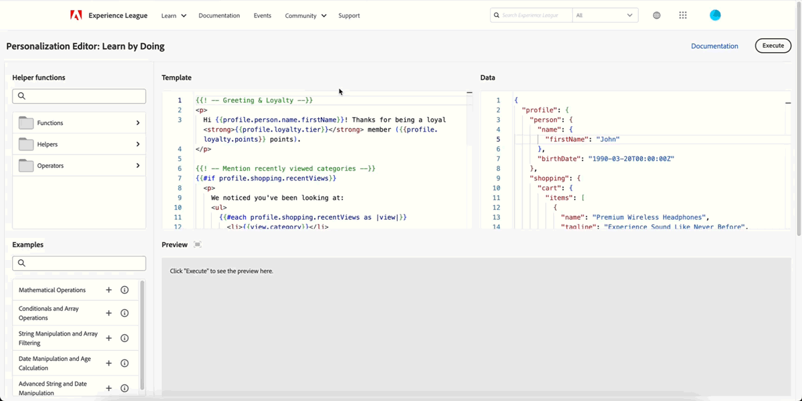

# Aanvullende informatie 2025 {#release-notes-2025}

Deze pagina bevat een overzicht van alle functies en verbeteringen die [!DNL Journey Optimizer] in 2025 heeft uitgebracht.

## Opmerkingen bij de release van april &#39;25 {#25-4-rn}

**de datum van de Versie**: 29-30 april, 2025

### Nieuwe functies {#25-04-features}

De nieuwe mogelijkheden die bij deze release worden geleverd, worden hieronder weergegeven.

<table>
<thead>
<tr>
<th><strong>Personalization Editor - Leren op actie</strong> </th>
</tr>
</thead>
<tbody>
<tr>
<td>

Er is nu een personalisatiespeelplaats beschikbaar, waar u kunt experimenteren met personalisatie-expressies. Zo kunt u voorbeeldsjablonen en nuttige taken verkennen om u te helpen aan de slag te gaan en uw eigen personalisatie-expressies uit te proberen.

Raadpleeg de <a href="../personalization/personalize.md#playground">gedetailleerde documentatie</a> voor meer informatie.

Beschikbaarheidsdatum: 24 april 2025

</td>
</tr>
</tbody>
</table>

<!--table>
<thead>
<tr>
<th><strong>Adobe Experience Manager as a Cloud Service integration</strong> </th>
</tr>
</thead>
<tbody>
<tr>
<td>

The integration between Adobe Journey Optimizer and Adobe Experience Manager as a Cloud Service is now released in General Availability (GA). This integration enables seamless content sourcing and management for personalized customer journeys.

For more information, refer to the <a href="../integrations/aem-templates.md">detailed documentation</a>.

</td>
</tr>
</tbody>
</table-->

<!--<table>
<thead>
<tr>
<th><strong>Simulate content variations (General Availability)</strong> </th>
</tr>
</thead>
<tbody>
<tr>
<td>

Previously available in beta, content variations simulation is now generally available (GA). It allows you to preview different variations of your content using sample input data uploaded from a CSV or JSON file or added manually. All the attributes used in your content for personalization are automatically detected by the system and can be used for your tests to create multiple variants.

With the General Availability release, the feature now includes support for multilingual content and content experiments, enabling you to test variations across different languages and treatments. Additionally, it now supports contextual attributes (in addition to profile attributes), allowing for even more dynamic and situational content testing.

</td>
</tr>
</tbody>
</table>-->

<table>
<thead>
<tr>
<th><strong>LINE-kanaal</strong> </th>
</tr>
</thead>
<tbody>
<tr>
<td>

Adobe Journey Optimizer heeft zijn kanaalmogelijkheden uitgebreid om steun voor het kanaal van de LIJN te omvatten. Dankzij deze verbetering kunt u LINE-ervaringen maken, bewerken en voorvertonen, zodat u meer persoonlijke en boeiende interacties kunt maken. Met LINE, kunt u met meer klanten verbinden, relevante inhoud verzenden, en uw overeenkomst verbeteren.

Het LINE kanaal wordt toegelaten voor klanten van Adobe Journey Optimizer op verzoek. Neem contact op met de klantenservice van Adobe of uw Adobe-vertegenwoordiger om de functie voor uw organisatie te activeren.

Raadpleeg de <a href="../line/get-started-line.md">gedetailleerde documentatie</a> voor meer informatie.
</td>
</tr>
</tbody>
</table>

<!--table>
<thead>
<tr>
<th><strong>Custom SMS provider (General Availability)</strong> </th>
</tr>
</thead>
<tbody>
<tr>
<td>

Adobe Journey Optimizer now supports custom SMS providers, allowing you to integrate your preferred SMS services for enhanced communication flexibility.

For more information, refer to the <a href="../sms/sms-configuration-custom.md">detailed documentation</a>.
</td>
</tr>
</tbody>
</table-->

<table>
<thead>
<tr>
<th><strong>Reiscijfers</strong> </th>
</tr>
</thead>
<tbody>
<tr>
<td>

De metriek van de reis zijn nu beschikbaar, toelatend u om de invloed van uw activiteiten over de belangrijkste metriek van uw zaken te meten en duidelijkere inzichten in uw prestaties te verstrekken.

 

Raadpleeg de <a href="../building-journeys/success-metrics.md">gedetailleerde documentatie</a> voor meer informatie.

Beschikbaarheidsdatum: 9 april 2025

</td>
</tr>
</tbody>
</table>

<!--<table>
<thead>
<tr>
<th><strong>Calendar view for campaign and journey inventory (Limited Availability)</strong> </th>
</tr>
</thead>
<tbody>
<tr>
<td>

A new calendar view is now available for campaigns and journey activations. This feature provides a visual representation of scheduled activities, allowing you to view and manage your campaigns and journeys more effectively. Selecting a calendar item opens a right rail with detailed information. This feature is currently in Limited Availability.

</td>
</tr>
</tbody>
</table>-->

<table>
<thead>
<tr>
<th><strong>Adobe Express-integratie (beperkte beschikbaarheid)</strong> </th>
</tr>
</thead>
<tbody>
<tr>
<td>

Adobe Journey Optimizer is nu geïntegreerd met Adobe Express, waardoor u uw creatieve middelen naadloos kunt verbinden met reisorchestratie. Deze integratie vereenvoudigt het proces om gepersonaliseerde inhoud over campagnes te ontwerpen en op te stellen. 

Deze integratie is momenteel niet beschikbaar voor gebruik met het gezondheidsschild of het privacyschild.

Raadpleeg de <a href="../integrations/express.md">gedetailleerde documentatie</a> voor meer informatie.

</td>
</tr>
</tbody>
</table>

<table>
<thead>
<tr>
<th><strong>Dagelijkse ritten activeren na voltooiing van batchsegmentatie (beperkte beschikbaarheid)</strong> </th>
</tr>
</thead>
<tbody>
<tr>
<td>

Voor dagelijks geplande reizen, staat een nieuwe optie u toe om een tijdvenster van maximaal 6 uren te bepalen om op publieksgegevens van batch segmentatietaken te wachten, die ervoor zorgen reizen met de meest bijgewerkte gegevens lopen of worden overgeslagen als niet klaar. De optie Trigger na batchpublieksevaluatie is alleen beschikbaar voor een set organisaties (Beperkte beschikbaarheid). Neem contact op met uw Adobe-vertegenwoordiger voor toegang.

Raadpleeg de <a href="../building-journeys/read-audience.md#schedule">gedetailleerde documentatie</a> voor meer informatie.

</td>
</tr>
</tbody>
</table>

<!--table>
<thead>
<tr>
<th><strong>Themes in the Email Designer (Beta)</strong> </th>
</tr>
</thead>
<tbody>
<tr>
<td>

You can now quickly apply pre-approved styling themes to your email content to ensure brand consistency across all emails, speed up your campaign creation process and independently produce hight-quality emails while reducing dependency on design teams.

This capability is currently in beta version and only available to beta customers. To join the beta program, contact your Adobe representative.

For more information, refer to the <a href="../content-management/brands-score.md">detailed documentation</a>.

Availability date: May 5, 2025

</td>
</tr>
</tbody>
</table-->

<table>
<thead>
<tr>
<th><strong>Brand alignment score (Beta)</strong> </th>
</tr>
</thead>
<tbody>
<tr>
<td>

De functie voor de uitlijningsscore voor merken biedt duidelijke feedback rechtstreeks in de e-mailontwerper, zodat u kunt zien of uw inhoud wordt uitgelijnd op de toon, stijl en richtlijnen van uw merk. Deze functie is beschikbaar in Beta.

Raadpleeg de <a href="../content-management/brands-score.md">gedetailleerde documentatie</a> voor meer informatie.

</td>
</tr>
</tbody>
</table>

<!--
<table>
<thead>
<tr>
<th><strong>Decisioning - New AI formula builder</strong> </th>
</tr>
</thead>
<tbody>
<tr>
<td>

You can now create specific Decisioning ranking formulas by defining and combining criteria from a new improved interface. Ranking formulas allow you to define rules that will determine which decision items should be presented first, rather than taking into account the priority scores.

For more information, refer to the <a href="../content-management/brands-score.md">detailed documentation</a>.

Availability date: May 5, 2025

</td>
</tr>
</tbody>
</table>
-->

### Verbeteringen {#25-04-improv}

**de voorproefAPI van campagnes**

Er zijn nieuwe API&#39;s beschikbaar voor het weergeven van voorvertoningen van campagnes, naast de bestaande mogelijkheden voor het verzenden van proeven. [Meer informatie](https://developer.adobe.com/journey-optimizer-apis/references/simulations/#operation/createCampaignPreview){target="_blank"}.

**Sandbox Tooling**

* **het hulpmiddel van Sandbox voor douaneacties**

  Aangepaste acties worden nu opgenomen in de lijst met Adobe Journey Optimizer-objecten die kunnen worden gekopieerd met de functie voor het maken van gereedschappen in de sandbox, waarmee tests en implementatie kunnen worden gestroomlijnd. [Meer informatie](../configuration/copy-objects-to-sandbox.md)

* **Sandbox tooling voor campagnes** - de datum van de Beschikbaarheid: 3 April, 2025

  U kunt campagnes nu kopiëren over meerdere sandboxen door de mogelijkheden voor exporteren en importeren van pakketten te gebruiken. Campagnes worden samen met alle punten gekopieerd met betrekking tot het profiel, het publiek, het schema, de gealigneerde berichten, en afhankelijke voorwerpen. Sommige items worden niet gekopieerd, zoals besluitvormingsitems, labels voor gegevensgebruik en taalinstellingen. [Meer informatie](../configuration/copy-objects-to-sandbox.md#custom-actions)

**Personalization**

* **Nieuwe contextafhankelijke attributen**

  Een nieuw contextueel attribuut, **Identiteitskaart van het Profiel van het Bericht**, is nu beschikbaar om van de verpersoonlijkingsredacteur te selecteren. Dit is een bericht-georiënteerd attribuut dat uniek elk bericht identificeert dat naar elk gericht profiel in een levering wordt verzonden. Deze unieke id kan bijvoorbeeld worden gebruikt als een URL-volgparameter om elke koppeling te onderscheiden die door ontvangers wordt geopend of aangeklikt.

* **bevolen attributen in attributenruit** - de datum van de Beschikbaarheid: 2 april, 2025

  In het venster Kenmerken in de verpersoonlijkingseditor worden nu standaard alleen gevulde kenmerken weergegeven. Als u alle kenmerken wilt weergeven, schakelt u de optie **[!UICONTROL Show only populated attributes]** uit met de knop Instellingen. [Meer informatie](../personalization/personalization-build-expressions.md)

**E-mailkanaal**

* **Gepersonaliseerde URL die** volgen - de datum van Beschikbaarheid: 30 April, 2025

  Voor meer flexibiliteit en controle over uw e-mailinstellingen kunt u nu al uw URL-volgparameters tegelijk aanpassen op het niveau van de configuratie van het e-mailkanaal in plaats van deze te doen in de e-mailontwerper voor elke koppeling in uw inhoud. [Meer informatie](../email/surface-personalization.md#personalize-url-tracking)

* **E-mail Designer** - Beschikbaarheidsdatum: 1 April, 2025

  Om de toegankelijkheid in Journey Optimizer te verbeteren, zijn er nu twee nieuwe velden beschikbaar in de E-mail-Designer: deze komen overeen met het element `<title>` en het kenmerk `lang` in het element `<html>` van uw e-mailinhoud. U kunt deze instellingen definiëren in aanvulling op het veld **[!UICONTROL Preheader]** in de sectie E-mail **[!UICONTROL Body]** . [Meer informatie](../email/email-metadata.md)

**de gevalplaybooks van het Gebruik**

* **het auteursrecht van Playbooks en het delen (Privé bèta)** - u kunt, uw eigen playbooks van het gebruikscase nu creëren beheren en delen. Deze mogelijkheid is momenteel alleen beschikbaar voor een aantal organisaties als een persoonlijke bètaversie. Neem contact op met uw Adobe-vertegenwoordiger voor toegang. [Meer informatie](../start/playbooks.md)

**Navigatie**

* **Inhoudsbeheer** - Beschikbaarheidsdatum: 2 april 2025

  Om uw inhoudsmalplaatjes en fragmenten gemakkelijk te beheren, kunt u omslagen nu gebruiken om hen effectiever te organiseren in een gestructureerde hiërarchie. Leer meer in de [ malplaatjes van de Inhoud ](../content-management/access-content-templates.md#folders) en [ Fragmenten ](../content-management/manage-fragments.md#folders) secties.

  >[!AVAILABILITY]
  >
  >Deze verbetering is slechts beschikbaar voor een reeks organisaties (Beperkte Beschikbaarheid).

<!--- **Folders for content templates and fragments** - Availability date: May 5, 2025

  Previously available for a set of organizations (LA), folders are now available to all users (GA) to manage their content templates and fragments. Folders let you organize your content templates and fragments more easily and effectively into a structured hierarchy.

<!--- **Right rail in campaigns list**  

  A right rail has been added to the campaigns list, providing detailed information when a campaign is selected.-->

<!--**Playbooks**

- **Create your own playbooks (Beta)**
  
  You can now create your own playbooks in Adobe Journey Optimizer, enabling greater customization and flexibility in journey planning.-->

## Opmerkingen bij de release van maart 25 {#25-3-rn}

### Nieuwe functies {#25-03-features}

De nieuwe mogelijkheden die met deze release worden geleverd, worden hieronder beschreven.

<!--table>
<thead>
<tr>
<th><strong>Integration with Adobe Express (Limited Availability)</strong> </th>
</tr>
</thead>
<tbody>
<tr>
<td>

The Adobe Express integration in Adobe Journey Optimizer lets you use Adobe Express's editing tools directly during content creation, enabling you to resize, remove backgrounds, crop, and convert assets to JPEG or PNG.

Adobe Express integration in Adobe Journey Optimizer is currently only available for a set of organizations (Limited Availability). It cannot be deployed for use with Healthcare Shield or Privacy and Security Shield.

For more information, refer to the <a href="../integrations/express.md">detailed documentation</a>.

 

</td>
</tr>
</tbody>
</table-->

<!--table>
<thead>
<tr>
<th><strong>Journey metrics</strong> </th>
</tr>
</thead>
<tbody>
<tr>
<td>

Journey metrics are now available, allowing you to measure the impact of your activities across the key metrics of your business and to provide clearer insights into your performance.

For more information, refer to the <a href="../building-journeys/success-metrics.md">detailed documentation</a>.

</td>
</tr>
</tbody>
</table-->

<!-- table>
<thead>
<tr>
<th><strong>Calendar view for journeys (Limited Availability)</strong> </th>
</tr>
</thead>
<tbody>
<tr>
<td>

A calendar view is now available in Journey Optimizer to visualize all journeys activations. From this view, you can browse your journeys and check details and properties.

This change is only available for a set of organizations (Limited Availability). To gain access, contact your Adobe representative.

For more information, refer to the <a href="../conflict-prioritization/rule-sets.md">detailed documentation</a>.

</td>
</tr>
</tbody>
</table-->

<table>
<thead>
<tr>
<th><strong>Integratie met Dynamic Media (beperkte beschikbaarheid)</strong> </th>
</tr>
</thead>
<tbody>
<tr>
<td>

Dynamische media-elementen zijn nu rechtstreeks beschikbaar en toegankelijk in Journey Optimizer. Dankzij deze integratie kunt u:
<ul>
<li>Middelen centraal beheren met realtime updates</li>
<li>Wijzig direct uw activa montages zoals breedte en hoogte</li>
<li>Dynamische mediasjablonen aanpassen door uw inhoud bij te werken en personalisatievelden toe te voegen</li>
</ul>

Deze integratie is alleen beschikbaar voor een aantal organisaties (beperkte beschikbaarheid). Neem contact op met uw Adobe-vertegenwoordiger voor toegang.

Raadpleeg de <a href="../integrations/aem-dynamic.md">gedetailleerde documentatie</a> voor meer informatie.

</td>
</tr>
</tbody>
</table>

<table>
<thead>
<tr>
<th><strong>Integratie met Adobe GenStudio (beperkte beschikbaarheid)</strong> </th>
</tr>
</thead>
<tbody>
<tr>
<td>

Om de marketingefficiëntie te verbeteren en de consistentie van uw merk te behouden, kunt u nu naadloos GenStudio for Performance Marketing-ervaringen integreren met Journey Optimizer. Op deze manier kunt u GenStudio-content voor AI-power maken samen met de geavanceerde orchestratiefuncties van Journey Optimizer.

Het gebruik van de GenStudio-integratie in Journey Optimizer is momenteel niet beschikbaar voor gebruik met het Healthcare Shield of Privacy and Security Shield (beperkte beschikbaarheid).

Raadpleeg de <a href="../integrations/genstudio.md">gedetailleerde documentatie</a> voor meer informatie.

</td>
</tr>
</tbody>
</table>

<table>
<thead>
<tr>
<th><strong>Flexibele publieksevaluatie (GA)</strong> </th>
</tr>
</thead>
<tbody>
<tr>
<td>

Eerder beschikbaar voor een reeks organisaties (LA), is de Flexible publieksevaluatie nu beschikbaar aan alle gebruikers (GA). Met deze functie kunt u een segmentatietaak uitvoeren op aanvraag voor een geselecteerd publiek, zodat u altijd over de meest actuele publieksgegevens beschikt voordat u deze doelt op Journey Optimizer-reizen en -campagnes.

Raadpleeg de <a href="../audience/creating-a-segment-definition.md#flexible">gedetailleerde documentatie</a> voor meer informatie.

</tr>
</tbody>
</table>
</table>

<!--table>
<thead>
<tr>
<th><strong>LINE channel (Limited Availability)</strong> </th>
</tr>
</thead>
<tbody>
<tr>
<td>

Adobe Journey Optimizer has expanded its cross-channel capabilities to include support for the LINE channel. This enhancement allows you to create, edit, and preview LINE experiences enabling more personalized and engaging interactions. With LINE, you can connect with more customers, send relevant content, and improve your engagement.

This capability is only available for a set of organizations (Limited Availability). To gain access, contact your Adobe representative.

For more information, refer to the <a href="../conflict-prioritization/rule-sets.md">detailed documentation</a>.

</td>
</tr>
</tbody>
</table-->

### Verbeteringen {#25-03-improv}

**de redacteur van Personalization** (beschikbaarheidsdatum: Maart 12)

De Journey Optimizer personalization editor is bijgewerkt met nieuwe mogelijkheden:
* **Bijgewerkt Ontwerp van de Redacteur van de Code** - een helderdere, moderne interface voor betere bruikbaarheid en nadruk.
* **Onderzoek en vervang** - Toegevoegde functionaliteit om inhoud binnen de redacteur snel te vinden en te vervangen.
* **maak en herhaal Steun** ongedaan - staat u toe om veranderingen gemakkelijk terug te keren of opnieuw toe te passen.
* **Aanpasbare Grootte van de Doopvont** - laat aanpassing van de doopvontgrootte van de redacteur voor betere leesbaarheid toe.
* **Inline Bevestiging JSON** - verstrekt cliënt-zijbevestiging in real time voor inhoud JSON om foutenopsporing te versnellen.
* **auto-Volledig voor Profiel en de Attributen van de Context** - Biedt slimme suggesties aan om inhoudsverwezenlijking te stroomlijnen.
* **Verbeterde Syntaxis die** benadrukt - verbetert leesbaarheid door codestructuur visueel duidelijker te maken.

Raadpleeg de [gedetailleerde documentatie](../personalization/personalization-build-expressions.md) voor meer informatie.

**Goedkeuringen**

Wanneer u de voorwaarden voor een goedkeuringsbeleid definieert, kunt u nu filteren op Tag en/of Objectcategorie.

Raadpleeg de [gedetailleerde documentatie](../test-approve/approval-policies.md) voor meer informatie.

**Configuratie**

* U kunt nu Adobe Experience Platform Unified Tags toewijzen aan kanaalconfiguraties. Op deze manier kunt u ze gemakkelijk classificeren en kunt u zoeken en navigeren in alle lijsten verbeteren. [Meer informatie](../configuration/channel-surfaces.md#channel-config-tags)

* Wanneer u een e-mailsubdomein instelt of bewerkt in Journey Optimizer, kunt u er nu voor kiezen om de bijbehorende DMARC-record zelf te beheren, mits deze beschikbaar is in het bovenliggende domein. [Meer informatie](../configuration/dmarc-record.md#set-up-dmarc)

**Bedrijfs regels**

U kunt nu dagelijkse aftopping gebruiken in reizen en campagnes met batchsegmentatie. Om ervoor te zorgen dat de regels voor dagelijkse frequentiecapping correct zijn, moet u de naamruimte met de hoogste prioriteit kiezen tijdens het ontwerpen van een campagne of een reis. Leer meer over namespace prioriteit in de [ gids van de Dienst van de Identiteit van het Platform ](https://experienceleague.adobe.com/nl/docs/experience-platform/identity/features/identity-graph-linking-rules/namespace-priority){target="_blank"}

Ter herinnering: dagelijkse frequentiecapping in regelsets is alleen beschikbaar voor een set organisaties (beperkte beschikbaarheid). Neem contact op met uw Adobe-vertegenwoordiger voor toegang.

Voor meer informatie over bedrijfsregels, verwijs naar de [ gedetailleerde documentatie ](../conflict-prioritization/rule-sets.md).

**Contentsjablonen**

Sjablonen voor HTML-tekstinhoud zijn nu vervangen. U kunt nog steeds bestaande HTML-inhoudssjablonen gebruiken die eerder in [!DNL Journey Optimizer] zijn gemaakt. [ Leer meer op inhoudsmalplaatjes ](../content-management/content-templates.md)

<!--**Deliverability**

You can now choose to have your emails relayed to your SMTP servers instead of being sent directly from Journey Optimizer to ISPs. This allows you to route final email deliveries through your own Mail Transfer Agents and IPs, or to perform final validations on the emails before sending them to your recipients. The SMTP relay capacity is available on demand - contact your Adobe representative.-->

## Opmerkingen bij de release van februari &#39;25 {#25-02-rn}

**de datum van de Versie**: 18-19 februari, 2025

### Nieuwe functies {#25-02-features}

De nieuwe mogelijkheden die met deze release worden geleverd, worden hieronder beschreven.

<table>
<thead>
<tr>
<th><strong>Zakelijke regels maken en beheren</strong> </th>
</tr>
</thead>
<tbody>
<tr>
<td>

U kunt nu bedrijfsregels maken met behulp van regelsets. Regelsets zijn groepen regels die u helpen verzonden berichten binnen campagnes en reisacties te beperken over kanalen, en om de invoer van profielen in reizen te controleren.

<ul><li>Creeer kanaalregelreeksen om het aantal berichten te beperken die over één of veelvoudige kanalen worden verzonden. Pas ze toe op campagnes of reisacties om de regels af te dwingen die zijn gedefinieerd in de regelset. De de regelreeks van het kanaal staat u toe om het begrenzen regels toe te passen die op communicatie types worden gebaseerd. Stel bijvoorbeeld een regel in die is ingesteld op het beperken van 'promotionele berichten' en een andere regel voor 'nieuwsbrieven'. Pas de toepasselijke regel toe die in uw campagne of reisactie is ingesteld, afhankelijk van het type communicatie dat u verzendt.</li>
<li> Reisregelsets maken om profielinvoer in reizen te regelen. Beperk hoe vaak een profiel een reis binnen een bepaalde periode kan ingaan of het aantal reizen een profiel kan gelijktijdig worden ingeschreven. Pas deze toe op het niveau van de reis om te zorgen voor een goed beheer van de toegang.</li></ul>

Eerder beschikbaar voor een reeks organisaties (LA), zijn de bedrijfsregels nu beschikbaar aan alle gebruikers (GA). De bedrijfsregels voor het domein van de reis blijven slechts beschikbaar voor een beperkte reeks organisaties (LA).

Raadpleeg de <a href="../conflict-prioritization/rule-sets.md">gedetailleerde documentatie</a> voor meer informatie.

</td>
</tr>
</tbody>
</table>

<table>
<thead>
<tr>
<th><strong>Landingspagina's genereren met AI Assistant</strong> </th>
</tr>
</thead>
<tbody>
<tr>
<td>

Met behulp van AI Assistant kunt u nu aantrekkelijke inhoud voor uw openingspagina's maken, zoals ontwerpen op volledige pagina's, gepersonaliseerde tekst en aangepaste visuele elementen.

Raadpleeg de <a href="../content-management/generative-lp.md">gedetailleerde documentatie</a> voor meer informatie.

</td>
</tr>
</tbody>
</table>

<table>
<thead>
<tr>
<th><strong>Merken met AI Assistant (Beta)</strong> </th>
</tr>
</thead>
<tbody>
<tr>
<td>

U kunt nu uw eigen merken instellen om de visuele en verbale identiteit van uw merk te definiëren. 

Deze mogelijkheid wordt als een persoonlijke bètaversie vrijgegeven aan een beperkt aantal klanten. Het zal in toekomstige versies geleidelijk beschikbaar zijn voor alle klanten.

Raadpleeg de <a href="../content-management/brands.md">gedetailleerde documentatie</a> voor meer informatie.

</td>
</tr>
</tbody>
</table>

<table>
<thead>
<tr>
<th><strong>Aangepaste acties oplossen</strong> </th>
</tr>
</thead>
<tbody>
<tr>
<td>

U kunt nu een aangepaste actieconfiguratie valideren door echte API-aanroepen rechtstreeks vanuit Adobe Journey Optimizer te maken. Deze nieuwe mogelijkheid helpt u bij het oplossen van problemen met uw aangepaste handelingen voordat of nadat u deze hebt gebruikt voor een reis. 

Raadpleeg de <a href="../action/troubleshoot-custom-action.md">gedetailleerde documentatie</a> voor meer informatie.

<!--p> This capability is only available for a set of organizations (Limited Availability). To gain access, contact your Adobe representative.</p-->
</td>
</tr>
</tbody>
</table>

<table>
<thead>
<tr>
<th><strong>Flexibele publieksevaluatie (Beperkte Beschikbaarheid)</strong> </th>
</tr>
</thead>
<tbody>
<tr>
<td>

Dankzij de flexibele publieksevaluatie kunt u een segmentatietaak uitvoeren op aanvraag voor een geselecteerd publiek, zodat u altijd over de meest actuele publieksgegevens beschikt voordat u deze doelt op Journey Optimizer-reizen en -campagnes.

Raadpleeg de <a href="../audience/creating-a-segment-definition.md#flexible">gedetailleerde documentatie</a> voor meer informatie.

Deze mogelijkheid is alleen beschikbaar voor een aantal organisaties (beperkte beschikbaarheid). Neem contact op met uw Adobe-vertegenwoordiger voor toegang.

Beschikbaarheidsdatum: 28 januari 2025

</tr>
</tbody>
</table>
</table>

### Verbeteringen {#25-02-improvements}

De verbeteringen hieronder komen met de update van februari.

* **Tijd-aan-levende Dataset (TTL)** - Beginnend deze maand, zal een tijd-aan-levende (TTL) guardrail aan systeem-geproduceerde datasets van Journey Optimizer in nieuwe zandbakken en nieuwe organismen als volgt worden uitgerold:

   * 90 dagen voor gegevens in de profielopslag
   * 13 maanden voor gegevens in het data Lake

  Deze wijziging wordt in een volgende fase doorgevoerd in bestaande sandboxen voor klanten.

  Leer meer over deze update in [ specifieke FAQ ](../data/datasets-ttl.md#frequently-asked-questions).

<!--* **Playbooks** - You can now create and publish your own Use Case Playbooks in Journey Optimizer.-->

* **Directe post** - een nieuw servertype, Gegevens landende streek, wordt nu gesteund voor dossier dat in de directe configuratie van het postkanaal verplettert. [Meer informatie](../direct-mail/direct-mail-configuration.md#file-routing-configuration)

* **SMS** - u kunt SMS berichtlevering van multi-regionale eindpunten nu beheren door levering, terugkoppelen, binnenkomend, en callback URLs te overschrijven. Ter ondersteuning hiervan is een nieuwe veld Overschrijf-URL toegevoegd aan de configuratie van API-referenties. Deze wijziging is alleen beschikbaar bij de Sinch-provider. [Meer informatie](../sms/sms-configuration-sinch.md)

* **Personalization** (de datum van de Beschikbaarheid: Jan 29, 2025) - de Nieuwe datum/tijdhulpfuncties zijn beschikbaar voor gebruik in de verpersoonlijkingsredacteur. [Meer informatie](../personalization/functions/dates.md)

<!--
* The personalization editor has been enhanced with new capabilities such as Auto-complete, Search, and filtering options. You can also show or hide deprecated attributes.-->

* **E-mailconfiguratie** - als u toestemming buiten Adobe beheert, kunt u een douane plaatsen unsubscribe e-mailadres en een douane één-klik unsubscribe URL als deel van uw montages van de de kanaalconfiguratie van e-mail. [ las meer ](../email/list-unsubscribe.md#custom-managed)

  {width="80%"}

* **Beslissing** (de datum van de Beschikbaarheid: Jan 28, 2025) - het Besluiten steunt nu de gegevenstypes van Objecten wanneer het uitgeven van het schema van de puntcatalogus. [Meer informatie](../experience-decisioning/catalogs.md)
