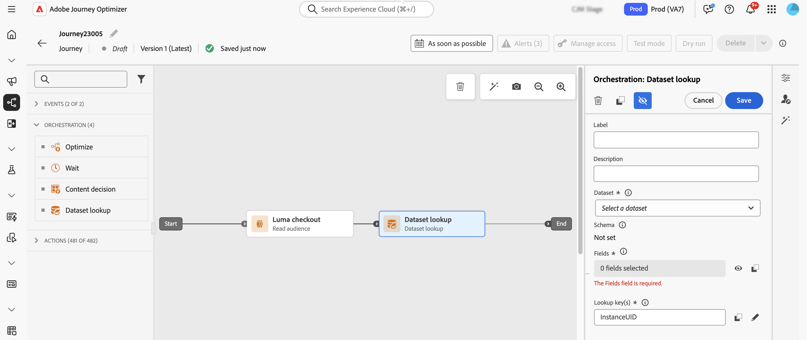
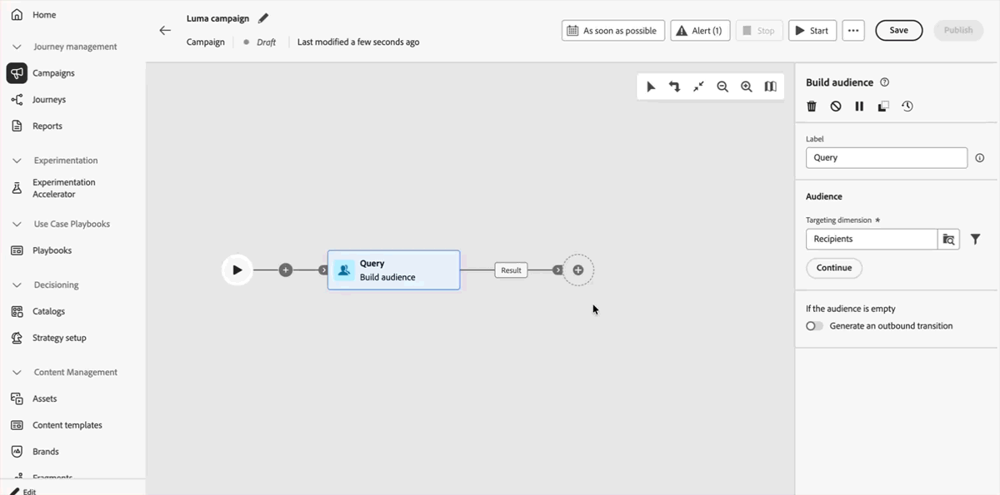

# Aanvullende informatie {#release-notes}

>[!CONTEXTUALHELP]
>id="ajo_homepage_card1"
>title="Nieuwe functies"
>abstract="**Adobe Journey Optimizer** levert onophoudelijk nieuwe mogelijkheden, verhogingen aan bestaande mogelijkheden, en insectenmoeilijke situaties. Alle wijzigingen worden geconsolideerd in de laatste week van elke maand in deze releaseopmerkingen."

[!DNL Adobe Journey Optimizer] volgt een doorlopend leveringsmodel, dat Adobe in staat stelt voortdurend nieuwe mogelijkheden, verbeteringen en oplossingen te bieden. Deze benadering maakt een schaalbare, gefaseerde implementatie van mogelijkheden mogelijk om prestaties en stabiliteit in alle omgevingen te garanderen.

Vanwege dit model worden releaseopmerkingen bijgewerkt tussen maandelijkse releases. Voor volledige details over de de versiecyclus en beschikbaarheidsfasen, zie [ de versiecyclus van Journey Optimizer ](releases.md).

[!DNL Adobe Journey Optimizer] is native gebaseerd op [!DNL Adobe Experience Platform] en neemt de nieuwste innovaties en verbeteringen over. Leer meer over deze veranderingen in [ de Nota&#39;s van de Versie van Adobe Experience Platform ](https://experienceleague.adobe.com/docs/experience-platform/release-notes/latest.html){target="_blank"}.

## Opmerkingen bij de release van maart 1926 {#march-26-rn}

De [ Nieuwe mogelijkheden ](#march-26-features) en [ secties van Verbeteringen ](#march-26-improv) behandelen reeds beschikbare mogelijkheden. De [ komende spoedig ](#coming-soon) sectie maakt een lijst van eigenschappen en verbeteringen die voor versie later in Maart worden gepland.

<!--
**The pre-release notes below are subject to change without prior notice until the release availability date**. Links, screens and updated documentation are published in the release notes, at the release date.

See also [Adobe Experience Platform pre-release notes](https://experienceleague.adobe.com/en/docs/experience-platform/release-notes/pre-release-notes){target="_blank"}.-->

**de datum van de Versie**: Maart 24-25, 2026

<table>
<thead>
<tr>
<th><strong>URL-parametercodering</strong> </th>
</tr>
</thead>
<tbody>
<tr>
<td>

URL-parameters in het bijhouden van koppelingen en bestemmingspagina's kunnen nu worden gecodeerd, zodat een extra beveiligingslaag voor vertrouwelijke parametergegevens beschikbaar is.

<ul>
<li>Registreer en beheer encryptiesleutels in een specifiek <strong> register van het Beleid </strong>.</li>
<li>Gebruik de nieuwe encryptiehelper in uitdrukkingen om gevoelige gegevens in het volgen van verbindingen en het landen pagina URLs voor de vraagparameters te coderen u bij teruggevende tijd wilt beschermen.</li>
</ul>

Deze mogelijkheid is alleen beschikbaar voor een aantal organisaties (beperkte beschikbaarheid). Neem contact op met uw Adobe-vertegenwoordiger voor toegang.

Raadpleeg de <a href="../personalization/url-parameter-encryption.md">gedetailleerde documentatie</a> voor meer informatie.

Beschikbaarheidsdatum: 31 maart 2026

</td>
</tr>
</tbody>
</table>

### Nieuwe functies {#march-26-features}

<table>
<thead>
<tr>
<th><strong>Aangepaste formulieren op de bestemmingspagina</strong> </th>
</tr>
</thead>
<tbody>
<tr>
<td>

Met [!DNL Journey Optimizer] kunt u profielkenmerken vastleggen via de bestemmingspagina's.

U kunt aangepaste formulieren maken, ontwerpen en beheren op basis van een specifieke gegevensset. U kunt deze formulieren vervolgens gebruiken in bestemmingspagina's om de profielkenmerken van uw keuze toe te voegen aan de gegevensset die voor elk formulier is gedefinieerd.

Eerder vrijgegeven in Beperkte Beschikbaarheid voor klanten in de Verenigde Staten en Australië, is dit vermogen nu beschikbaar aan alle milieu's (Algemene Beschikbaarheid).

Raadpleeg de <a href="../landing-pages/lp-forms.md">gedetailleerde documentatie</a> voor meer informatie.

Beschikbaarheidsdatum: 26 maart 2026.

</td>
</tr>
</tbody>
</table>

<table>
<thead>
<tr>
<th><strong>Testactiviteit in geordende campagnes</strong> </th>
</tr>
</thead>
<tbody>
<tr>
<td>

Een nieuwe <strong> activiteit van de Test </strong> is nu beschikbaar in Geordende Campagnes. Deze activiteit leidt werkschemauitvoering aan verschillende takken die op bepaalde voorwaarden worden gebaseerd, toelatend u om campagnelogica en configuraties te bevestigen alvorens levende leveringen te activeren.

Raadpleeg de <a href="../orchestrated/activities/test.md">gedetailleerde documentatie</a> voor meer informatie.

</td>
</tr>
</tbody>
</table>

<table>
<thead>
<tr>
<th><strong>Ondersteuning voor opzoeken van gegevenssets tijdens reizen</strong> </th>
</tr>
</thead>
<tbody>
<tr>
<td>

Een nieuwe <strong> opzoekactie van de Dataset </strong> activiteit in reizen laat u dynamisch gegevens van het recorddataset van Adobe Experience Platform bij runtime terugwinnen — die u toegang tot informatie geeft die geen deel van het profiel of gebeurtenislading uitmaakt, zodat blijven de klanteninteractie relevant en geschikt.

Eerder vrijgegeven in Beperkte Beschikbaarheid aan een beperkte reeks organisaties, is de opzoekactiviteit van Dataset in reizen nu beschikbaar aan alle klanten die recht hebben op [dataset lookup] (../data/lookup-aep-data.md), terwijl het blijven in Beperkte Beschikbaarheid.

Raadpleeg de <a href="../building-journeys/dataset-lookup.md">gedetailleerde documentatie</a> voor meer informatie.

</td>
</tr>
</tbody>
</table>

<table>
<thead>
<tr>
<th><strong>Actie vervangt kanaalspecifieke reisactiviteiten</strong> </th>
</tr>
</thead>
<tbody>
<tr>
<td>

Na de Algemene Beschikbaarheid van de <strong> activiteit van de Actie </strong> in Februari 2026, de activiteiten van het erfenisinheemse kanaal (E-mail, Duw, SMS, In-app, Web, op code-gebaseerde ervaring, en de Kaart van de Inhoud) in het reiscanvas worden nu afgekeurd.

U gebruikt nu één enkele <strong> activiteit van de Actie </strong> om alle kanaalacties te vormen, die de behoefte aan afzonderlijke kanaal-specifieke knopen vervangen.

Bestaande reizen die gebruikmaken van activiteiten van het oude kanaal blijven functioneren zonder dat er wijzigingen of migratie vereist zijn.

Raadpleeg de <a href="../building-journeys/journey-action.md">gedetailleerde documentatie</a> voor meer informatie.

</td>
</tr>
</tbody>
</table>

<table>
<thead>
<tr>
<th><strong>Geavanceerde HTML-editor voor e-mailsjablonen</strong> </th>
</tr>
</thead>
<tbody>
<tr>
<td>

Met de geavanceerde HTML-modus voor sjablonen voor e-mailinhoud kunt u de HTML-bron van uw inhoud bewerken in de e-mail Designer, geavanceerde expressies (zoals voorwaarden) toevoegen aan de bron en schakelen tussen de HTML-weergave en de Desktop-weergave zonder dat uw wijzigingen verloren gaan.

Deze mogelijkheid is alleen beschikbaar in inhoudssjablonen voor het e-mailkanaal. Het is momenteel in Beperkte Beschikbaarheid — neem contact op met uw Adobe-vertegenwoordiger om toegang te krijgen.

Raadpleeg de <a href="../content-management/email-template-expert-mode.md">gedetailleerde documentatie</a> voor meer informatie.

Beschikbaarheidsdatum: 10 maart 2026

</td>
</tr>
</tbody>
</table>

<table>
<thead>
<tr>
<th><strong>Integratie van aangepaste Firefly-modellen en modellen voor het genereren van images van derden</strong> </th>
</tr>
</thead>
<tbody>
<tr>
<td>

Zorgt voor een naadloze integratie van standaard- en aangepaste Firefly-modellen in combinatie met goedgekeurde externe afbeeldingsmodellen voor meer flexibiliteit, controle en uitlijning van merken bij het genereren van afbeeldingen.

Kies het juiste model voor uw behoeften:

<ul><li> <strong> Adobe model </strong> (aangedreven door Firefly Image Model 4) voor directe beeldgeneratie zonder extra opstelling</li><li> <strong> model van de Partner </strong> (aangedreven door Gemini 2.5 Flits) voor gespecialiseerde mogelijkheden</li><li><strong> de modellen van de Douane </strong> (merkspecifieke modellen die op uw eigen activa worden opgeleid) voor de generatie van het merk die precies op uw merkidentiteit, stijl, en visuele richtlijnen richt.</li></ul>

Raadpleeg de <a href="../content-management/generative-models.md">gedetailleerde documentatie</a> voor meer informatie.

Beschikbaarheidsdatum: 2 maart 2026

</td>
</tr>
</tbody>
</table>

<table>
<thead>
<tr>
<th><strong>Live-activiteiten voor iOS</strong> </th>
</tr>
</thead>
<tbody>
<tr>
<td>

Breng ervaringen in real time rechtstreeks aan het Slot van uw klanten Screens en Dynamic Island met <strong> Live Activiteit van iOS </strong> in Adobe Journey Optimizer. Lever live updates, van bestelling volgen en vliegstatus tot aftellingen van gebeurtenissen, live scores en voortgang van de levering, zonder dat gebruikers uw app hoeven te openen. Houd je publiek op de hoogte en betrokken op precies het juiste moment, waar ze zijn.

Eerder in bèta is deze mogelijkheid nu beschikbaar voor alle omgevingen (algemene beschikbaarheid).

Raadpleeg de <a href="../mobile-live/get-started-mobile-live.md">gedetailleerde documentatie</a> voor meer informatie.

Beschikbaarheidsdatum: 3 maart 2026

</td>
</tr>
</tbody>
</table>

<table>
<thead>
<tr>
<th><strong>Journey Agent: Kanaalinhoud maken</strong> </th>
</tr>
</thead>
<tbody>
<tr>
<td>

Aangedreven door <strong> Adobe Experience Platform Agent Orchestrator </strong>, <strong> Journey Agent </strong> is beschikbaar in Journey Optimizer en laat u toe om reizen door een natuurlijke taalinterface te analyseren. U kunt kanaal-specifieke inhoud nu ook direct in Journey Agent produceren en beheren, creërend inhoud voor kanalen zoals e-mail en duw, het toepassen van en het voorvertonen van malplaatjes, het verfijnen van toon en stijl door herinneringen, en het openen van inhoud in <strong> Inhoud Designer </strong> voor in-context het uitgeven.

Deze mogelijkheid is alleen beschikbaar voor een aantal organisaties (beperkte beschikbaarheid). Neem contact op met uw Adobe-vertegenwoordiger voor toegang.

Raadpleeg de <a href="https://experienceleague.adobe.com/docs/experience-cloud-ai/experience-cloud-ai/agents/ajo-agent.html" target="_blank">gedetailleerde documentatie</a> voor meer informatie.

Beschikbaarheidsdatum: 4 maart 2026

</td>
</tr>
</tbody>
</table>

<table>
<thead>
<tr>
<th><strong>Controle AI-model</strong> </th>
</tr>
</thead>
<tbody>
<tr>
<td>

Met Journey Optimizer kunt u nu de gezondheid, de trainingsstatus en de prestaties van uw beslissingsAI-modellen controleren. Dit staat u toe om opleidingssucces te verifiëren, mislukkingen problemen op te lossen, en invloed op uw resultaten te begrijpen om de beste aanbiedingen voor elke klant te selecteren gebruikend AI. Merk op dat dit vermogen voor <strong> Beslissing </strong> slechts (niet voor de modellen van het Beheer van erfenisBesluit) beschikbaar is.

Dit vermogen is momenteel beschikbaar voor <strong> gepersonaliseerde optimalisering </strong> slechts modellen (niet auto-optimalisering).

Raadpleeg de <a href="../experience-decisioning/ranking/ai-model-observability.md">gedetailleerde documentatie</a> voor meer informatie.

Beschikbaarheidsdatum: 9 maart 2026

</td>
</tr>
</tbody>
</table>

<table>
<thead>
<tr>
<th><strong>Trigger Orchestrated campagnes gebruikend een signaal</strong> </th>
</tr>
</thead>
<tbody>
<tr>
<td>

De geordende campagnes kunnen nu via een <strong> API signaal </strong> worden teweeggebracht. Om deze opstelling te vormen, vorm de doelcampagne zoals <strong> teweeggebracht door een signaal </strong>, publiceer het, dan brand het gebruikend een API vraag. Alle parameters die in de API-aanroep zijn opgenomen, zijn beschikbaar als variabelen binnen de actieve campagne. Merk op dat signaal-teweeggebrachte georkesterde campagnes <strong> partij </strong> campagnes blijven en van API-teweeggebrachte campagnes verschillend zijn.

Raadpleeg de <a href="../orchestrated/trigger-orchestrated-campaign.md">gedetailleerde documentatie</a> voor meer informatie.

</td>
</tr>
</tbody>
</table>

<table>
<thead>
<tr>
<th><strong>Transactiecategorie in geordende campagnes</strong> </th>
</tr>
</thead>
<tbody>
<tr>
<td>

In Geordende campagnes, kunt u een kanaalactiviteit aan de <strong> Transactionele </strong> categorie nu plaatsen. Dit past transactiekanaalconfiguraties op die activiteit toe en is nuttig wanneer de bedrijfsregels niet zouden moeten van toepassing zijn of wanneer de opt-in van klanten niet wordt vereist.

Raadpleeg de <a href="../orchestrated/activities/channels.md#add">gedetailleerde documentatie</a> voor meer informatie.

Dit vermogen zal de komende dagen geleidelijk aan naar alle regio's worden uitgebreid.

</td>
</tr>
</tbody>
</table>

### Verbeteringen {#march-26-improv}

De verbeteringen die bij deze release worden geleverd, worden hieronder weergegeven.

#### Rapportage

* **Send-Time Optimalisering: de bijgewerkte controleplaats en het nieuwe hefboomrapport** - de controles van de Optimalisering van de Send-Time (STO) zijn herplaatst aan het de configuratiemenu van de Actie. Bovendien is er nu een nieuw liftrapport beschikbaar in Dagrapporten om de impact van STO op de maatstaven van de prestaties van uw campagne te meten. [Meer informatie](../reports/channel-report-cja.md#optimization-models)

  Beschikbaarheidsdatum: 27 maart 2026

<!--

* **Exclude bot clicks for email and SMS reporting** - Email and SMS reporting now automatically filters out bot clicks from click metrics, providing more accurate engagement data and preventing automated traffic from inflating your performance figures.

#### Email Designer

* **Email Designer displayed in Unified Shell** - The Email Designer is now displayed within the Unified Shell experience, providing a consistent navigation and header experience that aligns with other Adobe applications.

* **Text mode support in fragments** - To support text-based email workflows, you can now create and manage text versions of your visual fragments for optimal use in the plain text version of emails that include that fragment.

  **Caution:** When using a fragment that was created before the current release, the fragment text version may be incorrectly rendered—both in the Email Designer and in the final email delivered to your recipients. For best results with older fragments, edit, save and republish each fragment.-->
<!--
#### Decisioning

* **Optional fragments in decision items** - When using fragments in decision items, you can now make a fragment optional so that if it is temporarily unavailable on Edge, it is skipped and the journey or campaign continues rendering instead of failing.
-->

#### Configuratie

<!--* **Folders for journeys and campaigns** - You can now organize your journeys and campaigns into folders, enabling structured navigation and easier management for teams working with large volumes of content. This capability is only available for a set of organizations (Limited Availability). To gain access, contact your Adobe representative.-->

* **de vernieuwing van het domeincertificaat van AJO is mislukt** - u kunt nu intekenen om systeemalarm, of door e-mail of in het het berichtcentrum van Journey Optimizer te ontvangen, wanneer een domeincertificaat dat voor e-maillevering wordt gebruikt bijna verloopt of reeds is verlopen. [Meer informatie](../reports/alerts.md#alert-certificates-renewal-unsuccessful)

  Beschikbaarheidsdatum: 26 maart 2026

* **de Secundaire de Naam van Dataset van de Gebeurtenis van de Terugkoppeling van AJO Secundaire Ontvanger** anders - de `AJO Email BCC Feedback Event` Dataset is anders genoemd aan `AJO Secondary Recipient Feedback Event` Dataset. Het effect varieert afhankelijk van uw situatie:

   * **Bestaande gebruikers**: Slechts wordt de vertoningsnaam bijgewerkt. De onderliggende tabelnaam blijft ongewijzigd.
   * **Nieuwe gebruikers en zandbakken**: Zowel wijzen de vertoningsnaam als de lijstnaam op de nieuwe naam.
   * **Bestaande gebruikers met nieuwe zandbakken**: Zowel worden de vertoningsnaam als de lijstnaam bijgewerkt aan de nieuwe naam.

  Beschikbaarheidsdatum: 2 maart 2026

#### Journeys

* **actie van het Profiel van de Update: steun voor veelvoudige profielattributen** - de **actie van het Profiel van de Update** steunt nu het bijwerken van tot vijf profielattributen in één enkele knoop. Eerder kon elke actie slechts één kenmerk tegelijk bijwerken, waarbij meerdere knooppunten verschillende kenmerken moesten bijwerken. Gebruik de nieuwe **Update een andere gebied** knoop om extra gebied/waardeparen toe te voegen, die canvasingewikkeldheid verminderen en prestaties verbeteren. [Meer informatie](../building-journeys/update-profiles.md)

* **Golf die berichten in reizen** verzendt - u kunt berichten van de reizen van Journey Optimizer nu plannen die in gecontroleerde partijen in tijd moeten worden geleverd. [Meer informatie](../building-journeys/send-using-waves.md)

  Eerder vrijgegeven in Beperkte Beschikbaarheid voor gebruik in reizen, is deze capaciteit nu beschikbaar aan alle milieu&#39;s (Algemene Beschikbaarheid).

  Beschikbaarheidsdatum: 16 maart 2026

* **Pauzeer en hervat details in reis technische details** - de reis **technische details** omvatten nu extra pauze en hervat informatie: de datum en de tijd van de laatste pauze en hervat, de vertoningsnaam en interne herkenningsteken van de gebruiker die elke actie, en een volledige reeks gepauzeerde reismontages zoals pauze gedrag, maximumpauzeduur, en auto-hervat staat uitvoerde. [Meer informatie](../building-journeys/journey-properties.md)

  Beschikbaarheidsdatum: 2 maart 2026

## Binnenkort beschikbaar {#coming-soon}

De onderstaande kenmerken en verbeteringen zullen later in maart/begin april worden gepubliceerd. De data en het werkingsgebied van de versie zijn **onderworpen aan verandering zonder voorafgaande kennisgeving**.

### Mogelijkheden

<table>
<thead>
<tr>
<th><strong>Afbeeldingen converteren naar sjablonen voor e-mailinhoud</strong> </th>
</tr>
</thead>
<tbody>
<tr>
<td>

U kunt afbeeldingen nu rechtstreeks in Journey Optimizer converteren naar sjablonen voor e-mailinhoud. Gebruik een door AI aangedreven analyse om automatisch gestructureerde HTML-sjablonen te genereren op basis van visuele referenties, waardoor de ontwerptijd voor e-mail aanzienlijk korter wordt.

Eerder vrijgegeven in Beperkte Beschikbaarheid, is deze capaciteit nu beschikbaar aan alle milieu's (Algemene Beschikbaarheid). <a href="../content-management/image-to-html.md">Meer informatie</a>

Beschikbaarheidsdatum: 31 maart 2026

</td>
</tr>
</tbody>
</table>

<table>
<thead>
<tr>
<th><strong>Inbox</strong> </th>
</tr>
</thead>
<tbody>
<tr>
<td>

<strong> Inbox </strong> is een mobiele functionaliteit, beschikbaar met de Kaarten van de Inhoud, die klanten toelaat om een gecentraliseerde plaats binnen hun app of website tot stand te brengen om berichten te tonen die naar hun gebruikers worden verzonden. Dit breidt de levensduur van marketing mededelingen uit door ervoor te zorgen dat de berichten toegankelijk blijven zelfs nadat zij worden verworpen.

Beschikbaarheidsdatum: 1 april 2026

</td>
</tr>
</tbody>
</table>

<table>
<thead>
<tr>
<th><strong>Reispad optimaliseren</strong> </th>
</tr>
</thead>
<tbody>
<tr>
<td>

Gebruik de nieuwe Optimize knoop om specifieke doelgroepen te richten of A/B tests in werking te stellen om de beste weg te bepalen om aan uw zaken-centric KPIs te voldoen.
Dit hulpmiddel staat u toe om te testen en te variëren, en mededelingen, het rangschikken, en timing aan te passen om uw klanten het best te bereiken.

Eerder vrijgegeven in Beperkte Beschikbaarheid, is deze capaciteit nu beschikbaar aan alle milieu's (Algemene Beschikbaarheid). <a href="../building-journeys/optimize.md">Meer informatie</a>

Als deel van de Algemene Beschikbaarheid, introduceert deze versie <strong> experimenteertype </strong> selectie (A/B of multi-gewapende bandit) en <strong> schaal de winnaar </strong> voor unitaire reizen.

Beschikbaarheidsdatum: 3 april 2026

</td>
</tr>
</tbody>
</table>

<table>
<thead>
<tr>
<th><strong>Ondersteuning voor besluitvorming in e-mailkanaal</strong> </th>
</tr>
</thead>
<tbody>
<tr>
<td>

U kunt <strong> Beslissing </strong> nu gebruiken om de inhoud van uw e-mailberichten te personaliseren en te optimaliseren. Gebruik Prioriteitsscores, Formulas of AI-modellen om de meest relevante aanbiedingen en inhoud aan elke ontvanger weer te geven.

Eerder vrijgegeven in Beperkte Beschikbaarheid, is deze capaciteit nu beschikbaar aan alle milieu's (Algemene Beschikbaarheid). Met deze algemene beschikbaarheidsrelease worden spiegelpagina's nu ondersteund.

<!--
For more information, refer to the <a href="../experience-decisioning/create-decision-policy.md">detailed documentation</a>.
-->

Beschikbaarheidsdatum: 3 april 2026

</td>
</tr>
</tbody>
</table>

<!--
WAITING RELEASE DATE CONFIRMATION
* **Target dimension simplification in Orchestrated Campaigns** - The active targeting dimension is now shown on the workflow canvas, so you can see which dimension is used by a channel activity. The multi-entity segmentation flow is simpler as you no longer need a separate "Change dimension" activity. Moreover, you can now choose explicitly whether messages are sent at the profile level or at a secondary dimension level.

<--
TO ADD when Path optimization is GA:

* **Experiment type** - You can now choose between A/B experiment (fixed split at the start) or Multi-armed bandit (automatic split with weekly weight updates) when configuring a path experiment.

* **Path experimentation: Scale the Winner** - You can now automatically or manually roll out the winning path of an experiment to your full audience. Once a winner is determined, you can amplify its reach and effectiveness without constantly monitoring the experiment.
This capability is available only in unitary journeys (event-triggered and Audience qualifications). It is not available for Read audience journeys.

-->
