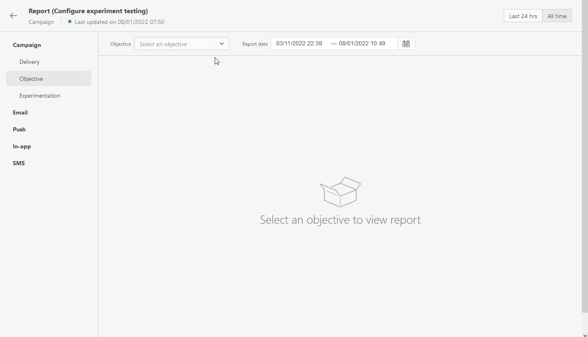

# Aanvullende informatie {#release-notes}

[!DNL Adobe Journey Optimizer] biedt voortdurend nieuwe functies, verbeteringen aan bestaande functies en oplossingen voor problemen. Alle wijzigingen worden geconsolideerd in de laatste week van elke maand in deze releaseopmerkingen.

Opmerkingen bij vorige release zijn beschikbaar in [deze pagina](release-notes-2022.md). U kunt ook de [meest recente documentatie-updates](documentation-updates.md) pagina voor meer wijzigingen.

[!DNL Adobe Journey Optimizer] is native [!DNL Adobe Experience Platform] en erft van de meest recente innovaties en verbeteringen. Meer informatie over deze wijzigingen vindt u in [Opmerkingen bij de release van Adobe Experience Platform](https://experienceleague.adobe.com/docs/experience-platform/release-notes/latest.html){target="_blank"}.

 Meld u aan voor de [Adobe Journey Optimizer driemaandelijkse nieuwsbrief](https://www.adobe.com/subscription/Adobe_Journey_Optimizer_NL.html){target="_blank"} vandaag, en ontvang de recentste productupdates, opwindende verhalen, gebruiksgevallen, uiteinden en meer die direct aan uw Postbus worden geleverd elk kwartaal.

## Opmerkingen bij de release februari 2023 {#feb-2023}

### Nieuwe functies{#feb-2023-features}

<table>
<thead>
<tr>
<th><strong>Kanaal in app (bèta)</strong> </th>
</tr>
</thead>
<tbody>
<tr>
<td>

U kunt nu binnen een campagne persoonlijke In-app-berichten naar gebruikers van de app sturen. Met Journey Optimizer kunt u meldingen ontwerpen en de lay-out, weergave, tekst en knoppen van berichten aanpassen voor een naadloze ervaring.

<strong>Waarschuwing</strong> - Deze functie is momenteel in bètaversie beschikbaar voor bètaklanten. Neem contact op met de klantenservice van Adobe om deel te nemen aan het bètaprogramma.

Raadpleeg de <a href="../in-app/get-started-in-app.md">gedetailleerde documentatie</a> voor meer informatie.

</td>
</tr>
</tbody>
</table>

<table>
<thead>
<tr>
<th><strong>Journey Optimizer-gegevenssets exporteren naar cloudopslagdoelen (bèta)</strong> </th>
</tr>
</thead>
<tbody>
<tr>
<td>

U kunt nu een live verbinding maken met opslaglocaties in de cloud om de inhoud van uw gegevenssets te exporteren. Beschikbare doelen zijn: Amazon S3 Cloud Storage, Azure Blob, Azure Data Lake Gen 2, Data Landing Zone, Google Cloud Storage, SFTP.

<strong>Waarschuwing</strong> - Deze functie is momenteel in bèta beschikbaar voor alle Adobe Journey Optimizer-gebruikers. Werk samen met uw Adobe-medewerker om toegang te krijgen tot Doelen als u nog geen toegang hebt.

Raadpleeg de <a href="../data/export-datasets.md">gedetailleerde documentatie</a> voor meer informatie.

</td>
</tr>
</tbody>
</table>

<!--

<table>
<thead>
<tr>
<th><strong>Performance Measurement in campaigns</strong> </th>
</tr>
</thead>
<tbody>
<tr>
<td>

You can now measure the performance of your campaigns across inbound and outbound through dedicated reports. Adobe Journey Optimizer reports can retrieve additional metrics to use in the <strong>Objective</strong> tab of your campaign reports. 

For more information, refer to the <a href="../privacy/data-hygiene.md">detailed documentation</a>.

</td>
</tr>
</tbody>
</table>

+++ Learn more about Performance Measurement

The **[!UICONTROL Objective]** tab of your Campaign report allows you to better fine-tune your deliveries' reports by targeting one specific metric. With this feature, you can effectively track and analyze your campaign's performance and make informed decisions to improve your results.

The **[!UICONTROL Objectives]** listed are linked to **[!UICONTROL Datasets]** that define a connection to a system in order to retrieve additional information. A list of pre-configured **[!UICONTROL Objectives]** is available, but you can also customize your report by adding new **[!UICONTROL Datasets]** and defining your own objectives. 

By selecting the desired Objectives, the **[!UICONTROL Performance overview]** and **[!UICONTROL Campaign objective]** widgets provide a comprehensive and insightful summary of your delivery performance, allowing you to closely monitor and evaluate the success of your campaign.

With the **[!UICONTROL Campaign objective]** widget, you can also choose to compare your primary objective against another performance metric.

Note that each widget can be resized and deleted as needed.
+++

<table>
<thead>
<tr>
<th><strong>Use Tags in your Journeys</strong> </th>
</tr>
</thead>
<tbody>
<tr>
<td>

As a Journey Optimizer practitioner, you can now organize your business objects using tags. Tags are a quick and easy way of classifying objects to improve search. Tags are currently only available for Journeys.

</td>
</tr>
</tbody>
</table>

-->

### Verbeteringen {#feb-2023-improvements}

**Journeys**

* De **Wachttijd bij terugkeer** het veld is toegevoegd aan de eigenschappen van de reis . In dit veld kunt u de tijd definiëren die u moet wachten voordat een profiel de reis weer in één keer kan betreden (te beginnen met een gebeurtenis of een segmentkwalificatie). Hierdoor wordt voorkomen dat ritten meerdere keren ten onrechte worden geactiveerd voor dezelfde gebeurtenis. Het veld wordt standaard ingesteld op 5 minuten. [Meer informatie](../building-journeys/journey-gs.md#entrance)

* Er zijn verbeteringen aangebracht voor **begin- en einddatum van de reis**. Als u geen begindatum hebt opgegeven, wordt deze nu automatisch toegevoegd op het moment van publicatie. Voor **Segment lezen** voor reizen kunt u nu een einddatum toevoegen. Hiermee kunnen profielen automatisch worden afgesloten wanneer de datum wordt bereikt. [Meer informatie](../building-journeys/journey-gs.md#dates)

<!--

* The Journey canvas has been enhanced for a simpler and improved user experience. At the end of each path in the canvas, the empty placeholders have been removed. You can now simply add your activities by dragging them anywhere between nodes. [Learn more](../building-journeys/using-the-journey-designer.md)

* Timeout and error management has been improved in journeys. Timeout and error paths are now always added on the canvas. A new toolbar button is available to show/hide these paths. [Learn more](../building-journeys/journey-gs.md#timeout_and_error)

* A new type of system alert has been introduced. You can now get notified when a custom action fails. [Learn more](../reports/alerts.md)

* The Journey dashboard is now split in two tabs:
    * Use the **Overview** tab to access a new dashboard which displays key metrics related to your journeys.
    * Use the **Browse** tab to access list of all journeys.
-->

**Beheer**

* **Lijst van gewenste personen** - U kunt de lijst van gewenste personen nu downloaden als een CSV-bestand. [Meer informatie](../configuration/allow-list.md#download-allowed-list)

* **E-mailoppervlak** - Er is een extra controle toegevoegd aan de instellingen voor het e-mailoppervlak: als de MX-record voor het subdomein dat wordt gebruikt in het dialoogvenster **Reageren op (e-mailadres)** of in de **BCC-e-mailadres** is niet behoorlijk gevormd, kan de e-mailoppervlakte niet meer worden gecreeerd. U moet het gevormd hebben of een andere gebruiken. [Meer informatie](../email/email-settings.md#reply-to-email)

* **E-mailoppervlak** - In de **Parameters voor URL-tracking** sectie van de instellingen van het e-mailoppervlak, de limiet voor elke **Waarde** Het veld is bijgewerkt van 255 tekens naar 5 kB ten behoeve van compatibiliteit met Adobe Analytics-tracking. [Meer informatie](../email/email-settings.md#url-tracking)

**Beslissingsbeheer**

<!--
* **Placements** - Additional parameters have been added in placements creation screen. They allow you to control whether an offer can be duplicated across multiple placements, and to specify if the offer's content and metadata should be included in the API response. [Learn more](../offers/offer-library/creating-placements.md)
-->

* **URL-personalisatie** - Wanneer u URL&#39;s als inhoud toevoegt aan de representaties van uw aanbiedingen, kunt u deze URL&#39;s nu aanpassen met de Expressieeditor. [Meer informatie](../offers/offer-library/add-representations.md)

<!--
* **Capping** - You can now reset the offer capping counter on a daily, weekly or monthly basis. [Learn more](../offers/offer-library/add-constraints.md#capping)

* **Capping** - You can now choose which Adobe Experience Platform event should be looked at for offer decisioning capping. [Learn more](../offers/offer-library/add-constraints.md#capping)
-->

## Release van januari 2023 {#jan-2023-release}

### Nieuwe functies{#jan-2023-features}

<table>
<thead>
<tr>
<th><strong>Gegevenshygiëne</strong> </th>
</tr>
</thead>
<tbody>
<tr>
<td>

Adobe Experience Platform biedt een reeks mogelijkheden voor gegevenshygiëne waarmee u uw opgeslagen gegevens kunt beheren via programmatische verwijderingen van consumentengegevens en gegevenssets. Deze mogelijkheid is nu beschikbaar voor Adobe Journey Optimizer. 

U kunt uw gegevensopslag beheren om ervoor te zorgen dat de informatie wordt gebruikt zoals verwacht, wordt bijgewerkt wanneer onjuiste gegevens het bevestigen vereisen, en wordt geschrapt wanneer het organisatorische beleid het noodzakelijk acht.

<strong>Waarschuwing</strong> - Gegevenshygiëne-mogelijkheden zijn momenteel alleen beschikbaar voor organisaties die de <strong>Gezondheidsschild</strong> en <strong>Privacy- en beveiligingsschild</strong> add-on aanbiedingen.

Raadpleeg de <a href="../privacy/data-hygiene.md">gedetailleerde documentatie</a> voor meer informatie.
</td>
</tr>
</tbody>
</table>

<table>
<thead>
<tr>
<th><strong>E-mailinhoudssjablonen</strong> </th>
</tr>
</thead>
<tbody>
<tr>
<td>

U kunt nu zelfstandige inhoudssjablonen maken die u kunt gebruiken voor reizen en campagnes voor snel hergebruik.
 

Leer hoe u inhoudssjablonen kunt maken, bewerken en gebruiken in <a href="https://experienceleague.adobe.com/docs/journey-optimizer-learn/tutorials/email-channel/content-templates.html">deze video</a>. Raadpleeg de <a href="../email/content-templates.md">gedetailleerde documentatie</a> voor meer informatie.

</td>
</tr>
</tbody>
</table>

### Verbeteringen {#jan-2023-improvements}

**Journeys**

* Bij het toevoegen van een **Segmentkwalificatie** of **Segment lezen** in een reis, wordt namespace nu vooraf gevuld, door gebrek, met het laatst gebruikte namespace. Zie de [Segmentkwalificatie](../building-journeys/segment-qualification-events.md#about-segment-qualification) en [Segment lezen](../building-journeys/read-segment.md#configuring-segment-trigger-activity) secties.

* Op het reiscanvas is er een nieuwe knop beschikbaar op de werkbalk waarmee u een schermafbeelding van uw reis kunt downloaden.

**Email Designer**

* U kunt de e-mailinhoud nu exporteren vanuit de **HTML exporteren** -menu. Geëxporteerde bestanden zijn beschikbaar in een ZIP-bestand (archiefbestand).

**Beheer**

* Een nieuwe subsectie bevat aanbevelingen voor het opbouwen van de **Reageren op (e-mail)** het adresseren en waarborgen van een adequaat antwoordbeheer. [Meer informatie](../email/email-settings.md#reply-to-email)

* Bij het maken of bewerken **IP-pools**, worden de bijbehorende PTR- verslagen nu getoond in de IP lijst en wanneer het hangen over de geselecteerde IP adressen. [Meer informatie](../configuration/ip-pools.md#create-ip-pool)

* Nadat een IP pool in een kanaaloppervlakte is geselecteerd, is PTR- verslaginformatie nu zichtbaar wanneer het bedekken over de IP adressen. [Meer informatie](../email/email-settings.md#subdomains-and-ip-pools)

* De gebruikersinterface voor bewerken [PTR-records](../configuration/ptr-records.md#edit-ptr-record) en [uitvoeringsvelden](../configuration/primary-email-addresses.md) is bijgewerkt.

* De gebruikersinterface voor het maken en bewerken van subdomeinen is verbeterd. [Meer informatie](../configuration/delegate-subdomain.md)

* De onderdrukkingslijst **Recente uploads** scherm is bijgewerkt. [Meer informatie](../configuration/manage-suppression-list.md#recent-uploads)

**Campagnes**

* Er wordt nu automatisch een voorbeeld van een cURL-aanvraag gegenereerd die uitvoering van door de API geïnitieerde campagnes toestaat, en beschikbaar gesteld in het campagnescherm. [Meer informatie](../campaigns/api-triggered-campaigns.md)

**Personalisatie**

* Er zijn nieuwe hulpfuncties beschikbaar: formatCurrency, charCodeAt, stringToDate, toString, formatNumber en toHexString. Bovendien accepteert de functie toDateTimeOnly nu tekenreekstypen, datumvelden, lange en int-veldtypen. [Meer informatie](../personalization/functions/functions.md)
