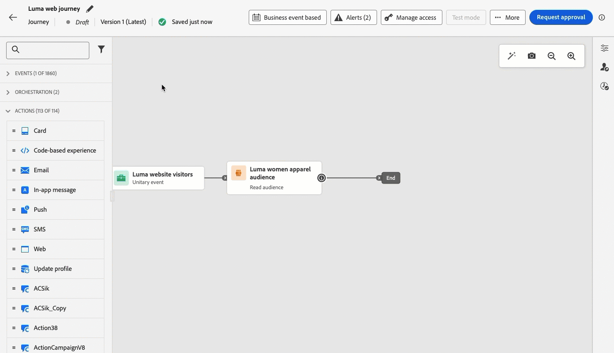

# Aanvullende informatie {#release-notes}

>[!CONTEXTUALHELP]
>id="ajo_homepage_card1"
>title="Nieuwe functies"
>abstract="**Adobe Journey Optimizer** levert onophoudelijk nieuwe eigenschappen, verhogingen aan bestaande eigenschappen, en insectenmoeilijke situaties. Alle wijzigingen worden geconsolideerd in de laatste week van elke maand in deze releaseopmerkingen."

[!DNL Adobe Journey Optimizer] biedt voortdurend nieuwe functies, verbeteringen aan bestaande functies en foutoplossingen. Alle wijzigingen worden geconsolideerd in de laatste week van elke maand in deze releaseopmerkingen. [!DNL Adobe Journey Optimizer] is native gebaseerd op [!DNL Adobe Experience Platform] en neemt de nieuwste innovaties en verbeteringen over. Leer meer over deze veranderingen in [ de Nota&#39;s van de Versie van Adobe Experience Platform ](https://experienceleague.adobe.com/docs/experience-platform/release-notes/latest.html) {target="_blank"}.

## Updates van oktober 1924 {#24-10-rn}

De komende **versiedatum**: Oktober 28-30, 2024

De [ hieronder vermelde mogelijkheden ](#24-10-features) en [ verbeteringen ](#24-10-improvements) zijn deze maand vrijgegeven.

### Nieuwe functies {#24-10-features}

<table>
<thead>
<tr>
<th><strong>Ervaringen op basis van code bij reizen</strong> </th>
</tr>
</thead>
<tbody>
<tr>
<td>

Met het op code-gebaseerde ervaringskanaal, staat Adobe Journey Optimizer u toe om geavanceerde verpersoonlijking en het testen voor om het even welk van uw binnenkomende eigenschappen te doen, toelatend naadloze levering van op maat gemaakte ervaringen over diverse aanraakpunten zoals Web apps, mobiele apps, Desktop apps, videoconsoles, TV aangesloten apparaten, slimme TVs, kiosks, ATMs, IoT apparaten, en meer. Het op code-gebaseerde ervaringskanaal is nu beschikbaar in het reiscanvas.

Raadpleeg de <a href="../code-based/create-code-based.md">gedetailleerde documentatie</a> voor meer informatie.

Beschikbaarheidsdatum: 1 oktober 2024

</tr>
</tbody>
</table>

<table>
<thead>
<tr>
<th><strong>Webervaringen tijdens reizen</strong> </th>
</tr>
</thead>
<tbody>
<tr>
<td>

Met het kanaal van het Web, staat Adobe Journey Optimizer u toe om de Webervaring te personaliseren u aan uw klanten door binnenkomende Webreizen levert. Het webkanaal is nu beschikbaar op het reiscanvas.

Raadpleeg de <a href="../web/create-web.md">gedetailleerde documentatie</a> voor meer informatie.

Beschikbaarheidsdatum: 1 oktober 2024

</tr>
</tbody>
</table>

### Verbeteringen {#24-10-improvements}

**Reizen** - de datum van de Beschikbaarheid: 3 okt, 2024

* **Parameters in douaneacties** - ONGELDIGE en facultatieve parameters worden nu gesteund in douaneacties. [Meer informatie](../action/about-custom-action-configuration.md#define-the-message-parameters)

**het bestuur van Gegevens &amp; het beleid van de Toestemming** - de datum van Beschikbaarheid: 7 okt, 2024

* **de handhaving van het beleid van het beheer van 0} Gegevens {vindt nu over alle kanalen in Journey Optimizer plaats.** Voor klanten die beleid in Adobe Experience Platform hebben gecreeerd, worden deze toegepast op marketing acties als deel van de opstelling van kanaalconfiguraties. Als u inhoud maakt met een configuratie, controleert het systeem alle personalisatievelden op overtredingen van het gegevensbeheer. Als er een overtreding wordt gevonden, is het niet mogelijk een reis of campagne te publiceren. [Meer informatie](../action/action-privacy.md)

* **het toestemmingsbeleid van de Douane** is nu op alle kanalen van Journey Optimizer van toepassing. Bij handhaving voordat een bericht wordt verzonden of een binnenkomende ervaring wordt opgeleverd, controleert het systeem of de gebruiker toestemming heeft gegeven om verpersoonlijkingsvelden te gebruiken in de inhoud die hij of zij zal ontvangen. Als er geen toestemming wordt gegeven, wordt de ervaring niet weergegeven. [Meer informatie](../action/consent.md)

  >[!NOTE]
  >
  >Het toestemmingsbeleid is momenteel slechts beschikbaar voor organisaties die het Adobe **het Schild van de Gezondheidszorg** of **Privacy en het 3} toe:voegen-op dienstenaanbod van het Schild van de Veiligheid hebben gekocht.**

**Soorten publiek** - Beschikbaarheidsdatum: 8 okt, 2024

* Wanneer het richten van een Csv- dossierpubliek, kunt u attributen van het dossier in de verpersoonlijkingsredacteur en in reizen en campagneregelbouwer nu gebruiken. [Meer informatie](../audience/about-audiences.md)

* Het gebruik van soorten publiek en kenmerken van aangepaste upload (CSV-bestand) is nu beschikbaar voor gebruik met het Healthcare Shield of Privacy and Security Shield.

## Release september 1924 {#24-9-rn}

<!--
>[!CAUTION]
>
>**Early release notes below are subject to change without prior notice until the release date**. Links, screens and updated documentation are published at the release date.
>
-->

**de datum van de Versie**: 24-26 september, 2024

### Nieuwe functies {#24-9-features}

Deze release biedt de nieuwe mogelijkheden die hieronder worden beschreven.

<table>
<thead>
<tr>
<th><strong>Inhoudskaarten voor mobiele apps en websites</strong> </th>
</tr>
</thead>
<tbody>
<tr>
<td>

Inhoudskaarten zijn een nieuwe functie voor digitale berichten in Adobe Journey Optimizer die persoonlijke en aantrekkelijke inhoud direct levert in mobiele apps en websites. In tegenstelling tot traditionele pushmeldingen worden inhoudskaarten naadloos geïntegreerd in de gebruikersinterface en bieden ze permanente, niet-indringende updates die de interactie en gebruikerservaring verbeteren.

Met deze functie kunnen marketers relevante, rijke media-inhoud presenteren aan gebruikers, waardoor hun betrokkenheid toeneemt en belangrijke berichten zichtbaar zijn zonder de reis van de gebruiker te verstoren.

Raadpleeg de <a href="../content-card/get-started-content-card.md">gedetailleerde documentatie</a> voor meer informatie.

</td>
</tr>
</tbody>
</table>

<table>
<thead>
<tr>
<th><strong>Goedkeuringen tijdens reizen en campagnes (LA)</strong> </th>
</tr>
</thead>
<tbody>
<tr>
<td>

Met het goedkeuringsbeleid kunt u nu een goedkeuringsproces in Journey Optimizer instellen dat marketingteams in staat stelt ervoor te zorgen dat campagnes en reizen worden gecontroleerd en ondertekend door de relevante belanghebbenden voordat ze live gaan.

Het goedkeuringsbeleid is momenteel alleen beschikbaar voor een aantal organisaties (beperkte beschikbaarheid). Neem contact op met uw Adobe als u toegang wilt.

Raadpleeg de <a href="../test-approve/gs-approval.md">gedetailleerde documentatie</a> voor meer informatie.

</td>
</tr>
</tbody>
</table>

<!--<table>
<thead>
<tr>
<th><strong>Email Content Locking</strong> </th>
</tr>
</thead>
<tbody>
<tr>
<td>

Journey Optimizer now allows you to lock content in email templates, either by locking the entire template or specific structures and component. This allows you to prevent unintentional edits or deletions, giving you greater control over template customization, and improving the efficiency and reliability of your email campaigns.

For more information, refer to the <a href="../content-management/gs-generative.md">detailed documentation</a>.

</td>
</tr>
</tbody>
</table>-->

<table>
<thead>
<tr>
<th><strong>Algemene criteria voor uitreis tijdens reizen</strong> </th>
</tr>
</thead>
<tbody>
<tr>
<td>

Nu definieert u exit criteria op een niveau van transport. Door afsluitcriteria toe te voegen, sluiten de profielen de reis af zodra een gebeurtenis (bijvoorbeeld: Aankoop) plaatsvindt of komen zij in aanmerking voor een publiek. Dit zal de gebruiker verhinderen om het even welke verdere mededelingen van de reis te krijgen.

Raadpleeg de <a href="../building-journeys/journey-properties.md#exit-criteria">gedetailleerde documentatie</a> voor meer informatie.

</td>
</tr>
</tbody>
</table>

<table>
<thead>
<tr>
<th><strong>AI Assistant-versnelling voor inhoud </strong> </th>
</tr>
</thead>
<tbody>
<tr>
<td>

Als je bericht eenmaal hebt gemaakt en gepersonaliseerd, ga je naar het volgende niveau met de AI Assistant in Journey Optimizer for Content Acceleration. U kunt de AI-assistent nu gebruiken om de impact van uw bericht te optimaliseren door te experimenteren met verschillende hoofdtitels en afbeeldingen. Elke variant wordt beheerd als een unieke behandeling, om te meten en te vergelijken welke titel effectief meer kliks produceert.

Ga zelf in een hands-on ervaring met <a href="https://experienceleague.adobe.com/en/apps/journey-optimizer/ai-assistant-content-accelerator"> binnen onze levende eigenschapvoorproef </a>, die wordt ontworpen om u zijn eigenschappen eerst te laten onderzoeken en volledig zijn mogelijkheden te begrijpen.</a>

Raadpleeg de <a href="../content-management/gs-generative.md">gedetailleerde documentatie</a> voor meer informatie.

Beschikbaarheidsdatum: 12 september 2024

</td>
</tr>
</tbody>
</table>

<table>
<thead>
<tr>
<th><strong>Kanaal instellen met instructies</strong> </th>
</tr>
</thead>
<tbody>
<tr>
<td>

Met de functie Kanaalinstellingen met instructies kunt u kanaalinstellingen in één ervaring automatiseren en valideren, zodat u sneller aan de slag kunt met Journey Optimizer. Deze nieuwe, geleide opstelling stroomlijnt snelle kanaalconfiguratie, die ervoor zorgt dat alle noodzakelijke middelen gemakkelijk worden geïnstalleerd en binnen Experience Platform, Journey Optimizer, en de Inzameling van Gegevens werken. Hierdoor kunnen marketing-, product- en gegevensontwikkelingsteams snel beginnen met het maken van campagnes en reizen.

Raadpleeg de <a href="../configuration/set-mobile-config.md">gedetailleerde documentatie</a> voor meer informatie.

Beschikbaarheidsdatum: 3 september 2024

 
</td>
</tr>
</tbody>
</table>

>[!IMPORTANT]
>
>De huidige ervaring met rapportage wordt vanaf de release van oktober opgeheven. Na deze datum wordt de nieuwe ervaring met rapportage de norm. We raden u aan bekend te maken met de nieuwe functies en functies om een soepele overgang te garanderen.
>
> [ Leer hoe te om met Journey Optimizer te worden begonnen de nieuwe Rapporterende interface ](../reports/report-gs-cja.md)

### Verbeteringen {#24-9-improvements}

Deze release bevat de verbeteringen die hieronder worden vermeld.

**Soorten publiek** - de datum van de Beschikbaarheid: 17, 2024

<!--* The use of audiences from custom upload (CSV file) is now available for use with Privacy and Security Shield add-on.-->
* **het gebruik van de Vergunning** - het het gebruiksdashboard van de Vergunning toont nu de Engageable Profielen, in plaats van het Engageable publiek. [Meer informatie](../audience/license-usage.md)

**Inhoudsbeheer**

* U kunt nu inhoudssjablonen en fragmenten exporteren tussen sandboxen. [Meer informatie](../configuration/copy-objects-to-sandbox.md)

<!--**Data Governance**

* You can now apply data governance policies to Journey Optimizer channels, in addition to custom actions within journeys. This enhancement helps prevent the use of sensitive fields in communications by applying marketing actions directly within your channel configurations.    -->

<!--
**Conflict and priority management**

* **Priority score** - You can now assign a priority score to a campaign or a journey, ranging from 0 to 100. A higher number indicates a higher priority. When two campaigns or journeys use the same surface, Journey Optimizer will select the one with the highest priority score. If the campaigns have the same score, the campaign that was most recently modified will be chosen. Priority score is available for all inbound channels in campaigns, and for the in-app channel in journeys.    

* **View conflicts** - A new **View conflicts** button in journeys and campaigns now allows you to check whenever there's a possibility of overlap with other journeys or campaigns such as the start date, the targeted audience, or the selected channel configuration.
-->

**Reizen**

<!-- DOCAC-10977 * **Max number of Live journeys** - Journey Optimizer now has a guardrail of 500 live journeys on production sandboxes, instead of 100. The number of live journeys is visible in the journey canvas.-->

* **Levende rapporteringsverhogingen** - Levende Rapportering verstrekt inzicht in de prestaties van uw reizen in de afgelopen 24 uren. Wij hebben het verbeterd door nieuwe metriek (ingegaan, weggegaan, verworpen profielen en profielen in fout) toe te voegen die u toestaan om een diepgaander inzicht in gebruikersgedrag en prestaties direct van het canvas van de Reis te krijgen. [Meer informatie](../building-journeys/report-journey.md)

* (De datum van de Beschikbaarheid: Sept 10) **Automatische herpogingen op Gelezen Volmacht** - is nu toegepast door gebrek op publiek-getriggerde reizen (die met a **Gelezen Volgorde** of a **BedrijfsGebeurtenis** beginnen) terwijl het terugwinnen van de uitvoerbaan. Als er een fout optreedt tijdens het maken van de exporttaak, worden de pogingen om de 10mn opnieuw uitgevoerd, tot maximaal 1 uur. Daarna zullen we het als een mislukking beschouwen. Deze soorten reizen kunnen daarom tot 1 uur na de geplande tijd worden uitgevoerd. [Meer informatie](../building-journeys/read-audience.md#retries)

**E-mailkanaal**

* **kopbal van het Bericht in verzonden e-mail en exemplaar BCC** - een nieuwe kopbal is toegevoegd aan alle e-mailberichten. De waarde van deze koptekst is uniek voor elke verzonden e-mail en de bijbehorende BCC-e-mailkopie. Deze kopbal wordt ook opgeslagen in het bericht en BCC terugkoppelt datasets, die toestaat om het exemplaar BCC en de overeenkomstige verzonden e-mailinformatie met elkaar in overeenstemming te brengen. [Meer informatie](../configuration/archiving-support.md#bcc-header)

* **Spam het scoren** (GA) - u kunt uw inhoud nu controleren spam het scoren in een specifiek **Spam- rapport**. Gebruikend SpamAssassin, kan Adobe Journey Optimizer uw e-mailinhoud nu testen en het een score geven om erop te wijzen als ISPs of de leveranciers van de Brievenbus het als spam of niet zullen beschouwen. [Meer informatie](../content-management/spam-report.md)

**Sms-kanaal**

* **geef API geloofsbrieven uit** - u kunt montages in de Geloofsbrieven van SMS API, met inbegrip van updates aan opt-in/uit sleutelwoorden en antwoorden nu uitgeven.

**APIs**

* **de Simulatie API van de Campagne** - gebruik dit API om proefbaan van een Campagne teweeg te brengen. Het verzenden van de campagneproef is een asynchroon proces, zal API een proofJobId terugkeren die kan worden gebruikt om de status van de proef te controleren. [ leer meer ](https://developer.adobe.com/journey-optimizer-apis/references/simulations/) {target="_blank"}

* (De datum van de Beschikbaarheid: Sept 10) de [ documentatie van Adobe Journey Optimizer API ](https://developer.adobe.com/journey-optimizer-apis/references/simulations/) {target="_blank"} is nu interactief. Verken de API eindpunten rechtstreeks van de documentatiepagina&#39;s om directe feedback te krijgen en uw technische implementatie te versnellen.

  Alle API verwijzingspagina&#39;s hebben nu a **probeert het** functionaliteit die u kunt gebruiken om API vraag direct op de pagina van de documentwebsite te testen. [ krijgt de vereiste authentificatiegeloofsbrieven ](https://developer.adobe.com/journey-optimizer-apis/references/authentication/) {target="_blank"} en begint de functionaliteit te gebruiken om de API eindpunten te onderzoeken.

  Gebruik deze nieuwe functionaliteit om de verzoeken aan en de reacties van API eindpunten te onderzoeken, om directe feedback te krijgen en uw technische implementatie te versnellen.

  >[!CAUTION]
  >
  >Houd er rekening mee dat u met de interactieve API-functionaliteit op de documentatiepagina&#39;s echte API-aanroepen naar de eindpunten uitvoert. Houd dit in gedachten wanneer u experimenteert met productiesandboxes.

**Configuratie**

* **IP warmup plannen** - Dit vermogen is nu beschikbaar aan alle klanten, met inbegrip van organisaties die de Adobe **het Schild van de Gezondheidszorg** of **Privacy en het 5} toe:voegen-op dienstenaanbod van het Schild van de Veiligheid hebben gekocht.** [Meer informatie](../configuration/ip-warmup-gs.md)

 Teken omhoog voor het [ driemaandelijkse bulsletter van Adobe Journey Optimizer ](https://www.adobe.com/subscription/Adobe_Journey_Optimizer_NL.html) {target="_blank"} vandaag, en ontvang de recentste productupdates, opwindende verhalen, gebruiksgevallen, uiteinden en meer die rechtstreeks aan uw inbox elk kwart worden geleverd.