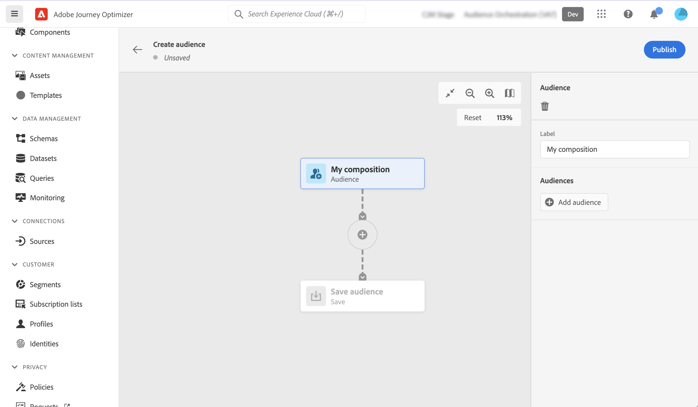

# Samenstellingswerkstromen maken {#create-compositions}

Met samenstellingsworkflows kunt u bestaande soorten publiek combineren en rangschikken om nieuwe soorten publiek te maken.

## Een compositieworkflow maken {#create}

1. Toegang krijgen tot **[!UICONTROL Segments]** en selecteert u **[!UICONTROL Create Audience]**.

1. Selecteer **[!UICONTROL Compose Audience]**.

   >[!NOTE]
   >
   >De **[!UICONTROL Build rule]** Met de methode waarmee u een nieuw segment kunt maken, kunt u [Segmenteringsservice](https://experienceleague.adobe.com/docs/experience-platform/segmentation/ui/overview.html).

   

1. Het compositicanvas wordt weergegeven met twee standaardactiviteiten:

   * **[!UICONTROL Audience]**: het uitgangspunt van uw samenstelling. Met deze activiteit kunt u een of meer soorten publiek selecteren als basis voor uw workflow.

   * **[!UICONTROL Save]**: de laatste stap van uw compositie. Met deze activiteit kunt u het resultaat van uw workflow opslaan in een nieuw publiek.
   Voor meer informatie over hoe te om activiteiten in het canvas van het samenstellingswerkschema te vormen, verwijs naar [Werken met het compositicanvas](composition-canvas.md).

1. Selecteer **[!UICONTROL Audience]** activiteit, dan specificeer een etiket voor uw samenstelling.

   >[!IMPORTANT]
   >
   >De **[!UICONTROL Audience]** het activiteitenetiket is het etiket van uw samenstelling. Zorg ervoor om een betekenisvolle naam te verstrekken om de samenstelling gemakkelijker in de lijst terug te winnen.

   

1. Vorm uw samenstelling door zo vele activiteiten toe te voegen zoals nodig tussen **[!UICONTROL Audience]** en **[!UICONTROL Save]** activiteiten. [Leer hoe u met het compositicanvas werkt](composition-canvas.md)

   

1. Zodra uw samenstelling klaar is, klik **[!UICONTROL Publish]** om de compositie te publiceren en het resulterende publiek op te slaan in Adobe Experience Platform.

   Als er tijdens het publiceren een fout optreedt, worden waarschuwingen weergegeven met informatie over hoe u het probleem kunt oplossen.

   

1. De compositie wordt gepubliceerd. Het resulterende publiek wordt opgeslagen in Adobe Experience Platform. <!-- and are ready to be targeted in Journey Optimizer campaigns. [Get started with campaigns](../campaigns/get-started-with-campaigns.md)-->

## Toegang tot composities {#access}

>[!CONTEXTUALHELP]
>id="ajo_ao_publish"
>title="Uw publiek publiceren"
>abstract="Publiceer uw compositie om het resulterende publiek of de doelgroepen op te slaan in Adobe Experience Platform."

Alle gemaakte composities zijn toegankelijk via de **[!UICONTROL Compositions]** tab. Ze kunnen meerdere statussen hebben:

* **[!UICONTROL Draft]**: de samenstelling is in uitvoering en is niet gepubliceerd.
* **[!UICONTROL Published]**: de samenstelling is gepubliceerd en het resulterende publiek is gered . <!-- and are available for use.-->
* **[!UICONTROL Archived]**: de samenstelling is gearchiveerd .

>[!NOTE]
>
>U kunt een bestaande samenstelling op elk ogenblik dupliceren of schrappen gebruikend de ellipse knoop in de lijst.

Meer informatie:

* [Aan de slag met publiekscompositie](get-started-audience-orchestration.md)
* [Werken met het compositicanvas](composition-canvas.md)
* [Toegang tot en beheer van het publiek](access-audiences.md)
