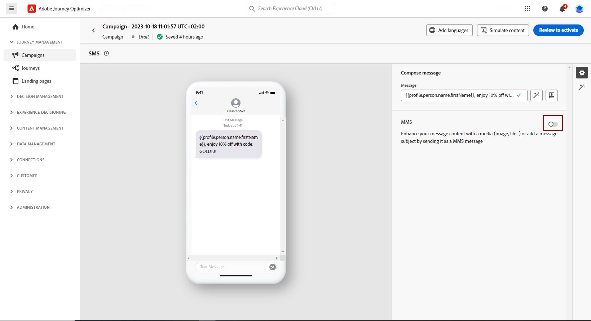

# Een MMS-bericht maken {#create-mms}

## Vereisten{#sms-prerequisites}

Voordat u uw SMS-bericht maakt, moet u eerst uw SMS-leverancier configureren met Journey Optimizer:

* Voordat u SMS verzendt, moet u de providerinstellingen integreren met Journey Optimizer.

+++ Leer hoe u een nieuwe Sinch MMS API-referentie maakt.

   1. Blader in de linkertrack naar **[!UICONTROL Administration]** > **[!UICONTROL Channels]** en selecteert u de **[!UICONTROL API Credentials]** -menu. Klik op de knop **[!UICONTROL Create new API credentials]**.

      

   1. Vorm uw geloofsbrieven van SMS API:

   * Voor **[!DNL Sinch MMS]**:

      * **[!UICONTROL Name]**: kies een naam voor uw API-referentie.

      * **[!UICONTROL Project ID]**, **[!UICONTROL App ID]** en **[!UICONTROL API Token]**: in het menu Conversation API vindt u uw referenties in het menu App.  [Meer informatie](https://docs.cc.sinch.com/cloud/service-configuration/en/oxy_ex-1/common/wln1620131604643.html)

     

   1. Klikken **[!UICONTROL Submit]** wanneer u de configuratie van uw API-referenties hebt voltooid.

  Nadat u de API-referentie hebt gemaakt en geconfigureerd, moet u nu een kanaaloppervlak (d.w.z. een voorinstelling voor berichten) voor SMS-berichten maken.

+++

* Zodra gedaan, zult u een oppervlakte van SMS moeten tot stand brengen. Deze stappen moeten worden uitgevoerd door een systeembeheerder van Adobe Journey Optimizer.

+++ Leer hoe u uw kanaaloppervlak maakt.

   1. Blader in de linkertrack naar **[!UICONTROL Administration]** > **[!UICONTROL Channels]** en selecteert u **[!UICONTROL Branding]** > **[!UICONTROL Channel surfaces]**. Klik op de knop **[!UICONTROL Create channel surface]**.

      

   1. Voer een naam en beschrijving (optioneel) voor het oppervlak in en selecteer vervolgens het SMS-kanaal.

      

      >[!NOTE]
      >
      > Namen moeten beginnen met een letter (A-Z). Het mag alleen alfanumerieke tekens bevatten. U kunt ook het onderstrepingsteken gebruiken `_`, punt`.` en afbreekstreepje `-` tekens.

   1. Definieer de **SMS-instellingen**.

      

      Begin door te selecteren **[!UICONTROL SMS Type]** die samen met het oppervlak worden verzonden: **[!UICONTROL Transactional]** of **[!UICONTROL Marketing]**.

      * Kies **Marketing** voor promotionele SMS: voor deze berichten is toestemming van de gebruiker vereist.
      * Kies **Transactioneel** voor niet-commerciële berichten, zoals bevestiging van de bestelling, wachtwoordherstelmeldingen of leveringsgegevens.

      Wanneer u een SMS-bericht maakt, moet u een geldig kanaaloppervlak kiezen dat overeenkomt met de categorie die u voor uw bericht hebt geselecteerd.

      >[!CAUTION]
      >
      >**Transactioneel** SMS-berichten kunnen worden verzonden naar profielen die zich niet meer hebben geabonneerd op marketingberichten. Deze berichten kunnen alleen in specifieke contexten worden verzonden.

   1. Selecteer de **[!UICONTROL SMS configuration]** aan het oppervlak te koppelen.

      Voor meer over hoe te om uw milieu te vormen om de berichten van SMS te verzenden, verwijs naar [deze sectie](#create-api).

   1. Voer de **[!UICONTROL Sender number]** &#x200B; u voor uw mededelingen wilt gebruiken.

   1. Selecteer uw **[!UICONTROL SMS Execution Field]** om de **[!UICONTROL Profile attribute]** aan de telefoonaantallen van de profielen worden geassocieerd.

   1. Als u de functie URL-verkorting wilt gebruiken in uw SMS-berichten, selecteert u een item in het menu **[!UICONTROL Subdomain]** lijst.

      >[!NOTE]
      >
      >Om subdomain te kunnen selecteren, zorg ervoor u eerder minstens één subdomain van SMS hebt gevormd. [Meer informatie](sms-subdomains.md)

   1. Voer de **[!UICONTROL Opt-out number]** U wilt dit oppervlak gebruiken. Wanneer profielen weigeren van dit nummer, kunt u de profielen nog steeds berichten verzenden van andere nummers die u kunt gebruiken om SMS-berichten te verzenden met [!DNL Journey Optimizer].

      >[!NOTE]
      >
      >In [!DNL Journey Optimizer], SMS-optie-optie wordt niet meer op kanaalniveau beheerd. Het is nu specifiek voor een getal.

   1. Zodra alle parameters zijn gevormd, klik **[!UICONTROL Submit]** ter bevestiging. U kunt het kanaaloppervlak ook opslaan als concept en de configuratie later hervatten.

      

   1. Nadat het kanaaloppervlak is gemaakt, wordt het in de lijst weergegeven met de **[!UICONTROL Processing]** status.

      >[!NOTE]
      >
      >Als de controles niet succesvol zijn, leer meer over de mogelijke mislukkingsredenen in [deze sectie](#monitor-channel-surfaces).

   1. Als de controles zijn voltooid, krijgt het kanaaloppervlak de **[!UICONTROL Active]** status. Het is klaar om te worden gebruikt om berichten te leveren.

      

## Een SMS-bericht maken {#create-sms-journey-campaign}

Blader op de onderstaande tabbladen om te leren hoe u een SMS-bericht kunt toevoegen aan een campagne of een reis.

>[!BEGINTABS]

>[!TAB Een SMS-bericht toevoegen aan een reis]

1. Open uw reis en sleep een activiteit van SMS van **Handelingen** in het palet.

   

1. Verstrek basisinformatie over uw bericht (etiket, beschrijving, categorie), dan kies de berichtoppervlakte aan gebruik.

   

   Voor meer informatie over hoe te om een reis te vormen, raadpleeg [deze pagina](../building-journeys/journey-gs.md)

   De **[!UICONTROL Surface]** wordt standaard voorgevuld met het laatste oppervlak dat de gebruiker voor dat kanaal gebruikt.

U kunt nu de inhoud van uw SMS-bericht ontwerpen via het **[!UICONTROL Edit content]** knop. [Je SMS-inhoud definiëren](#sms-content)

>[!TAB Een SMS-bericht toevoegen aan een campagne]

1. Maak een nieuwe geplande of door API geactiveerde campagne, selecteer **[!UICONTROL SMS]** als uw actie en kies **[!UICONTROL App surface]** te gebruiken. [Meer informatie over de SMS-configuratie](sms-configuration.md).

   

1. Klik op **[!UICONTROL Create]**.

1. Van de **[!UICONTROL Properties]** sectie, uw campagne bewerken **[!UICONTROL Title]** en **[!UICONTROL Description]**.

   

1. Klik op de knop **[!UICONTROL Select audience]** om het publiek te bepalen om van de lijst van beschikbare publiek van Adobe Experience Platform te richten. [Meer informatie](../audience/about-audiences.md).

1. In de **[!UICONTROL Identity namespace]** , kiest u de naamruimte die u wilt gebruiken om de personen van het geselecteerde publiek te identificeren. [Meer informatie](../event/about-creating.md#select-the-namespace).

   

1. Klikken **[!UICONTROL Create experiment]** om uw inhoud te configureren experimenteert u en maakt u behandelingen om de prestaties te meten en de beste optie voor uw doelgroep te identificeren. [Meer informatie](../campaigns/content-experiment.md)

1. In de **[!UICONTROL Actions tracking]** in, geeft u op of u wilt bijhouden of er op koppelingen in uw SMS-bericht wordt geklikt.

1. Campagnes worden ontworpen om op een specifieke datum of op een terugkomende frequentie worden uitgevoerd. Leer hoe u de **[!UICONTROL Schedule]** van uw campagne in [deze sectie](../campaigns/create-campaign.md#schedule).

1. Van de **[!UICONTROL Action triggers]** kiest u de optie **[!UICONTROL Frequency]** van je SMS-bericht:

   * Eenmaal
   * Dagelijks
   * Wekelijks
   * Month

U kunt nu de inhoud van uw SMS-bericht ontwerpen via het **[!UICONTROL Edit content]** knop. [Ontwerp uw SMS-inhoud](#sms-content)

>[!ENDTABS]

## Uw MMS-inhoud definiëren{#mms-content}

1. Van het reis of scherm van de campagneconfiguratie, klik **[!UICONTROL Edit content]** om de inhoud van SMS te vormen.

1. Klik op de knop **[!UICONTROL Message]** om de Expressieeditor te openen.

   

1. Gebruik de expressie-editor om inhoud te definiëren en dynamische inhoud toe te voegen. U kunt elk kenmerk gebruiken, zoals de profielnaam of plaats. Meer informatie over [personalisatie](../personalization/personalize.md) en [dynamische inhoud](../personalization/get-started-dynamic-content.md) in de Uitdrukking redacteur.

1. Schakel de optie MMS in om media toe te voegen aan uw SMS-inhoud.

   >[!NOTE]
   >
   > De optie MMS is alleen beschikbaar bij Sinch. U moet een specifieke API-referentie maken om MMS te maken. [Meer informatie](sms-configuration.md#create-new-api)

   

1. Voeg een **[!UICONTROL Title]** naar uw media.

1. Voer de URL van uw media in het dialoogvenster **[!UICONTROL Media]** veld.

   

1. Klikken **[!UICONTROL Save]** en controleer uw bericht in de voorvertoning. U kunt **[!UICONTROL Simulate content]** om een voorvertoning weer te geven van uw verkorte URL&#39;s of gepersonaliseerde inhoud.

Je kunt nu je SMS-bericht testen en naar je publiek sturen. [Meer informatie](send-sms.md)
Zodra verzonden, kunt u het effect van uw SMS binnen de Campagne of rapporten van de Reis meten. Raadpleeg [deze sectie](../reports/campaign-global-report.md#sms-tab) voor meer informatie over rapporten.

>[!NOTE]
>
>In overeenstemming met de industriestandaarden en -voorschriften moeten alle SMS-marketingberichten een manier bevatten waarop de ontvangers hun abonnement gemakkelijk kunnen opzeggen. Om dit te doen, kunnen de ontvangers van SMS met opt-in en opt-out sleutelwoorden antwoorden. [Meer informatie over het beheren van opt-out](../privacy/opt-out.md#sms-opt-out-management-sms-opt-out-management)

**Verwante onderwerpen**

* [Je SMS-bericht bekijken, testen en verzenden](send-sms.md)
* [Sms-kanaal configureren](sms-configuration.md)
* [Sms-rapport](../reports/journey-global-report.md#sms-global)