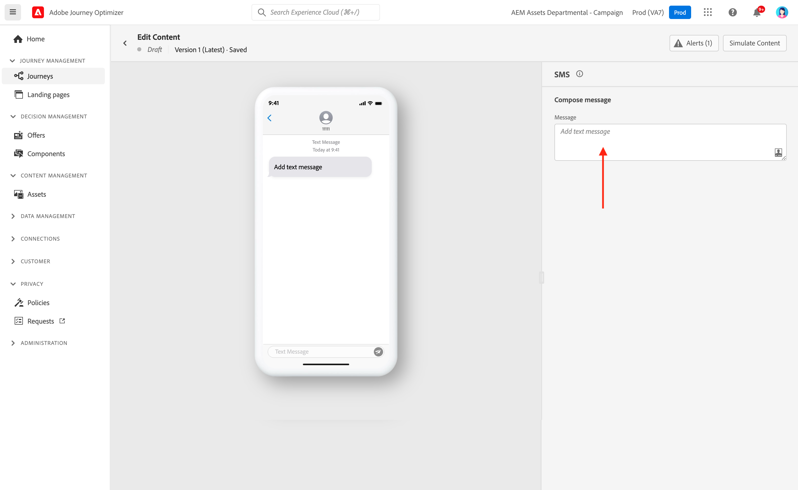

# Een tekstbericht maken {#create-sms}

>[!CONTEXTUALHELP]
>id="ajo_message_sms"
>title="Een tekstbericht maken"
>abstract="Om een tekstbericht te creëren, voeg een actie van SMS in een reis of een campagne toe en begin het met de redacteur van de Uitdrukking te personaliseren."

U kunt tekst (SMS) ontwerpen en verzenden met Adobe Journey Optimizer. U moet eerst een actie van SMS in een reis of een campagne toevoegen, en dan de inhoud van het tekstbericht bepalen, zoals hieronder beschreven. Adobe Journey Optimizer biedt ook mogelijkheden om uw tekstberichten te testen voordat ze worden verzonden, zodat u de rendering, personalisatiekenmerken en alle andere instellingen kunt controleren.

>[!NOTE]
>
>In overeenstemming met de industriestandaarden en -voorschriften moeten alle SMS-marketingberichten een manier bevatten waarop de ontvangers hun abonnement gemakkelijk kunnen opzeggen. Om dit te doen, kunnen de ontvangers van SMS met opt-in en opt-out sleutelwoorden antwoorden. [Meer informatie over het beheren van opt-out](../privacy/opt-out.md#sms-opt-out-management-sms-opt-out-management)

## Een tekstbericht toevoegen {#create-sms-journey-campaign}

Blader op de onderstaande tabbladen om te leren hoe u een tekstbericht kunt toevoegen aan een campagne of een reis.

>[!BEGINTABS]

>[!TAB Een tekstbericht toevoegen aan een reis]

1. Open uw reis en sleep een activiteit van SMS van **Handelingen** in het palet.

   

1. Verstrek basisinformatie over uw bericht (etiket, beschrijving, categorie), dan kies de berichtoppervlakte aan gebruik.

   

   Voor meer informatie over hoe te om een reis te vormen, raadpleeg [deze pagina](../building-journeys/journey-gs.md)

   De **[!UICONTROL Surface]** wordt standaard voorgevuld met het laatste oppervlak dat de gebruiker voor dat kanaal gebruikt.

U kunt nu de inhoud van uw SMS-bericht ontwerpen via het **[!UICONTROL Edit content]** zoals hieronder beschreven.

>[!TAB Een tekstbericht toevoegen aan een campagne]

1. Maak een nieuwe geplande of door API geactiveerde campagne, selecteer **[!UICONTROL SMS]** als uw actie en kies **[!UICONTROL App surface]** te gebruiken. Meer informatie over de configuratie van SMS in [deze pagina](sms-configuration.md).

   

1. Klik op **[!UICONTROL Create]**.

1. Van de **[!UICONTROL Properties]** sectie, uw campagne bewerken **[!UICONTROL Title]** en **[!UICONTROL Description]**.

   

1. Klik op de knop **[!UICONTROL Select audience]** om het publiek te bepalen om van de lijst van beschikbare publiek van Adobe Experience Platform te richten. [Meer informatie](../audience/about-audiences.md).

1. In de **[!UICONTROL Identity namespace]** , kiest u de naamruimte die u wilt gebruiken om de personen van het geselecteerde publiek te identificeren. [Meer informatie](../event/about-creating.md#select-the-namespace).

   

1. Klikken **[!UICONTROL Create experiment]** om uw inhoud te configureren experimenteert u en maakt u behandelingen om de prestaties te meten en de beste optie voor uw doelgroep te identificeren. [Meer informatie](../campaigns/content-experiment.md)

1. In de **[!UICONTROL Actions tracking]** in, geeft u op of u wilt bijhouden of er op koppelingen in uw SMS-bericht wordt geklikt.

1. Campagnes worden ontworpen om op een specifieke datum of op een terugkomende frequentie worden uitgevoerd. Leer hoe u de **[!UICONTROL Schedule]** van uw campagne in [deze sectie](../campaigns/create-campaign.md#schedule).

1. Van de **[!UICONTROL Action triggers]** kiest u de optie **[!UICONTROL Frequency]** van je SMS-bericht:

   * Eenmaal
   * Dagelijks
   * Wekelijks
   * Maand

U kunt nu de inhoud van uw tekstbericht ontwerpen via het **[!UICONTROL Edit content]** zoals hieronder beschreven.

>[!ENDTABS]

## Je SMS-inhoud definiëren{#sms-content}

>[!CONTEXTUALHELP]
>id="ajo_message_sms_content"
>title="Je SMS-inhoud definiëren"
>abstract="Pas de tekstberichten aan en pas deze aan door de uitdrukkingseditor te gebruiken om de inhoud te definiëren en dynamische elementen op te nemen."

Volg onderstaande stappen om uw SMS-inhoud te configureren.

1. Van het reis of scherm van de campagneconfiguratie, klik **[!UICONTROL Edit content]** om de inhoud van het tekstbericht te configureren.

1. Klik op de knop **[!UICONTROL Message]** om de Expressieeditor te openen.

   

1. Gebruik de uitdrukkingsredacteur om inhoud te bepalen, verpersoonlijking en dynamische inhoud toe te voegen. U kunt elk kenmerk gebruiken, bijvoorbeeld de profielnaam of plaats. U kunt ook voorwaardelijke regels definiëren. Blader naar de volgende pagina&#39;s voor meer informatie over [personalisatie](../personalization/personalize.md) en [dynamische inhoud](../personalization/get-started-dynamic-content.md) in de Uitdrukking redacteur.

1. Nadat u de inhoud hebt gedefinieerd, kunt u bijgehouden URL&#39;s aan uw bericht toevoegen. Om dit te doen, open **[!UICONTROL Helper functions]** en selecteert u **[!UICONTROL Helpers]**.

   Merk op dat om de functie te gebruiken die URL verkort, u eerst een subdomain moet vormen die dan aan uw oppervlakte zal worden verbonden. [Meer informatie](sms-subdomains.md)

   >[!CAUTION]
   >
   > Om tot subdomeinen van SMS toegang te hebben en uit te geven, moet u hebben **[!UICONTROL Manage SMS Subdomains]** toestemming voor de productiesandbox. Meer informatie over machtigingen in [deze sectie](../administration/high-low-permissions.md).

   

1. Binnen de **[!UICONTROL Helper functions]** menu, klikt u op **[!UICONTROL URL function]** en selecteer vervolgens **[!UICONTROL Add URL]**.

   

1. In de `originalUrl` veld, plak de URL die u wilt verkorten en klik op **[!UICONTROL Save]**.

1. Klikken **[!UICONTROL Save]** en controleer uw bericht in de voorvertoning. U kunt nu de inhoud van uw bericht testen en controleren zoals beschreven in [deze sectie](#sms-mms-test).

<!--
## Define your MMS content{#mms-content}

You can enhance your communication by sending Multimedia Message Service (MMS) messages, enabling the sharing of media such as videos, pictures, audio clips and GIFs, and more. Additionally, MMS allows for up to 1600 characters of text in your message.

>[!NOTE]
>
>* This feature is currently available with **Sinch** only.
>
>* MMS channel comes with a few limitations listed in [this page](../start/guardrails.md#sms-guardrails).
>

To create MMS content, follow these steps:

1. Create a SMS as described in [this section](#create-sms-journey-campaign).

1. Edit your SMS content as detailed in [this section](#sms-content).

1. Enable the MMS option to add media to your SMS content.

    

1. Add a **[!UICONTROL Title]** to your media.

1. Enter the URL of your media in the **[!UICONTROL Media]** field.

    

1. Click **[!UICONTROL Save]** and check your message in the preview. You can now test and check your message content as detailed below.
-->

## Uw berichten testen en verzenden {#sms-mms-test}

Gebruik de **[!UICONTROL Simulate content]** om een voorvertoning weer te geven van de inhoud van uw tekstbericht, verkorte URL&#39;s en gepersonaliseerde inhoud.

Nadat u de tests hebt uitgevoerd en de inhoud hebt gevalideerd, kunt u uw tekstbericht naar het publiek sturen. Deze stappen worden beschreven in [deze pagina](send-sms.md)

Zodra verzonden, kunt u het effect van uw SMS binnen de Campagne of rapporten van de Reis meten. Raadpleeg [deze sectie](../reports/campaign-global-report.md#sms-tab) voor meer informatie over rapporten.

**Verwante onderwerpen**

* [Een tekstbericht voorvertonen, testen en verzenden](send-sms.md)
* [Sms-kanaal configureren](sms-configuration.md)
* [SMS-rapporten](../reports/journey-global-report.md#sms-global)
* [Een bericht toevoegen tijdens een rit](../building-journeys/journeys-message.md)
* [Een bericht toevoegen aan een campagne](../campaigns/create-campaign.md)
